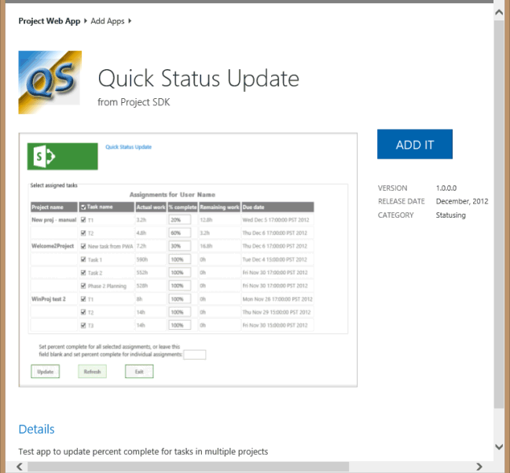
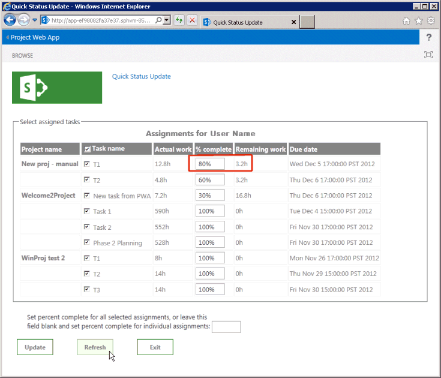

# <a name="create-a-sharepoint-hosted-project-server-add-in"></a><span data-ttu-id="4c53e-103">Erstellen eines auf SharePoint gehosteten Project Server-Add-Ins</span><span class="sxs-lookup"><span data-stu-id="4c53e-103">Create a SharePoint-hosted Project Server add-in</span></span>

<span data-ttu-id="4c53e-104">Von den drei Arten von apps, die Sie für Project online erstellen können (automatisch gehostet, von einem Anbieter gehostet und von SharePoint verwaltet), ist die in SharePoint gehostete App am einfachsten zu erstellen und bereitzustellen.</span><span class="sxs-lookup"><span data-stu-id="4c53e-104">Of the three types of apps that you can create for Project Online (autohosted, provider-hosted, and SharePoint-hosted), the SharePoint-hosted app is the simplest to create and deploy.</span></span> <span data-ttu-id="4c53e-105">Eine in SharePoint gehostete App erfordert keine OAuth-Authentifizierung, Sie verwendet weder Azure noch eine lokale Website für die vom Anbieter gehosteten Ressourcen.</span><span class="sxs-lookup"><span data-stu-id="4c53e-105">A SharePoint-hosted app does not require OAuth authentication, and does not use Azure or require maintenance of a local site for the provider-hosted resources.</span></span> <span data-ttu-id="4c53e-106">Die Vorlage **App für SharePoint 2013** in Visual Studio ist ein komfortables Framework für die Entwicklung von apps, die im Office Store veröffentlicht und verkauft oder in einem privaten App-Katalog auf SharePoint bereitgestellt werden können.</span><span class="sxs-lookup"><span data-stu-id="4c53e-106">The **App for SharePoint 2013** template in Visual Studio is a convenient framework for developing apps that can be published and sold in the Office Store or deployed to a private app catalog on SharePoint.</span></span> 
  
<span data-ttu-id="4c53e-107">In Project ist Statusing ein Prozess, bei dem ein Teammitglied die Seite Vorgänge in Project Web App verwenden kann, um den Status einer zugewiesenen Aufgabe zu übermitteln, beispielsweise die Anzahl der Stunden, die pro Tag einer Woche für die Arbeit an der Aufgabe verwendet wurden.</span><span class="sxs-lookup"><span data-stu-id="4c53e-107">In Project, statusing is a process where a team member can use the Tasks page in Project Web App to submit the status of an assigned task, such as the number of hours worked each day of a week spent working on the task.</span></span> <span data-ttu-id="4c53e-108">Der Zuordnungsbesitzer (in der Regel der Projektmanager) kann den Status genehmigen oder ablehnen.</span><span class="sxs-lookup"><span data-stu-id="4c53e-108">The assignment owner (usually the project manager) can approve or reject the status.</span></span> <span data-ttu-id="4c53e-109">Wenn der Status genehmigt wurde, berechnet Project den Zeitplan neu.</span><span class="sxs-lookup"><span data-stu-id="4c53e-109">When the status is approved, Project recalculates the schedule.</span></span> <span data-ttu-id="4c53e-110">Die **Quick Status** -APP zeigt zugewiesene Aufgaben an, bei denen der Benutzer die prozentuale Vollständigkeit und den Sendestatus der ausgewählten Zuordnungen für die Genehmigung schnell aktualisieren kann.</span><span class="sxs-lookup"><span data-stu-id="4c53e-110">The **QuickStatus** app displays assigned tasks, where the user can quickly update percent complete and submit status of the selected assignments for approval.</span></span> <span data-ttu-id="4c53e-111">Obwohl die Seite Aufgaben in Project Web App viel mehr Funktionalität aufweist, ist die **Quick Status** -App ein Beispiel, das eine vereinfachte Schnittstelle bereitstellt.</span><span class="sxs-lookup"><span data-stu-id="4c53e-111">Although the Tasks page in Project Web App has much more functionality, the **QuickStatus** app is an example that provides a simplified interface.</span></span> 
  
<span data-ttu-id="4c53e-112">Die **Quick Status** -APP ist ein Beispiel für Entwickler; Es ist nicht für die Verwendung in einer Produktionsumgebung vorgesehen.</span><span class="sxs-lookup"><span data-stu-id="4c53e-112">The **QuickStatus** app is a sample for developers; it is not intended for use in a production environment.</span></span> <span data-ttu-id="4c53e-113">Der Hauptzweck besteht darin, ein Beispiel für die APP-Entwicklung für Project online zu zeigen, nicht um eine voll funktionsfähige Status-APP zu erstellen.</span><span class="sxs-lookup"><span data-stu-id="4c53e-113">The primary purpose is to show an example of app development for Project Online, not to create a fully functional statusing app.</span></span> <span data-ttu-id="4c53e-114">Eine bessere Methode zur statusierung finden Sie in der Empfehlung in den [nächsten Schritten](#pj15_StatusingApp_NextSteps).</span><span class="sxs-lookup"><span data-stu-id="4c53e-114">For a better approach to statusing, see the recommendation in [Next steps](#pj15_StatusingApp_NextSteps).</span></span>
  
<span data-ttu-id="4c53e-115">Allgemeine Informationen zur statusierung finden Sie unter [Vorgangsfortschritt](https://support.office.com/article/Find-information-about-Project-Server-2013-8b08a414-15a7-4076-b2db-c90d0214ea7f?ui=en-US&rs=en-US&ad=US#BKMK_TaskProgress).</span><span class="sxs-lookup"><span data-stu-id="4c53e-115">For general information about statusing, see [Task progress](https://support.office.com/article/Find-information-about-Project-Server-2013-8b08a414-15a7-4076-b2db-c90d0214ea7f?ui=en-US&rs=en-US&ad=US#BKMK_TaskProgress).</span></span> <span data-ttu-id="4c53e-116">Weitere Informationen zum Entwickeln von Add-Ins für SharePoint und Project Server finden Sie unter [SharePoint-Add-ins](https://msdn.microsoft.com/library/jj163230.aspx).</span><span class="sxs-lookup"><span data-stu-id="4c53e-116">For more information about developing add-ins for SharePoint and Project Server, see [SharePoint Add-ins](https://msdn.microsoft.com/library/jj163230.aspx).</span></span>

<span data-ttu-id="4c53e-117"><a name="pj15_StatusingApp_Prerequisites"> </a></span><span class="sxs-lookup"><span data-stu-id="4c53e-117"></span></span>

## <a name="prerequisites-for-creating-an-app-for-project-server-2013"></a><span data-ttu-id="4c53e-118">VoraussetZungen für das Erstellen einer APP für Project Server 2013</span><span class="sxs-lookup"><span data-stu-id="4c53e-118">Prerequisites for creating an app for Project Server 2013</span></span>

<span data-ttu-id="4c53e-119">Zum entwickeln relativ einfacher apps, die für Project Online oder für eine lokale Installation von Project Server 2013 bereitgestellt werden können, können Sie den Napa verwenden, der eine Online Entwicklungsumgebung bereitstellt.</span><span class="sxs-lookup"><span data-stu-id="4c53e-119">To develop relatively simple apps that can be deployed to Project Online or to an on-premises installation of Project Server 2013, you can use the Napa, which provide an online development environment.</span></span> <span data-ttu-id="4c53e-120">Für komplexere apps, das Ändern des Project Web App-Menübands und das einfachere Debuggen während der Entwicklung können Sie Visual Studio 2012 oder Visual Studio 2013 verwenden.</span><span class="sxs-lookup"><span data-stu-id="4c53e-120">For more complex apps, modifying the Project Web App ribbon, and easier debugging during development, you can use Visual Studio 2012 or Visual Studio 2013.</span></span> <span data-ttu-id="4c53e-121">Bei einer lokalen Installation können Sie beispielsweise die Entwürfe-DataTables auf Änderungen in der Project Server-Datenbank manuell überprüfen.</span><span class="sxs-lookup"><span data-stu-id="4c53e-121">For example, with an on-premises installation, you can manually check the Drafts datatables for changes in the Project Server database.</span></span> <span data-ttu-id="4c53e-122">In diesem Artikel wird gezeigt, wie Sie die APP-Entwicklung mit Visual Studio ausführen.</span><span class="sxs-lookup"><span data-stu-id="4c53e-122">This article shows how to do app development with Visual Studio.</span></span>
  
<span data-ttu-id="4c53e-123">Für die Entwicklung von Project Server-apps mit Visual Studio ist Folgendes erforderlich:</span><span class="sxs-lookup"><span data-stu-id="4c53e-123">Development of Project Server apps with Visual Studio requires the following:</span></span>
  
- <span data-ttu-id="4c53e-p106">Stellen Sie sicher, dass Sie die neuesten Service Packs und Windows-Updates auf dem lokalen Entwicklungscomputer installiert haben. Als Betriebssystem kann Windows 7, Windows 8, Windows Server 2008 oder Windows Server 2012 verwendet werden.</span><span class="sxs-lookup"><span data-stu-id="4c53e-p106">Ensure that you have installed the most recent service packs and Windows updates on your local development computer. The operating system can be Windows 7, Windows 8, Windows Server 2008, or Windows Server 2012.</span></span>
    
- <span data-ttu-id="4c53e-126">Sie müssen über einen Computer verfügen, auf dem SharePoint Server 2013 und Project Server 2013 installiert ist, auf dem der Computer für die APP-Isolierung und querladen von apps konfiguriert ist.</span><span class="sxs-lookup"><span data-stu-id="4c53e-126">You must have a computer that has SharePoint Server 2013 and Project Server 2013 installed, where the computer is configured for app isolation and sideloading of apps.</span></span> <span data-ttu-id="4c53e-127">Querladen ermöglicht es Visual Studio, die App vorübergehend für das Debugging zu installieren.</span><span class="sxs-lookup"><span data-stu-id="4c53e-127">Sideloading enables Visual Studio to temporarily install the app for debugging.</span></span> <span data-ttu-id="4c53e-128">Sie können eine lokale Installation von SharePoint und Project Server verwenden.</span><span class="sxs-lookup"><span data-stu-id="4c53e-128">You can use an on-premises installation of SharePoint and Project Server.</span></span> <span data-ttu-id="4c53e-129">Weitere Informationen finden Sie unter [Einrichten einer lokalen Entwicklungsumgebung für Apps für SharePoint](https://msdn.microsoft.com/library/fp179923%28Office.15%29.aspx).</span><span class="sxs-lookup"><span data-stu-id="4c53e-129">For more information, see [Set up an on-premises development environment for apps for SharePoint](https://msdn.microsoft.com/library/fp179923%28Office.15%29.aspx).</span></span>
    
   > [!NOTE]
   > <span data-ttu-id="4c53e-130">Konfigurieren Sie bei einer lokalen Installation eine isolierte App-Domäne, *bevor* Sie einen Unternehmens-App-Katalog erstellen.</span><span class="sxs-lookup"><span data-stu-id="4c53e-130">For an on-premises installation, configure an isolated app domain  *before*  you create a corporate app catalog.</span></span> 
  
- <span data-ttu-id="4c53e-131">Der Entwicklungscomputer kann ein Remotecomputer sein, auf dem die Office Developer Tools für Visual Studio 2012 installiert sind.</span><span class="sxs-lookup"><span data-stu-id="4c53e-131">The development computer can be a remote computer that has Office Developer Tools for Visual Studio 2012 installed.</span></span> <span data-ttu-id="4c53e-132">Stellen Sie sicher, dass Sie die neueste Version installiert haben. Weitere Informationen finden Sie im Abschnitt " *Tools* " in den [Downloads für Apps für Office und SharePoint](https://msdn.microsoft.com/office/apps/fp123627.aspx).</span><span class="sxs-lookup"><span data-stu-id="4c53e-132">Ensure that you have installed the most recent version; see the  *Tools*  section of the [Apps for Office and SharePoint downloads](https://msdn.microsoft.com/office/apps/fp123627.aspx).</span></span>
    
- <span data-ttu-id="4c53e-133">Stellen Sie sicher, dass die Project Web App-Instanz, die Sie für die Entwicklung und das Testen verwenden, im Browser zugänglich ist.</span><span class="sxs-lookup"><span data-stu-id="4c53e-133">Verify that the Project Web App instance you will be using for development and testing is accessible in the browser.</span></span>
    
<span data-ttu-id="4c53e-134">Informationen zur Verwendung der Online Tools finden Sie unter [Einrichten einer Umgebung für die Entwicklung von Apps für SharePoint in Office 365](https://msdn.microsoft.com/library/fp161179.aspx).</span><span class="sxs-lookup"><span data-stu-id="4c53e-134">For information about using the online tools, see [Set up an environment for developing apps for SharePoint on Office 365](https://msdn.microsoft.com/library/fp161179.aspx).</span></span> <span data-ttu-id="4c53e-135">Eine exemplarische Vorgehensweise zum Erstellen einer einfachen App für Project Server, die die Online Tools verwendet, finden Sie in der EPMSource-Blog Reihe, die [Ihre erste Project Server-App aufbaut](https://epmsource.com/2012/11/20/building-your-first-project-server-app-part-zerothe-introduction/).</span><span class="sxs-lookup"><span data-stu-id="4c53e-135">For a walkthrough of building a simple app for Project Server that uses the online tools, see the EPMSource blog series, [Building your first Project Server app](https://epmsource.com/2012/11/20/building-your-first-project-server-app-part-zerothe-introduction/).</span></span>

<span data-ttu-id="4c53e-136"><a name="pj15_StatusingApp_UsingVisualStudio"> </a></span><span class="sxs-lookup"><span data-stu-id="4c53e-136"></span></span>

## <a name="using-visual-studio-to-create-a-project-server-app"></a><span data-ttu-id="4c53e-137">Verwenden von Visual Studio zum Erstellen einer Project Server-App</span><span class="sxs-lookup"><span data-stu-id="4c53e-137">Using Visual Studio to create a Project Server app</span></span>

<span data-ttu-id="4c53e-138">Office Developer Tools für Visual Studio 2012 enthält eine Vorlage für SharePoint-apps, die mit Project Server 2013 verwendet werden können.</span><span class="sxs-lookup"><span data-stu-id="4c53e-138">Office Developer Tools for Visual Studio 2012 includes a template for SharePoint apps that can be used with Project Server 2013.</span></span> <span data-ttu-id="4c53e-139">Wenn Sie eine APP-Lösung erstellen, enthält die Lösung die folgenden Dateien für Ihren benutzerdefinierten Code:</span><span class="sxs-lookup"><span data-stu-id="4c53e-139">When you create an app solution, the solution includes the following files for your custom code:</span></span>
  
- <span data-ttu-id="4c53e-140">**Datei AppManifest. XML** enthält Einstellungen für den APP-Titel, den Berechtigungs Anforderungsbereich und andere Eigenschaften.</span><span class="sxs-lookup"><span data-stu-id="4c53e-140">**AppManifest.xml** includes settings for the app title, permission request scope, and other properties.</span></span> <span data-ttu-id="4c53e-141">Prozedur 1 enthält Schritte zum Festlegen der Eigenschaften mithilfe des Manifest-Designers.</span><span class="sxs-lookup"><span data-stu-id="4c53e-141">Procedure 1 includes steps to set the properties by using the Manifest Designer.</span></span> 
    
- <span data-ttu-id="4c53e-142">**Default. aspx** im pages-Ordner ist die Hauptseite der app.</span><span class="sxs-lookup"><span data-stu-id="4c53e-142">**Default.aspx** in the Pages folder is the main page of the app.</span></span> <span data-ttu-id="4c53e-143">In Verfahren 2 wird gezeigt, wie Sie HTML5-Inhalte für die **Quick Status** -app hinzufügen.</span><span class="sxs-lookup"><span data-stu-id="4c53e-143">Procedure 2 shows how to add HTML5 content for the **QuickStatus** app.</span></span> 
    
- <span data-ttu-id="4c53e-144">**App. js** im Scripts-Ordner ist die primäre Datei für den benutzerdefinierten JavaScript-Code.</span><span class="sxs-lookup"><span data-stu-id="4c53e-144">**App.js** in the Scripts folder is the primary file for the custom JavaScript code.</span></span> <span data-ttu-id="4c53e-145">In Prozedur 3 wird der JavaScript-Code für die **Quick Status** -App erläutert.</span><span class="sxs-lookup"><span data-stu-id="4c53e-145">Procedure 3 explains the JavaScript code for the **QuickStatus** app.</span></span> 
    
   <span data-ttu-id="4c53e-146">Wenn Sie kommerzielle Steuerelemente wie eine jQuery-basierte Grid-oder Datumsauswahl hinzufügen, können Sie Verweise auf zusätzliche JavaScript-Dateien in der Datei default. aspx hinzufügen.</span><span class="sxs-lookup"><span data-stu-id="4c53e-146">If you add commercial controls such as a jQuery-based grid or date picker, you can add references to additional JavaScript files in the Default.aspx file.</span></span>
    
- <span data-ttu-id="4c53e-147">**App. CSS** im Inhaltsordner ist die primäre Datei für benutzerdefinierte CSS3-Formatvorlagen.</span><span class="sxs-lookup"><span data-stu-id="4c53e-147">**App.css** in the Content folder is the primary file for custom CSS3 styles.</span></span> <span data-ttu-id="4c53e-148">Prozedur 2 und Prozedur 3 schließen Informationen zu Cascading Stylesheets (CSS)-Formatvorlagen für die **Quick Status** -App ein.</span><span class="sxs-lookup"><span data-stu-id="4c53e-148">Procedure 2 and Procedure 3 include information about cascading style sheets (CSS) styles for the **QuickStatus** app.</span></span> <span data-ttu-id="4c53e-149">Sie können Verweise auf zusätzliche CSS-Dateien in der Datei default. aspx hinzufügen.</span><span class="sxs-lookup"><span data-stu-id="4c53e-149">You can add references to additional CSS files in the Default.aspx file.</span></span> 
    
- <span data-ttu-id="4c53e-150">**AppIcon. png** im Ordner Images ist das 96 x 96-Symbol, das von der APP im Office Store oder im App-Katalog angezeigt wird.</span><span class="sxs-lookup"><span data-stu-id="4c53e-150">**AppIcon.png** in the Images folder is the 96 x 96 icon that the app displays in the Office Store or the app catalog.</span></span> 
    
<span data-ttu-id="4c53e-151">Zum Ändern des Project Web App-Menübands können Sie eine benutzerdefinierte menübandaktion hinzufügen.</span><span class="sxs-lookup"><span data-stu-id="4c53e-151">To modify the Project Web App ribbon, you can add a ribbon custom action.</span></span> <span data-ttu-id="4c53e-152">Der [Beispielcode für den Quick Status-App](#pj15_StatusingApp_Example) -Abschnitt enthält den vollständigen Code für die geänderten Dateien default. aspx, App. js, App. CSS, Elements. XML und Datei AppManifest. Xml.</span><span class="sxs-lookup"><span data-stu-id="4c53e-152">The [Example code for the QuickStatus app](#pj15_StatusingApp_Example) section includes the complete code for the modified Default.aspx, App.js, App.css, Elements.xml, and AppManifest.xml files.</span></span> 
  
### <a name="procedure-1-to-create-an-app-project-in-visual-studio"></a><span data-ttu-id="4c53e-153">Prozedur 1.</span><span class="sxs-lookup"><span data-stu-id="4c53e-153">Procedure 1.</span></span> <span data-ttu-id="4c53e-154">So erstellen Sie ein App-Projekt in Visual Studio</span><span class="sxs-lookup"><span data-stu-id="4c53e-154">To create an app project in Visual Studio</span></span>

1. <span data-ttu-id="4c53e-155">Führen Sie Visual Studio 2012 als Administrator aus, und wählen Sie dann auf der Start Seite **Neues Projekt** aus.</span><span class="sxs-lookup"><span data-stu-id="4c53e-155">Run Visual Studio 2012 as an administrator, and then select **New Project** on the Start page.</span></span> 
    
2. <span data-ttu-id="4c53e-156">Erweitern Sie im Dialogfeld **Neues Projekt** den Knoten **Vorlagen**, **Visual C#** und **Office/SharePoint** , und wählen Sie dann **apps**aus.</span><span class="sxs-lookup"><span data-stu-id="4c53e-156">In the **New Project** dialog box, expand the **Templates**, **Visual C#**, and **Office/SharePoint** nodes, and then select **Apps**.</span></span> <span data-ttu-id="4c53e-157">Verwenden Sie das Standard- **.NET Framework 4,5** in der Dropdownliste Ziel Framework oben im mittleren Bereich, und wählen Sie dann **App für SharePoint 2013** (siehe Abbildung 1).</span><span class="sxs-lookup"><span data-stu-id="4c53e-157">Use the default **.NET Framework 4.5** in the target framework drop-down list at the top of the center pane, and then select **App for SharePoint 2013** (see Figure 1).</span></span> 
    
3. <span data-ttu-id="4c53e-158">Geben Sie im Feld **Name den Namen** Quick Status ein, navigieren Sie zu dem Speicherort, an dem Sie die APP speichern möchten, und klicken Sie dann auf **OK**.</span><span class="sxs-lookup"><span data-stu-id="4c53e-158">In the **Name** field, type QuickStatus, browse to the location where you want to save the app, and then choose **OK**.</span></span>
    
   <span data-ttu-id="4c53e-159">**Abbildung 1. Erstellen einer Project Server-app in Visual Studio**</span><span class="sxs-lookup"><span data-stu-id="4c53e-159">**Figure 1. Creating a Project Server app in Visual Studio**</span></span>

   <span data-ttu-id="4c53e-160">![Erstellen einer Project Server-app in Visual Studio] (media/pj15_CreateStatusingApp_NewProject.gif "Erstellen einer Project Server-app in Visual Studio")</span><span class="sxs-lookup"><span data-stu-id="4c53e-160"></span></span>
  
4. <span data-ttu-id="4c53e-161">Füllen Sie im Dialogfeld **neue APP für SharePoint** die folgenden drei Felder aus:</span><span class="sxs-lookup"><span data-stu-id="4c53e-161">In the **New app for SharePoint** dialog box, fill in the following three fields:</span></span> 
    
   - <span data-ttu-id="4c53e-162">Geben Sie im oberen Textfeld den Namen ein, der von der app in Project Web App angezeigt werden soll.</span><span class="sxs-lookup"><span data-stu-id="4c53e-162">In the top text box, type the name that you want the app to display in Project Web App.</span></span> <span data-ttu-id="4c53e-163">Geben Sie beispielsweise Quick Status Update ein.</span><span class="sxs-lookup"><span data-stu-id="4c53e-163">For example, type Quick Status Update.</span></span>
    
   - <span data-ttu-id="4c53e-164">Geben Sie die URL der Project Web App-Instanz ein, die für das Debugging verwendet werden soll.</span><span class="sxs-lookup"><span data-stu-id="4c53e-164">For the site to use for debugging, type the URL of the Project Web App instance.</span></span> <span data-ttu-id="4c53e-165">Geben `https://ServerName/ProjectServerName` Sie beispielsweise (ersetzen Sie _Servername_ und _ProjectServerName_ mit ihren eigenen Werten) ein, und wählen Sie dann **Validate**aus.</span><span class="sxs-lookup"><span data-stu-id="4c53e-165">For example, type  `https://ServerName/ProjectServerName` (replacing  _ServerName_ and  _ProjectServerName_ with your own values), and then choose **Validate**.</span></span> <span data-ttu-id="4c53e-166">Wenn alles gut verläuft, zeigt Visual Studio **Connection erfolgreich**an.</span><span class="sxs-lookup"><span data-stu-id="4c53e-166">If all goes well, Visual Studio shows **Connection successful**.</span></span> <span data-ttu-id="4c53e-167">Wenn Sie eine Fehlermeldung erhalten, stellen Sie sicher, dass die Project Web App-URL richtig ist und dass der Project Server-Computer für die APP-Isolierung und querladen von apps konfiguriert ist.</span><span class="sxs-lookup"><span data-stu-id="4c53e-167">If you get an error message, ensure that the Project Web App URL is correct and that the Project Server computer is configured for app isolation and sideloading of apps.</span></span> <span data-ttu-id="4c53e-168">Weitere Informationen finden Sie unter [vorausSetzungen für das Erstellen einer APP für den Project Server 2013](#pj15_StatusingApp_Prerequisites) -Abschnitt.</span><span class="sxs-lookup"><span data-stu-id="4c53e-168">For more information, see the [Prerequisites for creating an app for Project Server 2013](#pj15_StatusingApp_Prerequisites) section.</span></span> 
    
   - <span data-ttu-id="4c53e-169">Wählen Sie in der Dropdownliste **wie soll Ihre APP für SharePoint** gehostet werden die Option **SharePoint-Hosted**aus.</span><span class="sxs-lookup"><span data-stu-id="4c53e-169">In the **How do you want to host your app for SharePoint** drop-down list, choose **SharePoint-hosted**.</span></span>
    
   > [!CAUTION]
   > <span data-ttu-id="4c53e-170">Wenn Sie den standardmäßig vom **Anbieter gehosteten** Projekttyp versehentlich auswählen, erstellt Visual Studio zwei Projekte in der Projektmappe: ein **Quick Status** -Projekt und ein **QuickStatusWeb** -Projekt.</span><span class="sxs-lookup"><span data-stu-id="4c53e-170">If you choose the default **Provider-hosted** project type by mistake, Visual Studio creates two projects in the solution: a **QuickStatus** project and a **QuickStatusWeb** project.</span></span> <span data-ttu-id="4c53e-171">Wenn zwei Projekte angezeigt werden, löschen Sie diese Lösung, und starten Sie erneut.</span><span class="sxs-lookup"><span data-stu-id="4c53e-171">If you see two projects, delete that solution and start again.</span></span> 
  
5. <span data-ttu-id="4c53e-172">Klicken Sie auf **OK** , um die **Quick Status** -Lösung, das **Quick Status** -Projekt und die Standarddateien zu erstellen.</span><span class="sxs-lookup"><span data-stu-id="4c53e-172">Choose **OK** to create the **QuickStatus** solution, **QuickStatus** project, and default files.</span></span> 
    
6. <span data-ttu-id="4c53e-173">Öffnen Sie die Manifest-Designer-Ansicht (Doppelklicken Sie beispielsweise auf die Datei Datei AppManifest. Xml).</span><span class="sxs-lookup"><span data-stu-id="4c53e-173">Open the Manifest Designer view (for example, double-click the AppManifest.xml file).</span></span> <span data-ttu-id="4c53e-174">Auf der Registerkarte **Allgemein** sollte im Textfeld **Titel** der in Schritt 4 eingegebene App-Name angezeigt werden.</span><span class="sxs-lookup"><span data-stu-id="4c53e-174">On the **General** tab, the **Title** text box should show the app name that you typed in step 4.</span></span> <span data-ttu-id="4c53e-175">Klicken Sie auf die Registerkarte **Berechtigungen** , um die folgenden Berechtigungsanforderungen für die APP hinzuzufügen (siehe Abbildung 2):</span><span class="sxs-lookup"><span data-stu-id="4c53e-175">Choose the **Permissions** tab to add the following permission requests for the app (see Figure 2):</span></span> 
    
   - <span data-ttu-id="4c53e-176">Wählen Sie in der ersten Zeile der Liste **Berechtigungsanforderungen** in der Spalte **Bereich** die Option **Status** in der Dropdownliste aus.</span><span class="sxs-lookup"><span data-stu-id="4c53e-176">In the first row of the **Permission requests** list, in the **Scope** column, choose **Statusing** in the drop-down list.</span></span> <span data-ttu-id="4c53e-177">Wählen Sie in der Spalte **Berechtigung** die Option **SubmitStatus**aus.</span><span class="sxs-lookup"><span data-stu-id="4c53e-177">In the **Permission** column, choose **SubmitStatus**.</span></span>
    
   - <span data-ttu-id="4c53e-178">Fügen Sie eine Zeile hinzu, in der der **Bereich** **mehrere Projekte** ist und die **Berechtigung** **gelesen**wird.</span><span class="sxs-lookup"><span data-stu-id="4c53e-178">Add a row where the **Scope** is **Multiple Projects** and the **Permission** is **Read**.</span></span>
    
   <span data-ttu-id="4c53e-179">**Abbildung 2. Festlegen des Berechtigungs Bereichs für eine Status-App**</span><span class="sxs-lookup"><span data-stu-id="4c53e-179">**Figure 2. Setting the permission scope for a statusing app**</span></span>

   <span data-ttu-id="4c53e-180">![Festlegen des Berechtigungs Bereichs für eine Status-App] (media/pj15_CreateStatusingApp_PermissionScope.gif "Festlegen des Berechtigungs Bereichs für eine Status-App")</span><span class="sxs-lookup"><span data-stu-id="4c53e-180"></span></span>
  
<span data-ttu-id="4c53e-181">Die **Quick Status** -App ermöglicht es einem Project Web App-Benutzer, Aufgaben für diesen Benutzer aus mehreren Projekten zu lesen, die Zuordnung prozentual zu ändern und das Update zu übermitteln.</span><span class="sxs-lookup"><span data-stu-id="4c53e-181">The **QuickStatus** app enables a Project Web App user to read assignments for that user from multiple projects, change the assignment percent complete, and submit the update.</span></span> <span data-ttu-id="4c53e-182">Die anderen Bereiche der Berechtigungsanforderung, die in der Dropdownliste in Abbildung 2 angezeigt werden, sind für diese APP nicht erforderlich.</span><span class="sxs-lookup"><span data-stu-id="4c53e-182">The other permission request scopes shown in the drop-down list in Figure 2 are not required for this app.</span></span> <span data-ttu-id="4c53e-183">Die Berechtigungs Anforderungsbereiche sind die Berechtigungen, die die APP im Namen des Benutzers anfordert.</span><span class="sxs-lookup"><span data-stu-id="4c53e-183">The permission request scopes are the permissions that the app requests on behalf of the user.</span></span> <span data-ttu-id="4c53e-184">Wenn der Benutzer nicht über diese Berechtigungen in Project Web App verfügt, wird die APP nicht ausgeführt.</span><span class="sxs-lookup"><span data-stu-id="4c53e-184">If the user does not have those permissions in Project Web App, the app does not run.</span></span> <span data-ttu-id="4c53e-185">Eine APP kann mehrere Berechtigungs Anforderungsbereiche enthalten, einschließlich derer für andere SharePoint-Berechtigungen, aber nur das für die APP-Funktionalität erforderliche Minimum aufweisen.</span><span class="sxs-lookup"><span data-stu-id="4c53e-185">An app can have multiple permission request scopes, including those for other SharePoint permissions, but should have only the minimum necessary for the app functionality.</span></span> <span data-ttu-id="4c53e-186">Im folgenden finden Sie die Berechtigungs Anforderungsbereiche im Zusammenhang mit Project Server:</span><span class="sxs-lookup"><span data-stu-id="4c53e-186">Following are the permission request scopes that are related to Project Server:</span></span> 

- <span data-ttu-id="4c53e-187">**Enterprise-Ressourcen**: Ressourcen-Manager-Berechtigungen zum Lesen oder Schreiben von Informationen zu anderen Project Web App-Benutzern.</span><span class="sxs-lookup"><span data-stu-id="4c53e-187">**Enterprise Resources**: Resource manager permissions, to read or write information about other Project Web App users.</span></span>
    
- <span data-ttu-id="4c53e-188">**Mehrere Projekte**: Lesen oder schreiben Sie mehr als ein Projekt, in dem der Benutzer über die erforderlichen Berechtigungen verfügt.</span><span class="sxs-lookup"><span data-stu-id="4c53e-188">**Multiple Projects**: Read or write to more than one project, where the user has the permissions requested.</span></span>
    
- <span data-ttu-id="4c53e-189">**Project Server**: erfordert, dass der App-Benutzer über Administratorberechtigungen für Project Web App verfügt.</span><span class="sxs-lookup"><span data-stu-id="4c53e-189">**Project Server**: Requires the app user to have administrator permissions for Project Web App.</span></span>
    
- <span data-ttu-id="4c53e-190">**Berichterstellung**: Lesen Sie den **ProjectData** OData-Dienst für Project Web App (erfordert nur die Berechtigung Anmelden für Project Web App).</span><span class="sxs-lookup"><span data-stu-id="4c53e-190">**Reporting**: Read the **ProjectData** OData service for Project Web App (requires only log on permission for Project Web App).</span></span> 
    
- <span data-ttu-id="4c53e-191">**Einzelnes Projekt**: Lesen oder schreiben in ein Projekt, in dem der Benutzer über die erforderlichen Berechtigungen verfügt.</span><span class="sxs-lookup"><span data-stu-id="4c53e-191">**Single Project**: Read or write to a project where the user has the permissions requested.</span></span>
    
- <span data-ttu-id="4c53e-192">**Statusing**: Übermitteln von Updates für den Status von Zuordnungen, beispielsweise Arbeitszeiten, abgeschlossenen Prozentsatz und neue Zuordnungen.</span><span class="sxs-lookup"><span data-stu-id="4c53e-192">**Statusing**: Submit updates for status of assignments, such as times worked, percent complete, and new assignments.</span></span>
    
- <span data-ttu-id="4c53e-193">**Workflow**: Wenn der Benutzer über die Berechtigung zum Ausführen von Project Server-Workflows verfügt, wird die APP dann mit erhöhten Berechtigungen für den Workflow ausgeführt.</span><span class="sxs-lookup"><span data-stu-id="4c53e-193">**Workflow**: If the user has permission to run Project Server workflows, the app then runs with elevated permissions for the workflow.</span></span>
    
<span data-ttu-id="4c53e-194">Weitere Informationen zu Berechtigungs Anforderungsbereichen für Project Server 2013 finden Sie im Abschnitt " *Project apps* " unter [Updates für entwickler in Project 2013](updates-for-developers-in-project-2013.md) und [App permissions in SharePoint 2013](https://msdn.microsoft.com/library/fp142383.aspx).</span><span class="sxs-lookup"><span data-stu-id="4c53e-194">For more information about permission request scopes for Project Server 2013, see the  *Project apps*  section in [Updates for developers in Project 2013](updates-for-developers-in-project-2013.md) and [App permissions in SharePoint 2013](https://msdn.microsoft.com/library/fp142383.aspx).</span></span>


<span data-ttu-id="4c53e-195"><a name="pj15_StatusingApp_HTML"> </a></span><span class="sxs-lookup"><span data-stu-id="4c53e-195"></span></span>

### <a name="creating-the-html-content-for-the-quickstatus-app"></a><span data-ttu-id="4c53e-196">Erstellen des HTML-Inhalts für die Quick Status-App</span><span class="sxs-lookup"><span data-stu-id="4c53e-196">Creating the HTML content for the QuickStatus app</span></span>

<span data-ttu-id="4c53e-197">Bevor Sie mit dem Codieren des HTML-Inhalts beginnen, sollten Sie die Benutzeroberfläche und die Benutzerfreundlichkeit für die Quick Status-App entwerfen (Abbildung 3 zeigt ein Beispiel für die abgeschlossene Seite).</span><span class="sxs-lookup"><span data-stu-id="4c53e-197">Before you start coding the HTML content, design the user interface and user experience for the QuickStatus app (Figure 3 shows an example of the completed page).</span></span> <span data-ttu-id="4c53e-198">Ein Entwurf kann auch eine Gliederung der JavaScript-Funktionen, die mit dem HTML-Code interagieren.</span><span class="sxs-lookup"><span data-stu-id="4c53e-198">A design can also include an outline of the JavaScript functions that interact with the HTML code.</span></span> <span data-ttu-id="4c53e-199">Allgemeine Informationen finden Sie unter [UX-Design für apps in SharePoint 2013](https://msdn.microsoft.com/library/fp179934.aspx).</span><span class="sxs-lookup"><span data-stu-id="4c53e-199">For general information, see [UX design for apps in SharePoint 2013](https://msdn.microsoft.com/library/fp179934.aspx).</span></span>
  
<span data-ttu-id="4c53e-200">**Abbildung 3. Entwurf der Quick Status-App-Seite**</span><span class="sxs-lookup"><span data-stu-id="4c53e-200">**Figure 3. Design of the QuickStatus app page**</span></span>

<span data-ttu-id="4c53e-201">![Entwurf der Quick Status-App-Seite] (media/pj15_CreateStatusingApp_AfterRefresh.gif "Entwurf der Quick Status-App-Seite")</span><span class="sxs-lookup"><span data-stu-id="4c53e-201"></span></span>
  
<span data-ttu-id="4c53e-202">Die APP zeigt den Anzeigenamen oben an, der der Wert des **Title** -Elements in Datei AppManifest. XML ist.</span><span class="sxs-lookup"><span data-stu-id="4c53e-202">The app shows the display name at the top, which is the value of the **Title** element in AppManifest.xml.</span></span> 
  
<span data-ttu-id="4c53e-203">Standardmäßig verwendet die Seite HTML5.</span><span class="sxs-lookup"><span data-stu-id="4c53e-203">By default, the page uses HTML5.</span></span> <span data-ttu-id="4c53e-204">Im folgenden finden Sie die standardmäßigen HTML-Elemente für die Hauptbenutzeroberflächen Objekte, die die **Quick Status** -App im Textkörper der Seite enthält:</span><span class="sxs-lookup"><span data-stu-id="4c53e-204">Following are the standard HTML elements for the main UI objects that the **QuickStatus** app contains in the body of the page:</span></span> 
  
- <span data-ttu-id="4c53e-205">Ein **Form** -Element enthält alle anderen Benutzeroberflächenelemente.</span><span class="sxs-lookup"><span data-stu-id="4c53e-205">A **form** element contains all of the other UI elements.</span></span> 
    
- <span data-ttu-id="4c53e-206">Ein **FIELDSET** -Element erstellt einen Container und einen Rahmen für das Tabelle der Zuordnungen; das untergeordnete **Legend** -Element stellt eine Bezeichnung für den Container bereit.</span><span class="sxs-lookup"><span data-stu-id="4c53e-206">A **fieldset** element creates a container and border for the table of assignments; the child **legend** element provides a label for the container.</span></span> 
    
- <span data-ttu-id="4c53e-207">Ein **Table** -Element enthält eine Beschriftung und nur eine Tabellenüberschrift.</span><span class="sxs-lookup"><span data-stu-id="4c53e-207">A **table** element includes a caption and only a table header.</span></span> <span data-ttu-id="4c53e-208">JavaScript-Funktionen ändern die Tabellenüberschrift und fügen Zeilen für die Zuordnungen hinzu.</span><span class="sxs-lookup"><span data-stu-id="4c53e-208">JavaScript functions change the table caption and add rows for the assignments.</span></span> 
    
   > [!NOTE]
   > <span data-ttu-id="4c53e-209">Zum einfachen Hinzufügen von Paging und Sortieren würde eine Produktions-App wahrscheinlich ein kommerzielles jQuery-basiertes Grid-Steuerelement anstelle einer Tabelle verwenden.</span><span class="sxs-lookup"><span data-stu-id="4c53e-209">To easily add paging and sorting, a production app would probably use a commercial jQuery-based grid control instead of a table.</span></span> 
  
   <span data-ttu-id="4c53e-210">Die Tabelle enthält Spalten für den Projektnamen, den Vorgangsnamen mit einem Kontrollkästchen, aktuelle Arbeit, Prozent abgeschlossen, verbleibende Arbeit und den Endtermin der Zuordnung.</span><span class="sxs-lookup"><span data-stu-id="4c53e-210">The table includes columns for the project name, task name with a check box, actual work, percent complete, remaining work, and the assignment finish date.</span></span> <span data-ttu-id="4c53e-211">JavaScript-Funktionen erstellen Sie das Kontrollkästchen und das Texteingabefeld für den Prozentsatz der einzelnen Vorgänge.</span><span class="sxs-lookup"><span data-stu-id="4c53e-211">JavaScript functions create the check box and the text input field for the percent complete of each task.</span></span>
    
- <span data-ttu-id="4c53e-212">Ein **Eingabe** Element für ein Textfeld legt den Prozentsatz für alle ausgewählten Zuordnungen als abgeschlossen fest.</span><span class="sxs-lookup"><span data-stu-id="4c53e-212">An **input** element for a text box sets percent complete for all selected assignments.</span></span> 
    
- <span data-ttu-id="4c53e-213">Ein **Button** -Element übermittelt die Statusänderungen.</span><span class="sxs-lookup"><span data-stu-id="4c53e-213">A **button** element submits the status changes.</span></span> 
    
- <span data-ttu-id="4c53e-214">Ein **Button** -Element aktualisiert die Seite.</span><span class="sxs-lookup"><span data-stu-id="4c53e-214">A **button** element refreshes the page.</span></span> 
    
- <span data-ttu-id="4c53e-215">Ein **Button** -Element beendet die APP und kehrt zur Seite Aufgaben in Project Web App zurück.</span><span class="sxs-lookup"><span data-stu-id="4c53e-215">A **button** element exits the app and returns to the Tasks page in Project Web App.</span></span> 
    
<span data-ttu-id="4c53e-216">Die unteren Textfelder und Schaltflächenelemente befinden sich innerhalb von **div** -Elementen, sodass CSS die Position und das erscheinungsBILD der Benutzeroberflächenobjekte problemlos verwalten kann.</span><span class="sxs-lookup"><span data-stu-id="4c53e-216">The bottom text box and button elements are within **div** elements, so that CSS can easily manage the position and appearance of the UI objects.</span></span> <span data-ttu-id="4c53e-217">Eine JavaScript-Funktion fügt einen Absatz am unteren Rand der Seite hinzu, der Ergebnisse für den Erfolg oder Misserfolg der Statusaktualisierung enthält.</span><span class="sxs-lookup"><span data-stu-id="4c53e-217">A JavaScript function adds a paragraph at the bottom of the page that contains results for success or failure of the status update.</span></span> 
  
### <a name="procedure-2-to-create-the-html-content"></a><span data-ttu-id="4c53e-218">Verfahren 2.</span><span class="sxs-lookup"><span data-stu-id="4c53e-218">Procedure 2.</span></span> <span data-ttu-id="4c53e-219">So erstellen Sie den HTML-Inhalt</span><span class="sxs-lookup"><span data-stu-id="4c53e-219">To create the HTML content</span></span>

1. <span data-ttu-id="4c53e-220">Öffnen Sie in Visual Studio die Datei default. aspx.</span><span class="sxs-lookup"><span data-stu-id="4c53e-220">In Visual Studio, open the Default.aspx file.</span></span>
    
   <span data-ttu-id="4c53e-221">Die Datei enthält zwei **ASP: Content** -Elemente: das Element mit `ContentPlaceHolderID="PlaceHolderAdditionalPageHead"` dem-Attribut wird innerhalb des Seitenkopfs hinzugefügt, `ContentPlaceHolderID="PlaceHolderMain"` und das Element mit dem-Attribut wird innerhalb des Seiten- **Textkörper** Elements eingefügt.</span><span class="sxs-lookup"><span data-stu-id="4c53e-221">The file includes two **asp:Content** elements: The element with the  `ContentPlaceHolderID="PlaceHolderAdditionalPageHead"` attribute is added within the page header, and the element with the  `ContentPlaceHolderID="PlaceHolderMain"` attribute is placed within the page **body** element.</span></span> 
    
2. <span data-ttu-id="4c53e-222">Fügen Sie `<asp:Content ContentPlaceHolderID="PlaceHolderAdditionalPageHead" runat="server">` im Steuerelement für den Seitenkopf einen Verweis auf die Datei "PS. js" auf dem Project Server-Computer hinzu.</span><span class="sxs-lookup"><span data-stu-id="4c53e-222">In the  `<asp:Content ContentPlaceHolderID="PlaceHolderAdditionalPageHead" runat="server">` control for the page header, add a reference to the PS.js file on the Project Server computer.</span></span> <span data-ttu-id="4c53e-223">Zum Testen und Debuggen können Sie PS. Debug. js verwenden.</span><span class="sxs-lookup"><span data-stu-id="4c53e-223">For testing and debugging, you can use PS.debug.js.</span></span> 
    
   ```HTML
     <script type="text/javascript" src="/_layouts/15/ps.debug.js"></script>
   ```

   <span data-ttu-id="4c53e-224">Die APP-Infrastruktur verwendet `/_layouts/15/` das virtuelle Verzeichnis für die SharePoint-Website in IIS.</span><span class="sxs-lookup"><span data-stu-id="4c53e-224">The app infrastructure uses the `/_layouts/15/` virtual directory for the SharePoint site in IIS.</span></span> <span data-ttu-id="4c53e-225">Die physische Datei ist `%ProgramFiles%\Common Files\Microsoft Shared\Web Server Extensions\15\TEMPLATE\LAYOUTS\PS.debug.js`.</span><span class="sxs-lookup"><span data-stu-id="4c53e-225">The physical file is  `%ProgramFiles%\Common Files\Microsoft Shared\Web Server Extensions\15\TEMPLATE\LAYOUTS\PS.debug.js`.</span></span>
    
   > [!NOTE]
   > <span data-ttu-id="4c53e-226">Bevor Sie die APP für die Produktion bereitstellen, `.debug` entfernen Sie die Skriptverweise, um die Leistung zu verbessern.</span><span class="sxs-lookup"><span data-stu-id="4c53e-226">Before you deploy the app for production use, remove  `.debug` from the script references to improve performance.</span></span> 
  
3. <span data-ttu-id="4c53e-227">Löschen Sie `<asp:Content ContentPlaceHolderID="PlaceHolderMain" runat="server">` im Steuerelement für den Seiten Text das generierte **div** -Element, und fügen Sie dann den HTML-Code für die UI-Objekte hinzu.</span><span class="sxs-lookup"><span data-stu-id="4c53e-227">In the  `<asp:Content ContentPlaceHolderID="PlaceHolderMain" runat="server">` control for the page body, delete the generated **div** element, and then add the HTML code for the UI objects.</span></span> <span data-ttu-id="4c53e-228">Das **Table** -Element enthält nur eine Kopfzeile.</span><span class="sxs-lookup"><span data-stu-id="4c53e-228">The **table** element contains only a header row.</span></span> <span data-ttu-id="4c53e-229">Die Spalte **Aufgabenname** enthält ein Kontrollkästchen-Eingabesteuerelement.</span><span class="sxs-lookup"><span data-stu-id="4c53e-229">The **Task name** column includes a check box input control.</span></span> <span data-ttu-id="4c53e-230">Der Text für das **Caption** -Element wird durch den **onGetUserNameSuccess** -Rückruf für die **getUserInfo** -Funktion in der Datei "App. js" ersetzt.</span><span class="sxs-lookup"><span data-stu-id="4c53e-230">Text for the **caption** element is replaced by the **onGetUserNameSuccess** callback for the **getUserInfo** function in the App.js file.</span></span> 
    
    ```HTML
    <form>
        <fieldset>
        <legend>Select assigned tasks</legend>
        <table id="assignmentsTable">
            <caption id="tableCaption">Replace caption</caption>
            <thead>
            <tr id="headerRow">
                <th>Project name</th>
                <th><input type="checkbox" id="headercheckbox" checked="checked" />Task name</th>
                <th>Actual work</th>
                <th>% complete</th>
                <th>Remaining work</th>
                <th>Due date</th>
            </tr>
            </thead>
        </table>
        </fieldset>
        <div id="inputPercentComplete" >
        Set percent complete for all selected assignments, or leave this
        <br /> field blank and set percent complete for individual assignments: 
        <input type="text" name="percentComplete" id="pctComplete" size="4"  maxlength="4" />
        </div>
        <div id="submitResult">
        <p><button id="btnSubmitUpdate" type="button" class="bottomButtons" ></button></p>
        <p id="message"></p>
        </div>
        <div id="refreshPage">
        <p><button id="btnRefresh" type="button" class="bottomButtons" >Refresh</button></p>
        </div>
        <div id="exitPage">
        <p><button id="btnExit" type="button" class="bottomButtons" >Exit</button></p>
        </div>
    </form>
    ```

4. <span data-ttu-id="4c53e-231">Fügen Sie in der Datei "App. CSS" CSS-Code für die Position und das Aussehen der Benutzeroberflächenelemente hinzu.</span><span class="sxs-lookup"><span data-stu-id="4c53e-231">In the App.css file, add CSS code for the position and appearance of the UI elements.</span></span> <span data-ttu-id="4c53e-232">Den vollständigen CSS-Code der **Quick Status** -App finden Sie im [Beispielcode für den Quick Status-App](#pj15_StatusingApp_Example) -Abschnitt.</span><span class="sxs-lookup"><span data-stu-id="4c53e-232">For the complete CSS code of the **QuickStatus** app, see the [Example code for the QuickStatus app](#pj15_StatusingApp_Example) section.</span></span> 
    
<span data-ttu-id="4c53e-233">In Prozedur 3 werden die JavaScript-Funktionen hinzugefügt, um die Zuordnungen zu lesen und die Tabellenzeilen zu erstellen und die Zuordnung prozentual zu ändern und zu aktualisieren.</span><span class="sxs-lookup"><span data-stu-id="4c53e-233">Procedure 3 adds the JavaScript functions to read the assignments and create the table rows, and to change and update the assignment percent complete.</span></span> <span data-ttu-id="4c53e-234">Die tatsächlichen Schritte sind bei der Entwicklung einer APP iterativer, bei der Sie abwechselnd einen Teil des HTML-Codes erstellen, Verwandte Formatvorlagen und JavaScript-Funktionen hinzufügen und testen, weitere HTML-Code ändern oder hinzufügen und dann den Vorgang wiederholen.</span><span class="sxs-lookup"><span data-stu-id="4c53e-234">The actual steps are more iterative in developing an app, where you alternately create some of the HTML code, add and test related styles and JavaScript functions, modify or add more HTML code, and then repeat the process.</span></span>

<span data-ttu-id="4c53e-235"><a name="pj15_StatusingApp_JavaScript"> </a></span><span class="sxs-lookup"><span data-stu-id="4c53e-235"></span></span>

### <a name="creating-the-javascript-functions-for-the-quickstatus-app"></a><span data-ttu-id="4c53e-236">Erstellen der JavaScript-Funktionen für die Quick Status-App</span><span class="sxs-lookup"><span data-stu-id="4c53e-236">Creating the JavaScript functions for the QuickStatus app</span></span>

<span data-ttu-id="4c53e-237">Die Visual Studio-Vorlage für eine SharePoint-app enthält die Datei "App. js", die den Standard Initialisierungscode enthält, der den SharePoint-Clientkontext abruft und grundlegende Get-und Set-Aktionen für die APP-Seite demonstriert.</span><span class="sxs-lookup"><span data-stu-id="4c53e-237">The Visual Studio template for a SharePoint app includes the App.js file, which contains default initialization code that gets the SharePoint client context and demonstrates basic get and set actions for the app page.</span></span> <span data-ttu-id="4c53e-238">Der JavaScript-Namespace für die clientseitige SharePoint-SP. js-Bibliothek ist **SP**.</span><span class="sxs-lookup"><span data-stu-id="4c53e-238">The JavaScript namespace for the SharePoint client-side SP.js library is **SP**.</span></span> <span data-ttu-id="4c53e-239">Da eine Project Server-APP die PS. js-Bibliothek verwendet, verwendet die APP den **PS** -Namespace, um den Clientkontext abzurufen und auf das JSOM für Project Server zuzugreifen.</span><span class="sxs-lookup"><span data-stu-id="4c53e-239">Because a Project Server app uses the PS.js library, the app uses the **PS** namespace to get the client context and access the JSOM for Project Server.</span></span> 
  
<span data-ttu-id="4c53e-240">Zu den JavaScript-Funktionen in der **Quick Status** -App gehört Folgendes:</span><span class="sxs-lookup"><span data-stu-id="4c53e-240">JavaScript functions in the **QuickStatus** app include the following:</span></span> 
  
- <span data-ttu-id="4c53e-241">Der Document **Ready** -Ereignishandler wird ausgeführt, wenn das DOM (Document Object Model) instanziiert wird.</span><span class="sxs-lookup"><span data-stu-id="4c53e-241">The document **ready** event handler runs when the document object model (DOM) is instantiated.</span></span> <span data-ttu-id="4c53e-242">Der **Ready** -Ereignishandler führt die folgenden vier Schritte aus:</span><span class="sxs-lookup"><span data-stu-id="4c53e-242">The **ready** event handler does the following four steps:</span></span> 
    
    1. <span data-ttu-id="4c53e-243">Initialisiert die \*\*\*\* globale Variable projcontext mit dem Clientkontext für die Project Server-JSOM und die globale Variable **pwaWeb** .</span><span class="sxs-lookup"><span data-stu-id="4c53e-243">Initializes the **projContext** global variable with the client context for the Project Server JSOM and the **pwaWeb** global variable.</span></span> 
        
    2. <span data-ttu-id="4c53e-244">Ruft die **getUserInfo** -Funktion auf, um die globale **projUser** -Variable zu initialisieren.</span><span class="sxs-lookup"><span data-stu-id="4c53e-244">Calls the **getUserInfo** function to initialize the **projUser** global variable.</span></span> 
        
    3. <span data-ttu-id="4c53e-245">Ruft die \*\*\*\* getassigns-Funktion auf, die die angegebenen Zuordnungsdaten für den Benutzer abruft.</span><span class="sxs-lookup"><span data-stu-id="4c53e-245">Calls the **getAssignments** function, which gets specified assignment data for the user.</span></span> 
        
    4. <span data-ttu-id="4c53e-246">Bindet Click-Ereignishandler an das Kontrollkästchen Tabellenkopf und an die Kontrollkästchen in jeder Zeile der Tabelle.</span><span class="sxs-lookup"><span data-stu-id="4c53e-246">Binds click event handlers to the table header check box, and to the check boxes in each row of the table.</span></span> <span data-ttu-id="4c53e-247">Die Click-Ereignishandler verwalten das **checked** -Attribut der Kontrollkästchen, wenn der Benutzer ein beliebiges Kontrollkästchen in der Tabelle auswählt oder deaktiviert.</span><span class="sxs-lookup"><span data-stu-id="4c53e-247">The click event handlers manage the **checked** attribute of the check boxes when the user selects or clears any check box in the table.</span></span> 
    
- <span data-ttu-id="4c53e-248">Wenn die \*\*\*\* getassigns-Funktion erfolgreich ist, wird die **onGetAssignmentsSuccess** -Funktion aufgerufen.</span><span class="sxs-lookup"><span data-stu-id="4c53e-248">If the **getAssignments** function is successful, it calls the **onGetAssignmentsSuccess** function.</span></span> <span data-ttu-id="4c53e-249">Diese Funktion fügt für jede Zuordnung eine Zeile in die Tabelle ein, initialisiert die HTML-Steuerelemente in jeder Zeile und initialisiert dann die Eigenschaften der unteren Schaltfläche.</span><span class="sxs-lookup"><span data-stu-id="4c53e-249">That function inserts a row in the table for each assignment, initializes the HTML controls in each row, and then initializes the bottom button properties.</span></span> 
    
- <span data-ttu-id="4c53e-250">Der **OnClick** -Ereignishandler für die **Update** -Schaltfläche ruft die **updateAssignments** -Funktion auf.</span><span class="sxs-lookup"><span data-stu-id="4c53e-250">The **onClick** event handler for the **Update** button calls the **updateAssignments** function.</span></span> <span data-ttu-id="4c53e-251">Diese Funktion Ruft den vollständigen Wert ab, der auf jede ausgewählte Zuordnung angewendet wird. oder wenn das Textfeld Prozent abgeschlossen leer ist, ruft die Funktion den Prozentsatz der einzelnen ausgewählten Zuordnungen in der Tabelle ab.</span><span class="sxs-lookup"><span data-stu-id="4c53e-251">That function gets the percent complete value that is applied to each selected assignment; or if the percent complete text box is empty, the function gets the percent complete of each selected assignment in the table.</span></span> <span data-ttu-id="4c53e-252">Die **updateAssignments** -Funktion speichert und sendet dann die Status Updates und schreibt eine Nachricht zu den Ergebnissen am unteren Rand der Seite.</span><span class="sxs-lookup"><span data-stu-id="4c53e-252">The **updateAssignments** function then saves and submits the status updates and writes a message about the results to the bottom of the page.</span></span> 
    
### <a name="procedure-3-to-create-the-javascript-functions"></a><span data-ttu-id="4c53e-253">Prozedur 3.</span><span class="sxs-lookup"><span data-stu-id="4c53e-253">Procedure 3.</span></span> <span data-ttu-id="4c53e-254">So erstellen Sie die JavaScript-Funktionen</span><span class="sxs-lookup"><span data-stu-id="4c53e-254">To create the JavaScript functions</span></span>

1. <span data-ttu-id="4c53e-255">Öffnen Sie in Visual Studio die Datei app. js, und löschen Sie dann den gesamten Inhalt in der Datei.</span><span class="sxs-lookup"><span data-stu-id="4c53e-255">In Visual Studio, open the App.js file, and then delete all the content in the file.</span></span>
    
2. <span data-ttu-id="4c53e-256">Fügen Sie die globalen Variablen und den Dokument **bereiten** Ereignishandler hinzu.</span><span class="sxs-lookup"><span data-stu-id="4c53e-256">Add the global variables and the document **ready** event handler.</span></span> <span data-ttu-id="4c53e-257">Der Zugriff auf das **Document** -Objekt erfolgt über eine jQuery-Funktion.</span><span class="sxs-lookup"><span data-stu-id="4c53e-257">The **document** object is accessed by using a jQuery function.</span></span> 
    
   <span data-ttu-id="4c53e-258">Mit dem Kontrollkästchen Click-Ereignishandler für die Tabellenkopfzeile wird der Aktivierungsstatus der Zeilenkontrollkästchen festgelegt.</span><span class="sxs-lookup"><span data-stu-id="4c53e-258">The click event handler for the table header check box sets the checked state of the row check boxes.</span></span> <span data-ttu-id="4c53e-259">Wenn alle Zeilenkontrollkästchen aktiviert sind oder alle deaktiviert sind, wird mit den Kontrollkästchen Click-Ereignishandler für die Zeile der Kontrollkästchen aktiviert.</span><span class="sxs-lookup"><span data-stu-id="4c53e-259">If all of the row check boxes are selected or all are clear, the click event handler for the row check boxes sets the checked state of the header check box.</span></span> <span data-ttu-id="4c53e-260">Die Click-Ereignishandler legen auch die Ergebnismeldung am unteren Rand der Seite auf eine leere Zeichenfolge fest.</span><span class="sxs-lookup"><span data-stu-id="4c53e-260">The click event handlers also set the results message at the bottom of the page to an empty string.</span></span>
    
   ```js
    var projContext;
    var pwaWeb;
    var projUser;
    // This code runs when the DOM is ready and creates a ProjectContext object.
    // The ProjectContext object is required to use the JSOM for Project Server.
    $(document).ready(function () {
        projContext = PS.ProjectContext.get_current();
        pwaWeb = projContext.get_web();
        getUserInfo();
        getAssignments();
        // Bind a click event handler to the table header check box, which sets the row check boxes
        // to the checked state of the header check box, and sets the results message to an empty string.
        $('#headercheckbox').live('click', function (event) {
            $('input:checkbox:not(#headercheckbox)').attr('checked', this.checked);
            $get("message").innerText = "";
        });
        // Bind a click event handler to the row check boxes. If any row check box is cleared, clear
        // the header check box. If all of the row check boxes are selected, select the header check box.
        $('input:checkbox:not(#headercheckbox)').live('click', function (event) {
            var isChecked = true;
            $('input:checkbox:not(#headercheckbox)').each(function () {
                if (this.checked == false) isChecked = false;
                $get("message").innerText = "";
            });
            $("#headercheckbox").attr('checked', isChecked);
        });
    });
   ```

3. <span data-ttu-id="4c53e-261">Fügen Sie die **getUserInfo** -Funktion hinzu, die **onGetUserNameSuccess** aufruft, wenn die Abfrage erfolgreich ist.</span><span class="sxs-lookup"><span data-stu-id="4c53e-261">Add the **getUserInfo** function, which calls **onGetUserNameSuccess** if the query is successful.</span></span> <span data-ttu-id="4c53e-262">Die **onGetUserNameSuccess** -Funktion ersetzt den Inhalt des **Beschriftungs** Absatz durch eine Tabellenüberschrift, die den Benutzernamen enthält.</span><span class="sxs-lookup"><span data-stu-id="4c53e-262">The **onGetUserNameSuccess** function replaces the contents of the **caption** paragraph with a table caption that includes the user name.</span></span> 
    
   ```js
        // Get information about the current user.
        function getUserInfo() {
            projUser = pwaWeb.get_currentUser();
            projContext.load(projUser);
            projContext.executeQueryAsync(onGetUserNameSuccess,
                // Anonymous function to execute if getUserInfo fails.
                function (sender, args) {
                    alert('Failed to get user name. Error: ' + args.get_message());
            });
        } 
        // This function is executed if the getUserInfo call is successful.
        function onGetUserNameSuccess() {
            var prefaceInfo = 'Assignments for ' + projUser.get_title();
            $('#tableCaption').text(prefaceInfo);
        }
   ```

4. <span data-ttu-id="4c53e-263">Fügen Sie \*\*\*\* die getassigns-Funktion hinzu, die **onGetAssignmentsSuccess** aufruft (siehe Schritt 5), wenn die Zuordnungs Abfrage erfolgreich ist.</span><span class="sxs-lookup"><span data-stu-id="4c53e-263">Add the **getAssignments** function, which calls **onGetAssignmentsSuccess** (see step 5) if the assignment query is successful.</span></span> <span data-ttu-id="4c53e-264">Die \*\*\*\* Option Include schränkt die Abfrage ein, um nur die angegebenen Felder zurückzugeben.</span><span class="sxs-lookup"><span data-stu-id="4c53e-264">The **Include** option limits the query to return only the fields specified.</span></span> 
    
   ```js
    // Get the collection of assignments for the current user.
    function getAssignments() {
        assignments = PS.EnterpriseResource.getSelf(projContext).get_assignments();
        // Register the request that you want to run on the server. The optional "Include" parameter 
        // requests only the specified properties for each assignment in the collection.
        projContext.load(assignments,
            'Include(Project, Name, ActualWork, ActualWorkMilliseconds, PercentComplete, RemainingWork, Finish, Task)');
        // Run the request on the server.
        projContext.executeQueryAsync(onGetAssignmentsSuccess,
            // Anonymous function to execute if getAssignments fails.
            function (sender, args) {
                alert('Failed to get assignments. Error: ' + args.get_message());
            });
    }
   ```

5. <span data-ttu-id="4c53e-265">Fügen Sie die **onGetAssignmentsSuccess** -Funktion hinzu, die eine Zeile für jede Zuordnung zur Tabelle hinzufügt.</span><span class="sxs-lookup"><span data-stu-id="4c53e-265">Add the **onGetAssignmentsSuccess** function, which adds a row for each assignment to the table.</span></span> <span data-ttu-id="4c53e-266">Die **prevProjName** -Variable wird verwendet, um zu bestimmen, ob eine Zeile für ein anderes Projekt gilt.</span><span class="sxs-lookup"><span data-stu-id="4c53e-266">The **prevProjName** variable is used to determine whether a row is for a different project.</span></span> <span data-ttu-id="4c53e-267">Ist dies der Fall, wird der Projektname in einer fett formatierten Schriftart angezeigt. ist dies nicht der Fall, wird der Projektname auf eine leere Zeichenfolge festgelegt.</span><span class="sxs-lookup"><span data-stu-id="4c53e-267">If so, the project name is shown in a bold font; if not, the project name is set to an empty string.</span></span> 
    
   > [!NOTE]
   > <span data-ttu-id="4c53e-268">Die JSOM enthält keine **TimeSpan** -Eigenschaften, die in der CSOM enthalten sind, wie beispielsweise **ActualWorkTimeSpan**.</span><span class="sxs-lookup"><span data-stu-id="4c53e-268">The JSOM does not include **TimeSpan** properties that the CSOM includes, such as **ActualWorkTimeSpan**.</span></span> <span data-ttu-id="4c53e-269">Stattdessen verwendet das JSOM-Eigenschaft für die Anzahl der Millisekunden, wie z [. b. PS. StatusAssignment. actualWorkMilliseconds](https://msdn.microsoft.com/library/736bce1e-f734-0efe-6c5f-e0e891ab00ef%28Office.15%29.aspx) -Eigenschaft.</span><span class="sxs-lookup"><span data-stu-id="4c53e-269">Instead, the JSOM uses properties for the number of milliseconds, such as the [PS.StatusAssignment.actualWorkMilliseconds](https://msdn.microsoft.com/library/736bce1e-f734-0efe-6c5f-e0e891ab00ef%28Office.15%29.aspx) property.</span></span> <span data-ttu-id="4c53e-270">Die Methode zum Abrufen dieser Eigenschaft ist **get\_actualWorkMilliseconds**, die einen ganzzahligen Wert zurückgibt.</span><span class="sxs-lookup"><span data-stu-id="4c53e-270">The method to get that property is **get\_actualWorkMilliseconds**, which returns an integer value.</span></span> <span data-ttu-id="4c53e-271">> die **get_actualWork** -Methode gibt eine Zeichenfolge wie "3H" zurück.</span><span class="sxs-lookup"><span data-stu-id="4c53e-271">> The **get_actualWork** method returns a string such as "3h".</span></span> <span data-ttu-id="4c53e-272">Sie können einen der beiden Werte in der **Quick Status** -App verwenden, aber anders anzeigen.</span><span class="sxs-lookup"><span data-stu-id="4c53e-272">You could use either value in the **QuickStatus** app, but display it differently.</span></span> <span data-ttu-id="4c53e-273">Die Aufgaben Abfrage enthält beide Eigenschaften, sodass Sie den Wert während des Debuggens testen können.</span><span class="sxs-lookup"><span data-stu-id="4c53e-273">The assignments query includes both properties, so you can test the value during debugging.</span></span> <span data-ttu-id="4c53e-274">Wenn Sie die **aktuelle** Arbeits Arbeits Variable entfernen, können Sie auch die Eigenschaft " **aktuelle** Arbeit" in der Zuweisungs Abfrage entfernen.</span><span class="sxs-lookup"><span data-stu-id="4c53e-274">If you remove the **actualWork** variable, you can also remove the **ActualWork** property in the assignments query.</span></span> 
  
   <span data-ttu-id="4c53e-275">Schließlich initialisiert die **onGetAssignmentsSuccess** -Funktion die **Update** -Schaltfläche und die **Refresh** -Schaltfläche mit Click-Ereignishandlern.</span><span class="sxs-lookup"><span data-stu-id="4c53e-275">Finally, the **onGetAssignmentsSuccess** function initializes the **Update** button and the **Refresh** button with click event handlers.</span></span> <span data-ttu-id="4c53e-276">Der Textwert der Schaltfläche **Update** kann auch im HTML-Code festgelegt werden.</span><span class="sxs-lookup"><span data-stu-id="4c53e-276">The text value of the **Update** button could also be set in the HTML code.</span></span> 
    
   ```js
        // Get the enumerator, iterate through the assignment collection, 
        // and add each assignment to the table.
        function onGetAssignmentsSuccess(sender, args) {
            if (assignments.get_count() > 0) {
                var assignmentsEnumerator = assignments.getEnumerator();
                var projName = "";
                var prevProjName = "3D2A8045-4920-4B31-B3E7-9D0C5195FC70"; // Any unique name.
                var taskNum = 0;
                var chkTask = "";
                var txtPctComplete = "";
                // Constants for creating input controls in the table.
                var INPUTCHK = '<input type="checkbox" class="chkTask" checked="checked" id="chk';
                var LBLCHK = '<label for="chk';
                var INPUTTXT = '<input type="text" size="4"  maxlength="4" class="txtPctComplete" id="txt';
                while (assignmentsEnumerator.moveNext()) {
                    var statusAssignment = assignmentsEnumerator.get_current();
                    projName = statusAssignment.get_project().get_name();
                    // Get an integer, such as 3600000.
                    var actualWorkMilliseconds = statusAssignment.get_actualWorkMilliseconds(); 
                    // Get a string, such as "1h". Not used here.
                    var actualWork = statusAssignment.get_actualWork();
                    if (projName === prevProjName) {
                        projName = "";
                    }
                    prevProjName = statusAssignment.get_project().get_name();
                    // Create a row for the assignment information.
                    var row = assignmentsTable.insertRow();
                    taskNum++;
                    // Create an HTML string with a check box and task name label, for example:
                    // <input type="checkbox" class="chkTask" checked="checked" id="chk1" /> <label for="chk1">Task 1</label>
                    chkTask = INPUTCHK + taskNum + '" /> ' + LBLCHK + taskNum + '">' 
                        + statusAssignment.get_name() + '</label>';
                    txtPctComplete = INPUTTXT + taskNum + '" />';
                    // Insert cells for the assignment properties.
                    row.insertCell().innerHTML = '<strong>' + projName + '</strong>';
                    row.insertCell().innerHTML = chkTask;
                    row.insertCell().innerText = actualWorkMilliseconds / 3600000 + 'h';
                    row.insertCell().innerHTML = txtPctComplete;
                    row.insertCell().innerText = statusAssignment.get_remainingWork();
                    row.insertCell().innerText = statusAssignment.get_finish();
                    // Initialize the percent complete cell.
                    $get("txt" + taskNum).innerText = statusAssignment.get_percentComplete() + '%'
                }
            }
            else {
                $('p#message').attr('style', 'color: #0f3fdb');     // Blue text.
                $get("message").innerText = projUser.get_title() + ' has no assignments'
            }
            // Initialize the button properties.
            $get("btnSubmitUpdate").onclick = function() { updateAssignments(); };
            $get("btnSubmitUpdate").innerText = 'Update';
            $get('btnRefresh').onclick = function () { window.location.reload(true); };
            $get('btnExit').onclick = function () { exitToPwa(); };
        }
   ```

6. <span data-ttu-id="4c53e-277">Fügen Sie den **updateAssignments** -Click-Ereignishandler für die Schaltfläche **Aktualisieren** hinzu.</span><span class="sxs-lookup"><span data-stu-id="4c53e-277">Add the **updateAssignments** click event handler for the **Update** button.</span></span> <span data-ttu-id="4c53e-278">Wenn der Benutzer einen Wert für den Prozentsatz eines Vorgangs ändert oder einen Wert in das Textfeld **PercentComplete** hinzufügt, konnte der Wert in verschiedenen Formaten wie "60", "60%" oder "60%" eingegeben werden.</span><span class="sxs-lookup"><span data-stu-id="4c53e-278">When the user changes a value for percent complete of a task, or adds a value in the **percentComplete** text box, the value could be entered in several formats such as "60", "60%", or "60 %".</span></span> <span data-ttu-id="4c53e-279">Die \*\*\*\* GetNumericValue-Methode gibt den numerischen Wert des Eingabe Texts zurück.</span><span class="sxs-lookup"><span data-stu-id="4c53e-279">The **getNumericValue** method returns the numeric value of the input text.</span></span> 
    
   > [!NOTE]
   > <span data-ttu-id="4c53e-280">In einer APP, die für die Produktion verwendet werden soll, sollten Eingabewerte für numerische Informationen Feldüberprüfung und zusätzliche Fehlerüberprüfung aufweisen.</span><span class="sxs-lookup"><span data-stu-id="4c53e-280">In an app that is designed for production use, input values for numeric information should include field validation and additional error checking.</span></span> 
  
   <span data-ttu-id="4c53e-281">Das **updateAssignments** -Beispiel enthält einige grundlegende Fehlerüberprüfung und zeigt Informationen im Abschnitt **Nachricht** am unteren Rand der Seite an – grün, wenn die Aktualisierungsabfrage erfolgreich ist, und rot, wenn ein Eingabefehler vorliegt oder die Aktualisierungsabfrage erfolglos.</span><span class="sxs-lookup"><span data-stu-id="4c53e-281">The **updateAssignments** example includes some basic error checking, and displays information in the **message** paragraph at the bottom of the page—green if the update query is successful and red if there is an input error or the update query is unsuccessful.</span></span> 
    
   <span data-ttu-id="4c53e-282">Bevor Sie die **submitAllStatusUpdates** -Methode verwenden, muss die APP die Updates mithilfe von PS auf dem Server speichern **. StatusAssignmentCollection. Update** -Methode.</span><span class="sxs-lookup"><span data-stu-id="4c53e-282">Before using the **submitAllStatusUpdates** method, the app must save the updates to the server by using the **PS.StatusAssignmentCollection.update** method.</span></span> 
    
   ```js
        // Update all checked assignments. If the bottom percent complete field is blank,
        // use the value in the % complete field of each selected row in the table.
        function updateAssignments() {
            // Get percent complete from the bottom text box.
            var pctCompleteMain = getNumericValue($('#pctComplete').val()).trim();
            var pctComplete = pctCompleteMain;
            var assignmentsEnumerator = assignments.getEnumerator();
            var taskNum = 0;
            var taskRow = "";
            var indexPercent = "";
            var doSubmit = true;
            while (assignmentsEnumerator.moveNext()) {
                var pctCompleteRow = "";
                taskRow = "chk" + ++taskNum;
                if ($get(taskRow).checked) {
                    var statusAssignment = assignmentsEnumerator.get_current();
                    if (pctCompleteMain === "") {
                        // Get percent complete from the text box field in the table row.
                        pctCompleteRow = getNumericValue($('#txt' + taskNum).val());
                        pctComplete = pctCompleteRow;
                    }
                    // If both percent complete fields are empty, show an error.
                    if (pctCompleteMain === "" && pctCompleteRow === "") {
                        $('p#message').attr('style', 'color: #e11500');     // Red text.
                        $get("message").innerHTML =
                            '<b>Error:</b> Both <i>Percent complete</i> fields are empty, in row '
                            + taskNum
                            + ' and in the bottom textbox.<br/>One of those fields must have a valid percent.'
                            + '<p>Please refresh the page and try again.</p>';
                        doSubmit = false;
                        taskNum = 0;
                        break;
                    }
                    if (doSubmit) statusAssignment.set_percentComplete(pctComplete);
                }
            } 
            // Save and submit the assignment updates.
            if (doSubmit) {
                assignments.update();
                assignments.submitAllStatusUpdates();
                projContext.executeQueryAsync(function (source, args) {
                    $('p#message').attr('style', 'color: #0faa0d');     // Green text.
                    $get("message").innerText = 'Assignments have been updated.';
                }, function (source, args) {
                    $('p#message').attr('style', 'color: #e11500');     // Red text.
                    $get("message").innerText = 'Error updating assignments: ' + args.get_message();
                });
            }
        }
        // Get the numeric part for percent complete, from a string. For example, with "20 %", return "20".
        function getNumericValue(pctComplete) {
            pctComplete = pctComplete.trim();
            pctComplete = pctComplete.replace(/ /g, "");    // Remove interior spaces.
            indexPercent = pctComplete.indexOf('%', 0);
            if (indexPercent > -1) pctComplete = pctComplete.substring(0, indexPercent);
            return pctComplete;
        }
   ```

7. <span data-ttu-id="4c53e-283">Fügen Sie die **exitToPwa** -Funktion hinzu, die den **SPHostUrl** -Abfragezeichenfolgen-Parameter für die URL der Host Project Web App-Website verwendet.</span><span class="sxs-lookup"><span data-stu-id="4c53e-283">Add the **exitToPwa** function, which uses the **SPHostUrl** query string parameter for the URL of the host Project Web App site.</span></span> <span data-ttu-id="4c53e-284">Um zur Seite Vorgänge zurückzukehren, `"/Tasks.aspx"` fügen Sie die URL hinzu.</span><span class="sxs-lookup"><span data-stu-id="4c53e-284">To navigate back to the Tasks page, append  `"/Tasks.aspx"` to the URL.</span></span> <span data-ttu-id="4c53e-285">Die **spHostUrl** -Variable wäre beispielsweise auf `https://ServerName/ProjectServerName/Tasks.aspx`festgelegt.</span><span class="sxs-lookup"><span data-stu-id="4c53e-285">For example, the **spHostUrl** variable would be set to  `https://ServerName/ProjectServerName/Tasks.aspx`.</span></span>
    
   <span data-ttu-id="4c53e-286">Die \*\*\*\* getquerystringparameter-Funktion teilt die URL der **Quick Status** -Seite auf, um den angegebenen Parameter in den URL-Optionen zu extrahieren und zurückzugeben.</span><span class="sxs-lookup"><span data-stu-id="4c53e-286">The **getQueryStringParameter** function splits the URL of the **QuickStatus** page to extract and return the specified parameter in the URL options.</span></span> <span data-ttu-id="4c53e-287">Es folgt ein Beispiel für das **Dokument. URL** -Wert für das **Quick Status** -Dokument (alle in einer Reihe):</span><span class="sxs-lookup"><span data-stu-id="4c53e-287">Following is an example of the **document.URL** value for the **QuickStatus** document (all on one line):</span></span> 
    
   ```HTML
    https://app-ef98082fa37e3c.servername.officeapps.selfhost.corp.microsoft.com/pwa/
        QuickStatus/Pages/Default.aspx
        ?SPHostUrl=https%3A%2F%2Fsphvm%2D85178%2Fpwa
        &SPLanguage=en%2DUS
        &SPClientTag=1
        &SPProductNumber=15%2E0%2E4420%2E1022
        &SPAppWebUrl=https%3A%2F%2Fapp%2Def98082fa37e3c%2Eservername
            %2Eofficeapps%2Eselfhost%2Ecorp%2Emicrosoft%2Ecom%2Fpwa%2FQuickStatus
   ```

   <span data-ttu-id="4c53e-288">Bei der vorherigen URL gibt die \*\*\*\* getquerystringparameter-Funktion den Wert der **SPHostUrl** - `https://ServerName/pwa`Abfragezeichenfolge zurück.</span><span class="sxs-lookup"><span data-stu-id="4c53e-288">For the previous URL, the **getQueryStringParameter** function returns the **SPHostUrl** query string value,  `https://ServerName/pwa`.</span></span> 
    
   ```js
        // Exit the QuickStatus page and go back to the Tasks page in Project Web App.
        function exitToPwa() {
            // Get the SharePoint host URL, which is the top page of PWA, and add the Tasks page.
            var spHostUrl = decodeURIComponent(getQueryStringParameter('SPHostUrl'))
                            + "/Tasks.aspx";
            // Set the top window for the QuickStatus IFrame to the Tasks page.
            window.top.location.href = spHostUrl;
        }
        // Get a specified query string parameter from the {StandardTokens} URL option string.
        function getQueryStringParameter(urlParameterKey) {
            var docUrl = document.URL;
            var params = docUrl.split('?')[1].split('&');
            for (var i = 0; i < params.length; i++) {
                var theParam = params[i].split('=');
                if (theParam[0] == urlParameterKey)
                    return decodeURIComponent(theParam[1]);
            }
        }
   ```

<span data-ttu-id="4c53e-289">Wenn Sie die **Quick Status** -APP zu diesem Zeitpunkt veröffentlichen und zu Project Web App hinzufügen, kann die APP auf der Seite Websiteinhalte ausgeführt werden, Sie ist jedoch nicht einfach für Benutzer verfügbar.</span><span class="sxs-lookup"><span data-stu-id="4c53e-289">If you publish the **QuickStatus** app at this point and add it to Project Web App, the app can be run from the Site Contents page, but it is not easily available to users.</span></span> <span data-ttu-id="4c53e-290">Um Benutzern die Suche und Ausführung der APP zu erleichtern, können Sie dem Menüband auf der Seite Vorgänge eine Schaltfläche hinzufügen.</span><span class="sxs-lookup"><span data-stu-id="4c53e-290">To help users find and run the app, you can add a button for it to the ribbon on the Tasks page.</span></span> <span data-ttu-id="4c53e-291">In Verfahren 4 wird gezeigt, wie eine benutzerdefinierte menübandaktion hinzugefügt wird.</span><span class="sxs-lookup"><span data-stu-id="4c53e-291">Procedure 4 shows how to add a ribbon custom action.</span></span> 

<span data-ttu-id="4c53e-292"><a name="pj15_StatusingApp_ribbon"> </a></span><span class="sxs-lookup"><span data-stu-id="4c53e-292"></span></span>

### <a name="adding-a-ribbon-custom-action"></a><span data-ttu-id="4c53e-293">Hinzufügen einer benutzerdefinierten Menübandaktion</span><span class="sxs-lookup"><span data-stu-id="4c53e-293">Adding a ribbon custom action</span></span>

<span data-ttu-id="4c53e-294">Menübandregisterkarten, Gruppen und Steuerelemente für Project Web App sind in der Datei pwaribbon. XML angegeben, die im `[Program Files]\Common Files\Microsoft Shared\Web Server Extensions\15\TEMPLATE\FEATURES\PWARibbon\listtemplates` Verzeichnis auf dem Computer mit Project Server installiert ist.</span><span class="sxs-lookup"><span data-stu-id="4c53e-294">Ribbon tabs, groups, and controls for Project Web App are specified in the pwaribbon.xml file, which is installed in the  `[Program Files]\Common Files\Microsoft Shared\Web Server Extensions\15\TEMPLATE\FEATURES\PWARibbon\listtemplates` directory on the computer running Project Server.</span></span> <span data-ttu-id="4c53e-295">Um benutzerdefinierte Aktionen für das Project Web App-Menüband zu entwerfen, enthält der Project 2013 SDK-Download eine Kopie von pwaribbon. Xml.</span><span class="sxs-lookup"><span data-stu-id="4c53e-295">To help design custom actions for the Project Web App ribbon, the Project 2013 SDK download includes a copy of pwaribbon.xml.</span></span> 
  
<span data-ttu-id="4c53e-296">Project Web App verwendet unterschiedliche Menü Band Definitionen für die Seite Vorgänge, je nachdem, ob in der Project Web App-Instanz der einfache Eingabemodus verwendet wird, mit dem Benutzer Werte für die Arbeitszeittabelle und den Aufgabenstatus eingeben können.</span><span class="sxs-lookup"><span data-stu-id="4c53e-296">Project Web App uses different ribbon definitions for the Tasks page, depending on whether the Project Web App instance uses single entry mode that enables users to enter values for both the timesheet and task status.</span></span> <span data-ttu-id="4c53e-297">Wenn Sie über administrative Berechtigungen für Project Web App verfügen, wählen Sie im Dropdownmenü Einstellungen in der oberen rechten Ecke der Seite **PWA-Einstellungen** aus, um den Eingabemodus zu bestimmen.</span><span class="sxs-lookup"><span data-stu-id="4c53e-297">If you have administrative permissions for Project Web App, to determine the entry mode, choose **PWA Settings** in the drop-down settings menu at the top-right corner of the page.</span></span> <span data-ttu-id="4c53e-298">Wählen Sie auf der Seite PWA-Einstellungen die Option **Arbeitszeittabellen Einstellungen und Standardwerte**aus, und sehen Sie sich das Kontrollkästchen **einfacher Eingabemodus** am unteren Rand der Seite an.</span><span class="sxs-lookup"><span data-stu-id="4c53e-298">On the PWA Settings page, choose **Timesheet Settings and Defaults**, and then look at the **Single Entry Mode** check box at the bottom of the page.</span></span> 
  
<span data-ttu-id="4c53e-299">Wenn der einfache Eingabemodus deaktiviert ist, wird das Menüband auf der Seite Vorgänge durch den Bereich meine Arbeit in pwaribbon. XML definiert:</span><span class="sxs-lookup"><span data-stu-id="4c53e-299">When single entry mode is off, the ribbon on the Tasks page is defined by the My Work region in pwaribbon.xml:</span></span> 
  
```XML
   <!-- REGION My Work Ribbon-->
   <CustomAction
      Id="Ribbon.ContextualTabs.MyWork"
      . . .
```

<span data-ttu-id="4c53e-300">Wenn der einfache Eingabemodus aktiviert ist, wird das Menüband für die Aufgabenseite durch den Bereich mit gebundenem Modus in pwaribbon. XML definiert:</span><span class="sxs-lookup"><span data-stu-id="4c53e-300">When single entry mode is on, the Tasks page ribbon is defined by the Tied Mode region in pwaribbon.xml:</span></span> 
  
```XML
   <!-- REGION Tied Mode Ribbon-->
   <CustomAction
      Id="Ribbon.ContextualTabs.TiedMode"
      . . .
```

<span data-ttu-id="4c53e-301">Obwohl die Gruppen und Steuerelemente in jeder Region ähnlich aussehen, kann ein Steuerelement für den gebundenen Modus eine andere Funktion als das gleiche Steuerelement für den nicht gebundenen Modus aufrufen.</span><span class="sxs-lookup"><span data-stu-id="4c53e-301">Although the groups and controls in each region look similar, a control for the tied mode can call a different function than the same control for the non-tied mode.</span></span> <span data-ttu-id="4c53e-302">In Verfahren 4 wird gezeigt, wie Sie ein Schaltflächen-Steuerelement für die **Quick Status** -app hinzufügen, wenn der einzeleingabe Modus deaktiviert ist (das Kontrollkästchen **einzeleingabe Modus** ist deaktiviert).</span><span class="sxs-lookup"><span data-stu-id="4c53e-302">Procedure 4 shows how to add a button control for the **QuickStatus** app when single entry mode is off (the **Single Entry Mode** check box is clear).</span></span> 
  
> [!NOTE]
> <span data-ttu-id="4c53e-303">Allgemeine Informationen zum Hinzufügen von benutzerdefinierten Aktionen zu einem Menüband oder einem Menü in einer SharePoint-Anwendung finden Sie unter [Erstellen benutzerdefinierter Aktionen zur Bereitstellung mit Apps für SharePoint](https://msdn.microsoft.com/library/jj163954.aspx).</span><span class="sxs-lookup"><span data-stu-id="4c53e-303">For general information about adding custom actions to a ribbon or to a menu in a SharePoint application, see [Create custom actions to deploy with apps for SharePoint](https://msdn.microsoft.com/library/jj163954.aspx).</span></span> 
  
### <a name="procedure-4-to-add-a-ribbon-custom-action-to-the-tasks-page"></a><span data-ttu-id="4c53e-304">Prozedur 4.</span><span class="sxs-lookup"><span data-stu-id="4c53e-304">Procedure 4.</span></span> <span data-ttu-id="4c53e-305">So fügen Sie der Seite "Vorgänge" eine benutzerdefinierte menübandaktion hinzu</span><span class="sxs-lookup"><span data-stu-id="4c53e-305">To add a ribbon custom action to the Tasks page</span></span>

1. <span data-ttu-id="4c53e-306">Untersuchen Sie das Menüband auf der Seite Vorgänge in Project Web App.</span><span class="sxs-lookup"><span data-stu-id="4c53e-306">Examine the ribbon on the Tasks page in Project Web App.</span></span> <span data-ttu-id="4c53e-307">Wählen Sie auf dem Menüband die Registerkarte **Aufgaben** aus, und planen Sie, wie Sie geändert werden soll.</span><span class="sxs-lookup"><span data-stu-id="4c53e-307">Select the **TASKS** tab on the ribbon and plan how to modify it.</span></span> <span data-ttu-id="4c53e-308">Es gibt sieben Gruppen wie **Submit**, **Tasks**und **Period**.</span><span class="sxs-lookup"><span data-stu-id="4c53e-308">There are seven groups, such as **Submit**, **Tasks**, and **Period**.</span></span> <span data-ttu-id="4c53e-309">Die \*\*\*\* Gruppe "Absenden" verfügt über zwei Steuerelemente, eine schaltFläche zum **Speichern** und ein dropdownMenü zum **Senden von Status** .</span><span class="sxs-lookup"><span data-stu-id="4c53e-309">The **Submit** group has two controls, a **Save** button and a **Send Status** drop-down menu.</span></span> <span data-ttu-id="4c53e-310">Sie können ein Steuerelement an einer beliebigen Position in einer Gruppe hinzufügen, eine Gruppe mit einem neuen Steuerelement an einer beliebigen Position auf der Registerkarte **Vorgänge** hinzufügen oder eine weitere menübandregisterkarte mit benutzerdefinierten Gruppen und Steuerelementen hinzufügen.</span><span class="sxs-lookup"><span data-stu-id="4c53e-310">You can add a control at any location in a group, add a group with a new control at any location in the **TASKS** tab, or add another ribbon tab that has custom groups and controls.</span></span> <span data-ttu-id="4c53e-311">In diesem Beispiel wird der **Submit** -Gruppe eine dritte Schaltfläche hinzugefügt, wobei die schaltFLÄCHE die URL der **Quick Status** -App aufruft.</span><span class="sxs-lookup"><span data-stu-id="4c53e-311">In this example, we add a third button to the **Submit** group, where the button invokes the URL of the **QuickStatus** app.</span></span> 
    
2. <span data-ttu-id="4c53e-312">Klicken Sie im Bereich **Projektmappen-Explorer** in Visual Studio mit der rechten Maustaste auf das **Quick Status** -Projekt, und fügen Sie dann ein neues Element hinzu.</span><span class="sxs-lookup"><span data-stu-id="4c53e-312">In the **Solution Explorer** pane in Visual Studio, right-click the **QuickStatus** project, and then add a new item.</span></span> <span data-ttu-id="4c53e-313">Klicken Sie im Dialogfeld **Neues Element hinzufügen** auf **benutzerdefinierte menübandaktion** (siehe Abbildung 4).</span><span class="sxs-lookup"><span data-stu-id="4c53e-313">In the **Add New Item** dialog box, choose **Ribbon Custom Action** (see Figure 4).</span></span> <span data-ttu-id="4c53e-314">Nennen Sie beispielsweise die benutzerdefinierte Aktion RibbonQuickStatusAction, und wählen Sie dann **Hinzufügen**aus.</span><span class="sxs-lookup"><span data-stu-id="4c53e-314">For example, name the custom action RibbonQuickStatusAction, and then choose **Add**.</span></span>
    
   <span data-ttu-id="4c53e-315">**Abbildung 4. Hinzufügen einer benutzerdefinierten menübandaktion**</span><span class="sxs-lookup"><span data-stu-id="4c53e-315">**Figure 4. Adding a ribbon custom action**</span></span>

   <span data-ttu-id="4c53e-316">![Hinzufügen einer benutzerdefinierten menübandaktion] (media/pj15_CreateStatusingApp_AddRibbonCustomAction.gif "Hinzufügen einer benutzerdefinierten menübandaktion")</span><span class="sxs-lookup"><span data-stu-id="4c53e-316"></span></span>
  
3. <span data-ttu-id="4c53e-317">Lassen Sie auf der ersten Seite des Assistenten **benutzerdefinierte Aktion für Menüband erstellen** die Option **Host-Web** aktiviert, wählen Sie in der Dropdownliste für den Bereich benutzerdefinierte Aktion **keine** aus, und klicken Sie dann auf **weiter** (siehe Abbildung 5).</span><span class="sxs-lookup"><span data-stu-id="4c53e-317">On the first page of the **Create Custom Action for Ribbon** wizard, leave the **Host Web** option selected, choose **None** in the drop-down list for the custom action scope, and then choose **Next** (see Figure 5).</span></span> <span data-ttu-id="4c53e-318">Die Elemente in den Dropdownlisten sind relevant für SharePoint, nicht für Project Server.</span><span class="sxs-lookup"><span data-stu-id="4c53e-318">The items in the drop-down lists are relevant to SharePoint, not to Project Server.</span></span> <span data-ttu-id="4c53e-319">Wir ersetzen den größten Teil des generierten XML-Code für die benutzerdefinierte Aktion so, dass Sie für Project Server gilt.</span><span class="sxs-lookup"><span data-stu-id="4c53e-319">We will replace most of the generated XML for the custom action so that it applies to Project Server.</span></span> 
    
   <span data-ttu-id="4c53e-320">**Abbildung 5. Angeben von Eigenschaften für die benutzerdefinierte menübandaktion**</span><span class="sxs-lookup"><span data-stu-id="4c53e-320">**Figure 5. Specifying properties for the ribbon custom action**</span></span>

   <span data-ttu-id="4c53e-321">![Angeben von Eigenschaften für die benutzerdefinierte menübandaktion] (media/pj15_CreateStatusingApp_RibbonCustomAction2.gif "Angeben von Eigenschaften für die benutzerdefinierte menübandaktion")</span><span class="sxs-lookup"><span data-stu-id="4c53e-321"></span></span>
  
4. <span data-ttu-id="4c53e-322">Übernehmen Sie auf der nächsten Seite des Assistenten **benutzerdefinierte Aktion für Menüband erstellen** alle Standardwerte für die Einstellungen, und wählen Sie dann **Fertig stellen** (siehe Abbildung 6).</span><span class="sxs-lookup"><span data-stu-id="4c53e-322">On the next page of the **Create Custom Action for Ribbon** wizard, leave all the default values for the settings, and then choose **Finish** (see Figure 6).</span></span> <span data-ttu-id="4c53e-323">Visual Studio erstellt den **RibbonQuickStatusAction** -Ordner, der eine Datei Elements. XML enthält.</span><span class="sxs-lookup"><span data-stu-id="4c53e-323">Visual Studio creates the **RibbonQuickStatusAction** folder, which contains an Elements.xml file.</span></span> 
    
   <span data-ttu-id="4c53e-324">**Abbildung 6. Angeben der Einstellungen für ein Schaltflächen-Steuerelement**</span><span class="sxs-lookup"><span data-stu-id="4c53e-324">**Figure 6. Specifying the settings for a button control**</span></span>

   <span data-ttu-id="4c53e-325">![Angeben der Einstellungen für ein Schaltflächen-Steuerelement] (media/pj15_CreateStatusingApp_RibbonCustomAction3.gif "Angeben der Einstellungen für ein Schaltflächen-Steuerelement")</span><span class="sxs-lookup"><span data-stu-id="4c53e-325"></span></span>
  
5. <span data-ttu-id="4c53e-326">Ändern Sie den in der Datei Elements. XML generierten Standard Code für die benutzerdefinierte menübandaktion.</span><span class="sxs-lookup"><span data-stu-id="4c53e-326">Modify the default generated code in the Elements.xml file for the ribbon custom action.</span></span> <span data-ttu-id="4c53e-327">Es folgt der standardmäßige XML-Code:</span><span class="sxs-lookup"><span data-stu-id="4c53e-327">Following is the default XML code:</span></span>
    
   ```XML
    <?xml version="1.0" encoding="utf-8"?>
    <Elements xmlns="https://schemas.microsoft.com/sharepoint/">
        <CustomAction Id="21ea3aaf-79e5-4aac-9479-8eef14b4d9df.RibbonQuickStatusAction"
                    Location="CommandUI.Ribbon"
                    Sequence="10001"
                    Title="Invoke &apos;RibbonQuickStatusAction&apos; action">
        <CommandUIExtension>
            <!-- 
            Update the UI definitions below with the controls and the command actions
            that you want to enable for the custom action.
            -->
            <CommandUIDefinitions>
            <CommandUIDefinition Location="Ribbon.ListItem.Actions.Controls._children">
                <Button Id="Ribbon.ListItem.Actions.RibbonQuickStatusActionButton"
                        Alt="Request RibbonQuickStatusAction"
                        Sequence="100"
                        Command="Invoke_RibbonQuickStatusActionButtonRequest"
                        LabelText="Request RibbonQuickStatusAction"
                        TemplateAlias="o1"
                        Image32by32="_layouts/15/images/placeholder32x32.png"
                        Image16by16="_layouts/15/images/placeholder16x16.png" />
            </CommandUIDefinition>
            </CommandUIDefinitions>
            <CommandUIHandlers>
            <CommandUIHandler Command="Invoke_RibbonQuickStatusActionButtonRequest"
                                CommandAction="~appWebUrl/Pages/Default.aspx"/>
            </CommandUIHandlers>
        </CommandUIExtension >
        </CustomAction>
    </Elements>
   ```

   1. <span data-ttu-id="4c53e-328">Löschen Sie im **benutzerdefinierten** Element das **Sequence** -Attribut und das **Title** -Attribut.</span><span class="sxs-lookup"><span data-stu-id="4c53e-328">In the **CustomAction** element, delete the **Sequence** attribute and the **Title** attribute.</span></span> 
    
   2. <span data-ttu-id="4c53e-329">Wenn Sie der Gruppe **Submit** ein Steuerelement hinzufügen möchten, suchen Sie die `Ribbon.ContextualTabs.MyWork.Home.Groups` erste Gruppe in der Auflistung in der Datei pwaribbon. XML, bei der es `<Group Id="Ribbon.ContextualTabs.MyWork.Home.Page" Command="PageGroup" Sequence="10" Title="$Resources:pwafeatures,PAGE_PDP_CM_SUBMIT"`sich um das Element handelt, das beginnt.</span><span class="sxs-lookup"><span data-stu-id="4c53e-329">To add a control to the **Submit** group, find the first group in the  `Ribbon.ContextualTabs.MyWork.Home.Groups` collection in the pwaribbon.xml file, which is the element that begins,  `<Group Id="Ribbon.ContextualTabs.MyWork.Home.Page" Command="PageGroup" Sequence="10" Title="$Resources:pwafeatures,PAGE_PDP_CM_SUBMIT"`.</span></span> <span data-ttu-id="4c53e-330">Um der **Submit** -Gruppe ein untergeordnetes Steuerelement hinzuzufügen, zeigt der folgende Code das korrekte **Location** -Attribut des **CommandUIDefinition** -Elements in der Dateielements. XML:</span><span class="sxs-lookup"><span data-stu-id="4c53e-330">To add a child control to the **Submit** group, the following code shows the correct **Location** attribute of the **CommandUIDefinition** element in the Elements.xml file:</span></span> 
    
      ```XML
        <CommandUIDefinitions>
          <CommandUIDefinition Location="Ribbon.ContextualTabs.MyWork.Home.Page.Controls._children">
             . . .
          </CommandUIDefinition>
        </CommandUIDefinitions>
      ```

   3. <span data-ttu-id="4c53e-331">Ändern Sie die Attributwerte des untergeordneten **Button** -Elements wie folgt:</span><span class="sxs-lookup"><span data-stu-id="4c53e-331">Change the attribute values of the child **Button** element as follows:</span></span> 
    
       ```XML
            <Button Id="Ribbon.ContextualTabs.MyWork.Home.Page.QuickStatus"
                    Alt="Quick Status app"
                    Sequence="30"
                    Command="Invoke_QuickStatus"
                    LabelText="Quick Status"
                    TemplateAlias="o1"
                    Image16by16="_layouts/15/1033/images/ps16x16.png" 
                    Image16by16Left="-80"
                    Image16by16Top="-144"
                    Image32by32="_layouts/15/1033/images/ps32x32.png" 
                    Image32by32Left="-32"
                    Image32by32Top="-288" 
                    ToolTipTitle="QuickStatus"
                    ToolTipDescription="Run the QuickStatus app" />
       ```

       - <span data-ttu-id="4c53e-332">Um die Schaltfläche zum dritten Steuerelement in der Gruppe zu machen, kann das **Sequence** -Attribut eine beliebige `Sequence="20"` Zahl über dem Wert des vorhandenen **Send Status** -Steuerelements (bei dem es sich um ein **FlyoutAnchor** -Element in pwaribbon. XML handelt) sein.</span><span class="sxs-lookup"><span data-stu-id="4c53e-332">To make the button the third control in the group, the **Sequence** attribute can be any number higher than the  `Sequence="20"` value of the existing **Send Status** control (which is a **FlyoutAnchor** element in pwaribbon.xml).</span></span> <span data-ttu-id="4c53e-333">Nach Übereinkommen sind `10, 20, 30, …`die Sequenznummern von Gruppen und Steuerelementen, die es ermöglichen, Elemente in zwischen Positionen einzufügen.</span><span class="sxs-lookup"><span data-stu-id="4c53e-333">By convention, the sequence numbers of groups and controls are  `10, 20, 30, …`, which enables elements to be inserted in intermediate positions.</span></span>
    
       - <span data-ttu-id="4c53e-334">Das **Command** -Attribut gibt den Befehl an, der im **commanduihandler-** -Element ausgeführt werden soll (siehe den folgenden Schritt 5. d).</span><span class="sxs-lookup"><span data-stu-id="4c53e-334">The **Command** attribute specifies the command to run in the **CommandUIHandler** element (see the following step 5.d).</span></span> <span data-ttu-id="4c53e-335">Sie können den Befehlsnamen vereinfachen, damit er für den nächsten Entwickler einfacher ist.</span><span class="sxs-lookup"><span data-stu-id="4c53e-335">You can simplify the command name to make it easier for the next developer.</span></span> <span data-ttu-id="4c53e-336">Zum Beispiel `Command="Invoke_QuickStatus"` ist einfacher zu lesen als `Command="Invoke_RibbonQuickStatusActionButtonRequest"`.</span><span class="sxs-lookup"><span data-stu-id="4c53e-336">For example  `Command="Invoke_QuickStatus"` is easier to read than  `Command="Invoke_RibbonQuickStatusActionButtonRequest"`.</span></span>
    
       - <span data-ttu-id="4c53e-337">Die Bildattribute geben das 16 x 16-Pixel-Symbol und das 32 x 32-Pixel-Symbol für das Schaltflächen-Steuerelement an.</span><span class="sxs-lookup"><span data-stu-id="4c53e-337">The image attributes specify the 16 x 16-pixel icon and the 32 x 32-pixel icon for the button control.</span></span> <span data-ttu-id="4c53e-338">`Image32by32="_layouts/15/images/placeholder32x32.png"` Gibt in der Datei Default Elements. XML einen orangefarbenen Punkt an.</span><span class="sxs-lookup"><span data-stu-id="4c53e-338">In the default Elements.xml file,  `Image32by32="_layouts/15/images/placeholder32x32.png"` specifies an orange dot.</span></span> <span data-ttu-id="4c53e-339">Sie können Symbole aus den Bild Zuordnungsdateien (ps16x16. png und ps32x32. png) extrahieren, die im `[Program Files]\Common Files\Microsoft Shared\Web Server Extensions\15\TEMPLATE\LAYOUTS\1033\IMAGES` Verzeichnis auf dem Computer mit Project Server installiert sind.</span><span class="sxs-lookup"><span data-stu-id="4c53e-339">You can extract icons from the image map files (ps16x16.png and ps32x32.png) that are installed in the  `[Program Files]\Common Files\Microsoft Shared\Web Server Extensions\15\TEMPLATE\LAYOUTS\1033\IMAGES` directory on the computer running Project Server.</span></span> <span data-ttu-id="4c53e-340">Beispielsweise befindet sich das 32 x 32-Pixel-Symbol in der zweiten Spalte mit Symbolen von Links und der zehnten Zeile vom oberen Rand der Bildkarte ps32x32. png (der obere Rand des Symbols befindet sich hinter dem Ende der neunten Zeile; 9 Zeilen x 32 Pixel/Zeile = 288 Pixel).</span><span class="sxs-lookup"><span data-stu-id="4c53e-340">For example, the 32 x 32-pixel icon is in the second column of icons from the left and the tenth row down from the top of the ps32x32.png image map (the top of the icon is after the end of the ninth row; 9 rows x 32 pixels/row = 288 pixels).</span></span> 
    
       - <span data-ttu-id="4c53e-341">Zum Anzeigen einer QuickInfo für das Schaltflächen-Steuerelement fügen Sie das **ToolTipTitle** -Attribut und das **ToolTipDescription** -Attribut hinzu.</span><span class="sxs-lookup"><span data-stu-id="4c53e-341">To show a tool tip for the button control, add the **ToolTipTitle** attribute and the **ToolTipDescription** attribute.</span></span> 
    
    4. <span data-ttu-id="4c53e-342">Ändern Sie die Attribute des **commanduihandler-** -Elements.</span><span class="sxs-lookup"><span data-stu-id="4c53e-342">Change the attributes of the **CommandUIHandler** element.</span></span> <span data-ttu-id="4c53e-343">Stellen Sie beispielsweise sicher, dass das **Command** -Attribut mit dem **Command** -Attributwert für das **Button** -Element übereinstimmt.</span><span class="sxs-lookup"><span data-stu-id="4c53e-343">For example, ensure that the **Command** attribute matches the **Command** attribute value for the **Button** element.</span></span> <span data-ttu-id="4c53e-344">Für das **Befehlszeilen** Attribut `~appWebUrl` ist ein PLATZhalter für die URL der **Quick Status** -Webseite.</span><span class="sxs-lookup"><span data-stu-id="4c53e-344">For the **CommandAction** attribute,  `~appWebUrl` is a placeholder for the URL of the **QuickStatus** webpage.</span></span> <span data-ttu-id="4c53e-345">Wenn die Menüband-Schaltfläche die **Quick Status** -App aufruft, wird das **{Standard Tokens}** -Token durch URL-Optionen \*\*\*\* ersetzt, die **SPHostUrl**,, **SPClientTag**, **SPProductNumber**und \*\*SPAppWebUrl \*\*.</span><span class="sxs-lookup"><span data-stu-id="4c53e-345">When the ribbon button invokes the **QuickStatus** app, the **{StandardTokens}** token is replaced by URL options that include **SPHostUrl**, **SPLanguage**, **SPClientTag**, **SPProductNumber**, and **SPAppWebUrl**.</span></span>
    
        ```XML
            <CommandUIHandlers>
                <CommandUIHandler Command="Invoke_QuickStatus"
                                  CommandAction="~appWebUrl/Pages/Default.aspx?{StandardTokens}"/>
            </CommandUIHandlers>
        ```

6. <span data-ttu-id="4c53e-346">Öffnen Sie im **Projektmappen-Explorer**den **Feature1. Feature** -Designer, und verschieben Sie das **RibbonQuickStatusAction** -Element aus den **Elementen im Lösungs** Bereich in die **Elemente im Featurebereich** .</span><span class="sxs-lookup"><span data-stu-id="4c53e-346">In **Solution Explorer**, open the **Feature1.feature** designer, and move the **RibbonQuickStatusAction** item from the **Items in the Solution** pane to the **Items in the Feature** pane.</span></span> <span data-ttu-id="4c53e-347">Wenn Sie dann den Package **. Package** Designer öffnen, befindet sich das **RibbonQuickStatusAction** -Element in den **Elementen im Paket** Bereich.</span><span class="sxs-lookup"><span data-stu-id="4c53e-347">If you then open the **Package.package** designer, the **RibbonQuickStatusAction** item will be in the **Items in the Package** pane.</span></span> 
    
<span data-ttu-id="4c53e-348">Während Sie die APP entwickeln und eine menübandschaltfläche hinzufügen, testen Sie normalerweise die APP und legen Haltepunkte im JavaScript-Code für das Debugging fest.</span><span class="sxs-lookup"><span data-stu-id="4c53e-348">As you develop the app and add a ribbon button, you normally test the app and set breakpoints in the JavaScript code for debugging.</span></span> <span data-ttu-id="4c53e-349">Wenn Sie **F5** drücken, um das Debuggen zu starten, kompiliert Visual Studio die APP, stellt Sie auf der Website bereit, die in der **Website-URL** -Eigenschaft des **Quick Status** -Projekts angegeben ist, und zeigt eine Seite an, in der Sie gefragt werden, ob Sie der APP Vertrauen.</span><span class="sxs-lookup"><span data-stu-id="4c53e-349">When you press **F5** to start debugging, Visual Studio compiles the app, deploys it to the site that is specified in the **Site URL** property of the **QuickStatus** project, and displays a page that asks whether you trust the app.</span></span> <span data-ttu-id="4c53e-350">Wenn Sie fortfahren und dann die **Quick Status** -App beenden, wird Sie zur Seite Aufgaben in Project Web App zurückgegeben.</span><span class="sxs-lookup"><span data-stu-id="4c53e-350">When you proceed and then exit the **QuickStatus** app, it returns to the Tasks page in Project Web App.</span></span> 

> [!NOTE]
> <span data-ttu-id="4c53e-351">Abbildung 7 zeigt, dass die Schaltfläche **schnell Status** auf der Registerkarte **Aufgaben** des Menübands deaktiviert ist.</span><span class="sxs-lookup"><span data-stu-id="4c53e-351">Figure 7 shows that the **Quick Status** button on the **TASKS** tab of the ribbon is disabled.</span></span> <span data-ttu-id="4c53e-352">Nach vielen Debug-Bereitstellungen mit Visual Studio können benutzerdefinierte Menüband-Steuerelemente blockiert werden, wenn Sie die veröffentlichte App weiterhin auf dem gleichen Testserver Debuggen oder bereitstellen.</span><span class="sxs-lookup"><span data-stu-id="4c53e-352">After many debug deployments with Visual Studio, custom ribbon controls can be blocked when you continue to debug or deploy the published app on the same test server.</span></span> <span data-ttu-id="4c53e-353">Zum Aktivieren der Schaltfläche Löschen Sie das **RibbonQuickStatusAction** -Element in Visual Studio, und erstellen Sie dann eine neue menübandaktion, die einen anderen Namen und eine andere ID aufweist.</span><span class="sxs-lookup"><span data-stu-id="4c53e-353">To enable the button, delete the **RibbonQuickStatusAction** item in Visual Studio, and then create a new ribbon action that has a different name and ID.</span></span> <span data-ttu-id="4c53e-354">Wenn das Problem dadurch nicht behoben wird, entfernen Sie die APP aus der Project Web App-Testinstanz, und erstellen Sie die APP dann mit einer anderen APP-ID.</span><span class="sxs-lookup"><span data-stu-id="4c53e-354">If that doesn't solve the problem, try removing the app from the Project Web App test instance, and then recreate the app with a different app ID.</span></span> 
  
<span data-ttu-id="4c53e-355">**Abbildung 7. Anzeigen der QuickInfo der Schaltfläche "deaktivierte schnell Status"**</span><span class="sxs-lookup"><span data-stu-id="4c53e-355">**Figure 7. Viewing the tooltip of the disabled Quick Status button**</span></span>

<span data-ttu-id="4c53e-356">![Anzeigen der QuickInfo der Schaltfläche "deaktiviert"] (media/pj15_CreateStatusingApp_ButtonToolTipDisabled.gif "Anzeigen der QuickInfo der Schaltfläche \"deaktiviert\"")</span><span class="sxs-lookup"><span data-stu-id="4c53e-356"></span></span>
  
<span data-ttu-id="4c53e-357">In Verfahren 5 wird gezeigt, wie Sie die **Quick Status** -App bereitstellen und installieren.</span><span class="sxs-lookup"><span data-stu-id="4c53e-357">Procedure 5 shows how to deploy and install the **QuickStatus** app.</span></span> <span data-ttu-id="4c53e-358">In Verfahren 6 werden einige zusätzliche Schritte zum Testen der App angezeigt, nachdem Sie Sie installiert haben.</span><span class="sxs-lookup"><span data-stu-id="4c53e-358">Procedure 6 shows some additional steps in testing the app after you have installed it.</span></span> 

<span data-ttu-id="4c53e-359"><a name="pj15_StatusingApp_Deploying"> </a></span><span class="sxs-lookup"><span data-stu-id="4c53e-359"></span></span>

## <a name="deploying-the-quickstatus-app"></a><span data-ttu-id="4c53e-360">Bereitstellen der Quick Status-App</span><span class="sxs-lookup"><span data-stu-id="4c53e-360">Deploying the QuickStatus app</span></span>

<span data-ttu-id="4c53e-361">Es gibt mehrere Möglichkeiten, eine app in einer SharePoint-Webanwendung wie Project Web App bereitzustellen.</span><span class="sxs-lookup"><span data-stu-id="4c53e-361">There are several ways to deploy an app to a SharePoint web application such as Project Web App.</span></span> <span data-ttu-id="4c53e-362">Welche Bereitstellung Sie verwenden, hängt davon ab, ob Sie die app in einem privaten SharePoint-Katalog oder im öffentlichen Office Store veröffentlichen möchten und ob SharePoint lokal oder Online vermietet wird.</span><span class="sxs-lookup"><span data-stu-id="4c53e-362">Which deployment you use will depend on whether you want to publish the app to a private SharePoint catalog or to the public Office Store, and whether SharePoint is installed on-premises or is an online tenancy.</span></span> <span data-ttu-id="4c53e-363">In Verfahren 5 wird gezeigt, wie Sie die **Quick Status** -App für eine lokale Installation in einem privaten App-Katalog bereitstellen.</span><span class="sxs-lookup"><span data-stu-id="4c53e-363">Procedure 5 shows how to deploy the **QuickStatus** app to an on-premises installation in a private app catalog.</span></span> <span data-ttu-id="4c53e-364">Weitere Informationen finden Sie unter [Installieren und Verwalten von Apps für SharePoint 2013](https://technet.microsoft.com/library/fp161232.aspx) und [Veröffentlichen von Apps für SharePoint](https://msdn.microsoft.com/library/jj164070.aspx)</span><span class="sxs-lookup"><span data-stu-id="4c53e-364">For more information, see [Install and manage apps for SharePoint 2013](https://technet.microsoft.com/library/fp161232.aspx) and [Publish apps for SharePoint](https://msdn.microsoft.com/library/jj164070.aspx)</span></span>
  
> [!NOTE]
> <span data-ttu-id="4c53e-365">Das Hinzufügen einer APP zu einem SharePoint-Katalog erfordert SharePoint-Administratorberechtigungen.</span><span class="sxs-lookup"><span data-stu-id="4c53e-365">Adding an app to a SharePoint catalog requires SharePoint administrator permissions.</span></span> 
  
### <a name="procedure-5-to-deploy-the-quickstatus-app"></a><span data-ttu-id="4c53e-366">Prozedur 5.</span><span class="sxs-lookup"><span data-stu-id="4c53e-366">Procedure 5.</span></span> <span data-ttu-id="4c53e-367">So stellen Sie die Quick Status-App bereit</span><span class="sxs-lookup"><span data-stu-id="4c53e-367">To deploy the QuickStatus app</span></span>

1. <span data-ttu-id="4c53e-368">Speichern Sie in Visual Studio alle Dateien, und klicken Sie dann mit der rechten Maustaste auf das **Quick Status** -Projekt im Projektmappen- **Explorer** , und wählen Sie **veröffentlichen**aus.</span><span class="sxs-lookup"><span data-stu-id="4c53e-368">In Visual Studio, save all of the files, and then right-click the **QuickStatus** project in the **Solution Explorer** and choose **Publish**.</span></span>
    
2. <span data-ttu-id="4c53e-369">Da die **Quick Status** -app in SharePoint gehostet wird, gibt es nur sehr wenige Optionen für die Veröffentlichung (siehe Abbildung 8).</span><span class="sxs-lookup"><span data-stu-id="4c53e-369">Because the **QuickStatus** app is SharePoint-hosted, there are very few options for publishing (see Figure 8).</span></span> <span data-ttu-id="4c53e-370">Wählen Sie im Dialogfeld **Apps für Office und SharePoint veröffentlichen** die Option **Fertig stellen**aus.</span><span class="sxs-lookup"><span data-stu-id="4c53e-370">In the **Publish apps for Office and SharePoint** dialog box, choose **Finish**.</span></span>
    
   <span data-ttu-id="4c53e-371">**Abbildung 8. Veröffentlichen der Quick Status-App**</span><span class="sxs-lookup"><span data-stu-id="4c53e-371">**Figure 8. Publishing the QuickStatus app**</span></span>

   <span data-ttu-id="4c53e-372">![Verwenden des Webpublishing-Assistenten] (media/pj15_CreateStatusingApp_PublishWizard.gif "Verwenden des Webpublishing-Assistenten")</span><span class="sxs-lookup"><span data-stu-id="4c53e-372"></span></span>
  
3. <span data-ttu-id="4c53e-373">Kopieren Sie die Datei Quick Status. app aus `~\QuickStatus\bin\Debug\app.publish\1.0.0.0` dem Verzeichnis in ein bequemes Verzeichnis auf dem lokalen Computer (oder auf den SharePoint-Computer für eine lokale Installation).</span><span class="sxs-lookup"><span data-stu-id="4c53e-373">Copy the QuickStatus.app file from the  `~\QuickStatus\bin\Debug\app.publish\1.0.0.0` directory to a convenient directory on the local computer (or to the SharePoint computer for an on-premises installation).</span></span> 
    
4. <span data-ttu-id="4c53e-374">Klicken Sie in der SharePoint-zentral Administration auf der Schnellstartleiste auf **apps** , und wählen Sie dann **App-Katalog verwalten**aus.</span><span class="sxs-lookup"><span data-stu-id="4c53e-374">In SharePoint Central Administration, choose **Apps** in the Quick Launch, and then choose **Manage App Catalog**.</span></span>
    
5. <span data-ttu-id="4c53e-375">Wenn ein App-Katalog nicht vorhanden ist, erstellen Sie eine Websitesammlung für den App-Katalog, indem Sie im Abschnitt [Verwalten des App-Katalogs in SharePoint 2013](https://technet.microsoft.com/library/fp161234.aspx)die *App-katalogwebsite für eine Webanwendung konfigurieren* .</span><span class="sxs-lookup"><span data-stu-id="4c53e-375">If an app catalog does not exist, create a site collection for the app catalog, by following the  *Configure the App Catalog site for a web application*  section in [Manage the App Catalog in SharePoint 2013](https://technet.microsoft.com/library/fp161234.aspx).</span></span>
    
   <span data-ttu-id="4c53e-376">Wenn ein App-Katalog vorhanden ist, navigieren Sie auf der Seite App-Katalog verwalten zur Website-URL.</span><span class="sxs-lookup"><span data-stu-id="4c53e-376">If an app catalog exists, navigate to the site URL on the Manage App Catalog page.</span></span> <span data-ttu-id="4c53e-377">In den folgenden Schritten ist `https://ServerName/sites/TestApps`beispielsweise die APP-katalogwebsite.</span><span class="sxs-lookup"><span data-stu-id="4c53e-377">For example, in the following steps, the app catalog site is  `https://ServerName/sites/TestApps`.</span></span>
    
6. <span data-ttu-id="4c53e-378">Wählen Sie auf der Seite App-Katalog in der Schnellstartleiste **Apps für SharePoint** aus.</span><span class="sxs-lookup"><span data-stu-id="4c53e-378">On the app catalog page, choose **Apps for SharePoint** in the Quick Launch.</span></span> <span data-ttu-id="4c53e-379">Wählen Sie auf der Seite Apps für SharePoint auf der Registerkarte **Dateien** des Menübands die Option **Dokument hochladen**aus.</span><span class="sxs-lookup"><span data-stu-id="4c53e-379">On the Apps for SharePoint page, on the **FILES** tab of the ribbon, choose **Upload Document**.</span></span>
    
7. <span data-ttu-id="4c53e-380">Suchen Sie im Dialogfeld **Dokument hinzufügen** nach der Datei Quick Status. app, fügen Sie Kommentare für die Version hinzu, und wählen Sie dann **OK**aus.</span><span class="sxs-lookup"><span data-stu-id="4c53e-380">In the **Add a document** dialog box, browse for the QuickStatus.app file, add comments for the version, and then choose **OK**.</span></span>
    
8. <span data-ttu-id="4c53e-381">Wenn Sie eine APP hinzufügen, können Sie auch lokale Informationen für die APP-Beschreibung, das Symbol und andere Informationen hinzufügen.</span><span class="sxs-lookup"><span data-stu-id="4c53e-381">When you add an app, you can also add local information for the app description, icon, and other information.</span></span> <span data-ttu-id="4c53e-382">Fügen Sie im Dialogfeld **Apps für SharePoint-Quick Status. app** die Informationen hinzu, die Sie für die app in der SharePoint-Websitesammlung anzeigen möchten.</span><span class="sxs-lookup"><span data-stu-id="4c53e-382">In the **Apps for SharePoint - QuickStatus.app** dialog box, add the information that you want to show for the app in the SharePoint site collection.</span></span> <span data-ttu-id="4c53e-383">Fügen Sie beispielsweise die folgenden Informationen hinzu:</span><span class="sxs-lookup"><span data-stu-id="4c53e-383">For example, add the following information:</span></span> 
    
   1. <span data-ttu-id="4c53e-384">**Kurze Beschreibungs** Feld: Geben Sie Quick Status Test-App ein.</span><span class="sxs-lookup"><span data-stu-id="4c53e-384">**Short Description** field: Type Quick Status test app.</span></span>
    
   2. <span data-ttu-id="4c53e-385">**Description** -Feld: Geben Sie Test-App ein, um den Prozentsatz für Vorgänge in mehreren Projekten zu aktualisieren.</span><span class="sxs-lookup"><span data-stu-id="4c53e-385">**Description** field: Type Test app to update percent complete for tasks in multiple projects.</span></span>
    
   3. <span data-ttu-id="4c53e-386">Felder für **Symbol-URL** : ein 96 x 96-Pixel Bild für das App-Symbol zu den Websiteobjekten für den App-Katalog hinzufügen.</span><span class="sxs-lookup"><span data-stu-id="4c53e-386">**Icon URL** fields: Add a 96 x 96-pixel image for the app icon to the site assets for the app catalog.</span></span> <span data-ttu-id="4c53e-387">Navigieren Sie beispielsweise zu `https://ServerName/sites/TestApps`, wählen Sie **Websiteinhalte** im Dropdownmenü **Einstellungen** aus, wählen Sie **Website Objekte**aus, und fügen Sie dann das Bild quickStatusApp. png hinzu.</span><span class="sxs-lookup"><span data-stu-id="4c53e-387">For example, navigate to  `https://ServerName/sites/TestApps`, choose **Site contents** in the **Settings** drop-down menu, choose **Site Assets**, and then add the quickStatusApp.png image.</span></span> <span data-ttu-id="4c53e-388">Klicken Sie mit der rechten Maustaste auf das **quickStatusApp** -Element, wählen Sie **Eigenschaften**aus, und kopieren Sie dann den Wert **Adresse (URL)** im Dialogfeld **Eigenschaften** .</span><span class="sxs-lookup"><span data-stu-id="4c53e-388">Right-click the **quickStatusApp** item, choose **Properties**, and then copy the **Address (URL)** value in the **Properties** dialog box.</span></span> <span data-ttu-id="4c53e-389">Kopieren `https://ServerName/sites/TestApps/SiteAssets/QuickStatusApp.png`Sie beispielsweise den Wert, und fügen Sie ihn in das Feld URL-Webadresse des **Symbols** ein.</span><span class="sxs-lookup"><span data-stu-id="4c53e-389">For example, copy  `https://ServerName/sites/TestApps/SiteAssets/QuickStatusApp.png`, and then paste the value in the **Icon URL** web address field.</span></span> <span data-ttu-id="4c53e-390">Geben Sie eine Beschreibung für das Symbol ein, beispielsweise (wie in Abbildung 9), geben Sie Quick Status-App-Symbol ein.</span><span class="sxs-lookup"><span data-stu-id="4c53e-390">Type a description for the icon, for example (as in Figure 9), type QuickStatus app icon.</span></span> <span data-ttu-id="4c53e-391">Testen Sie, ob die URL gültig ist.</span><span class="sxs-lookup"><span data-stu-id="4c53e-391">Test that the URL is valid.</span></span>
    
      <span data-ttu-id="4c53e-392">**Abbildung 9. Hinzufügen einer Symbol-URL für die Quick Status-App**</span><span class="sxs-lookup"><span data-stu-id="4c53e-392">**Figure 9. Adding an icon URL for the QuickStatus app**</span></span>

      <span data-ttu-id="4c53e-393">![Festlegen von Eigenschaften in SharePoint für die APP] (media/pj15_CreateStatusingApp_AddAppToSharePointSettings.gif "Festlegen von Eigenschaften in SharePoint für die APP")</span><span class="sxs-lookup"><span data-stu-id="4c53e-393"></span></span>
  
   4. <span data-ttu-id="4c53e-394">**Category** -Feld: Wählen Sie eine vorhandene Kategorie aus, oder geben Sie Ihren eigenen Wert an.</span><span class="sxs-lookup"><span data-stu-id="4c53e-394">**Category** field: Choose an existing category, or specify your own value.</span></span> <span data-ttu-id="4c53e-395">Geben Sie beispielsweise Statusing ein.</span><span class="sxs-lookup"><span data-stu-id="4c53e-395">For example, type Statusing.</span></span>
    
      > [!NOTE]
      > <span data-ttu-id="4c53e-396">Eine Kategorie mit \*\*\*\* dem Namen Statusing dient nur zu Testzwecken.</span><span class="sxs-lookup"><span data-stu-id="4c53e-396">A category named **Statusing** is just for testing purposes.</span></span> <span data-ttu-id="4c53e-397">Eine typische Kategorie für Project Server-Apps ist die **Projektverwaltung**.</span><span class="sxs-lookup"><span data-stu-id="4c53e-397">A typical category for Project Server apps is **Project Management**.</span></span> 
  
   5. <span data-ttu-id="4c53e-398">Feld für den Verleger **Namen** : Geben Sie den Namen des Herausgebers ein.</span><span class="sxs-lookup"><span data-stu-id="4c53e-398">**Publisher name** field: Type the name of the publisher.</span></span> <span data-ttu-id="4c53e-399">Geben Sie in diesem Beispiel Project SDK ein.</span><span class="sxs-lookup"><span data-stu-id="4c53e-399">In this example, type Project SDK.</span></span>
    
   6. <span data-ttu-id="4c53e-400">**Enabled** -Feld: Aktivieren Sie das Kontrollkästchen **aktiviert** , um die APP für Project Web App-Websiteadministratoren sichtbar zu machen.</span><span class="sxs-lookup"><span data-stu-id="4c53e-400">**Enabled** field: To make the app visible to Project Web App site administrators for installation, select the **Enabled** check box.</span></span> 
    
   7. <span data-ttu-id="4c53e-401">Zusätzliche Felder sind optional.</span><span class="sxs-lookup"><span data-stu-id="4c53e-401">Additional fields are optional.</span></span> <span data-ttu-id="4c53e-402">Sie können beispielsweise eine Support-URL und mehrere Hilfe Bilder für die Seite mit den App-Details hinzufügen.</span><span class="sxs-lookup"><span data-stu-id="4c53e-402">For example, you can add a support URL and multiple help images for the app details page.</span></span> <span data-ttu-id="4c53e-403">In Abbildung 9 enthält das Feld **Bild-URL 1** die URL für einen Screenshot der APP und eine Beschreibung des Screenshot.</span><span class="sxs-lookup"><span data-stu-id="4c53e-403">In Figure 9, the **Image URL 1** fields include the URL for a screenshot of the app and a description of the screenshot.</span></span> 
    
   8. <span data-ttu-id="4c53e-404">Klicken Sie im Dialogfeld **Apps für SharePoint-Quick Status. app** auf **Speichern**.</span><span class="sxs-lookup"><span data-stu-id="4c53e-404">In the **Apps for SharePoint - QuickStatus.app** dialog box, choose **Save**.</span></span> <span data-ttu-id="4c53e-405">In Abbildung 9 ist das Element **Quick Status Update** in der APP für SharePoint-Bibliothek zur Bearbeitung ausgecheckt, daher würden Sie auf der Registerkarte **Bearbeiten** des Dialogfeld Menübands die \*\*\*\* Option Einchecken auswählen, um den Vorgang abzuschließen (siehe Abbildung 10).</span><span class="sxs-lookup"><span data-stu-id="4c53e-405">In Figure 9, the **Quick Status Update** item in the Apps for SharePoint library is checked out for editing, so on the **EDIT** tab of the dialog box ribbon, you would choose **Check In** to complete the process (see Figure 10).</span></span> 
    
      <span data-ttu-id="4c53e-406">**Abbildung 10. Die Quick Status-APP wird der Apps für SharePoint-Bibliothek hinzugefügt.**</span><span class="sxs-lookup"><span data-stu-id="4c53e-406">**Figure 10. The QuickStatus app is added to the Apps for SharePoint library.**</span></span>

      <span data-ttu-id="4c53e-407">![Die Quick Status-APP wird SharePoint hinzugefügt] . (media/pj15_CreateStatusingApp_AddAppToSharePoint.gif "Die Quick Status-APP wird SharePoint hinzugefügt") .</span><span class="sxs-lookup"><span data-stu-id="4c53e-407"></span></span>
  
9. <span data-ttu-id="4c53e-408">Wählen Sie in Project Web App im Dropdownmenü **Einstellungen** die Option **app hinzufügen**aus.</span><span class="sxs-lookup"><span data-stu-id="4c53e-408">In Project Web App, in the **Settings** drop-down menu, choose **Add an app**.</span></span> <span data-ttu-id="4c53e-409">Wählen Sie auf der Seite Ihre apps in der Schnellstartleiste **aus Ihrer Organisation aus**, und wählen Sie dann **App-Details** für die **Quick Status Update** -App aus.</span><span class="sxs-lookup"><span data-stu-id="4c53e-409">On the Your Apps page, in the Quick Launch, choose **From Your Organization**, and then choose **App Details** for the **Quick Status Update** app.</span></span> <span data-ttu-id="4c53e-410">Abbildung 11 zeigt die Seite Details mit dem App-Symbol, Screenshot und anderen Informationen, die Sie im vorherigen Schritt hinzugefügt haben.</span><span class="sxs-lookup"><span data-stu-id="4c53e-410">Figure 11 shows the details page with the app icon, screenshot, and other information that you added in the previous step.</span></span> 
    
   <span data-ttu-id="4c53e-411">**Abbildung 11. Verwenden der Seite "Quick Status Update Details" in Project Web App**</span><span class="sxs-lookup"><span data-stu-id="4c53e-411">**Figure 11. Using the Quick Status Update details page in Project Web App**</span></span>

   <span data-ttu-id="4c53e-412">![Hinzufügen der Quick Status-APP zu Project Web App] (media/pj15_CreateStatusingApp_AddAppToPWA.gif "Hinzufügen der Quick Status-APP zu Project Web App")</span><span class="sxs-lookup"><span data-stu-id="4c53e-412"></span></span>
  
10. <span data-ttu-id="4c53e-413">Klicken Sie auf der Seite Details der schnell Status Aktualisierung auf **Hinzufügen**.</span><span class="sxs-lookup"><span data-stu-id="4c53e-413">On the Quick Status Update details page, choose **ADD IT**.</span></span> <span data-ttu-id="4c53e-414">Project Web App zeigt ein Dialogfeld an, in dem die Vorgänge aufgeführt sind, die die Quick Status-app ausführen kann (siehe Abbildung 12).</span><span class="sxs-lookup"><span data-stu-id="4c53e-414">Project Web App displays a dialog box that lists the operations that the QuickStatus app can perform (see Figure 12).</span></span> <span data-ttu-id="4c53e-415">Die Liste der Vorgänge wird von den **AppPermissionRequest** -Elementen in der Datei Datei AppManifest. XML abgeleitet.</span><span class="sxs-lookup"><span data-stu-id="4c53e-415">The list of operations is derived from the **AppPermissionRequest** elements in the AppManifest.xml file.</span></span> 
    
    <span data-ttu-id="4c53e-416">**Abbildung 12. Sicherstellen, dass Sie der schnell Status-App Vertrauen**</span><span class="sxs-lookup"><span data-stu-id="4c53e-416">**Figure 12. Verifying that you trust the Quick Status app**</span></span>

    <span data-ttu-id="4c53e-417">![Überprüfen der Vertrauensstellung für die Quick Status-App] (media/pj15_CreateStatusingApp_AddAppToPWA2Trust.gif "Überprüfen der Vertrauensstellung für die Quick Status-App")</span><span class="sxs-lookup"><span data-stu-id="4c53e-417"></span></span>
  
11. <span data-ttu-id="4c53e-418">Klicken Sie im Dialogfeld **Update für schnell Status aktualisieren** auf **Vertrauen**.</span><span class="sxs-lookup"><span data-stu-id="4c53e-418">In the **Do you trust Quick Status Update** dialog box, choose **Trust It**.</span></span> <span data-ttu-id="4c53e-419">Die APP wird der Seite Inhalte der Project Web App-Website hinzugefügt (siehe Abbildung 13).</span><span class="sxs-lookup"><span data-stu-id="4c53e-419">The app is added to the Project Web App Site Contents page (see Figure 13).</span></span>
    
    <span data-ttu-id="4c53e-420">**Abbildung 13. Anzeigen der schnell Status-App auf der Seite "Websiteinhalte"**</span><span class="sxs-lookup"><span data-stu-id="4c53e-420">**Figure 13. Viewing the Quick Status app on the Site Contents page**</span></span>

    <span data-ttu-id="4c53e-421">![Anzeigen der Quick Status-App im Websiteinhalt] (media/pj15_CreateStatusingApp_AddAppToPWA3.gif "Anzeigen der Quick Status-App im Websiteinhalt")</span><span class="sxs-lookup"><span data-stu-id="4c53e-421"></span></span>
  
<span data-ttu-id="4c53e-422">Auf der Seite Websiteinhalte können Sie das Symbol für das **schnell Status Update** auswählen, um die APP auszuführen.</span><span class="sxs-lookup"><span data-stu-id="4c53e-422">On the Site Contents page, you can select the **Quick Status Update** icon to run the app.</span></span>

> [!NOTE]
> <span data-ttu-id="4c53e-423">Für zusätzliche Befehle, die Informationen zur APP enthalten, wählen Sie auf der Seite Websiteinhalte den Bereich aus, der den **schnell Status-Aktualisierungs** Namen und die Auslassungspunkte (...) enthält. Sie können die Seite about für die APP überprüfen, die Seite mit den App-Details anzeigen, die Informationen zu app-Fehlern enthält, die Seite mit den App-Berechtigungen überprüfen oder die APP aus Project Web App entfernen.</span><span class="sxs-lookup"><span data-stu-id="4c53e-423">For additional commands that provide information about the app, on the Site Contents page, choose the region that contains the **Quick Status Update** name and the ellipsis (...). You can review the About page for the app, view the App Details page that contains information about app errors, review the app permissions page, or remove the app from Project Web App.</span></span> 
  
<span data-ttu-id="4c53e-424">Auf der Seite Vorgänge in Project Web App (siehe Abbildung 14) sollte die **Quick Status** -Schaltfläche auf dem Menüband aktiviert werden.</span><span class="sxs-lookup"><span data-stu-id="4c53e-424">On the Tasks page in Project Web App (see Figure 14), the **QuickStatus** button should be enabled on the ribbon.</span></span> <span data-ttu-id="4c53e-425">Wenn die Schaltfläche **schnell Status** deaktiviert ist, probieren Sie die in der Hinweis für Abbildung 7 beschriebenen Aktionen aus.</span><span class="sxs-lookup"><span data-stu-id="4c53e-425">If the **Quick Status** button is disabled, try the actions described in the note for Figure 7.</span></span> 

<span data-ttu-id="4c53e-426">**Abbildung 14. Starten der Quick Status-App auf der Registerkarte "Aufgaben"**</span><span class="sxs-lookup"><span data-stu-id="4c53e-426">**Figure 14. Starting the QuickStatus app from the TASKS tab**</span></span>

<span data-ttu-id="4c53e-427">![Starten der Quick Status-App auf der Registerkarte "Aufgaben"] (media/pj15_CreateStatusingApp_TasksRibbon.gif "Starten der Quick Status-App auf der Registerkarte \"Aufgaben\"")</span><span class="sxs-lookup"><span data-stu-id="4c53e-427"></span></span>
  
<span data-ttu-id="4c53e-428">In Verfahren 6 sind einige Tests aufgeführt, die mit der Quick Status-App vorgenommen werden müssen.</span><span class="sxs-lookup"><span data-stu-id="4c53e-428">Procedure 6 shows some tests to make with the QuickStatus app.</span></span>

<span data-ttu-id="4c53e-429"><a name="pj15_StatusingApp_Testing"> </a></span><span class="sxs-lookup"><span data-stu-id="4c53e-429"></span></span>

## <a name="testing-the-quickstatus-app"></a><span data-ttu-id="4c53e-430">Testen der Quick Status-App</span><span class="sxs-lookup"><span data-stu-id="4c53e-430">Testing the QuickStatus app</span></span>

<span data-ttu-id="4c53e-431">Jeder Vorgang, den ein Benutzer in der **Quick Status** -App ausprobieren kann, sollte auf einer Testinstallation von Project Server getestet werden, bevor die APP auf einem Produktions Server oder einem Produktions Mandanten von Project Online bereitgestellt wird.</span><span class="sxs-lookup"><span data-stu-id="4c53e-431">Every operation that a user might try in the **QuickStatus** app should be tested on a test installation of Project Server before deploying the app to a production server or to a production tenant of Project Online.</span></span> <span data-ttu-id="4c53e-432">Mit einer Testinstallation können Sie Zuordnungen für Benutzer ändern und löschen, ohne tatsächliche Projekte zu beeinträchtigen.</span><span class="sxs-lookup"><span data-stu-id="4c53e-432">A test installation enables you to change and delete assignments for users without affecting actual projects.</span></span> <span data-ttu-id="4c53e-433">Das Testen sollte auch mehrere Benutzer umfassen, die unterschiedliche Berechtigungssätze aufweisen, wie Administrator, Projektmanager und Teammitglied.</span><span class="sxs-lookup"><span data-stu-id="4c53e-433">Testing should also involve several users who have different sets of permissions, such as administrator, project manager, and team member.</span></span> <span data-ttu-id="4c53e-434">Durch gründliche Tests können Änderungen in der APP aufgedeckt werden, die während der Entwicklung nicht sichtbar waren.</span><span class="sxs-lookup"><span data-stu-id="4c53e-434">Thorough testing can uncover changes that should be made in the app, which were not apparent in testing during development.</span></span> <span data-ttu-id="4c53e-435">In Verfahren 6 werden mehrere Tests für die **Quick Status** -App aufgelistet, es werden jedoch keine umfassenden Tests durchgeführt.</span><span class="sxs-lookup"><span data-stu-id="4c53e-435">Procedure 6 lists several tests for the **QuickStatus** app, but does not include an exhaustive series of tests.</span></span> 
  
### <a name="procedure-6-to-test-the-quickstatus-app"></a><span data-ttu-id="4c53e-436">Verfahren 6.</span><span class="sxs-lookup"><span data-stu-id="4c53e-436">Procedure 6.</span></span> <span data-ttu-id="4c53e-437">So testen Sie die Quick Status-App</span><span class="sxs-lookup"><span data-stu-id="4c53e-437">To test the QuickStatus app</span></span>

1. <span data-ttu-id="4c53e-438">Führen Sie die **Quick Status** -App aus, in der der Benutzer keine Zuordnungen hat.</span><span class="sxs-lookup"><span data-stu-id="4c53e-438">Run the **QuickStatus** app where the user has no assignments.</span></span> <span data-ttu-id="4c53e-439">Die APP sollte am unteren Rand der Seite eine blaue Nachricht anzeigen, beispielsweise hat der **Benutzer Name keine Zuweisungen**.</span><span class="sxs-lookup"><span data-stu-id="4c53e-439">The app should show a blue message at the bottom of the page, for example, **User Name has no assignments**.</span></span>
    
   <span data-ttu-id="4c53e-440">Wählen Sie **Update**, und die Nachricht Änderungen an einem grünen **Zuordnungen wurden aktualisiert**.</span><span class="sxs-lookup"><span data-stu-id="4c53e-440">Choose **Update**, and the message changes to a green **Assignments have been updated**.</span></span>
    
   > [!NOTE]
   > <span data-ttu-id="4c53e-441">Das App-Verhalten sollte geändert werden, damit die Schaltfläche **Aktualisieren** deaktiviert ist, wenn keine Zuweisungen vorhanden sind.</span><span class="sxs-lookup"><span data-stu-id="4c53e-441">The app behavior should be changed so that the **Update** button is disabled when there are no assignments.</span></span> 
  
2. <span data-ttu-id="4c53e-442">Führen Sie die APP aus, in der der Benutzer mehrere Zuordnungen in mehreren verschiedenen Projekten hat und einige Zuordnungen nicht abgeschlossen sind.</span><span class="sxs-lookup"><span data-stu-id="4c53e-442">Run the app where the user has multiple assignments in several different projects and some assignments are not complete.</span></span> <span data-ttu-id="4c53e-443">Beachten Sie die Darstellung der APP und führen Sie die folgenden Aktionen aus (siehe Abbildung 15):</span><span class="sxs-lookup"><span data-stu-id="4c53e-443">Notice the appearance of the app and perform actions as follows (see Figure 15):</span></span>
    
   1. <span data-ttu-id="4c53e-444">Die **onGetAssignmentsSuccess** -Funktion erstellt eine Zeile in der Tabelle für jede Zuweisung für den aktuellen Benutzer.</span><span class="sxs-lookup"><span data-stu-id="4c53e-444">The **onGetAssignmentsSuccess** function creates a row in the table for each assignment for the current user.</span></span> <span data-ttu-id="4c53e-445">Der Projektname wird nur einmal in einer fett formatierten Schriftart für die erste Zuordnung in jedem Projekt angezeigt.</span><span class="sxs-lookup"><span data-stu-id="4c53e-445">The project name shows only once, in a bold font, for the first assignment in each project.</span></span> 
    
   2. <span data-ttu-id="4c53e-446">Deaktivieren Sie das Kontrollkästchen in der Spaltenüberschrift **Vorgangsname** .</span><span class="sxs-lookup"><span data-stu-id="4c53e-446">Clear the check box in the **Task name** column header.</span></span> <span data-ttu-id="4c53e-447">Der Tabellenkopf-Click-Ereignishandler löscht alle anderen Kontrollkästchen in den Vorgangszeilen.</span><span class="sxs-lookup"><span data-stu-id="4c53e-447">The table header click event handler clears all of the other check boxes in the task rows.</span></span> 
    
   3. <span data-ttu-id="4c53e-448">Wählen Sie alle Aufgaben aus.</span><span class="sxs-lookup"><span data-stu-id="4c53e-448">Select all of the tasks.</span></span> <span data-ttu-id="4c53e-449">Der Click-Ereignishandler für jede Zeile bestimmt, ob alle Zeilen ausgewählt sind, und wählt dann die Spaltenüberschrift **Vorgangsname** aus.</span><span class="sxs-lookup"><span data-stu-id="4c53e-449">The click event handler for each row determines whether all rows are selected, and if so, selects the **Task name** column header.</span></span> 
    
   4. <span data-ttu-id="4c53e-450">Deaktivieren Sie alle Kontrollkästchen erneut, und wählen Sie dann eine Zuordnung mit verbleibenden Arbeiten aus.</span><span class="sxs-lookup"><span data-stu-id="4c53e-450">Clear all of the check boxes again, and then select one assignment that has some remaining work.</span></span> <span data-ttu-id="4c53e-451">Abbildung 15 zeigt beispielsweise die oberste Aufgabe T1 hat 20% verbleibende Arbeit abgeschlossen.</span><span class="sxs-lookup"><span data-stu-id="4c53e-451">For example, Figure 15 shows the top task T1 has 20% remaining work to complete.</span></span>
    
   5. <span data-ttu-id="4c53e-452">Geben Sie in das Textfeld **prozentuale vollständigKeit festlegen** 80 ein, und wählen Sie dann **Aktualisieren**aus.</span><span class="sxs-lookup"><span data-stu-id="4c53e-452">In the **Set percent complete** text box, type 80, and then choose **Update**.</span></span> <span data-ttu-id="4c53e-453">Am unteren Rand der Seite sollte eine grüne Meldung angezeigt werden, **Zuordnungen wurden aktualisiert**.</span><span class="sxs-lookup"><span data-stu-id="4c53e-453">The bottom of the page should show a green message, **Assignments have been updated**.</span></span>
    
      <span data-ttu-id="4c53e-454">**Abbildung 15. Aktualisieren einer Zuordnung in der Quick Status-App**</span><span class="sxs-lookup"><span data-stu-id="4c53e-454">**Figure 15. Updating an assignment in the QuickStatus app**</span></span>

      <span data-ttu-id="4c53e-455">![Aktualisieren einer Zuordnung in der Quick Status-App] (media/pj15_CreateStatusingApp_Testing1Update.gif "Aktualisieren einer Zuordnung in der Quick Status-App")</span><span class="sxs-lookup"><span data-stu-id="4c53e-455"></span></span>
  
3. <span data-ttu-id="4c53e-456">Wählen Sie **Aktualisieren** (siehe Abbildung 16).</span><span class="sxs-lookup"><span data-stu-id="4c53e-456">Choose **Refresh** (see Figure 16).</span></span> <span data-ttu-id="4c53e-457">Alle Aufgaben werden erneut ausgewählt, und die oberste Aufgabe zeigt 80% abgeschlossen.</span><span class="sxs-lookup"><span data-stu-id="4c53e-457">All of the tasks are selected again, and the top task shows 80% complete.</span></span> 
    
      <span data-ttu-id="4c53e-458">**Abbildung 16. Aktualisieren der Seite "schnell Status Aktualisierung"**</span><span class="sxs-lookup"><span data-stu-id="4c53e-458">**Figure 16. Refreshing the Quick Status Update page**</span></span>

      <span data-ttu-id="4c53e-459">![Aktualisieren der Quick Status-Seite] (media/pj15_CreateStatusingApp_Testing2Refresh.gif "Aktualisieren der Quick Status-Seite")</span><span class="sxs-lookup"><span data-stu-id="4c53e-459"></span></span>
  
4. <span data-ttu-id="4c53e-460">Deaktivieren Sie alle Kontrollkästchen, und wählen Sie dann eine andere Aufgabe aus.</span><span class="sxs-lookup"><span data-stu-id="4c53e-460">Clear all of the check boxes, and then select another task.</span></span> <span data-ttu-id="4c53e-461">Wählen Sie beispielsweise **neue Aufgabe aus PWA aus**.</span><span class="sxs-lookup"><span data-stu-id="4c53e-461">For example, select **New task from PWA**.</span></span> <span data-ttu-id="4c53e-462">Lassen Sie das Textfeld **Prozent abgeschlossen** leer, löschen Sie den gesamten Text in der Spalte **% Complete** für den ausgewählten Vorgang, und wählen Sie dann **Aktualisieren**aus.</span><span class="sxs-lookup"><span data-stu-id="4c53e-462">Leave the **Set percent complete** text box empty, delete all text in the **% complete** column for the selected task, and then choose **Update**.</span></span> <span data-ttu-id="4c53e-463">Da beide Textfelder leer sind, wird in der App eine rote Fehlermeldung angezeigt (siehe Abbildung 17).</span><span class="sxs-lookup"><span data-stu-id="4c53e-463">Because both text boxes are empty, the app shows a red error message (see Figure 17).</span></span>
    
      <span data-ttu-id="4c53e-464">**Abbildung 17. Testen der Fehlermeldung**</span><span class="sxs-lookup"><span data-stu-id="4c53e-464">**Figure 17. Testing the error message**</span></span>

      <span data-ttu-id="4c53e-465">![Testen der Fehlermeldung] (media/pj15_CreateStatusingApp_Testing3Error.gif "Testen der Fehlermeldung")</span><span class="sxs-lookup"><span data-stu-id="4c53e-465"></span></span>
  
5. <span data-ttu-id="4c53e-466">Aktualisieren Sie die vorherige Aufgabe auf 80% abgeschlossen, und wählen Sie dann **Beenden**aus.</span><span class="sxs-lookup"><span data-stu-id="4c53e-466">Update the previous task to 80% complete, and then choose **Exit**.</span></span> <span data-ttu-id="4c53e-467">Die **exitToPwa** -Funktion ändert den Speicherort des Browserfensters auf die Seite Aufgaben in der SharePoint-Hostanwendung (die URL ändert https://ServerName/pwa/Tasks.aspx)sich in.</span><span class="sxs-lookup"><span data-stu-id="4c53e-467">The **exitToPwa** function changes the browser window location to the Tasks page in the SharePoint host application (that is, the URL changes to https://ServerName/pwa/Tasks.aspx).</span></span> <span data-ttu-id="4c53e-468">Abbildung 18 zeigt, dass der **T1** -Task und der **neue Vorgang von PWA** Task jeweils 80% vollständig anzeigen.</span><span class="sxs-lookup"><span data-stu-id="4c53e-468">Figure 18 shows that the **T1** task and the **New task from PWA** task each show 80% complete.</span></span> 
    
      <span data-ttu-id="4c53e-469">**Abbildung 18. Überprüfen, ob die Aufgaben in Project Web App aktualisiert werden**</span><span class="sxs-lookup"><span data-stu-id="4c53e-469">**Figure 18. Verifying the tasks are updated in Project Web App**</span></span>

      <span data-ttu-id="4c53e-470">![Überprüfen der aktualisierten Aufgaben in Project Web App] (media/pj15_CreateStatusingApp_TasksUpdatedInPWA.gif "Überprüfen der aktualisierten Aufgaben in Project Web App")</span><span class="sxs-lookup"><span data-stu-id="4c53e-470"></span></span>
  
6. <span data-ttu-id="4c53e-471">Bevor der aktualisierte Status in Project Professional 2013 angezeigt wird, müssen die Änderungen zur Genehmigung übermittelt und dann vom Projektmanager genehmigt werden.</span><span class="sxs-lookup"><span data-stu-id="4c53e-471">Before the updated status shows in Project Professional 2013, the changes must be submitted for approval, and then approved by the project manager.</span></span>
    
<span data-ttu-id="4c53e-472">Bei Tests werden verschiedene andere Änderungen in der **Quick Status** -App für eine verbesserte Benutzerfreundlichkeit aufgedeckt.</span><span class="sxs-lookup"><span data-stu-id="4c53e-472">Testing reveals several other changes that should be made in the **QuickStatus** app for improved usability.</span></span> <span data-ttu-id="4c53e-473">Beispiel:</span><span class="sxs-lookup"><span data-stu-id="4c53e-473">For example:</span></span>

- <span data-ttu-id="4c53e-474">Es sollte zusätzliche Fehlerprüfungen und eine Validierung von Text Feldwerten geben.</span><span class="sxs-lookup"><span data-stu-id="4c53e-474">There should be additional error checks and validation of text box values.</span></span> <span data-ttu-id="4c53e-475">Derzeit kann ein Benutzer einen nicht numerischen Wert oder einen negativen Wert für "Prozent abgeschlossen" eingeben, was zu einer unfreundlichen Fehlermeldung führt.</span><span class="sxs-lookup"><span data-stu-id="4c53e-475">Currently, a user can enter a non-numeric value or a negative value for percent complete, which results in an unfriendly error message.</span></span> <span data-ttu-id="4c53e-476">Bei einem negativen Wert ist die Fehlermeldung beispielsweise **Fehler beim Aktualisieren von Zuordnungen: PJClientCallableException: StatusingSetDataValueInvalid**.</span><span class="sxs-lookup"><span data-stu-id="4c53e-476">For example, with a negative value, the error message is **Error updating assignments: PJClientCallableException: StatusingSetDataValueInvalid**.</span></span>
    
- <span data-ttu-id="4c53e-477">Die Fehlermeldung für leere Textfelder könnte neben der Zeilennummer auch das Projekt und die Aufgabe auflisten.</span><span class="sxs-lookup"><span data-stu-id="4c53e-477">The error message for blank text boxes could list the project and task, in addition to the row number.</span></span>
    
- <span data-ttu-id="4c53e-478">Die Erfolgsmeldung könnte eine Liste der aktualisierten Aufgaben aufnehmen; oder wenn die **updateAssignments** -Funktion erfolgreich ist, kann Sie eine automatische Seitenaktualisierung durchführen und aktualisierte Aufgaben oder Prozentsätze in einer anderen Farbe und in einer fett formatierten Schriftart anzeigen.</span><span class="sxs-lookup"><span data-stu-id="4c53e-478">The success message could include a list of the tasks updated; or if the **updateAssignments** function is successful, it could perform an automatic page refresh and show updated tasks or percentages in a different color and bold font.</span></span> 
    
- <span data-ttu-id="4c53e-479">Um eine sehr große Tabelle zu vermeiden, sollte die Tabelle der Zuordnungen auf Vorgänge beschränkt werden, die weniger als 100% abgeschlossen sind.</span><span class="sxs-lookup"><span data-stu-id="4c53e-479">To avoid a very large table, the table of assignments should be limited to tasks that are less than 100% complete.</span></span> <span data-ttu-id="4c53e-480">Sie können auch eine Option hinzufügen, um alle Vorgänge anzuzeigen.</span><span class="sxs-lookup"><span data-stu-id="4c53e-480">Or, add an option to show all tasks.</span></span> <span data-ttu-id="4c53e-481">Dieses Problem kann auch mithilfe eines jQuery-basierten Rasters anstelle einer Tabelle gelöst werden, in der Sie problemlos Filter-und Raster Auslagerungsvorgänge implementieren können.</span><span class="sxs-lookup"><span data-stu-id="4c53e-481">This problem could also be solved by using a jQuery-based grid instead of a table, where you can easily implement filtering and grid paging.</span></span>
    
- <span data-ttu-id="4c53e-482">Da die **Quick Status** -App keinen Status sendet, wäre das Symbol für den **schnell Status** auf der Registerkarte **Aufgaben** des Menübands logischerweise das erste Symbol in der Gruppe **Aufgaben** und nicht das letzte Symbol in der Gruppe **senden** .</span><span class="sxs-lookup"><span data-stu-id="4c53e-482">Because the **QuickStatus** app does not submit status, the **Quick Status** icon on the **TASKS** tab of the ribbon would more logically be the first icon in the **Tasks** group, rather than the last icon in the **Submit** group.</span></span> 
    
- <span data-ttu-id="4c53e-483">Da die **onGetAssignmentsSuccess** -Funktion den **btnSubmitUpdate** -Schaltflächentext initialisiert, die anderen Textwerte der Schaltfläche jedoch in HTML initialisiert werden, bleibt die Seite in einem \*\*\*\* teilweise initialisiertEn Zustand, während die getassignings die Funktion wird ausgeführt.</span><span class="sxs-lookup"><span data-stu-id="4c53e-483">Because the **onGetAssignmentsSuccess** function initializes the **btnSubmitUpdate** button text, but the other button text values are initialized in HTML, the page is left in a partially initialized state while the **getAssignments** function runs.</span></span> <span data-ttu-id="4c53e-484">Schaltflächen auf der Seite würden konsistenter angezeigt, wenn die Textwerte alle in HTML initialisiert wurden.</span><span class="sxs-lookup"><span data-stu-id="4c53e-484">Buttons on the page would appear more consistent if the text values were all initialized in HTML.</span></span> 
    
<span data-ttu-id="4c53e-485">Vor allem sollte der von der **Quick Status** -App verwendete Ansatz, bei dem Sie die prozentuale Vollständigkeit für Zuordnungen ändert, in einer Produktions-App überarbeitet werden.</span><span class="sxs-lookup"><span data-stu-id="4c53e-485">Most importantly, the approach that the **QuickStatus** app uses, where it changes percent complete for assignments, should be revised in a production app.</span></span> <span data-ttu-id="4c53e-486">Weitere Informationen finden Sie im Abschnitt " [Nächste Schritte](#pj15_StatusingApp_NextSteps) ".</span><span class="sxs-lookup"><span data-stu-id="4c53e-486">For more information, see the [Next steps](#pj15_StatusingApp_NextSteps) section.</span></span> 

<span data-ttu-id="4c53e-487"><a name="pj15_StatusingApp_Example"> </a></span><span class="sxs-lookup"><span data-stu-id="4c53e-487"></span></span>

## <a name="example-code-for-the-quickstatus-app"></a><span data-ttu-id="4c53e-488">Beispielcode für die Quick Status-App</span><span class="sxs-lookup"><span data-stu-id="4c53e-488">Example code for the QuickStatus app</span></span>

### <a name="defaultaspx-file"></a><span data-ttu-id="4c53e-489">Datei "default. aspx"</span><span class="sxs-lookup"><span data-stu-id="4c53e-489">Default.aspx file</span></span>

<span data-ttu-id="4c53e-490">Der folgende Code ist in der `Pages\Default.aspx` Datei des **Quick Status** -Projekts:</span><span class="sxs-lookup"><span data-stu-id="4c53e-490">The following code is in the  `Pages\Default.aspx` file of the **QuickStatus** project:</span></span> 
  
```HTML
    <%-- The following lines are ASP.NET directives needed when using SharePoint components --%>
    <%@ Page Inherits="Microsoft.SharePoint.WebPartPages.WebPartPage, Microsoft.SharePoint, Version=15.0.0.0, 
    Culture=neutral, PublicKeyToken=71e9bce111e9429c" MasterPageFile="~masterurl/default.master" Language="C#" %>
    <%@ Register TagPrefix="Utilities" Namespace="Microsoft.SharePoint.Utilities" Assembly="Microsoft.SharePoint, Version=15.0.0.0, 
    Culture=neutral, PublicKeyToken=71e9bce111e9429c" %>
    <%@ Register TagPrefix="WebPartPages" Namespace="Microsoft.SharePoint.WebPartPages" Assembly="Microsoft.SharePoint, Version=15.0.0.0, 
    Culture=neutral, PublicKeyToken=71e9bce111e9429c" %>
    <%@ Register TagPrefix="SharePoint" Namespace="Microsoft.SharePoint.WebControls" Assembly="Microsoft.SharePoint, Version=15.0.0.0, 
    Culture=neutral, PublicKeyToken=71e9bce111e9429c" %>
    <%-- The markup and script in the following Content element will be placed in the <head> of the page.
        For production deployment, change the .debug.js JavaScript references to .js. --%>
    <asp:Content ContentPlaceHolderID="PlaceHolderAdditionalPageHead" runat="server">
    <script type="text/javascript" src="../Scripts/jquery-1.7.1.min.js"></script>
    <script type="text/javascript" src="/_layouts/15/sp.runtime.debug.js"></script>
    <script type="text/javascript" src="/_layouts/15/sp.debug.js"></script>
    <script type="text/javascript" src="/_layouts/15/ps.debug.js"></script>
    <!-- CSS styles -->
    <link rel="Stylesheet" type="text/css" href="../Content/App.css" />
    <!-- Add your JavaScript to the following file -->
    <script type="text/javascript" src="../Scripts/App.js"></script>
    </asp:Content>
    <%-- The markup and script in the following Content element will be placed in the <body> of the page --%>
    <asp:Content ContentPlaceHolderID="PlaceHolderMain" runat="server">
    <form>
        <fieldset>
        <legend>Select assigned tasks</legend>
        <table id="assignmentsTable">
            <caption id="tableCaption">Replace caption</caption>
            <thead>
            <tr id="headerRow">
                <th>Project name</th>
                <th><input type="checkbox" id="headercheckbox" checked="checked" />Task name</th>
                <th>Actual work</th>
                <th>% complete</th>
                <th>Remaining work</th>
                <th>Due date</th>
            </tr>
            </thead>
        </table>
        </fieldset>
        <div id="inputPercentComplete" >
        Set percent complete for all selected assignments, or leave this
        <br /> field blank and set percent complete for individual assignments: 
        <input type="text" name="percentComplete" id="pctComplete" size="4"  maxlength="4" />
        </div>
        <div id="submitResult">
        <p><button id="btnSubmitUpdate" type="button" class="bottomButtons" ></button></p>
        <p id="message"></p>
        </div>
        <div id="refreshPage">
        <p><button id="btnRefresh" type="button" class="bottomButtons" >Refresh</button></p>
        </div>
    <div id="exitPage">
        <p><button id="btnExit" type="button" class="bottomButtons" >Exit</button></p>
    </div>
    </form>
    </asp:Content>
```

<br/>

### <a name="appjs-file"></a><span data-ttu-id="4c53e-491">Datei "App. js"</span><span class="sxs-lookup"><span data-stu-id="4c53e-491">App.js file</span></span>

<span data-ttu-id="4c53e-492">Der folgende Code ist in der `Scripts\App.js` Datei des **Quick Status** -Projekts:</span><span class="sxs-lookup"><span data-stu-id="4c53e-492">The following code is in the  `Scripts\App.js` file of the **QuickStatus** project:</span></span> 
  
```js
    var projContext;
    var pwaWeb;
    var projUser;
    // This code runs when the DOM is ready and creates a ProjectContext object.
    // The ProjectContext object is required to use the JSOM for Project Server.
    $(document).ready(function () {
        projContext = PS.ProjectContext.get_current();
        pwaWeb = projContext.get_web();
        getUserInfo();
        getAssignments();
        // Bind a click event handler to the table header check box, which sets the row check boxes
        // to the selected state of the header check box, and sets the results message to an empty string.
        $('#headercheckbox').live('click', function (event) {
            $('input:checkbox:not(#headercheckbox)').attr('checked', this.checked);
            $get("message").innerText = "";
        });
        // Bind a click event handler to the row check boxes. If any row check box is cleared, clear
        // the header check box. If all of the row check boxes are selected, select the header check box.
        $('input:checkbox:not(#headercheckbox)').live('click', function (event) {
            var isChecked = true;
            $('input:checkbox:not(#headercheckbox)').each(function () {
                if (this.checked == false) isChecked = false;
                $get("message").innerText = "";
            });
            $("#headercheckbox").attr('checked', isChecked);
        });
    });
    // Get information about the current user.
    function getUserInfo() {
        projUser = pwaWeb.get_currentUser();
        projContext.load(projUser);
        projContext.executeQueryAsync(onGetUserNameSuccess,
            // Anonymous function to execute if getUserInfo fails.
            function (sender, args) {
                alert('Failed to get user name. Error: ' + args.get_message());
        });
    }
    // This function is executed if the getUserInfo call is successful.
    // Replace the contents of the 'caption' paragraph with the project user name.
    function onGetUserNameSuccess() {
        var prefaceInfo = 'Assignments for ' + projUser.get_title();
        $('#tableCaption').text(prefaceInfo);
    }
    // Get the collection of assignments for the current user.
    function getAssignments() {
        assignments = PS.EnterpriseResource.getSelf(projContext).get_assignments();
        // Register the request that you want to run on the server. The optional "Include" parameter 
        // requests only the specified properties for each assignment in the collection.
        projContext.load(assignments,
            'Include(Project, Name, ActualWork, ActualWorkMilliseconds, PercentComplete, RemainingWork, Finish, Task)');
        // Run the request on the server.
        projContext.executeQueryAsync(onGetAssignmentsSuccess,
            // Anonymous function to execute if getAssignments fails.
            function (sender, args) {
                alert('Failed to get assignments. Error: ' + args.get_message());
            });
    }
    // Get the enumerator, iterate through the assignment collection, 
    // and add each assignment to the table.
    function onGetAssignmentsSuccess(sender, args) {
        if (assignments.get_count() > 0) {
            var assignmentsEnumerator = assignments.getEnumerator();
            var projName = "";
            var prevProjName = "3D2A8045-4920-4B31-B3E7-9D0C5195FC70"; // Any unique name.
            var taskNum = 0;
            var chkTask = "";
            var txtPctComplete = "";
            // Constants for creating input controls in the table.
            var INPUTCHK = '<input type="checkbox" class="chkTask" checked="checked" id="chk';
            var LBLCHK = '<label for="chk';
            var INPUTTXT = '<input type="text" size="4"  maxlength="4" class="txtPctComplete" id="txt';
            while (assignmentsEnumerator.moveNext()) {
                var statusAssignment = assignmentsEnumerator.get_current();
                projName = statusAssignment.get_project().get_name();
                // Get an integer value for the number of milliseconds of actual work, such as 3600000.
                var actualWorkMilliseconds = statusAssignment.get_actualWorkMilliseconds();
                // Get a string value for the assignment actual work, such as "1h". Not used here.
                var actualWork = statusAssignment.get_actualWork();                         
                if (projName === prevProjName) {
                    projName = "";
                }
                prevProjName = statusAssignment.get_project().get_name();
                // Create a row for the assignment information.
                var row = assignmentsTable.insertRow();
                taskNum++;
                // Create an HTML string with a check box and task name label, for example:
                //     <input type="checkbox" class="chkTask" checked="checked" id="chk1" /> 
                //     <label for="chk1">Task 1</label>
                chkTask = INPUTCHK + taskNum + '" /> ' + LBLCHK + taskNum + '">'
                    + statusAssignment.get_name() + '</label>';
                txtPctComplete = INPUTTXT + taskNum + '" />';
                // Insert cells for the assignment properties.
                row.insertCell().innerHTML = '<strong>' + projName + '</strong>';
                row.insertCell().innerHTML = chkTask;
                row.insertCell().innerText = actualWorkMilliseconds / 3600000 + 'h';
                row.insertCell().innerHTML = txtPctComplete;
                row.insertCell().innerText = statusAssignment.get_remainingWork();
                row.insertCell().innerText = statusAssignment.get_finish();
                // Initialize the percent complete cell.
                $get("txt" + taskNum).innerText = statusAssignment.get_percentComplete() + '%'
            }
        }
        else {
            $('p#message').attr('style', 'color: #0f3fdb');     // Blue text.
            $get("message").innerText = projUser.get_title() + ' has no assignments'
        }
        // Initialize the button properties.
        $get("btnSubmitUpdate").onclick = function() { updateAssignments(); };
        $get("btnSubmitUpdate").innerText = 'Update';
        $get('btnRefresh').onclick = function () { window.location.reload(true); };
        $get('btnExit').onclick = function () { exitToPwa(); };
    }
    // Update all selected assignments. If the bottom percent complete field is blank,
    // use the value in the % complete field of each selected row in the table.
    function updateAssignments() {
        // Get percent complete from the bottom text box.
        var pctCompleteMain = getNumericValue($('#pctComplete').val()).trim();
        var pctComplete = pctCompleteMain;
        var assignmentsEnumerator = assignments.getEnumerator();
        var taskNum = 0;
        var taskRow = "";
        var indexPercent = "";
        var doSubmit = true;
        while (assignmentsEnumerator.moveNext()) {
            var pctCompleteRow = "";
            taskRow = "chk" + ++taskNum;
            if ($get(taskRow).checked) {
                var statusAssignment = assignmentsEnumerator.get_current();
                if (pctCompleteMain === "") {
                    // Get percent complete from the text box field in the table row.
                    pctCompleteRow = getNumericValue($('#txt' + taskNum).val());
                    pctComplete = pctCompleteRow;
                }
                // If both percent complete fields are empty, show an error.
                if (pctCompleteMain === "" && pctCompleteRow === "") {
                    $('p#message').attr('style', 'color: #e11500');     // Red text.
                    $get("message").innerHTML =
                        '<b>Error:</b> Both <i>Percent complete</i> fields are empty, in row '
                        + taskNum
                        + ' and in the bottom textbox.<br/>One of those fields must have a valid percent.'
                        + '<p>Please refresh the page and try again.</p>';
                    doSubmit = false;
                    taskNum = 0;
                    break;
                }
                if (doSubmit) statusAssignment.set_percentComplete(pctComplete);
            }
        } 
        // Save and submit the assignment updates.
        if (doSubmit) {
            assignments.update();
            assignments.submitAllStatusUpdates();
            projContext.executeQueryAsync(function (source, args) {
                $('p#message').attr('style', 'color: #0faa0d');     // Green text.
                $get("message").innerText = 'Assignments have been updated.';
            }, function (source, args) {
                $('p#message').attr('style', 'color: #e11500');     // Red text.
                $get("message").innerText = 'Error updating assignments: ' + args.get_message();
            });
        }
    }
    // Get the numeric part for percent complete, from a string. 
    // For example, with "20 %", return "20".
    function getNumericValue(pctComplete) {
        pctComplete = pctComplete.trim();
        pctComplete = pctComplete.replace(/ /g, "");    // Remove interior spaces.
        indexPercent = pctComplete.indexOf('%', 0);
        if (indexPercent > -1) pctComplete = pctComplete.substring(0, indexPercent);
        return pctComplete;
    }
    // Exit the QuickStatus page and go back to the Tasks page in Project Web App.
    function exitToPwa() {
        // Get the SharePoint host URL, which is the top page of PWA, and add the Tasks page.
        var spHostUrl = decodeURIComponent(getQueryStringParameter('SPHostUrl'))
                        + "/Tasks.aspx";
        // Set the top window for the QuickStatus IFrame to the Tasks page.
        window.top.location.href = spHostUrl;
    }
    // Get a specified query string parameter from the {StandardTokens} URL option string.
    function getQueryStringParameter(urlParameterKey) {
        var docUrl = document.URL;
        var params = docUrl.split('?')[1].split('&');
        for (var i = 0; i < params.length; i++) {
            var theParam = params[i].split('=');
            if (theParam[0] == urlParameterKey)
                return decodeURIComponent(theParam[1]);
        }
    }
```

<br/>

### <a name="appcss-file"></a><span data-ttu-id="4c53e-493">App.css-Datei</span><span class="sxs-lookup"><span data-stu-id="4c53e-493">App.css file</span></span>

<span data-ttu-id="4c53e-494">Der folgende CSS-Code befindet sich `Content\App.css` in der Datei des **Quick Status** -Projekts:</span><span class="sxs-lookup"><span data-stu-id="4c53e-494">The following CSS code is in the  `Content\App.css` file of the **QuickStatus** project:</span></span> 
  
```css
    /* Custom styles for the QuickStatus app. */
    /*============= Table elements ========================================*/
    table {
        width: 90%;
    }
    caption {
        font-size: 16px;
        padding-bottom: 5px;
        font-weight: bold;
        color: gray;
    }
    table th {
        background-color: gray;
        color: white;
    }
    table td, th {
        width: auto;
        text-align: left;
        padding: 2px;
        border: solid 1px whitesmoke;
        color: gray;
    }
    /*=== Class for check boxes added to rows 
    */
    .chkTask {
        width: 12px;
        height: 12px;
        color: gray;
    }
    /*========== DIV id for the Percent Complete text box ================*/
    #inputPercentComplete {
        position: fixed;
        top: auto;
        height: auto;
        padding-top: 20px;
        margin-left: 30px;
    }
    /*========== DIV id for the Submit Result button ====================*/
    #submitResult {
        position: fixed;
        top: auto;
        height: auto;
        padding-top: 60px;
    }
    /*========== DIV id for the Refresh Page button ====================*/
    #refreshPage {
        position: fixed;
        top: auto;
        height: auto;
        padding-top: 60px;
        margin-left: 120px;
    }
    /*========== DIV id for the Exit Page button ====================*/
    #exitPage {
        position: fixed;
        top: auto;
        height: auto;
        padding-top: 60px;
        margin-left: 240px;
    }
    /*========== Class for the buttons at the bottom of the page =======*/
    .bottomButtons {
        color: gray;
        font-weight: bold; 
        font-size: 12px; 
        border-color: darkgreen;
        border-width: thin;
    }
```

<br/>

### <a name="elementsxml-file-for-the-ribbon"></a><span data-ttu-id="4c53e-495">Datei "Elements. xml" für das Menüband</span><span class="sxs-lookup"><span data-stu-id="4c53e-495">Elements.xml file for the ribbon</span></span>

<span data-ttu-id="4c53e-496">Die folgende XML-Definition für die hinzugefügte Schaltfläche auf der Registerkarte **Aufgaben** im Menüband `RibbonQuickStatusAction\Elements.xml` befindet sich in der Datei des **Quick Status** -Projekts:</span><span class="sxs-lookup"><span data-stu-id="4c53e-496">The following XML definition, for the added button on the **TASKS** tab on the ribbon, is in the  `RibbonQuickStatusAction\Elements.xml` file of the **QuickStatus** project:</span></span> 
  
```XML
    <?xml version="1.0" encoding="utf-8"?>
    <Elements xmlns="https://schemas.microsoft.com/sharepoint/">
    <CustomAction Id="21ea3aaf-79e5-4aac-9479-8eef14b4d9df.RibbonQuickStatusAction"
                    Location="CommandUI.Ribbon">
        <CommandUIExtension>
        <!-- 
        Add a button that invokes the QuickStatus app. The Quick Status button is displayed as  
        the third control in the Page group (the group title is "Submit").
        -->
        <CommandUIDefinitions>
            <CommandUIDefinition Location="Ribbon.ContextualTabs.MyWork.Home.Page.Controls._children">
            <Button Id="Ribbon.ContextualTabs.MyWork.Home.Page.QuickStatus"
                    Alt="Quick Status app"
                    Sequence="30"
                    Command="Invokae_QuickStatus"
                    LabelText="Quick Status"
                    TemplateAlias="o1"
                    Image16by16="_layouts/15/1033/images/ps16x16.png" 
                    Image16by16Left="-80"
                    Image16by16Top="-144"
                    Image32by32="_layouts/15/1033/images/ps32x32.png" 
                    Image32by32Left="-32"
                    Image32by32Top="-288" 
                    ToolTipTitle="Quick Status"
                    ToolTipDescription="Run the QuickStatus app" />
            </CommandUIDefinition>
        </CommandUIDefinitions>
        <CommandUIHandlers>
            <CommandUIHandler Command="Invoke_QuickStatus"
                            CommandAction="~appWebUrl/Pages/Default.aspx?{StandardTokens}"/>
        </CommandUIHandlers>
        </CommandUIExtension >
    </CustomAction>
    </Elements>
```

<br/>

### <a name="appmanifestxml-file"></a><span data-ttu-id="4c53e-497">Die Datei "AppManifest.xml"</span><span class="sxs-lookup"><span data-stu-id="4c53e-497">AppManifest.xml file</span></span>

<span data-ttu-id="4c53e-498">Im folgenden finden Sie den XML-Code für das App-Manifest des **Quick Status** -Projekts, das die beiden Bereiche für Berechtigungsanforderungen enthält, die zum Aktualisieren des Zuordnungsstatus des App-Benutzers in mehreren Projekten erforderlich sind:</span><span class="sxs-lookup"><span data-stu-id="4c53e-498">Following is the XML for the app manifest of the **QuickStatus** project, which includes the two permission request scopes that are necessary for updating the app user's assignment status in multiple projects:</span></span> 
  
```XML
    <?xml version="1.0" encoding="utf-8" ?>
    <!--Created:cb85b80c-f585-40ff-8bfc-12ff4d0e34a9-->
    <App xmlns="https://schemas.microsoft.com/sharepoint/2012/app/manifest"
        Name="QuickStatus"
        ProductID="{bbc497e7-1221-4d7b-a0ae-141a99546008}"
        Version="1.0.0.0"
        SharePointMinVersion="15.0.0.0"
    >
    <Properties>
        <Title>Quick Status Update</Title>
        <StartPage>~appWebUrl/Pages/Default.aspx?{StandardTokens}</StartPage>
    </Properties>
    <AppPrincipal>
        <Internal />
    </AppPrincipal>
    <AppPermissionRequests>
        <AppPermissionRequest Scope="https://sharepoint/projectserver/statusing" Right="SubmitStatus" />
        <AppPermissionRequest Scope="https://sharepoint/projectserver/projects" Right="Read" />
    </AppPermissionRequests>
    </App>
```

<br/>

### <a name="appiconpng-file"></a><span data-ttu-id="4c53e-499">Datei AppIcon. png</span><span class="sxs-lookup"><span data-stu-id="4c53e-499">AppIcon.png file</span></span>

<span data-ttu-id="4c53e-500">Die vollständige Visual Studio-Lösung für die **Quick Status** -app enthält eine benutzerdefinierte AppIcon. png-Datei.</span><span class="sxs-lookup"><span data-stu-id="4c53e-500">The complete Visual Studio solution for the **QuickStatus** app includes a custom AppIcon.png file.</span></span> <span data-ttu-id="4c53e-501">Die Lösung ist im Project 2013 SDK-Download enthalten.</span><span class="sxs-lookup"><span data-stu-id="4c53e-501">The solution will be included in the Project 2013 SDK download.</span></span> 

<span data-ttu-id="4c53e-502"><a name="pj15_StatusingApp_NextSteps"> </a></span><span class="sxs-lookup"><span data-stu-id="4c53e-502"></span></span>

## <a name="next-steps"></a><span data-ttu-id="4c53e-503">Nächste Schritte</span><span class="sxs-lookup"><span data-stu-id="4c53e-503">Next steps</span></span>

<span data-ttu-id="4c53e-504">Die **Quick Status** -APP ist ein relativ einfaches Beispiel für das Schreiben von apps, die auf project Server 2013 und Project Online installiert werden können.</span><span class="sxs-lookup"><span data-stu-id="4c53e-504">The **QuickStatus** app is a relatively simple example of how to write apps that can be installed on Project Server 2013 and Project Online.</span></span> <span data-ttu-id="4c53e-505">Im Abschnitt [Testen des Quick Status-App](#pj15_StatusingApp_Testing) werden verschiedene Verbesserungen aufgeführt, die für eine bessere Benutzerfreundlichkeit vorgenommen werden können.</span><span class="sxs-lookup"><span data-stu-id="4c53e-505">The [Testing the QuickStatus app](#pj15_StatusingApp_Testing) section lists several improvements that can be made for better usability.</span></span> <span data-ttu-id="4c53e-506">Die **Quick Status** -App verwendet JavaScript-Funktionen zum Aktualisieren des Zuordnungsstatus für Project Web App.</span><span class="sxs-lookup"><span data-stu-id="4c53e-506">The **QuickStatus** app uses JavaScript functions to update assignment status for Project Web App.</span></span> <span data-ttu-id="4c53e-507">Die Änderung der Zuordnung "Prozent abgeschlossen" ist jedoch keine empfohlene Projekt Verwaltungsmethode.</span><span class="sxs-lookup"><span data-stu-id="4c53e-507">But, changing the assignment percent complete is not a recommended project management practice.</span></span> <span data-ttu-id="4c53e-508">Eine andere Vorgehensweise besteht darin, das tatsächliche Startdatum und die verbleibende Dauer der zugewiesenen Vorgänge zu aktualisieren.</span><span class="sxs-lookup"><span data-stu-id="4c53e-508">Another approach would be to update the actual start date and remaining duration of assigned tasks.</span></span> <span data-ttu-id="4c53e-509">Eine Erläuterung der Probleme finden Sie unter [Update Better](https://www.mpug.com/articles/update-better) in the MPUG Newsletter.</span><span class="sxs-lookup"><span data-stu-id="4c53e-509">For a discussion of the issues, see [Update Better](https://www.mpug.com/articles/update-better) in the MPUG newsletter.</span></span> 

<span data-ttu-id="4c53e-510"><a name="pj15_StatusingApp_AdditionalResources"> </a></span><span class="sxs-lookup"><span data-stu-id="4c53e-510"></span></span>

## <a name="see-also"></a><span data-ttu-id="4c53e-511">Siehe auch</span><span class="sxs-lookup"><span data-stu-id="4c53e-511">See also</span></span>

- [<span data-ttu-id="4c53e-512">Project Server-Programmieraufgaben</span><span class="sxs-lookup"><span data-stu-id="4c53e-512">Project Server programming tasks</span></span>](project-programming-tasks.md)
- [<span data-ttu-id="4c53e-513">SharePoint-Add-Ins</span><span class="sxs-lookup"><span data-stu-id="4c53e-513">SharePoint Add-ins</span></span>](https://msdn.microsoft.com/library/jj163230.aspx)
- [<span data-ttu-id="4c53e-514">Verwalten von Vorgangsaktualisierungen in Project Web App</span><span class="sxs-lookup"><span data-stu-id="4c53e-514">Managing task updates in Project Web App</span></span>](https://technet.microsoft.com/en-us/library/hh767481%28v=office.14%29.aspx)
- [<span data-ttu-id="4c53e-515">Gewusst wie: Erstellen benutzerdefinierter Aktionen zur Bereitstellung mit Add-Ins für SharePoint</span><span class="sxs-lookup"><span data-stu-id="4c53e-515">Create custom actions to deploy with SharePoint Add-ins</span></span>](https://msdn.microsoft.com/library/jj163954.aspx)
    

