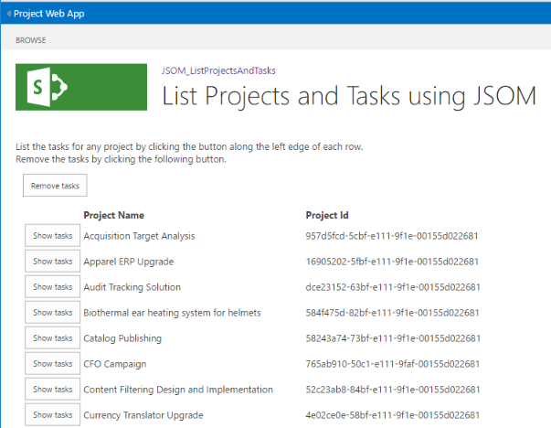
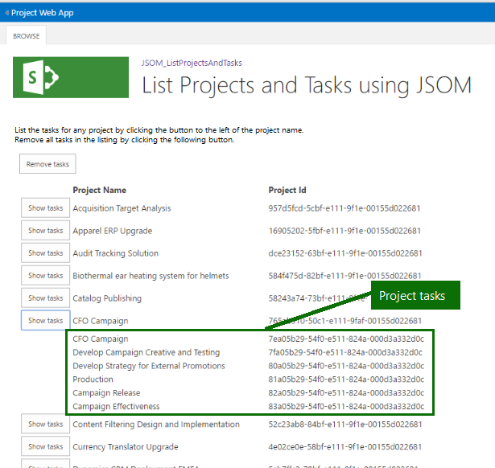

# <a name="developing-a-project-online-add-in-using-the-javascript-object-model-jsom"></a><span data-ttu-id="181f2-105">Entwickeln eines Project Online-Add-Ins mithilfe des JavaScript-Objektmodells (JSOM)</span><span class="sxs-lookup"><span data-stu-id="181f2-105">Developing a Project Online add-in using the JavaScript Object Model (JSOM)</span></span>

<span data-ttu-id="181f2-106">In diesem Artikel wird Microsoft Project Online Add-In-Entwicklung beschrieben, um Ihre Erfahrung mit dem Project Online.</span><span class="sxs-lookup"><span data-stu-id="181f2-106">This article describes Microsoft Project Online Add-in development to enhance your experience with the Project Online.</span></span> <span data-ttu-id="181f2-107">Das Entwicklungsprojekt wird als exemplarische Vorgehensweise implementiert.</span><span class="sxs-lookup"><span data-stu-id="181f2-107">The development project is implemented as a walkthrough.</span></span> <span data-ttu-id="181f2-108">Das für diesen Artikel verwendete Add-In liest und zeigt die Projektnamen und IDs der veröffentlichten Projekte aus Ihrem Project Online-Konto an und ermöglicht es Ihnen, einen Drilldown durchzuführen, um Aufgaben abzurufen, die einzelnen Projekten zugeordnet sind.</span><span class="sxs-lookup"><span data-stu-id="181f2-108">The add-in used for this article reads and displays the project names and IDs of the published projects from your Project Online account and allows you to drill down to retrieve tasks associated with individual projects.</span></span>
  
<span data-ttu-id="181f2-109">Zur Laufzeit ähnelt der Add-In-Eintrag der folgenden Abbildung:</span><span class="sxs-lookup"><span data-stu-id="181f2-109">At run time, the add-in listing looks similar to the following illustration:</span></span>
  
<span data-ttu-id="181f2-110">![Screenshot mit einer Auflistung von JSOM-Projekten und]-Aufgaben Screenshot mit einer Auflistung(media/766e5914-f048-48f4-9282-291f55e6e90d.png "von JSOM-Projekten und -Aufgaben")</span><span class="sxs-lookup"><span data-stu-id="181f2-110"></span></span>
  
<span data-ttu-id="181f2-111">Der Schwerpunkt des Beispiels liegt auf der Interaktion mit Project Online, abfragen und den Kontext für jede Anforderung vom Dienst festlegen.</span><span class="sxs-lookup"><span data-stu-id="181f2-111">The focus of the example is the interaction with the Project Online, making queries and setting the context for each request from the service.</span></span> <span data-ttu-id="181f2-112">Benutzeroberflächenelemente erhalten minimale Aufmerksamkeit.</span><span class="sxs-lookup"><span data-stu-id="181f2-112">User interface (UI) elements receive minimal attention.</span></span> <span data-ttu-id="181f2-113">Stattdessen enthalten die Quellauflistungen Kommentare zur Benutzeroberfläche.</span><span class="sxs-lookup"><span data-stu-id="181f2-113">Instead, the source listings provide comments regarding the UI.</span></span>
  
> [!NOTE]
> <span data-ttu-id="181f2-114">Die Quelldateien für das Beispiel-Add-In, ein Visual Studio Projekt, sind unter verfügbar: https://github.com/OfficeDev/Project-JSOM-List-Projects-Tasks.... .</span><span class="sxs-lookup"><span data-stu-id="181f2-114">The source files for the example add-in, a Visual Studio project, are available at: https://github.com/OfficeDev/Project-JSOM-List-Projects-Tasks.....</span></span> <span data-ttu-id="181f2-115">Halten Sie die Quelldateien als Referenz bereit, während Sie den Artikel lesen, da jede die jeweils andere ergänzt.</span><span class="sxs-lookup"><span data-stu-id="181f2-115">Keep the source files handy as a reference while you read the article, as each complements the other.</span></span> <span data-ttu-id="181f2-116">Die Dateien im Visual Studio und sind mit minimalen Änderungen ausführbar. Ersetzen Sie die URL für Ihren Project Online-Mandanten in den PWA Ordner.</span><span class="sxs-lookup"><span data-stu-id="181f2-116">The files in the Visual Studio project build and are executable with minimal changes—substituting the URL for your Project Online tenant down to the PWA folder.</span></span> 
  
## <a name="background"></a><span data-ttu-id="181f2-117">Hintergrund</span><span class="sxs-lookup"><span data-stu-id="181f2-117">Background</span></span>

<span data-ttu-id="181f2-118">Project Online ist ein Office 365-Dienst, der Unternehmen eine Projektportfolioverwaltungslösung (PPM) und eine Projektmanagementbürolösung (Project Management Office, PMO) zur Koordination und Verwaltung von Portfolios, Programmen und Projekten bietet.</span><span class="sxs-lookup"><span data-stu-id="181f2-118">Project Online is a Office 365 service that provides companies with a project portfolio management (PPM) and project management office (PMO) solution to coordinate and manage portfolios, programs, and projects.</span></span> <span data-ttu-id="181f2-119">Project Online ist ein anderes Angebot als die Project Desktopeditionen. Dennoch enthält Project Online die Funktionalität zum Verwalten und Nachverfolgen von Projektdetails während der gesamten Lebensdauer eines Projekts.</span><span class="sxs-lookup"><span data-stu-id="181f2-119">Project Online is a different offering than the Project desktop editions; yet, Project Online still contains the functionality to maintain and track project details throughout the life of a project.</span></span> <span data-ttu-id="181f2-120">Project Online baut auf SharePoint Online auf.</span><span class="sxs-lookup"><span data-stu-id="181f2-120">Project Online is built on SharePoint Online.</span></span>
  
<span data-ttu-id="181f2-121">Ein Project Online gehostetes Add-In besteht aus JavaScript- und Ressourcendateien, die mit der Client-Side-Object-Model-API interagieren.</span><span class="sxs-lookup"><span data-stu-id="181f2-121">A Project Online hosted add-in consists of JavaScript and resource files that interact with the Client-Side-Object-Model API.</span></span> <span data-ttu-id="181f2-122">Wenn der Benutzer das Add-In besucht, werden JavaScript und Ressourcen im Browser heruntergeladen und ausgeführt.</span><span class="sxs-lookup"><span data-stu-id="181f2-122">When the user visits the add-in, the JavaScript and resources are downloaded and executed within the browser.</span></span> <span data-ttu-id="181f2-123">Das Add-In ruft asynchrone Aufrufe an Project Online, um mit dem Dienst zu interagieren, unabhängig davon, ob Daten erstellt, abgerufen, aktualisiert oder gelöscht werden.</span><span class="sxs-lookup"><span data-stu-id="181f2-123">The add-In makes asynchronous calls to Project Online to interact with the service, whether creating, retrieving, updating, or deleting data.</span></span> 
  
<span data-ttu-id="181f2-124">Project Online eine weitere Aktion zum Schutz von Informationen, die zu anderen Mandanten gehören, vor dem #A0 durch. Nämlich Project Online eine isolierte Website erstellt, um mit den Anforderungen des Add-Ins zu interagieren.</span><span class="sxs-lookup"><span data-stu-id="181f2-124">Project Online performs one more action to protect information that belongs to other tenants from the add-in; namely, Project Online creates an isolated site to interact with the requests from the add-in.</span></span> <span data-ttu-id="181f2-125">Es wird kein benutzerdefinierter Code auf dem Project Online ausgeführt.</span><span class="sxs-lookup"><span data-stu-id="181f2-125">No custom code runs on the Project Online host.</span></span> 
  
<span data-ttu-id="181f2-126">Die Entwicklungseinrichtung für Project Online Add-Ins verwendet den Visual Studio SharePoint Add-In-Projekttyp.</span><span class="sxs-lookup"><span data-stu-id="181f2-126">The development setup for Project Online add-ins uses the Visual Studio SharePoint Add-in project type.</span></span> <span data-ttu-id="181f2-127">Das Add-In ist in JavaScript geschrieben und verwendet das Project JavaScript-Objektmodell (JSOM), um mit dem Project Online interagieren.</span><span class="sxs-lookup"><span data-stu-id="181f2-127">The add-in is written in JavaScript, and uses the Project JavaScript object model (JSOM) to interact with the Project Online service.</span></span> <span data-ttu-id="181f2-128">Das JSOM erbt einen großen Teil seiner Funktionalität von der SharePoint JSOM.</span><span class="sxs-lookup"><span data-stu-id="181f2-128">The JSOM inherits much of its functionality from the SharePoint JSOM.</span></span>
  
> [!NOTE]
> <span data-ttu-id="181f2-129">Add-Ins können in der App veröffentlicht und verkauft Office Store oder in einem privaten App-Katalog auf einem SharePoint.</span><span class="sxs-lookup"><span data-stu-id="181f2-129">Add-ins can be published and sold in the Office Store or deployed to a private app catalog on SharePoint.</span></span> <span data-ttu-id="181f2-130">Weitere Informationen finden Sie unter [Deploy and publish your Office Add-in](https://docs.microsoft.com/office/dev/add-ins/publish/publish).</span><span class="sxs-lookup"><span data-stu-id="181f2-130">For more information, see [Deploy and publish your Office Add-in](https://docs.microsoft.com/office/dev/add-ins/publish/publish).</span></span>
> 
> <span data-ttu-id="181f2-131">Das in diesem Artikel verwendete #A0 ist ein Beispiel für Entwickler. Es ist nicht für die Verwendung in einer Produktionsumgebung vorgesehen.</span><span class="sxs-lookup"><span data-stu-id="181f2-131">The add-in used in this article is a sample for developers; it is not intended for use in a production environment.</span></span> <span data-ttu-id="181f2-132">Der Hauptzweck besteht in einem Beispiel für die Entwicklung von Apps für Project Online.</span><span class="sxs-lookup"><span data-stu-id="181f2-132">The primary purpose is to show an example of app development for Project Online.</span></span> 
  
## <a name="prerequisites"></a><span data-ttu-id="181f2-133">Voraussetzungen</span><span class="sxs-lookup"><span data-stu-id="181f2-133">Prerequisites</span></span>

<span data-ttu-id="181f2-134">Fügen Sie die folgenden Elemente zu einer unterstützten Windows hinzu:</span><span class="sxs-lookup"><span data-stu-id="181f2-134">Add the following items to a supported Windows environment:</span></span>
  
- <span data-ttu-id="181f2-135">**.NET Framework 4.0 oder höher**: Vollständige Versionen des Frameworks ab Version 4.0 sind kompatibel.</span><span class="sxs-lookup"><span data-stu-id="181f2-135">**.NET Framework 4.0 or later**: Complete versions of the framework from version 4.0 are compatible.</span></span> <span data-ttu-id="181f2-136">Die Download-Website ist https://msdn.microsoft.com/vstudio/aa496123.aspx.</span><span class="sxs-lookup"><span data-stu-id="181f2-136">The download site is https://msdn.microsoft.com/vstudio/aa496123.aspx.</span></span>
    
- <span data-ttu-id="181f2-137">**Visual Studio 2013 oder höher**:</span><span class="sxs-lookup"><span data-stu-id="181f2-137">**Visual Studio 2013 or later**:</span></span>  
    
   - <span data-ttu-id="181f2-138">Die professionelle Edition von Visual Studio 2015 ist sofort einsatzbereit und steht unter zur https://www.visualstudio.com/en-us/products/visual-studio-professional-with-msdn-vs.aspx Verfügung.</span><span class="sxs-lookup"><span data-stu-id="181f2-138">The professional edition of Visual Studio 2015 is ready to go out-of-the box and is available at https://www.visualstudio.com/en-us/products/visual-studio-professional-with-msdn-vs.aspx.</span></span>
    
   - <span data-ttu-id="181f2-139">Die Community edition von Visual Studio 2015 ist unter https://www.visualstudio.com/en-us/products/visual-studio-community-vs.aspx verfügbar.</span><span class="sxs-lookup"><span data-stu-id="181f2-139">The community edition of Visual Studio 2015 is available at https://www.visualstudio.com/en-us/products/visual-studio-community-vs.aspx.</span></span> <span data-ttu-id="181f2-140">Diese Edition erfordert die manuelle Installation der Microsoft Office Developer Tools für Visual Studio.</span><span class="sxs-lookup"><span data-stu-id="181f2-140">This edition requires manual installation of the Microsoft Office Developer Tools for Visual Studio.</span></span>
    
   <span data-ttu-id="181f2-141">Die Microsoft Office Developer Tools for Visual Studio sind unter https://www.visualstudio.com/en-us/features/office-tools-vs.aspx verfügbar.</span><span class="sxs-lookup"><span data-stu-id="181f2-141">The Microsoft Office Developer Tools for Visual Studio are available at https://www.visualstudio.com/en-us/features/office-tools-vs.aspx.</span></span>
    
- <span data-ttu-id="181f2-142">**Ein Project Online:** Dies ermöglicht den Zugriff auf den Hostingdienst.</span><span class="sxs-lookup"><span data-stu-id="181f2-142">**A Project Online account**: This provides access to the hosting service.</span></span> <span data-ttu-id="181f2-143">Weitere Informationen zum Einrichten eines Project Online-Kontos finden Sie unter https://products.office.com/en-us/Project/project-online-portfolio-management.</span><span class="sxs-lookup"><span data-stu-id="181f2-143">For more information about obtaining a Project Online account, see https://products.office.com/en-us/Project/project-online-portfolio-management.</span></span>
    
   <span data-ttu-id="181f2-144">Stellen Sie sicher, dass der Add-In-Benutzer über ausreichende Autorisierung für den Zugriff auf einige Projekte im Project Online verfügt.</span><span class="sxs-lookup"><span data-stu-id="181f2-144">Ensure that the add-in user has sufficient authorization to access some projects in the Project Online tenant.</span></span> 
    
- <span data-ttu-id="181f2-145">**Projekte auf der Hostingwebsite,** die mit Informationen gefüllt sind.</span><span class="sxs-lookup"><span data-stu-id="181f2-145">**Projects on the hosting site** that are populated with information.</span></span>
    
> [!NOTE]
> <span data-ttu-id="181f2-146">Die Standard-.NET Framework ist das richtige Framework, das verwendet werden soll.</span><span class="sxs-lookup"><span data-stu-id="181f2-146">The standard .NET Framework is the correct framework to use.</span></span> <span data-ttu-id="181f2-147">Verwenden Sie nicht das ".NET Framework 4-Clientprofil".</span><span class="sxs-lookup"><span data-stu-id="181f2-147">Do not use the ".NET Framework 4 Client Profile".</span></span> 
  
### <a name="set-up-the-visual-studio-project"></a><span data-ttu-id="181f2-148">Einrichten des Visual Studio-Projekts</span><span class="sxs-lookup"><span data-stu-id="181f2-148">Set up the Visual Studio project</span></span>

<span data-ttu-id="181f2-149">Die Anwendungseinrichtung besteht aus dem Erstellen eines neuen Projekts, dem Verknüpfen der entsprechenden Bibliotheken und dem Deklarieren der erforderlichen Namespaces.</span><span class="sxs-lookup"><span data-stu-id="181f2-149">The application setup consists of creating a new project, linking the appropriate libraries and declaring the needed namespaces.</span></span> <span data-ttu-id="181f2-150">Visual Studio bietet verschiedene Typen von Entwicklungsprojekten.</span><span class="sxs-lookup"><span data-stu-id="181f2-150">Visual Studio presents several types of development projects.</span></span> <span data-ttu-id="181f2-151">Der Abschnitt ist kurz und sehr einfach.</span><span class="sxs-lookup"><span data-stu-id="181f2-151">The section is brief and very basic.</span></span> <span data-ttu-id="181f2-152">Der Wert hat, dass die Informationen an einer Stelle verknurft werden.</span><span class="sxs-lookup"><span data-stu-id="181f2-152">The value is having the information is coalesced in one place.</span></span>
  
#### <a name="select-a-visual-studio-project"></a><span data-ttu-id="181f2-153">Auswählen eines Visual Studio-Projekts</span><span class="sxs-lookup"><span data-stu-id="181f2-153">Select a Visual Studio project</span></span>

<span data-ttu-id="181f2-154">Zum Erstellen eines Projekts des entsprechenden Typs für das Add-In müssen Sie die folgenden Schritte ausführen.</span><span class="sxs-lookup"><span data-stu-id="181f2-154">To create a project of the appropriate type for the add-in, you must do the following steps.</span></span> <span data-ttu-id="181f2-155">Schlüsselwörter, die auf dem Bildschirm gefunden werden, haben ein **fett formatiertes** Attribut:</span><span class="sxs-lookup"><span data-stu-id="181f2-155">Keywords encountered on the screen have a **bold** attribute:</span></span> 
  
1. <span data-ttu-id="181f2-156">Wählen Sie im Menü Datei die Option **Datei**  >    >  **Neu Project**.</span><span class="sxs-lookup"><span data-stu-id="181f2-156">From the File menu, choose **File** > **New** > **Project**.</span></span> 
    
2. <span data-ttu-id="181f2-157">Wählen Sie im linken Bereich installierte Vorlagen C#  >  **Office/SharePoint**  >  **Web-Add-Ins aus.**</span><span class="sxs-lookup"><span data-stu-id="181f2-157">From the Installed templates in the left pane, select **C#** > **Office/SharePoint** > **Web Add-ins**.</span></span> 
    
3. <span data-ttu-id="181f2-158">Wählen Sie oben im zentralen Bereich **die Option .NET Framework 4** oder höher aus. die aktuelle Version ist 4.6.</span><span class="sxs-lookup"><span data-stu-id="181f2-158">At the top of the central pane, select **.NET Framework 4** or later; the current version is 4.6.</span></span> 
    
4. <span data-ttu-id="181f2-159">Wählen Sie in den Anwendungstypen im zentralen Bereich SharePoint **Add-In aus.**</span><span class="sxs-lookup"><span data-stu-id="181f2-159">From the application types in the central pane, choose **SharePoint Add-in**.</span></span> 
    
5. <span data-ttu-id="181f2-160">Geben Sie im unteren Abschnitt einen Namen und Speicherort für das Projekt und einen Projektmappennamen an.</span><span class="sxs-lookup"><span data-stu-id="181f2-160">In the bottom section, specify a name and location for the project, and a solution name.</span></span> 
    
6. <span data-ttu-id="181f2-161">Aktivieren Sie außerdem im unteren Abschnitt das Kontrollkästchen **Projektmappenverzeichnis erstellen**.</span><span class="sxs-lookup"><span data-stu-id="181f2-161">Also in the bottom section, check the **Create directory for solution** box.</span></span> 
    
7. <span data-ttu-id="181f2-162">Klicken Sie auf **OK**, um das Ausgangsprojekt zu erstellen.</span><span class="sxs-lookup"><span data-stu-id="181f2-162">Click **OK** to create the initial project.</span></span> 
    
<span data-ttu-id="181f2-163">Der Visual Studio-Assistent stellt in mehreren Dialogen einige Folgefragen zur Project Online-Einstellungswebsite (in den Dialogen als SharePoint-Einstellungen bezeichnet).</span><span class="sxs-lookup"><span data-stu-id="181f2-163">The Visual Studio Wizard asks a few follow-up questions about the Project Online settings site (called SharePoint settings in the dialogs) in a couple of dialogs that follow.</span></span> <span data-ttu-id="181f2-164">Hier sind die Fragen:</span><span class="sxs-lookup"><span data-stu-id="181f2-164">Here are the questions:</span></span>
  
1. <span data-ttu-id="181f2-165">Welche SharePoint möchten Sie zum Debuggen Ihres Add-Ins verwenden?</span><span class="sxs-lookup"><span data-stu-id="181f2-165">What SharePoint site do you want to use for debugging your add-in?</span></span> <span data-ttu-id="181f2-166">Geben Sie die URL zu Ihrer PWA an, z. B. https://contoso.sharepoint.com/sites/pwa .</span><span class="sxs-lookup"><span data-stu-id="181f2-166">Specify the URL to your PWA site, such as https://contoso.sharepoint.com/sites/pwa.</span></span>
    
2. <span data-ttu-id="181f2-167">Wie möchten Sie Ihr SharePoint hosten?</span><span class="sxs-lookup"><span data-stu-id="181f2-167">How do you want to host your SharePoint Add-in?</span></span> <span data-ttu-id="181f2-168">Wählen Sie [X] **SharePoint gehostet aus.**</span><span class="sxs-lookup"><span data-stu-id="181f2-168">Choose [X] **SharePoint-hosted**.</span></span>
    
   <span data-ttu-id="181f2-169">Weitere Informationen zu SharePoint Add-Ins, einschließlich Hostingoptionen, finden Sie [unter SharePoint Add-Ins](https://docs.microsoft.com/sharepoint/dev/sp-add-ins/sharepoint-add-ins).</span><span class="sxs-lookup"><span data-stu-id="181f2-169">For more information about SharePoint Add-ins, including hosting options, see [SharePoint Add-ins](https://docs.microsoft.com/sharepoint/dev/sp-add-ins/sharepoint-add-ins).</span></span>
    
3. <span data-ttu-id="181f2-170">Klicken Sie auf **Weiter**.</span><span class="sxs-lookup"><span data-stu-id="181f2-170">Click **Next**.</span></span> 
    
<span data-ttu-id="181f2-171">Im zweiten zusätzlichen Dialogfeld werden Sie zum Angeben der SharePoint Onlineversion für das Add-In gefragt:</span><span class="sxs-lookup"><span data-stu-id="181f2-171">The second additional dialog asks you to specify the SharePoint Online version for the add-in:</span></span> 
  
1. <span data-ttu-id="181f2-172">Was ist die früheste Version von SharePoint, die Ihr Add-In als Ziel verwenden soll?</span><span class="sxs-lookup"><span data-stu-id="181f2-172">What's the earliest version of SharePoint that you want your add-in to target?</span></span> <span data-ttu-id="181f2-173">Wählen Sie [X] S **harePoint-Online aus.**</span><span class="sxs-lookup"><span data-stu-id="181f2-173">Choose [X] S **harePoint-Online**.</span></span> 
    
2. <span data-ttu-id="181f2-174">Klicken Sie auf **Fertig stellen**.</span><span class="sxs-lookup"><span data-stu-id="181f2-174">Click **Finish**.</span></span> 
    
<span data-ttu-id="181f2-175">Visual Studio erstellt das Projekt und zugrifft auf Project Online Website.</span><span class="sxs-lookup"><span data-stu-id="181f2-175">Visual Studio creates the project and accesses the Project Online site.</span></span> 
  
### <a name="enable-sideloading-on-the-project-online-site"></a><span data-ttu-id="181f2-176">Aktivieren des Querladens auf Project Online Website</span><span class="sxs-lookup"><span data-stu-id="181f2-176">Enable sideloading on the Project Online site</span></span>

<span data-ttu-id="181f2-177">Das Querladen ist der Mechanismus zum Testen und Debuggen Project Online Add-Ins. Sie benötigen zwei Skripts für das Querladen: eines zum Aktivieren des Querladens auf Ihrer Project Online-Website und ein weiteres zum Deaktivieren des Querladens, sobald Sie das Testen und Debuggen des Add-Ins abgeschlossen haben.</span><span class="sxs-lookup"><span data-stu-id="181f2-177">Sideloading is the mechanism for testing and debugging Project Online add-ins. You need two scripts for sideloading: one to enable sideloading on your Project Online site and another to disable sideloading once you finish testing and debugging the add-in.</span></span>
  
<span data-ttu-id="181f2-178">Weitere Informationen zum Einrichten des Querladens finden Sie unter [Enable app SideLoading in your non-developer site collection](https://blogs.msdn.microsoft.com/officeapps/2013/12/10/enable-app-sideloading-in-your-non-developer-site-collection/).</span><span class="sxs-lookup"><span data-stu-id="181f2-178">For more information about setting up sideloading, see [Enable app SideLoading in your non-developer site collection](https://blogs.msdn.microsoft.com/officeapps/2013/12/10/enable-app-sideloading-in-your-non-developer-site-collection/).</span></span>
  
> [!NOTE]
> <span data-ttu-id="181f2-179">Das Querladen von Apps ist ein Entwickler-/Testfeature.</span><span class="sxs-lookup"><span data-stu-id="181f2-179">Sideloading apps is a developer/test feature.</span></span> <span data-ttu-id="181f2-180">Es ist **nicht für die Produktionsnutzung vorgesehen.**</span><span class="sxs-lookup"><span data-stu-id="181f2-180">It is **not intended for production use**.</span></span> <span data-ttu-id="181f2-181">Laden Sie Apps nicht regelmäßig quer, oder halten Sie das Querladen von Apps länger aktiviert, als Sie das Feature aktiv verwenden.</span><span class="sxs-lookup"><span data-stu-id="181f2-181">Do not sideload apps regularly, or keep app sideloading enabled for longer than you are actively using the feature.</span></span> 
  
## <a name="add-content-to-the-add-in-project"></a><span data-ttu-id="181f2-182">Hinzufügen von Inhalten zum Add-In-Projekt</span><span class="sxs-lookup"><span data-stu-id="181f2-182">Add content to the add-in project</span></span>

<span data-ttu-id="181f2-183">Nach dem Erstellen eines Projekts und dem Einrichten des Debugmechanismus umfasst das Hinzufügen von Inhalt zur App die folgenden Aufgaben:</span><span class="sxs-lookup"><span data-stu-id="181f2-183">After creating a project and setting up the debugging mechanism, adding content to the app includes the following tasks:</span></span>
  
- <span data-ttu-id="181f2-184">Festlegen des Anwendungsumfangs</span><span class="sxs-lookup"><span data-stu-id="181f2-184">Setting the application scope</span></span>
    
- <span data-ttu-id="181f2-185">Verknüpfen der JSOM-Bibliothek</span><span class="sxs-lookup"><span data-stu-id="181f2-185">Linking the JSOM library</span></span>
    
- <span data-ttu-id="181f2-186">Hinzufügen von Benutzeroberflächenelementen zum Add-In</span><span class="sxs-lookup"><span data-stu-id="181f2-186">Adding UI Elements to the add-in</span></span>
    
- <span data-ttu-id="181f2-187">Initialisieren und Herstellen einer Verbindung mit Project Online Dienst</span><span class="sxs-lookup"><span data-stu-id="181f2-187">Initializing and connecting to the Project Online service</span></span>
    
- <span data-ttu-id="181f2-188">Abrufen von Projekten und Details/Eigenschaften</span><span class="sxs-lookup"><span data-stu-id="181f2-188">Retrieving projects and details/properties</span></span>
    
- <span data-ttu-id="181f2-189">Anzeigen von Projekten</span><span class="sxs-lookup"><span data-stu-id="181f2-189">Displaying projects</span></span>
    
- <span data-ttu-id="181f2-190">Anzeigen von Aufgaben für Project</span><span class="sxs-lookup"><span data-stu-id="181f2-190">Displaying tasks for a Project</span></span>
    
<span data-ttu-id="181f2-191">Das Add-In-Projekt besteht aus vielen Dateien.</span><span class="sxs-lookup"><span data-stu-id="181f2-191">The add-in project consists of many files.</span></span> <span data-ttu-id="181f2-192">In diesem Beispiel müssen Sie die folgenden Dateien bearbeiten:</span><span class="sxs-lookup"><span data-stu-id="181f2-192">In this example, you'll need to edit the following files:</span></span> 
  
- <span data-ttu-id="181f2-193">AppManifest.xml</span><span class="sxs-lookup"><span data-stu-id="181f2-193">AppManifest.xml</span></span>
    
- <span data-ttu-id="181f2-194">Default.aspx</span><span class="sxs-lookup"><span data-stu-id="181f2-194">Default.aspx</span></span>
    
- <span data-ttu-id="181f2-195">App.js</span><span class="sxs-lookup"><span data-stu-id="181f2-195">App.js</span></span>
    
- <span data-ttu-id="181f2-196">App.css – optional; enthält Formatdefinitionen, die für das Add-In entwickelt wurden</span><span class="sxs-lookup"><span data-stu-id="181f2-196">App.css - optional; contains style definitions developed for the add-in</span></span>
    
<span data-ttu-id="181f2-197">Wenn sich der Project Online-Mandant ändert, z. B. von einer Testversion zu einer Abonnementwebsite, können Sie die Projekteigenschaften, einschließlich der Serververbindung und der Website-URL, mithilfe des Eigenschaftenfensters aktualisieren, das über den Befehl Eigenschaftenfenster anzeigen verfügbar   >   ist.</span><span class="sxs-lookup"><span data-stu-id="181f2-197">If the Project Online tenant changes, such as moving from a trial to a subscription site, you can update the project properties, including the Server Connection and Site URL, using the Properties Window available through the **View** > **Properties Window** command.</span></span> 
  
<span data-ttu-id="181f2-198">Sie können dem Projekt auch Dateien hinzufügen.</span><span class="sxs-lookup"><span data-stu-id="181f2-198">You can also add files to the project.</span></span> <span data-ttu-id="181f2-199">Wenn ja, müssen Sie die Elements.xml in derselben Gruppe (Content, Images, Pages oder Scripts) aktualisieren, um die neuen Dateien zu enthalten.</span><span class="sxs-lookup"><span data-stu-id="181f2-199">If so, you'll need to update the Elements.xml file located in the same group (Content, Images, Pages, or Scripts) to include the new files.</span></span> <span data-ttu-id="181f2-200">Weitere Informationen zu den Projektdateien finden Sie unter [Explore the app manifest structure and the package of a SharePoint Add-in](https://docs.microsoft.com/sharepoint/dev/sp-add-ins/explore-the-app-manifest-structure-and-the-package-of-a-sharepoint-add-in).</span><span class="sxs-lookup"><span data-stu-id="181f2-200">For more information about the project files, see [Explore the app manifest structure and the package of a SharePoint Add-in](https://docs.microsoft.com/sharepoint/dev/sp-add-ins/explore-the-app-manifest-structure-and-the-package-of-a-sharepoint-add-in).</span></span>
  
### <a name="set-application-scope"></a><span data-ttu-id="181f2-201">Festlegen des Anwendungsumfangs</span><span class="sxs-lookup"><span data-stu-id="181f2-201">Set application scope</span></span>

<span data-ttu-id="181f2-202">Das Add-In benötigt Bereiche oder Berechtigungsstufen, die definiert sind, bevor der Dienst Informationen in Abfrageergebnissen zurückgibt.</span><span class="sxs-lookup"><span data-stu-id="181f2-202">The add-in needs scope or permission levels defined before the service returns information in query results.</span></span> <span data-ttu-id="181f2-203">Verwenden Sie für dieses Add-In den folgenden Bereich für das Visual Studio Projekt.</span><span class="sxs-lookup"><span data-stu-id="181f2-203">For this add-in, use the following scope to the Visual Studio project.</span></span> <span data-ttu-id="181f2-204">Diese Änderung wird an der AppManifest.xml auf der Registerkarte Berechtigungen vorgenommen:</span><span class="sxs-lookup"><span data-stu-id="181f2-204">This change is made to the AppManifest.xml file in the Permissions tab:</span></span>

|<span data-ttu-id="181f2-205">Bereich</span><span class="sxs-lookup"><span data-stu-id="181f2-205">Scope</span></span>|<span data-ttu-id="181f2-206">Berechtigung</span><span class="sxs-lookup"><span data-stu-id="181f2-206">Permission</span></span>|
|:-----|:-----|
|<span data-ttu-id="181f2-207">Mehrere Projekte (Project Server)</span><span class="sxs-lookup"><span data-stu-id="181f2-207">Multiple Projects (Project Server)</span></span>  <br/> |<span data-ttu-id="181f2-208">Lesen</span><span class="sxs-lookup"><span data-stu-id="181f2-208">Read</span></span>  <br/> |
   
<span data-ttu-id="181f2-209">Speichern Sie die Datei nach dem Festlegen des Anwendungsbereichs.</span><span class="sxs-lookup"><span data-stu-id="181f2-209">Save the file after setting the application scope.</span></span> <span data-ttu-id="181f2-210">Andernfalls werden keine Daten vom Dienst zurückgegeben.</span><span class="sxs-lookup"><span data-stu-id="181f2-210">Otherwise, no data will be returned from the service.</span></span> 
  
### <a name="link-the-jsom-library"></a><span data-ttu-id="181f2-211">Verknüpfen der JSOM-Bibliothek</span><span class="sxs-lookup"><span data-stu-id="181f2-211">Link the JSOM library</span></span>

<span data-ttu-id="181f2-212">Die Laufzeitbibliotheken Project Online, PS.js und PS.debug.js, werden von Project Online bereitgestellt und sind immer die neueste Version.</span><span class="sxs-lookup"><span data-stu-id="181f2-212">The runtime Project Online libraries, PS.js and PS.debug.js, are provided by Project Online and are always the most recent version.</span></span> <span data-ttu-id="181f2-213">JavaScript-Add-Ins, die JSOM verwenden, müssen mit einer dieser Bibliotheken verknüpfen.</span><span class="sxs-lookup"><span data-stu-id="181f2-213">JavaScript add-ins that use JSOM must link with one of these libraries.</span></span> <span data-ttu-id="181f2-214">Die Verknüpfungsdefinitionen werden in der Datei "Default.aspx" hinzugefügt.</span><span class="sxs-lookup"><span data-stu-id="181f2-214">The linking definitions are added in the Default.aspx file.</span></span> <span data-ttu-id="181f2-215">Die Befehle zur Verwendung der PS.js und/oder PS.debug.js sind Teil des Codes in der App.js Datei.</span><span class="sxs-lookup"><span data-stu-id="181f2-215">The commands to use the PS.js and/or PS.debug.js are part of the code located in the App.js file.</span></span>
  
<span data-ttu-id="181f2-216">Fügen Sie den folgenden Befehl für PS.js oder PS.debug.js im Element hinzu, der `<asp:Content ContentPlaceHolderID="PlaceHolderAdditionalPageHead"` auf "SharePoint:ScriptLink" für sp.js.</span><span class="sxs-lookup"><span data-stu-id="181f2-216">Add the following command for PS.js or PS.debug.js definition in the  `<asp:Content ContentPlaceHolderID="PlaceHolderAdditionalPageHead"` element following the "SharePoint:ScriptLink" for sp.js.</span></span> 
  
```js
<SharePoint:ScriptLink name="PS.js" runat="server" OnDemand="false" LoadAfterUI="true" Localizable="false" />
```

> [!NOTE]
> <span data-ttu-id="181f2-217">Das **OnDemand-Attribut** für PS.js oder PS.debug.js auf **false festgelegt.**</span><span class="sxs-lookup"><span data-stu-id="181f2-217">The **OnDemand** attribute for PS.js or PS.debug.js set to **false**.</span></span> 
  
### <a name="add-ui-elements-to-the-add-in"></a><span data-ttu-id="181f2-218">Hinzufügen von Benutzeroberflächenelementen zum Add-In</span><span class="sxs-lookup"><span data-stu-id="181f2-218">Add UI elements to the add-in</span></span>

<span data-ttu-id="181f2-219">Das Beispiel-Add-In besteht aus einigen Komponenten.</span><span class="sxs-lookup"><span data-stu-id="181f2-219">The example add-in consists of a few components.</span></span> <span data-ttu-id="181f2-220">Beschreibungen statischer Elemente befinden sich in der Datei "Default.aspx".</span><span class="sxs-lookup"><span data-stu-id="181f2-220">Static element descriptions are located in the Default.aspx file.</span></span> <span data-ttu-id="181f2-221">Dynamische Elementbeschreibungen und Code für alle Komponenten befinden sich in der App.js Datei.</span><span class="sxs-lookup"><span data-stu-id="181f2-221">Dynamic element descriptions and code for all components are located in the App.js file.</span></span> <span data-ttu-id="181f2-222">Kommentare zu den Komponenten finden Sie in den Quellcodeauflistungen.</span><span class="sxs-lookup"><span data-stu-id="181f2-222">For comments regarding the components, refer to the source code listings.</span></span> <span data-ttu-id="181f2-223">Hier ist eine Liste der Benutzeroberflächenkomponenten im Add-In:</span><span class="sxs-lookup"><span data-stu-id="181f2-223">Here is a list of the UI components in the add-in:</span></span>
  
- <span data-ttu-id="181f2-224">Titel</span><span class="sxs-lookup"><span data-stu-id="181f2-224">Title</span></span>
    
- <span data-ttu-id="181f2-225">Einführungsverbiage</span><span class="sxs-lookup"><span data-stu-id="181f2-225">Introductory verbiage</span></span>
    
- <span data-ttu-id="181f2-226">Schaltfläche zum Entfernen von Aufgaben aus der Tabelle</span><span class="sxs-lookup"><span data-stu-id="181f2-226">Button to remove tasks from the table</span></span>
    
- <span data-ttu-id="181f2-227">Tabelle, in der die Projekt-ID und der Name sowie die Vorgangsinformationen aufgeführt sind.</span><span class="sxs-lookup"><span data-stu-id="181f2-227">Table that lists the project ID and name, and the task information.</span></span>
    
- <span data-ttu-id="181f2-228">Vorgangsschaltfläche (einmal für jedes Projekt geklont), die Vorgangsdaten in die Tabelle importiert.</span><span class="sxs-lookup"><span data-stu-id="181f2-228">Tasks Button (cloned once for each project) that imports task data into the table.</span></span>
    
<span data-ttu-id="181f2-229">Details zur Benutzeroberfläche, z. B. den Titel und den Kopfzeilenteil der Projekttabelle, finden Sie in der Projektdatei Default.aspx.</span><span class="sxs-lookup"><span data-stu-id="181f2-229">For details of the user interface, such as the title and the header portion of the project table, see the Default.aspx project file.</span></span>
  
### <a name="initialize-and-connect-to-the-host-system"></a><span data-ttu-id="181f2-230">Initialisieren und Herstellen einer Verbindung mit dem Hostsystem</span><span class="sxs-lookup"><span data-stu-id="181f2-230">Initialize and connect to the host system</span></span>

<span data-ttu-id="181f2-231">Die App.js enthält den JavaScript-Code.</span><span class="sxs-lookup"><span data-stu-id="181f2-231">The App.js file contains the JavaScript code.</span></span> <span data-ttu-id="181f2-232">Das Add-In lädt PS.js browser und ruft dann die initializePage-Funktion auf.</span><span class="sxs-lookup"><span data-stu-id="181f2-232">The add-in loads PS.js in the browser, and then calls the initializePage function.</span></span> <span data-ttu-id="181f2-233">InitializePage ruft einen Kontext für den Project Online ab und startet die loadProjects-Funktion.</span><span class="sxs-lookup"><span data-stu-id="181f2-233">InitializePage retrieves a context to the Project Online endpoint and starts the loadProjects function.</span></span>
  
```js
    'use strict';
    SP.SOD.executeOrDelayUntilScriptLoaded(initializePage, "PS.js");
    //Project PWA Context and published projects in PWA
    var projContext;
    var projects;
    function initializePage() {
        //Get the Project context for this web
        projContext = PS.ProjectContext.get_current();
        loadProjects();
    }
    //General CSOM failure event handler
    //Invoked when ExecuteQueryAsync returns unsuccessfully
    function onRequestFailed(sender, args) {
        alert("Failed to execute: " + args.get_message());
        return;
    };

```

### <a name="retrieve-the-projects"></a><span data-ttu-id="181f2-234">Abrufen der Projekte</span><span class="sxs-lookup"><span data-stu-id="181f2-234">Retrieve the projects</span></span>

<span data-ttu-id="181f2-235">Die loadProjects-Funktion fragt den Dienst nach den Projektnamen und IDs ab.</span><span class="sxs-lookup"><span data-stu-id="181f2-235">The loadProjects function queries the service for the project names and IDs.</span></span> 
  
<span data-ttu-id="181f2-236">Die Anwendung ruft den Projektnamen und die Projekt-ID ab. Weitere Informationen zum Projekt sind verfügbar und können durch Ändern der Load-Methode aufgerufen werden, um die abzurufenden Eigenschaften explizit zu identifizieren.</span><span class="sxs-lookup"><span data-stu-id="181f2-236">The application retrieves the project name and project Id. Other information about the project is available and can be accessed by modifying the load method to identify explicitly the properties to retrieve.</span></span> <span data-ttu-id="181f2-237">Ein Beispiel wird im Code als Kommentar bereitgestellt.</span><span class="sxs-lookup"><span data-stu-id="181f2-237">An example is provided in the code as a comment.</span></span> 
  
<span data-ttu-id="181f2-238">Wenn die Abfrage erfolgreich ist, wird das Add-In fortgesetzt, indem displayProjects aufruft.</span><span class="sxs-lookup"><span data-stu-id="181f2-238">If the query succeeds, the add-in continues by calling displayProjects.</span></span> 
  
```js
    //Query CSOM and get the list of projects in PWA
    function loadProjects() {
        projects = projContext.get_projects();
    //Request to server - identifies what to retrieve
        projContext.load(projects, 'Include(Name, Id)');
        //Notice to server to execute query
        projContext.executeQueryAsync(displayProjects, onRequestFailed);
        // Syntax for requesting more fields to pull down from server
        // projContext.load(projects, 'Include(Name, Description, StartDate, 
        // Id, IsCheckedOut)');
    }

```

### <a name="display-the-projects"></a><span data-ttu-id="181f2-239">Anzeigen der Projekte</span><span class="sxs-lookup"><span data-stu-id="181f2-239">Display the projects</span></span>

<span data-ttu-id="181f2-240">Die displayProjects-Funktion erstellt eine Tabelle, eine Zeile pro Projekt und eine Schaltfläche, um die Aufgaben für das spezifische Projekt zu zeigen.</span><span class="sxs-lookup"><span data-stu-id="181f2-240">The displayProjects function creates a table, one row per project, and a button to show the tasks for the specific project.</span></span> 
  
```js
    //Display the projects with names and ids in a table
    function displayProjects() {
        //Current published project and ID
        var p, projId;
        //Project table rows to publish collectively
        var pTable = []; 
        var pEnum = projects.getEnumerator();
        //Build a 3-column table, with one project per row.
        while (pEnum.moveNext()) {
            p = pEnum.get_current();
        
            //Items used in getting information for table rows:
            //Current published project object, and ID and name
            // var project = p;
            // var projId = p.get_id();
            // var projName = p.get_name();
        
            //Continue processing/working with project object as needed.
        }
    }

```

> [!NOTE]
> <span data-ttu-id="181f2-241">Die while-Schleife zugrifft auf die EIGENSCHAFTEN ID und Name.</span><span class="sxs-lookup"><span data-stu-id="181f2-241">The while loop accesses the ID and name properties.</span></span> <span data-ttu-id="181f2-242">Dies ist etwas anders als das Quellcodeprojekt, das eine Funktion aufruft, die wiederum auf dieselben Eigenschaften zu zugegriffen hat.</span><span class="sxs-lookup"><span data-stu-id="181f2-242">This is slightly different than the source code project that calls a function that, in turn, accesses the same properties.</span></span> 
  
### <a name="display-the-tasks-for-a-project"></a><span data-ttu-id="181f2-243">Anzeigen der Vorgänge für ein Projekt</span><span class="sxs-lookup"><span data-stu-id="181f2-243">Display the tasks for a project</span></span>

<span data-ttu-id="181f2-244">Die Aufgaben sind zwar Teil des Add-Ins, aber nicht Teil des anfänglichen Ladens.</span><span class="sxs-lookup"><span data-stu-id="181f2-244">The tasks, while part of the add-in, are not part of the initial loading.</span></span> <span data-ttu-id="181f2-245">Wenn der Benutzer an den Aufgaben interessiert ist, die einem Projekt zugeordnet sind, bewirkt das Klicken auf die Schaltfläche "Aufgaben anzeigen", dass die Aufgaben mithilfe des btnLoadTasks-Ereignishandlers in der Liste angezeigt werden.</span><span class="sxs-lookup"><span data-stu-id="181f2-245">If the user is interested in the tasks associated with a project, clicking the "Show Tasks" button causes the tasks to display in the list using the btnLoadTasks event handler.</span></span> 
  
<span data-ttu-id="181f2-246">Der btnLoadTasks-Ereignishandler mit der entsprechenden Projekt-ID fordert die Aufgaben für das angegebene Projekt vom Server an.</span><span class="sxs-lookup"><span data-stu-id="181f2-246">The btnLoadTasks event handler, with the appropriate project ID, requests the tasks for the specified project from the server.</span></span> <span data-ttu-id="181f2-247">Nach dem Abrufen übergibt btnLoadTasks die Aufgabenliste an displayTasks, um die Aufgaben auf dem Bildschirm zu präsentieren.</span><span class="sxs-lookup"><span data-stu-id="181f2-247">Once retrieved, btnLoadTasks passes the task list to displayTasks to present the tasks onscreen.</span></span>
  
```js
    //Query CSOM and get the list of tasks for a specific project
    function btnLoadTasks(pid) {
        //Event handler for the "Show tasks" buttons. 
        //
        //The project ID is the sole argument and is used to get the appropriate task 
        //info from the service.
        //The project ID is also the button name, and is used to identify where to place
        //the task information in the table.
        //
        //Project ID to pass to the event handler
        var projId = pid;
        //
        //Get the project reference
        var pProj = projects.getById(projId);
        //
        //Get the tasks collection reference associated with the project.
        var tasks = pProj.get_tasks();
        //
        projContext.load(tasks, 'Include(Id, Name, Start, ScheduledStart, Completion)');
        //
        //If the query succeeds, displayTasks presents the tasks to the user.
        projContext.executeQueryAsync(function () { displayTasks(tasks, projId) }, onRequestFailed);
    }

```

<span data-ttu-id="181f2-248">Die displayTasks-Funktion zeigt die Vorgänge an, die einem angegebenen Projekt direkt unterhalb des Projekteintrags zugeordnet sind.</span><span class="sxs-lookup"><span data-stu-id="181f2-248">The displayTasks function displays the tasks associated with a specified project immediately beneath the project entry.</span></span>
  
```js
    //Insert tasks for the specified project immediately underneath the project entry 
    //in the table.
    function displayTasks(tasks, projId) {
        //selected project ID
        var pId = projId;
        //individual task
        var t;
        //Task table rows to publish collectively
        var tTable = [];
        var tEnum = tasks.getEnumerator();
        //Build table one task per row.
        while (tEnum.moveNext()) {
            t = tEnum.get_current();
            //
            //Items used in getting information for table rows:
            //Current task object, and ID and name
            // var task = t;
            // var taskId = t.get_id();
            // var taskName = t.get_name();
            
            //Continue processing/working with task object as needed.
        }
    }

```

> [!NOTE]
> <span data-ttu-id="181f2-249">Die while-Schleife zugrifft auf die Aufgaben-ID und die Nameneigenschaften.</span><span class="sxs-lookup"><span data-stu-id="181f2-249">The while loop accesses the task ID and name properties.</span></span> <span data-ttu-id="181f2-250">Dies ist etwas anders als das Quellcodeprojekt, das eine Funktion aufruft, die wiederum auf dieselben Eigenschaften zu zugegriffen hat.</span><span class="sxs-lookup"><span data-stu-id="181f2-250">This is slightly different than the source code project that calls a function that, in turn, accesses the same properties.</span></span> 
  
<span data-ttu-id="181f2-251">Es folgt eine Beispielausgabe für die Aufgaben eines einzelnen Projekts.</span><span class="sxs-lookup"><span data-stu-id="181f2-251">Sample output for the tasks of a single project follows.</span></span>
  
<span data-ttu-id="181f2-252"></span><span class="sxs-lookup"><span data-stu-id="181f2-252"></span></span>
  
## <a name="see-also"></a><span data-ttu-id="181f2-253">Siehe auch</span><span class="sxs-lookup"><span data-stu-id="181f2-253">See also</span></span>

<span data-ttu-id="181f2-254">Dokumentation und Beispiele zu Project Online und Anwendungsentwicklung mit CSOM finden Sie im [Project-Entwicklungsportal](https://developer.microsoft.com/en-us/project).</span><span class="sxs-lookup"><span data-stu-id="181f2-254">For documentation and samples related to Project Online and application development using CSOM, see the [Project Development Portal](https://developer.microsoft.com/en-us/project).</span></span>
    


