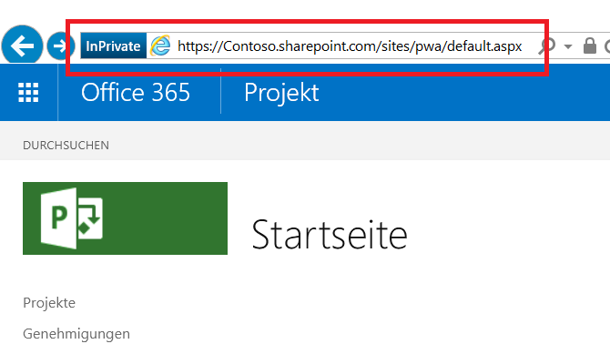

# <a name="developing-a-project-online-application-using-the-client-side-object-model-csom"></a><span data-ttu-id="d9575-103">Entwickeln einer Project Online-Anwendung mit dem clientseitigen Objektmodell (CSOM)</span><span class="sxs-lookup"><span data-stu-id="d9575-103">Developing a Project Online application using the client-side object model (CSOM)</span></span>

>[!NOTE] 
><span data-ttu-id="d9575-104">Dieser Artikel beschreibt die Entwicklung von Microsoft Project Online-Anwendungen zur Verwendung von CSOM.</span><span class="sxs-lookup"><span data-stu-id="d9575-104">This article describes Microsoft Project Online application development for using CSOM.</span></span> <span data-ttu-id="d9575-105">Wir empfehlen Ihnen, die Entwicklung von Anwendungen mit dem [neuen Project für das Web](https://developer.microsoft.com/de-DE/office/blogs/developing-applications-and-reports-using-the-new-project/) zu erforschen.</span><span class="sxs-lookup"><span data-stu-id="d9575-105">We recommend you explore how to develop applications using the [new Project for the web](https://developer.microsoft.com/de-DE/office/blogs/developing-applications-and-reports-using-the-new-project/).</span></span>
  
## <a name="background"></a><span data-ttu-id="d9575-106">Hintergrund</span><span class="sxs-lookup"><span data-stu-id="d9575-106">Background</span></span>

<span data-ttu-id="d9575-107">Microsoft Project kam in den frühen 1990er Jahren als Desktopanwendung auf den Markt.</span><span class="sxs-lookup"><span data-stu-id="d9575-107">Microsoft Project started as desktop application in the early 1990's.</span></span> <span data-ttu-id="d9575-108">Heute ist Project viel mehr, wie seine verschiedenen Varianten belegen:</span><span class="sxs-lookup"><span data-stu-id="d9575-108">Today, Project is much more, as its several varieties attest:</span></span>
  
- <span data-ttu-id="d9575-109">Die Project Standard-Edition ist eine Desktopanwendung, die als eigenständige Anwendung ausgeführt wird.</span><span class="sxs-lookup"><span data-stu-id="d9575-109">Project standard edition is a desktop application that runs as a stand-alone application.</span></span>
    
- <span data-ttu-id="d9575-110">Die Project Professional-Edition ist eine Desktopanwendung, die in größerem Maßstab mit einem Server interagieren und Daten austauschen kann und die in der Lage ist, die von der Project Standard-Edition bereitgestellte Funktionalität auszuführen.</span><span class="sxs-lookup"><span data-stu-id="d9575-110">Project professional edition is a desktop application that can interact and share data with a server on a larger scale, as well as perform the functionality found in Project standard edition.</span></span>
    
- <span data-ttu-id="d9575-111">Project Online ist ein von Microsoft gehosteter Dienst, der Unternehmen eine auf PMO-Ebene angesiedelte Lösung zur Koordinierung und Verwaltung von Projekten, Programmen und Portfolios bietet.</span><span class="sxs-lookup"><span data-stu-id="d9575-111">Project Online is a Microsoft-hosted service that provides companies with a PMO-level solution to coordinate and manage projects, programs, and portfolios.</span></span> <span data-ttu-id="d9575-112">Als Angebot, das sich von den Desktop-Editionen unterscheidet, kann Project Online Projektdetails während der gesamten Laufzeit eines Projekts verwalten und nachverfolgen.</span><span class="sxs-lookup"><span data-stu-id="d9575-112">A different offering than the desktop editions, Project Online can maintain and track project details throughout the life of a project.</span></span> 
    
- <span data-ttu-id="d9575-113">Project Server ist ein von einem Unternehmen gehosteter Dienst, in dem das Unternehmen den Server verwaltet und schützt, auf dem sich Projekt-, Programm- und Portfolioinformationen befinden.</span><span class="sxs-lookup"><span data-stu-id="d9575-113">Project Server is an enterprise-hosted service in which the enterprise manages and secures the server containing project, program, and portfolio information.</span></span> <span data-ttu-id="d9575-114">Project Server bietet, insbesondere durch Schützen des Servers im eigenen Haus, die projekt-, programm- und portfolioorientierten Funktionen von extern gehostetem Project Online mit einer größeren Anpassungsfähigkeit.</span><span class="sxs-lookup"><span data-stu-id="d9575-114">Project Server, by virtue of securing the server in-house, offers the project, program, and portfolio oriented features of externally-hosted Project Online with a greater capacity for customization.</span></span>
    
<span data-ttu-id="d9575-115">Project Online hat drei Online-API-Sätze: clientseitiges Objektmodell (CSOM), JavaScript-Objektmodell (JSOM) und Representational State Transfer (REST).</span><span class="sxs-lookup"><span data-stu-id="d9575-115">Project Online has three online API sets: Client-side Object Model (CSOM), JavaScript Object Model (JSOM), and Representational State Transfer (REST).</span></span> 
  
- <span data-ttu-id="d9575-116">Die .NET CSOM-Implementierung ist die bevorzugte Schnittstelle bei der Entwicklung von Windows-Anwendungen, die mit Project Online-Mandanten interagieren.</span><span class="sxs-lookup"><span data-stu-id="d9575-116">The .NET CSOM implementation is the preferred interface when developing Windows applications that interact with Project Online tenants.</span></span> <span data-ttu-id="d9575-117">Typische Umgebungen für benutzerorientierte Anwendungen sind Windows-Desktops und Microsoft Surface-Geräte.</span><span class="sxs-lookup"><span data-stu-id="d9575-117">Typical environments for user-centric applications include Windows desktops and Microsoft Surface devices.</span></span> <span data-ttu-id="d9575-118">Back-End-Anwendung, die mit .NET CSOM geschrieben wurden, können mit anderen Servern für Geschäftslogik und Datenquellen verbunden werden, die sich außerhalb von Project Online befinden.</span><span class="sxs-lookup"><span data-stu-id="d9575-118">Back-end applications written with .NET CSOM can connect to other servers for business logic and data sources that are external to Project Online.</span></span> <span data-ttu-id="d9575-119">Abrufanforderungen an Project Online verwenden ein LINQ-ähnliches Abfragesystem, das mehrere Verbesserungen gegenüber den einfachen Abruffunktionen bietet.</span><span class="sxs-lookup"><span data-stu-id="d9575-119">Retrieval requests to Project Online use a LINQ-like query system that offers several enhancements over basic retrieval functions.</span></span>
    
- <span data-ttu-id="d9575-120">Die JavaScript-Objektmodell-Schnittstelle (JSOM-Schnittstelle) bietet browserübergreifende Unterstützung für Project Online-Add-Ins. Ein Add-In ist eine Webanwendung, die im Project Online-Mandanten gespeichert ist.</span><span class="sxs-lookup"><span data-stu-id="d9575-120">The JavaScript Object Model (JSOM) interface provides cross-browser support for Project Online Add-ins. An add-in is a web application that is stored in the Project Online tenant.</span></span> <span data-ttu-id="d9575-121">Wenn ein Benutzer ein Add-In ausführen möchte, wird der Code für das Add-In heruntergeladen und im Browser auf dem Benutzercomputer ausgeführt.</span><span class="sxs-lookup"><span data-stu-id="d9575-121">When a user wants to run an add-in, the code for the add-in downloads and runs in the browser on the user machine.</span></span> 
    
- <span data-ttu-id="d9575-122">Das REST/OData-Modell stellt HTTP-basierte Kommunikation bereit. Diese Schnittstelle wird für Anwendungen in Nicht-Windows-Umgebungen empfohlen.</span><span class="sxs-lookup"><span data-stu-id="d9575-122">The REST/Odata model provides HTTP-based communication, This interface is recommended for applications in non-Windows environments.</span></span> <span data-ttu-id="d9575-123">Kommunikationsendpunkte sind die Objekte in der PWA-Website (Project Web Application).</span><span class="sxs-lookup"><span data-stu-id="d9575-123">Communication endpoints are the objects in the Project Web Application (PWA) site.</span></span> <span data-ttu-id="d9575-124">Ergebnisse stellen normale HTTP-Statuscodes bereit.</span><span class="sxs-lookup"><span data-stu-id="d9575-124">Results provide normal HTTP status codes.</span></span>
    
<span data-ttu-id="d9575-125">Dieser Artikel konzentriert sich auf eine Anwendung, in der die .NET CSOM-Schnittstelle verwendet wird.</span><span class="sxs-lookup"><span data-stu-id="d9575-125">This article focuses on an application that uses the .NET CSOM interface.</span></span>
  
## <a name="prerequisites"></a><span data-ttu-id="d9575-126">Voraussetzungen</span><span class="sxs-lookup"><span data-stu-id="d9575-126">Prerequisites</span></span>

<span data-ttu-id="d9575-127">Beginnen Sie mit einem Basissystem unter Windows 10, und fügen Sie die folgenden Elemente hinzu:</span><span class="sxs-lookup"><span data-stu-id="d9575-127">Start with a base system running Windows 10, and add the following items:</span></span>
  
- <span data-ttu-id="d9575-128">.NET Framework 4.0 oder höher: Verwenden Sie das vollständige Framework.</span><span class="sxs-lookup"><span data-stu-id="d9575-128">.Net Framework 4.0 or later -- Use the complete framework.</span></span> <span data-ttu-id="d9575-129">Die Download-Website ist https://msdn.microsoft.com/vstudio/aa496123.aspx.</span><span class="sxs-lookup"><span data-stu-id="d9575-129">The download site is https://msdn.microsoft.com/vstudio/aa496123.aspx.</span></span>
    
- <span data-ttu-id="d9575-130">Visual Studio 2013 oder höher: Es kann jede Edition verwendet werden.</span><span class="sxs-lookup"><span data-stu-id="d9575-130">Visual Studio 2013 or later -- Any edition is acceptable.</span></span> <span data-ttu-id="d9575-131">Die Community-Edition von Visual Studio 2015 wurde verwendet, um die Beispielanwendung zu entwickeln.</span><span class="sxs-lookup"><span data-stu-id="d9575-131">The community edition of Visual Studio 2015 was used to develop the sample application.</span></span> <span data-ttu-id="d9575-132">Die Community-Edition steht unter https://www.visualstudio.com/en-us/products/visual-studio-community-vs.aspx zur Verfügung.</span><span class="sxs-lookup"><span data-stu-id="d9575-132">The community edition is available at https://www.visualstudio.com/en-us/products/visual-studio-community-vs.aspx.</span></span>
    
- <span data-ttu-id="d9575-133">SharePoint Client Components SDK: Project Online und Project Server setzen auf SharePoint und SharePoint-Assemblys auf.</span><span class="sxs-lookup"><span data-stu-id="d9575-133">SharePoint Client Components SDK -- Project Online and Project Server sit on top of SharePoint, and SharePoint assemblies.</span></span> <span data-ttu-id="d9575-134">Die SharePoint Client Components sind in den Visual Studio-Editionen Professional und Enterprise enthalten.</span><span class="sxs-lookup"><span data-stu-id="d9575-134">The SharePoint Client Components are included in Visual Studio Professional and Enterprise editions.</span></span> <span data-ttu-id="d9575-135">Wenn Sie Visual Studio Community verwenden, ist die neueste Version des Office Developer Tools SDKs auf der folgenden Website verfügbar: https://www.microsoft.com/en-us/download/details.aspx?id=35585.</span><span class="sxs-lookup"><span data-stu-id="d9575-135">If you use Visual Studio Community edition, the latest version of the Office Developer Tools SDK is available at the following site: https://www.microsoft.com/en-us/download/details.aspx?id=35585.</span></span>
    
- <span data-ttu-id="d9575-136">Ein Project Online-Konto: Dies ermöglicht den Zugriff auf die hostende Website.</span><span class="sxs-lookup"><span data-stu-id="d9575-136">A Project Online account -- This provides access to the hosting site.</span></span> <span data-ttu-id="d9575-137">Weitere Informationen zum Einrichten eines Project Online-Kontos finden Sie unter https://products.office.com/en-gb/project/project-portfolio-management.</span><span class="sxs-lookup"><span data-stu-id="d9575-137">For more information about obtaining a Project Online account, see https://products.office.com/en-gb/project/project-portfolio-management.</span></span>
    
- <span data-ttu-id="d9575-138">Projekte auf der hostenden Website, die mit Informationen ausgefüllt sind</span><span class="sxs-lookup"><span data-stu-id="d9575-138">Projects on the hosting site that are populated with information</span></span>
    
> [!NOTE]
> <span data-ttu-id="d9575-139">Das standardmäßige .NET Framework (4.0 oder höher) ist das zu verwendende Framework.</span><span class="sxs-lookup"><span data-stu-id="d9575-139">The standard .NET Framework (4.0 or later) is the correct framework to use.</span></span> <span data-ttu-id="d9575-140">Verwenden Sie nicht .NET Framework 4 Client Profile.</span><span class="sxs-lookup"><span data-stu-id="d9575-140">Do not use the .NET Framework 4 Client Profile.</span></span> 
  
## <a name="develop-the-application"></a><span data-ttu-id="d9575-141">Entwickeln der Anwendung</span><span class="sxs-lookup"><span data-stu-id="d9575-141">Develop the application</span></span>

<span data-ttu-id="d9575-142">Beim Entwickeln einer Desktopanwendung für SharePoint ist das clientseitige Objektmodell (CSOM) für Project die bevorzugte Schnittstelle.</span><span class="sxs-lookup"><span data-stu-id="d9575-142">In developing a desktop application for SharePoint, the preferred interface is the Project client side object model (CSOM).</span></span> 
  
<span data-ttu-id="d9575-143">Sie können die [CSOM-Beispiele für Project](https://developer.microsoft.com/project/gallery/?filterBy=Samples,Project) aus dem Project Developer-Ressourcenkatalog im Office Dev Center herunterladen.</span><span class="sxs-lookup"><span data-stu-id="d9575-143">You can download the [Project CSOM samples](https://developer.microsoft.com/project/gallery/?filterBy=Samples,Project) from the Project Developer resource gallery on the Office Dev Center.</span></span>
  
<span data-ttu-id="d9575-144">Die ersten beiden Themen behandeln grundlegende Aspekte: Erstellen eines Visual Studio-Projekts mit geeigneten Namespaces und Assemblys und Zugreifen auf den hostenden Server.</span><span class="sxs-lookup"><span data-stu-id="d9575-144">The first two topics cover basic issues: creating a Visual Studio project with appropriate namespaces and assemblies, and accessing the hosting server.</span></span> <span data-ttu-id="d9575-145">Die übrigen Themen befassen sich mit dem Abrufen von Informationen über das CSOM aus einem und aus vielen Objekten.</span><span class="sxs-lookup"><span data-stu-id="d9575-145">The remaining topics deal with retrieving information through the CSOM, from one and many objects.</span></span> 
  
<span data-ttu-id="d9575-146">Das Abrufen von Informationen vom Host ist ein Zwei-Aktionen-Vorgang aus Client-Anwendungen.</span><span class="sxs-lookup"><span data-stu-id="d9575-146">Retrieving information from the host is a two-action process from client applications.</span></span> <span data-ttu-id="d9575-147">Als Erstes gibt die Anwendung Abrufanforderungen an und sendet diese an den Server.</span><span class="sxs-lookup"><span data-stu-id="d9575-147">First, the application specifies and sends one or more retrieval requests to the server.</span></span> <span data-ttu-id="d9575-148">Als Zweites sendet die Anwendung eine Benachrichtigung an den Server, damit die übermittelten Abfragen ausgeführt werden.</span><span class="sxs-lookup"><span data-stu-id="d9575-148">Second, the application issues a notification to the server to execute the submitted queries.</span></span> <span data-ttu-id="d9575-149">Der Server antwortet, indem er die Abfrageergebnisse an den Client sendet.</span><span class="sxs-lookup"><span data-stu-id="d9575-149">The server responds by sending the query results to the client.</span></span>
  
### <a name="set-up-the-visual-studio-project"></a><span data-ttu-id="d9575-150">Einrichten des Visual Studio-Projekts</span><span class="sxs-lookup"><span data-stu-id="d9575-150">Set up the Visual Studio project</span></span>

<span data-ttu-id="d9575-151">Das Einrichten der Anwendung besteht aus dem Erstellen eines neuen Projekts, dem Verknüpfen der entsprechenden Assemblys und dem Deklarieren der benötigten Namespaces.</span><span class="sxs-lookup"><span data-stu-id="d9575-151">The application setup consists of creating a new project, linking the appropriate assemblies and declaring the needed namespaces.</span></span> <span data-ttu-id="d9575-152">Visual Studio bietet verschiedene Typen von Entwicklungsprojekten.</span><span class="sxs-lookup"><span data-stu-id="d9575-152">Visual Studio presents several types of development projects.</span></span> 
  
#### <a name="select-a-visual-studio-project"></a><span data-ttu-id="d9575-153">Auswählen eines Visual Studio-Projekts</span><span class="sxs-lookup"><span data-stu-id="d9575-153">Select a Visual Studio project</span></span>

1. <span data-ttu-id="d9575-154">Starten Sie Visual Studio, und wählen Sie **Neues Projekt starten** auf der Startseite aus.</span><span class="sxs-lookup"><span data-stu-id="d9575-154">Launch Visual Studio and select **Start A New Project** on the Start Page.</span></span> 
    
   <span data-ttu-id="d9575-155">Im Dialogfeld "Neues Projekt" werden verfügbare Anwendungsvorlagen und Datenfelder für die jeweils ausgewählte Vorlage angezeigt.</span><span class="sxs-lookup"><span data-stu-id="d9575-155">The New Project dialog displays available application templates, and data fields for any selected template.</span></span> 
    
2. <span data-ttu-id="d9575-156">Geben Sie für diese Anwendung die folgenden Elemente an.</span><span class="sxs-lookup"><span data-stu-id="d9575-156">For this application, specify the following items.</span></span> <span data-ttu-id="d9575-157">Schlüsselwörter, die auf dem Bildschirm zu finden sind, sind fett ausgezeichnet:</span><span class="sxs-lookup"><span data-stu-id="d9575-157">Keywords encountered on the screen have a bold attribute:</span></span>
    
   1. <span data-ttu-id="d9575-158">Wählen Sie aus den installierten Vorlagen im linken Bereich die Vorlage \*\* C# \*\*  =>  **Windows** => **Klassischer Desktop** aus.</span><span class="sxs-lookup"><span data-stu-id="d9575-158">From the Installed templates in the left pane, select **C#** => **Windows** => **Classic desktop**.</span></span> 
    
   2. <span data-ttu-id="d9575-159">Wählen Sie oben im zentralen Bereich die Option **.NET Framework 4** aus.</span><span class="sxs-lookup"><span data-stu-id="d9575-159">At the top of the central pane, select **.NET Framework 4**.</span></span> 
    
   3. <span data-ttu-id="d9575-160">Wählen Sie aus den Anwendungstypen im zentralen Bereich den Typ **Konsolenanwendung** aus.</span><span class="sxs-lookup"><span data-stu-id="d9575-160">From the application types in the central pane, choose **Console Application**.</span></span> 
    
   4. <span data-ttu-id="d9575-161">Geben Sie im unteren Abschnitt einen Namen und Speicherort für das Projekt und einen Projektmappennamen an.</span><span class="sxs-lookup"><span data-stu-id="d9575-161">In the bottom section, specify a name and location for the project, and a solution name.</span></span> 
    
   5. <span data-ttu-id="d9575-162">Aktivieren Sie außerdem im unteren Abschnitt das Kontrollkästchen **Projektmappenverzeichnis erstellen**.</span><span class="sxs-lookup"><span data-stu-id="d9575-162">Also in the bottom section, check the **Create directory for solution** box.</span></span> 
    
3. <span data-ttu-id="d9575-163">Klicken Sie auf **OK**, um das Ausgangsprojekt zu erstellen.</span><span class="sxs-lookup"><span data-stu-id="d9575-163">Click **OK** to create the initial project.</span></span> 
    
#### <a name="add-assemblies"></a><span data-ttu-id="d9575-164">Hinzufügen von Assemblys</span><span class="sxs-lookup"><span data-stu-id="d9575-164">Add assemblies</span></span>

<span data-ttu-id="d9575-165">Für die VS-Projektmappe sind die Assembly "ProjectServerClient" aus dem Project 2013 SDK, einige Assemblys aus dem SharePoint SDK und die .NET Framework-Assembly "System.Security" erforderlich.</span><span class="sxs-lookup"><span data-stu-id="d9575-165">The VS solution needs the ProjectServerClient assembly from the Project 2103 SDK, a couple of assemblies from the SharePoint SDK, and the .NET Framework System.Security assembly.</span></span>
  
1. <span data-ttu-id="d9575-166">Klicken Sie im Projektmappen-Explorer von VS mit der rechten Maustaste auf den Eintrag "Verweise", und wählen Sie **Verweis hinzufügen...**</span><span class="sxs-lookup"><span data-stu-id="d9575-166">In the VS Solution Explorer, right-click the References entry, and select **Add Reference…**</span></span> <span data-ttu-id="d9575-167">im Kontextmenü aus.</span><span class="sxs-lookup"><span data-stu-id="d9575-167">from the shortcut menu.</span></span> 
    
2. <span data-ttu-id="d9575-168">Aktivieren Sie den Verweis **Microsoft.ProjectServer.Client.dll**.</span><span class="sxs-lookup"><span data-stu-id="d9575-168">Check the **Microsoft.ProjectServer.Client.dll**.</span></span> 
    
   <span data-ttu-id="d9575-169">Klicken Sie ggf. auf die Schaltfläche **Durchsuchen...**</span><span class="sxs-lookup"><span data-stu-id="d9575-169">If needed, click the **Browse…**</span></span> <span data-ttu-id="d9575-170">unten im Dialogfeld, und navigieren Sie zum Installationsverzeichnis des Project 2013 SDKs, um die Assembly zu finden.</span><span class="sxs-lookup"><span data-stu-id="d9575-170">button at the bottom of the dialog and navigate to the Project 2013 SDK installation directory to locate the assembly.</span></span> 
    
3. <span data-ttu-id="d9575-171">Klicken Sie auf **OK**.</span><span class="sxs-lookup"><span data-stu-id="d9575-171">Click **OK**.</span></span> 
    
4. <span data-ttu-id="d9575-172">Fügen Sie den Namespace "ProjectServer.Client" zur CS-Datei hinzu.</span><span class="sxs-lookup"><span data-stu-id="d9575-172">Add the PrjoctServer Client namespace to the .cs file.</span></span>
    
   ```cs
    using Microsoft.ProjectServer.Client;
   ```

<span data-ttu-id="d9575-173">Fügen Sie die SharePoint 2013 SDK-Assemblys über die NuGet-Paket-Manager-Konsole hinzu.</span><span class="sxs-lookup"><span data-stu-id="d9575-173">Add the SharePoint 2013 SDK assemblies using the NuGet Package Manager Console.</span></span> 
  
1. <span data-ttu-id="d9575-174">Klicken Sie über das VS-Menü "Extras" auf die folgenden Menüs: **Extras =\> NuGet-Paket-Manager =\> Paket-Manager-Konsole**.</span><span class="sxs-lookup"><span data-stu-id="d9575-174">From the VS Tools menu, click the following menus: **Tools =\> NuGet Package Manager =\> Package Manager Console**.</span></span> 
    
2. <span data-ttu-id="d9575-175">Geben Sie in der Paket-Manager-Konsole den folgenden Befehl ein, und drücken Sie die \<EINGABETASTE\>:</span><span class="sxs-lookup"><span data-stu-id="d9575-175">In the Package Manager Console, enter the following command and press \<ENTER\>:</span></span>
    
   ```cs
    Install-Package Microsoft.SharePointOnline.CSOM
   ```

   <span data-ttu-id="d9575-176">Die **Paket-Manager-Konsole** stellt eine Beschreibung der Befehlsergebnisse bereit, und im Projektmappen-Explorer von VS werden die SharePoint-Assemblys in den Projektverweisen angezeigt.</span><span class="sxs-lookup"><span data-stu-id="d9575-176">The **Package Manager Console** provides a description of the command results; and, the VS Solution Explorer displays the SharePoint assemblies in the project references.</span></span> 
    
3. <span data-ttu-id="d9575-177">Fügen Sie die Namespaces zur CS-Datei hinzu:</span><span class="sxs-lookup"><span data-stu-id="d9575-177">Add the namespaces to the .cs file:</span></span>
    
   ```cs
    using Microsoft.SharePoint.Client;
   ```

<span data-ttu-id="d9575-178">Die Assembly "System.Security" gehört zu .NET Framework und wurde mit dem Framework installiert.</span><span class="sxs-lookup"><span data-stu-id="d9575-178">The System.Security assembly is part of .NET Framework and was installed with the framework.</span></span> <span data-ttu-id="d9575-179">Für die Beispielanwendung ist ein weiterer Namespace erforderlich, der dem hostenden System eine verschlüsselte Zeichenfolge für die Authentifizierung bereitstellt.</span><span class="sxs-lookup"><span data-stu-id="d9575-179">The sample application needs one more namespace that provides an encrypted string to the hosting system for authentication.</span></span> <span data-ttu-id="d9575-180">Sobald die Anwendung authentifiziert ist, kann sie auf Projekte auf dem hostenden System zugreifen.</span><span class="sxs-lookup"><span data-stu-id="d9575-180">Once authenticated, the application can access projects on the hosting system.</span></span> <span data-ttu-id="d9575-181">Fügen Sie den Namespace "System.Security" wie folgt zur CS-Datei hinzu:</span><span class="sxs-lookup"><span data-stu-id="d9575-181">Add the System.Security namespace to the .cs file in this way:</span></span>
  
1. <span data-ttu-id="d9575-182">Klicken Sie im Projektmappen-Explorer von VS mit der rechten Maustaste auf den Eintrag "Verweise", und wählen Sie **Verweis hinzufügen...**</span><span class="sxs-lookup"><span data-stu-id="d9575-182">In the VS Solution Explorer, right-click the References entry, and select **Add Reference…**</span></span> <span data-ttu-id="d9575-183">im Kontextmenü aus.</span><span class="sxs-lookup"><span data-stu-id="d9575-183">from the shortcut menu.</span></span> 
    
2. <span data-ttu-id="d9575-184">Wählen Sie **Assemblys =\> Framework** im linken Bereich des Dialogfelds für den Verweis-Manager aus, und aktivieren Sie dann **System.Security**.</span><span class="sxs-lookup"><span data-stu-id="d9575-184">Select **Assemblies =\> Framework** in the left pane of the References Manager dialog, then check **System.Security**.</span></span> 
    
3. <span data-ttu-id="d9575-185">Klicken Sie auf **OK**.</span><span class="sxs-lookup"><span data-stu-id="d9575-185">Click **OK**.</span></span> 
    
4. <span data-ttu-id="d9575-186">Fügen Sie den Namespace "System.Security" zur CS-Datei hinzu:</span><span class="sxs-lookup"><span data-stu-id="d9575-186">Add the System.Security namespace to the .cs file:</span></span>
    
   ```cs
    using System.Security;
   ```

<span data-ttu-id="d9575-187">Der Anfang der CS-Datei sollte die folgenden Namespaces enthalten:</span><span class="sxs-lookup"><span data-stu-id="d9575-187">The start of the .cs file should contain the following namespaces:</span></span>
  
- <span data-ttu-id="d9575-188">System</span><span class="sxs-lookup"><span data-stu-id="d9575-188">System</span></span>
    
- <span data-ttu-id="d9575-189">System.Collections.Generic</span><span class="sxs-lookup"><span data-stu-id="d9575-189">System.Collections.Generic</span></span>
    
- <span data-ttu-id="d9575-190">System.Linq</span><span class="sxs-lookup"><span data-stu-id="d9575-190">System.Linq</span></span>
    
- <span data-ttu-id="d9575-191">System.Test</span><span class="sxs-lookup"><span data-stu-id="d9575-191">System.Test</span></span>
    
- <span data-ttu-id="d9575-192">Microsoft.ProjectServer.Client</span><span class="sxs-lookup"><span data-stu-id="d9575-192">Microsoft.ProjectServer.Client</span></span>
    
- <span data-ttu-id="d9575-193">Microsoft.SharePoint.Client</span><span class="sxs-lookup"><span data-stu-id="d9575-193">Microsoft.SharePoint.Client</span></span>
    
- <span data-ttu-id="d9575-194">System.Security</span><span class="sxs-lookup"><span data-stu-id="d9575-194">System.Security</span></span>
    
### <a name="connect-to-the-host-system"></a><span data-ttu-id="d9575-195">Verbinden mit dem Hostsystem</span><span class="sxs-lookup"><span data-stu-id="d9575-195">Connect to the host system</span></span>

<span data-ttu-id="d9575-196">Project Online ist eine SharePoint-Anwendung, sodass die Verwendung der SharePoint-Authentifizierung der richtige Ansatz ist.</span><span class="sxs-lookup"><span data-stu-id="d9575-196">Project Online is a SharePoint application, so using SharePoint authentication is the correct approach.</span></span> <span data-ttu-id="d9575-197">Im folgenden Codefragment wird das Zugreifen auf die gehostete Umgebung vorbereitet.</span><span class="sxs-lookup"><span data-stu-id="d9575-197">The following code fragment prepares to access the hosted environment.</span></span>
  
```cs
    class Program
    {
        private static ProjectContext projContext;
        static void Main (string[] args)
        {
            using (ProjectContext projContext = new ProjectContext("https://Contoso.sharepoint.com/sites/pwa"))
            {
                SecureString password - new SecureString();
                foreach (char c in "password".ToCharArray()) password.AppendChar(c);
                //Using SharePoint method to load Credentials
                projContext.Credentials = new SharePointOnlineCredentials("sarad@Contoso.onmicrosoft.com", password);

```

<span data-ttu-id="d9575-198">Die Vorbereitungen für das Zugreifen auf die gehostete Umgebung umfassen die folgenden Schritte:</span><span class="sxs-lookup"><span data-stu-id="d9575-198">Preparations to access the hosted environment include the following items:</span></span>
  
1. <span data-ttu-id="d9575-199">Erstellen Sie ein Kontextobjekt für die Projekte: Dieses Objekt ist im folgenden Code aus dem vorherigen Codefragment enthalten.</span><span class="sxs-lookup"><span data-stu-id="d9575-199">Create a context object for the projects -- this is contained in the following code of the preceding code fragment.</span></span> 
    
   ```cs
    private static ProjectContext projContext;
    
   ```

   <span data-ttu-id="d9575-200">Der Kontext wird an andere Komponenten vererbt, wodurch es dem System ermöglicht wird, den Kontext des Project-Objektmodells zu verwalten.</span><span class="sxs-lookup"><span data-stu-id="d9575-200">The context is inherited by other components, allowing the system to manage the context of the Project object model.</span></span>
    
2. <span data-ttu-id="d9575-201">Geben Sie die Hostwebsite an. Dies erfolgt im folgenden Code aus dem vorherigen Codefragment.</span><span class="sxs-lookup"><span data-stu-id="d9575-201">Identify the host site -- this is done in the following code from the preceding code fragment.</span></span>
    
   ```cs
    using (ProjectContext projContext = new ProjectContext("https://Contoso.sharepoint.com/sites/pwa"))
   ```

   <span data-ttu-id="d9575-202">Wenn der Projektkontext instanziiert wird, muss die Anwendung den Stamm der Websitesammlung für Projekte bereitstellen.</span><span class="sxs-lookup"><span data-stu-id="d9575-202">When instantiating the projects context, the application needs to provide the root of the Projects site collection.</span></span> <span data-ttu-id="d9575-203">Die Anwendung verwendet eine Teilzeichenfolge der URL des Stamms der Projekte.</span><span class="sxs-lookup"><span data-stu-id="d9575-203">The application uses a substring of the URL of the root of the Projects.</span></span> <span data-ttu-id="d9575-204">Ein Momentaufnahme dieser Position ist in der folgenden Abbildung mit einem roten Rechteck hervorgehoben.</span><span class="sxs-lookup"><span data-stu-id="d9575-204">A snapshot of this location is highlighted with a red rectangle in the following illustration.</span></span> <span data-ttu-id="d9575-205">Für die Authentifizierung wird die Zeichenfolge ab deren Anfang bis einschließlich der Teilzeichenfolge "pwa" benötigt.</span><span class="sxs-lookup"><span data-stu-id="d9575-205">The authentication needs the string from its start through the substring "pwa".</span></span> <span data-ttu-id="d9575-206">Im Codeeintrag wird für die Anwendung die Zeichenfolge "https://XXXXXXXX.sharepoint.com/sites/pwa" verwendet.</span><span class="sxs-lookup"><span data-stu-id="d9575-206">In the code listing, the application uses the string "https://XXXXXXXX.sharepoint.com/sites/pwa".</span></span>
        
   <span data-ttu-id="d9575-207"></span><span class="sxs-lookup"><span data-stu-id="d9575-207"></span></span>
  
3. <span data-ttu-id="d9575-208">Geben Sie das Kennwort in einer sicheren Zeichenfolge an. Dies erfolgt im folgenden Code aus dem vorherigen Codefragment.</span><span class="sxs-lookup"><span data-stu-id="d9575-208">Place the password in a secure string -- this is done in the following code from the preceding code fragment.</span></span>
    
   ```cs
    SecureString password - new SecureString();
    foreach (char c in "password".ToCharArray()) password.AppendChar(c);
    
   ```

   <span data-ttu-id="d9575-209">Das Kennwort und das Benutzerkonto sind die Anmeldeinformationen für den Zugriff auf die Hostwebsite.</span><span class="sxs-lookup"><span data-stu-id="d9575-209">The password and user account are the credentials to access the host site.</span></span> 
    
4. <span data-ttu-id="d9575-210">Fügen Sie das Benutzerkonto und das Kennwort zur Anmeldeinformationen-Komponente des Kontextobjekts hinzu. Dies erfolgt im folgenden Code aus dem vorherigen Codefragment.</span><span class="sxs-lookup"><span data-stu-id="d9575-210">Add the user account and password to the credentials portion of the context object -- this is done in the following code from the preceding code fragment.</span></span>
    
   ```cs
    projContext.Credentials = new SharePointOnlineCredentials("sarad@Contoso.onmicrosoft.com", password);
   ```

<span data-ttu-id="d9575-211">Der instanziierte Projektkontext kann nun verwendet werden.</span><span class="sxs-lookup"><span data-stu-id="d9575-211">The instantiated project context is ready to use.</span></span>
  
### <a name="list-all-published-projects"></a><span data-ttu-id="d9575-212">Auflisten aller veröffentlichten Projekte</span><span class="sxs-lookup"><span data-stu-id="d9575-212">List all published projects</span></span>

<span data-ttu-id="d9575-213">Project Online und ProjectServer verwenden Proxys, um mit dem Server zum Ausführen von Erstell-, Berichts-, Aktualisier- und Löschvorgängen zu kommunizieren.</span><span class="sxs-lookup"><span data-stu-id="d9575-213">Project Online and ProjectServer use proxies to communicate with the server for create, report, update, and delete (CRUD) operations.</span></span> <span data-ttu-id="d9575-214">Der Host/Server verarbeitet Anfragen auf effiziente Weise und lässt den Client die folgenden Aktionen in der Kommunikation mit dem Server ausführen:</span><span class="sxs-lookup"><span data-stu-id="d9575-214">The host/server handles requests in an efficient manner and has the client perform the following actions in communicating with the server:</span></span>
  
1. <span data-ttu-id="d9575-215">Richten Sie einen Kontext für Kommunikation ein.</span><span class="sxs-lookup"><span data-stu-id="d9575-215">Establish a context for communication.</span></span> 
    
   <span data-ttu-id="d9575-216">Der Kontext wird von der Projektesammlung sowie anderen Objekten und Sammlungen (Collections) durch Vererbung verwendet, einschließlich der Aufgabensammlung, der Zuweisungensammlung, des Stufenobjekts und benutzerdefinierter Felder.</span><span class="sxs-lookup"><span data-stu-id="d9575-216">The context is used by the projects collection, as well as other objects and collections through inheritance, including the tasks collection, assignments collection, the stage object, and custom fields.</span></span> 
    
2. <span data-ttu-id="d9575-217">Geben Sie mit dem Objektmodell ein Objekt, eine Sammlung oder Daten an, die abgerufen werden sollen.</span><span class="sxs-lookup"><span data-stu-id="d9575-217">Use the object model to specify an object, collection, or data to retrieve.</span></span>
    
   <span data-ttu-id="d9575-218">In diesem Schritt wird LINQ als Abfrage oder Methode verwendet.</span><span class="sxs-lookup"><span data-stu-id="d9575-218">This step uses LINQ as a query or as a method.</span></span> <span data-ttu-id="d9575-219">Die Spezifikation steuert, was Sie erhalten.</span><span class="sxs-lookup"><span data-stu-id="d9575-219">The specification controls what you receive.</span></span> <span data-ttu-id="d9575-220">Dieser Schritt wird häufig als Kern der Load-Methode (Schritt 3) eingebettet.</span><span class="sxs-lookup"><span data-stu-id="d9575-220">Often, this step is embedded as the body of the Load method (step 3).</span></span> 
    
3. <span data-ttu-id="d9575-221">Laden Sie die Spezifikation aus dem vorherigen Schritt mit der Load()- oder LoadQuery()-Methode.</span><span class="sxs-lookup"><span data-stu-id="d9575-221">Load the retrieval specification from the previous step using the Load() or LoadQuery() method.</span></span>
    
   <span data-ttu-id="d9575-222">Verwenden Sie für das Laden von Sammlungen und Objekten Load().</span><span class="sxs-lookup"><span data-stu-id="d9575-222">For loading collections and objects, use Load().</span></span> <span data-ttu-id="d9575-223">Verwenden Sie für Abfragen mit Klauseln wie "where" und "group" LoadQuery().</span><span class="sxs-lookup"><span data-stu-id="d9575-223">For queries with clauses such as "where" and "group", use LoadQuery().</span></span> 
    
4. <span data-ttu-id="d9575-224">Führen Sie die Anforderung mit der ExecuteQuery()-Methode aus.</span><span class="sxs-lookup"><span data-stu-id="d9575-224">Execute the request using the ExecuteQuery() method.</span></span>
    
   <span data-ttu-id="d9575-225">Die ExecuteQuery()-Methode benachrichtigt den Host, dass die Abfrage oder Abfragen ausgeführt werden können.</span><span class="sxs-lookup"><span data-stu-id="d9575-225">The ExecuteQuery() method notifies the host that the query or queries are ready to execute.</span></span> <span data-ttu-id="d9575-226">Sobald der Host die Benachrichtigung erhalten hat, führt er die Abfragen aus und sendet die Ergebnisse an den Client.</span><span class="sxs-lookup"><span data-stu-id="d9575-226">Once the host receives notification, it executes the queries and sends the results to the client.</span></span> 
    
<span data-ttu-id="d9575-227">Sobald die Informationen beim Client eingetroffen sind, kann die Anwendung diese verwenden.</span><span class="sxs-lookup"><span data-stu-id="d9575-227">With the information at the client, the application can use it.</span></span> <span data-ttu-id="d9575-228">Im folgenden Codefragment werden die veröffentlichten Projekte durchlaufen und werden die ID und der Name für jedes der auf dem Host veröffentlichten Projekte ausgegeben.</span><span class="sxs-lookup"><span data-stu-id="d9575-228">The following code fragment cycles through the published projects and prints the Id and Name for each published project on the host.</span></span>
  
```cs
// Get the list of projects in Project Web App.
var projects = projContext.Projects;
projContext.Load(projects);
projcontext.ExecuteQuery();
foreach (PublishedProject pubProj in projContext.Projects)
{
    Console.WriteLine("\n{0}. {1}   {2} \t{3} \n", j++, pubProj.Id, pubProj.Name, pubProj.CreatedDate);
}

```

<span data-ttu-id="d9575-229">Ausgabe:</span><span class="sxs-lookup"><span data-stu-id="d9575-229">Output:</span></span>
  
```cs
Published Project count:2
1. be80a848-b2ef-e511-80f4-00155dc84e01   A second Project     3/21/2016 10:14:40 PM
2. 9d730a1a-60ed-e511-80f6-00155dc87d01   Ent_Proj_1   3/18/2016 11:21:14 PM

```

### <a name="make-a-request"></a><span data-ttu-id="d9575-230">Stellen einer Anforderung</span><span class="sxs-lookup"><span data-stu-id="d9575-230">Make a request</span></span>

<span data-ttu-id="d9575-231">Über Verwenden der Aktionen aus dem vorherigen Codefragment ruft die Anwendung die Liste der Projekte im angegebenen Konto auf der hostenden Website ab.</span><span class="sxs-lookup"><span data-stu-id="d9575-231">Using the actions from the previous code fragment, the application retrieves the list of projects in the specified account on the hosting site.</span></span> 
  
1. <span data-ttu-id="d9575-232">Die Projektkontext wird für die aufzulistenden Projekte angegeben.</span><span class="sxs-lookup"><span data-stu-id="d9575-232">The ProjectContext is specified for the projects to list.</span></span> 
    
   ```cs
    var projects = projContext.Projects;
   ```

2. <span data-ttu-id="d9575-233">Geben Sie das abzurufende Element an.</span><span class="sxs-lookup"><span data-stu-id="d9575-233">Specify the item to retrieve.</span></span> 
    
   ```cs
    projContext.Load(projects);
   ```

   <span data-ttu-id="d9575-234">Weil nur die Sammlung angegeben ist, ruft der Server die Projektsammlung ab, wobei jedes Projekt mit den Werten für den Standardsatz der Eigenschaften aufgefüllt wird.</span><span class="sxs-lookup"><span data-stu-id="d9575-234">By only stating the collection, the server retrieves the project collection, populating each project with values for the default set of properties.</span></span> <span data-ttu-id="d9575-235">Zugreifen auf Eigenschaften, die zum Standardeigenschaftensatz gehören, bringt erfolgreiche Ergebnisse.</span><span class="sxs-lookup"><span data-stu-id="d9575-235">Accessing properties that are part of the default property set gives successful results.</span></span> <span data-ttu-id="d9575-236">Zugreifen auf Eigenschaften, die nicht zum Standardeigenschaftensatz gehören, führt zu einer "Nicht initialisiert"-Ausnahme.</span><span class="sxs-lookup"><span data-stu-id="d9575-236">Accessing properties that are not part of the default set results in a "Not initialized" exception.</span></span>
    
3. <span data-ttu-id="d9575-237">Laden Sie die Anforderung (projContext.Load).</span><span class="sxs-lookup"><span data-stu-id="d9575-237">Load the request (projContext.Load).</span></span>
    
   <span data-ttu-id="d9575-238">Dies gehört zum vorherigen Schritt.</span><span class="sxs-lookup"><span data-stu-id="d9575-238">This is part of the previous step.</span></span>
    
4. <span data-ttu-id="d9575-239">Führen Sie die Abfrage aus (ExecuteQuery).</span><span class="sxs-lookup"><span data-stu-id="d9575-239">Execute the query (ExecuteQuery).</span></span> 
    
   ```cs
    projContext.ExecuteQuery();
   ```

### <a name="retrieve-high-level-project-information"></a><span data-ttu-id="d9575-240">Abrufen von allgemeinen Projektinformationen</span><span class="sxs-lookup"><span data-stu-id="d9575-240">Retrieve high-level project information</span></span>

<span data-ttu-id="d9575-241">Eigenschaften, die keine Standardeigenschaften sind, müssen in der Anforderung an den Server angegeben werden.</span><span class="sxs-lookup"><span data-stu-id="d9575-241">Properties that are not default properties must be specified in the request to the server.</span></span> <span data-ttu-id="d9575-242">Im nächsten Codefragment wird der Kontext der Projektesammlung so wie im vorherigen Beispiel geladen.</span><span class="sxs-lookup"><span data-stu-id="d9575-242">The next code fragment loads the projects collection context as in the previous example.</span></span> <span data-ttu-id="d9575-243">Anschließend werden in der Spezifikation Nicht-Standardeigenschaften angefordert, die im Ergebnis enthalten sein sollen.</span><span class="sxs-lookup"><span data-stu-id="d9575-243">Then, the specification requests additional non-default properties to include in the result.</span></span> 
  
```cs
var projects = projContext.Projects;
projContext.Load(projects,
    ps => ps.IncludeWithDefaultProperties(
        p => p.StartDate, p => p.Phase, p => p.Stage));
projContext.ExecuteQuery();

```

<span data-ttu-id="d9575-244">In der Load-Anweisung wird der Kontext der Projektesammlung angegeben und werden das Startdatum (StartDate), die Phase und die Stufe (Stage) hinzugefügt.</span><span class="sxs-lookup"><span data-stu-id="d9575-244">The load statement specifies the projects collection context, and adds the StartDate, Phase, and Stage to the query result.</span></span> <span data-ttu-id="d9575-245">Die zusätzlichen Eigenschaften skalar, Objekte oder Sammlungen sein.</span><span class="sxs-lookup"><span data-stu-id="d9575-245">The additional properties can be scalar, objects, or collections.</span></span> <span data-ttu-id="d9575-246">Auf skalare Elemente kann direkt zugegriffen werden.</span><span class="sxs-lookup"><span data-stu-id="d9575-246">Scalar items can be accessed directly.</span></span> <span data-ttu-id="d9575-247">Objekte und Sammlungen erfordern zusätzliche Verarbeitungsschritte, wie im folgenden Codefragment.</span><span class="sxs-lookup"><span data-stu-id="d9575-247">Objects and collections require additional processing, as in the following code fragment.</span></span>
  
```cs
// Using the previous definition and Load statement …
projContext.ExecuteQuery();
foreach (PublishedProject pubProj in projContext.Projects)
{
Console.WriteLine("\n\t{0}. \t{1} \n\t{2} \n\t{3} \n", j++, pubProj.Id, pubProj.Name,
    pubProj.CreatedDate);
             // The following statement generates an exception about the object 
             // reference not being set to an instance on the server. 
             // Console.WriteLine("\tCurrent Phase:\t{0}", pubProj.Phase.Name);
             // Phase and Stage are not published with the rest of the data. Need to pull these objects from the server.
             Phase oPhase = pubProj.Phase;
             projContext.Load(oPhase);
             projContext.ExecuteQuery();
             //if-else fails because the else case fails with "Microsoft.SharePoint.Client.ServerObjectNullReferenceException".
             //if (oPhase.ServerObjectIsNull != null)
             //Using try-catch instead
             try
             {
                  Console.WriteLine("\tCurrent Phase:\t{0}", oPhase.Name);
             }
             
             catch
             {
                  Console.WriteLine("\tCurrent Phase:\t Not available");
             }
             
             Stage oStage = pubProj.Stage;
             projContext.Load(oStage);
             projContext.ExecuteQuery();
             //Again, not using if-else combination for the same reason as above.
             try
             {
                  Console.WriteLine("\tCurrent Stage:\t{0}", oStage.Name);
             }
             
             catch
             {
                  Console.WriteLine("\tCurrent Stage:\t Not available");
    }

```

<span data-ttu-id="d9575-248">Ausgabe für die ersten drei Projekte:</span><span class="sxs-lookup"><span data-stu-id="d9575-248">Output of the first three projects:</span></span>
  
```cs
Project counts:31
1. Project ID:  957d5fcd-5cbf-e111-9f1e-00155d022681
        Name:           Acquisition Target Analysis
        CreatedDate:            3/22/2016 5:14:34 PM
        Current Phase:  3. Plan
        Current Stage:  6. Plan
2. Project ID:  16905202-5fbf-e111-9f1e-00155d022681
        Name:           Apparel ERP Upgrade
        CreatedDate:            3/22/2016 5:36:40 PM
        Current Phase:  3. Plan
        Current Stage:  6. Plan
3. Project ID:  dce23152-63bf-e111-9f1e-00155d022681
        Name:           Audit Tracking Solution
        CreatedDate:            3/22/2016 5:02:24 PM
        Current Phase:  2. Select
        Current Stage:  4. Select Gate

```

### <a name="retrieve-all-tasks-in-a-project"></a><span data-ttu-id="d9575-249">Abrufen aller Aufgaben in einem Projekt</span><span class="sxs-lookup"><span data-stu-id="d9575-249">Retrieve all tasks in a project</span></span>

<span data-ttu-id="d9575-250">Jedes Projekt hat viele Aufgaben.</span><span class="sxs-lookup"><span data-stu-id="d9575-250">Each project has many tasks.</span></span> <span data-ttu-id="d9575-251">Somit besteht das Abrufen der Aufgaben für ein einzelnes Projekt aus folgenden Schritten:</span><span class="sxs-lookup"><span data-stu-id="d9575-251">So, pulling the tasks for a single project consists of the following:</span></span>
  
1. <span data-ttu-id="d9575-252">Richten Sie den Kontext der Projektesammlung ein.</span><span class="sxs-lookup"><span data-stu-id="d9575-252">Establish the context of the projects collection.</span></span>
    
   ```cs
    var projects = projContext.Projects;
   ```

2. <span data-ttu-id="d9575-253">Rufen Sie die Projektinformationen ab, einschließlich der Aufgabeneigenschaften.</span><span class="sxs-lookup"><span data-stu-id="d9575-253">Retrieve the project information, including the Task properties.</span></span>
    
   ```cs
    projContext.Load(projects);
    ProjContext.ExecuteQuery();
    foreach (PublishedProject pubProj in projContext.Projects){
    
   ```

    <span data-ttu-id="d9575-254">Beachten Sie, dass die Anwendung für veröffentlichte Projekte vorgesehen ist.</span><span class="sxs-lookup"><span data-stu-id="d9575-254">Note that the application is addressing published projects.</span></span> <span data-ttu-id="d9575-255">Der Kontext für das aktuelle veröffentlichte Projekt ist "pubProj".</span><span class="sxs-lookup"><span data-stu-id="d9575-255">The context for the current published project is pubProj.</span></span> 
    
3. <span data-ttu-id="d9575-256">Richten Sie den Kontext für die Aufgabensammlung (Tasks) ein.</span><span class="sxs-lookup"><span data-stu-id="d9575-256">Establish the context for the Tasks collection.</span></span>
    
   ```cs
    PublishedTaskCollection collTask = pubProj.Tasks;
   ```

   <span data-ttu-id="d9575-257">Die `pubProj.Tasks`-Eigenschaft verweist auf die Aufgaben des aktuellen veröffentlichten Projekts.</span><span class="sxs-lookup"><span data-stu-id="d9575-257">The `pubProj.Tasks` property references the tasks of the current published project.</span></span> 
    
4. <span data-ttu-id="d9575-258">Laden Sie die Spezifikation zum Abrufen der Aufgabensammlung (Task collection), einschließlich der entsprechenden Nicht-Standardeigenschaften.</span><span class="sxs-lookup"><span data-stu-id="d9575-258">Load the specification to retrieve Task collection, including the appropriate non-default properties.</span></span>
    
   ```cs
    projContext.Load(collTask,
        tsk => tsk.IncludeWithDefaultProperties(
            t => t.Id, t => t.Name, t => t.Start,
            t => t.ScheduledStart, t => t.Completion));
    
   ```

5. <span data-ttu-id="d9575-259">Führen Sie die Abfrage aus, um die Aufgabensammlung mit den entsprechenden Eigenschaften abzurufen.</span><span class="sxs-lookup"><span data-stu-id="d9575-259">Execute the query to retrieve the Task collection with the appropriate properties.</span></span>
    
   ```cs
    projContext.ExecuteQuery();
   ```

<span data-ttu-id="d9575-260">Die Informationen liegen nun lokal vor.</span><span class="sxs-lookup"><span data-stu-id="d9575-260">The information is now local.</span></span> <span data-ttu-id="d9575-261">Im folgenden Codefragment wird die veröffentlichte Aufgabensammlung verarbeitet, indem die Informationen in die Konsole geschrieben werden.</span><span class="sxs-lookup"><span data-stu-id="d9575-261">The following code fragment processes the published tasks collection by writing the information to the console.</span></span>
  
```cs
    Console.WriteLine("Task collection count: {0}", collTask.Count.ToString());
    if (collTask.Count > 0)
    {
        int k = 1;    //Task counter.
        foreach (PublishedTask t in collTask)
        {
            Console.WriteLine("{0}. Id:{1} \tName:{2}", k++, t.Id, t.Name);
            Console.WriteLine("\t ScheduledStart:{0} \tStart:{1} \tCompletion:{2}", k, t.ScheduledStart, t.Start, t.Completion);
        }
    }

```

<span data-ttu-id="d9575-262">Ausgabe der Aufgaben für ein Projekt:</span><span class="sxs-lookup"><span data-stu-id="d9575-262">Output of tasks for one project:</span></span>
  
```cs
Task collection count: 5
1. Id:256fa850-b2ef-e511-80f6-00155dc87d01      Name:Load software onto computer
         ScheduledStart:2       Start:4/4/2016 8:00:00 AM       Completion:4/4/2016 8:00:00 AM
2. Id:266fa850-b2ef-e511-80f6-00155dc87d01      Name:Locate and load Project Online SDK
         ScheduledStart:3       Start:4/5/2016 8:00:00 AM       Completion:4/5/2016 8:00:00 AM
3. Id:276fa850-b2ef-e511-80f6-00155dc87d01      Name:Locate and load SP SDK
         ScheduledStart:4       Start:4/5/2016 1:00:00 PM       Completion:4/5/2016 1:00:00 PM
4. Id:286fa850-b2ef-e511-80f6-00155dc87d01      Name:Build app that accesses Proj Online
         ScheduledStart:5       Start:4/6/2016 8:00:00 AM       Completion:4/6/2016 8:00:00 AM
5. Id:296fa850-b2ef-e511-80f6-00155dc87d01      Name:Build app that accesses task assignments
         ScheduledStart:6       Start:4/7/2016 8:00:00 AM       Completion:4/7/2016 8:00:00 AM

```

### <a name="access-information-at-multiple-levels"></a><span data-ttu-id="d9575-263">Zugreifen auf Informationen auf mehreren Ebenen</span><span class="sxs-lookup"><span data-stu-id="d9575-263">Access information at multiple levels</span></span>

<span data-ttu-id="d9575-264">Für jede Aufgabe können eine oder mehrere Personen (auch als</span><span class="sxs-lookup"><span data-stu-id="d9575-264">Each task can have one or more persons (a.k.a.</span></span> <span data-ttu-id="d9575-265">Ressourcen bezeichnet) an der Erledigung der Aufgabe beteiligt sein.</span><span class="sxs-lookup"><span data-stu-id="d9575-265">resource) contributing toward its completion.</span></span> <span data-ttu-id="d9575-266">Die Zuweisungen- (Assignments) und die Ressourcensammlung enthalten diese Informationen für jede Aufgabe.</span><span class="sxs-lookup"><span data-stu-id="d9575-266">The Assignments and Resources collections contain this information for each task.</span></span> 
  
<span data-ttu-id="d9575-267">Die Verarbeitung besteht aus den folgenden Schritten:</span><span class="sxs-lookup"><span data-stu-id="d9575-267">The processing consists of the following:</span></span>
  
1. <span data-ttu-id="d9575-268">Rufen Sie einen Kontext für die Projektaufgabe ab.</span><span class="sxs-lookup"><span data-stu-id="d9575-268">Obtaining a context for the project task.</span></span>
    
2. <span data-ttu-id="d9575-269">Erstellen Sie eine Anforderung, und laden Sie die Anforderung für die Zuweisungen, die mit der Aufgabe verknüpft sind.</span><span class="sxs-lookup"><span data-stu-id="d9575-269">Build a request and load the request for the assignments tied to the task.</span></span> 
    
3. <span data-ttu-id="d9575-270">Führen Sie die Abfrage für die Zuweisungen aus.</span><span class="sxs-lookup"><span data-stu-id="d9575-270">Execute the query for the assignments.</span></span>
    
4. <span data-ttu-id="d9575-271">Erstellen Sie eine Anforderung, und laden Sie die Anforderung für die Ressource, die mit einer einzelnen Zuweisung verknüpft ist.</span><span class="sxs-lookup"><span data-stu-id="d9575-271">Build a request and load the request for the resource associated with an individual assignment.</span></span> 
    
5. <span data-ttu-id="d9575-272">Führen Sie die Abfrage für die Ressource aus.</span><span class="sxs-lookup"><span data-stu-id="d9575-272">Execute the query for the resource.</span></span>
    
> [!NOTE] 
> - <span data-ttu-id="d9575-273">Die Zuweisungensammlung wird explizit in den Informationen vom Server angefordert, weil sie keine Standardeigenschaft der Aufgabensammlung ist.</span><span class="sxs-lookup"><span data-stu-id="d9575-273">The Assignments collection is explicitly requested in the information from the server because it is not a default property of the Tasks collection.</span></span> <span data-ttu-id="d9575-274">Als Sammlung wird anschließend eine Abfrage ausgeführt, um die Sammlung vom Server abzurufen.</span><span class="sxs-lookup"><span data-stu-id="d9575-274">As a collection, a subsequent query is made to pull the collection from the server.</span></span> 
> - <span data-ttu-id="d9575-275">Die Ressource ist ein Objekt.</span><span class="sxs-lookup"><span data-stu-id="d9575-275">The Resource is an object.</span></span> <span data-ttu-id="d9575-276">Die Abfrage für eine Zuweisung enthält den Namen der Ressource, die mit der Zuweisung verknüpft ist.</span><span class="sxs-lookup"><span data-stu-id="d9575-276">The query for an assignment includes the resource name associated with the assignment.</span></span>
    
```cs
PublishedTaskCollection collTask = pubProj.Tasks;
    projContext.Load(collTask,
        tsk => tsk.IncludeWithDefaultProperties(
            t => t.Id, t => t.Name, 
            t => t.Assignments));
    projContext.Load(collTask);
    projContext.ExecuteQuery();
    Console.WriteLine("Task collection count: {0}", collTask.Count.ToString());
    if (collTask.Count > 0)
    {
        int k = 1;    //Task counter.
        //Processing task list for current project
        foreach (PublishedTask t in collTask)
        {
            Console.WriteLine("{0}. Id:{1} \tName:{2}", k, t.Id, t.Name);
            k++;
            //Define and retrieve Assignments for current task
            PublishedAssignmentCollection collAssgns = t.Assignments;
            projContext.Load(collAssgns);
            projContext.ExecuteQuery();
            Console.WriteLine("    Assignment collection count: {0}", collAssgns.Count);
            if (collAssgns.Count > 0)
            {
                //Output string for resources assigned to task
                StringBuilder output = new StringBuilder();
                output.AppendFormat("\t Assignments: ");
                foreach (PublishedAssignment a in collAssgns)
                {
                    //Define and retrieve resource name for current assignment 
                    //(an object)
                    projContext.Load(a,
                        b => b.Resource.Name);
                    projContext.ExecuteQuery();
                    output.AppendFormat("{0}, ", a.Resource.Name);
                }
                Console.WriteLine(output);
            }
            else
            {
                Console.WriteLine("\t Assignments: None");
            }
        }
    }   // endif

```

<span data-ttu-id="d9575-277">Ausgabe für Aufgaben 52, 75 und 76 eines Projekts:</span><span class="sxs-lookup"><span data-stu-id="d9575-277">Output for tasks 52, 75, and 76 of a project:</span></span>
  
```cs
52. Id:2c729e96-54f0-e511-80c6-000d3a33235f     Name:Develop training materials
    Assignment collection count: 1
         Assignments: Robert Lyon,
75. Id:43729e96-54f0-e511-80c6-000d3a33235f     Name:Determine final deployment strategy
    Assignment collection count: 0
         Assignments: None
76. Id:44729e96-54f0-e511-80c6-000d3a33235f     Name:Develop deployment methodology
    Assignment collection count: 4
         Assignments: Molly Dempsey, Sara Davis, Shammi Mohamed, Zainal Arifin, 

```

### <a name="access-custom-enterprise-level-fields"></a><span data-ttu-id="d9575-278">Zugreifen auf benutzerdefinierte Felder auf Unternehmensebene</span><span class="sxs-lookup"><span data-stu-id="d9575-278">Access custom enterprise-level fields</span></span>

<span data-ttu-id="d9575-279">Für Project Online gibt es benutzerdefinierte Felder.</span><span class="sxs-lookup"><span data-stu-id="d9575-279">Custom fields exist for Project Online.</span></span> <span data-ttu-id="d9575-280">Diese Felder sind Felder auf Unternehmensebene, die mit einzelnen Projekten verknüpft werden können.</span><span class="sxs-lookup"><span data-stu-id="d9575-280">These are enterprise-level fields that can be associated with individual project.</span></span> <span data-ttu-id="d9575-281">In diesem Abschnitt ist beschrieben, wie auf diese Felder zugegriffen wird.</span><span class="sxs-lookup"><span data-stu-id="d9575-281">This section describes how to access these fields.</span></span> 
  
<span data-ttu-id="d9575-282">Benutzerdefinierte Felder sind nicht in den Standardeigenschaften enthalten, die mit einem Projekt verknüpft sind.</span><span class="sxs-lookup"><span data-stu-id="d9575-282">Custom fields are not included in the default set of properties associated with a project.</span></span> <span data-ttu-id="d9575-283">Daher müssen sie in der Abrufspezifikation explizit angegeben werden.</span><span class="sxs-lookup"><span data-stu-id="d9575-283">So, they need explicit identification in the retrieval specification.</span></span> <span data-ttu-id="d9575-284">Die grundsätzliche Sicht auf den Vorgang besteht aus den folgenden Schritten:</span><span class="sxs-lookup"><span data-stu-id="d9575-284">The high-level view of the process consists of the following items:</span></span>
  
1. <span data-ttu-id="d9575-285">Erstellen Sie einen Tunnel zum benutzerdefinierten Feld über dessen allgemeinen Namen.</span><span class="sxs-lookup"><span data-stu-id="d9575-285">Tunnel to the custom field using its common name.</span></span>
    
2. <span data-ttu-id="d9575-286">Rufen Sie den internen Namen des benutzerdefinierten Felds ab.</span><span class="sxs-lookup"><span data-stu-id="d9575-286">Retrieve the internal name of the custom field.</span></span>
    
3. <span data-ttu-id="d9575-287">Kehren Sie zum globalen Kontext zurück, und fragen Sie das System mit dem internen Namen des benutzerdefinierten Felds ab.</span><span class="sxs-lookup"><span data-stu-id="d9575-287">Return to the global context and query the system using the internal name of the custom field.</span></span>
    
#### <a name="tunnel-to-the-custom-field-retrieve-its-internal-name-and-used-it-to-query-the-system"></a><span data-ttu-id="d9575-288">Erstellen eines Tunnels zum benutzerdefinierten Feld, Abrufen dessen internen Namens und Abfragen des Systems mit dem Namen</span><span class="sxs-lookup"><span data-stu-id="d9575-288">Tunnel to the custom field, retrieve its internal name, and used it to query the system</span></span>

<span data-ttu-id="d9575-289">In dieser Aufgabe ist ein Abruf angegeben, in dem eine Nicht-Standardeigenschaft mit einem zusätzlichen Detail verwendet wird.</span><span class="sxs-lookup"><span data-stu-id="d9575-289">This task specifies a retrieval that uses a non-default property with one added detail.</span></span>
  
1. <span data-ttu-id="d9575-290">Beginnen Sie durch Verwenden Projektekontexts, wie dies am Anfang dieses Artikels beschrieben ist.</span><span class="sxs-lookup"><span data-stu-id="d9575-290">Begin by using the projects context, as described at the beginning of this article.</span></span>
    
   ```cs
    // Get the list of published projects in Project Web App.
    var projects = projContext.Projects;
    
   ```

2. <span data-ttu-id="d9575-291">Fügen Sie zwei Elemente zur Abrufanforderung der Projektesammlung hinzu, zusätzlich zu allen anderen Nicht-Standardeigenschaften, die abgerufen werden sollen:</span><span class="sxs-lookup"><span data-stu-id="d9575-291">Add two items to the projects collection retrieval request in addition to any other non-default properties to retrieve:</span></span>
    
   ```cs
    projContext.Load(projects,
        ps => ps.IncludeWithDefaultProperties(
            p => p.Phase, p => p.Stage,                  // Other nondefault properties
            p => p.IncludeCustomFields,                  // Gets PublishedProject object 
                                                        // that contains custom fields
            p => p.IncludeCustomFields.CustomFields));   // Populates the custom fields
                    projContext.ExecuteQuery();
    
   ```

   <span data-ttu-id="d9575-292">Die `p => p.IncludeCustomFields`-Klausel kennzeichnet die Notwendigkeit, ein Projektobjekt zu verwenden, das benutzerdefinierte Felder unterstützt.</span><span class="sxs-lookup"><span data-stu-id="d9575-292">The  `p => p.IncludeCustomFields` clause identifies the need to use a project object that supports custom fields.</span></span> 
    
   <span data-ttu-id="d9575-293">In der `p => p.IncludeCustomFields.CustomFields`-Klausel wird die Einbeziehung von Daten aus benutzerdefinierten Feldern in das Abfrageergebnis angefordert.</span><span class="sxs-lookup"><span data-stu-id="d9575-293">The  `p => p.IncludeCustomFields.CustomFields` clause requests the inclusion of custom field data in the query result.</span></span> <span data-ttu-id="d9575-294">Diese Informationen werden verwendet, nachdem der interne Name des benutzerdefinierten Felds abgerufen wurde.</span><span class="sxs-lookup"><span data-stu-id="d9575-294">This information is used after the custom field internal name is retrieved.</span></span> 
    
3. <span data-ttu-id="d9575-295">Laden Sie die Anforderung.</span><span class="sxs-lookup"><span data-stu-id="d9575-295">Load the request.</span></span>
    
   <span data-ttu-id="d9575-296">Dies gehört zum vorherigen Schritt.</span><span class="sxs-lookup"><span data-stu-id="d9575-296">This is part of the previous step.</span></span>
    
4. <span data-ttu-id="d9575-297">Führen Sie die Abfrage aus.</span><span class="sxs-lookup"><span data-stu-id="d9575-297">Execute the Query.</span></span>
    
   ```cs
    projContext.ExecuteQuery()
   ```

5. <span data-ttu-id="d9575-298">Mit diesen Informationen erstellen Sie auf dem Client eine Anforderung, um die benutzerdefinierten Felder abzurufen, die mit dem aktuellen Projekt verknüpft sind.</span><span class="sxs-lookup"><span data-stu-id="d9575-298">With this information on the client, build a request to retrieve the custom fields associated with the current project.</span></span>
    
   ```cs
    foreach (PublishedProject pubProj in projContext.Projects)
    {
        //Console.WriteLine("\n\t{0}. \t{1} \n\t\t{2} \n\t\t{3} \n", 
                j++, pubProj.Id, pubProj.Name, pubProj.CreatedDate);
        CustomFieldCollection collCustF = pubProj.CustomFields;
                        
        projContext.Load(collCustF);
        projContext.ExecuteQuery();
    
   ```

6. <span data-ttu-id="d9575-299">Suchen Sie das entsprechende benutzerdefinierte Feld, und rufen Sie den internen Namen des Felds ab.</span><span class="sxs-lookup"><span data-stu-id="d9575-299">Locate the appropriate custom field and retrieve the internal name of the field.</span></span> 
    
   ```cs
        foreach (CustomField oCF in collCustF)
        {
            if (oCF.Name == "Project Health")
            {
                Console.WriteLine("Name: {0}", oCF.Name);
                Console.WriteLine("InternalName: {0}", oCF.InternalName);
    
   ```

   <span data-ttu-id="d9575-300">Der interne Name des benutzerdefinierten Felds wird abgerufen.</span><span class="sxs-lookup"><span data-stu-id="d9575-300">The internal name of the custom field is retrieved.</span></span> <span data-ttu-id="d9575-301">Die grundsätzlichen Schritte 1 und 2 sind jetzt abgeschlossen.</span><span class="sxs-lookup"><span data-stu-id="d9575-301">High-level items 1 and 2 are now complete.</span></span>
    
7. <span data-ttu-id="d9575-302">Kehren Sie zum Projektkontext zurück, und rufen Sie den Wert des benutzerdefinierten Felds ab.</span><span class="sxs-lookup"><span data-stu-id="d9575-302">Return to the project context and retrieve the value of the custom field.</span></span>
    
   ```cs
    Console.WriteLine("Value: {0}", 
        pubProj.IncludeCustomFields.FieldValues[oCF.InternalName]);
    
   ```

   > [!NOTE]
   > <span data-ttu-id="d9575-303">Der Wert des benutzerdefinierten Felds wird abgerufen, indem der interne Name als Index verwendet wird.</span><span class="sxs-lookup"><span data-stu-id="d9575-303">The value of the custom field is retrieved using the internal name as an index.</span></span> 
  
<span data-ttu-id="d9575-304">Die Ausgabe für drei Projekte, bestehend aus Projekt-ID, Projektname, Name des benutzerdefinierten Felds, interner Name des benutzerdefinierten Felds und Wert des benutzerdefinierten Felds.</span><span class="sxs-lookup"><span data-stu-id="d9575-304">Output of three projects consisting of project ID, project Name, custom field name, custom field internal name, and custom field value.</span></span>
  
```cs
Project counts:31
1. Project ID:  957d5fcd-5cbf-e111-9f1e-00155d022681
        Name:           Acquisition Target Analysis
Name: Project Health
InternalName: Custom_745de6dfcfb4e11195dc00155d02c97f
Value: Green
2. Project ID:  16905202-5fbf-e111-9f1e-00155d022681
        Name:           Apparel ERP Upgrade
Name: Project Health
InternalName: Custom_745de6dfcfb4e11195dc00155d02c97f
Value: Green
3. Project ID:  dce23152-63bf-e111-9f1e-00155d022681
        Name:           Audit Tracking Solution
Name: Project Health
InternalName: Custom_745de6dfcfb4e11195dc00155d02c97f
Value: Red

```

## <a name="see-also"></a><span data-ttu-id="d9575-305">Weitere Artikel</span><span class="sxs-lookup"><span data-stu-id="d9575-305">See also</span></span>

<span data-ttu-id="d9575-306">Dokumentation und Beispiele zu Project Online und zur Anwendungsentwicklung mit CSOM finden Sie im [Project-Entwicklungsportal](https://developer.microsoft.com/project) im Office Dev Center.</span><span class="sxs-lookup"><span data-stu-id="d9575-306">For documentation and samples related to Project Online and application development using CSOM, see the [Project development Portal](https://developer.microsoft.com/project) on the Office Dev Center.</span></span>
    

