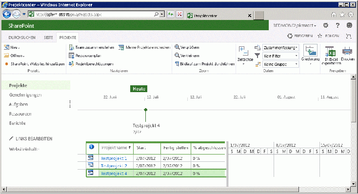

# <a name="getting-started-with-the-project-server-csom-and-net"></a><span data-ttu-id="566ec-105">Erste Schritte mit dem Project Server-CSOM und .NET</span><span class="sxs-lookup"><span data-stu-id="566ec-105">Getting started with the Project Server CSOM and .NET</span></span>

<span data-ttu-id="566ec-106">Sie können das Project Server 2013 mithilfe der clientseitigen Objektmodell (CSOM) zum Entwickeln von Project Online und lokale Lösungen mit .NET Framework 4 verwenden.</span><span class="sxs-lookup"><span data-stu-id="566ec-106">You can use the Project Server 2013 client-side object model (CSOM) to develop Project Online and on-premises solutions with the .NET Framework 4.</span></span> <span data-ttu-id="566ec-107">Dieser Artikel beschreibt, wie Sie eine Konsolenanwendung erstellen, die das CSOM zum Erstellen und Veröffentlichen von Projekten verwendet.</span><span class="sxs-lookup"><span data-stu-id="566ec-107">This article describes how to create a console application that uses the CSOM to create and publish projects.</span></span> <span data-ttu-id="566ec-108">Nach der Veröffentlichung eines Projekts, die Anwendung wartet darauf, dass der Project Server-Warteschlangendienst auf Fertig stellen, mit der Veröffentlichungsaktion und zeigt dann die veröffentlichten Projekte.</span><span class="sxs-lookup"><span data-stu-id="566ec-108">After publishing a project, the application waits for the Project Server Queue Service to finish with the publish action, and then lists the published projects.</span></span>
  
<span data-ttu-id="566ec-109">Eine allgemeine Einführung in die Project Server-CSOM finden Sie unter [Updates für Entwickler in Project 2013](updates-for-developers-in-project-2013.md).</span><span class="sxs-lookup"><span data-stu-id="566ec-109">For a general introduction to the Project Server CSOM, see [Updates for developers in Project 2013](updates-for-developers-in-project-2013.md).</span></span> <span data-ttu-id="566ec-110">Referenzthemen im CSOM-Namespace finden Sie unter [Microsoft.ProjectServer.Client](https://msdn.microsoft.com/library/Microsoft.ProjectServer.Client.aspx) .</span><span class="sxs-lookup"><span data-stu-id="566ec-110">For reference topics in the CSOM namespace, see [Microsoft.ProjectServer.Client](https://msdn.microsoft.com/library/Microsoft.ProjectServer.Client.aspx) .</span></span> 
  
## <a name="creating-a-csom-project-in-visual-studio"></a><span data-ttu-id="566ec-111">Erstellen eines CSOM-Projekts in Visual Studio</span><span class="sxs-lookup"><span data-stu-id="566ec-111">Creating a CSOM project in Visual Studio</span></span>
<span data-ttu-id="566ec-112"><a name="pj15_GettingStartedCSOM_CreatingVSProject"> </a></span><span class="sxs-lookup"><span data-stu-id="566ec-112"></span></span>

<span data-ttu-id="566ec-113">Verwenden Sie Visual Studio 2010 oder Visual Studio 2012, zum Entwickeln von Lösungen, die die Project Server-CSOM verwenden.</span><span class="sxs-lookup"><span data-stu-id="566ec-113">You can use Visual Studio 2010 or Visual Studio 2012 to develop solutions that use the Project Server CSOM.</span></span> <span data-ttu-id="566ec-114">Die Project Server-CSOM umfasst drei Assemblys für die Entwicklung von Clientanwendungen, Microsoft Silverlight-Anwendungen und Windows Phone 8-Anwendungen mithilfe von .NET Framework 4.</span><span class="sxs-lookup"><span data-stu-id="566ec-114">The Project Server CSOM includes three assemblies for development of client applications, Microsoft Silverlight applications, and Windows Phone 8 applications by using the .NET Framework 4.</span></span> <span data-ttu-id="566ec-115">Das CSOM enthält auch eine JavaScript-Datei für die Entwicklung von Webanwendungen, wie in [Microsoft.ProjectServer.Client](https://msdn.microsoft.com/library/Microsoft.ProjectServer.Client.aspx) beschrieben.</span><span class="sxs-lookup"><span data-stu-id="566ec-115">The CSOM also includes a JavaScript file for development of web applications, as described in [Microsoft.ProjectServer.Client](https://msdn.microsoft.com/library/Microsoft.ProjectServer.Client.aspx) .</span></span> 
  
<span data-ttu-id="566ec-116">Sie können die CSOM-Assembly, die Sie benötigen aus der Project Server-Computer oder aus der Project 2013-SDK-Download auf einem Computer remoteentwicklung kopieren.</span><span class="sxs-lookup"><span data-stu-id="566ec-116">You can copy the CSOM assembly that you need from the Project Server computer or from the Project 2013 SDK download to a remote development computer.</span></span> <span data-ttu-id="566ec-117">Die **QueueCreateProject** Konsolenanwendung, die in diesem Thema beschrieben wird ist keiner Silverlight-Anwendung oder einer Windows Phone 8-Anwendung benötigen Sie die Assembly Microsoft.ProjectServer.Client.dll.</span><span class="sxs-lookup"><span data-stu-id="566ec-117">The **QueueCreateProject** console application that is described in this topic is not a Silverlight application or a Windows Phone 8 application, so you need the Microsoft.ProjectServer.Client.dll assembly.</span></span> <span data-ttu-id="566ec-118">Da das CSOM unabhängig von der WCF-basierte oder ASMX-basierte Project Server Interface (PSI) ist, müssen Sie keinen zum Festlegen von Dienstverweise für die PSI, oder verwenden Sie den **Microsoft.Office.Project.Server.Library** -Namespace.</span><span class="sxs-lookup"><span data-stu-id="566ec-118">Because the CSOM is independent of the WCF-based or ASMX-based Project Server Interface (PSI), you do not have to set service references for the PSI or use the **Microsoft.Office.Project.Server.Library** namespace.</span></span> 
  
<span data-ttu-id="566ec-p106">Die **QueueCreateProject**-Anwendung verwendet Befehlszeilenargumente für den Namen des zu erstellenden Projekts und das Warteschlangen-Zeitlimit In Verfahren 1 erstellen Sie die grundlegende Konsolenanwendung, fügen eine Routine zum Analysieren der Befehlszeile hinzu und fügen eine Nachricht die Verwendung hinzu, falls Fehler in der Befehlszeile auftreten.</span><span class="sxs-lookup"><span data-stu-id="566ec-p106">The **QueueCreateProject** application uses command-line arguments for the name of the project to create and for the queue timeout limit. In Procedure 1, you create the basic console application, add a routine to parse the command line, and add a usage message if there are errors in the command line.</span></span> 
  
### <a name="procedure-1-to-create-a-csom-project-in-visual-studio"></a><span data-ttu-id="566ec-p107">Verfahren 1: So erstellen Sie ein CSOM-Projekt in Visual Studio</span><span class="sxs-lookup"><span data-stu-id="566ec-p107">Procedure 1. To create a CSOM project in Visual Studio</span></span>

1. <span data-ttu-id="566ec-123">Kopieren Sie die Assembly Microsoft.ProjectServer.Client.dll aus der `%ProgramFiles%\Common Files\Microsoft Shared\Web Server Extensions\15\ISAPI\` Ordner auf Ihrem Entwicklungscomputer.</span><span class="sxs-lookup"><span data-stu-id="566ec-123">Copy the Microsoft.ProjectServer.Client.dll assembly from the  `%ProgramFiles%\Common Files\Microsoft Shared\Web Server Extensions\15\ISAPI\` folder to your development computer.</span></span> <span data-ttu-id="566ec-124">Kopieren Sie die Assembly in einen Ordner komfortable für andere Project Server und SharePoint-Verweisassemblys, die Sie, z. B. verwenden möchten `C:\Project\Assemblies`.</span><span class="sxs-lookup"><span data-stu-id="566ec-124">Copy the assembly to a convenient folder for other Project Server and SharePoint reference assemblies that you will use, such as  `C:\Project\Assemblies`.</span></span>
    
2. <span data-ttu-id="566ec-p109">Kopieren Sie die Microsoft.SharePoint.Client.dll-Assembly und die Microsoft.SharePoint.Client.Runtime.dll-Assembly aus demselben Quellordner auf Ihren Entwicklungscomputer. Die Microsoft.ProjectServer.Client.dll-Assembly verfügt über Abhängigkeiten für die zugehörigen SharePoint-Assemblys.</span><span class="sxs-lookup"><span data-stu-id="566ec-p109">Copy the Microsoft.SharePoint.Client.dll assembly and the Microsoft.SharePoint.Client.Runtime.dll assembly from the same source folder to your development computer. The Microsoft.ProjectServer.Client.dll assembly has dependencies on the related SharePoint assemblies.</span></span>
    
3. <span data-ttu-id="566ec-127">Klicken Sie in Visual Studio erstellen Sie eine Windows, und legen Sie das Zielframework in .NET Framework 4.</span><span class="sxs-lookup"><span data-stu-id="566ec-127">In Visual Studio, create a Windows console application, and set the target framework to .NET Framework 4.</span></span> <span data-ttu-id="566ec-128">Nennen Sie beispielsweise die Anwendung QueueCreateProject.</span><span class="sxs-lookup"><span data-stu-id="566ec-128">For example, name the application QueueCreateProject.</span></span>
    
   > [!NOTE]
   > <span data-ttu-id="566ec-p111">Wenn Sie vergessen, das richtige Ziel festzulegen, nachdem Visual Studio das Projekts erstellt hat, öffnen Sie **Eigenschaften von QueueCreateProject** im Menü **Projekt**. Wählen Sie auf der Registerkarte **Anwendung** in der Dropdown-Liste **Zielframework** die Option **.NET Framework 4**. Verwenden Sie nicht **.NET Framework 4 Client Profile**.</span><span class="sxs-lookup"><span data-stu-id="566ec-p111">If you forget to set the correct target, after Visual Studio creates the project, open **QueueCreateProject Properties** in the **Project** menu. On the **Application** tab, in the **Target framework** drop-down list, choose **.NET Framework 4**. Do not use the **.NET Framework 4 Client Profile**.</span></span> 
  
4. <span data-ttu-id="566ec-132">Legen Sie im Projektmappen-Explorer Verweise auf die folgenden Assemblys fest:</span><span class="sxs-lookup"><span data-stu-id="566ec-132">In Solution Explorer, set references to the following assemblies:</span></span>
    
   - <span data-ttu-id="566ec-133">Microsoft.ProjectServer.Client.dll</span><span class="sxs-lookup"><span data-stu-id="566ec-133">Microsoft.ProjectServer.Client.dll</span></span>
   - <span data-ttu-id="566ec-134">Microsoft.SharePoint.Client.dll</span><span class="sxs-lookup"><span data-stu-id="566ec-134">Microsoft.SharePoint.Client.dll</span></span>
   - <span data-ttu-id="566ec-135">Microsoft.SharePoint.Client.Runtime.dll</span><span class="sxs-lookup"><span data-stu-id="566ec-135">Microsoft.SharePoint.Client.Runtime.dll</span></span>
    
5. <span data-ttu-id="566ec-136">In der Datei Program.cs Bearbeiten der `using` Anweisungen, die wie folgt.</span><span class="sxs-lookup"><span data-stu-id="566ec-136">In the Program.cs file, edit the  `using` statements, as follows.</span></span> 
    
   ```cs
    using System;
    using System.Collections.Generic;
    using System.Linq;
    using System.Text;
    using Microsoft.ProjectServer.Client;
   ```

6. <span data-ttu-id="566ec-p112">Fügen Sie Methoden zum Analysieren der Befehlszeilenargumente für den Projektnamen und die Anzahl von Sekunden für das Warteschlangen-Zeitlimit, das Anzeigen von Verwendungsinformationen und das Beenden der Anwendung hinzu. Ersetzen Sie den Hauptteil des Codes in der Datei „Program.cs“ durch den folgenden Code.</span><span class="sxs-lookup"><span data-stu-id="566ec-p112">Add methods to parse the command-line arguments for the project name and the number of seconds for queue timeout, show usage information, and exit the application. Replace the main body of code in the Program.cs file with the following code.</span></span>
    
   ```cs
    namespace QueueCreateProject
    {
        class Program
        {
            static void Main(string[] args)
            {
                if (!ParseCommandLine(args))
                {
                    Usage();
                    ExitApp();
                }
                /* Add calls to methods here to get the project context and create a project. */
                ExitApp();
            }
            // Parse the command line. Return true if there are no errors.
            private static bool ParseCommandLine(string[] args)
            {
                bool error = false;
                int argsLen = args.Length;
                try
                {
                    for (int i = 0; i < argsLen; i++)
                    {
                        if (error) break;
                        if (args[i].StartsWith("-") || args[i].StartsWith("/"))
                            args[i] = "*" + args[i].Substring(1).ToLower();
                        switch (args[i])
                        {
                            case "*projname":
                            case "*n":
                                if (++i >= argsLen) return false;
                                projName = args[i];
                                break;
                            case "*timeout":
                            case "*t":
                                if (++i >= argsLen) return false;
                                timeoutSeconds = Convert.ToInt32(args[i]);
                                break;
                            case "*?":
                            default:
                                error = true;
                                break;
                        }
                    }
                }
                catch (FormatException)
                {
                    error = true;
                }
                if (string.IsNullOrEmpty(projName)) error = true;
                return !error;
            }
            private static void Usage()
            {
                string example = "Usage: QueueCreateProject -projName | -n \"New project name\" [-timeout | -t sec]";
                example += "\nExample: QueueCreateProject -n \"My new project\"";
                example += "\nDefault timeout seconds = " + timeoutSeconds.ToString();
                Console.WriteLine(example);
            }
            private static void ExitApp()
            {
                Console.Write("\nPress any key to exit... ");
                Console.ReadKey(true);
                Environment.Exit(0);
            }
        }
    }
   ```

## <a name="getting-the-project-context"></a><span data-ttu-id="566ec-139">Abrufen des Projektkontexts</span><span class="sxs-lookup"><span data-stu-id="566ec-139">Getting the project context</span></span>
<span data-ttu-id="566ec-140"><a name="pj15_GettingStartedCSOM_GettingContext"> </a></span><span class="sxs-lookup"><span data-stu-id="566ec-140"></span></span>

<span data-ttu-id="566ec-141">CSOM Entwicklung erfordert das **ProjectContext** -Objekt, das mit der Project Web App-URL nicht initialisiert werden.</span><span class="sxs-lookup"><span data-stu-id="566ec-141">CSOM development requires the **ProjectContext** object to be initialized with the Project Web App URL.</span></span> <span data-ttu-id="566ec-142">Der Code in Schritt 2 verwendet die **PwaPath** -Konstante.</span><span class="sxs-lookup"><span data-stu-id="566ec-142">The code in Procedure 2 uses the **pwaPath** constant.</span></span> <span data-ttu-id="566ec-143">Wenn Sie die Anwendung für mehrere Instanzen von Project Web App verwenden möchten, können Sie **PwaPath** stellen Sie eine Variable und Hinzufügen einer anderen Befehlszeilenargument.</span><span class="sxs-lookup"><span data-stu-id="566ec-143">If you plan to use the application for multiple instances of Project Web App, you could make **pwaPath** a variable and add another command-line argument.</span></span> 
  
### <a name="procedure-2-to-get-the-project-context"></a><span data-ttu-id="566ec-p114">Verfahren 2: So rufen Sie den Projektkontext ab</span><span class="sxs-lookup"><span data-stu-id="566ec-p114">Procedure 2. To get the project context</span></span>

1. <span data-ttu-id="566ec-146">Hinzufügen von **Programm** -Klasse Konstanten und Variablen, die die **QueueCreateProject** -Anwendung verwendet wird.</span><span class="sxs-lookup"><span data-stu-id="566ec-146">Add **Program** class constants and variables that the **QueueCreateProject** application will use.</span></span> <span data-ttu-id="566ec-147">Zusätzlich zu den Project Web App-URL verwendet die Anwendung den Namen der standardmäßige Enterprise-Projekttyp (EPT), den Namen des Projekts zu erstellen und eine maximale Warteschlangentimeout in Sekunden an.</span><span class="sxs-lookup"><span data-stu-id="566ec-147">In addition to the Project Web App URL, the application uses the name of the default enterprise project type (EPT), the name of the project to create, and a maximum queue timeout in seconds.</span></span> <span data-ttu-id="566ec-148">In diesem Fall kann die Variable **TimeoutSeconds** Sie testen, wie verschiedene Werte für das Timeout die Anwendung auswirken.</span><span class="sxs-lookup"><span data-stu-id="566ec-148">In this case, the **timeoutSeconds** variable enables you to test how various values for the timeout affect the application.</span></span> <span data-ttu-id="566ec-149">Das **ProjectContext** -Objekt ist das primäre Objekt für den Zugriff auf die CSOM.</span><span class="sxs-lookup"><span data-stu-id="566ec-149">The **ProjectContext** object is the primary object for access to the CSOM.</span></span> 
    
   ```cs
    private const string pwaPath = "http://ServerName /pwa/"; // Change the path to your Project Web App instance.
    private static string basicEpt = "Enterprise Project";   // Basic enterprise project type.
    private static string projName = string.Empty;
    private static int timeoutSeconds = 10;  // The maximum wait time for a queue job, in seconds.
    private static ProjectContext projContext;
   ```

2. <span data-ttu-id="566ec-150">Ersetzen Sie die `/* Add calls to methods here to get the project context and create a project. */` Kommentar durch den folgenden Code.</span><span class="sxs-lookup"><span data-stu-id="566ec-150">Replace the  `/* Add calls to methods here to get the project context and create a project. */` comment with the following code.</span></span> <span data-ttu-id="566ec-151">Das **Microsoft.ProjectServer.Client.ProjectContext** -Objekt wird mit der Project Web App-URL initialisiert.</span><span class="sxs-lookup"><span data-stu-id="566ec-151">The **Microsoft.ProjectServer.Client.ProjectContext** object is initialized with the Project Web App URL.</span></span> <span data-ttu-id="566ec-152">Die **CreateTestProject** -Methode und die **ListPublishedProjects** -Methode sind im Verfahren 4 und 5 Verfahren dargestellt.</span><span class="sxs-lookup"><span data-stu-id="566ec-152">The **CreateTestProject** method and the **ListPublishedProjects** method are shown in Procedure 4 and Procedure 5.</span></span> 
    
   ```cs
    projContext = new ProjectContext(pwaPath);
    if (CreateTestProject())
        ListPublishedProjects();
    else
        Console.WriteLine("\nProject creation failed: {0}", projName);
   ```

## <a name="getting-an-enterprise-project-type"></a><span data-ttu-id="566ec-153">Abrufen eines Enterprise-Projekttyps</span><span class="sxs-lookup"><span data-stu-id="566ec-153">Getting an enterprise project type</span></span>
<span data-ttu-id="566ec-154"><a name="pj15_GettingStartedCSOM_GettingEPT"> </a></span><span class="sxs-lookup"><span data-stu-id="566ec-154"></span></span>

<span data-ttu-id="566ec-p117">Die **QueueCreateProject**-Beispielanwendung wählt explizit den Enterprise-Projekt-EPT aus, um zu zeigen, wie eine Anwendung den EPT für ein Projekt auswählen kann. Wenn die Projekterstellungsinformationen die EPT-GUID nicht angeben, verwendet eine Anwendung den Standard-EPT. Die **GetEptUid**-Methode wird von der **CreateTestProject**-Methode verwendet, die in Verfahren 4 beschriebenen wird.</span><span class="sxs-lookup"><span data-stu-id="566ec-p117">The **QueueCreateProject** sample application explicitly selects the Enterprise Project EPT, to show how an application can select the EPT for a project. If the project creation information does not specify the EPT GUID, an application would use the default EPT. The **GetEptUid** method is used by the **CreateTestProject** method that is described in Procedure 4.</span></span> 
  
<span data-ttu-id="566ec-p118">Die **GetEptUid**-Methode fragt das **ProjectContext**-Objekt für die Auflistung von **EnterpriseProjectTypes** ab, deren EPT-Namen dem angegebenen Namen entsprechen. Nach dem Ausführen der Abfrage wird die **eptUid**-Variable auf die GUID des ersten **EnterpriseProjectType**-Objekts in der **eptList**-Auflistung festgelegt. Da EPT-Namen eindeutig sind, gibt es nur ein **EnterpriseProjectType**-Objekt mit dem angegebenen Namen.</span><span class="sxs-lookup"><span data-stu-id="566ec-p118">The **GetEptUid** method queries the **ProjectContext** object for the collection of **EnterpriseProjectTypes** where the EPT name equals the specified name. After executing the query, the **eptUid** variable is set to the GUID of the first **EnterpriseProjectType** object in the **eptList** collection. Because EPT names are unique, there is only one **EnterpriseProjectType** object that has the specified name.</span></span> 
  
### <a name="procedure-3-to-get-the-guid-of-an-ept-for-a-new-project"></a><span data-ttu-id="566ec-p119">Verfahren 3: So rufen Sie die GUID für den ETP eines neuen Projekts ab</span><span class="sxs-lookup"><span data-stu-id="566ec-p119">Procedure 3. To get the GUID of an EPT for a new project</span></span>

- <span data-ttu-id="566ec-163">Fügen Sie die **GetEptUid**-Methode zur **Program**-Klasse hinzu.</span><span class="sxs-lookup"><span data-stu-id="566ec-163">Add the **GetEptUid** method to the **Program** class.</span></span> 
    
   ```cs
    // Get the GUID of the specified enterprise project type.
    private static Guid GetEptUid(string eptName)
    {
        Guid eptUid = Guid.Empty;
        try
        {
            // Get the list of EPTs that have the specified name. 
            // If the EPT name exists, the list will contain only one EPT.
            var eptList = projContext.LoadQuery(
                projContext.EnterpriseProjectTypes.Where(
                    ept => ept.Name == eptName));
            projContext.ExecuteQuery();
            eptUid = eptList.First().Id;
        }
        catch (Exception ex)
        {
            string msg = string.Format("GetEptUid: eptName = \"{0}\"\n\n{1}",
                eptName, ex.GetBaseException().ToString());
            throw new ArgumentException(msg);
        }
        return eptUid;
    }
   ```

<span data-ttu-id="566ec-p120">Es gibt mehrere Möglichkeiten, die EPT-GUID zu ermitteln. Die in der **GetEptUid**-Methode gezeigte Abfrage ist effizient, da sie nur das eine **EnterpriseProjectType**-Objekt herunterlädt, das dem EPT-Namen entspricht. Die folgende alternative Routine ist weniger effizient, da sie die vollständige Liste der EPTs in die Clientanwendung herunterlädt und die Liste mehrmals durchläuft.</span><span class="sxs-lookup"><span data-stu-id="566ec-p120">There are several ways to find the EPT GUID. The query shown in the **GetEptUid** method is efficient because it downloads only the one **EnterpriseProjectType** object that matches the EPT name. The following alternate routine is less efficient, because it downloads the complete list of EPTs to the client application and iterates through the list.</span></span> 

```cs
foreach (EnterpriseProjectType ept in projSvr.EnterpriseProjectTypes)
{
    if (ept.Name == eptName)
    {
        eptUid = ept.Id;
        break;
    }
}
```

<span data-ttu-id="566ec-167">Die folgende Routine verwendet eine LINQ-Abfrage und einen Lambda-Ausdruck zum Auswählen des EPT-Objekts, lädt jedoch auch alle **EnterpriseProjectType**-Objekte herunter.</span><span class="sxs-lookup"><span data-stu-id="566ec-167">The following routine uses a LINQ query and lambda expression to select the EPT object, but still downloads all of the **EnterpriseProjectType** objects.</span></span> 

```cs
var eptList = projContext.LoadQuery(projContext.EnterpriseProjectTypes);
projContext.ExecuteQuery();
eptUid = eptList.First(ept => ept.Name == eptName).Id;
```

## <a name="setting-the-creation-information-and-publishing-the-project"></a><span data-ttu-id="566ec-168">Festlegen der Erstellungsinformationen und Veröffentlichen des Projekts</span><span class="sxs-lookup"><span data-stu-id="566ec-168">Setting the creation information and publishing the project</span></span>
<span data-ttu-id="566ec-169"><a name="pj15_GettingStartedCSOM_ProjectCreation"> </a></span><span class="sxs-lookup"><span data-stu-id="566ec-169"></span></span>

<span data-ttu-id="566ec-p121">Die **CreateTestProject**-Methode erstellt ein **ProjectCreationInformation**-Objekt und gibt die Informationen an, die zum Erstellen eines Projekts erforderlich sind. Die GUID des Projekts und der Name sind erforderlich. Das Startdatum, die Projektbeschreibung und die EPT-GUID sind optional.</span><span class="sxs-lookup"><span data-stu-id="566ec-p121">The **CreateTestProject** method creates a **ProjectCreationInformation** object and specifies the information that is required to create a project. The project GUID and name are required; the start date, project description, and EPT GUID are optional.</span></span> 
  
<span data-ttu-id="566ec-p122">Nach dem Festlegen der neuen Projekteigenschaften fügt die **Projects.Add**-Methode das Projekt zur **Projects**-Auflistung hinzu. Zum Speichern und Veröffentlichen des Projekts müssen Sie die **Projects.Update**-Methode aufrufen, um eine Nachricht an die Project Server-Warteschlange zu senden und das Projekt zu erstellen.</span><span class="sxs-lookup"><span data-stu-id="566ec-p122">After setting the new project properties, the **Projects.Add** method adds the project to the **Projects** collection. To save and publish the project, you must call the **Projects.Update** method to send a message to the Project Server queue and create the project.</span></span> 
  
### <a name="procedure-4-to-set-the-new-project-properties-create-the-project-and-publish-the-project"></a><span data-ttu-id="566ec-p123">Verfahren 4: So legen Sie die neuen Projekteigenschaften fest, erstellen das Projekt und veröffentlichen das Projekt</span><span class="sxs-lookup"><span data-stu-id="566ec-p123">Procedure 4. To set the new project properties, create the project, and publish the project</span></span>

1. <span data-ttu-id="566ec-p124">Fügen Sie die **CreateTestProject**-Methode zur **Program**-Klasse hinzu. Mit dem folgende Code wird ein Projekt erstellt und veröffentlicht, es wird jedoch nicht gewartet, bis der Warteschlangenauftrag abgeschlossen ist.</span><span class="sxs-lookup"><span data-stu-id="566ec-p124">Add the **CreateTestProject** method to the **Program** class. The following code creates and publishes a project, but does not wait for the queue job to complete.</span></span> 
    
   ```cs
    // Create a project.
    private static bool CreateTestProject()
    {
        bool projCreated = false;
        try
        {
            Console.Write("\nCreating project: {0} ...", projName);
            ProjectCreationInformation newProj = new ProjectCreationInformation();
            newProj.Id = Guid.NewGuid();
            newProj.Name = projName;
            newProj.Description = "Test creating a project with CSOM";
            newProj.Start = DateTime.Today.Date;
            // Setting the EPT GUID is optional. If no EPT is specified, Project Server  
            // uses the default EPT. 
            newProj.EnterpriseProjectTypeId = GetEptUid(basicEpt);
            PublishedProject newPublishedProj = projContext.Projects.Add(newProj);
            QueueJob qJob = projContext.Projects.Update();
            /* Add code here to wait for the queue. */
        }
        catch(Exception ex)
        {
            Console.ForegroundColor = ConsoleColor.Red;
            Console.WriteLine("\nError: {0}", ex.Message);
            Console.ResetColor();
        }
        return projCreated;
    }
   ```

2. <span data-ttu-id="566ec-178">Ersetzen Sie die `/* Add code here to wait for the queue. */` Kommentar durch den folgenden Code für den Warteschlangenauftrag gewartet.</span><span class="sxs-lookup"><span data-stu-id="566ec-178">Replace the  `/* Add code here to wait for the queue. */` comment with the following code to wait for the queue job.</span></span> <span data-ttu-id="566ec-179">Die Routine wartet, bis zu der angegebenen **TimeoutSeconds** Anzahl von Sekunden oder wird fortgesetzt, wenn vor dem Timeout der Warteschlangenauftrag beendet wurde.</span><span class="sxs-lookup"><span data-stu-id="566ec-179">The routine waits a maximum of the specified **timeoutSeconds** number of seconds, or proceeds if the queue job completes before the timeout.</span></span> <span data-ttu-id="566ec-180">Mögliche Warteschlange Auftragsstatusangaben finden Sie unter [Microsoft.ProjectServer.Client.JobState](https://msdn.microsoft.com/library/Microsoft.ProjectServer.Client.JobState.aspx) .</span><span class="sxs-lookup"><span data-stu-id="566ec-180">For possible queue job states, see [Microsoft.ProjectServer.Client.JobState](https://msdn.microsoft.com/library/Microsoft.ProjectServer.Client.JobState.aspx) .</span></span> 
    
   <span data-ttu-id="566ec-p126">Das Aufrufen der **Load**-Methode und der **ExecuteQuery**-Methode für das **QueueJob**-Objekt ist optional. Wenn das **QueueJob**-Objekt beim Aufrufen der **WaitForQueue**-Methode nicht initialisiert ist, initialisiert Project Server die Methode.</span><span class="sxs-lookup"><span data-stu-id="566ec-p126">Calling the **Load** method and the **ExecuteQuery** method for the **QueueJob** object is optional. If the **QueueJob** object is not initialized when you call the **WaitForQueue** method, Project Server initializes it.</span></span> 
    
   ```cs
    // Calling Load and ExecuteQuery for the queue job is optional.
    // projContext.Load(qJob);
    // projContext.ExecuteQuery();
    JobState jobState = projContext.WaitForQueue(qJob, timeoutSeconds);
    if (jobState == JobState.Success)
    {
        projCreated = true;
    }
    else
    {
        Console.ForegroundColor = ConsoleColor.Yellow;
        Console.WriteLine("\nThere is a problem in the queue. Timeout is {0} seconds.", 
            timeoutSeconds);
        Console.WriteLine("\tQueue JobState: {0}", jobState.ToString());
        Console.ResetColor();
    }
    Console.WriteLine();
   ```

## <a name="listing-the-published-projects"></a><span data-ttu-id="566ec-183">Auflisten der veröffentlichten Projekte</span><span class="sxs-lookup"><span data-stu-id="566ec-183">Listing the published projects</span></span>
<span data-ttu-id="566ec-184"><a name="pj15_GettingStartedCSOM_ListingPublished"> </a></span><span class="sxs-lookup"><span data-stu-id="566ec-184"></span></span>

<span data-ttu-id="566ec-185">Die **ListPublishedProjects** -Methode ruft die Auflistung aller Projekte, die in Project Web App veröffentlicht werden.</span><span class="sxs-lookup"><span data-stu-id="566ec-185">The **ListPublishedProjects** method gets the collection of all projects that are published in Project Web App.</span></span> <span data-ttu-id="566ec-186">Wenn der Warteschlangenauftrag erstellt, die in Verfahren 4 ein Projekt nicht erfolgreich abgeschlossen oder ein Timeout, das neue Projekt nicht in der **Projects** -Auflistung enthalten ist.</span><span class="sxs-lookup"><span data-stu-id="566ec-186">If the queue job that creates a project in Procedure 4 does not complete successfully or times out, the new project is not included in the **Projects** collection.</span></span> 
  
### <a name="procedure-5-to-list-the-published-projects"></a><span data-ttu-id="566ec-p128">Verfahren 5: So listen Sie die veröffentlichten Projekte auf</span><span class="sxs-lookup"><span data-stu-id="566ec-p128">Procedure 5. To list the published projects</span></span>

1. <span data-ttu-id="566ec-189">Fügen Sie die **ListPublishedProjects**-Methode zur **Program**-Klasse hinzu.</span><span class="sxs-lookup"><span data-stu-id="566ec-189">Add the **ListPublishedProjects** method to the **Program** class.</span></span> 
    
   ```cs
    // List the published projects.
    private static void ListPublishedProjects()
    {
        // Get the list of projects on the server.
        projContext.Load(projContext.Projects);
        projContext.ExecuteQuery();
        Console.WriteLine("\nProject ID : Project name : Created date");
        foreach (PublishedProject pubProj in projContext.Projects)
        {
            Console.WriteLine("\n\t{0} :\n\t{1} : {2}", pubProj.Id.ToString(), pubProj.Name,
                pubProj.CreatedDate.ToString());
        }
    }
   ```

2. <span data-ttu-id="566ec-190">Legen Sie den richtigen Wert für die Project Web App-URL, kompilieren Sie die Anwendung **QueueCreateProject** , und Testen Sie die Anwendung wie in der Prozedur 6.</span><span class="sxs-lookup"><span data-stu-id="566ec-190">Set the correct value for your Project Web App URL, compile the **QueueCreateProject** application, and then test the application as in Procedure 6.</span></span> 
    
## <a name="testing-the-queuecreateproject-application"></a><span data-ttu-id="566ec-191">Testen der QueueCreateProject-Anwendung</span><span class="sxs-lookup"><span data-stu-id="566ec-191">Testing the QueueCreateProject application</span></span>
<span data-ttu-id="566ec-192"><a name="pj15_GettingStartedCSOM_Testing"> </a></span><span class="sxs-lookup"><span data-stu-id="566ec-192"></span></span>

<span data-ttu-id="566ec-193">Wenn Sie zuerst die **QueueCreateProject** -Anwendung auf einer Testinstanz von Project Web App ausführen, insbesondere wenn Project Server auf einem virtuellen Computer installiert ist möglicherweise die Anwendung mehr Zeit als das Standardtimeout für die Warteschlange von zehn Sekunden ausführen erforderlich.</span><span class="sxs-lookup"><span data-stu-id="566ec-193">When you first run the **QueueCreateProject** application on a test instance of Project Web App, especially if Project Server is installed on a virtual machine, the application may require more time to run than the default queue timeout of ten seconds.</span></span> 
  
### <a name="procedure-6-to-test-the-queuecreateproject-application"></a><span data-ttu-id="566ec-p129">Verfahren 6: So testen Sie die QueueCreateProject-Anwendung</span><span class="sxs-lookup"><span data-stu-id="566ec-p129">Procedure 6. To test the QueueCreateProject application</span></span>

1. <span data-ttu-id="566ec-196">Öffnen Sie das Fenster **QueueCreateProject Eigenschaften** , wählen Sie die Registerkarte **Debuggen** , und fügen Sie im Abschnitt **Startoptionen** die folgenden Befehlszeilenargumente:`-n "Test proj 1" -t 20`</span><span class="sxs-lookup"><span data-stu-id="566ec-196">Open the **QueueCreateProject Properties** window, select the **Debug** tab, and then add the following command-line arguments in the **Start Options** section:  `-n "Test proj 1" -t 20`</span></span>
    
   <span data-ttu-id="566ec-197">Führen Sie die Anwendung (z. B. drücken Sie **F5**).</span><span class="sxs-lookup"><span data-stu-id="566ec-197">Run the application (for example, press **F5**).</span></span> <span data-ttu-id="566ec-198">Wenn Sie der Timeoutwert lange genug ist, zeigt die Anwendung die folgende Ausgabe (wenn andere veröffentlichte Projekte in der Project Web App-Instanz vorhanden ist, sie werden auch werden angezeigt):</span><span class="sxs-lookup"><span data-stu-id="566ec-198">If the timeout value is long enough, the application shows the following output (if other published projects exist in your Project Web App instance, they will also be shown):</span></span>
    
   ```MS-DOS
    Creating project: Test proj 1 ...
    Project ID : Project name : Created date
            b34d7009-753f-4abb-9191-f4b15a82aac3 :
            Test proj 1 : 9/22/2011 11:27:57 AM
    Press any key to exit...
   ```

2. <span data-ttu-id="566ec-199">Führen Sie einen weiteren Test das Standardtimeout 10 Sekunden Warteschlange verwendet die folgenden Befehlszeilenargumente aus:`-n "Test proj 1"`</span><span class="sxs-lookup"><span data-stu-id="566ec-199">Run another test with the following command-line arguments, to use the default 10-second queue timeout: `-n "Test proj 1"`</span></span>
    
   <span data-ttu-id="566ec-200">Da „Test Proj 1“ bereits vorhanden ist, zeigt die Anwendung folgende Ausgabe an.</span><span class="sxs-lookup"><span data-stu-id="566ec-200">Because Test proj 1 already exists, the application shows the following output.</span></span>
    
   ```MS-DOS
    Creating project: Test proj 1 ...
    Error: PJClientCallableException: ProjectNameAlreadyExists
    ProjectNameAlreadyExists
    projName = Test proj 1
    Project creation failed: Test proj 1
    Press any key to exit...
   ```

3. <span data-ttu-id="566ec-201">Führen Sie einen weiteren Test das Standardtimeout 10 Sekunden Warteschlange verwendet die folgenden Befehlszeilenargumente aus:`-n "Test proj 2"`</span><span class="sxs-lookup"><span data-stu-id="566ec-201">Run another test with the following command-line arguments, to use the default 10-second queue timeout:  `-n "Test proj 2"`</span></span>
    
   <span data-ttu-id="566ec-202">Die **QueueCreateProject**-Anwendung erstellt und veröffentlicht das Projekt mit dem Namen „Test Proj 2“.</span><span class="sxs-lookup"><span data-stu-id="566ec-202">The **QueueCreateProject** application creates and publishes the project named Test proj 2.</span></span> 
    
4. <span data-ttu-id="566ec-203">Führen Sie einen anderen Test mit den folgenden Befehlszeilenargumente, und legen Sie den Timeoutwert zu kurz für Warteschlangenauftrag beendet werden:`-n "Test proj 3" -t 1`</span><span class="sxs-lookup"><span data-stu-id="566ec-203">Run another test with the following command-line arguments, and set the timeout to be too short for the queue job to finish:  `-n "Test proj 3" -t 1`</span></span>
    
   <span data-ttu-id="566ec-p131">Da das Warteschlangen-Zeitlimit zu kurz ist, wird das Projekt nicht erstellt. Die Anwendung zeigt die folgende Ausgabe.</span><span class="sxs-lookup"><span data-stu-id="566ec-p131">Because the queue timeout is too short, the project is not created. The application shows the following output.</span></span>
    
   ```MS-DOS
    Creating project: Test proj 3 ...
    There is a problem in the queue. Timeout is 1 seconds.
            Queue JobState: Unknown
    Project creation failed: Test proj 3
    Press any key to exit...
   ```

5. <span data-ttu-id="566ec-206">Ändern Sie den Code, damit die Anwendung nicht darauf warten, dass der Warteschlangenauftrag.</span><span class="sxs-lookup"><span data-stu-id="566ec-206">Modify the code so that the application does not wait for the queue job.</span></span> <span data-ttu-id="566ec-207">Beispielsweise kommentieren Sie den Code, die für die Warteschlange, außer für wartet die `projCreated = true` Zeile wie folgt.</span><span class="sxs-lookup"><span data-stu-id="566ec-207">For example, comment out the code that waits for the queue, except for the  `projCreated = true` line, as follows.</span></span> 
    
   ```cs
    //JobState jobState = projContext.WaitForQueue(qJob, timeoutSeconds);
    //if (jobState == JobState.Success)
    //{
    projCreated = true;
    //}
    //else
    //{
    //    Console.ForegroundColor = ConsoleColor.Yellow;
    //    Console.WriteLine("\nThere is a problem in the queue. Timeout is {0} seconds.",
    //        timeoutSeconds);
    //    Console.WriteLine("\tQueue JobState: {0}", jobState.ToString());
    //    Console.ResetColor();
    //}
    
   ```

6. <span data-ttu-id="566ec-208">Kompilieren Sie die Anwendung neu, und führen Sie einen weiteren Test mit den folgenden Befehlszeilenargumente:`-n "Test proj 4"`</span><span class="sxs-lookup"><span data-stu-id="566ec-208">Recompile the application and run another test with the following command-line arguments:  `-n "Test proj 4"`</span></span>
    
   <span data-ttu-id="566ec-p133">Da die **WaitForQueue**-Routine auskommentiert ist, verwendet die Anwendung nicht den Standardwert für das Zeitlimit. Obwohl die Anwendung nicht auf die Warteschlange wartet, zeigt sie möglicherweise „Test Proj 4“ an, wenn die Veröffentlichungsaktion in Project Server schnell genug ist.</span><span class="sxs-lookup"><span data-stu-id="566ec-p133">Because the **WaitForQueue** routine is commented out, the application does not use the default timeout value. Even though the application does not wait for the queue, it may show Test proj 4, if the publish action in Project Server is fast enough.</span></span> 
    
   ```MS-DOS
    Creating project: Test proj 4 ...
    Project ID : Project name : Created date
            cdd54103-082f-425c-b075-9ff52ac7d4e6 :
            Test proj 2 : 9/25/2011 4:28:55 PM
            b34d7009-753f-4abb-9191-f4b15a82aac3 :
            Test proj 1 : 9/22/2011 11:27:57 AM
            5c0c73f2-f5dd-499b-8bd8-ebb74bf8c122 :
            Test proj 4 : 9/25/2011 4:39:21 PM
    Press any key to exit...
   ```

<span data-ttu-id="566ec-211">Aktualisieren Sie die Seite Projektcenter in Project Web App (`http://ServerName/ProjectServerName/Projects.aspx`), um die veröffentlichten Projekte anzeigen.</span><span class="sxs-lookup"><span data-stu-id="566ec-211">Refresh the Project Center page in Project Web App (`http://ServerName/ProjectServerName/Projects.aspx`), to show the published projects.</span></span> <span data-ttu-id="566ec-212">Die folgende Abbildung zeigt, dass die Testprojekte veröffentlicht werden.</span><span class="sxs-lookup"><span data-stu-id="566ec-212">The following figure shows that the test projects are published.</span></span>

<span data-ttu-id="566ec-213">**Überprüfen der veröffentlichten Projekte in Project Web App**</span><span class="sxs-lookup"><span data-stu-id="566ec-213">**Checking the published projects in Project Web App**</span></span>

<span data-ttu-id="566ec-214">![Überprüfen der veröffentlichten Projekte in Project Web App] (media/pj15_GetStartedCSOMNET_pwa.gif "Überprüfen der veröffentlichten Projekte in Project Web App")</span><span class="sxs-lookup"><span data-stu-id="566ec-214"></span></span>
  
<span data-ttu-id="566ec-215">Die beispielanwendung **QueueCreateProject** zeigt eine typische Beispiel dafür, wie eine Project-Entität mit dem Clientobjektmodell So erstellen Sie mithilfe der **ProjectCreationInformation** -Klasse zum Hinzufügen des Projekts zu der veröffentlichten-Auflistung, wie von einem Warteschlangenauftrag gewartet verwenden die **WaitForQueue** -Methode und wie die Auflistung von veröffentlichten Projekten aufgelistet werden.</span><span class="sxs-lookup"><span data-stu-id="566ec-215">The **QueueCreateProject** sample application shows a typical example of how to create a project entity with the CSOM by using the **ProjectCreationInformation** class, how to add the project to the published collection, how to wait for a queue job by using the **WaitForQueue** method, and how to enumerate the collection of published projects.</span></span> 
  
## <a name="complete-code-example"></a><span data-ttu-id="566ec-216">Vollständiges Codebeispiel</span><span class="sxs-lookup"><span data-stu-id="566ec-216">Complete code example</span></span>
<span data-ttu-id="566ec-217"><a name="pj15_GettingStartedCSOM_CompleteCode"> </a></span><span class="sxs-lookup"><span data-stu-id="566ec-217"></span></span>

<span data-ttu-id="566ec-218">Es folgt der vollständige Code für die **QueueCreateProject** beispielanwendung aus.</span><span class="sxs-lookup"><span data-stu-id="566ec-218">The following is the complete code for the **QueueCreateProject** sample application.</span></span> <span data-ttu-id="566ec-219">[Microsoft.ProjectServer.Client.ProjectCreationInformation](https://msdn.microsoft.com/library/Microsoft.ProjectServer.Client.ProjectCreationInformation.aspx) Class Reference enthält auch den Code in diesem Thema.</span><span class="sxs-lookup"><span data-stu-id="566ec-219">The [Microsoft.ProjectServer.Client.ProjectCreationInformation](https://msdn.microsoft.com/library/Microsoft.ProjectServer.Client.ProjectCreationInformation.aspx) class reference also includes the code in this topic.</span></span> 
  
```cs
using System;
using System.Collections.Generic;
using System.Linq;
using System.Text;
using Microsoft.ProjectServer.Client;
namespace QueueCreateProject
{
    class Program
    {
        private const string pwaPath = "http://ServerName /pwa/"; // Change the path to your Project Web App instance.
        private static string basicEpt = "Enterprise Project";   // Basic enterprise project type.
        private static string projName = string.Empty;
        private static int timeoutSeconds = 10;  // The maximum wait time for a queue job, in seconds.
        private static ProjectContext projContext;
        static void Main(string[] args)
        {
            if (!ParseCommandLine(args))
            {
                Usage();
                ExitApp();
            }
            projContext = new ProjectContext(pwaPath);
            if (CreateTestProject())
                ListPublishedProjects();
            else
                Console.WriteLine("\nProject creation failed: {0}", projName);
            ExitApp();
        }
        // Create a project.
        private static bool CreateTestProject()
        {
            bool projCreated = false;
            try
            {
                Console.Write("\nCreating project: {0} ...", projName);
                ProjectCreationInformation newProj = new ProjectCreationInformation();
                newProj.Id = Guid.NewGuid();
                newProj.Name = projName;
                newProj.Description = "Test creating a project with CSOM";
                newProj.Start = DateTime.Today.Date;
                // Setting the EPT GUID is optional. If no EPT is specified, Project Server uses 
                // the default EPT. 
                newProj.EnterpriseProjectTypeId = GetEptUid(basicEpt);
                PublishedProject newPublishedProj = projContext.Projects.Add(newProj);
                QueueJob qJob = projContext.Projects.Update();
                // Calling Load and ExecuteQuery for the queue job is optional. If qJob is 
                // not initialized when you call WaitForQueue, Project Server initializes it.
                // projContext.Load(qJob);
                // projContext.ExecuteQuery();
                JobState jobState = projContext.WaitForQueue(qJob, timeoutSeconds);
                if (jobState == JobState.Success)
                {
                    projCreated = true;
                }
                else
                {
                    Console.ForegroundColor = ConsoleColor.Yellow;
                    Console.WriteLine("\nThere is a problem in the queue. Timeout is {0} seconds.", 
                        timeoutSeconds);
                    Console.WriteLine("\tQueue JobState: {0}", jobState.ToString());
                    Console.ResetColor();
                }
                Console.WriteLine();
            }
            catch(Exception ex)
            {
                Console.ForegroundColor = ConsoleColor.Red;
                Console.WriteLine("\nError: {0}", ex.Message);
                Console.ResetColor();
            }
            return projCreated;
        }
        // Get the GUID of the specified enterprise project type.
        private static Guid GetEptUid(string eptName)
        {
            Guid eptUid = Guid.Empty;
            try
            {
                // Get the list of EPTs that have the specified name. 
                // If the EPT name exists, the list will contain only one EPT.
                var eptList = projContext.LoadQuery(
                    projContext.EnterpriseProjectTypes.Where(
                        ept => ept.Name == eptName));
                projContext.ExecuteQuery();
                eptUid = eptList.First().Id;
                // Alternate routines to find the EPT GUID. Both (a) and (b) download the entire list of EPTs.
                // (a) Using a foreach block:
                //foreach (EnterpriseProjectType ept in projSvr.EnterpriseProjectTypes)
                //{
                //    if (ept.Name == eptName)
                //    {
                //        eptUid = ept.Id;
                //        break;
                //    }
                //}
                // (b) Querying for the EPT list, and then using a lambda expression to select the EPT:
                //var eptList = projContext.LoadQuery(projContext.EnterpriseProjectTypes);
                //projContext.ExecuteQuery();
                //eptUid = eptList.First(ept => ept.Name == eptName).Id;
            }
            catch (Exception ex)
            {
                string msg = string.Format("GetEptUid: eptName = \"{0}\"\n\n{1}",
                    eptName, ex.GetBaseException().ToString());
                throw new ArgumentException(msg);
            }
            return eptUid;
        }
        // List the published projects.
        private static void ListPublishedProjects()
        {
            // Get the list of projects on the server.
            projContext.Load(projContext.Projects);
            projContext.ExecuteQuery();
            Console.WriteLine("\nProject ID : Project name : Created date");
            foreach (PublishedProject pubProj in projContext.Projects)
            {
                Console.WriteLine("\n\t{0} :\n\t{1} : {2}", pubProj.Id.ToString(), pubProj.Name,
                    pubProj.CreatedDate.ToString());
            }
        }
        // Parse the command line. Return true if there are no errors.
        private static bool ParseCommandLine(string[] args)
        {
            bool error = false;
            int argsLen = args.Length;
            try
            {
                for (int i = 0; i < argsLen; i++)
                {
                    if (error) break;
                    if (args[i].StartsWith("-") || args[i].StartsWith("/"))
                        args[i] = "*" + args[i].Substring(1).ToLower();
                    switch (args[i])
                    {
                        case "*projname":
                        case "*n":
                            if (++i >= argsLen) return false;
                            projName = args[i];
                            break;
                        case "*timeout":
                        case "*t":
                            if (++i >= argsLen) return false;
                            timeoutSeconds = Convert.ToInt32(args[i]);
                            break;
                        case "*?":
                        default:
                            error = true;
                            break;
                    }
                }
            }
            catch (FormatException)
            {
                error = true;
            }
            if (string.IsNullOrEmpty(projName)) error = true;
            return !error;
        }
        private static void Usage()
        {
            string example = "Usage: QueueCreateProject -projName | -n \"New project name\" [-timeout | -t sec]";
            example += "\nExample: QueueCreateProject -n \"My new project\"";
            example += "\nDefault timeout seconds = " + timeoutSeconds.ToString();
            Console.WriteLine(example);
        }
        private static void ExitApp()
        {
            Console.Write("\nPress any key to exit... ");
            Console.ReadKey(true);
            Environment.Exit(0);
        }
    }
}
```

## <a name="see-also"></a><span data-ttu-id="566ec-220">Siehe auch</span><span class="sxs-lookup"><span data-stu-id="566ec-220">See also</span></span>

- [<span data-ttu-id="566ec-221">Updates für Entwickler in Project 2013</span><span class="sxs-lookup"><span data-stu-id="566ec-221">Updates for developers in Project 2013</span></span>](updates-for-developers-in-project-2013.md) 
- [<span data-ttu-id="566ec-222">Clientseitiges Objektmodell (CSOM) für Project 2013</span><span class="sxs-lookup"><span data-stu-id="566ec-222">Client-side object model (CSOM) for Project 2013</span></span>](client-side-object-model-csom-for-project-2013.md)
    

