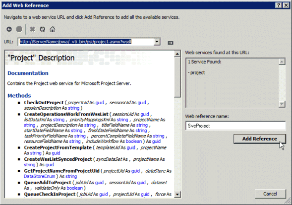

# <a name="prerequisites-for-asmx-based-code-samples-in-project"></a><span data-ttu-id="0114d-104">Voraussetzungen für ASMX-basierte Codebeispiele in Project</span><span class="sxs-lookup"><span data-stu-id="0114d-104">Prerequisites for ASMX-based code samples in Project</span></span>

<span data-ttu-id="0114d-105">Hier erfahren Sie Informationen zum Erstellen von Projekten in Visual Studio mithilfe von die ASMX-basierte Codebeispiele, die in den Referenzthemen für Project Server Interface (PSI) enthalten sind.</span><span class="sxs-lookup"><span data-stu-id="0114d-105">Learn information to help you create projects in Visual Studio by using the ASMX-based code samples that are included in the Project Server Interface (PSI) reference topics.</span></span>
  
<span data-ttu-id="0114d-106">Die folgenden Codebeispiele in der [Project Server 2013 Class Library und Web-Dienst verweisen](http://msdn.microsoft.com/library/ef1830e0-3c9a-4f98-aa0a-5556c298e7d1%28Office.15%29.aspx) enthalten viele ursprünglich für Office Project 2007 SDK erstellt wurden, und verwenden ein Standardformat für ASMX-Webdienste.</span><span class="sxs-lookup"><span data-stu-id="0114d-106">Many of the code samples included in the [Project Server 2013 class library and web service reference](http://msdn.microsoft.com/library/ef1830e0-3c9a-4f98-aa0a-5556c298e7d1%28Office.15%29.aspx) were originally created for the Office Project 2007 SDK, and use a standard format for ASMX web services.</span></span> <span data-ttu-id="0114d-107">Die Beispiele weiterhin Arbeit in Project Server 2013 und in eine Konsolenanwendung kopiert und als eine vollständige Einheit ausgeführt werden sollen.</span><span class="sxs-lookup"><span data-stu-id="0114d-107">The samples still work in Project Server 2013 and are designed to be copied into a console application and run as a complete unit.</span></span> <span data-ttu-id="0114d-108">Ausnahmen sind in der Stichprobe notiert haben.</span><span class="sxs-lookup"><span data-stu-id="0114d-108">Exceptions are noted in the sample.</span></span> 
  
<span data-ttu-id="0114d-109">Neue PSI-Beispiele in Project 2013 SDK entsprechen in ein Format, die die Windows Communication Foundation (WCF)-Dienste verwendet.</span><span class="sxs-lookup"><span data-stu-id="0114d-109">New PSI samples in the Project 2013 SDK conform to a format that uses Windows Communication Foundation (WCF) services.</span></span> <span data-ttu-id="0114d-110">Die ASMX-basierte Codebeispiele können auch mithilfe der WCF-Dienste angepasst werden.</span><span class="sxs-lookup"><span data-stu-id="0114d-110">The ASMX-based samples can also be adapted to use WCF services.</span></span> <span data-ttu-id="0114d-111">In diesem Artikel veranschaulicht, wie die Beispiele mit ASMX-Webdiensten.</span><span class="sxs-lookup"><span data-stu-id="0114d-111">This article shows how to use the samples with ASMX web services.</span></span> <span data-ttu-id="0114d-112">Informationen zur Verwendung der Beispiele mit WCF-Diensten finden Sie unter [Voraussetzungen für WCF-basierte Codebeispiele im Projekt](prerequisites-for-wcf-based-code-samples-in-project.md).</span><span class="sxs-lookup"><span data-stu-id="0114d-112">For information about using the samples with WCF services, see [Prerequisites for WCF-based code samples in Project](prerequisites-for-wcf-based-code-samples-in-project.md).</span></span>
  
> [!NOTE]
> <span data-ttu-id="0114d-113">Die ASMX Webdienstschnittstelle für die PSI wird ist in Project Server 2013 veraltet, jedoch weiterhin unterstützt.</span><span class="sxs-lookup"><span data-stu-id="0114d-113">The ASMX web service interface of the PSI is deprecated in Project Server 2013, but is still supported.</span></span> <span data-ttu-id="0114d-114">Wenn das Client-seitigen Objektmodell (CSOM) die Methoden, die die Anwendung erforderlich ist enthält, sollten neue Anwendungen mit dem Clientobjektmodell entwickelt werden.</span><span class="sxs-lookup"><span data-stu-id="0114d-114">If the client-side object model (CSOM) includes the methods that your application requires, new applications should be developed with the CSOM.</span></span> <span data-ttu-id="0114d-115">Das CSOM kann mit Project Online oder einer lokalen Installation von Project Server 2013.</span><span class="sxs-lookup"><span data-stu-id="0114d-115">The CSOM enables applications to work with Project Online or an on-premises installation of Project Server 2013.</span></span> <span data-ttu-id="0114d-116">Andernfalls, wenn die Anwendung die PSI verwendet wird, sollte die WCF-Schnittstelle verwendet werden also die Technologie, die für die Netzwerkkommunikation empfohlen.</span><span class="sxs-lookup"><span data-stu-id="0114d-116">Otherwise, if your application uses the PSI, it should use the WCF interface, which is the technology that we recommend for network communications.</span></span> <span data-ttu-id="0114d-117">Anwendungen, die die ASMX-Schnittstelle oder die WCF-Interface verwenden, können nur für lokale Installationen von Project Server 2013 arbeiten.</span><span class="sxs-lookup"><span data-stu-id="0114d-117">Applications that use the ASMX interface or the WCF interface can work only for on-premises installations of Project Server 2013.</span></span> <span data-ttu-id="0114d-118">Weitere Informationen zu den CSOM finden Sie unter [Project Server 2013-Architektur](project-server-2013-architecture.md) und [den clientseitigen Objektmodell (CSOM) für Project 2013](client-side-object-model-csom-for-project-2013.md).</span><span class="sxs-lookup"><span data-stu-id="0114d-118">For more information about the CSOM, see [Project Server 2013 architecture](project-server-2013-architecture.md) and [Client-side object model (CSOM) for Project 2013](client-side-object-model-csom-for-project-2013.md).</span></span> 
  
<span data-ttu-id="0114d-119">Vor dem Ausführen der Codebeispiele, müssen Sie Einrichten der Entwicklungsumgebung, konfigurieren Sie die Anwendung und generische Konstantenwerte entsprechend Ihrer Umgebung ändern.</span><span class="sxs-lookup"><span data-stu-id="0114d-119">Before running the code samples, you must set up the development environment, configure the application, and change generic constant values to match your environment.</span></span>
  
## <a name="setting-up-the-development-environment"></a><span data-ttu-id="0114d-120">Einrichten der Entwicklungsumgebung</span><span class="sxs-lookup"><span data-stu-id="0114d-120">Setting up the development environment</span></span>
<span data-ttu-id="0114d-121"><a name="pj15_PrerequisitesASMX_Setup"> </a></span><span class="sxs-lookup"><span data-stu-id="0114d-121"></span></span>

1. <span data-ttu-id="0114d-122">**Richten Sie einen Test Project Server-System**.</span><span class="sxs-lookup"><span data-stu-id="0114d-122">**Set up a test Project Server system**.</span></span>
    
   <span data-ttu-id="0114d-123">Verwenden Sie einen Test Project Server-System, wenn Sie entwickeln oder testen.</span><span class="sxs-lookup"><span data-stu-id="0114d-123">Use a test Project Server system whenever you are developing or testing.</span></span> <span data-ttu-id="0114d-124">Auch wenn Ihr Code perfekt interproject Abhängigkeiten funktioniert, können Berichte oder andere Umgebungsfaktoren unerwartete Ergebnisse verursachen.</span><span class="sxs-lookup"><span data-stu-id="0114d-124">Even when your code works perfectly, interproject dependencies, reporting, or other environmental factors can cause unintended consequences.</span></span> 
    
   > [!NOTE]
   > <span data-ttu-id="0114d-125">Stellen Sie sicher, dass Sie ein gültiger Benutzer auf dem Server, und überprüfen Sie, dass Sie über ausreichende Berechtigungen für die PSI-Aufrufe verfügen, die die Anwendung verwendet.</span><span class="sxs-lookup"><span data-stu-id="0114d-125">Ensure that you are a valid user on the server, and check that you have sufficient permissions for the PSI calls that your application uses.</span></span> <span data-ttu-id="0114d-126">Im Referenzthema für jede PSI-Methode enthält eine Project Server-Berechtigungen-Tabelle.</span><span class="sxs-lookup"><span data-stu-id="0114d-126">The reference topic for each PSI method includes a Project Server Permissions table.</span></span> <span data-ttu-id="0114d-127">Die [Project.QueueCreateProject](https://msdn.microsoft.com/library/WebSvcProject.Project.QueueCreateProject.aspx) -Methode erfordert beispielsweise die globale Berechtigung **Neues Projekt** und die Berechtigung **SaveProjectTemplate** .</span><span class="sxs-lookup"><span data-stu-id="0114d-127">For example, the [Project.QueueCreateProject](https://msdn.microsoft.com/library/WebSvcProject.Project.QueueCreateProject.aspx) method requires the global **NewProject** permission and the **SaveProjectTemplate** permission.</span></span> 
  
   <span data-ttu-id="0114d-128">In einigen Fällen müssen Sie möglicherweise das Remotedebuggen auf dem Server.</span><span class="sxs-lookup"><span data-stu-id="0114d-128">In some cases, you may have to do remote debugging on the server.</span></span> <span data-ttu-id="0114d-129">Sie müssen auch einen Ereignishandler einrichten, indem ein Ereignishandlerassembly auf jeden Project Server-Computer in der SharePoint-Farm installieren und konfigurieren Sie dann den Ereignishandler für die Project Web App-Instanz mithilfe der Seite Project Server-Einstellungen in den allgemeinen Anwendungseinstellungen der SharePoint-Zentraladministration.</span><span class="sxs-lookup"><span data-stu-id="0114d-129">You may also have to set up an event handler by installing an event handler assembly on each Project Server computer in the SharePoint farm, and then configuring the event handler for the Project Web App instance by using the Project Server Settings page in the General Application Settings of SharePoint Central Administration.</span></span>
    
2. <span data-ttu-id="0114d-130">**Einrichten von einem Entwicklungscomputer.**</span><span class="sxs-lookup"><span data-stu-id="0114d-130">**Set up a development computer.**</span></span>
    
   <span data-ttu-id="0114d-131">Sie werden in der Regel die PSI über ein Netzwerk zugreifen.</span><span class="sxs-lookup"><span data-stu-id="0114d-131">You usually access the PSI through a network.</span></span> <span data-ttu-id="0114d-132">Die folgenden Codebeispiele dienen zum auf einem Client ausgeführt werden, die getrennt vom Server, sofern nicht anders angegeben ist.</span><span class="sxs-lookup"><span data-stu-id="0114d-132">The code samples are designed to be run on a client that is separate from the server, except where noted.</span></span>
    
   1. <span data-ttu-id="0114d-133">**Installieren Sie die richtige Version von Visual Studio.**</span><span class="sxs-lookup"><span data-stu-id="0114d-133">**Install the correct version of Visual Studio.**</span></span> <span data-ttu-id="0114d-134">Wenn nicht anders angegeben werden die folgenden Codebeispiele in Visual c# geschrieben.</span><span class="sxs-lookup"><span data-stu-id="0114d-134">Except where noted, the code samples are written in Visual C#.</span></span> <span data-ttu-id="0114d-135">Sie können mit Visual Studio 2010 oder Visual Studio 2012 verwendet werden.</span><span class="sxs-lookup"><span data-stu-id="0114d-135">They can be used with Visual Studio 2010 or Visual Studio 2012.</span></span> <span data-ttu-id="0114d-136">Stellen Sie sicher, dass Sie das neueste Servicepack installiert haben.</span><span class="sxs-lookup"><span data-stu-id="0114d-136">Ensure that you have the most recent service pack installed.</span></span> 
        
   2. <span data-ttu-id="0114d-137">**Kopieren Sie Project Server-DLLs auf dem Entwicklungscomputer installiert.**</span><span class="sxs-lookup"><span data-stu-id="0114d-137">**Copy Project Server DLLs to the development computer.**</span></span> <span data-ttu-id="0114d-138">Kopieren Sie die folgenden Assemblys aus `[Program Files]\Microsoft Office Servers\15.0\Bin` auf dem Project Server-Computer, auf dem Entwicklungscomputer installiert:</span><span class="sxs-lookup"><span data-stu-id="0114d-138">Copy the following assemblies from  `[Program Files]\Microsoft Office Servers\15.0\Bin` on the Project Server computer to the development computer:</span></span> 
        
      - <span data-ttu-id="0114d-139">Microsoft.Office.Project.Server.Events.Receivers.dll</span><span class="sxs-lookup"><span data-stu-id="0114d-139">Microsoft.Office.Project.Server.Events.Receivers.dll</span></span>
      - <span data-ttu-id="0114d-140">Microsoft.Office.Project.Server.Library.dll</span><span class="sxs-lookup"><span data-stu-id="0114d-140">Microsoft.Office.Project.Server.Library.dll</span></span>
        
   3. <span data-ttu-id="0114d-141">Informationen dazu, wie Sie kompilieren und die Assembly ProjectServerServices.dll Proxy für die ASMX-Webdienste im PSI verwenden finden Sie unter [Verwendung einer PSI-Proxy-Assembly und IntelliSense Beschreibungen](#pj15_PrerequisitesASMX_BuildingProxy).</span><span class="sxs-lookup"><span data-stu-id="0114d-141">For information about how to compile and use the ProjectServerServices.dll proxy assembly for the ASMX web services in the PSI, see [Using a PSI proxy assembly and IntelliSense descriptions](#pj15_PrerequisitesASMX_BuildingProxy).</span></span>
    
3. <span data-ttu-id="0114d-142">**Installieren Sie die IntelliSense-Dateien.**</span><span class="sxs-lookup"><span data-stu-id="0114d-142">**Install the IntelliSense files.**</span></span>
    
    <span data-ttu-id="0114d-143">Laden IntelliSense Beschreibungen für Klassen und Member in Project Server-Assemblys Kopie zu verwenden, um die aktualisierten IntelliSense-XML-Dateien aus dem Projekt 2013 SDK in dasselbe Verzeichnis, in dem die Project Server-Assemblys gespeichert sind.</span><span class="sxs-lookup"><span data-stu-id="0114d-143">To use IntelliSense descriptions for classes and members in Project Server assemblies, copy the updated IntelliSense XML files from the Project 2013 SDK download to the same directory where the Project Server assemblies are located.</span></span> <span data-ttu-id="0114d-144">Kopieren Sie beispielsweise die Microsoft.Office.Project.Server.Library.xml-Datei in das Verzeichnis, in dem die Anwendung einen Verweis auf die Assembly Microsoft.Office.Project.Server.Library.dll festgelegt wird.</span><span class="sxs-lookup"><span data-stu-id="0114d-144">For example, copy the Microsoft.Office.Project.Server.Library.xml file to the directory where your application will set a reference to the Microsoft.Office.Project.Server.Library.dll assembly.</span></span>
    
    <span data-ttu-id="0114d-145">Beschreibungen von IntelliSense für die PSI-Webdienste erfordern, dass das Erstellen einer PSI-Proxy-Assembly mithilfe des CompileASMXProxyAssembly.cmd-Skripts in der `Documentation\IntelliSense\WSDL` Unterverzeichnis des Project 2013 SDK-Downloads.</span><span class="sxs-lookup"><span data-stu-id="0114d-145">IntelliSense descriptions for the PSI web services require that you create a PSI proxy assembly by using the CompileASMXProxyAssembly.cmd script in the  `Documentation\IntelliSense\WSDL` subdirectory in the Project 2013 SDK download.</span></span> <span data-ttu-id="0114d-146">Das Skript erstellt die ASMX-basierte ProjectServerServices.dll Proxy-Assembly.</span><span class="sxs-lookup"><span data-stu-id="0114d-146">The script creates the ASMX-based ProjectServerServices.dll proxy assembly.</span></span> <span data-ttu-id="0114d-147">Weitere Informationen finden Sie unter die Datei [ReadMe_IntelliSense] im Download SDK.</span><span class="sxs-lookup"><span data-stu-id="0114d-147">For more information, see the [ReadMe_IntelliSense] file in the SDK download.</span></span> 
    
## <a name="creating-the-application-and-adding-a-web-service-reference"></a><span data-ttu-id="0114d-148">Erstellen der Anwendung und einen Webverweis-Dienst</span><span class="sxs-lookup"><span data-stu-id="0114d-148">Creating the application and adding a web service reference</span></span>
<span data-ttu-id="0114d-149"><a name="pj15_PrerequisitesASMX_Configure"> </a></span><span class="sxs-lookup"><span data-stu-id="0114d-149"></span></span>

1. <span data-ttu-id="0114d-150">**Erstellen einer Konsolenanwendung**.</span><span class="sxs-lookup"><span data-stu-id="0114d-150">**Create a console application**.</span></span>
    
   <span data-ttu-id="0114d-151">Wenn Sie eine Konsolenanwendung, in der Dropdown-Liste im Dialogfeld **Neues Projekt** erstellen, wählen Sie **.NET Framework 4**.</span><span class="sxs-lookup"><span data-stu-id="0114d-151">When you create a console application, in the drop-down list of the **New Project** dialog box, select **.NET Framework 4**.</span></span> <span data-ttu-id="0114d-152">Sie können den Beispielcode PSI in der neuen Anwendung kopieren.</span><span class="sxs-lookup"><span data-stu-id="0114d-152">You can copy the PSI example code into the new application.</span></span>
    
2. <span data-ttu-id="0114d-153">**Fügen Sie den Verweis für ASMX erforderlich.**</span><span class="sxs-lookup"><span data-stu-id="0114d-153">**Add the reference required for ASMX.**</span></span>
    
   <span data-ttu-id="0114d-154">Fügen Sie im Projektmappen-Explorer einen Verweis auf **System.Web.Services** (siehe Abbildung 1).</span><span class="sxs-lookup"><span data-stu-id="0114d-154">In Solution Explorer, add a reference to **System.Web.Services** (see Figure 1).</span></span> 
    
   <span data-ttu-id="0114d-155">**Abbildung 1. Hinzufügen eines Verweises in Visual Studio**</span><span class="sxs-lookup"><span data-stu-id="0114d-155">**Figure 1. Adding a reference in Visual Studio**</span></span>

   <span data-ttu-id="0114d-156">![Hinzufügen eines Verweises in Visual Studio] (media/pj15_PrerequisitesASMX_AddReference.gif "Hinzufügen eines Verweises in Visual Studio")</span><span class="sxs-lookup"><span data-stu-id="0114d-156"></span></span>
  
3. <span data-ttu-id="0114d-157">**Kopieren Sie den Code**.</span><span class="sxs-lookup"><span data-stu-id="0114d-157">**Copy the code**.</span></span>
    
   <span data-ttu-id="0114d-158">Kopieren Sie das vollständige Codebeispiel in der Datei Program.cs der Konsole an.</span><span class="sxs-lookup"><span data-stu-id="0114d-158">Copy the complete code example into the Program.cs file of the console application.</span></span>
    
4. <span data-ttu-id="0114d-159">**Legen Sie den Namespace für die beispielanwendung aus**.</span><span class="sxs-lookup"><span data-stu-id="0114d-159">**Set the namespace for the sample application**.</span></span>
    
   <span data-ttu-id="0114d-160">Sie können ändern Sie den Namespace am oberen Rand des Beispiels zum Standard-Namespace Anwendung aufgeführt oder Standardnamespace Anwendung im Beispiel entsprechend ändern.</span><span class="sxs-lookup"><span data-stu-id="0114d-160">You can either change the namespace listed at the top of the sample to the application default namespace, or change the default application namespace to match the sample.</span></span> <span data-ttu-id="0114d-161">Sie können den Standardnamespace Anwendung durch Ändern der Anwendungseigenschaften ändern.</span><span class="sxs-lookup"><span data-stu-id="0114d-161">You can change the default application namespace by changing the application properties.</span></span>
    
   <span data-ttu-id="0114d-162">Das Codebeispiel für [QueueRenameProject](https://msdn.microsoft.com/library/WebSvcProject.Project.QueueRenameProject.aspx) verfügt beispielsweise über den **Microsoft.SDK.Project.Samples.RenameProject**-Namespace.</span><span class="sxs-lookup"><span data-stu-id="0114d-162">For example, the code sample for [QueueRenameProject](https://msdn.microsoft.com/library/WebSvcProject.Project.QueueRenameProject.aspx) has the namespace **Microsoft.SDK.Project.Samples.RenameProject**.</span></span> <span data-ttu-id="0114d-163">Wenn der Name des Visual Studio-Projekts **RenameProject**ist, kopieren Sie den Namespace aus der Datei Program.cs, und öffnen Sie **Project Eigenschaftenbereich** (Wählen Sie im Menü **Projekt** **RenameProject Eigenschaften**ein).</span><span class="sxs-lookup"><span data-stu-id="0114d-163">If the name of the Visual Studio project is **RenameProject**, copy the namespace from the Program.cs file, and then open the project **Properties** pane (on the **Project** menu, choose **RenameProject Properties**).</span></span> <span data-ttu-id="0114d-164">Kopieren Sie auf der Registerkarte **Anwendung** den Namespace in das Textfeld **Standardnamespace** .</span><span class="sxs-lookup"><span data-stu-id="0114d-164">On the **Application** tab, copy the namespace into the **Default namespace** text box.</span></span> 
    
5. <span data-ttu-id="0114d-165">**Webverweise festgelegt**.</span><span class="sxs-lookup"><span data-stu-id="0114d-165">**Set the web references**.</span></span>
    
   <span data-ttu-id="0114d-166">Die meisten Beispiele erfordern einen Verweis auf eine oder mehrere der PSI-Webdienste.</span><span class="sxs-lookup"><span data-stu-id="0114d-166">Most examples require a reference to one or more of the PSI web services.</span></span> <span data-ttu-id="0114d-167">Diese werden in der Stichprobe selbst oder Kommentare, die im Beispiel vorangehen aufgelistet.</span><span class="sxs-lookup"><span data-stu-id="0114d-167">These are listed in the sample itself or in comments that precede the sample.</span></span> <span data-ttu-id="0114d-168">Wenn den richtigen Namespace der Webverweise erhalten möchten, stellen Sie sicher, dass Sie zunächst den Standardnamespace Anwendung festlegen.</span><span class="sxs-lookup"><span data-stu-id="0114d-168">To get the correct namespace of the web references, ensure that you first set the default application namespace.</span></span>
    
   <span data-ttu-id="0114d-169">Es gibt drei Möglichkeiten zum Hinzufügen eines ASMX-Webdienstverweises für die PSI:</span><span class="sxs-lookup"><span data-stu-id="0114d-169">There are three ways to add an ASMX web service reference for the PSI:</span></span>
    
   - <span data-ttu-id="0114d-170">Erstellen einer PSI-Proxy-Assembly mit dem Namen ProjectServerServices.dll, und legen Sie einen Verweis auf die Assembly.</span><span class="sxs-lookup"><span data-stu-id="0114d-170">Build a PSI proxy assembly named ProjectServerServices.dll, and then set a reference to the assembly.</span></span> <span data-ttu-id="0114d-171">Wenn IntelliSense erhalten möchten, ist dies die empfohlene Option zum einen PSI-Verweis hinzufügen.</span><span class="sxs-lookup"><span data-stu-id="0114d-171">To get IntelliSense, this is the recommended way to add a PSI reference.</span></span> <span data-ttu-id="0114d-172">Finden Sie unter [Verwendung einer PSI-Proxy-Assembly und IntelliSense Beschreibungen](#pj15_PrerequisitesASMX_BuildingProxy).</span><span class="sxs-lookup"><span data-stu-id="0114d-172">See [Using a PSI proxy assembly and IntelliSense descriptions](#pj15_PrerequisitesASMX_BuildingProxy).</span></span>
    
   - <span data-ttu-id="0114d-173">Fügen Sie eine Proxydatei aus der wsdl.exe Ausgabe der Visual Studio-Projektmappe.</span><span class="sxs-lookup"><span data-stu-id="0114d-173">Add a proxy file from the wsdl.exe output to the Visual Studio solution.</span></span> <span data-ttu-id="0114d-174">Finden Sie unter [Hinzufügen einer PSI-Proxy-Datei](#pj15_PrerequisitesASMX_AddingProxyFile).</span><span class="sxs-lookup"><span data-stu-id="0114d-174">See [Adding a PSI proxy file](#pj15_PrerequisitesASMX_AddingProxyFile).</span></span>
    
   - <span data-ttu-id="0114d-175">Hinzufügen eines Webverweises Service mithilfe von Visual Studio.</span><span class="sxs-lookup"><span data-stu-id="0114d-175">Add a web service reference by using Visual Studio.</span></span> <span data-ttu-id="0114d-176">Finden Sie unter [Hinzufügen einer Webs-service Verweis](#pj15_PrerequisitesASMX_AddingServiceReference).</span><span class="sxs-lookup"><span data-stu-id="0114d-176">See [Adding a web service reference](#pj15_PrerequisitesASMX_AddingServiceReference).</span></span>

<span data-ttu-id="0114d-177"><a name="pj15_PrerequisitesASMX_BuildingProxy"> </a></span><span class="sxs-lookup"><span data-stu-id="0114d-177"></span></span>

### <a name="using-a-psi-proxy-assembly-and-intellisense-descriptions"></a><span data-ttu-id="0114d-178">Verwenden einer PSI-Proxy-Assembly und Beschreibungen von IntelliSense</span><span class="sxs-lookup"><span data-stu-id="0114d-178">Using a PSI proxy assembly and IntelliSense descriptions</span></span>

<span data-ttu-id="0114d-179">Sie erstellen und verwenden können, die ProjectServerServices.dll Proxy-Assembly für alle ASMX-basierte Webdienste im PSI, mit dem Skript CompileASMXProxyAssembly.cmd in die `Documentation\IntelliSense\WSDL` Ordner des Project 2013-SDK-Downloads.</span><span class="sxs-lookup"><span data-stu-id="0114d-179">You can build and use the ProjectServerServices.dll proxy assembly for all ASMX-based web services in the PSI, by using the CompileASMXProxyAssembly.cmd script in the  `Documentation\IntelliSense\WSDL` folder of the Project 2013 SDK download.</span></span> <span data-ttu-id="0114d-180">Ein Link zum Download finden Sie unter [Project 2013-Entwicklerdokumentation](project-2013-developer-documentation.md).</span><span class="sxs-lookup"><span data-stu-id="0114d-180">For a link to the download, see [Project 2013 developer documentation](project-2013-developer-documentation.md).</span></span>
  
> [!NOTE]
> <span data-ttu-id="0114d-181">Beim Extrahieren der Quelldateien Proxy aus der Datei Source.zip herunter-Datei, die Dateien in die `Documentation\IntelliSense\WSDL\Source` Ordner ab dem Datum der Veröffentlichung des Project 2013-SDK-Downloads aktuell sind.</span><span class="sxs-lookup"><span data-stu-id="0114d-181">When you extract the proxy source files from the Source.zip file, the files in the  `Documentation\IntelliSense\WSDL\Source` folder are current as of the publication date of the Project 2013 SDK download.</span></span> <span data-ttu-id="0114d-182">Generieren aktualisiert PSI Proxy Quelldateien, führen Sie das Skript GenASMXProxyAssembly.cmd auf dem Project Server-Computer.</span><span class="sxs-lookup"><span data-stu-id="0114d-182">To generate updated PSI proxy source files, run the GenASMXProxyAssembly.cmd script on the Project Server computer.</span></span> <span data-ttu-id="0114d-183">Die Skripts in der `Documentation\IntelliSense\WCF` Ordner für ASMX-basierte Anwendungen nicht mehr verwendet.</span><span class="sxs-lookup"><span data-stu-id="0114d-183">The scripts in the  `Documentation\IntelliSense\WCF` folder do not work for ASMX-based applications.</span></span> <span data-ttu-id="0114d-184">Das GenWCFProxyAssembly.cmd-Skript ruft SvcUtil.exe, die Quellcodedateien für die WCF-Dienste generiert.</span><span class="sxs-lookup"><span data-stu-id="0114d-184">The GenWCFProxyAssembly.cmd script calls SvcUtil.exe, which generates source code files for the WCF services.</span></span> <span data-ttu-id="0114d-185">Die WCF-Proxy-Dateien können verschiedene Attribute, die Channel-Schnittstelle und eine Client-Klasse für jeden PSI-Dienst.</span><span class="sxs-lookup"><span data-stu-id="0114d-185">The WCF proxy files include different attributes, the channel interface, and a client class for each PSI service.</span></span> <span data-ttu-id="0114d-186">Der Dienst WCF-basierte Ressource umfasst beispielsweise die **ResourceChannel** -Schnittstelle, die **Ressource** Interface und der **ResourceClient** -Klasse.</span><span class="sxs-lookup"><span data-stu-id="0114d-186">For example, the WCF-based Resource service includes the **ResourceChannel** interface, the **Resource** interface, and the **ResourceClient** class.</span></span> <span data-ttu-id="0114d-187">Das Ressource ASMX-basierte Web enthält **die Klasse mit einigen anderen Eigenschaften** .</span><span class="sxs-lookup"><span data-stu-id="0114d-187">The ASMX-based Resource web includes the **Resource** class with some different properties.</span></span> 
  
<span data-ttu-id="0114d-188">Es folgt das GenASMXProxyAssembly.cmd-Skript, das Ausgabedateien für die PSI-Webdienste WSDL-Datei generiert und anschließend die Assembly kompiliert wird.</span><span class="sxs-lookup"><span data-stu-id="0114d-188">Following is the GenASMXProxyAssembly.cmd script that generates WSDL output files for the PSI web services, and then compiles the assembly.</span></span>
  
```MS-DOS
@echo off
@ECHO ---------------------------------------------------
@ECHO Creating C# files for the ASMX-based proxy assembly
@ECHO ---------------------------------------------------
REM Replace ServerName with the name of the server and 
REM the instance name of Project Web App. Do not use localhost.
(set VDIR=http://ServerName/pwa/_vti_bin/psi)
(set OUTDIR=.\Source)
REM ** Wsdl.exe is the same version in the v6.0A and v7.0A subdirectories. 
(set WSDL="C:\Program Files (x86)\Microsoft SDKs\Windows\v7.0A\Bin\x64\wsdl.exe")
if not exist %OUTDIR% (
md %OUTDIR%
)
for /F %%i in (Classlist_asmx.txt) do %WSDL% /nologo /l:CS /namespace:Svc%%i /out:%OUTDIR%\wsdl.%%i.cs %VDIR%/%%i.asmx?wsdl 
@ECHO ----------------------------
@ECHO Compiling the proxy assembly
@ECHO ----------------------------
(set SOURCE=%OUTDIR%\wsdl)
(set CSC=%WINDIR%\Microsoft.NET\Framework64\v4.0.30319\csc.exe)
(set ASSEMBLY_NAME=ProjectServerServices.dll)
%CSC% /t:library /out:%ASSEMBLY_NAME% %SOURCE%*.cs
```

<span data-ttu-id="0114d-189">Das Skript verwendet die ClassList_asmx.txt-Datei, die die Liste der Webdienste enthält, die für Entwickler von Drittanbietern verfügbar sind.</span><span class="sxs-lookup"><span data-stu-id="0114d-189">The script uses the ClassList_asmx.txt file, which contains the list of web services that are available for third-party developers.</span></span>
  
```text
Admin
Archive
Calendar
CubeAdmin
CustomFields
Driver
Events
LoginForms
LoginWindows
LookupTable
Notifications
ObjectLinkProvider
PortfolioAnalyses
Project
QueueSystem
ResourcePlan
Resource
Security
Statusing
TimeSheet
Workflow
WssInterop
```

<span data-ttu-id="0114d-190">Die Skripts erstellen Sie eine Assembly mit dem Namen ProjectServerServices.dll.</span><span class="sxs-lookup"><span data-stu-id="0114d-190">The scripts create an assembly named ProjectServerServices.dll.</span></span> <span data-ttu-id="0114d-191">Vermeiden Sie es mit ProjectServerServices.dll für die Assembly des WCF-basierte verwirrend.</span><span class="sxs-lookup"><span data-stu-id="0114d-191">Avoid confusing it with ProjectServerServices.dll for the WCF-based assembly.</span></span> <span data-ttu-id="0114d-192">Die Assemblynamen sind die gleichen, die ProjectServerServices.xml IntelliSense-Datei mit einer Assembly aktivieren.</span><span class="sxs-lookup"><span data-stu-id="0114d-192">The assembly names are the same, to enable using either assembly with the ProjectServerServices.xml IntelliSense file.</span></span>
  
<span data-ttu-id="0114d-193">Der durch die Skripts für die ASMX-Webdienste und die WCF-Dienste erstellten beliebige Namespace entspricht, damit die ProjectServerServices.xml IntelliSense-Datei mit einer Assembly arbeitet.</span><span class="sxs-lookup"><span data-stu-id="0114d-193">The arbitrary namespace created by the scripts for both the ASMX web services and the WCF services is the same, so that the ProjectServerServices.xml IntelliSense file works with either assembly.</span></span> <span data-ttu-id="0114d-194">Beispielsweise ist der Namespace des Diensts Ressource in der Proxyassembly für WCF-basierte und in der Proxyassembly für ASMX-basierte **SvcResource**.</span><span class="sxs-lookup"><span data-stu-id="0114d-194">For example, the namespace of the Resource service in the WCF-based proxy assembly and in the ASMX-based proxy assembly is **SvcResource**.</span></span> <span data-ttu-id="0114d-195">Sie können die Namespacenamen natürlich ändern – Wenn Sie sicherstellen, dass sie in der Proxyassembly und in der Datei ProjectServerServices.xml IntelliSense übereinstimmen.</span><span class="sxs-lookup"><span data-stu-id="0114d-195">You can, of course, change the namespace names—if you ensure that they match in the proxy assembly and in the ProjectServerServices.xml IntelliSense file.</span></span>
  
<span data-ttu-id="0114d-196">Wenn ein Codebeispiel einen anderen Namen für einen PSI Web Service-Namespace verwendet wird, muss beispielsweise **ProjectWebSvc**IntelliSense Sie zusammenarbeiten, ändern Sie das Beispiel um **SvcProject** verwenden, damit der Namespace Proxyassembly entspricht.</span><span class="sxs-lookup"><span data-stu-id="0114d-196">If a code sample uses a different name for a PSI web service namespace, for example **ProjectWebSvc**, for IntelliSense to work you must change the sample to use **SvcProject** so that the namespace matches the proxy assembly.</span></span> 
  
<span data-ttu-id="0114d-197">Ein Vorteil der Verwendung der ASMX-basierte Proxy-Assembly ist, dass sie alle PSI Web Service Namespaces enthält. Sie müssen keinen mehrere Webverweise erstellen.</span><span class="sxs-lookup"><span data-stu-id="0114d-197">An advantage to using the ASMX-based proxy assembly is that it includes all PSI web service namespaces; you do not have to create multiple web references.</span></span> <span data-ttu-id="0114d-198">Ein weiterer Vorteil besteht darin, wenn Sie die ProjectServerServices.xml-Datei in dasselbe Verzeichnis hinzufügen, in dem Sie einen Verweis auf die Assembly ProjectServerServices.dll Proxy festlegen, können Sie IntelliSense Beschreibungen für die PSI-Klassen und Member erhalten.</span><span class="sxs-lookup"><span data-stu-id="0114d-198">Another advantage is that, if you add the ProjectServerServices.xml file to the same directory where you set a reference to the ProjectServerServices.dll proxy assembly, you can get IntelliSense descriptions for the PSI classes and members.</span></span> <span data-ttu-id="0114d-199">Abbildung 2 zeigt den Text IntelliSense für die **Project.QueueCreateProject** -Methode.</span><span class="sxs-lookup"><span data-stu-id="0114d-199">Figure 2 shows the IntelliSense text for the **Project.QueueCreateProject** method.</span></span> <span data-ttu-id="0114d-200">Weitere Informationen finden Sie unter die Datei [ReadMe_IntelliSense] im Ordner IntelliSense des Project 2013-SDK-Downloads.</span><span class="sxs-lookup"><span data-stu-id="0114d-200">For more information, see the [ReadMe_IntelliSense] file in the IntelliSense folder of the Project 2013 SDK download.</span></span> 
  
<span data-ttu-id="0114d-201">**Abbildung 2. Verwenden von IntelliSense für eine Methode in den Project-Webdienst**</span><span class="sxs-lookup"><span data-stu-id="0114d-201">**Figure 2. Using IntelliSense for a method in the Project web service**</span></span>

<span data-ttu-id="0114d-202">![Verwenden von Intellisense für eine Methode in einem PSI-Dienst] (media/pj15_PrerequisitesASMX_Intellisense.gif "Verwenden von Intellisense für eine Methode in einem PSI-Dienst")</span><span class="sxs-lookup"><span data-stu-id="0114d-202"></span></span>
  
<span data-ttu-id="0114d-203">Nachteile der Verwendung der Proxyassembly sind, dass die Lösung größer ist, und Sie müssen verteilen und installieren Sie die Proxyassembly mit der Lösung.</span><span class="sxs-lookup"><span data-stu-id="0114d-203">Disadvantages to using the proxy assembly are that the solution is larger and you must distribute and install the proxy assembly with the solution.</span></span> <span data-ttu-id="0114d-204">Sie müssen außerdem den gleichen Namespaces, die in der Proxyassembly und die IntelliSense-Dateien sind verwenden, es sei denn, Sie ändern das Skript und die ProjectServerServices.xml IntelliSense-Datei, unterschiedliche Namespaces zu verwenden.</span><span class="sxs-lookup"><span data-stu-id="0114d-204">You must also use the same namespaces that are in the proxy assembly and IntelliSense files, unless you change the script and ProjectServerServices.xml IntelliSense file to use different namespaces.</span></span>
  
### <a name="adding-a-psi-proxy-file"></a><span data-ttu-id="0114d-205">Hinzufügen einer PSI-Proxy-Datei</span><span class="sxs-lookup"><span data-stu-id="0114d-205">Adding a PSI proxy file</span></span>
<span data-ttu-id="0114d-206"><a name="pj15_PrerequisitesASMX_AddingProxyFile"> </a></span><span class="sxs-lookup"><span data-stu-id="0114d-206"></span></span>

<span data-ttu-id="0114d-207">Der Project 2013-SDK-Download enthält die Quelldateien für die Proxyassembly mit dem Befehl Wsdl.exe generiert.</span><span class="sxs-lookup"><span data-stu-id="0114d-207">The Project 2013 SDK download includes the source files generated by the Wsdl.exe command for the proxy assembly.</span></span> <span data-ttu-id="0114d-208">Die Quelldateien befinden sich in der Datei Source.zip herunter, in der `Documentation\IntelliSense\ASMX` Unterverzeichnis.</span><span class="sxs-lookup"><span data-stu-id="0114d-208">The source files are in Source.zip in the  `Documentation\IntelliSense\ASMX` subdirectory.</span></span> <span data-ttu-id="0114d-209">Anstatt einen Verweis auf die Proxyassembly, können Sie eine oder mehrere der Quelldateien für Visual Studio-Projektmappe hinzufügen.</span><span class="sxs-lookup"><span data-stu-id="0114d-209">Instead of setting a reference to the proxy assembly, you can add one or more of the source files to a Visual Studio solution.</span></span> <span data-ttu-id="0114d-210">Fügen Sie beispielsweise die WSDL-Datei nach der Ausführung des Skripts GenASMXProxyAssembly.cmd hinzu. Project.cs-Datei, die die Lösung.</span><span class="sxs-lookup"><span data-stu-id="0114d-210">For example, after running the GenASMXProxyAssembly.cmd script, add the wsdl.Project.cs file to the solution.</span></span> <span data-ttu-id="0114d-211">Anstelle des Skripts ausführen, können Sie eine einzelne Quelldatei, zum Beispiel generiert die folgenden Befehle ausführen:</span><span class="sxs-lookup"><span data-stu-id="0114d-211">Instead of running the script, you can run the following commands to generate a single source file, for example:</span></span> 
  
```MS-DOS
set VDIR=http://ServerName/ProjectServerName/_vti_bin/psi
set WSDL="C:\Program Files (x86)\Microsoft SDKs\Windows\v7.0A\Bin\x64\wsdl.exe"
%WSDL% /nologo /l:cs /namespace:SvcProject /out:wsdl.Project.cs %VDIR%/Project.asmx?wsdl
```

<span data-ttu-id="0114d-212">Um ein **Project** -Objekt als einer Klassenvariablen namens **Projekt**definieren möchten, verwenden Sie den folgenden Code ein.</span><span class="sxs-lookup"><span data-stu-id="0114d-212">To define a **Project** object as a class variable named **project**, use the following code.</span></span> <span data-ttu-id="0114d-213">Die **AddContextInfo** -Methode wird das **Project** -Objekt für die Windows-Authentifizierung und formularbasierte Authentifizierung die Kontextinformationen hinzugefügt.</span><span class="sxs-lookup"><span data-stu-id="0114d-213">The **AddContextInfo** method adds the context information to the **project** object for Windows authentication and Forms-based authentication.</span></span> 
  
```cs
private static SvcProject.Project project;
private static SvcLoginForms.LoginForms loginForms =
            new SvcLoginForms.LoginForms();
. . .
public void AddContextInfo()
{
    // Add the Url property.
    project.Url = "http://ServerName /ProjectServerName /_vti_bin/psi/project.asmx";
    // Add Windows credentials.
    project.Credentials = CredentialCache.DefaultCredentials;
    // If Forms authentication is used, add the Project Server cookie.
    project.CookieContainer = loginForms.CookieContainer;
}
```

> [!NOTE]
> <span data-ttu-id="0114d-214">Ob Sie mit einer PSI-Proxy-Assembly oder einer Proxydatei für eine Project Dienstverweis mit dem Namen **SvcProject hinzufügen**, verwenden Sie den gleichen Code, um ein **Project** -Objekt zu erstellen.</span><span class="sxs-lookup"><span data-stu-id="0114d-214">Whether you use a PSI proxy assembly or add a proxy file for a Project service reference named **SvcProject**, you would use the same code to create a **project** object.</span></span> 
  
### <a name="adding-a-web-service-reference"></a><span data-ttu-id="0114d-215">Hinzufügen eines Webverweises service</span><span class="sxs-lookup"><span data-stu-id="0114d-215">Adding a web service reference</span></span>
<span data-ttu-id="0114d-216"><a name="pj15_PrerequisitesASMX_AddingServiceReference"> </a></span><span class="sxs-lookup"><span data-stu-id="0114d-216"></span></span>

<span data-ttu-id="0114d-217">Wenn Sie nicht die ASMX-basierte Proxyassembly verwenden und eine Ausgabe WSDL-Datei hinzufügen, können Sie eine oder mehrere einzelne Webverweise festlegen.</span><span class="sxs-lookup"><span data-stu-id="0114d-217">If you do not use the ASMX-based proxy assembly or add a WSDL output file, you can set one or more individual web references.</span></span> <span data-ttu-id="0114d-218">Die folgenden Schritte zeigen, wie Sie einen Webverweis mithilfe von Visual Studio 2012 festgelegt.</span><span class="sxs-lookup"><span data-stu-id="0114d-218">The following steps show how to set a web reference by using Visual Studio 2012.</span></span>
  
1. <span data-ttu-id="0114d-219">Klicken Sie im **Projektmappen-Explorer**mit der rechten Maustaste auf den Ordner **Verweise** , und wählen Sie dann auf **Dienstverweis hinzufügen**.</span><span class="sxs-lookup"><span data-stu-id="0114d-219">In **Solution Explorer**, right-click the **References** folder, and then choose **Add Service Reference**.</span></span> 
    
2. <span data-ttu-id="0114d-220">Wählen Sie **Erweitert**, klicken Sie im Dialogfeld **Dienstverweis hinzufügen** .</span><span class="sxs-lookup"><span data-stu-id="0114d-220">In the **Add Service Reference** dialog box, choose **Advanced**.</span></span>
    
3. <span data-ttu-id="0114d-221">Wählen Sie im Dialogfeld **Dienstverweiseinstellungen** **Webverweis hinzufügen**.</span><span class="sxs-lookup"><span data-stu-id="0114d-221">In the **Service Reference Settings** dialog box, choose **Add Web Reference**.</span></span>
    
4. <span data-ttu-id="0114d-222">Geben Sie in das Textfeld **URL** `http:// _ServerName_/ _ProjectServerName_/_vti_bin/psi/ _ServiceName_.asmx?wsdl`, und drücken Sie die **EINGABETASTE** , oder wählen Sie das Symbol **wechseln** .</span><span class="sxs-lookup"><span data-stu-id="0114d-222">In the **URL** text box, type `http:// _ServerName_/ _ProjectServerName_/_vti_bin/psi/ _ServiceName_.asmx?wsdl`, and then press **Enter** or choose the **Go** icon.</span></span> <span data-ttu-id="0114d-223">Wenn Sie Secure Sockets Layer (SSL) installiert haben, sollten Sie das HTTPS-Protokoll anstelle des HTTP-Protokolls verwenden.</span><span class="sxs-lookup"><span data-stu-id="0114d-223">If you have Secure Sockets Layer (SSL) installed, you should use the HTTPS protocol instead of the HTTP protocol.</span></span> 

   <span data-ttu-id="0114d-224">Verwenden Sie beispielsweise die folgende URL für den Project-Dienst auf die `http://MyServer/pwa` Website für die Project Web App:`http://MyServer/pwa/_vti_bin/psi/project.asmx?wsdl`</span><span class="sxs-lookup"><span data-stu-id="0114d-224">For example, use the following URL for the Project service on the  `http://MyServer/pwa` site for Project Web App: `http://MyServer/pwa/_vti_bin/psi/project.asmx?wsdl`</span></span>
    
   <span data-ttu-id="0114d-225">Oder, öffnen Sie Ihren Webbrowser, und navigieren Sie zu `http://ServerName/ProjectServerName/_vti_bin/psi/ServiceName.asmx?wsdl`.</span><span class="sxs-lookup"><span data-stu-id="0114d-225">Or, open your web browser, and navigate to `http://ServerName/ProjectServerName/_vti_bin/psi/ServiceName.asmx?wsdl`.</span></span> <span data-ttu-id="0114d-226">Speichern Sie die Datei in ein lokales Verzeichnis, z. B. `C:\Project\WebServices\ServiceName.wsdl`.</span><span class="sxs-lookup"><span data-stu-id="0114d-226">Save the file to a local directory, such as `C:\Project\WebServices\ServiceName.wsdl`.</span></span> <span data-ttu-id="0114d-227">Geben Sie im Dialogfeld **Webverweis hinzufügen** für die **URL**, das Dateiprotokoll und den Pfad zu der Datei ein.</span><span class="sxs-lookup"><span data-stu-id="0114d-227">In the **Add Web Reference** dialog box, for **URL**, type the file protocol and the path to the file.</span></span> <span data-ttu-id="0114d-228">Geben Sie zum Beispiel `file://C:\Project\WebServices\Project.wsdl`.</span><span class="sxs-lookup"><span data-stu-id="0114d-228">For example, type `file://C:\Project\WebServices\Project.wsdl`.</span></span> 
    
5. <span data-ttu-id="0114d-229">Nachdem Sie der Verweis aufgelöst wird, geben Sie den Verweisnamen in das Textfeld **Webverweisname** .</span><span class="sxs-lookup"><span data-stu-id="0114d-229">After the reference resolves, type the reference name in the **Web reference name** text box.</span></span> <span data-ttu-id="0114d-230">Codebeispiele in der Project 2013-Entwicklerdokumentation verwenden Sie den Namen beliebige Standardverweis **Svc _ServiceName_**.</span><span class="sxs-lookup"><span data-stu-id="0114d-230">Code examples in the Project 2013 developer documentation use the arbitrary standard reference name **Svc _ServiceName_**.</span></span> <span data-ttu-id="0114d-231">Beispielsweise heißt der Project-Webdienst **SvcProject** (siehe Abbildung 3).</span><span class="sxs-lookup"><span data-stu-id="0114d-231">For example, the Project web service is named **SvcProject** (see Figure 3).</span></span> 
    
   <span data-ttu-id="0114d-232">**Abbildung 3. Hinzufügen eines ASMX-Webdienstverweises**</span><span class="sxs-lookup"><span data-stu-id="0114d-232">**Figure 3. Adding an ASMX web service reference**</span></span>

   <span data-ttu-id="0114d-233">![Hinzufügen eines ASMX-Webdienstverweises] (media/pj15_PrerequisitesASMX_AddWebSvcReference.gif "Hinzufügen eines ASMX-Webdienstverweises")</span><span class="sxs-lookup"><span data-stu-id="0114d-233"></span></span>
  
<span data-ttu-id="0114d-234">Für Anwendungskomponenten, die auf dem Project Server-Computer ausführen müssen, Identitätswechsel verwenden oder haben verwenden mit erhöhten Berechtigungen ein WCF-Dienstverweises anstelle eines ASMX-Webverweis.</span><span class="sxs-lookup"><span data-stu-id="0114d-234">For application components that must run on the Project Server computer, use impersonation, or have elevated permissions, use a WCF service reference instead of an ASMX web reference.</span></span> <span data-ttu-id="0114d-235">Weitere Informationen finden Sie unter [Voraussetzungen für WCF-basierte Codebeispiele im Projekt](prerequisites-for-wcf-based-code-samples-in-project.md).</span><span class="sxs-lookup"><span data-stu-id="0114d-235">For more information, see [Prerequisites for WCF-based code samples in Project](prerequisites-for-wcf-based-code-samples-in-project.md).</span></span>
  
## <a name="setting-other-references"></a><span data-ttu-id="0114d-236">Festlegen anderer Verweise</span><span class="sxs-lookup"><span data-stu-id="0114d-236">Setting other references</span></span>
<span data-ttu-id="0114d-237"><a name="pj15_PrerequisitesASMX_OtherReferences"> </a></span><span class="sxs-lookup"><span data-stu-id="0114d-237"></span></span>

<span data-ttu-id="0114d-238">Project Server-Anwendungen verwenden häufig andere Dienste, wie SharePoint Server 2013-Webdienste.</span><span class="sxs-lookup"><span data-stu-id="0114d-238">Project Server applications often use other services, such as SharePoint Server 2013 web services.</span></span> <span data-ttu-id="0114d-239">Wenn andere Dienste erforderlich sind, werden sie in das Beispiel aufgeführt.</span><span class="sxs-lookup"><span data-stu-id="0114d-239">If other services are required, they are noted in the example.</span></span>
  
<span data-ttu-id="0114d-240">Lokale Referenzen für das Codebeispiel sind in **using** -Anweisungen am oberen Rand des Beispiels aufgeführt:</span><span class="sxs-lookup"><span data-stu-id="0114d-240">Local references for the code sample are listed in **using** statements at the top of the sample:</span></span> 
  
1. <span data-ttu-id="0114d-241">Klicken Sie im **Projektmappen-Explorer**mit der rechten Maustaste auf den Ordner **Verweise** , und wählen Sie dann auf **Verweis hinzufügen**.</span><span class="sxs-lookup"><span data-stu-id="0114d-241">In **Solution Explorer**, right-click the **References** folder, and then choose **Add Reference**.</span></span>
    
2. <span data-ttu-id="0114d-242">Wählen Sie **Durchsuchen aus**, und wechseln Sie zu dem Speicherort, in dem Sie die Project Server-DLLs gespeichert, die Sie zuvor kopiert.</span><span class="sxs-lookup"><span data-stu-id="0114d-242">Choose **Browse**, and then browse to the location where you stored the Project Server DLLs that you copied previously.</span></span> <span data-ttu-id="0114d-243">Wählen Sie die DLLs, die Sie benötigen, und wählen Sie dann auf **OK**.</span><span class="sxs-lookup"><span data-stu-id="0114d-243">Choose the DLLs you need, and then choose **OK**.</span></span>
    
> [!NOTE]
> <span data-ttu-id="0114d-244">Stellen Sie sicher, dass die Versionen der Assembly auf Ihrem Entwicklungscomputer genau auf dem Zielcomputer für Project Server übereinstimmen.</span><span class="sxs-lookup"><span data-stu-id="0114d-244">Ensure that the assembly versions on your development computer exactly match those on the target Project Server computer.</span></span> 
  
## <a name="using-multiple-authentication"></a><span data-ttu-id="0114d-245">Verwenden mehrere Authentifizierungsmethoden</span><span class="sxs-lookup"><span data-stu-id="0114d-245">Using multiple authentication</span></span>
<span data-ttu-id="0114d-246"><a name="pj15_PrerequisitesASMX_ClaimsMultiAuth"> </a></span><span class="sxs-lookup"><span data-stu-id="0114d-246"></span></span>

<span data-ttu-id="0114d-247">Die Authentifizierung des lokalen Project Server-Benutzer, erfolgt durch Windows-Authentifizierung oder Formularauthentifizierung über Claims processing in SharePoint Server 2013.</span><span class="sxs-lookup"><span data-stu-id="0114d-247">Authentication of on-premises Project Server users, whether by Windows authentication or Forms authentication, is done through claims processing in SharePoint Server 2013.</span></span> <span data-ttu-id="0114d-248">Mehrere Authentifizierungsmethoden bedeutet, dass die Webanwendung, die auf der Project Web App bereitgestellt wird Windows-Authentifizierung und formularbasierte Authentifizierung unterstützt.</span><span class="sxs-lookup"><span data-stu-id="0114d-248">Multiple authentication means that the web application on which Project Web App is provisioned supports both Windows authentication and Forms-based authentication.</span></span> <span data-ttu-id="0114d-249">Wenn dies der Fall ist, wird ein Anrufs an eine ASMX-Webdienst, der Windows-Authentifizierung verwendet die folgende Fehler auftreten, da der Ansprüche Prozess die Bestimmung des Typs des Benutzers zum authentifizieren kann nicht:</span><span class="sxs-lookup"><span data-stu-id="0114d-249">If that is the case, a call to an ASMX web service that uses Windows authentication will fail with the following error, because the claims process cannot determine which type of user to authenticate:</span></span>
  
`The server was unable to process the request due to an internal error. . . .`

<span data-ttu-id="0114d-250">Zur Behebung des Problems für ASMX sollten alle Aufrufe von PSI-Methoden an, in einer abgeleiteten Klasse werden, die für jeden Webdienst PSI definiert ist.</span><span class="sxs-lookup"><span data-stu-id="0114d-250">To fix the problem for ASMX, all calls to PSI methods should be to a derived class that is defined for each PSI web service.</span></span> <span data-ttu-id="0114d-251">Die abgeleitete Klasse muss auch die **SvcLoginWindows.LoginWindows** -Klasse verwenden, um ein Cookie für die abgeleitete Klasse der PSI-Dienst abzurufen.</span><span class="sxs-lookup"><span data-stu-id="0114d-251">The derived class must also use the **SvcLoginWindows.LoginWindows** class to get a cookie for the derived PSI service class.</span></span> <span data-ttu-id="0114d-252">Im folgenden Beispiel wird die **ProjectDerived** -Klasse von der **SvcProject.Project** -Klasse abgeleitet.</span><span class="sxs-lookup"><span data-stu-id="0114d-252">In the following example, the **ProjectDerived** class derives from the **SvcProject.Project** class.</span></span> <span data-ttu-id="0114d-253">Die abgeleitete Klasse fügt die **EnforceWindowsAuth** -Eigenschaft und überschreibt den Web-Anforderungsheader für jeden Aufruf einer Methode in der **Project** -Klasse.</span><span class="sxs-lookup"><span data-stu-id="0114d-253">The derived class adds the **EnforceWindowsAuth** property and overrides the web request header for every call to a method in the **Project** class.</span></span> <span data-ttu-id="0114d-254">Wenn die **EnforceWindowsAuth** -Eigenschaft auf **true**festgelegt ist, fügt die **GetWebRequest** -Methode eine Kopfzeile, die formularbasierte Authentifizierung deaktiviert.</span><span class="sxs-lookup"><span data-stu-id="0114d-254">If the **EnforceWindowsAuth** property is **true**, the **GetWebRequest** method adds a header that disables Forms authentication.</span></span> <span data-ttu-id="0114d-255">Wenn **EnforceWindowsAuth** auf **false**festgelegt ist, kann die Formularauthentifizierung fortgesetzt werden.</span><span class="sxs-lookup"><span data-stu-id="0114d-255">If **EnforceWindowsAuth** is **false**, Forms authentication can proceed.</span></span>
  
<span data-ttu-id="0114d-256">Um die folgenden **ASMXLogon_MultiAuth** Beispiel zu verwenden, erstellen Sie eine, führen Sie die Schritte in [der Anwendung erstellen und Hinzufügen eines Webverweises Dienst](#pj15_PrerequisitesASMX_Configure), und fügen Sie die WSDL-Datei. LoginWindows.cs Proxy-Datei und die WSDL-Datei. Project.cs Proxy-Datei.</span><span class="sxs-lookup"><span data-stu-id="0114d-256">To use the following **ASMXLogon_MultiAuth** sample, create a console application, follow the steps in [Creating the application and adding a web service reference](#pj15_PrerequisitesASMX_Configure), and then add the wsdl.LoginWindows.cs proxy file and the wsdl.Project.cs proxy file.</span></span> <span data-ttu-id="0114d-257">Die **Main** -Methode erstellt die **Project** -Instanz der **ProjectDerived** -Klasse.</span><span class="sxs-lookup"><span data-stu-id="0114d-257">The **Main** method creates the **project** instance of the **ProjectDerived** class.</span></span> <span data-ttu-id="0114d-258">Im Beispiel muss die abgeleitete Klasse **LoginWindowsDerived** verwenden, um ein **CookieContainer** -Objekt für das Projekt **abzurufen. CookieContainer** -Eigenschaft, die formularbasierte Authentifizierung von Windows-Authentifizierung unterscheidet.</span><span class="sxs-lookup"><span data-stu-id="0114d-258">The sample must use the derived **LoginWindowsDerived** class to get a **CookieContainer** object for the **project.CookieContainer** property, which distinguishes Forms authentication from Windows authentication.</span></span> <span data-ttu-id="0114d-259">**Project** -Objekts kann dann tätigen von Anrufen an eine beliebige-Methode in der **SvcProject.Project** -Klasse verwendet werden.</span><span class="sxs-lookup"><span data-stu-id="0114d-259">The **project** object can then be used to make calls to any method in the **SvcProject.Project** class.</span></span> 
  
> [!NOTE]
> <span data-ttu-id="0114d-260">Der **LoginWindows** -Dienst ist nur für ASMX-Applikationen in einer Umgebung mit mehreren Authentifizierung erforderlich.</span><span class="sxs-lookup"><span data-stu-id="0114d-260">The **LoginWindows** service is required only for ASMX applications in a multiple authentication environment.</span></span> <span data-ttu-id="0114d-261">Im Beispiel **ASMXLogon_MultiAuth** Ruft die **GetLogonCookie** -Methode ein Cookie für das **LoginWindows** -Objekt ab.</span><span class="sxs-lookup"><span data-stu-id="0114d-261">In the **ASMXLogon_MultiAuth** sample, the **GetLogonCookie** method gets a cookie for the **loginWindows** object.</span></span> <span data-ttu-id="0114d-262">Das Projekt **. CookieContainer** -Eigenschaft auf den Wert **loginWindows.CookieContainer** festgelegt ist.</span><span class="sxs-lookup"><span data-stu-id="0114d-262">The **project.CookieContainer** property is set to the **loginWindows.CookieContainer** value.</span></span> 
  
```cs
using System;
using System.Net;
using PSLibrary = Microsoft.Office.Project.Server.Library;
namespace ASMXLogon_MultiAuth
{
    class Program
    {
        private const string PROJECT_SERVER_URL = 
            "http://ServerName/ProjectServerName/_vti_bin/psi/";
        static void Main(string[] args)
        {
            bool isWindowsUser = true;
            // Create an instance of the project object.
            ProjectDerived project = new ProjectDerived();
            project.Url = PROJECT_SERVER_URL + "Project.asmx";
            project.Credentials = CredentialCache.DefaultCredentials;
            try
            {
                // The program works on a Windows-auth-only computer if you comment-out the
                // following line. The line is required for multiple authentication.
                project.CookieContainer = GetLogonCookie();
                project.EnforceWindowsAuth = isWindowsUser;
                // Get a list of all published projects. 
                // Use ReadProjectStatus instead of ReadProjectList,
                // because the permission requirements are lower.
                SvcProject.ProjectDataSet projectDs =
                    project.ReadProjectStatus(Guid.Empty,
                        SvcProject.DataStoreEnum.PublishedStore,
                        string.Empty,
                        (int)PSLibrary.Project.ProjectType.Project);
                Console.WriteLine(string.Format(
                    "There are {0} published projects.", 
                    projectDs.Project.Rows.Count));
            }
            catch (UnauthorizedAccessException ex)
            {
                Console.WriteLine(ex.Message);
            }
            catch (WebException ex)
            {
                Console.WriteLine(ex.Message);
            }
            finally
            {
                Console.Write("Press any key to continue...");
                Console.ReadKey(false);
            }
        }
        private static CookieContainer GetLogonCookie()
        {
            // Create an instance of the loginWindows object.
            LoginWindowsDerived loginWindows = new LoginWindowsDerived();
            loginWindows.EnforceWindowsAuth = true;
            loginWindows.Url = PROJECT_SERVER_URL + "LoginWindows.asmx";
            loginWindows.Credentials = CredentialCache.DefaultCredentials;
            loginWindows.CookieContainer = new CookieContainer();
            if (!loginWindows.Login())
            {
                // Login failed; throw an exception.
                throw new UnauthorizedAccessException("Login failed.");
            }
            return loginWindows.CookieContainer;
        }
    }
    // Derive from LoginWindows class; include additional property and 
    // override the web request header.
    class LoginWindowsDerived : SvcLoginWindows.LoginWindows
    {
        public bool EnforceWindowsAuth { get; set; }
        protected override WebRequest GetWebRequest(Uri uri)
        {
            WebRequest request = base.GetWebRequest(uri);
            if (this.EnforceWindowsAuth)
            {
                request.Headers.Add("X-FORMS_BASED_AUTH_ACCEPTED", "f");
            }
            return request;
        }
    }
    // Derive from Project class; include additional property and 
    // override the web request header.
    class ProjectDerived : SvcProject.Project
    {
        public bool EnforceWindowsAuth { get; set; }
        protected override WebRequest GetWebRequest(Uri uri)
        {
            WebRequest request = base.GetWebRequest(uri);
            if (this.EnforceWindowsAuth)
            {
                request.Headers.Add("X-FORMS_BASED_AUTH_ACCEPTED", "f");
            }
            return request;
        }
    }
}
```

<span data-ttu-id="0114d-263">Mit der abgeleiteten Klasse **LoginWindows** und das PSI-Aufrufe mit einem Web-Anforderungsheader, der Formularauthentifizierung deaktiviert ist erforderlich für Anwendungen, die in einer Umgebung mit mehreren Authentifizierung ausgeführt.</span><span class="sxs-lookup"><span data-stu-id="0114d-263">Using the derived **LoginWindows** class, and making PSI calls with a web request header that disables Forms authentication, is required for applications that run in a multiple authentication environment.</span></span> <span data-ttu-id="0114d-264">Wenn Project Server nur die anspruchsbasierte Authentifizierung verwendet wird, ist es nicht erforderlich, eine Klasse abgeleitet, die einen Web Anforderungsheader hinzufügt.</span><span class="sxs-lookup"><span data-stu-id="0114d-264">If Project Server uses only claims authentication, it is not necessary to derive a class that adds a web request header.</span></span> <span data-ttu-id="0114d-265">Im vorherige Beispiel wird im beider Umgebungen ausgeführt.</span><span class="sxs-lookup"><span data-stu-id="0114d-265">The previous example runs in both environments.</span></span> 
  
<span data-ttu-id="0114d-266">Die Fehlerbehebung für einen WCF-basierte Anwendung ist unterschiedlich.</span><span class="sxs-lookup"><span data-stu-id="0114d-266">The fix for a WCF-based application is different.</span></span> <span data-ttu-id="0114d-267">Weitere Informationen finden Sie im Abschnitt *mit mehreren Authentifizierung* bei den [erforderlichen Komponenten für WCF-basierte Codebeispiele im Projekt](prerequisites-for-wcf-based-code-samples-in-project.md).</span><span class="sxs-lookup"><span data-stu-id="0114d-267">For more information, see the  *Using multiple authentication*  section in [Prerequisites for WCF-based code samples in Project](prerequisites-for-wcf-based-code-samples-in-project.md).</span></span>
  
## <a name="changing-the-values-of-generic-constants"></a><span data-ttu-id="0114d-268">Ändern der Werte von generischen-Konstanten</span><span class="sxs-lookup"><span data-stu-id="0114d-268">Changing the values of generic constants</span></span>
<span data-ttu-id="0114d-269"><a name="pj15_PrerequisitesASMX_ChangeValues"> </a></span><span class="sxs-lookup"><span data-stu-id="0114d-269"></span></span>

<span data-ttu-id="0114d-270">Die meisten Beispiele haben eine oder mehrere Variablen, die Sie für das Beispiel funktioniert ordnungsgemäß in Ihrer Umgebung aktualisieren müssen.</span><span class="sxs-lookup"><span data-stu-id="0114d-270">Most samples have one or more variables that you must update for the sample to work properly in your environment.</span></span> <span data-ttu-id="0114d-271">Im folgenden Beispiel wenn Sie SSL installiert haben, verwenden Sie das HTTPS-Protokoll anstelle des HTTP-Protokolls.</span><span class="sxs-lookup"><span data-stu-id="0114d-271">In the following example, if you have SSL installed, use the HTTPS protocol instead of the HTTP protocol.</span></span> <span data-ttu-id="0114d-272">Ersetzen Sie _ServerName_ mit dem Namen des Servers, den Sie verwenden.</span><span class="sxs-lookup"><span data-stu-id="0114d-272">Replace  _ServerName_ with the name of the server that you are using.</span></span> <span data-ttu-id="0114d-273">Ersetzen Sie _ProjectServerName_ durch den Namen des virtuellen Verzeichnisses Ihrer Project Server-Website, wie etwa PWA.</span><span class="sxs-lookup"><span data-stu-id="0114d-273">Replace  _ProjectServerName_ with the virtual directory name of your Project Server site, such as PWA.</span></span> 
  
```cs
const string PROJECT_SERVER_URI = "http://ServerName/ProjectServerName/";
```

<span data-ttu-id="0114d-274">Alle anderen Variablen, die Sie ändern müssen oder andere erforderliche Komponenten werden am Anfang des Codebeispiels aufgeführt.</span><span class="sxs-lookup"><span data-stu-id="0114d-274">Any other variables that you must change or other prerequisites are noted at the top of the code example.</span></span>
  
## <a name="verifying-the-results"></a><span data-ttu-id="0114d-275">Überprüfen der Ergebnisse</span><span class="sxs-lookup"><span data-stu-id="0114d-275">Verifying the results</span></span>
<span data-ttu-id="0114d-276"><a name="pj15_PrerequisitesASMX_Verify"> </a></span><span class="sxs-lookup"><span data-stu-id="0114d-276"></span></span>

<span data-ttu-id="0114d-277">Abrufen und ein Codebeispiel Ergebnisse interpretieren ist nicht immer einfach.</span><span class="sxs-lookup"><span data-stu-id="0114d-277">Getting and interpreting results from a code sample is not always straightforward.</span></span> <span data-ttu-id="0114d-278">Angenommen, wenn Sie ein Projekt erstellt haben, müssen Sie das Projekt veröffentlichen, bevor es auf der Seite Project Center in Project Web App angezeigt werden kann.</span><span class="sxs-lookup"><span data-stu-id="0114d-278">For example, if you create a project, you must publish the project before it can appear on the Project Center page in Project Web App.</span></span>
  
<span data-ttu-id="0114d-279">Sie können beispielsweise Code Beispielergebnisse auf verschiedene Weise überprüfen:</span><span class="sxs-lookup"><span data-stu-id="0114d-279">You can verify code sample results in several ways, for example:</span></span>
  
- <span data-ttu-id="0114d-280">Verwenden Sie den Project Professional 2013 Client, um das Projekt vom Project Server-Computer zu öffnen, und zeigen Sie die gewünschten Elemente.</span><span class="sxs-lookup"><span data-stu-id="0114d-280">Use the Project Professional 2013 client to open the project from the Project Server computer, and view the items that you want.</span></span>
    
- <span data-ttu-id="0114d-281">Veröffentlichte Projekte anzuzeigen, die auf der Seite Projektcenter von Project Web App ( `http://ServerName/ProjectServerName/projects.aspx`).</span><span class="sxs-lookup"><span data-stu-id="0114d-281">View published projects on the Project Center page of Project Web App ( `http://ServerName/ProjectServerName/projects.aspx`).</span></span>
    
- <span data-ttu-id="0114d-282">Anzeigen des Protokolls Warteschlange in Project Web App.</span><span class="sxs-lookup"><span data-stu-id="0114d-282">View the Queue log in Project Web App.</span></span> <span data-ttu-id="0114d-283">Öffnen Sie die Seite servereinstellungen (Wählen Sie das Symbol **Einstellungen** in der oberen rechten Ecke), und wählen Sie dann im Abschnitt **Persönliche Einstellungen** **Eigene Warteschlangenaufträge** ( `http://ServerName/ProjectServerName/MyJobs.aspx`).</span><span class="sxs-lookup"><span data-stu-id="0114d-283">Open the Server Settings page (choose the **Settings** icon in the top-right corner), and then choose **My Queued Jobs** under the **Personal Settings** section (  `http://ServerName/ProjectServerName/MyJobs.aspx`).</span></span> <span data-ttu-id="0114d-284">In der Dropdown-Liste **Ansicht** können Sie nach der Auftragsstatus sortiert werden.</span><span class="sxs-lookup"><span data-stu-id="0114d-284">In the **View** drop-down list, you can sort by the job status.</span></span> <span data-ttu-id="0114d-285">Die Standardstatus ist **In Bearbeitung und Fehler bei der Aufträge in der letzten Woche**.</span><span class="sxs-lookup"><span data-stu-id="0114d-285">The default status is **In Progress and Failed Jobs in the Past Week**.</span></span> 
    
- <span data-ttu-id="0114d-286">Verwenden die Seite servereinstellungen in Project Web App ( `http://ServerName/ProjectServerName/_layouts/15/pwa/admin/admin.aspx`) alle Warteschlangenaufträge verwalten und löschen oder Erzwingen des Eincheckens von Enterprise-Objekten.</span><span class="sxs-lookup"><span data-stu-id="0114d-286">Use the Server Settings page in Project Web App ( `http://ServerName/ProjectServerName/_layouts/15/pwa/admin/admin.aspx`) to manage all queue jobs and delete or force check-in enterprise objects.</span></span> <span data-ttu-id="0114d-287">Sie benötigen Administratorberechtigungen auf diese Links auf der Seite servereinstellungen zugreifen.</span><span class="sxs-lookup"><span data-stu-id="0114d-287">You must have administrative permissions to access those links on the Server Settings page.</span></span>
    
- <span data-ttu-id="0114d-288">Verwenden Sie zum Ausführen einer Abfrage für eine Tabelle in der Project-Datenbank **Microsoft SQL Server Management Studio** .</span><span class="sxs-lookup"><span data-stu-id="0114d-288">Use **Microsoft SQL Server Management Studio** to run a query on a table in the Project database.</span></span> <span data-ttu-id="0114d-289">Verwenden Sie beispielsweise die folgende Abfrage aus, um die obersten 200 Zeilen von der Pub auszuwählen. MSP_WORKFLOW_STAGE_PDPS Tabelle Informationen über das Projekt in Workflowstufen Projektdetailseiten (PDPs) angezeigt.</span><span class="sxs-lookup"><span data-stu-id="0114d-289">For example, use the following query to select the top 200 rows of the pub.MSP_WORKFLOW_STAGE_PDPS table to show information about the project detail pages (PDPs) in workflow stages.</span></span> 
    
   ```sql
    SELECT TOP 200 [STAGE_UID]
            ,[PDP_UID]
            ,[PDP_NAME]
            ,[PDP_POSITION]
            ,[PDP_ID]
            ,[PDP_STAGE_DESCRIPTION]
            ,[PDP_REQUIRES_ATTENTION]
        FROM [ProjectService].[pub].[MSP_WORKFLOW_STAGE_PDPS]
   ```

## <a name="cleaning-up"></a><span data-ttu-id="0114d-290">Bereinigen</span><span class="sxs-lookup"><span data-stu-id="0114d-290">Cleaning up</span></span>
<span data-ttu-id="0114d-291"><a name="pj15_PrerequisitesASMX_Cleanup"> </a></span><span class="sxs-lookup"><span data-stu-id="0114d-291"></span></span>

<span data-ttu-id="0114d-292">Nachdem Sie einige Codebeispiele testen, gibt es Enterprise-Objekte und Einstellungen, die gelöscht oder zurückgesetzt werden sollte.</span><span class="sxs-lookup"><span data-stu-id="0114d-292">After you test some code samples, there are enterprise objects and settings that should be deleted or reset.</span></span> <span data-ttu-id="0114d-293">Sie können die Seite servereinstellungen in Project Web App verwenden, zum Verwalten von Enterprise-Daten ( `http://ServerName/ProjectServerName/_layouts/15/pwa/admin/admin.aspx`).</span><span class="sxs-lookup"><span data-stu-id="0114d-293">You can use the Server Settings page in Project Web App to manage enterprise data ( `http://ServerName/ProjectServerName/_layouts/15/pwa/admin/admin.aspx`).</span></span> <span data-ttu-id="0114d-294">Links auf der Seite servereinstellungen können Sie alte Elemente löschen, Projekte Einchecken erzwingen, Verwalten der Auftragswarteschlange für alle Benutzer und andere administrativen Aufgaben ausführen.</span><span class="sxs-lookup"><span data-stu-id="0114d-294">Links on the Server Settings page enable you to delete old items, force check-in projects, manage the job queue for all users, and perform other administrative tasks.</span></span>
  
<span data-ttu-id="0114d-295">Es folgen einige der Links auf der Seite servereinstellungen, die Sie nach dem Ausführen der Codebeispiele für typische Bereinigungen verwenden können:</span><span class="sxs-lookup"><span data-stu-id="0114d-295">Following are some of the links on the Server Settings page that you can use for typical cleanup activities after running code samples:</span></span>
  
- <span data-ttu-id="0114d-296">**Benutzerdefinierte Enterprise-Felder und Nachschlagetabellen**</span><span class="sxs-lookup"><span data-stu-id="0114d-296">**Enterprise Custom Fields and Lookup Tables**</span></span>
    
- <span data-ttu-id="0114d-297">**Verwalten von Warteschlangenaufträgen**</span><span class="sxs-lookup"><span data-stu-id="0114d-297">**Manage Queue Jobs**</span></span>
    
- <span data-ttu-id="0114d-298">**Enterprise-Objekte löschen**</span><span class="sxs-lookup"><span data-stu-id="0114d-298">**Delete Enterprise Objects**</span></span>
    
- <span data-ttu-id="0114d-299">**Einchecken von Enterprise-Objekten erzwingen**</span><span class="sxs-lookup"><span data-stu-id="0114d-299">**Force Check-in Enterprise Objects**</span></span>
    
- <span data-ttu-id="0114d-300">**Enterprise-Projekttypen**</span><span class="sxs-lookup"><span data-stu-id="0114d-300">**Enterprise Project Types**</span></span>
    
- <span data-ttu-id="0114d-301">**Workflowphasen**</span><span class="sxs-lookup"><span data-stu-id="0114d-301">**Workflow Phases**</span></span>
    
- <span data-ttu-id="0114d-302">**Workflowphasen**</span><span class="sxs-lookup"><span data-stu-id="0114d-302">**Workflow Stages**</span></span>
    
- <span data-ttu-id="0114d-303">**Projektdetailseiten**</span><span class="sxs-lookup"><span data-stu-id="0114d-303">**Project Detail Pages**</span></span>
    
- <span data-ttu-id="0114d-304">**Zeiträume für Zeitberichte**</span><span class="sxs-lookup"><span data-stu-id="0114d-304">**Time Reporting Periods**</span></span>
    
- <span data-ttu-id="0114d-305">**Einstellungen und Standardwerte in der**</span><span class="sxs-lookup"><span data-stu-id="0114d-305">**Timesheet Settings and Defaults**</span></span>
    
- <span data-ttu-id="0114d-306">**Zeilenklassifizierungen**</span><span class="sxs-lookup"><span data-stu-id="0114d-306">**Line Classifications**</span></span>
    
<span data-ttu-id="0114d-307">Zusätzliche Einstellungen werden von SharePoint Server 2013 für jede Project Web App-Instanz und nicht von einer bestimmten Seite Project Web App-servereinstellungen verwaltet.</span><span class="sxs-lookup"><span data-stu-id="0114d-307">Additional settings are managed by SharePoint Server 2013 for each Project Web App instance, rather than by a specific Project Web App Server Settings page.</span></span> <span data-ttu-id="0114d-308">Wählen Sie in der Anwendung der SharePoint-Zentraladministration **Allgemeine Anwendungseinstellungen**, wählen Sie **Verwalten** unter **Project Server-Einstellungen**, und wählen Sie dann die Project Web App-Instanz in der Dropdown-Liste auf der Seite servereinstellungen .</span><span class="sxs-lookup"><span data-stu-id="0114d-308">In the SharePoint Central Administration application, choose **General Application Settings**, choose **Manage** under **Project Server Settings**, and then choose the Project Web App instance in the drop-down list on the Server Settings page.</span></span> <span data-ttu-id="0114d-309">Wählen Sie beispielsweise **Serverseitige Ereignishandler** hinzufügen oder Löschen von Ereignishandlern für die ausgewählte Project Web App-Instanz.</span><span class="sxs-lookup"><span data-stu-id="0114d-309">For example, choose **Server Side Event Handlers** to add or delete event handlers for the selected Project Web App instance.</span></span> 
  
## <a name="see-also"></a><span data-ttu-id="0114d-310">Siehe auch</span><span class="sxs-lookup"><span data-stu-id="0114d-310">See also</span></span>
<span data-ttu-id="0114d-311"><a name="pj15_PrerequisitesASMX_AR"> </a></span><span class="sxs-lookup"><span data-stu-id="0114d-311"></span></span>

- [<span data-ttu-id="0114d-312">Voraussetzungen für WCF-basierte Codebeispiele in Project</span><span class="sxs-lookup"><span data-stu-id="0114d-312">Prerequisites for WCF-based code samples in Project</span></span>](prerequisites-for-wcf-based-code-samples-in-project.md)
- [<span data-ttu-id="0114d-313">Verwenden des Identitätswechsels mit WCF</span><span class="sxs-lookup"><span data-stu-id="0114d-313">Use Impersonation with WCF</span></span>](http://msdn.microsoft.com/library/e3597901-2f02-44a2-8076-d32aae540b38%28Office.15%29.aspx)
- [<span data-ttu-id="0114d-314">Project-PSI-Referenz – Übersicht</span><span class="sxs-lookup"><span data-stu-id="0114d-314">Project PSI reference overview</span></span>](project-psi-reference-overview.md)
- [<span data-ttu-id="0114d-315">SharePoint Developer Center</span><span class="sxs-lookup"><span data-stu-id="0114d-315">SharePoint Developer Center</span></span>](http://msdn.microsoft.com/en-us/sharepoint/default.aspx)
    

