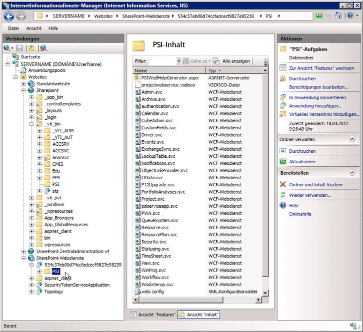

# <a name="project-psi-reference-overview"></a><span data-ttu-id="5ba95-104">Project-PSI-Referenz – Übersicht</span><span class="sxs-lookup"><span data-stu-id="5ba95-104">Project PSI reference overview</span></span>

<span data-ttu-id="5ba95-105">Project Server Interface (PSI) ist die API verwenden, für die Entwicklung von Anwendungen, die Project Server 2013 lokal zu integrieren.</span><span class="sxs-lookup"><span data-stu-id="5ba95-105">The Project Server Interface (PSI) is the API to use for developing applications that integrate with Project Server 2013 on-premises.</span></span>
  
<span data-ttu-id="5ba95-106">Dieser Artikel bietet eine Übersicht über die dokumentierte Assemblys, Namespaces und Dienste in die PSI.</span><span class="sxs-lookup"><span data-stu-id="5ba95-106">This article is an overview of the documented assemblies, namespaces, and services in the PSI.</span></span> <span data-ttu-id="5ba95-107">Die [Project Server 2013 Class Library und Web-Dienst verweisen](http://msdn.microsoft.com/library/ef1830e0-3c9a-4f98-aa0a-5556c298e7d1%28Office.15%29.aspx) im SDK enthält alle Dokumentation verwaltetem Code für die PSI und den [Microsoft.ProjectServer.Client](https://msdn.microsoft.com/library/Microsoft.ProjectServer.Client.aspx) -Namespace im Project Server 2013.</span><span class="sxs-lookup"><span data-stu-id="5ba95-107">The [Project Server 2013 class library and web service reference](http://msdn.microsoft.com/library/ef1830e0-3c9a-4f98-aa0a-5556c298e7d1%28Office.15%29.aspx) in the SDK contains all of the managed code documentation for the PSI and the [Microsoft.ProjectServer.Client](https://msdn.microsoft.com/library/Microsoft.ProjectServer.Client.aspx) namespace in Project Server 2013.</span></span> <span data-ttu-id="5ba95-108">Informationen zum Entwickeln von Anwendungen für Project Online, müssen Sie den Namespace **Microsoft.ProjectServer.Client** anstelle der PSI verwenden.</span><span class="sxs-lookup"><span data-stu-id="5ba95-108">To develop applications for Project Online, you must use the **Microsoft.ProjectServer.Client** namespace instead of the PSI.</span></span> 

<span data-ttu-id="5ba95-109">Die PSI in Project Server 2013 verfügt über eine duale Schnittstelle.</span><span class="sxs-lookup"><span data-stu-id="5ba95-109">The PSI in Project Server 2013 has a dual interface.</span></span> <span data-ttu-id="5ba95-110">Die ASMX-Interface für Webdienste durch Ermittlung definiert wird und Web Service Description Language (Disco und WSDL) Dateien in die `http://ServerName/ProjectServerName/_vti_bin/psi/` virtuelles Verzeichnis (z. B. Projectdisco.aspx und Projectwsdl.aspx).</span><span class="sxs-lookup"><span data-stu-id="5ba95-110">The ASMX interface for web services is defined by discovery and Web Service Description Language (disco and WSDL) files in the  `http://ServerName/ProjectServerName/_vti_bin/psi/` virtual directory (for example, Projectdisco.aspx and Projectwsdl.aspx).</span></span> <span data-ttu-id="5ba95-111">Sie können die ASMX-Schnittstelle zugreifen, nur über die URL einer lokalen Installation von Project Web App (z. B. `http://ServerName/ProjectServerName/_vti_bin/psi/project.asmx?wsdl)`.</span><span class="sxs-lookup"><span data-stu-id="5ba95-111">You can access the ASMX interface only through the URL of an on-premises installation of Project Web App (for example,  `http://ServerName/ProjectServerName/_vti_bin/psi/project.asmx?wsdl)`.</span></span> <span data-ttu-id="5ba95-112">Um den Webdienst in einem Browser anzuzeigen, müssen Sie enthalten die `?wsdl` URL-Option.</span><span class="sxs-lookup"><span data-stu-id="5ba95-112">To show the web service in a browser, you must include the  `?wsdl` URL option.</span></span> <span data-ttu-id="5ba95-113">Da die ASMX-Schnittstelle mit Windows Communication Foundation (WCF)-Infrastruktur erstellt wird, sind die ASMX-Dateien für Project Server-Webdienste nicht tatsächlich in das virtuelle Verzeichnis der PSI vorhanden.</span><span class="sxs-lookup"><span data-stu-id="5ba95-113">Because the ASMX interface is built using the Windows Communication Foundation (WCF) infrastructure, the .asmx files for Project Server web services do not actually exist in the virtual PSI directory.</span></span> 
  
<span data-ttu-id="5ba95-114">Die WCF-Dienste-Schnittstelle wird von SVC-Dateien in die Back-End definierten `http://ServerName:32843/GUID/PSI/` virtuelle Verzeichnis in der SharePoint-Webdienste-Anwendung.</span><span class="sxs-lookup"><span data-stu-id="5ba95-114">The WCF services interface is defined by .svc files in the back-end  `http://ServerName:32843/GUID/PSI/` virtual directory in the SharePoint Web Services application.</span></span> <span data-ttu-id="5ba95-115">Die URL der PSI-Dienste in das virtuelle Verzeichnis für Project Service-Anwendung (z. B. `http://ServerName:32843/GUID/PSI/project.svc`) enthält die SVC-Dateien.</span><span class="sxs-lookup"><span data-stu-id="5ba95-115">The URL of PSI services in the Project Service Application virtual directory (for example,  `http://ServerName:32843/GUID/PSI/project.svc`) includes the .svc files.</span></span> <span data-ttu-id="5ba95-116">Allerdings können nicht direkt verwenden Sie den Back-End-URL ein WCF-Dienstverweises festgelegt.</span><span class="sxs-lookup"><span data-stu-id="5ba95-116">But, you cannot directly use the back-end URL to set a WCF service reference.</span></span> <span data-ttu-id="5ba95-117">Informationen zum Entwickeln einer Anwendung oder Komponente, die die WCF-Dienste die PSI verwendet, können Sie eine Proxyassembly oder eine Proxydatei verwenden.</span><span class="sxs-lookup"><span data-stu-id="5ba95-117">To develop an application or component that uses the WCF services of the PSI, you can use a proxy assembly or a proxy file.</span></span> <span data-ttu-id="5ba95-118">Der Project 2013-SDK-Download enthält die Proxydateien für die WCF-Dienste in Project Server 2013 und Skripts zum Abrufen von aktualisierter WCF-Proxy-Dateien und Kompilieren die Dateien in eine Proxyassembly für neueren Project Server erstellt.</span><span class="sxs-lookup"><span data-stu-id="5ba95-118">The Project 2013 SDK download includes proxy files for the WCF services in Project Server 2013, and scripts to get updated WCF proxy files and to compile the files into a proxy assembly for more recent Project Server builds.</span></span>
  
<span data-ttu-id="5ba95-119">Der Verzeichnisname Project Service-Anwendung ist ein GUID-Wert, der die GUID der lokalen Project Web App-Instanz identisch ist.</span><span class="sxs-lookup"><span data-stu-id="5ba95-119">The Project Service Application directory name is a GUID value, which is the same as the GUID of the on-premises Project Web App instance.</span></span> <span data-ttu-id="5ba95-120">Klicken Sie im Fenster **Internetinformationsdienste (Internet Information Services, IIS)-Manager** den Knoten **SharePoint-Webdienste** , wählen Sie den Namen der GUID-Verzeichnis und wählen Sie dann auf **Erweiterte Einstellungen** , um den Wert für **Virtuelle Pfade** kopieren.</span><span class="sxs-lookup"><span data-stu-id="5ba95-120">In the **Internet Information Services (IIS) Manager** window, expand the **SharePoint Web Services** node, choose the GUID directory name, and then choose **Advanced Settings** to copy the **Virtual Path** value.</span></span> 
  
> [!IMPORTANT]
> <span data-ttu-id="5ba95-121">Die ASMX Webdienstschnittstelle für die PSI wird ist in Project Server 2013 veraltet, jedoch weiterhin unterstützt.</span><span class="sxs-lookup"><span data-stu-id="5ba95-121">The ASMX web service interface of the PSI is deprecated in Project Server 2013, but is still supported.</span></span> <span data-ttu-id="5ba95-122">Neue Applikationen sollten die WCF-Schnittstelle von der PSI oder die CSOM verwenden.</span><span class="sxs-lookup"><span data-stu-id="5ba95-122">New applications should use the WCF interface of the PSI or the CSOM.</span></span> <span data-ttu-id="5ba95-123">Weitere Informationen zu veralteten Features finden Sie unter [Updates für Entwickler in Project 2013](updates-for-developers-in-project-2013.md)</span><span class="sxs-lookup"><span data-stu-id="5ba95-123">For more information about deprecated features, see [Updates for developers in Project 2013](updates-for-developers-in-project-2013.md)</span></span>
> 
> <span data-ttu-id="5ba95-124">Neue Applikationen und Middleware-Komponenten, die nur auf einer lokalen Installation von Project Server ausgeführt werden sollten das WCF-Interface verwenden also die Technologie, die für die Netzwerkkommunikation empfohlen.</span><span class="sxs-lookup"><span data-stu-id="5ba95-124">New applications, and middleware components that run only on an on-premises installation of Project Server, should use the WCF interface, which is the technology that we recommend for network communications.</span></span> <span data-ttu-id="5ba95-125">Legacyanwendungen, die die ASMX-Interface verwenden, müssen die URL über Project Web App verwenden die Project Server-Berechtigungen überprüft.</span><span class="sxs-lookup"><span data-stu-id="5ba95-125">Legacy applications that use the ASMX interface must use the URL through Project Web App, which checks Project Server permissions.</span></span> 
> 
> <span data-ttu-id="5ba95-126">Weitere Informationen über die ASMX-Schnittstelle und wie Sie den WCF-Interface verwenden finden Sie unter [Voraussetzungen für ASMX-basierte Codebeispiele im Projekt](prerequisites-for-asmx-based-code-samples-in-project.md) und der [Voraussetzungen für WCF-basierte Codebeispiele im Projekt](prerequisites-for-wcf-based-code-samples-in-project.md).</span><span class="sxs-lookup"><span data-stu-id="5ba95-126">For more information about the ASMX interface and how to use the WCF interface, see [Prerequisites for ASMX-based code samples in Project](prerequisites-for-asmx-based-code-samples-in-project.md) and [Prerequisites for WCF-based code samples in Project](prerequisites-for-wcf-based-code-samples-in-project.md).</span></span> 
  
<span data-ttu-id="5ba95-127">Für die Entwicklung von Anwendungen, die das WCF-Interface verwenden, können Sie Visual Studio 2010 oder Visual Studio 2012.</span><span class="sxs-lookup"><span data-stu-id="5ba95-127">For developing applications that use the WCF interface, you can use Visual Studio 2010 or Visual Studio 2012.</span></span> <span data-ttu-id="5ba95-128">Für deklarative Workflows für Project Server erstellen, können Sie SharePoint Designer 2013.</span><span class="sxs-lookup"><span data-stu-id="5ba95-128">For creating declarative Project Server workflows, you can use SharePoint Designer 2013.</span></span> <span data-ttu-id="5ba95-129">Project Server-Workflows, die benötigt Zugriff auf die PSI oder dem Clientobjektmodell können mit Visual Studio 2012 entwickelt werden.</span><span class="sxs-lookup"><span data-stu-id="5ba95-129">Project Server workflows that require access to the PSI or the CSOM can be developed with Visual Studio 2012.</span></span>
  
### <a name="using-the-psi-reference"></a><span data-ttu-id="5ba95-130">Verwenden die PSI-Referenz</span><span class="sxs-lookup"><span data-stu-id="5ba95-130">Using the PSI reference</span></span>
<span data-ttu-id="5ba95-131"><a name="pj15_PSIRefOverview_Using"> </a></span><span class="sxs-lookup"><span data-stu-id="5ba95-131"></span></span>

<span data-ttu-id="5ba95-132">Das PSI-Objektmodell groß ist und viele Klassen und Member sind nur zur internen Verwendung.</span><span class="sxs-lookup"><span data-stu-id="5ba95-132">The PSI object model is large, and many classes and members are for internal use only.</span></span> <span data-ttu-id="5ba95-133">Daher kann es sein, erhalten in den Themen, die Sie möchten in der [Project Server 2013 Class Library und Web-Dienstverweises](http://msdn.microsoft.com/library/ef1830e0-3c9a-4f98-aa0a-5556c298e7d1%28Office.15%29.aspx)verwirrend.</span><span class="sxs-lookup"><span data-stu-id="5ba95-133">As a result, it can be confusing to find the topics that you want in the [Project Server 2013 class library and web service reference](http://msdn.microsoft.com/library/ef1830e0-3c9a-4f98-aa0a-5556c298e7d1%28Office.15%29.aspx).</span></span> <span data-ttu-id="5ba95-134">Die meisten den Referenzthemen, die Sie für die Entwicklung verwenden, sind in der folgenden Gruppen:</span><span class="sxs-lookup"><span data-stu-id="5ba95-134">Most of the reference topics that you will use for development are in the following groups:</span></span>
  
- <span data-ttu-id="5ba95-135">**Primäre Klassenmethoden:** Jeder Dienst in die PSI enthält eine primäre Klasse mit dem Namen für den Namen des Diensts.</span><span class="sxs-lookup"><span data-stu-id="5ba95-135">**Primary class methods:** Each service in the PSI includes a primary class that is named for the name of the service.</span></span> <span data-ttu-id="5ba95-136">Beispielsweise enthält der Dienst für die **Ressource** die [Ressource](https://msdn.microsoft.com/library/WebSvcResource.Resource.aspx) -Klasse, die im Namespace [WebSvcResource](https://msdn.microsoft.com/library/WebSvcResource.aspx) ist.</span><span class="sxs-lookup"><span data-stu-id="5ba95-136">For example, the **Resource** service contains the [Resource](https://msdn.microsoft.com/library/WebSvcResource.Resource.aspx) class, which is in the [WebSvcResource](https://msdn.microsoft.com/library/WebSvcResource.aspx) namespace.</span></span> <span data-ttu-id="5ba95-137">Um eine Liste der Methoden anzuzeigen, die in der Klasse **Ressource** verfügbar sind, erweitern Sie den Klassenknoten in den Bereich Inhalte, und wählen Sie dann das **Ressourcenmethoden** Thema.</span><span class="sxs-lookup"><span data-stu-id="5ba95-137">To see a list of the methods that are available in the **Resource** class, expand the class node in the content pane, and then choose the **Resource Methods** topic.</span></span> 
    
- <span data-ttu-id="5ba95-138">**DataRow-Eigenschaften:** Viele der primäre Klassenmethoden verwenden oder eines **Datasets**zurück.</span><span class="sxs-lookup"><span data-stu-id="5ba95-138">**DataRow properties:** Many of the primary class methods use or return a **DataSet**.</span></span> <span data-ttu-id="5ba95-139">Jedes **DataTable** -Objekt in einem **DataSet** enthält Daten in einem oder mehreren **DataRow** -Objekten.</span><span class="sxs-lookup"><span data-stu-id="5ba95-139">Each **DataTable** object in a **DataSet** contains data in one or more **DataRow** objects.</span></span> <span data-ttu-id="5ba95-140">In den meisten Fällen müssen Sie nur die Eigenschaften der Zeile, nicht aller anderen Member der Klassen **DataSet**, **DataTable**oder **DataRow** finden Sie unter.</span><span class="sxs-lookup"><span data-stu-id="5ba95-140">In most cases, you need to see only the row properties, not all of the other members of the **DataSet**, **DataTable**, or **DataRow** classes.</span></span> <span data-ttu-id="5ba95-141">Beispielsweise enthält die **ResourceAssignmentDataSet** -Klasse Unterklassen für die **ResourceAssignmentDataTable** und die [ResourceAssignmentDataSet.ResourceAssignmentRow](https://msdn.microsoft.com/library/WebSvcResource.ResourceAssignmentDataSet.ResourceAssignmentRow.aspx) -Klasse.</span><span class="sxs-lookup"><span data-stu-id="5ba95-141">For example, the **ResourceAssignmentDataSet** class includes subclasses for the **ResourceAssignmentDataTable** and the [ResourceAssignmentDataSet.ResourceAssignmentRow](https://msdn.microsoft.com/library/WebSvcResource.ResourceAssignmentDataSet.ResourceAssignmentRow.aspx) class.</span></span> <span data-ttu-id="5ba95-142">Um eine Liste der Eigenschaften anzuzeigen, die in der **ResourceAssignmentRow** -Klasse sind, erweitern Sie den Klassenknoten in den Bereich Inhalte, und wählen Sie dann das Thema **ResourceAssignmentDataSet.ResourceAssignmentRow Eigenschaften** .</span><span class="sxs-lookup"><span data-stu-id="5ba95-142">To see a list of properties that are in the **ResourceAssignmentRow** class, expand the class node in the content pane, and then choose the **ResourceAssignmentDataSet.ResourceAssignmentRow Properties** topic.</span></span> 
    
<span data-ttu-id="5ba95-143">Zusätzlich zu den Namespaces Service lokaler [Project Server 2013 Class Library und Web-Dienst verweisen](http://msdn.microsoft.com/library/ef1830e0-3c9a-4f98-aa0a-5556c298e7d1%28Office.15%29.aspx) Thema verweist auf die drei Project Server-Assemblys, die bei der Entwicklung von Lösungen für Drittanbieter-verwendet werden Installationen.</span><span class="sxs-lookup"><span data-stu-id="5ba95-143">In addition to the service namespaces, the [Project Server 2013 class library and web service reference](http://msdn.microsoft.com/library/ef1830e0-3c9a-4f98-aa0a-5556c298e7d1%28Office.15%29.aspx) topic links to the three Project Server assemblies that are used in development of third-party solutions for on-premises installations.</span></span> <span data-ttu-id="5ba95-144">Wir stellen nur minimale Dokumentation für diese Assemblys.</span><span class="sxs-lookup"><span data-stu-id="5ba95-144">We provide only minimal documentation for these assemblies.</span></span> <span data-ttu-id="5ba95-145">Die PSI-Referenz wird die wichtigsten Klassen und Member in der 23 öffentlichen Diensten dokumentiert.</span><span class="sxs-lookup"><span data-stu-id="5ba95-145">The PSI reference documents the main classes and members in the 23 public services.</span></span> <span data-ttu-id="5ba95-146">Sechs PSI-Dienste sind nur zur internen Verwendung und sind nicht dokumentiert.</span><span class="sxs-lookup"><span data-stu-id="5ba95-146">Six PSI services are for internal use only, and are not documented.</span></span> 
  
> [!NOTE]
> <span data-ttu-id="5ba95-147">Klassen im Client-seitigen Objektmodell (CSOM) können unabhängig von anderen Assemblys für Project Server und Dienste verwendet werden.</span><span class="sxs-lookup"><span data-stu-id="5ba95-147">Classes in the client-side object model (CSOM) can be used independently from the other Project Server assemblies and services.</span></span> <span data-ttu-id="5ba95-148">Sie können den **Microsoft.ProjectServer.Client** -Namespace in einer remote-Entwicklungsumgebung aus der Project Server-Computer verwenden und Entwickeln von apps, die mit Project Online oder mit einer lokalen Installation von Project Server zu integrieren.</span><span class="sxs-lookup"><span data-stu-id="5ba95-148">You can use the **Microsoft.ProjectServer.Client** namespace in a remote development environment from the Project Server computer, and develop apps that integrate with Project Online or with an on-premises installation of Project Server.</span></span> <span data-ttu-id="5ba95-149">Aber das CSOM enthält eine Teilmenge der Funktionalität von die vollständige PSI.</span><span class="sxs-lookup"><span data-stu-id="5ba95-149">But, the CSOM contains a subset of the functionality of the complete PSI.</span></span> <span data-ttu-id="5ba95-150">Das CSOM ermöglicht die Entwicklung der gängigsten Szenarien für Project Server-Integration.</span><span class="sxs-lookup"><span data-stu-id="5ba95-150">The CSOM enables development of the most common scenarios for Project Server integration.</span></span> <span data-ttu-id="5ba95-151">Weitere Informationen finden Sie unter [Was das CSOM ist und nicht zu](what-the-csom-does-and-does-not-do.md) und [Microsoft.ProjectServer.Client](https://msdn.microsoft.com/library/Microsoft.ProjectServer.Client.aspx) .</span><span class="sxs-lookup"><span data-stu-id="5ba95-151">For more information, see [What the CSOM does and does not do](what-the-csom-does-and-does-not-do.md) and [Microsoft.ProjectServer.Client](https://msdn.microsoft.com/library/Microsoft.ProjectServer.Client.aspx) .</span></span> 
  
<span data-ttu-id="5ba95-152">Für die Entwicklung von den meisten Clientanwendungen, die die PSI verwenden, müssen Sie nicht auf einem Project Server-Computer entwickeln, oder legen Sie Verweise auf Project Server-Assemblys im globalen Assemblycache.</span><span class="sxs-lookup"><span data-stu-id="5ba95-152">For development of most applications that use the PSI, you do not have to develop on a Project Server computer, or set references to Project Server assemblies in the global assembly cache.</span></span> <span data-ttu-id="5ba95-153">Sie können die erforderlichen Project Server-Assemblys auf Ihrem Entwicklungscomputer kopieren.</span><span class="sxs-lookup"><span data-stu-id="5ba95-153">You can copy the necessary Project Server assemblies to your development computer.</span></span> <span data-ttu-id="5ba95-154">Projektserver 2013 installiert die folgenden Assemblys im _[Program Files]_ `\Microsoft Office Servers\15.0\Bin`:</span><span class="sxs-lookup"><span data-stu-id="5ba95-154">Project Server 2013 installs the following assemblies in  _[Program Files]_ `\Microsoft Office Servers\15.0\Bin`:</span></span> 
  
- <span data-ttu-id="5ba95-155">Microsoft.Office.Project.Server.Events.Receivers.dll</span><span class="sxs-lookup"><span data-stu-id="5ba95-155">Microsoft.Office.Project.Server.Events.Receivers.dll</span></span> 
- <span data-ttu-id="5ba95-156">Microsoft.Office.Project.Server.Library.dll</span><span class="sxs-lookup"><span data-stu-id="5ba95-156">Microsoft.Office.Project.Server.Library.dll</span></span>
- <span data-ttu-id="5ba95-157">Microsoft.Office.Project.Server.Workflow.dll</span><span class="sxs-lookup"><span data-stu-id="5ba95-157">Microsoft.Office.Project.Server.Workflow.dll</span></span>
    
<span data-ttu-id="5ba95-158">Namespaces für die PSI-Dienste sind beliebige Namen erstellt bei einer PSI-Proxyassembly ProjectServerServices.dll, die für die Dokumentation generiert wird.</span><span class="sxs-lookup"><span data-stu-id="5ba95-158">Namespaces for the PSI services have arbitrary names created for a PSI proxy assembly, ProjectServerServices.dll, which is generated for the purpose of documentation.</span></span> <span data-ttu-id="5ba95-159">In der Referenz PSI hat jeder Dienstnamespace ein Platzhaltername (beispielsweise _[Project-Webdienst]_) und einen Webverweis (z. B. `http://ServerName/ProjectServerName/_vti_bin/psi/Project.asmx?wsdl`).</span><span class="sxs-lookup"><span data-stu-id="5ba95-159">In the PSI reference, each service namespace has a placeholder name (such as  _[Project web service]_) and a web reference (such as  `http://ServerName/ProjectServerName/_vti_bin/psi/Project.asmx?wsdl`).</span></span> 
  
## <a name="project-server-assemblies-and-namespaces"></a><span data-ttu-id="5ba95-160">Project Server-Assemblys und -Namespaces</span><span class="sxs-lookup"><span data-stu-id="5ba95-160">Project Server assemblies and namespaces</span></span>
<span data-ttu-id="5ba95-161"><a name="pj15_PSIRefOverview_Assemblies"> </a></span><span class="sxs-lookup"><span data-stu-id="5ba95-161"></span></span>

<span data-ttu-id="5ba95-162">Viele Assemblys werden bei der Installation von Project Server installiert. der Project Server-Assemblys nur vier dokumentiert sind.</span><span class="sxs-lookup"><span data-stu-id="5ba95-162">Many assemblies are installed when you install Project Server; only four of the Project Server assemblies are documented.</span></span> <span data-ttu-id="5ba95-163">Drittanbieter-Entwickler verwenden in der Regel nur ein paar Klassen und Member in diesen Assemblies.</span><span class="sxs-lookup"><span data-stu-id="5ba95-163">Third-party developers generally use only a few classes and members in those assemblies.</span></span> <span data-ttu-id="5ba95-164">Nicht dokumentierte Project Server-Assemblys enthalten, Namespaces und Klassen, die Project Server wie Klassen für Project Web App, die Geschäftseinheiten, intern verwendet und die Daten der Datenzugriffsschicht (DAL).</span><span class="sxs-lookup"><span data-stu-id="5ba95-164">The undocumented Project Server assemblies include namespaces and classes that Project Server uses internally, such as classes for Project Web App, the business entities, and the data access layer (DAL).</span></span> <span data-ttu-id="5ba95-165">Wenn Sie einen Verweis auf eine der dokumentierten Project Server-Assemblys in Visual Studio festlegen, können Sie alle Namespaces, Klassen und Member in den Visual Studio-Objektbrowser angezeigt.</span><span class="sxs-lookup"><span data-stu-id="5ba95-165">When you set a reference in Visual Studio to one of the documented Project Server assemblies, you can see all of the namespaces, classes, and members in the Visual Studio Object Browser.</span></span>
  
> [!NOTE]
> <span data-ttu-id="5ba95-166">Viele Member der dokumentierten Project Server-Namespace werden nur intern verwendet und sind nur minimal dokumentiert.</span><span class="sxs-lookup"><span data-stu-id="5ba95-166">Many members of the documented Project Server namespaces are used only internally and have minimal documentation.</span></span> 
  
<span data-ttu-id="5ba95-167">Bei der Entwicklung für Project Online können Sie nur das CSOM, Zugriff auf Project Server-Funktionen.</span><span class="sxs-lookup"><span data-stu-id="5ba95-167">When developing for Project Online, you can use only the CSOM to access Project Server functionality.</span></span> <span data-ttu-id="5ba95-168">Sie können nicht auf der PSI-Dienste oder andere Assemblys Project Server zugreifen.</span><span class="sxs-lookup"><span data-stu-id="5ba95-168">You do not have access to the PSI services or the other Project Server assemblies.</span></span>
  
<span data-ttu-id="5ba95-169">Die [Project Server 2013 Class Library und Web-Dienst verweisen](http://msdn.microsoft.com/library/ef1830e0-3c9a-4f98-aa0a-5556c298e7d1%28Office.15%29.aspx) für die PSI enthält Namespaces aus den folgenden Assemblys:</span><span class="sxs-lookup"><span data-stu-id="5ba95-169">The [Project Server 2013 class library and web service reference](http://msdn.microsoft.com/library/ef1830e0-3c9a-4f98-aa0a-5556c298e7d1%28Office.15%29.aspx) for the PSI includes namespaces from the following assemblies:</span></span> 
  
- <span data-ttu-id="5ba95-170">**Microsoft.Office.Project.Server.Library.dll** diese Assembly enthält einen dokumentierten Namespace und drei Namespaces nicht dokumentiert, wie folgt:</span><span class="sxs-lookup"><span data-stu-id="5ba95-170">**Microsoft.Office.Project.Server.Library.dll** This assembly contains one documented namespace and three undocumented namespaces, as follows:</span></span> 
    
  - <span data-ttu-id="5ba95-171">Der [Microsoft.Office.Project.Server.Library](https://msdn.microsoft.com/library/Microsoft.Office.Project.Server.Library.aspx) -Namespace enthält viele Enumerationen und Klassenfelder und Eigenschaften, die häufig verwendet werden, in lokalen Anwendungen für Project Server.</span><span class="sxs-lookup"><span data-stu-id="5ba95-171">The [Microsoft.Office.Project.Server.Library](https://msdn.microsoft.com/library/Microsoft.Office.Project.Server.Library.aspx) namespace includes many enumerations, and class fields and properties that are frequently used in on-premises applications for Project Server.</span></span> <span data-ttu-id="5ba95-172">Normalerweise verwenden Entwickler beispielsweise Enumerationen wie **CustomField.Type**und die Klassen **PSClientError**, **PSErrorInfo**und **Filter** .</span><span class="sxs-lookup"><span data-stu-id="5ba95-172">For example, developers typically use enumerations such as **CustomField.Type**, and the **PSClientError**, **PSErrorInfo**, and **Filter** classes.</span></span> 
    
    <span data-ttu-id="5ba95-173">Der **Microsoft.Office.Project.Server.Library**-Namespace enthält auch die folgenden sieben Eigenschaftsklassen, die über 3.200 Unterklassen umfassen:</span><span class="sxs-lookup"><span data-stu-id="5ba95-173">The **Microsoft.Office.Project.Server.Library** namespace also includes the following seven property classes, which include over 3,200 subclasses:</span></span> 
    
      - <span data-ttu-id="5ba95-174">**AssignmentProperties**</span><span class="sxs-lookup"><span data-stu-id="5ba95-174">**AssignmentProperties**</span></span>  
      - <span data-ttu-id="5ba95-175">**CalendarProperties**</span><span class="sxs-lookup"><span data-stu-id="5ba95-175">**CalendarProperties**</span></span>
      - <span data-ttu-id="5ba95-176">**ConstraintProperties**</span><span class="sxs-lookup"><span data-stu-id="5ba95-176">**ConstraintProperties**</span></span>
      - <span data-ttu-id="5ba95-177">**LookupTableProperties**</span><span class="sxs-lookup"><span data-stu-id="5ba95-177">**LookupTableProperties**</span></span>
      - <span data-ttu-id="5ba95-178">**ProjectProperties**</span><span class="sxs-lookup"><span data-stu-id="5ba95-178">**ProjectProperties**</span></span>
      - <span data-ttu-id="5ba95-179">**ResourceProperties**</span><span class="sxs-lookup"><span data-stu-id="5ba95-179">**ResourceProperties**</span></span>
      - <span data-ttu-id="5ba95-180">**TaskProperties**</span><span class="sxs-lookup"><span data-stu-id="5ba95-180">**TaskProperties**</span></span>
    
    <span data-ttu-id="5ba95-181">Die Eigenschaftenklassen intern verwendet werden und sind nicht dokumentiert.</span><span class="sxs-lookup"><span data-stu-id="5ba95-181">The property classes are used internally and are not documented.</span></span> <span data-ttu-id="5ba95-182">Die Eigenschaftenklassen sind für die Serialisierung zwischen Project Professional 2013 und Project Server verwendet.</span><span class="sxs-lookup"><span data-stu-id="5ba95-182">The property classes are used for serialization between Project Professional 2013 and Project Server.</span></span> <span data-ttu-id="5ba95-183">Beim Arbeiten mit dem **Microsoft.Office.Project.Server.Library** -Namespace in Visual Studio zeigt den Objektkatalog alle die Eigenschaftenklassen, die erschwert Klassen suchen, die für die Entwicklung von Drittanbieter-nützlich sind.</span><span class="sxs-lookup"><span data-stu-id="5ba95-183">When you work with the **Microsoft.Office.Project.Server.Library** namespace in Visual Studio, the Object Browser shows all of the property classes, which makes it more difficult to find classes that are useful for third-party development.</span></span> <span data-ttu-id="5ba95-184">Da Drittentwickler der Eigenschaft Klassen nicht verfügen, werden Sie von das SDK nicht dokumentiert.</span><span class="sxs-lookup"><span data-stu-id="5ba95-184">Because third-party developers do not have to use the property classes, the SDK does not document them.</span></span> 
    
  - <span data-ttu-id="5ba95-185">**Microsoft.Office.Project.Server.DataServices** die Klassen und Member dieses Namespaces werden intern von der **OData** -Diensts in Project Online für den Zugriff auf die Berichten Tabellen in der Project-Datenbank verwendet.</span><span class="sxs-lookup"><span data-stu-id="5ba95-185">**Microsoft.Office.Project.Server.DataServices** The classes and members of this namespace are used internally by the **OData** service in Project Online for access to the reporting tables in the Project database.</span></span> <span data-ttu-id="5ba95-186">Die Klassen, die **DataServices** sind nicht dokumentiert.</span><span class="sxs-lookup"><span data-stu-id="5ba95-186">The **DataServices** classes are not documented.</span></span> 
    
  - <span data-ttu-id="5ba95-187">**Microsoft.Office.Project.Server.Administration** der Klasse und Member dieses Namespaces sind für die diagnoseprotokollierung intern verwendet, und sind nicht dokumentiert.</span><span class="sxs-lookup"><span data-stu-id="5ba95-187">**Microsoft.Office.Project.Server.Administration** The class and members of this namespace are used internally for diagnostic logging, and are not documented.</span></span> 
    
  - <span data-ttu-id="5ba95-188">**Microsoft.Office.Project.Server.Base** die Klassen und Member dieses Namespaces intern als Basisklassen verwendet werden und sind nicht dokumentiert.</span><span class="sxs-lookup"><span data-stu-id="5ba95-188">**Microsoft.Office.Project.Server.Base** The classes and members of this namespace are used internally as base classes and are not documented.</span></span> 
    
  - <span data-ttu-id="5ba95-189">**Microsoft.Office.Project.Server.Library.FilterSchema** dieser Namespace wird zum Generieren von Filter-Schemas intern verwendet und ist nicht dokumentiert.</span><span class="sxs-lookup"><span data-stu-id="5ba95-189">**Microsoft.Office.Project.Server.Library.FilterSchema** This namespace is used internally to generate filter schemas and is not documented.</span></span> 
    
- <span data-ttu-id="5ba95-190">**Microsoft.Office.Project.Server.Workflow.dll** diese Assembly ist für legacy Project Server 2010-Workflows verwendet, die in Project Server 2013 funktionieren kann.</span><span class="sxs-lookup"><span data-stu-id="5ba95-190">**Microsoft.Office.Project.Server.Workflow.dll** This assembly is used for legacy Project Server 2010 workflows that can still work in Project Server 2013.</span></span> <span data-ttu-id="5ba95-191">Für das neue Workflows erstellen, sollten Sie SharePoint Designer 2013 verwenden, oder Sie können auch die Visual Studio 2012 verwenden, mit der [Microsoft.ProjectServer.Client.WorkflowActivities](https://msdn.microsoft.com/library/Microsoft.ProjectServer.Client.WorkflowActivities.aspx) -Klasse.</span><span class="sxs-lookup"><span data-stu-id="5ba95-191">For creating new workflows, you should use SharePoint Designer 2013, or you can also use Visual Studio 2012 with the [Microsoft.ProjectServer.Client.WorkflowActivities](https://msdn.microsoft.com/library/Microsoft.ProjectServer.Client.WorkflowActivities.aspx) class.</span></span> <span data-ttu-id="5ba95-192">Die Assembly Microsoft.Office.Project.Server.Workflow.dll umfasst die folgenden drei Namespaces hinzu:</span><span class="sxs-lookup"><span data-stu-id="5ba95-192">The Microsoft.Office.Project.Server.Workflow.dll assembly includes the following three namespaces:</span></span> 
    
  - <span data-ttu-id="5ba95-193">[Microsoft.Office.Project.Server.Workflow](https://msdn.microsoft.com/library/Microsoft.Office.Project.Server.Workflow.aspx) dieser Namespace enthält Klassen, die für Project Server-Workflow-Aktivitäten verwendet werden.</span><span class="sxs-lookup"><span data-stu-id="5ba95-193">[Microsoft.Office.Project.Server.Workflow](https://msdn.microsoft.com/library/Microsoft.Office.Project.Server.Workflow.aspx) This namespace includes classes that are used for Project Server workflow activities.</span></span> <span data-ttu-id="5ba95-194">Aktivitäten umfassen lesen, vergleichen und Aktualisieren der Projekteigenschaften.</span><span class="sxs-lookup"><span data-stu-id="5ba95-194">Activities include reading, comparing, and updating project properties.</span></span> <span data-ttu-id="5ba95-195">Andere Klassen Verwalten von Workflows und Workflow-Rückrufe enthalten, wenn Projekte geändert werden.</span><span class="sxs-lookup"><span data-stu-id="5ba95-195">Other classes manage workflows and include workflow call-backs when projects are changed.</span></span> 
    
  - <span data-ttu-id="5ba95-196">**Microsoft.Office.Project.PWA** dieser Namespace enthält einen internen Proxy für die PSI, für die Verwendung mit Project Web App und benutzerdefinierte Workflowaktivitäten; Es ist nicht dokumentiert.</span><span class="sxs-lookup"><span data-stu-id="5ba95-196">**Microsoft.Office.Project.PWA** This namespace includes an internal proxy for the PSI, for use with Project Web App and with custom workflow activities; it is not documented.</span></span> 
    
    <span data-ttu-id="5ba95-197">Eine benutzerdefinierten Workflowaktivität erfordert einen Verweis auf **Microsoft.Office.Project.PWA** auf alle Klassen in der PSI-Dienste zugreifen.</span><span class="sxs-lookup"><span data-stu-id="5ba95-197">A custom workflow activity requires a reference to **Microsoft.Office.Project.PWA** to access all of the classes in the PSI services.</span></span> <span data-ttu-id="5ba95-198">Beispielsweise enthält die **Microsoft.Office.Project.PWA.PSI** -Klasse die **ProjectWebService** -Eigenschaft, die einen Proxy für den Namespace [WebSvcProject](https://msdn.microsoft.com/library/WebSvcProject.aspx) fungiert.</span><span class="sxs-lookup"><span data-stu-id="5ba95-198">For example, the **Microsoft.Office.Project.PWA.PSI** class includes the **ProjectWebService** property, which gets a proxy for the [WebSvcProject](https://msdn.microsoft.com/library/WebSvcProject.aspx) namespace.</span></span> 
    
  - <span data-ttu-id="5ba95-199">**Microsoft.Office.Project.Server.WebServiceProxy** dieser Namespace enthält interne Proxyklassen für die primäre Klasse in jedem PSI-Dienst.</span><span class="sxs-lookup"><span data-stu-id="5ba95-199">**Microsoft.Office.Project.Server.WebServiceProxy** This namespace includes internal proxy classes for the primary class in each PSI service.</span></span> <span data-ttu-id="5ba95-200">Mithilfe der erweiterten Berechtigungen des Benutzers Workflow kann der Workflow über Proxyklassen PSI-Methoden aufrufen.</span><span class="sxs-lookup"><span data-stu-id="5ba95-200">By using the elevated permissions of the workflow user, the workflow can call PSI methods through proxy classes.</span></span> <span data-ttu-id="5ba95-201">Die Proxyklassen sind nicht dokumentiert.</span><span class="sxs-lookup"><span data-stu-id="5ba95-201">The proxy classes are not documented.</span></span> 
    
- <span data-ttu-id="5ba95-202">**Microsoft.Office.Project.Server.Events.Receivers.dll** [Microsoft.Office.Project.Server.Events](https://msdn.microsoft.com/library/Microsoft.Office.Project.Server.Events.aspx) ist der einzige Namespace in dieser Assembly.</span><span class="sxs-lookup"><span data-stu-id="5ba95-202">**Microsoft.Office.Project.Server.Events.Receivers.dll**[Microsoft.Office.Project.Server.Events](https://msdn.microsoft.com/library/Microsoft.Office.Project.Server.Events.aspx) is the only namespace in this assembly.</span></span> <span data-ttu-id="5ba95-203">Sie umfasst Ereignisempfänger und -Argument Ereignisklassen für die PSI-Dienste und andere internen Klassen.</span><span class="sxs-lookup"><span data-stu-id="5ba95-203">It includes event receiver and event argument classes for the PSI services and other internal classes.</span></span> 
    
  <span data-ttu-id="5ba95-p125">Entwickler schreiben Ereignishandler, die sich aus den Ereignisempfängerklassen ableiten. Die meisten der primären Klassen in den PSI-Diensten verfügen über eine entsprechende Ereignisempfängerklasse. Beispielsweise enthält die Klasse **ProjectEventReceiver** Pre-Event- und Post-Event-Empfängermethoden, die den Methoden in der **Project**-Klasse in der PSI entsprechen. Die Methode **OnCreating** und die Methode **OnCreated** sind Pre-Event- und Post-Event-Empfängermethoden für die **QueueCreateProject**-Methode.</span><span class="sxs-lookup"><span data-stu-id="5ba95-p125">Developers write event handlers that derive from event receiver classes. Most of the primary classes in the PSI services have a corresponding event receiver class. For example, the **ProjectEventReceiver** class contains pre-event and post-event receiver methods that correspond to methods in the **Project** class in the PSI. The **OnCreating** method and the **OnCreated** method are the pre-event and post-event receiver methods for the **QueueCreateProject** method.</span></span> 
    
  <span data-ttu-id="5ba95-208">Entwickler verwenden für gewöhnlich die folgenden Ereignisempfängerklassen:</span><span class="sxs-lookup"><span data-stu-id="5ba95-208">Developers typically use the following event receiver classes:</span></span>
  <br/>  
  - [<span data-ttu-id="5ba95-209">AdminEventReceiver</span><span class="sxs-lookup"><span data-stu-id="5ba95-209">AdminEventReceiver</span></span>](https://msdn.microsoft.com/library/Microsoft.Office.Project.Server.Events.AdminEventReceiver.aspx)
  - [<span data-ttu-id="5ba95-210">CalendarEventReceiver</span><span class="sxs-lookup"><span data-stu-id="5ba95-210">CalendarEventReceiver</span></span>](https://msdn.microsoft.com/library/Microsoft.Office.Project.Server.Events.CalendarEventReceiver.aspx)
  - [<span data-ttu-id="5ba95-211">CubeAdminEventReceiver</span><span class="sxs-lookup"><span data-stu-id="5ba95-211">CubeAdminEventReceiver</span></span>](https://msdn.microsoft.com/library/Microsoft.Office.Project.Server.Events.CubeAdminEventReceiver.aspx)
  - [<span data-ttu-id="5ba95-212">CustomFieldsEventReceiver</span><span class="sxs-lookup"><span data-stu-id="5ba95-212">CustomFieldsEventReceiver</span></span>](https://msdn.microsoft.com/library/Microsoft.Office.Project.Server.Events.CustomFieldsEventReceiver.aspx)
  - [<span data-ttu-id="5ba95-213">LookupTableEventReceiver</span><span class="sxs-lookup"><span data-stu-id="5ba95-213">LookupTableEventReceiver</span></span>](https://msdn.microsoft.com/library/Microsoft.Office.Project.Server.Events.LookupTableEventReceiver.aspx)
  - [<span data-ttu-id="5ba95-214">ProjectEventReceiver</span><span class="sxs-lookup"><span data-stu-id="5ba95-214">ProjectEventReceiver</span></span>](https://msdn.microsoft.com/library/Microsoft.Office.Project.Server.Events.ProjectEventReceiver.aspx)
  - [<span data-ttu-id="5ba95-215">OptimizerEventReceiver</span><span class="sxs-lookup"><span data-stu-id="5ba95-215">OptimizerEventReceiver</span></span>](https://msdn.microsoft.com/library/Microsoft.Office.Project.Server.Events.OptimizerEventReceiver.aspx)
  - [<span data-ttu-id="5ba95-216">ReportingEventReceiver</span><span class="sxs-lookup"><span data-stu-id="5ba95-216">ReportingEventReceiver</span></span>](https://msdn.microsoft.com/library/Microsoft.Office.Project.Server.Events.ReportingEventReceiver.aspx)
  - [<span data-ttu-id="5ba95-217">ResourceEventReceiver</span><span class="sxs-lookup"><span data-stu-id="5ba95-217">ResourceEventReceiver</span></span>](https://msdn.microsoft.com/library/Microsoft.Office.Project.Server.Events.ResourceEventReceiver.aspx)
  - [<span data-ttu-id="5ba95-218">SecurityEventReceiver</span><span class="sxs-lookup"><span data-stu-id="5ba95-218">SecurityEventReceiver</span></span>](https://msdn.microsoft.com/library/Microsoft.Office.Project.Server.Events.SecurityEventReceiver.aspx)
  - [<span data-ttu-id="5ba95-219">StatusingEventReceiver</span><span class="sxs-lookup"><span data-stu-id="5ba95-219">StatusingEventReceiver</span></span>](https://msdn.microsoft.com/library/Microsoft.Office.Project.Server.Events.StatusingEventReceiver.aspx)
  - [<span data-ttu-id="5ba95-220">TimesheetEventReceiver</span><span class="sxs-lookup"><span data-stu-id="5ba95-220">TimesheetEventReceiver</span></span>](https://msdn.microsoft.com/library/Microsoft.Office.Project.Server.Events.TimesheetEventReceiver.aspx)
  - [<span data-ttu-id="5ba95-221">UserDelegationEventReceiver</span><span class="sxs-lookup"><span data-stu-id="5ba95-221">UserDelegationEventReceiver</span></span>](https://msdn.microsoft.com/library/Microsoft.Office.Project.Server.Events.UserDelegationEventReceiver.aspx)
  - [<span data-ttu-id="5ba95-222">WorkflowEventReceiver</span><span class="sxs-lookup"><span data-stu-id="5ba95-222">WorkflowEventReceiver</span></span>](https://msdn.microsoft.com/library/Microsoft.Office.Project.Server.Events.WorkflowEventReceiver.aspx)
  - [<span data-ttu-id="5ba95-223">WssInteropEventReceiver</span><span class="sxs-lookup"><span data-stu-id="5ba95-223">WssInteropEventReceiver</span></span>](https://msdn.microsoft.com/library/Microsoft.Office.Project.Server.Events.WssInteropEventReceiver.aspx)
    
  <span data-ttu-id="5ba95-224">Die **RulesEventReceiver** -Klasse und die **StatusReportsEventReceiver** -Klasse werden in Project Web App intern verwendet.</span><span class="sxs-lookup"><span data-stu-id="5ba95-224">The **RulesEventReceiver** class and the **StatusReportsEventReceiver** class are used internally in Project Web App.</span></span> 
    
- <span data-ttu-id="5ba95-225">**Microsoft.ProjectServer.Client.dll** diese Assembly enthält das CSOM für die Entwicklung mit .NET Framework 4.</span><span class="sxs-lookup"><span data-stu-id="5ba95-225">**Microsoft.ProjectServer.Client.dll** This assembly contains the CSOM for development with the .NET Framework 4.</span></span> <span data-ttu-id="5ba95-226">Die Assembly befindet sich im `%ProgramFiles%\Common Files\Microsoft Shared\Web Server Extensions\15\ISAPI\Microsoft.ProjectServer.Client.dll`.</span><span class="sxs-lookup"><span data-stu-id="5ba95-226">The assembly is located in  `%ProgramFiles%\Common Files\Microsoft Shared\Web Server Extensions\15\ISAPI\Microsoft.ProjectServer.Client.dll`.</span></span> <span data-ttu-id="5ba95-227">Entwicklung von apps mit dem **Microsoft.ProjectServer.Client** -Namespace ist unabhängig von der lokalen Project Server-APIs und Dienste, obwohl die apps, mit einem lokalen arbeiten können oder online-Installation von Project Server.</span><span class="sxs-lookup"><span data-stu-id="5ba95-227">Development of apps with the **Microsoft.ProjectServer.Client** namespace is independent of the on-premises Project Server APIs and services, although the apps can work with either an on-premises or online installation of Project Server.</span></span> <span data-ttu-id="5ba95-228">Verwandte CSOM-Assemblys, die mit Web-apps für Windows Phone 8, Microsoft Silverlight oder JavaScript verwendet werden können, finden Sie unter [Microsoft.ProjectServer.Client](https://msdn.microsoft.com/library/Microsoft.ProjectServer.Client.aspx) .</span><span class="sxs-lookup"><span data-stu-id="5ba95-228">For related CSOM assemblies that can be used for Windows Phone 8, Microsoft Silverlight, or JavaScript with web apps, see [Microsoft.ProjectServer.Client](https://msdn.microsoft.com/library/Microsoft.ProjectServer.Client.aspx) .</span></span> 
    
- <span data-ttu-id="5ba95-229">**Microsoft.Office.Project.Server.Schema.dll** The Project 2013-SDK werden den **Microsoft.Office.Project.Server.Schema** -Namespace, der in ist nicht dokumentiert die `[Windows]\Microsoft.NET\assembly\GAC_MSIL\Microsoft.Office.Project.Schema\v4.0_15.0.0.0__71e9bce111e9429c\Microsoft.Office.Project.Schema.dll` Assembly.</span><span class="sxs-lookup"><span data-stu-id="5ba95-229">**Microsoft.Office.Project.Server.Schema.dll** The Project 2013 SDK does not document the **Microsoft.Office.Project.Server.Schema** namespace, which is in the  `[Windows]\Microsoft.NET\assembly\GAC_MSIL\Microsoft.Office.Project.Schema\v4.0_15.0.0.0__71e9bce111e9429c\Microsoft.Office.Project.Schema.dll` assembly.</span></span> <span data-ttu-id="5ba95-230">Der Namespace enthält die Definitionen der alle **DataSet**, **DataTable**und **DataRow** Klassen in die PSI plus viele ähnlichen Klassen, die Project Server intern verwendet.</span><span class="sxs-lookup"><span data-stu-id="5ba95-230">The namespace contains the definitions of all **DataSet**, **DataTable**, and **DataRow** classes used in the PSI, plus many other similar classes that Project Server uses internally.</span></span> <span data-ttu-id="5ba95-231">Die öffentlichen Klassen in jedem PSI-Dienst sind in der Referenz zu bestimmten Dienst dokumentiert.</span><span class="sxs-lookup"><span data-stu-id="5ba95-231">The public classes in each PSI service are documented in the specific service reference.</span></span> <span data-ttu-id="5ba95-232">Beispielsweise ist die **DriverDataSet.DriverRow** -Klasse im Namespace [WebSvcDriver](https://msdn.microsoft.com/library/WebSvcDriver.aspx) dokumentiert.</span><span class="sxs-lookup"><span data-stu-id="5ba95-232">For example, the **DriverDataSet.DriverRow** class is documented in the [WebSvcDriver](https://msdn.microsoft.com/library/WebSvcDriver.aspx) namespace.</span></span> 
    
  > [!NOTE]
  > <span data-ttu-id="5ba95-233">Anwendungen, die das CSOM verwenden, verwenden Sie remote-Ereignishandler oder Zugriff auf Project Online verwenden Sie nicht den **Microsoft.Office.Project.Server.Schema** -Namespace.</span><span class="sxs-lookup"><span data-stu-id="5ba95-233">Applications that use the CSOM, use remote event handlers, or access Project Online do not use the **Microsoft.Office.Project.Server.Schema** namespace.</span></span> 
  
  <span data-ttu-id="5ba95-p128">In einigen Anwendungen, die Ereignishändler mit vollem Vertrauen verwenden, wo die Ereignishandler auf dem Computer mit Project Server installiert sind, muss ein Verweis auf die "Microsoft.Office.Project.Schema.dll"-Assembly festgelegt werden. Im Folgenden finden Sie zwei Beispiele:</span><span class="sxs-lookup"><span data-stu-id="5ba95-p128">In some applications that use full-trust event handlers, where the event handlers are installed on the Project Server computer, it is necessary to set a reference to the Microsoft.Office.Project.Schema.dll assembly. Following are two examples:</span></span>
    
  - <span data-ttu-id="5ba95-236">In einem **OnCreated**-Post-Event-Handler mit vollem Vertrauen für benutzerdefinierte Felder können Sie das Ereignisargument **e.CustomFieldInformation** mit einem Verweis auf den **Microsoft.Office.Project.Server.Schema**-Namespace für die **CustomFieldDataSet**- und **CustomFieldsRow**-Definitionen verwenden.</span><span class="sxs-lookup"><span data-stu-id="5ba95-236">In a full-trust **OnCreated** post-event handler for custom fields, you can use the **e.CustomFieldInformation** event argument with a reference to the **Microsoft.Office.Project.Server.Schema** namespace for the **CustomFieldDataSet** and **CustomFieldsRow** definitions.</span></span> 
   
     ```cs
        using PSLibrary = Microsoft.Office.Project.Server.Library;
        using Microsoft.Office.Project.Server.Schema;
        . . .
        // Event handler for the OnCreated event of a custom field.
        public override void OnCreated(
            PSLibrary.PSContextInfo contextInfo, 
            CustomFieldsPostEventArgs e)
        {
            // Get information from the event arguments. 
            string userName = contextInfo.UserName.ToString();
            CustomFieldDataSet customFieldDs = e.CustomFieldInformation;
            CustomFieldsRow customFieldRow = customFieldDs.CustomFields.Rows[0];
            string customFieldName = customFieldRow["MD_PROP_NAME"].ToString();
            byte customFieldType = (byte)customFieldRow["MD_PROP_TYPE_ENUM"];
            Guid customFieldUid = (Guid)customFieldRow["MD_PROP_UID"];
            . . .
        }
     ```

  - <span data-ttu-id="5ba95-237">Für eine benutzerdefinierte Workflowaktivität kann ein Verweis auf **Microsoft.Office.Project.Server.Schema** für **DataSet**-Definitionen erforderlich sein.</span><span class="sxs-lookup"><span data-stu-id="5ba95-237">A custom workflow activity can require a reference to **Microsoft.Office.Project.Server.Schema** for **DataSet** definitions.</span></span> 
    
## <a name="psi-services"></a><span data-ttu-id="5ba95-238">PSI-Dienste</span><span class="sxs-lookup"><span data-stu-id="5ba95-238">PSI services</span></span>
<span data-ttu-id="5ba95-239"><a name="pj15_PSIRefOverview_PSI"> </a></span><span class="sxs-lookup"><span data-stu-id="5ba95-239"></span></span>

<span data-ttu-id="5ba95-240">Die PSI ist ein WCF-Dienste und identische ASMX-Webdienste für Project Server 2013.</span><span class="sxs-lookup"><span data-stu-id="5ba95-240">The PSI is a set of WCF services and identical ASMX web services for Project Server 2013.</span></span> <span data-ttu-id="5ba95-241">Um einen Dienst in Visual Studio-Projekt verwenden möchten, legen Sie einen Verweis auf die URL der der `.svc` Datei oder die `.asmx?wsdl` Service mithilfe von einen beliebigen Namen für die Nameservice.</span><span class="sxs-lookup"><span data-stu-id="5ba95-241">To use a service in a Visual Studio project, you set a reference to the URL of the  `.svc` file or the  `.asmx?wsdl` service by using an arbitrary name for the nameservice.</span></span> <span data-ttu-id="5ba95-242">Das Dienstprogramm wsdl.exe oder das Hilfsprogramm "svcutil.exe" generiert dann Proxy-Quellcode für diesen Namespace, und der Compiler erstellt eine Proxy Service Assembly in Ihre Anwendung integrieren.</span><span class="sxs-lookup"><span data-stu-id="5ba95-242">The wsdl.exe utility or the svcutil.exe utility then generates proxy source code for that namespace, and the compiler creates a proxy service assembly to include in your application.</span></span> 
  
> [!NOTE]
> <span data-ttu-id="5ba95-243">Die PSI-Referenz enthält Nameservice Platzhalternamen der PSI-Dienste wie _[Admin-Webdienst]_, _[Treiber-Webdienst]_ und _[Project-Webdienst]_.</span><span class="sxs-lookup"><span data-stu-id="5ba95-243">The PSI reference includes placeholder nameservice names for the PSI services such as  _[Admin web service]_,  _[Driver web service]_, and  _[Project web service]_.</span></span> <span data-ttu-id="5ba95-244">Jede Nameservice PSI enthält eine primäre Klasse, die die zu verwendenden Webmethoden für den betreffenden Dienst enthält.</span><span class="sxs-lookup"><span data-stu-id="5ba95-244">Each PSI nameservice includes a primary class that contains the web methods for that service.</span></span> <span data-ttu-id="5ba95-245">Wenn Sie einen Verweis auf die **Admin** -Webdienst festlegen und nennen Sie es **WebSvcAdmin**, umfasst beispielsweise klicken Sie dann in der Anwendung die **WebSvcAdmin** Nameservice die primäre **Admin** -Klasse, die die Webmethoden **GetServerCurrency**hat, **ListInstalledLanguages**, **ReadServerVersion**und So weiter.</span><span class="sxs-lookup"><span data-stu-id="5ba95-245">For example, if you set a reference to the **Admin** service and name it **WebSvcAdmin**, then in your application the **WebSvcAdmin** nameservice includes the primary **Admin** class that has the web methods **GetServerCurrency**, **ListInstalledLanguages**, **ReadServerVersion**, and so on.</span></span> <span data-ttu-id="5ba95-246">Eine Liste der veralteten PSI-Dienste finden Sie unter [Updates für Entwickler in Project 2013](updates-for-developers-in-project-2013.md) .</span><span class="sxs-lookup"><span data-stu-id="5ba95-246">See [Updates for developers in Project 2013](updates-for-developers-in-project-2013.md) for a list of deprecated PSI services.</span></span> 
  
<span data-ttu-id="5ba95-247">Sind der 30 insgesamt PSI-Dienste **Authentifizierung**, **ExchangeSync**, **OData**, **P12Upgrade**, **Psiserviceapp**, **PWA**, **Anzeigen**und **über WinProj** für die interne Verwendung von Project Web App und Project Professional und sind sind nicht dokumentiert.</span><span class="sxs-lookup"><span data-stu-id="5ba95-247">Of the 30 total PSI services, **authentication**, **ExchangeSync**, **OData**, **P12Upgrade**, **psiserviceapp**, **PWA**, **View**, and **WinProj** are for internal use by Project Web App and Project Professional and are not documented.</span></span> <span data-ttu-id="5ba95-248">Obwohl Sie Proxydateien oder eine Proxy-Assembly handelt, die der internen PSI-Dienste erstellen können, sind die interne Dienste nicht für die Verwendung von Drittanbietern. der PSI-Verweis werden diese Dienste nicht dokumentiert.</span><span class="sxs-lookup"><span data-stu-id="5ba95-248">Although you can create proxy files or a proxy assembly that includes the PSI internal services, the internal services are not for third-party use; the PSI reference does not document those services.</span></span> <span data-ttu-id="5ba95-249">Die folgende Abbildung zeigt den Speicherort der Back-End-PSI-Dienste in Internetinformationsdienste-Manager.</span><span class="sxs-lookup"><span data-stu-id="5ba95-249">The following figure shows the location of the back-end PSI services in Internet Information Services Manager.</span></span> 
  
<span data-ttu-id="5ba95-250">**Suchen der PSI-Dienste in IIS**</span><span class="sxs-lookup"><span data-stu-id="5ba95-250">**Locating the PSI services in IIS**</span></span>

<span data-ttu-id="5ba95-251">![PSI-Dienste im IIS-Manager] (media/pj15_PSIReference_IIS.gif "PSI-Dienste im IIS-Manager")</span><span class="sxs-lookup"><span data-stu-id="5ba95-251"></span></span>
  
<span data-ttu-id="5ba95-252">Im Folgenden finden Sie sämtliche Klassen, die Webmethoden in den PSI-Diensten umfassen:</span><span class="sxs-lookup"><span data-stu-id="5ba95-252">The following are all of the classes that contain web methods in the PSI services:</span></span>
  
1. <span data-ttu-id="5ba95-253">[Admin](https://msdn.microsoft.com/library/WebSvcAdmin.Admin.aspx) Enthält Methoden, mit denen auf den Verwaltungsseiten von **Project Server** in Project Web App.</span><span class="sxs-lookup"><span data-stu-id="5ba95-253">[Admin](https://msdn.microsoft.com/library/WebSvcAdmin.Admin.aspx) Includes methods that are used in the **Project Server Administration** pages in Project Web App.</span></span> <span data-ttu-id="5ba95-254">Geschäftsjahren definiert, die Einstellungen für Zeitberichte und Währung, reporting Zeiträume, das Überwachungsprotokoll und Einstellungen für Active Directory verwaltet.</span><span class="sxs-lookup"><span data-stu-id="5ba95-254">Defines fiscal years, manages statusing and currency settings, reporting periods, the audit log, and settings for Active Directory.</span></span> 
    
2. <span data-ttu-id="5ba95-255">[Archiv](https://msdn.microsoft.com/library/WebSvcArchive.Archive.aspx) Enthält Methoden zum Verwalten von Sicherung und Wiederherstellung der Projekte, Sicherheitskategorien, benutzerdefinierte Felder, Ressourcen, Systemeinstellungen, Ansichten und Enterprise-global-Projekt.</span><span class="sxs-lookup"><span data-stu-id="5ba95-255">[Archive](https://msdn.microsoft.com/library/WebSvcArchive.Archive.aspx) Includes methods for managing backup and restoration of projects, security categories, custom fields, resources, system settings, views, and the enterprise global project.</span></span> <span data-ttu-id="5ba95-256">Liest und aktualisiert den Terminplan Archiv.</span><span class="sxs-lookup"><span data-stu-id="5ba95-256">Reads and updates the archive schedule.</span></span> <span data-ttu-id="5ba95-257">Alle Projekte archiviert oder löscht die angegebene Archivierte Projekte.</span><span class="sxs-lookup"><span data-stu-id="5ba95-257">Archives all projects or deletes specified archived projects.</span></span> <span data-ttu-id="5ba95-258">Backup-Objekten in Datenbanktabellen Archiv und Wiederherstellung gesichert Objekte auf die veröffentlichte Datenbanktabellen gespeichert.</span><span class="sxs-lookup"><span data-stu-id="5ba95-258">Saves backup objects to the Archive database tables and restores backed up objects to the Published database tables.</span></span> 
    
3. <span data-ttu-id="5ba95-259">**Authentifizierung** Enthält Methoden für die interne Verwendung nur von Project Professional und Project Web App.</span><span class="sxs-lookup"><span data-stu-id="5ba95-259">**authentication** Includes methods for internal use only by Project Professional and Project Web App.</span></span> 
    
4. <span data-ttu-id="5ba95-260">[Kalender](https://msdn.microsoft.com/library/WebSvcCalendar.Calendar.aspx) Kalenderausnahmen Enterprise verwaltet.</span><span class="sxs-lookup"><span data-stu-id="5ba95-260">[Calendar](https://msdn.microsoft.com/library/WebSvcCalendar.Calendar.aspx) Manages enterprise calendar exceptions.</span></span> <span data-ttu-id="5ba95-261">Checkt und checkt Ressourcenkalender.</span><span class="sxs-lookup"><span data-stu-id="5ba95-261">Checks out and checks in resource calendars.</span></span> <span data-ttu-id="5ba95-262">Erstellt, löscht, werden alle aufgelistet, aktualisiert oder Kalenderausnahmen zurückgegeben.</span><span class="sxs-lookup"><span data-stu-id="5ba95-262">Creates, deletes, lists all, updates, or returns calendar exceptions.</span></span> 
    
5. <span data-ttu-id="5ba95-263">[CubeAdmin](https://msdn.microsoft.com/library/WebSvcCubeAdmin.CubeAdmin.aspx) OLAP-Cubeeinstellungen verwaltet.</span><span class="sxs-lookup"><span data-stu-id="5ba95-263">[CubeAdmin](https://msdn.microsoft.com/library/WebSvcCubeAdmin.CubeAdmin.aspx) Manages OLAP cube settings.</span></span> <span data-ttu-id="5ba95-264">Ruft Analysis-Server, Status der Datenbank und die Liste der Cubes.</span><span class="sxs-lookup"><span data-stu-id="5ba95-264">Gets Analysis Server, database status, and list of cubes.</span></span> <span data-ttu-id="5ba95-265">Legt eine Cube-Erstellungdienst Anforderung in der Warteschlange.</span><span class="sxs-lookup"><span data-stu-id="5ba95-265">Puts a Cube Build Service request on the queue.</span></span> <span data-ttu-id="5ba95-266">Liest und aktualisiert Definitionen berechneter Elemente und Einstellungen für Dimensionen und Measures im Cube dar.</span><span class="sxs-lookup"><span data-stu-id="5ba95-266">Reads and updates calculated member definitions and field settings for dimensions and measures in the cube.</span></span> 
    
6. <span data-ttu-id="5ba95-267">[CustomFields](https://msdn.microsoft.com/library/WebSvcCustomFields.CustomFields.aspx) Benutzerdefinierte Enterprise-Felder verwaltet.</span><span class="sxs-lookup"><span data-stu-id="5ba95-267">[CustomFields](https://msdn.microsoft.com/library/WebSvcCustomFields.CustomFields.aspx) Manages enterprise custom fields.</span></span> <span data-ttu-id="5ba95-268">Enthält das Auschecken und Einchecken Methoden, und die erstellen, Read, Update und Delete (CRUD)-Methoden für benutzerdefinierte Enterprise-Felder.</span><span class="sxs-lookup"><span data-stu-id="5ba95-268">Includes the check out and check in methods, and the create, read, update, and delete (CRUD) methods for enterprise custom fields.</span></span> 
    
7. <span data-ttu-id="5ba95-269">[Treiber](https://msdn.microsoft.com/library/WebSvcDriver.Driver.aspx) Verwaltet den Portfolio Analysis Treiber und Faktorpriorisierung für das Projekt erstellen und Demand Management.</span><span class="sxs-lookup"><span data-stu-id="5ba95-269">[Driver](https://msdn.microsoft.com/library/WebSvcDriver.Driver.aspx) Manages portfolio analysis drivers and driver prioritization for project creation and Demand Management.</span></span> <span data-ttu-id="5ba95-270">Enthält die CRUD-Methoden für das Projekt Treiber.</span><span class="sxs-lookup"><span data-stu-id="5ba95-270">Includes the CRUD methods for project drivers.</span></span> 
    
8. <span data-ttu-id="5ba95-271">[Ereignisse](https://msdn.microsoft.com/library/WebSvcEvents.Events.aspx) Project Server-Ereignis-Handler Zuordnungen verwaltet.</span><span class="sxs-lookup"><span data-stu-id="5ba95-271">[Events](https://msdn.microsoft.com/library/WebSvcEvents.Events.aspx) Manages Project Server event handler associations.</span></span> <span data-ttu-id="5ba95-272">Enthält die CRUD-Methoden für Project Server-Ereignis-Handler Zuordnungen für ein bestimmtes Ereignis oder für alle Zuordnungen von Ereignis-Handler.</span><span class="sxs-lookup"><span data-stu-id="5ba95-272">Includes the CRUD methods for Project Server event handler associations for a specific event, or for all event handler associations.</span></span> 
    
9. <span data-ttu-id="5ba95-273">**ExchangeSync** Dies ist ein interner Project Server-Dienst, der die Exchange-Server-Ereignisse behandelt.</span><span class="sxs-lookup"><span data-stu-id="5ba95-273">**ExchangeSync** This is an internal Project Server service that handles Exchange Server events.</span></span> <span data-ttu-id="5ba95-274">Project Web App verwendet **ExchangeSync** um Zuordnungen zwischen Project Server und Exchange-Server zu synchronisieren, anstatt direkt mit dem Outlook-Client wie in Office Project Server 2007 synchronisieren.</span><span class="sxs-lookup"><span data-stu-id="5ba95-274">Project Web App uses **ExchangeSync** to synchronize assignments between Project Server and Exchange Server, instead of synchronizing directly with the Outlook client as in Office Project Server 2007.</span></span> 
    
    <span data-ttu-id="5ba95-p140">Der Zugriff auf den **ExchangeSync**-Dienst steht nur über die **ProjectServiceApplication**-URL zur Verfügung. Die **ExchangeSync**-Klassen und -Member werden für die Drittanbieterentwicklung nicht unterstützt.</span><span class="sxs-lookup"><span data-stu-id="5ba95-p140">Access to the **ExchangeSync** service is available only through the **ProjectServiceApplication** URL. The **ExchangeSync** classes and members are not supported for third-party development.</span></span> 
    
10. <span data-ttu-id="5ba95-277">[LoginForms](https://msdn.microsoft.com/library/WebSvcLoginForms.LoginForms.aspx) Bietet die **Anmeldung** und **Abmeldung** Methoden formularbasierte Authentifizierung.</span><span class="sxs-lookup"><span data-stu-id="5ba95-277">[LoginForms](https://msdn.microsoft.com/library/WebSvcLoginForms.LoginForms.aspx) Provides the **Login** and **Logoff** methods with Forms-based authentication.</span></span> <span data-ttu-id="5ba95-278">Zugriff auf den **LoginForms** -Dienst ist nur auf einem Front-End-Project Web App-Website verfügbar.</span><span class="sxs-lookup"><span data-stu-id="5ba95-278">Access to the **LoginForms** service is available only on a front-end Project Web App site.</span></span> 
    
11. <span data-ttu-id="5ba95-279">[LoginWindows](https://msdn.microsoft.com/library/WebSvcLoginWindows.LoginWindows.aspx) Enthält die **Anmeldung** und **Abmeldung** Methoden, die mit ASMX-basierte Anwendungen für mehrere Authentifizierungsmethoden für Windows-Authentifizierung verwendet werden (Ansprüche und formularbasierte) Project Server 2013-Installationen.</span><span class="sxs-lookup"><span data-stu-id="5ba95-279">[LoginWindows](https://msdn.microsoft.com/library/WebSvcLoginWindows.LoginWindows.aspx) Provides the **Login** and **Logoff** methods that are used for Windows authentication with ASMX-based applications for multiple authentication (claims and Forms-based) Project Server 2013 installations.</span></span> <span data-ttu-id="5ba95-280">Zugriff auf den **LoginWindows** -Dienst ist nur auf einem Front-End-Project Web App-Website verfügbar.</span><span class="sxs-lookup"><span data-stu-id="5ba95-280">Access to the **LoginWindows** service is available only on a front-end Project Web App site.</span></span> 
    
    > [!CAUTION]
    > <span data-ttu-id="5ba95-p143">Der **LoginWindows**-Dienst wird in WCF-basierten Anwendungen oder für Anwendungen, die auf Project Server-Installationen ausgeführt werden, welche nur die Forderungsauthentifizierung oder **OAuth** verwenden, nicht verwendet. In einigen Fällen gibt die Methode **Login** immer **false** zurück. Die Forderungsauthentifizierung verarbeitet die integrierte Windows-Authentifizierung.</span><span class="sxs-lookup"><span data-stu-id="5ba95-p143">The **LoginWindows** service is not used in WCF-based applications, or for applications that run on Project Server installations that use only claims authentication or **OAuth**; in those cases, the **Login** method always returns **false**. Claims authentication handles integrated Windows authentication.</span></span> 
  
12. <span data-ttu-id="5ba95-283">[LookupTable](https://msdn.microsoft.com/library/WebSvcLookupTable.LookupTable.aspx) Verwaltet den Nachschlagetabellen, mehrsprachiger Nachschlagetabellen und ihre entsprechenden Code Masken.</span><span class="sxs-lookup"><span data-stu-id="5ba95-283">[LookupTable](https://msdn.microsoft.com/library/WebSvcLookupTable.LookupTable.aspx) Manages lookup tables, multilanguage lookup tables, and their corresponding code masks.</span></span> <span data-ttu-id="5ba95-284">Checkt, checkt, liest, erstellt, gelöscht und aktualisiert.</span><span class="sxs-lookup"><span data-stu-id="5ba95-284">Checks out, checks in, reads, creates, deletes, and updates.</span></span> 
    
13. <span data-ttu-id="5ba95-285">[Benachrichtigungen](https://msdn.microsoft.com/library/WebSvcNotifications.Notifications.aspx) Verwaltet Warnungen und Erinnerungen.</span><span class="sxs-lookup"><span data-stu-id="5ba95-285">[Notifications](https://msdn.microsoft.com/library/WebSvcNotifications.Notifications.aspx) Manages alerts and reminders.</span></span> <span data-ttu-id="5ba95-286">Enthält Methoden, die abzurufen, festzulegen, registrieren und Aufheben der Registrierung alert Ergebnisse.</span><span class="sxs-lookup"><span data-stu-id="5ba95-286">Includes methods that get, set, register, and unregister alert results.</span></span> 
    
14. <span data-ttu-id="5ba95-287">[ObjectLinkProvider](https://msdn.microsoft.com/library/WebSvcObjectLinkProvider.ObjectLinkProvider.aspx) Verwaltet den Webobjekten und Links für Dokumente und Listenelemente auf SharePoint-Websites.</span><span class="sxs-lookup"><span data-stu-id="5ba95-287">[ObjectLinkProvider](https://msdn.microsoft.com/library/WebSvcObjectLinkProvider.ObjectLinkProvider.aspx) Manages web objects and links for documents and list items on SharePoint sites.</span></span> <span data-ttu-id="5ba95-288">Erstellt, gelöscht oder Project, Project verknüpft, Aufgabe oder Vorgang verknüpft Webobjekte liest.</span><span class="sxs-lookup"><span data-stu-id="5ba95-288">Creates, deletes, or reads project, project-linked, task, or task-linked web objects.</span></span> 
    
    > [!NOTE]
    > <span data-ttu-id="5ba95-289">Der **ObjectLinkProvider** -Dienst ist in Project Server 2013 veraltet.</span><span class="sxs-lookup"><span data-stu-id="5ba95-289">The **ObjectLinkProvider** service is deprecated in Project Server 2013.</span></span> <span data-ttu-id="5ba95-290">Weitere Informationen finden Sie im Abschnitt *Deprecated Features* in [für Entwickler in Project 2013 aktualisiert](updates-for-developers-in-project-2013.md).</span><span class="sxs-lookup"><span data-stu-id="5ba95-290">For more information, see the  *Deprecated features*  section in [Updates for developers in Project 2013](updates-for-developers-in-project-2013.md).</span></span> 
  
15. <span data-ttu-id="5ba95-291">**OData** Enthält die interne **OData** -Schnittstelle für die reporting Tabellen und Ansichten.</span><span class="sxs-lookup"><span data-stu-id="5ba95-291">**OData** Provides the internal **OData** interface for the reporting tables and views.</span></span> <span data-ttu-id="5ba95-292">Zugriff auf den **OData** -Dienst ist nur über die Back-End- **ProjectServiceApplication** URL verfügbar.</span><span class="sxs-lookup"><span data-stu-id="5ba95-292">Access to the **OData** service is available only through the back-end **ProjectServiceApplication** URL.</span></span> <span data-ttu-id="5ba95-293">Private **OData** -Diensts in die PSI enthält eine Methode, **ODataClient.ProcessOdataMessage**, die Project Server intern verwendet, um Anforderungen für Berichtsdaten zu verarbeiten.</span><span class="sxs-lookup"><span data-stu-id="5ba95-293">The private **OData** service in the PSI provides one method, **ODataClient.ProcessOdataMessage**, which Project Server uses internally to process requests for reporting data.</span></span> <span data-ttu-id="5ba95-294">Die HTTP-Anfragen Durchlaufen der Front-End- **ProjectData** -Dienst.</span><span class="sxs-lookup"><span data-stu-id="5ba95-294">The HTTP requests go through the front-end **ProjectData** service.</span></span> 
    
    <span data-ttu-id="5ba95-295">Informationen zu den **ProjectData** -Dienst und dem OData-Protokoll zum Lesen von Berichtsdaten finden Sie unter [ProjectData - Projekt OData-Dienstverweises](https://msdn.microsoft.com/en-us/library/office/jj163015.aspx).</span><span class="sxs-lookup"><span data-stu-id="5ba95-295">For information about the **ProjectData** service and the OData protocol to read reporting data, see [ProjectData - Project OData service reference](https://msdn.microsoft.com/en-us/library/office/jj163015.aspx).</span></span>
    
16. <span data-ttu-id="5ba95-296">**P12Upgrade** Interne Methoden für das Project Server 2013-Installationsprogramm zum Aktualisieren einer Installation von Office Project Server 2007 bietet.</span><span class="sxs-lookup"><span data-stu-id="5ba95-296">**P12Upgrade** Provides internal methods for the Project Server 2013 installer to upgrade an Office Project Server 2007 installation.</span></span> <span data-ttu-id="5ba95-297">Zugriff auf den **P12Upgrade** -Dienst ist nur über die **ProjectServiceApplication** -URL verfügbar.</span><span class="sxs-lookup"><span data-stu-id="5ba95-297">Access to the **P12Upgrade** service is available only through the **ProjectServiceApplication** URL.</span></span> <span data-ttu-id="5ba95-298">Die **P12Upgrade** -Methoden sind für die Entwicklung von Drittanbietern nicht unterstützt.</span><span class="sxs-lookup"><span data-stu-id="5ba95-298">The **P12Upgrade** methods are not supported for third-party development.</span></span> 
    
17. <span data-ttu-id="5ba95-299">[PortfolioAnalyses](https://msdn.microsoft.com/library/WebSvcPortfolioAnalyses.PortfolioAnalyses.aspx) Enthält die CRUD-Methoden für projektabhängigkeiten und für den Optimierer, Planer und Analyse-Lösungen.</span><span class="sxs-lookup"><span data-stu-id="5ba95-299">[PortfolioAnalyses](https://msdn.microsoft.com/library/WebSvcPortfolioAnalyses.PortfolioAnalyses.aspx) Includes the CRUD methods for project dependencies, and for Optimizer, Planner, and Analysis solutions.</span></span> 
    
18. <span data-ttu-id="5ba95-300">[Projekt](https://msdn.microsoft.com/library/WebSvcProject.Project.aspx) Projekte verwaltet.</span><span class="sxs-lookup"><span data-stu-id="5ba95-300">[Project](https://msdn.microsoft.com/library/WebSvcProject.Project.aspx) Manages projects.</span></span> <span data-ttu-id="5ba95-301">Checkt, checkt, erstellt, gelöscht, liest oder Projekte in der Project-Datenbank Entwurf oder veröffentlichten Tabellen aktualisiert.</span><span class="sxs-lookup"><span data-stu-id="5ba95-301">Checks out, checks in, creates, deletes, reads, or updates projects in the Project database draft tables or published tables.</span></span> <span data-ttu-id="5ba95-302">Versetzt eine Nachricht in der Warteschlange für die Veröffentlichung.</span><span class="sxs-lookup"><span data-stu-id="5ba95-302">Puts a message on the queue for publishing.</span></span> 
    
    <span data-ttu-id="5ba95-303">Erstellt oder löscht Entitäten in Projekten (Aufgaben, Ressourcen, Aufgaben usw.).</span><span class="sxs-lookup"><span data-stu-id="5ba95-303">Creates or deletes entities within projects (tasks, resources, assignments, and so on).</span></span> <span data-ttu-id="5ba95-304">Ruft Informationen zu oder das Projektteam oder Projekt Siteadresse aktualisiert.</span><span class="sxs-lookup"><span data-stu-id="5ba95-304">Gets information about or updates the project team or project site address.</span></span> <span data-ttu-id="5ba95-305">Ruft Projektstatus, eine Liste der Projekte in den Tabellen Entwurf, alle Sammelvorgänge, Aufgaben, die für die Zuordnung auf eine bestimmte Ressource sind oder alle Projekte ab, in dem eine Ressource Zuordnungen hat.</span><span class="sxs-lookup"><span data-stu-id="5ba95-305">Gets project status, a list of projects in the draft tables, all summary tasks, tasks that are available for assignment to a specified resource, or all projects where a resource has assignments.</span></span>
    
    <span data-ttu-id="5ba95-306">Erstellt und verwaltet Festlegungen, erstellt Projektvorschläge und Projekte von SharePoint-Aufgabenlisten und sucht Projekt-/Master-Projektbeziehungen.</span><span class="sxs-lookup"><span data-stu-id="5ba95-306">Creates and manages commitments, creates project proposals and projects from SharePoint task lists, and finds project/master project relationships.</span></span>
    
19. <span data-ttu-id="5ba95-307">**psiserviceapp** Wird intern von Project Online verwendet.</span><span class="sxs-lookup"><span data-stu-id="5ba95-307">**psiserviceapp** Used internally by Project Online.</span></span> <span data-ttu-id="5ba95-308">Die **Psiserviceapp** Klassen und Member werden für die Entwicklung von Drittanbietern nicht unterstützt.</span><span class="sxs-lookup"><span data-stu-id="5ba95-308">The **psiserviceapp** classes and members are not supported for third-party development.</span></span> 
    
20. <span data-ttu-id="5ba95-309">**PWA** Enthält viele Methoden, die für Project Web App, einschließlich der Methods für die Aufgabe Update Genehmigungsregeln und Verwaltung von Statusberichten optimiert sind.</span><span class="sxs-lookup"><span data-stu-id="5ba95-309">**PWA** Contains many methods that are optimized for Project Web App, including the methods for task update approval rules and for managing status reports.</span></span> <span data-ttu-id="5ba95-310">Die **PWA** -Methoden sind häufig spezialisierte und etwas redundante im Vergleich zu entsprechenden Methoden in anderen PSI-Dienste.</span><span class="sxs-lookup"><span data-stu-id="5ba95-310">The **PWA** methods are often specialized and somewhat redundant compared to equivalent methods in other PSI services.</span></span> <span data-ttu-id="5ba95-311">**PWA** -Methoden verwenden oder viele der gleichen Datasets als der PSI-Methoden zurückgeben.</span><span class="sxs-lookup"><span data-stu-id="5ba95-311">**PWA** methods use or return many of the same datasets as the other PSI methods.</span></span> 
    
    <span data-ttu-id="5ba95-p154">Der Zugriff auf den **PWA**-Dienst steht nur über die **ProjectServiceApplication**-URL zur Verfügung. Die **PWA**-Klassen und -Member werden für die Drittanbieterentwicklung nicht unterstützt.</span><span class="sxs-lookup"><span data-stu-id="5ba95-p154">Access to the **PWA** service is available only through the **ProjectServiceApplication** URL. The **PWA** classes and members are not supported for third-party development.</span></span> 
    
21. <span data-ttu-id="5ba95-314">[QueueSystem](https://msdn.microsoft.com/library/WebSvcQueueSystem.QueueSystem.aspx) Verwaltet die Project Server-Warteschlange.</span><span class="sxs-lookup"><span data-stu-id="5ba95-314">[QueueSystem](https://msdn.microsoft.com/library/WebSvcQueueSystem.QueueSystem.aspx) Manages the Project Server queue.</span></span> <span data-ttu-id="5ba95-315">Ruft Anzahl von Aufträgen, Auftrag und Wartezeit für Auftrag Gruppe, Status aller Aufträge angegebenen Aufträge, Aufträge, deren Besitzer vom Anrufer oder Aufträge für die angegebenen Projekte.</span><span class="sxs-lookup"><span data-stu-id="5ba95-315">Gets job count, job and job group wait time, status of all jobs, specified jobs, jobs owned by the caller, or jobs for specified projects.</span></span> <span data-ttu-id="5ba95-316">Auftrag Korrelation verwaltet und die Warteschlange konfiguriert.</span><span class="sxs-lookup"><span data-stu-id="5ba95-316">Manages job correlation and configures the queue.</span></span> 
    
22. <span data-ttu-id="5ba95-317">[Ressource](https://msdn.microsoft.com/library/WebSvcResource.Resource.aspx) Enterprise-Ressourcen verwaltet.</span><span class="sxs-lookup"><span data-stu-id="5ba95-317">[Resource](https://msdn.microsoft.com/library/WebSvcResource.Resource.aspx) Manages enterprise resources.</span></span> <span data-ttu-id="5ba95-318">Checkt, checkt, aktualisiert oder erstellt Ressourcen oder Project Server-Benutzer und ihrer autorisierungseinstellungen für die; Sucht nach Name oder die GUID Ressourcen. liest Ressource oder von Benutzerdaten und der Ressourcenstrukturplan (RSP) und Weitere Sicherheitsinformationen. Ruft alle Zuordnungen für eine Ressource ab. und Zurücksetzen von Benutzerkennwörtern.</span><span class="sxs-lookup"><span data-stu-id="5ba95-318">Checks out, checks in, updates, or creates resources or Project Server users and their authorization settings; finds resources by name or GUID; reads resource or user data and the resource breakdown structure (RBS) and related security information; gets all assignments for a resource; and resets user passwords.</span></span> <span data-ttu-id="5ba95-319">**Die Klasse** enthält CRUD-Methoden für Benutzerstellvertretungen.</span><span class="sxs-lookup"><span data-stu-id="5ba95-319">The **Resource** class includes CRUD methods for user delegations.</span></span> 
    
23. <span data-ttu-id="5ba95-320">[ResourcePlan](https://msdn.microsoft.com/library/WebSvcResourcePlan.ResourcePlan.aspx) Ressourcenpläne verwaltet.</span><span class="sxs-lookup"><span data-stu-id="5ba95-320">[ResourcePlan](https://msdn.microsoft.com/library/WebSvcResourcePlan.ResourcePlan.aspx) Manages resource plans.</span></span> <span data-ttu-id="5ba95-321">Checkt, checkt, veröffentlicht und die CRUD-Methoden zum Ressourcenpläne enthält.</span><span class="sxs-lookup"><span data-stu-id="5ba95-321">Checks out, checks in, publishes, and includes the CRUD methods for resource plans.</span></span> 
    
24. <span data-ttu-id="5ba95-322">[Sicherheit](https://msdn.microsoft.com/library/WebSvcSecurity.Security.aspx) Enthält die CRUD-Methoden für Sicherheitsvorlagen, Sicherheitskategorien, Organisationseinheit und globale Berechtigungen und Gruppenberechtigungen.</span><span class="sxs-lookup"><span data-stu-id="5ba95-322">[Security](https://msdn.microsoft.com/library/WebSvcSecurity.Security.aspx) Includes the CRUD methods for security templates, security categories, organizational and global permissions, and group permissions.</span></span> <span data-ttu-id="5ba95-323">Die **Security** -Klasse enthält Methoden zum Projektkategorien.</span><span class="sxs-lookup"><span data-stu-id="5ba95-323">The **Security** class includes methods for project categories.</span></span> 
    
25. <span data-ttu-id="5ba95-324">[Statuserfassung](https://msdn.microsoft.com/library/WebSvcStatusing.Statusing.aspx) Verwaltet den Status wird aktualisiert und Zuordnungen.</span><span class="sxs-lookup"><span data-stu-id="5ba95-324">[Statusing](https://msdn.microsoft.com/library/WebSvcStatusing.Statusing.aspx) Manages status updates and assignments.</span></span> <span data-ttu-id="5ba95-325">Wendet Statusupdates oder Genehmigungen, sendet Status aktualisiert, zusammenfassende Informationen für gesendete Updates festgelegt, löscht genehmigte Statusupdates oder Verlauf der Genehmigung für einen angegebenen Benutzer oder löscht alle Statusinformationen für eine Reihe von Projekten.</span><span class="sxs-lookup"><span data-stu-id="5ba95-325">Applies status updates or approvals, submits status updates, sets summary information for submitted updates, deletes approved status updates or approval history for a specified user, or deletes all status information for a set of projects.</span></span> <span data-ttu-id="5ba95-326">Erstellt, abgerufen oder Zuordnungen delegiert; Zuordnungsfeld Arbeitsdauer festgelegt.</span><span class="sxs-lookup"><span data-stu-id="5ba95-326">Creates, gets, or delegates assignments; sets assignment work duration.</span></span> <span data-ttu-id="5ba95-327">Ruft die neue Zuordnungen für den aktuellen Benutzer ab. Ruft ab, Historie Zuordnung oder eines Vorgangs, die aktuelle Werte mit Zeitphasen oder der Sammelvorgang Hierarchie.</span><span class="sxs-lookup"><span data-stu-id="5ba95-327">Gets new assignments for the current user; gets assignment or task transaction history, the timephased actuals, or the summary task hierarchy.</span></span> 
    
    <span data-ttu-id="5ba95-p160">Zeigt eine Vorschau der Arbeitszeittabellendaten an oder importiert sie oder liest den Arbeits- bzw. Nichtarbeitsplan eines Benutzers. Sucht ausstehende Statusaktualisierungen, Informationen für gesendete Aktualisierungen oder einen Transaktionsdatensatz der Änderungen in einer gesendeten Aktualisierung. Liest Teamstatus.</span><span class="sxs-lookup"><span data-stu-id="5ba95-p160">Previews or imports timesheet data, or reads a user's working and nonworking schedule. Finds pending status updates, information for submitted updates, or a transaction record of changes in a submitted update. Reads team status.</span></span>
    
26. <span data-ttu-id="5ba95-331">[Arbeitszeittabelle](https://msdn.microsoft.com/library/WebSvcTimeSheet.TimeSheet.aspx) Arbeitszeittabellen verwaltet.</span><span class="sxs-lookup"><span data-stu-id="5ba95-331">[TimeSheet](https://msdn.microsoft.com/library/WebSvcTimeSheet.TimeSheet.aspx) Manages timesheets.</span></span> <span data-ttu-id="5ba95-332">Enthält die CRUD-Methoden für Arbeitszeittabellen, und sendet oder zurückgerufen Arbeitszeittabellen.</span><span class="sxs-lookup"><span data-stu-id="5ba95-332">Includes the CRUD methods for timesheets, and submits or recalls timesheets.</span></span> <span data-ttu-id="5ba95-333">Sucht Arbeitszeittabellen, die verspätet oder ausstehender Genehmigung sind. Sucht nach Arbeitszeittabellen nach Datum oder Zeitraum.</span><span class="sxs-lookup"><span data-stu-id="5ba95-333">Finds timesheets that are late or pending approval; finds timesheets by date or period.</span></span> <span data-ttu-id="5ba95-334">Ruft die Liste der Arbeitszeittabelle genehmigende Personen.</span><span class="sxs-lookup"><span data-stu-id="5ba95-334">Gets list of timesheet approvers.</span></span> <span data-ttu-id="5ba95-335">Lädt die aktuelle Werte der Arbeitszeittabelle und eine Zeile der Arbeitszeittabelle überprüft.</span><span class="sxs-lookup"><span data-stu-id="5ba95-335">Preloads timesheet actuals and validates a timesheet line.</span></span> <span data-ttu-id="5ba95-336">Die Klasse der **Arbeitszeittabelle** enthält die **ReadProjectTimesheetLines** -Methode und die **SubmitTimesheetLines** -Methode zum Lesen und Senden von Arbeitszeittabellen für eine andere Ressource ohne Identitätswechsel.</span><span class="sxs-lookup"><span data-stu-id="5ba95-336">The **TimeSheet** class includes the **ReadProjectTimesheetLines** method and the **SubmitTimesheetLines** method for reading and submitting timesheets for another resource without requiring impersonation.</span></span> 
    
27. <span data-ttu-id="5ba95-337">**Ansicht** Der Dienst **Ansicht** dient zur Verwendung nur in Project Web App.</span><span class="sxs-lookup"><span data-stu-id="5ba95-337">**View** The **View** service is designed for use only within Project Web App.</span></span> <span data-ttu-id="5ba95-338">Methoden in der **View** -Klasse Ansichten verwalten und Anzeigen von Berichten und schreibgeschützte Felder in Ansichten.</span><span class="sxs-lookup"><span data-stu-id="5ba95-338">Methods in the **View** class manage views and view reports and read fields in views.</span></span> 
    
    <span data-ttu-id="5ba95-p163">Der Zugriff auf den **View**-Dienst steht nur über die **ProjectServiceApplication**-URL zur Verfügung. Die **View**-Methoden werden für die Drittanbieterentwicklung nicht unterstützt.</span><span class="sxs-lookup"><span data-stu-id="5ba95-p163">Access to the **View** service is available only through the **ProjectServiceApplication** URL. The **View** methods are not supported for third-party development.</span></span> 
    
28. <span data-ttu-id="5ba95-341">**WinProj** Der Dienst **über WinProj** dient zur Verwendung nur von Project Professional.</span><span class="sxs-lookup"><span data-stu-id="5ba95-341">**WinProj** The **WinProj** service is designed for use only by Project Professional.</span></span> <span data-ttu-id="5ba95-342">Drittanbieter-Entwickler sollten nicht **über WinProj** Methoden für die Programmierung mit Project Server verwenden.</span><span class="sxs-lookup"><span data-stu-id="5ba95-342">Third-party developers should not use **WinProj** methods for programming with Project Server.</span></span> 
    
    <span data-ttu-id="5ba95-343">Einige **WinProj**-Methoden verwenden Datasets wie **ProjectRelationsDataSet** und **ResourceDataSet**, die der **Project**- und **Resource**-Dienst ebenfalls verwendet, für sie sind in Project Professional jedoch bestimmte Eigenschaften und Funktionen erforderlich.</span><span class="sxs-lookup"><span data-stu-id="5ba95-343">Some **WinProj** methods use datasets such as **ProjectRelationsDataSet** and **ResourceDataSet** that the **Project** and **Resource** services also use, but require specific properties and functions in Project Professional.</span></span> 
    
    <span data-ttu-id="5ba95-p165">Der Zugriff auf den **WinProj**-Dienst steht nur über die **ProjectServiceApplication**-URL zur Verfügung. Die **WinProj**-Methoden werden für die Drittanbieterentwicklung nicht unterstützt.</span><span class="sxs-lookup"><span data-stu-id="5ba95-p165">Access to the **WinProj** service is available only through the **ProjectServiceApplication** URL. The **WinProj** methods are not supported for third-party development.</span></span> 
    
29. <span data-ttu-id="5ba95-346">[Workflow](https://msdn.microsoft.com/library/WebSvcWorkflow.Workflow.aspx) Enthält die CRUD-Methoden für Enterprise-Projekttypen und zum Verwalten der Workflowphasen und-Stufen.</span><span class="sxs-lookup"><span data-stu-id="5ba95-346">[Workflow](https://msdn.microsoft.com/library/WebSvcWorkflow.Workflow.aspx) Includes the CRUD methods for enterprise project types and for managing workflow phases and stages.</span></span> <span data-ttu-id="5ba95-347">Workflows ausgeführt und verwaltet den Phasen im Project Detail Seite (PDP) projektbedarfsmanagement Workflows Statusinformationen festgelegt.</span><span class="sxs-lookup"><span data-stu-id="5ba95-347">Runs workflows, sets status information, and manages project detail page (PDP) stages in demand-management workflows.</span></span> <span data-ttu-id="5ba95-348">Informationen zum Entwickeln von Project Server-Workflows können Entwickler verwenden Sie SharePoint Designer 2013 für deklarative Workflows oder verwenden Sie die Office Developer Tools für Visual Studio 2012 für die Entwicklung mit .NET Framework 4 und der [ Microsoft.ProjectServer.Client.WorkflowActivities](https://msdn.microsoft.com/library/Microsoft.ProjectServer.Client.WorkflowActivities.aspx) -Klasse in der CSOM.</span><span class="sxs-lookup"><span data-stu-id="5ba95-348">To develop Project Server workflows, developers can use SharePoint Designer 2013 for declarative workflows or use the Office Developer Tools for Visual Studio 2012 for development with .NET Framework 4 and the [Microsoft.ProjectServer.Client.WorkflowActivities](https://msdn.microsoft.com/library/Microsoft.ProjectServer.Client.WorkflowActivities.aspx) class in the CSOM.</span></span> 
    
30. <span data-ttu-id="5ba95-349">[WssInterop](https://msdn.microsoft.com/library/WebSvcWssInterop.WssInterop.aspx) Projektwebsites verwaltet.</span><span class="sxs-lookup"><span data-stu-id="5ba95-349">[WssInterop](https://msdn.microsoft.com/library/WebSvcWssInterop.WssInterop.aspx) Manages project sites.</span></span> <span data-ttu-id="5ba95-350">Erstellt und löscht Projektwebsites.</span><span class="sxs-lookup"><span data-stu-id="5ba95-350">Creates and deletes project sites.</span></span> <span data-ttu-id="5ba95-351">Ruft Informationen zu und SharePoint-Einstellungen und von verwaltungswebsites aktualisiert.</span><span class="sxs-lookup"><span data-stu-id="5ba95-351">Gets information about and updates SharePoint settings and administration sites.</span></span> <span data-ttu-id="5ba95-352">Synchronisiert und aktualisiert die Project Site Mitgliedschaften und Gruppen.</span><span class="sxs-lookup"><span data-stu-id="5ba95-352">Synchronizes and updates the project site memberships and groups.</span></span> 
    
<span data-ttu-id="5ba95-353">Jeder Dienstnamespace enthält alle **DataSet** -Schema und Ereignis-Handler Klassen, die der Dienst verwendet wird.</span><span class="sxs-lookup"><span data-stu-id="5ba95-353">Each service namespace includes all of the **DataSet** schema and event handler classes that the service uses.</span></span> <span data-ttu-id="5ba95-354">Beispielsweise `Calendar.svc` (oder `Calendar.asmx?wsdl` für die ASMX-Webdienst) beschreibt den **Kalender** -Dienst.</span><span class="sxs-lookup"><span data-stu-id="5ba95-354">For example,  `Calendar.svc` (or  `Calendar.asmx?wsdl` for the ASMX web service) describes the **Calendar** service.</span></span> <span data-ttu-id="5ba95-355">Wenn Sie den Verweis **WebSvcCalendar**benennen, enthält der Proxy-Namespace der primären **Kalender** -Klasse mit den Methoden **CheckInCalendars**, **CheckOutCalendars**usw..</span><span class="sxs-lookup"><span data-stu-id="5ba95-355">If you name the reference **WebSvcCalendar**, the proxy namespace contains the primary **Calendar** class with the methods **CheckInCalendars**, **CheckOutCalendars**, and so on.</span></span> <span data-ttu-id="5ba95-356">Der **WebSvcCalendar** -Proxy-Namespace enthält auch die **CalendarDataSet** -Klasse und alle Unterklassen.</span><span class="sxs-lookup"><span data-stu-id="5ba95-356">The **WebSvcCalendar** proxy namespace also includes the **CalendarDataSet** class and all of its subclasses.</span></span> 
  
<span data-ttu-id="5ba95-p169">Einige PSI-Dienste enthalten doppelte **DataSet**-Klassen. Beispielsweise enthalten die Dienste **Project** und **Statusing** beide die Klasse **ProjectDataSet**. Dies liegt daran, dass die Methoden in den Diensten **Project** und **Statusing** Verweise auf **ProjectDataSet** enthalten und die Proxyassemblys, die Sie beim Festlegen von Verweisen und Kompilieren einer Anwendung erstellen, die zugehörigen Datasets enthalten. Für die Dienste **Project** und **Statusing** können Werte für unterschiedliche Felder in der Klasse **ProjectDataSet.ProjectRow** erforderlich sein.</span><span class="sxs-lookup"><span data-stu-id="5ba95-p169">Some of the PSI services contain duplicate **DataSet** classes. For example, the **Project** service and the **Statusing** service both include the **ProjectDataSet** class. This is because methods in both the **Project** service and the **Statusing** service include references to the **ProjectDataSet**, and the proxy assemblies that you create when you set references and compile an application include the related datasets. The **Project** service and **Statusing** service can require values for different fields in the **ProjectDataSet.ProjectRow** class.</span></span> 
  
<span data-ttu-id="5ba95-361">Wenn Sie nach den Namespaces und Klassen des PSI-Verweises suchen, um beispielsweise die Webmethoden für den **Project**-Dienst anzuzeigen, erweitern Sie den Namespace **[Project web service]** in der Liste **Contents**, und erweitern Sie dann die **Project**-Klasse.</span><span class="sxs-lookup"><span data-stu-id="5ba95-361">When you are navigating the namespaces and classes of the PSI reference, for example to see the web methods for the **Project** service, expand the **[Project web service]** namespace in the **Contents** list, and then expand the **Project** class.</span></span> 
  
## <a name="see-also"></a><span data-ttu-id="5ba95-362">Siehe auch</span><span class="sxs-lookup"><span data-stu-id="5ba95-362">See also</span></span>

- [<span data-ttu-id="5ba95-363">Project Server 2013-Architektur</span><span class="sxs-lookup"><span data-stu-id="5ba95-363">Project Server 2013 architecture</span></span>](project-server-2013-architecture.md)
- [<span data-ttu-id="5ba95-364">Project Server-Programmierbarkeit</span><span class="sxs-lookup"><span data-stu-id="5ba95-364">Project Server programmability</span></span>](project-server-programmability.md)   
- [<span data-ttu-id="5ba95-365">Was die PSI durchführen kann und was nicht</span><span class="sxs-lookup"><span data-stu-id="5ba95-365">What the PSI does and does not do</span></span>](what-the-psi-does-and-does-not-do.md)   
- [<span data-ttu-id="5ba95-366">Voraussetzungen für ASMX-basierte Codebeispiele in Project</span><span class="sxs-lookup"><span data-stu-id="5ba95-366">Prerequisites for ASMX-based code samples in Project</span></span>](prerequisites-for-asmx-based-code-samples-in-project.md)   
- [<span data-ttu-id="5ba95-367">Voraussetzungen für WCF-basierte Codebeispiele in Project</span><span class="sxs-lookup"><span data-stu-id="5ba95-367">Prerequisites for WCF-based code samples in Project</span></span>](prerequisites-for-wcf-based-code-samples-in-project.md)   
- [<span data-ttu-id="5ba95-368">.NET Framework Developer Center</span><span class="sxs-lookup"><span data-stu-id="5ba95-368">.NET Framework Developer Center</span></span>](http://msdn.microsoft.com/en-us/netframework/aa496123.aspx)
    

