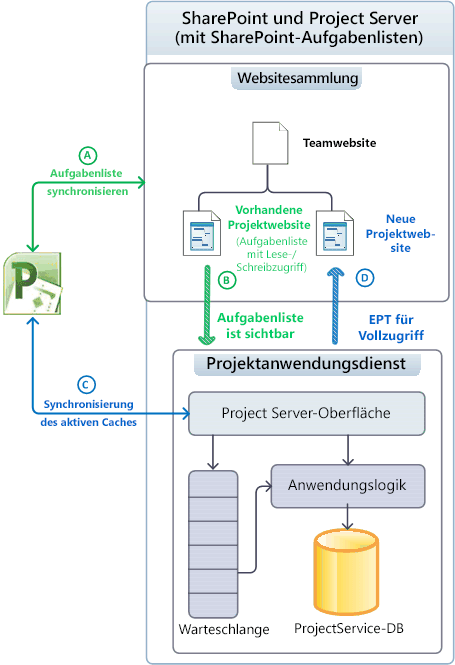
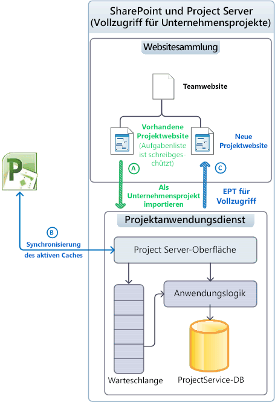
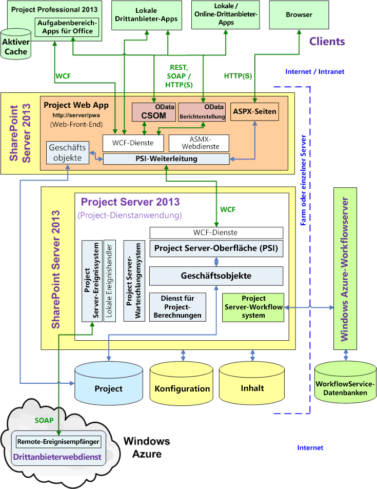
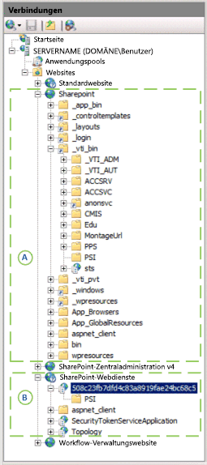

# Project Server-ArchitekturProject Server architecture

Project Server 2013 integriert Projektmanagement-Funktionen in eine SharePoint-Farm und ermöglicht die Verwendung von Project Online mit einem clientseitigen Objektmodell (CSOM) sowie einer OData-Schnittstelle für Berichtsdaten.Project Server 2013 integrates project management functionality throughout a SharePoint farm and enables the use of Project Online with a client-side object model (CSOM) and an OData interface for the Reporting data.
   
Project Server 2013 ist ein mehrstufiges System, das die in Office Project Server 2007 eingeführte Architektur erweitert.Project Server 2013 is a multitiered system that extends the architecture introduced in Office Project Server 2007. Zu den Architekturänderungen zählt die Zuweisung von Project-Anwendungsdiensten zu SharePoint-Websitesammlungen, die Erweiterung um einige Geschäftsobjekte im Web-Front-End (WFE), das clientseitige Objektmodell (CSOM) für Remotezugriff, eine einzelne Project-Datenbank, eine OData-Schnittstelle für Berichtstabellen und -ansichten, die Integration von Windows Workflow Foundation Version 4 (WF4) über Workflow Manager Client 1.0 in der Cloud oder auf einem lokalen Server sowie Remoteereignisempfänger, auf die mehrere Project Server-Installationen zugreifen können.Architectural changes include association of the Project Application Service with SharePoint site collections, the addition of some business objects on the web front-end (WFE), the client-side object model (CSOM) for remote access, a single Project database, an OData interface for the Reporting tables and views, integration of Windows Workflow Foundation version 4 (WF4) through Workflow Manager Client 1.0 in the cloud or on a local server, and remote event receivers that are accessible by multiple Project Server installations. Zusätzlich zu lokalen benutzerdefinierten Lösungen können Sie Apps erstellen, die Remoteereignisempfänger und Komponenten umfassen, die auf die CSOM- und OData-Schnittstellen zugreifen.In addition to on-premises custom solutions, you can create apps that include remote event receivers and components that access the CSOM and OData interfaces.
  
Zur Front-End-Stufe gehören Project Professional 2013, Project Web App und Apps von Drittanbietern.The front-end tier includes Project Professional 2013, Project Web App, and third-party apps. Clientanwendungen kommunizieren mit der mittleren Schicht nur über PSI (Project Server Interface) oder über CSOM-Endpunkte, die wiederum mit PSI und der Geschäftsobjektschicht kommunizieren.Client applications communicate with the middle tier through the Project Server Interface (PSI) or through the CSOM endpoints, which in turn communicate with the PSI and the business object layer. Der Datenbankzugriff ist in die Geschäftsobjekte integriert.Database access is integrated in the business objects. Das Project Server-Ereignisverwaltungssystem kann sowohl auf lokale Ereignishandler als auch auf Remoteereignisempfänger zugreifen.The Project Server Eventing System can access both local event handlers and remote event receivers. Der Project-Berechnungsdienst implementiert das Planungsmodul von Project Professional in Project Server.The Project Calculation Service implements the Project Professional scheduling engine within Project Server. Clientanwendungen greifen nicht direkt (oder sollten dies zumindest nicht) auf die Project-Datenbank zugreifen, und in Project Server werden Geschäftsobjekte vor Clients verborgen.Client applications do not (or should not) directly access the Project database; Project Server hides business objects from clients.
  
> [!NOTE]
> Project Server basiert auf der SharePoint-Architektur.Project Server is built on the SharePoint architecture. Weitere Informationen zur SharePoint Server 2013-Architektur und zum SharePoint-App-Modell finden Sie im Abschnitt *Erste Schritte bei der SharePoint-Entwicklung* in der Entwicklerdokumentation zu Office 2013.For information about SharePoint Server 2013 architecture and the SharePoint app model, see the  *Getting started with SharePoint development*  section in the Office 2013 developer documentation. 

## Integration in SharePoint-WebsitesammlungenIntegrating with SharePoint site collections

Der Project-Anwendungsdienst in Project Server 2013 kann für die Verwendung mit SharePoint-Aufgabenlisten einer SharePoint-Websitesammlung zugeordnet werden. Der Project-Anwendungsdienst kann zur umfassenden Steuerung von Project Server auch SharePoint-Aufgabenlisten als Enterprise-Projekt importieren.The Project Application Service in Project Server 2013 can be associated with a SharePoint site collection for use with SharePoint tasks lists, The Project Application Service can also import a SharePoint tasks list as an enterprise project for full Project Server control. Mit einer SharePoint Aufgabenliste verwaltet SharePoint die Projektwebsite in einer Websitesammlung. Project Professional kann mit der Aufgabenliste synchronisiert werden und diese aktualisieren.With a SharePoint tasks list, SharePoint maintains the project site in a site collection; Project Professional can synchronize with and update the tasks list. Eine Projektwebsite kann eine unabhängige SharePoint-Aufgabenliste oder eine Aufgabenliste sein, die mit einer MPP-Datei synchronisiert ist. Die MPP-Datei kann lokal oder in einer SharePoint Bibliothek gespeichert werden.A project site can be an independent SharePoint tasks list or a tasks list that is synchronized with an .mpp file; the .mpp file can be stored locally or in a SharePoint library. 
  
Project Server verwaltet die Projekte, wenn Vollzugriff besteht. Project Professional speichert Daten direkt in Project Server.Project Server maintains the projects when it has full control; Project Professional saves data directly to Project Server. Tabelle 1 bietet eine Vergleichsübersicht zum Verhalten einer Aufgabenliste, des Planungs-Webparts sowie weiterer Funktionen für die SharePoint-Steuerung von Aufgabenlisten und für importierte Projekte bei Vollzugriff durch Project Server.Table 1 compares the behavior of a tasks list, the Schedule web part, and other functionality for SharePoint control of tasks lists and for imported projects when Project Server has full control. Das Planungs-Webpart enthält das Raster auf der Project Web App-Seite, auf der Sie einen Projektplan bearbeiten können.The Schedule web part contains the grid on the Project Web App page where you can edit a project schedule. Im verknüpften Modus können Statusdaten nur einmalig für beide Aufgaben und Arbeitszeittabellen eingegeben werden. Im einfachen Eingabemodus werden die Statuserfassungsdaten für Aufgaben separat in die Arbeitszeittabellen eingegeben.The tied mode is where statusing data is entered once for both tasks and timesheets; in single entry mode, task statusing data is entered separately from timesheets.
  
**Tabelle 1. Vergleich von SharePoint-Aufgabenlisten und Vollzugriff****Table 1. Comparison of SharePoint task lists and full control**

| FeatureFeature | AufgabenlisteTask list | VollzugriffFull-control |
|:-----|:-----|:-----|
|**Aufgabenliste in SharePoint****Task list in SharePoint**   |Lesen/SchreibenRead/write    |SchreibgeschütztRead-only    |
|**Planungs-Webpart****Schedule web part**   |SchreibgeschütztRead-only    |Lesen/SchreibenRead/write    |
|**Berichterstellung****Reporting**   |Komplexe Berichterstellung über Project ServerRich reporting through Project Server    |Komplexe Berichterstellung über Project ServerRich reporting through Project Server    |
|**Sonstige Project Server-Funktionen****Other Project Server functionality**   | Gesperrte Funktionen:Blocked functionality:   - Serverseitige Projektbearbeitungen mit Project Web App oder benutzerdefinierten Clientanwendungen- Server-side project edits, with Project Web App or custom client applications   - Statuserfassung- Statusing   - Aufgaben werden im verknüpften Modus nicht angezeigt- Tasks are not visible in tied mode    |Voller Funktionsumfang ist aktiviertFull functionality is enabled    |
   
### Verwalten von Projekten als SharePoint-AufgabenlistenManaging projects as SharePoint task lists

Wenn Project Server mit einer SharePoint-Websitesammlung verknüpft ist, in der SharePoint den Zugriff verwaltet, sind Aufgabenlisten und Project Professional 2013-Dateien (MPP) in Dokumentbibliotheken zwar für den Project-Anwendungsdienst zugänglich, aber SharePoint verwaltet die Stammdaten für die Synchronisierung (siehe Abbildung 1).When Project Server is associated with a SharePoint site collection where SharePoint maintains control, task lists and Project Professional 2013 (.mpp) files in document libraries are visible to the Project Application Service, but SharePoint maintains the master data for synchronization (see Figure 1). Die serverseitige Zeitplanung mit dem Planungs-Webpart ist nicht möglich.Server-side scheduling with the Schedule web part cannot be done. Sie können Project Professional für die Synchronisierung mit Aufgabenlisten und deren Bearbeitung auf einer Projektwebsite verwenden.You can use Project Professional to synchronize with and edit the task list in a project site. Wenn Organisationen damit beginnen, SharePoint-Aufgabenlisten einzusetzen, können sie sich schrittweise dahin entwickeln, den vollen Funktionsumfang von Project Server auszuschöpfen.By starting with SharePoint task lists, organizations can gradually evolve to use the full functionality of Project Server.
  
In Abbildung 1 sind die folgenden Prozesse für das Verwalten von Projekten in SharePoint-Aufgabenlisten dargestellt:Figure 1 shows the following processes when projects are maintained in SharePoint task lists: 
  
- (A) Project Professional kann mit Aufgabenlisten synchronisiert werden und neue Projektwebsites in der Websitesammlung erstellen, bevor oder nachdem eine Verknüpfung mit dem Project-Anwendungsdienst hergestellt wurde.(A) Project Professional can synchronize with task lists and create new project sites in the site collection either before or after association with the Project Application Service.
    
- (B) Project Server wird zu Berichtzwecken mit Projektwebsitedaten synchronisiert, aber SharePoint verwaltete die Stammdaten. Für Aufgabenlisten besteht weiterhin Lese-/Schreibzugriff.(B) Project Server synchronizes with project site data for reporting purposes, but SharePoint maintains the master data; task lists remain read/write.
    
- (C) Nach der Verknüpfung kann Project Professional neue Projekte erstellen und in Project Server speichern oder veröffentlichen. Der aktive Cache in Project Professional verwaltet die Datensynchronisierung mit Project Server.(C) After association, Project Professional can create new projects and save or publish to Project Server. The Active Cache in Project Professional maintains data synchronization with Project Server.
    
- (D) Wenn ein neues Projekt in Project Professional veröffentlicht wird, hat der Benutzer die Möglichkeit, eine Projektwebsite für das Projekt zu erstellen.(D) When a new project is published in Project Professional, the user has the option of creating a project site for the project. Ein Projekt kann auch als SharePoint-Aufgabenlistenprojekt oder Enterprise-Projekt (EPT) mit Vollzugriff in Project Web App erstellt werden.A project can also be created in Project Web App as a SharePoint task list project type or as a full-control enterprise project type (EPT). Schritt (D) zeigt den ETP mit Vollzugriff.Step (D) shows the full-control EPT.
    
**Abbildung 1. Verwenden von Projektwebsites als SharePoint-Aufgabenlisten****Figure 1. Using project sites as SharePoint task lists**

 

### Verwalten von Projekten mit VollzugriffManaging projects with full control

Wenn Project Server mit einer Websitesammlung verknüpft ist und Vollzugriff besteht, importiert Project Server SharePoint-Aufgabenlisten als Enterprise-Projekte und kann jegliche zugehörigen MPP-Dateien löschen.When Project Server is associated with a site collection and has full control, Project Server imports SharePoint task lists as enterprise projects, and can delete any related .mpp files. Des Weiteren verwaltet Project Server die Stammdaten für die Aufgabenlistensynchronisierung. Aufgabenlisten in der Websitesammlung sind schreibgeschützt (siehe Abbildung 2).Project Server maintains the master data for task list synchronization; task lists in the site collection become read-only (see Figure 2). Importierte Projekte können mit Project Professional oder mit Project Web App bearbeitet werden.Imported projects can be edited by using Project Professional or by using Project Web App.
  
> [!NOTE]
> Nachdem Project Server ein Projekt importiert hat, legt der Benutzer fest, ob das Projekt von der Website gelöscht werden soll, oder ob die Verbindung abgebrochen werden soll, bevor das Projekt bearbeitet wird. Diese Auswahl kann in Project Professional getroffen werden.After Project Server imports a project, the user chooses whether to delete the project from the site or break the connection before editing the project. You can make the choice in Project Professional. 
  
In Abbildung 2 sind die folgenden Prozesse für das Verwalten von Enterprise-Projekten durch Project Server mit Vollzugriff dargestellt:Figure 2 shows the following processes when Project Server maintains enterprise projects with full control:
  
- (A) Der Benutzer kann festlegen, welche Projektwebsites importiert werden sollen. Project Server importiert die Projektwebsites und löscht optional zugehörige MPP-Dateien. Die SharePoint-Aufgabenliste eines importierten Projekts ist schreibgeschützt.(A) The user can choose which project sites to import. Project Server imports the project sites, and optionally deletes associated .mpp files. The SharePoint task list of an imported project becomes read-only.
    
- (B) Nach dem Verknüpfen erstellt Project Professional neue Projekte und speichert oder veröffentlicht sie in Project Server.(B) After association, Project Professional creates new projects and saves or publishes to Project Server. Der aktive Cache in Project Professional verwaltet die Datensynchronisierung mit Project Server.The Active Cache in Project Professional maintains data synchronization with Project Server. Die serverseitige Zeitplanung mit dem Planungs-Webpart in Project Web App ist möglich.The Schedule web part in Project Web App can do server-side scheduling.
    
- (C) Wenn ein neues Projekt in Project Professional veröffentlicht wird, hat der Benutzer die Möglichkeit, eine Projektwebsite für das Projekt zu erstellen.(C) When a new project is published in Project Professional, the user has the option of creating a project site for the project. Ein Projekt kann auch als Enterprise-Projekt (EPT) in Project Web App erstellt und mit einer schreibgeschützten Aufgabenliste auf einer Projektwebsite innerhalb der Websitesammlung veröffentlicht werden.A project can also be created in Project Web App with a full-control EPT and published with a read-only task list to a project site in the site collection.
    
**Abbildung 2. Verwenden von Projektwebsites mit Vollzugriff****Figure 2. Using project sites with full control**

  
## Allgemeine ArchitekturGeneral architecture

Abbildung 3 bietet eine allgemeine Übersicht über eine Project Server 2013-Architektur mit der Project-Dienstanwendung, einer Project Web App-Instanz auf einem WFE und diversen weiteren Clientanwendungen, einschließlich Project Professional 2013.Figure 3 shows a generalized view of the Project Server 2013 architecture, including the Project Service Application, one Project Web App instance on a WFE, and several other client applications including Project Professional 2013.
  
Es können mehrere Project Web App-Instanzen mit der Back-End-Project-Dienstanwendung kommunizieren.There can be multiple Project Web App instances that communicate with the back-end Project Service Application. Bei einer Installation vor Ort kann sich das WFE auf einem separaten Server in einer SharePoint-Farm befinden oder auf demselben SharePoint-Server wie die Project-Dienstanwendung.For an on-premises installation, the WFE can be on a separate server in a SharePoint farm, or it can be on the same SharePoint server with the Project Service Application. Project Online umfasst ein WFE, die Project-Dienstanwendung und einen lokalen oder Remoteserver für Workflow-Manager-Client 1.0.Project Online includes a WFE, the Project Service Application, and a local or remote Workflow Manager Client 1.0 server. 
  
**Abbildung 3. Allgemeine Project Server 2013-Architektur****Figure 3. General Project Server 2013 architecture**

 

Für Abbildung 3 gelten die folgenden allgemeinen Anmerkungen:The following general comments apply to Figure 3:
  
- **Project Online:** Sie können Apps erstellen, die die CSOM-, REST- und OData-Schnittstellen verwenden. Ein App-Paket kann auch Remoteereignisempfänger in einem benutzerdefinierten Webdienst auf einem lokalen Server, auf einem Azure-Server oder auf Microsoft Azure installieren. In Project Online werden lokale Drittanbieterlösungen, die WCF-Schnittstelle, die ASMX-Schnittstelle oder lokale Ereignishandler nicht unterstützt**Project Online:** You can create apps that use the CSOM, REST, and OData interfaces. An app package can also install remote event receivers in a custom web service on a local server, on an Azure server, or on Microsoft Azure. Project Online does not support third-party on-premises solutions, the WCF interface, the ASMX interface, or local event handlers. 
    
- **Ereignisempfänger:** Ereignisempfänger können auch als Ereignishandler bezeichnet werden. Project Online unterstützt die Registrierung von Project Server-Remoteereignisempfängern, die von einer Project Web App-Instanz in der Cloud oder von einer lokalen Project Server-Installation verwendet werden können. Eine lokale Project Server-Installation unterstützt Remoteereignisempfänger und lokale, voll vertrauenswürdige Ereignishandler.**Event receivers:** Event receivers can also be called event handlers. Project Online supports registration of remote Project Server event receivers, which can be used by a Project Web App instance in the cloud or by an on-premises Project Server installation. An on-premises Project Server installation supports remote event receivers and local full-trust event handlers. 
    
- **Browser:** Für die Anzeige einiger Project Web App-Seiten bestehen anders als in Project Server 2010 keine browserübergreifenden Einschränkungen.**Browsers:** There are no cross-browser limitations on viewing some Project Web App pages, as there are in Project Server 2010. Die folgenden Webbrowser werden für die vollständige Nutzung von Project Web App unterstützt:The following browsers are supported for full use with Project Web App: 
    
  - Internet Explorer 8.x (unter Windows 7 und früheren Versionen von Microsoft Windows), Internet Explorer 9.x und Internet Explorer 10.xInternet Explorer 8.x (on Windows 7 and earlier versions of Microsoft Windows), Internet Explorer 9.x, and Internet Explorer 10.x 
  - Firefox 4.x (unter Windows, Mac OS-X und Linux/Unix)Firefox 4.x (on Windows, Mac OS-X, and Linux/Unix)
  - Safari 5.x (unter Windows und Mac OS-X)Safari 5.x (on Windows and Mac OS-X)
  - ChromeChrome
    
- **Programmgesteuerte Schnittstellen:** Für Drittanbieter-Apps macht Project Online die HTTP-/HTTPS-Schnittstelle (einschließlich REST), die CSOM-Schnittstelle, einen OData-Dienst für CSOM und einen OData-Dienst für die Berichterstellung verfügbar.**Programmatic interfaces:** For third-party apps, Project Online exposes the HTTP/HTTPS interface (including REST), the CSOM interface, an OData service for the CSOM, and an OData service for reporting. Für lokale Clientanwendungen von Drittanbietern (im Intranet), können Sie die WCF-Schnittstelle für die PSI oder die CSOM-, OData- und REST-Schnittstellen über HTTP verwenden.For third-party client applications that are on-premises (on the Intranet), you can use the WCF interface for the PSI, or you can use the CSOM, OData, and REST interfaces through HTTP. Die Project Web App- und Project Professional 2013-Clients verwenden beide die WCF-Schnittstelle.The Project Web App and Project Professional 2013 clients both use the WCF interface. In einer Installation mit einem einzigen Server rufen die Front-End-ASMX-Webdienste, CSOM und REST die Back-End-WCF-Dienste intern auf.In a single-server installation, the front-end ASMX web services, CSOM, and REST internally call the back-end WCF services. 
    
    > [!NOTE]
    > Das SOAP-basierte ASMX-Schnittstelle für Webdienste im PSI ist in Project Server 2013 zwar weiterhin verfügbar, gilt aber als überholt.The SOAP-based ASMX interface for web services in the PSI is still available in Project Server 2013, but is deprecated. 
  
    Der OData-Dienst für die Berichterstellung wird von dem internen WCF-Dienst „OData.svc" implementiert. Sie können das Dokument für den Metadatendienst für die Berichterstellungsdaten mithilfe von  `https://ServerName/ProjectServerName/_api/ProjectData/$metadata` abrufen.The OData service for reporting is implemented by the internal OData.svc WCF service. You can get the Service Metadata Document for the reporting data by using  `https://ServerName/ProjectServerName/_api/ProjectData/$metadata`. 
    
    Der OData-Dienst für CSOM ist für Plattformen wie Windows RT, iOS und Android ausgelegt, auf denen Sie die REST-Schnittstelle mit JavaScript in HTML-Seiten verwenden können.The OData service for the CSOM is intended for platforms such as Windows RT, iOS, and Android, where you can use the REST interface with JavaScript in HTML pages. 
    
    > [!NOTE]
    > Obwohl die Option `$metadata` für den **ProjectData**-Berichtsdienst gültig ist, wurde die Option `$metadata` für den **ProjectServer**-Dienst des clientseitigen Objektmodells in der veröffentlichten Version von Project Server 2013 entfernt.Although the  `$metadata` option for the **ProjectData** reporting service is valid, the  `$metadata` option for the **ProjectServer** service of the CSOM is removed in the released version of Project Server 2013. Weitere Informationen zu REST-Abfragen für das CSOM finden Sie unter [Clientsseitiges Objektmodell (CSOM) für Project Server](client-side-object-model-csom-for-project-2013.md).For more information about REST queries for the CSOM, see [Client-side object model (CSOM) for Project Server](client-side-object-model-csom-for-project-2013.md). 
  
- **PSI-Weiterleitung:** Der programmgesteuerte Zugriff auf das PSI über ein separates WFE wird über die PSI-Weiterleitung realisiert, die eine WCF-Weiterleitung und eine Webdienst-Weiterleitung.**PSI Forwarder:** Programmatic access to the PSI on a separate WFE goes through the PSI Forwarder, which includes a WCF Forwarder and a Web Service Forwarder. Clients, die die ASMX-Schnittstelle verwenden, greifen über die Webdienst-Weiterleitung auf das PSI zu.Clients that use the ASMX interface access the PSI through the Web Service Forwarder. Clients, die die WCF-Schnittstelle verwenden, greifen über die WCF-Weiterleitung auf das PSI zu.Clients that use the WCF interface access the PSI through the WCF Forwarder. Der programmgesteuerte Zugriff über CSOM, OData und REST wird ebenfalls über die WCF-Weiterleitung weitergereicht.Programmatic access through the CSOM, OData, and REST is piped through the WCF Forwarder. 
    
- **Workflows:** Deklarative Workflows (in SharePoint Designer 2013 definierte Workflows) werden zur Verarbeitung an Workflow-Manager-Client 1.0 ausgelagert.**Workflows:** Declarative workflows (workflows that are defined in SharePoint Designer 2013) are offloaded to Workflow Manager Client 1.0 for processing. Workflow-Manager-Client 1.0 kann auf einem separaten Server in der SharePoint-Farm, unter Microsoft Azure in der Cloud oder zu Test- oder Demonstrationszwecken auf einem einzelnen Computer mit Project Server ausgeführt werden.Workflow Manager Client 1.0 can run on a separate server in the SharePoint farm, on Microsoft Azure in the cloud, or on a single Project Server computer for testing or demonstrations. Codierte Workflows, die mit Visual Studio 2012 entwickelt wurden, werden in der Workflowlaufzeit in SharePoint verarbeitet, so wie auch in Project Server 2010.Coded workflows that are developed with Visual Studio 2012 are processed in the workflow runtime within SharePoint, as in Project Server 2010. Weitere Informationen finden Sie unter [Erste Schritte beim Entwickeln von Project Server-Workflows](getting-started-developing-project-server-workflows.md).For more information, see [Getting started developing Project Server workflows](getting-started-developing-project-server-workflows.md).
    
- **Umkreisnetzwerk (DMZ):** In Abbildung 3 ist nicht dargestellt, dass ein lokaler WFE-Server von einer zusätzlichen Firewall in einem Umkreisnetzwerk (auch als demilitarisierte Zone oder DMZ bezeichnet) isoliert werden kann.**Perimeter network (DMZ):** Figure 3 does not show that an on-premises WFE server can be isolated by an additional firewall in a perimeter network (also known as a "demilitarized zone" or DMZ). Ein Umkreisnetzwerk kann Internetclients den Zugriff auf SharePoint und Project Server über eine Firewall erlauben.A perimeter network can allow Internet clients to access SharePoint and Project Server across a firewall. 
    
- **SharePoint-Webdienste:** In der Abbildung 3 ist nicht die SharePoint-Infrastruktur dargestellt, z. B. die Back-End-SharePoint-Webdiensteanwendung, die Teil von SharePoint Server 2013 ist.**SharePoint Web Services:** Figure 3 does not show the SharePoint infrastructure, such as the back-end SharePoint Web Services application, which is part of SharePoint Server 2013. Wenn Sie Project Server installieren, wird die Project-Dienstanwendung den SharePoint-Webdiensten hinzugefügt.When you install Project Server, the Project Service Application is added to the SharePoint Web Services. 
    
Die Front-End-Ebene umfasst Drittanbieteranwendungen, Project Professional und Project Web App. Ein Browser zeigt ASP.NET 4.0-Seiten (ASPX-Seiten) in Project Web App an. Die Project Web App-Seiten verwenden Project Server-Webparts, die mit der PSI kommunizieren und Standard-SharePoint-Webparts verwenden.The front-end tier includes third-party applications, Project Professional, and Project Web App. A browser displays ASP.NET 4.0 pages (.aspx pages) in Project Web App. The Project Web App pages use Project Server Web Parts that communicate with the PSI and also use standard SharePoint Web Parts. 
  
Die mittlere Schicht umfasst das PSI und die Geschäftsobjektschicht, die aus logischen Objekten besteht, die Project Server-Geschäftsentitäten repräsentieren.The middle tier includes the PSI and the business object layer, which consists of logical objects that represent Project Server business entities. Zu den Geschäftsentitäten zählen u. a. "Project", "Task", "Resource" und "Assignment".Business entities include Project, Task, Resource, Assignment, and so on. Das PSI und die Geschäftsobjektschicht sind eng miteinander gekoppelt und befinden sich auf demselben Server.The PSI and the business object tier are tightly coupled and are located on the same server. Eine Clientanwendung ruft das PSI über eine der verfügbaren Schnittstellen auf, und das PSI ruft daraufhin Geschäftsobjekte auf.A client application calls the PSI through one of the available interfaces, and the PSI invokes business objects. Für eine optimierte Leistungsfähigkeit bezieht das WFE von Project Server 2013 einige Geschäftsobjekte in Anforderungen ein, die nicht das Warteschlangensystem von Project Server verwenden oder den Dienst für Project-Berechnungen erfordern.For improved performance, the WFE of Project Server 2013 includes some business objects for requests that do not use the Project Server Queuing System or require the Project Calculation Service. Die WFE-Geschäftsobjekte kommunizieren direkt mit der Project-Datenbank.The WFE business objects communicate directly with the Project database.
  
Die Project Web App-Komponenten von Project Server verwenden die SharePoint 2013-Konfigurationsdatenbank für die Einrichtung von Projektwebsites und die Inhaltsdatenbank für Projektwebsite-Inhalte, wie Aufgabenlisten, benutzerdefinierte Seiten, Workflows, Verwaltungseinstellungen, Dokumente sowie Listen von Problemen, Risiken und Zusicherungen.The Project Web App components of Project Server use the SharePoint 2013 configuration database for project site setup and the content database for project site content such as task lists, custom pages, workflows, management settings, documents, and lists of issues, risks, and commitments. Die SharePoint-Konfigurations- und -Inhaltsdatenbanken unterstützen weitere Funktionen für das Projektmanagement, wie Projektvorlagen und -arbeitsbereiche, benutzerdefinierte Listen für die Teamzusammenarbeit sowie Berichte.The SharePoint configuration and content databases support additional features for project management, such as project templates and workspaces, custom lists for team collaboration, and reports.
  
### Project Web App und das WFEProject Web App and the WFE

Sie können mehrere Project Web App-Instanzen auf einem WFE und mehrere WFE-Server innerhalb eines Unternehmensintranets konfigurieren, um eine optimale Lastverteilung für Intranet-Clients zu ermöglichen.You can configure multiple Project Web App instances on a WFE and multiple WFE servers within a corporate intranet to enable load distribution for intranet clients. Wenn eine Client-Anwendung eine Project Web App-Instanz auf einem separaten WFE-Server verwendet, werden PSI-Aufrufe über die PSI-Weiterleitung geleitet.When a client application uses a Project Web App instance on a separate WFE server, PSI calls are routed through the PSI Forwarder. Die PSI-Weiterleitung (entweder WCF-Weiterleitung oder Webdienst-Weiterleitung) führt die folgenden Funktionen aus:The PSI Forwarder (either the WCF Forwarder or the Web Service Forwarder) performs the following functions:
  
- Optimiert Aufrufe von Remoteclients an das PSI.Optimizes calls to the PSI from remote clients.
    
- Unterscheidet zwischen PSI-Aufrufen, die den Project Server-Warteschlangendienst erfordern, und Aufrufen, für die kein Warteschlangendienst erforderlich ist. Die Bezeichnungen von asynchronen PSI-Methoden beginnen mit "Queue", wie **QueueCreateProject**.Distinguishes between PSI calls that require the Project Server Queue Service, and those that do not. Asynchronous PSI method names begin with Queue, such as **QueueCreateProject**.
    
- Ermittelt PSI-Aufrufe, die registrierte lokale Ereignishandler aufrufen.Identifies PSI calls that invoke registered local event handlers.
    
- Ermittelt PSI-Aufrufe, die den Dienst für Project-Berechnungen erfordern.Identifies PSI calls that require the Project Calculation Service.
    
- Verwendet einen serverbasierten Cache, der gemeinsam mit dem clientseitigen aktiven Cache in Project Professional umlaufende Aufrufe an Project Server reduziert.Uses a server-based cache that works with the client-side Active Cache in Project Professional to reduce roundtrip calls to Project Server.
    
Nachdem ein SharePoint-Server einen Project Server-Benutzer authentifiziert hat, sendet die PSI-Weiterleitung transparente Anforderungen, die Back-End-Dienste verwenden, an die PSI-Dienste auf dem Computer, auf dem Project Server ausgeführt wird.After SharePoint Server authenticates a Project Server user, the PSI Forwarder transparently sends requests that use back-end services to the PSI services on the computer running Project Server. Anforderungen, für die keine Back-End-Dienste erforderlich sind, werden an die Geschäftsobjekte in der lokalen Project Web App-Instanz gesendet.Requests that do not require back-end services are sent to the business objects in the local Project Web App instance. Die PSI-Weiterleitung verbessert die Skalierbarkeit, Leistungsfähigkeit und Zuverlässigkeit der Project Server-Verarbeitung über das LAN, ein WAN und in Project Online.The PSI Forwarder improves scalability, performance, and reliability for Project Server processing over the LAN, a WAN, and in Project Online.
  
Project Web App wird mit ASP.NET 4.0 entwickelt.Project Web App is developed with ASP.NET 4.0. Die visuellen Elemente in ASPX-Dateien (HTML, Serversteuerelemente und statischer Text) werden getrennt von der Programmierlogik in CodeBehind-Klassen realisiert, die sich in kompilierten Assemblies (DLL-Dateien) befinden.The visual elements in .aspx files (HTML, server controls, and static text) are separate from the programming logic in code-behind classes that are in compiled assemblies (.dll files). Websiteseiten in Project Web App wie die Seite der obersten Ebene, Project Center und Report Center, können anhand von Webparts angepasst werden.Site pages in Project Web App, such as the top-level page, Project Center, and Report Center, can be customized by using Web Parts. Anwendungsseiten, die im Menü **Websiteaktionen** nicht über die Option **Seite bearbeiten** verfügen, können nicht bearbeitet werden. Dazu zählen die Seite "Servereinstellungen" und die Seite "Arbeitszeittabelle überprüfen".Application pages that do not have an **Edit Page** option in the **Site Actions** menu cannot be edited, such as the Server Settings page and the Review Timesheet page. 
  
### Das CSOM und das Project Server InterfaceThe CSOM and the Project Server Interface

Das PSI umfasst 22 öffentliche Dienste wie **Project**, **Resource**, **CustomField** und **Statusing**.The PSI is factored into 22 public services, such as **Project**, **Resource**, **CustomField**, and **Statusing**. Das PSI enthält auch sieben private Dienste für die interne Verwendung.The PSI also contains seven private services for internal use. Das PSI ist die grundlegende API von Project Server. Es macht die Project Server-Funktionen für das CSOM und für externe Anwendungen verfügbar.The PSI is the fundamental API of Project Server; it exposes Project Server functionality to the CSOM and to external applications. Das CSOM umfasst Klassen, die auf die häufig verwendeten PSI-Klassen und -Elemente zugreifen, die von Drittanbieteranwendungen verwendet werden.The CSOM includes classes that access the most commonly used PSI classes and members that are used for third-party applications. In Project Server 2013 sind einige Project Server-Funktionen wie die Dienste **Admin**, **Calendar**, **PortfolioAnalyses** und **Security** nicht im CSOM verfügbar.In Project Server 2013, some Project Server functionality is not available in the CSOM, such as the **Admin**, **Calendar**, **PortfolioAnalyses**, and **Security** services. 
  
Project Professional 2013 und Project Web App verwenden das PSI, um auf Project Server-Daten in den Entwurfstabellen und -ansichten, veröffentlichten Tabellen und Ansichten sowie den Archivtabellen und -ansichten der Project-Datenbank zuzugreifen.Project Professional 2013 and Project Web App use the PSI to access Project Server data in the draft, published, and archive tables and views of the Project database. Sie können über eine Proxy-Datei oder ein Proxy-Assembly für WCF-Dienste oder die ASMX-Webdienste auf den PSI-Dienst zugreifen.You can access a PSI service through a proxy file or a proxy assembly, for either the WCF services or the ASMX web services.
  
> [!NOTE]
> Das CSOM ist die bevorzugte Schnittstelle für Project Server-Entwickler von Drittanbietern. Es kann für Anwendungen verwendet werden, die sowohl auf eine lokale Project Server-Installation als auch auf Project Online zugreifen.The CSOM is the preferred interface for third-party Project Server developers; it can be used for applications that access both an on-premises Project Server installation and Project Online. Wir empfehlen, dass Sie für die Entwicklung neuer Anwendungen das CSOM verwenden, sofern das CSOM alle für Ihre Anwendung erforderlichen Funktionen umfasst.We recommend that you use the CSOM for developing new applications, if the CSOM includes the functionality that your application requires. 
  
Einige Branchenanwendungen und andere Drittanbieteranwendungen, die für Project Server 2010 entwickelt wurden, erfordern PSI-Dienste, die noch nicht im CSOM enthalten sind.Some line-of-business (LOB) applications and other third-party applications that were developed for Project Server 2010 require PSI services that are not yet represented in the CSOM. Wenn derartige Anwendungen nur für lokale Project Server-Installationen bestimmt sind, können diese weiterhin die WCF- oder ASMX-Schnittstelle des PSI verwenden.If they target only an on-premises installation of Project Server, applications can continue to use the WCF interface or the ASMX interface of the PSI.
  
Clientanwendungen rufen das PSI über Dienstproxies auf.Client applications call the PSI through service proxies. Clients, die die WCF-Webdienstschnittstelle verwenden, greifen über `https://ServerName/ProjectServerName/_vti_bin/psi/ProjectServer.svc` auf alle PSI-Dienste zu.Clients that use the WCF interface access all PSI services through  `https://ServerName/ProjectServerName/_vti_bin/psi/ProjectServer.svc`. Clients, die eine ASMX-Webdienstschnittstelle verwenden, nutzen die Project Web App-URL für den jeweiligen Dienst.Clients that use an ASMX web service interface use the Project Web App URL for the specific service. Der Dienst **Resource** ist z. B. über `https://ServerName/ProjectServerName/_vti_bin/psi/resource.asmx?wsdl` verfügbar.For example, the **Resource** service is at  `https://ServerName/ProjectServerName/_vti_bin/psi/resource.asmx?wsdl`. Wenn Anwendungen keinen Intranetzugriff auf Project Server haben, können sie einen Project Web App-Server in einem Umkreisnetzwerk verwenden (in Abbildung 3 nicht dargestellt).If applications do not have intranet access to Project Server, they can use a Project Web App server in a perimeter network (not shown in Figure 3).
  
Abbildung 4 zeigt den Bereich **Verbindungen** im **Internetinformationsdienste (IIS)-Manager** für eine Installation von SharePoint Server 2013, Project Server 2013 und einer lokalen Workflowverwaltungswebsite für Workflow-Manager-Client 1.0 auf einem einzelnen Server.Figure 4 shows the **Connections** pane in **Internet Information Services (IIS) Manager** for a single-server installation of SharePoint Server 2013, Project Server 2013, and a local Workflow Management site for Workflow Manager Client 1.0. Die SharePoint-Websitesammlung (A) umfasst die Front-End-PSI-Dienste im virtuellen Unterverzeichnis `_vti_bin\PSI`.The SharePoint site collection (A) includes the front-end PSI services in the  `_vti_bin\PSI` virtual subdirectory. Die SharePoint-Webdienstanwendung (B) umfasst die Project-Dienstanwendung mit den Back-End-PSI-Diensten im virtuellen Unterverzeichnis `508c23fb7dfd4c83a8919fae24bc68c5/PSI`.The SharePoint Web Services application (B) includes the Project Service Application, with the back-end PSI services in the  `508c23fb7dfd4c83a8919fae24bc68c5/PSI` virtual subdirectory. Bei der GUID handelt es sich um den Namen der Project-Dienstanwendungsinstanz für diese Project Server-Installation.The GUID is the name of the Project Service Application instance for that Project Server installation. 
  
**Abbildung 4. Front-End-PSI (A) und Back-End-PSI (B) in IIS-Manager****Figure 4. IIS Manager showing the front-end PSI (A), and the back-end PSI (B)**

  
Clientanwendungen können nicht direkt auf WCF-Dienste für das PSI in der Back-End-Project-Dienstanwendung zugreifen.Client applications cannot directly access the WCF services for the PSI in the back-end Project Service Application. Wenn für die Clientanwendungen und Komponenten der Branchenanwendungen kein Zugriff auf Project Online erforderlich ist, können diese Proxies für das PSI verwenden.If they do not require access to Project Online, client applications and components of LOB applications use proxies for the PSI. Eine Back-End-URL für die WCF-Schnittstelle des Dienstes **Resource** in Abbildung 4 wäre z. B. `https://ServerName:32843/508c23fb7dfd4c83a8919fae24bc68c5/psi/resource.svc`.A back-end URL for the WCF interface of the **Resource** service in Figure 4, for example, would be  `https://ServerName:32843/508c23fb7dfd4c83a8919fae24bc68c5/psi/resource.svc`. Port 32843 ist der Standard-HTTP-Port für die SharePoint-Webdienstanwendung (32844 ist der Port für die HTTPS-Kommunikation).Port 32843 is the default HTTP port for the SharePoint Web Services application (32844 is the port for HTTPS communications). Jedoch sperrt die Datei "web.config" für Project Web App den direkten Zugriff auf Back-End-PSI-Dienste.However, the web.config file for Project Web App blocks direct access to back-end PSI services.
  
> [!NOTE]
> Der Project 2013-SDK-Download umfasst PSI-Proxydateien für die WCF- und ASMX-Dienste sowie Anweisungen für das Kompilieren der Dateien in Proxy-Assemblies.The Project 2013 SDK download includes PSI proxy files for the WCF services and the ASMX services, and instructions for how to compile them into proxy assemblies. > Um aktualisierte PSI-Proxydateien zu erstellen, die die WCF-Schnittstelle verwenden, müssen Sie das Hilfsprogramm "svcutil.exe" oder Visual Studio direkt auf dem Project Server-Computer verwenden.> To create updated PSI proxy files that use the WCF interface, you have to use the svcutil.exe utility or Visual Studio directly on the Project Server computer. 
  
Elemente des PSI-Dienstes generieren oder verarbeiten in der Regel typisierte **DataSet**-Objekte, um Informationen mit Geschäftsobjekten auszutauschen.Members of the PSI services typically produce or consume typed **DataSet** objects as the means to exchange information with the business objects. Des Weiteren gibt es mehrere verschiedene Modelle für die PSI-Entwicklung.There are also several different models for PSI development. So verwenden z. B. die PSI-Dienste **Resource**, **CustomFields** und **LookupTable** XML-Filterobjekte für die **DataSet**-Manipulation und andere Dienste nicht. Einige Methoden im Dienst **Statusing** verwenden einen _changeXml_-Parameter, während dies bei anderen Methoden und Diensten nicht der Fall ist.For example, the **Resource**, **CustomFields**, and **LookupTable** PSI services use XML filter objects for **DataSet** manipulation, and other services do not; some methods in the **Statusing** service use a  _changeXml_ parameter, while other methods and services do not. Das CSOM verwendet keine DataSets.The CSOM does not use datasets. Obwohl das CSOM ein anderes Programmiermodell als das PSI aufweist und Sie entweder .NET-Assemblys oder JavaScript verwenden können, ist die Entwicklung mit dem CSOM in der Regel einfacher und konsistenter als die Entwicklung mit dem PSI.Although the CSOM has a different programming model than the PSI, and you can use either .NET assemblies or JavaScript, development with the CSOM is generally simpler and more consistent than development with the PSI. 
  
Weitere Informationen zur PSI finden Sie unter [Übersicht über die Project PSI-Referenz](project-psi-reference-overview.md).For more information about the PSI, see [Project PSI reference overview](project-psi-reference-overview.md). Weitere Informationen zum CSOM finden Sie unter [Clientsseitiges Objektmodell (CSOM) für Project 2013](client-side-object-model-csom-for-project-2013.md).For more information about the CSOM, see [Client-side object model (CSOM) for Project 2013](client-side-object-model-csom-for-project-2013.md).
  
### Geschäftsobjekte im WFE und die Project-DienstanwendungBusiness objects in the WFE and the Project Service Application

Das interne Objektmodell von Project Server umfasst die Geschäftsobjekte, die logische Entitäten wie "Project" und "Resource" repräsentieren. Client-Anwendungen greifen ausschließlich über das CSOM oder das PSI auf Geschäftsobjekte zu. Geschäftsobjekte wiederum greifen auf die Entwurfstabellen und -ansichten, veröffentlichten Tabellen und Ansichten sowie die Archivtabellen und -ansichten der Project-Datenbank zu.The internal object model of Project Server includes the business objects, which represent logical entities such as Project and Resource. Client applications access business objects only through the CSOM or the PSI. Business objects, in turn, access the draft, published, and archive tables and views in the Project database.
  
Geschäftsobjekte sind für Drittanbieterentwickler nicht zugänglich. Das PSI verwaltet die Zuordnung des API zu den Geschäftsobjekten, und das CSOM ordnet sein API dem PSI zu. Die logischen Entitäten von Geschäftsobjekten können in drei Typen unterteilt werden:Business objects are not exposed to third-party developers. The PSI handles mapping of the API to business objects, and the CSOM maps its API to the PSI. The logical entities of business objects can be classified into three types:
  
- **Kernentitäten** sind Objekte wie Projekte, Aufgaben, Aufträge, Ressourcen und Kalender. Die Kernentitäten umfassen grundlegende Bestandteile der Geschäftslogik wie Berechtigungen und Benennungsregeln.**Core entities** are objects such as projects, tasks, assignments, resources, and calendars. The core entities include basic business logic such as permissions and naming rules. 
    
- **Geschäftsentitäten** sind Objekte wie Arbeitszeittabellen, Projektportfolios und Modelle. Geschäftsentitäten umfassen weiterreichende Bestandteile der Geschäftslogik und werden in der Regel durch die Kombination von Kernentitäten gebildet.**Business entities** are objects such as timesheets, project portfolios, and models. Business entities include additional business logic and usually are built from a combination of the core entities. 
    
- **Unterstützende Entitäten** sind u. a. Objekte für die Sicherheit und Validierung.**Support entities** are objects such as security and validation. 
    
In Project Server 2010 werden alle Geschäftsobjekte in der Project-Dienstanwendung implementiert.In Project Server 2010, all business objects are implemented in the Project Service Application. In Project Server 2013 hostet das WFE viele der Geschäftsobjekte, die synchrone Methoden verarbeiten und nicht den Dienst für Project-Berechnungen erfordern.In Project Server 2013, the WFE hosts many of the business objects that process synchronous methods and do not require the Project Calculation Service. Synchrone PSI-Methoden wie **DeleteProject** und **ReadAssignments** verwenden nicht den Project Server-Warteschlangendienst.Synchronous PSI methods such as **DeleteProject** and **ReadAssignments** do not use the Project Server Queue Service. Die Bezeichnungen von asynchronen Methoden im PSI beginnen mit `Queue` wie **QueueCreateProject** und **QueueUpdateTimesheet**.Asynchronous methods in the PSI have names that start with  `Queue`, such as **QueueCreateProject** and **QueueUpdateTimesheet**. Eine asynchrone Methode sendet eine Nachricht an den Project Server-Warteschlangendienst, der die Verarbeitung der Methode plant, während die Kontrolle wieder an den Benutzer übergeben wird.An asynchronous method sends a message to the Project Server Queue Service, which schedules processing of the method while control is returned to the user.
  
Die PSI-Weiterleitung bestimmt, welche Anforderungen an die Project-Dienstanwendung gesendet werden und welche Anforderungen von den Geschäftsobjekten im WFE verarbeitet werden können. Die Geschäftsobjekte im WFE umgehen die Project-Dienstanwendung und haben direkten Zugriff auf die Project-Datenbank, ganz ähnlich wie es bei SharePoint-Prozessen in einem WFE der Fall ist, die direkt auf die Konfigurations- und Inhaltsdatenbanken zugreifen. Je mehr Geschäftsobjekte auf dem WFE ausgeführt werden, umso höher ist die Effizienz von Project Server, umso mehr wird die Anwendungsschicht entlastet und umso besser kann Project Server für eine steigende Arbeitsauslastung skaliert werden.The PSI Forwarder determines which requests are sent to the Project Service Application and which can be processed by the business objects in the WFE. The business objects in the WFE bypass the Project Service Application and have direct access to the Project database, similar to the way other SharePoint processes in a WFE directly access the Configuration and Content databases. Running many of the business objects on the WFE improves the efficiency of Project Server, reduces the load on the application tier, and enables Project Server to better scale up for increased workloads.
  
> [!NOTE]
> In Project Server 2013 müssen für das WFE und den Back-End-Project-Server-Computer lokale Ereignishandler bereitgestellt werden.In Project Server 2013, local event handlers must be deployed to the WFE and to the back-end Project Server computer. 
  
### Project Server-DatenbankProject Server database

In Project Server 2013 wurden die vier Project Server-Datenbanken der früheren Versionen zu einer Project-Datenbank in SQL Server zusammengelegt.In Project Server 2013, the four Project Server databases of previous versions are combined into one Project database in SQL Server. Der Standardname der Project-Datenbank ist "ProjectService".The default Project database name is ProjectService. Die Berichtstabellen und -ansichten werden wie gewohnt mit dem Präfix `dbo` benannt wie "dbo.MSP_EpmProject" und "dbo.MSP_EpmProject_UserView".The reporting tables and views retain their previous names with the  `dbo` prefix, such as dbo.MSP_EpmProject and dbo.MSP_EpmProject_UserView. Tabellen und Ansichten die in früheren Versionen in der Entwurfsdatenbank gespeichert waren, werden mit dem Präfix `draft` benannt.Tables and views that were previously in the Draft database have the  `draft` prefix. Tabellen und Ansichten aus der veröffentlichten Datenbank tragen das Präfix `pub`.Tables and views from the Published database have the  `pub` prefix. Tabellen und Ansichten aus der Archivdatenbank haben das Präfix `ver`.Tables and views from the Archive database have the  `ver` prefix. 
  
> [!IMPORTANT]
> Der direkte Zugriff wird nicht unterstützt für die Entwurfstabellen und -ansichten (Präfix `draft`), die veröffentlichten Tabellen und Ansichten (Präfix `pub`) sowie die Archivtabellen und -ansichten (Präfix `ver`).Direct access is not supported for the draft ( `draft` prefix), published (  `pub` prefix), and archive (  `ver` prefix) tables and views. Berichte sollten nur die Berichtstabellen und -ansichten mit dem Präfix `dbo` verwenden.Reports should use only the reporting tables and views, which have the  `dbo` prefix. 
  
Project Server-Daten werden wie folgt in der Project-Datenbank aufgeteilt:Project Server data is partitioned in the Project database as follows:
  
- Die Entwurfstabellen und -ansichten enthalten Daten von unveröffentlichten Projekten, die von Project Professional und anderen Anwendungen erstellt wurden.The draft tables and views contain data from unpublished projects that were created by Project Professional and other applications. Project Web App zeigt keine Projektdaten aus Entwurfstabellen und -ansichten an.Project Web App does not display project data from the draft tables and views.
    
- Die veröffentlichten Tabellen und Ansichten enthalten alle veröffentlichten Projekte und Enterprise-Ressourcen, globale Daten für Enterprise-Projekttypen (EPTs) sowie weitere Projektvorlagen.The published tables and views contain all of the published projects and enterprise resources, global data for enterprise project types (EPTs), and other project templates. Veröffentlichte Projekte werden in Project Web App angezeigt.Published projects are visible in Project Web App. Die veröffentlichten Daten umfassen auch Tabellen, die spezifisch für Project Web App sind (Arbeitszeittabellen, Modelle, Ansichten usw.), sowie globale Datentabellen (benutzerdefinierte Felder, Nachschlagetabellen, Project Server-Autorisierungsberechtigungen und Metadaten).The published data also includes tables that are specific to Project Web App (timesheets, models, views, and so on), and global data tables (custom fields, lookup tables, Project Server authorization permissions, and metadata).
    
- In Archivdaten werden Sicherungsversionen von Projekten, Ressourcen, benutzerdefinierten Felder und weiteren Daten gespeichert.The archive data saves backup versions of projects, resources, custom fields, and other data.
    
- Die Berichtsdaten können für den schreibgeschützten Zugriff in Drittanbieteranwendungen sowie für Berichte verwendet werden.The reporting data can be used for read-only access in third-party applications, and for reports. Project Server-OLAP-Cubes verwenden Berichtsansichten mit dem Suffix `_OlapView`.Project Server OLAP cubes use the reporting views that have the  `_OlapView` suffix. OLAP-Cubes sind in einer lokalen Project Server-Installation verfügbar, aber nicht in Project Online.OLAP cubes are available in an on-premises Project Server installation, but are not available in Project Online. 
    
    Berichtsdaten sind sehr umfangreich und werden nahezu in Echtzeit aktualisiert. Die Berichtstabellen und -ansichten sind für die Generierung von schreibgeschützten Berichten optimiert. So sind Berichtstabellen z. B. denormalisiert, um redundante Daten zu ermöglichen und die Anzahl relationaler Tabellen zu reduzieren.Reporting data is comprehensive and is updated nearly in real time. The reporting tables and views are optimized for read-only report generation; for example, the reporting tables are denormalized to provide redundant data and reduce the number of relational tables.
    
Logische Entitäten wie "Resource" oder "Project" können sich über mehrere Tabellen erstrecken, und alle Tabellen für eine bestimmte Entität haben denselben Primärschlüssel. Der Primärschlüssel ist eine GUID in einer einzelnen Spalte, die eine Instanz einer bestimmten Entität eindeutig kennzeichnet.Logical entities such as Resource or Project can span multiple tables, and all tables for a particular entity have the same primary key. The primary key is a GUID in a single column that uniquely identifies one instance of a particular entity.
  
Project Server-Daten werden für jede Instanz von Project Web App in einer separaten Project-Datenbank mit jeweils unterschiedlichem Namen gespeichert.Project Server data for each instance of Project Web App is stored in a separate Project database with a different name. Clientanwendungen, die direkten Zugriff auf Project Server haben, können die Berichtstabellen und -ansichten direkt lesen.Client applications that have direct access to Project Server can directly read the reporting tables and views. Bei Remotezugriff können die Clientanwendungen die OData-Schnittstelle und die REST-Schnittstelle verwenden, um Daten für Berichte abzurufen.For remote access, client applications can use the OData interface and the REST interface to get data for reports. Clients sollten nur das CSOM oder das PSI verwenden, um auf Entwurfstabellen und -ansichten, veröffentlichte Tabellen und Ansichten sowie Archivtabellen und -ansichten zuzugreifen.Clients should use only the CSOM or the PSI to access the draft, published, and archive tables and views. Der Berichtsdatendienst (in Abbildung 3 nicht dargestellt) aktualisiert die Berichtsdaten von veröffentlichten Daten nahezu in Echtzeit.The Reporting Data Service (RDS, which is not shown in Figure 3) updates the reporting data from published data in nearly real time. Die Project-Datenbank kann sich auf einem separaten Server befinden.The Project database can be located on a separate server.
  
Schemas werden nur für die Berichtstabellen und -ansichten dokumentiert.Schemas are documented only for the reporting tables and views. Bei einer lokalen Project Server-Installation können Sie Berichtstabellen und -ansichten für Entitäten hinzufügen, die nicht im Schema der Project-Datenbank definiert sind.For an on-premises Project Server installation, you can add reporting tables and views for entities that are not defined in the Project database schema. Sie können auch separate Datenbanken für benutzerdefinierte Anwendungen vor Ort erstellen.You can also create separate databases for custom on-premises applications. Änderungen an den Entwurfstabellen und -ansichten, veröffentlichte Tabellen und Ansichten sowie Archivtabellen und -ansichten werden nicht unterstützt.Modification is not supported for the draft, published, and archive tables and views. Wenn Ihre benutzerdefinierte Anwendung oder Ihr benutzerdefinierter Bericht benutzerdefinierte SQL-Objekte (z. B. Tabellen und Ansichten) erfordert, empfehlen wir Ihnen, diese in einer benutzerdefinierten Datenbank zu erstellen.If your custom application or report requires custom SQL objects (for example, tables and views), we recommend that you create these in a custom database. Da nicht direkt in Project Online auf die Project-Datenbank zugegriffen werden kann, können Berichtstabellen und -ansichten nicht geändert werden.Because the Project database is not directly accessible in Project Online, reporting tables and views cannot be modified. Wenn Sie jedoch über ein SQL Azure-Konto verfügen, können Sie separate Datenbanken für die benutzerdefinierte Verwendung erstellen Project Online.However, if you have a SQL Azure account, you can create separate databases for custom use with Project Online.
  
### EreignisempfängerEvent receivers

Lokale Ereignishandler und Remoteereignisempfänger für Project Server ermöglichen eine Drittanbieter-Erweiterbarkeit und die Reaktion auf Project Server-Ereignisse wie das Erstellen oder Veröffentlichen eines Projekts.Local event handlers and remote event receivers for Project Server enable third-party extensibility in response to Project Server events such as creating or publishing a project. In Project Server 2010 sind alle Ereignishandler lokal und werden in voll vertrauenswürdigem Code geschrieben. Des Weiteren werden sie direkt auf dem Computer bereitgestellt, auf dem Project Server ausgeführt wird, sowie auf den WFEs, und sie werden innerhalb des Project Server-Ereignissystems ausgeführt.In Project Server 2010, all event handlers are local and are written in full-trust code, deployed directly on the computer running Project Server and to the WFEs, and run inside the Project Server Eventing System. Da Project Online keine voll vertrauenswürdigen Ereignishandler unterstützt, implementiert Project Server 2013 Remoteereignisempfänger, die den Remote-Ereignisempfängern in SharePoint Server 2013 ähneln.Because Project Online cannot use full-trust event handlers, Project Server 2013 implements remote event receivers that are similar to the remote event receivers in SharePoint Server 2013. Eine lokale Installation von Project Server 2013 unterstützt herkömmliche, voll vertrauenswürdige Ereignishandler und Remoteereignisempfänger.An on-premises installation of Project Server 2013 can use traditional full-trust event handlers and remote event receivers.
  
Ein Project Server-Remoteereignisempfänger kann in einem benutzerdefinierten Webdienst implementiert werden, mit einem SOAP-Endpunkt, der in Microsoft Azure oder in anderen Umgebungen ausgeführt wird, die SOAP-Webdienste unterstützen.A Project Server remote event receiver can be implemented in a custom web service with a SOAP endpoint that runs in Microsoft Azure or other environments that support SOAP web services. Ein Project Server-App-Paket kann Remoteereignisempfänger einbeziehen, die mit der App installiert werden.A Project Server app package can include remote event receivers that are installed with the app.
  
Remoteereignisempfänger können Aufrufe über CSOM-Endpunkte (in Abbildung 3 nicht dargestellt) zurück an Project Server senden.Remote event receivers can call back into Project Server by using the CSOM endpoints (not shown in Figure 3). Der Aufruf an einen Remoteereignisempfänger umfasst Informationen von dem Project Server-Ereignissystem und der Project Web App-Instanz (oder vom Project Web App-Mandanten in Project Online), das bzw. die den Aufruf gesendet hat.The call to a remote event receiver includes information from the Project Server Event System and the Project Web App instance (or the Project Web App tenant in Project Online) that issues the call. Mit Remoteereignisempfängern können Sie einen einzelnen Webdienst erstellen und hosten, der von mehreren Project Server-Installationen verwendet werden kann.Remote event receivers enable you to create and host a single web service that can be used by multiple Project Server installations. Im Gegensatz dazu müssen lokale, voll vertrauenswürdige Ereignishandler für jede Project Server-Installation einzeln bereitgestellt werden.By contrast, local full-trust event handlers must be deployed to each installation of Project Server.
  
### Veröffentlichung und serverseitige ZeitplanungPublishing and server-side scheduling

Project Server 2013 unterstützt sowohl die manuelle als auch die automatische Aktualisierung von Projektplänen.Project Server 2013 supports both manual and automated project schedule updates. Der Standardprozess ist die manuelle Aktualisierung.The default process is a manual schedule update. Das bedeutet, der Projektmanager checkt ein Projekt in Project Professional oder Project Web App aus, öffnet es, übernimmt die Änderungen, speichert das Projekt und veröffentlicht es, um die Änderungen allen Beteiligten verfügbar zu machen.That is, the project manager checks out and opens a project in Project Professional or Project Web App, applies the changes, and then saves and publishes the project to make the changes available to everyone. Project Professional verfügt über ein Planungsmodul, das Änderungen berechnet und die Änderungen anschließend in Project Server speichert.Project Professional has a scheduling engine that calculates changes and then saves the changes to Project Server. Das in Project Server 2010 implementierte serverseitige Planungsmodul unterscheidet sich von dem Planungsmodul in Project Professional.In Project Server 2010, the server-side scheduling engine is a different implementation from the scheduling engine in Project Professional.
  
In Project Server 2013 implementiert der Dienst für Project-Berechnungen dasselbe Planungsmodul wie in Project Professional 2013.In Project Server 2013, the Project Calculation Service implements the same scheduling engine that is in Project Professional 2013. Der Dienst für Project-Berechnungen wird in einem Windows-Dienst namens **Microsoft Project Server-Berechnungsdienst** ausgeführt.The Project Calculation Service runs in a Windows service named **Microsoft Project Server Calculation Service**. Das Ändern eines Projektplans in Project Web App oder mit Drittanbieteranwendungen, die das CSOM verwenden, bewirkt exakt dieselben Planänderungen, die auch in Project Professional implementiert würden.Editing a project schedule in Project Web App or with third-party applications that use the CSOM results in exactly the same schedule changes that Project Professional would make.
  
> [!NOTE]
> Bei Drittanbieteranwendungen, die das PSI verwenden, weicht die Planung möglicherweise geringfügig von den in Project Web App berechneten Plänen ab.Third-party applications that use the PSI may show some scheduling differences from a schedule that Project Web App calculates. Um eine Abwärtskompatibilität zu gewährleisten, verwenden die öffentlichen PSI-Methoden, die für die serverseitige Planung verantwortlich sind, weiterhin das Planungsmodul, das mit Project Server 2010 eingeführt wurde.For backward-compatibility, the public PSI methods that do server-side scheduling still use the scheduling engine that was introduced in Project Server 2010. Eine Ausnahme hierbei ist die Methode **QueueUpdateProject2**, wobei es sich um eine neue PSI-Methode in Project Server 2013 handelt.An exception is **QueueUpdateProject2**, which is a new PSI method in Project Server 2013. Das frühere Planungsmodul plant z. B. keine Unterprojekte oder Verknüpfungen zu anderen Projekten und berechnet keine Ertragswertfelder.For example, the older scheduling engine does not schedule subprojects or links to other projects, and does not calculate earned value fields. Um mögliche Planungsabweichungen zwischen Drittanbieteranwendungen und Project Professional oder Project Web App zu vermeiden, sollten Sie nach Möglichkeiten Anwendungen mit dem CSOM entwickeln.To avoid potential scheduling differences between third-party applications and Project Professional or Project Web App, you should develop applications with the CSOM where possible. 
  
Project Server ermöglicht es anhand der folgenden Schritte, dass die veröffentlichte Version aktualisiert werden kann, während ein Projektmanager die Entwurfsversion verwendet:Project Server allows the published version of a project to be updated while a project manager is using the draft version, by the following steps:
  
1. Project Server übernimmt Aktualisierungen und plant die veröffentlichte Version neu.Project Server applies updates and reschedules the published version.
    
2. Project Server speichert die Aktualisierung, um sie in die Entwurfsversion zu implementieren, wenn eines der folgenden Ereignisse eintritt:Project Server saves the update to apply to the draft version when either of the following events occur:
    
   - Project Professional öffnet das Projekt.Project Professional opens the project.
    
   - Project Professional versucht, das Projekt zu veröffentlichen.Project Professional tries to publish the project.
    
3. Bei einem Konflikt wird der Projektmanager benachrichtigt und muss den Konflikt beheben, damit die Entwurfsversion veröffentlicht werden kann.If there is a conflict, the project manager is notified and must resolve the conflict before the draft version can be published.
    
## Siehe auchSee also

- [Übersicht über Project 2013 für EntwicklerProject 2013 overview for developers](https://msdn.microsoft.com/library/8da91ab0-af4f-429f-8241-490600e3f7bd%28Office.15%29.aspx)
- [Project Server-ProgrammierbarkeitProject Server programmability](project-server-programmability.md)  
- [Clientseitiges Objektmodell (CSOM) für Project 2013Client-side object model (CSOM) for Project 2013](client-side-object-model-csom-for-project-2013.md)  
- [Was das PSI durchführen kann und was nichtWhat the PSI does and does not do](what-the-psi-does-and-does-not-do.md)  
- [Erste Schritte beim Entwickeln von Project Server-WorkflowsGetting started developing Project Server workflows](getting-started-developing-project-server-workflows.md)   
- [Übersicht über die Project PSI-ReferenzProject PSI reference overview](project-psi-reference-overview.md)   
- [Open Data ProtocolOpen Data Protocol](https://www.odata.org/)
    

