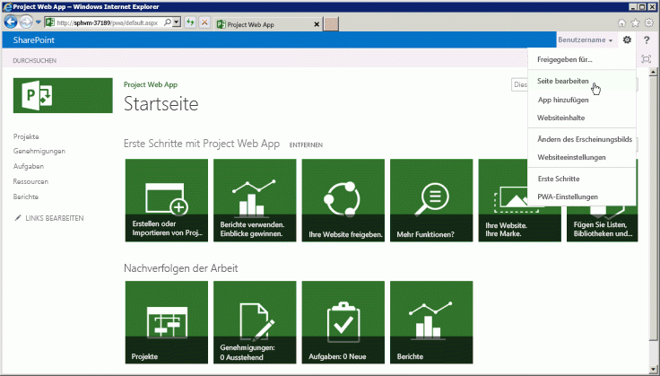
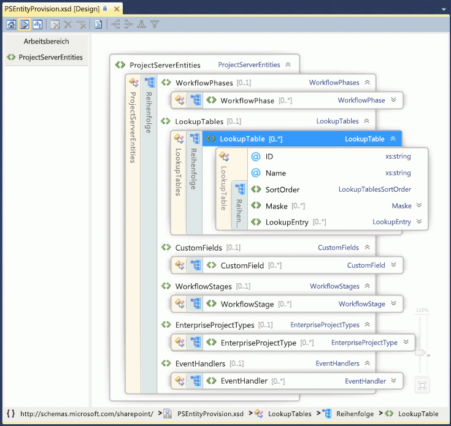

# Project Server-Programmierbarkeit

Informationen zu den wichtigsten Features zur Programmierbarkeit in Project Server 2013. Dieser Artikel enthält Informationen zum Portieren von Anwendungen, die für frühere Versionen von Project Server erstellt wurden.

Project Server 2013 wurde dafür ausgelegt, die meisten Anwendungen, die für Project Server 2010 entwickelt wurden, und neue Projektmappen für mehrere Plattformen zu unterstützen; dabei können die Apps sowohl auf lokale als auch auf Onlineinstallationen von Project Server zugreifen. Anwendungen und Erweiterungen, die für Project Server 2003 oder frühere Versionen entwickelt wurden, müssen neu gestaltet werden und das clientseitige Objektmodell (CSOM) oder die Project Server-Schnittstelle (PSI) verwenden. Für Anwendungen, die für Office Project Server 2007 oder Project Server 2010 entwickelt wurden, sind möglicherweise einige Änderungen und erneutes Kompilieren erforderlich, um die PSI zu verwenden; für die Verwendung von CSOM ist eine Neuentwicklung dieser Anwendungen erforderlich.
  
Die Project Server-Plattform ermöglicht durch ihr Fundament in SharePoint Server 2013, .NET Framework 4 und dem OData-Protokoll mit dem CSOM ein hohes Maß an Produktivität für Programmierer. Entwickler können Project Web App mit Apps, App-Webparts und Webparts erweitern, mithilfe von SharePoint Designer 2013 Workflows definieren und mithilfe von Remote-Ereignisempfängern für Project Server-Ereignisse Geschäftsregeln durchsetzen.
  
## Project Server und SharePoint Server

Project Web App basiert auf SharePoint Server 2013 und verwendet Masterseiten und Webparts, um das Erstellen von benutzerdefinierten Apps und Project Web App-Lösungen zu vereinfachen. Project Server 2013 ist tief mit SharePoint Server 2013 als der Plattform für Zusammenarbeit an Projekten, Berichterstellung, Websiteverwaltung, Sicherheit und Workflowmanagement integriert.
  
Die Projektwebsites enthalten weitere Informationen und Optionen zur Zusammenarbeit für Teammitglieder. Hier können Sie Standard-Apps hinzufügen, die eine Projektzusammenfassung, spezielle SharePoint-Listen für Vorgänge mit einer Zeitachse, Problemnachverfolgung, Risiken, Projektlieferumfänge und den Teamkalender zusammen mit der Dokumentbibliothek und Teamdiskussionen beinhalten. Benutzerdefinierte Apps für Project Server 2013 stellen Erweiterungen und Flexibilität für die Zusammenarbeit im Team zur Verfügung. Sie können außerdem App-Parts hinzufügen, um eine App anzupassen, indem Sie den gleichen Mechanismus zum Hinzufügen und Bearbeiten von Webparts wie beim Bearbeiten einer Seite verwenden. Projektwebsites können überall auf der SharePoint-Farm gehostet werden, auf der Project Server installiert ist. Wenn Sie weitere Kerndienste von SharePoint Server 2013 verwenden möchten, etwa die Excel Services oder die Unternehmenssuche, kann ein Administrator die Dienste aktivieren und konfigurieren. 
  
Bei der Installation von Project Server 2013 stellen Sie die Project-Dienstanwendung auf der SharePoint-Webdienste-Website bereit. Die Project-Dienstanwendung beinhaltet die lokalen WCF-Dienste (Windows Communication Foundation) und die ASMX-Webdienste für die PSI. Zu den weiteren Beispielen für Dienstanwendungen zählen die SharePoint-Suche und die SharePoint-Dokumentverwaltung. Weitere Informationen finden Sie in der SharePoint Server 2013-Entwicklerdokumentation.
  
Die Project-Dienstanwendung ist ein logischer Dienstanbieter, der mehrere Instanzen von Project Web App verwalten kann. Bei der Project Server-Bereitstellung wird eine spezielle Project Web App-Website innerhalb einer SharePoint-Webanwendung erstellt. Die Startseite von Project Web App enthält Links zur Projektcenter-Seite, zur Ressourcencenter-Seite und zur Business Intelligence Center-Seite für die Berichterstellung, außerdem eine Seite, die eine Liste mit weiteren Standard-Apps enthält. Abbildung 1 zeigt den Befehl **Seite bearbeiten** in der Dropdownliste **Einstellungen** auf der Startseite von Project Web App, mit dem Sie Webparts hinzufügen oder bearbeiten können. 
  
> [!NOTE]
> Einige Verwaltungsseiten in Project Web App – z. B. die Seite "PWA-Einstellungen" – können nicht bearbeitet werden, und auf ihnen wird der Befehl **Seite bearbeiten** nicht angezeigt. Project Web App erlaubt keine Bearbeitung von Seiten mithilfe von SharePoint Designer 2013. Sie können Seiten von Projektwebsites mit SharePoint Designer 2013 bearbeiten. 
  
**Abbildung 1. Verwenden des Menüs "Seite bearbeiten" in Project Web App**

  
Um auf die Seite "Websiteeinstellungen" in Project Web App zuzugreifen, wählen Sie das Symbol **Einstellungen** in der oberen rechten Ecke der Seite aus. Auf der Seite "Websiteeinstellungen" (`https://ServerName/ProjectServerName/_layouts/15/settings.aspx`) können Aussehen und Verhalten und das Design der Website geändert, benutzerdefinierte Webparts hinzugefügt und Masterseiten für Projektwebsites geändert oder erstellt werden.
  
Anpassen des Codes auf ASPX-Seiten oder Anpassung der Project Web App-Masterseiten mit SharePoint Designer 2013 wird nicht unterstützt. Die Anpassung des Codes auf Project Web App-Seiten kann zu Problemen mit Updates und Servicepacks für Project Server führen. 
  
### Anpassung von Project Web App mit SharePoint-Paketen

Da Project Web App eine SharePoint-Anwendung ist und Projektwebsites SharePoint-Websites sind, können Sie benutzerdefinierte Apps, Webparts, Ereignishandler, benutzerdefinierte Felder und weitere Features mithilfe von SharePoint-Paketen (WSP-Dateien) oder SharePoint-Apps (SPAPP-Dateien) hinzufügen. Ein SharePoint-Paket oder ein App-Paket kann mehrere Project Server-Entitäten enthalten, deren Entitätsdefinitionen in einer Datei "elements.xml" innerhalb des Pakets angegeben sind.
  
Für Project Online können Sie dem Project Web App-Menüband Schaltflächen hinzufügen, jedoch können Sie keine vorhandenen Produktschaltflächen entfernen oder umbenennen, und Sie können keine neuen Menübandregisterkarten erstellen. Weitere Informationen finden Sie unter [Erstellen benutzerdefinierter Aktionen zur Bereitstellung mit Apps für SharePoint](https://msdn.microsoft.com/library/office/apps/jj163954%28v=office.15%29.aspx).
  
> [!CAUTION]
> Wenn Sie ein SharePoint-Paket oder ein App-Paket installieren, müssen die Typen der Project Server-Entitäten in der Reihenfolge aufgeführt sein, die im Schema "PSEntityProvision.xsd" angegeben ist, andernfalls tritt ein Fehler bei der Schemaprüfung des Pakets auf, und die Installation wird nicht abgeschlossen. 
  
Die Schemadatei "PSEntityProvision.xsd" steht im Download des Project 2013 SDKs im Unterverzeichnis `Documentation\Schemas\AppProvisioning` zur Verfügung. Abbildung 2 zeigt die XML-Schema-Explorer-Ansicht des Schemas **PSEntityProvision** in Visual Studio mit erweiterter **LookupTable**-Sequenz. 
  
**Abbildung 2. Visual Studio-Ansicht des Project Server-Schemas zur Entitätsbereitstellung**

  
SharePoint-Pakete, mit denen Features für Project Server installiert werden, können eine oder mehrere elements.xml-Dateien enthalten, die dem Schema **PSEntityProvision** entsprechen. Die Project Server-Entitäten in einer einzelnen XML-Datei müssen in der folgenden Reihenfolge auftreten: 
  
1. Workflowphasen
    
2. Nachschlagetabellen
    
3. Benutzerdefinierte Felder
    
4. Workflowstufen
    
5. Enterprise-Projekttypen
    
6. Ereignishandler
    
Wenn Sie ein SharePoint-Paket erstellen, das Project Server-Entitäten enthält, können die Entitätsdefinitionen in mehreren elements.xml-Dateien platziert werden. Dabei könnte wohl jede XML-Datei die Schemaüberprüfung bestehen, trotzdem wären die Entitäten im Gesamtpaket möglicherweise nicht in der richtigen Reihenfolge. Beispielsweise könnte eine benutzerdefinierte Feldeigenschaft in der ersten XML-Datei auf eine Nachschlagetabelle in der zweiten XML-Datei verweisen. Während der Installation kann das benutzerdefinierte Feld nicht erstellt werden, da die Nachschlagetabelle noch nicht erstellt wurde.
  
Bei einem Fehler bei einer Paketinstallation verbleiben die bereits erstellten Pakete in Project Web App, das Paket wird jedoch nicht vollständig installiert. Eine erneute Installation des Pakets funktioniert möglicherweise, doch stellt dies keine gute Benutzererfahrung für Endkunden dar. Wenn die Entitätsdefinitionen sich über mehrere elements.xml-Dateien erstrecken, strukturieren Sie die Project Server-Entitäten im SharePoint-Gesamtpaket so, dass die Installation die richtige Reihenfolge einhält. Mithilfe des Schemas "PSEntityProvision.xsd" im Project 2013 SDK-Download können Sie ein Tool entwickeln, das die vorgeschriebene Reihenfolge der Entitäten in den XML-Dateien überprüft.
  
## Upgrade von Anwendungen mithilfe der Project Server-APIs

Wenn Sie ein Upgrade für eine Anwendung ausführen, die für eine frühere Project Server-Version entwickelt wurde, können Sie zwischen dem CSOM und der PSI als Programmierschnittstelle wählen, die Methoden zum Erstellen, Lesen, Aktualisieren und Löschen von Projektentitäten (die CRUD-Vorgänge) enthält. Zwar ruft das CSOM intern die PSI auf, es ersetzt aber nicht alle PSI-Methoden vollständig. Informationen zu Szenarien und Einschränkungen der PSI und des CSOMs finden Sie unter [What the PSI does and does not do](what-the-psi-does-and-does-not-do.md) (Was die PSI leistet und was nicht) und [What the CSOM does and does not do](what-the-csom-does-and-does-not-do.md) (Was das CSOM leistet und was nicht).
  
> [!NOTE]
> Wenn das CSOM die Funktionalität enthält, die Sie benötigen, empfehlen wir ein Upgrade von Anwendungen für die Verwendung des CSOMs. Mithilfe des CSOMs können Anwendungen sowohl für lokale als auch für Onlineinstallation en von Project Server 2013 verwendet werden. 
  
Wenn Ihre Anwendung in erster Linie Daten aus Project Server liest, können Sie die Berichtstabellen und Ansichten in der Project Server-Datenbank für ein lokales Szenario nutzen. Wenn Sie die Anwendung mit Project Online verwenden möchten, können Sie das OData-Protokoll für den **ProjectData**-Dienst verwenden, das sowohl lokalen als auch Onlinezugriff auf die Berichtsdaten bereitstellt. Weitere Informationen finden Sie in der [ProjectData – Project OData-Dienstreferenz](https://msdn.microsoft.com/library/office/jj163015.aspx)
  
### Verwenden der PSI

Die PSI ermöglicht Clientanwendungen mit voller Vertrauensstellung, darunter Project Professional 2013, Project Web App und Branchenanwendungen, den Zugriff auf Project Server-Daten innerhalb einer SharePoint-Farm. Die PSI wurde mit .NET Framework 4 erstellt, wird damit verwendet und bietet Vorteile wie eine bekannte Entwicklungsumgebung mit integrierter Sicherheit, Fehlerbehandlung und Garbagecollection.
  
Der Zugriff auf die PSI erfolgt über WCF-Dienste oder ASMX-Webdienste. Die ASMX-Schnittstelle basiert auf WCF. Jeder PSI-Dienst enthält normalerweise eine Basisklasse mit CRUD-Methoden für die in der Klasse enthaltenen Elemente. Die Elemente werden durch zugeordnete **DataSet**-Klassen angegeben. Beispielsweise enthält der Dienst **CustomFields** die Klasse **CustomFields** mit Methoden wie [CreateCustomFields2](https://msdn.microsoft.com/library/WebSvcCustomFields.CustomFields.CreateCustomFields2.aspx) . Daten für benutzerdefinierte Enterprise-Felder werden im **CustomFieldDataSet** angegeben.
  
> [!NOTE]
> Die ASMX-Webdienstschnittstelle der PSI wird in Project Server 2013 nicht mehr unterstützt. Die ASMX-Schnittstelle ist zwar noch verfügbar, neue Anwendungen, die die PSI nutzen, sollten jedoch die WCF-Schnittstelle verwenden oder, falls möglich, gleich das CSOM anstelle der PSI nutzen. Für zukünftige Versionen von Project Server wird ein Upgrade vorhandener ASMX-basierter Anwendungen auf die Nutzung der WCF-Schnittstelle der PSI oder des CSOMs erforderlich sein. 
  
Es gibt 22 öffentliche, dokumentierte PSI-Dienste, die in der WCF-Schnittstelle und in der ASMX-Schnittstelle dupliziert sind. Die PSI enthält darüber hinaus acht private, nicht dokumentierte Dienste. Project Web App und Project Professional verwenden die öffentlichen PSI-Dienste und die privaten PSI-Dienste. Die PSI wird in der Regel in die Zuordnung der Geschäftsobjekte einbezogen. Das heißt, jeder PSI-Methode wird ein Geschäftsobjekt, wie ein **Kalender** oder eine **Ressource**, zugeordnet. Die PSI bildet die Hauptschnittstelle der Geschäftsobjekte. Da die Geschäftsschicht wiederverwendbare Geschäftslogikkomponenten zur Verfügung stellt, verwenden verschiedene Anwendungen, die mit Project Server-Daten interagieren, die gleiche Geschäftslogik.
  
Die Namen von PSI-Methoden, die asynchron mit Project Server interagieren, beginnen mit **Queue**. Jede PSI-Methode ist mit einer separaten Schnittstelle implementiert, die stark typisierte Daten verwendet. Beispielsweise akzeptiert die **QueueCreateProject**-Methode im **Project**-Dienst den Parameter _dataset_ vom Typ **ProjectDataSet**. Die **ProjectDataSet**-Klasse ist vom **DataSet**-Typ abgeleitet. Typprüfung in .NET Framework und die IntelliSense-Ergänzung in Visual Studio helfen, Fehler in der Entwicklung für die PSI zu verringern. Eine Einführung in die detaillierte Referenz zu PSI-Namespaces, Klassen, Methoden, Eigenschaften, Ereignissen und den zugeordneten Assemblys finden Sie in der [Übersicht über die PSI-Referenz](project-psi-reference-overview.md).
  
Project Server 2013 verwendet das Exception Handling von .NET Framework. Alle Fehler werden auf dem Server protokolliert, am Anfang des PSI-Stapels. Einige Fehler senden einen einfachen Bericht an den Client, z. B. ein **SoapException**-Objekt für die ASMX-Schnittstelle oder ein **FaultException**-Objekt für die WCF-Schnittstelle. Ausnahmen können im Ereignisprotokoll der Anwendung aufgezeichnet werden, und für einige Fehler wird außerdem ein detaillierter Bericht auf dem Server in den Ablaufprotokollen des ULS-Diensts (Unified Logging Service) erfasst. 
  
Für lokale Anwendungen mit voller Vertrauensstellung ist die PSI darüber hinaus erweiterbar. Sie können eine .NET-Assembly mit einem Dienst hinzufügen, der neue Funktionen bereitstellt, die gleiche Project Server-Sicherheitsinfrastruktur verwendet und andere PSI-Methoden aufruft oder von PSI-Klassen erbt. Eine PSI-Erweiterung kann außerdem die Geschäftslogik und den Datenbankzugriff bereitstellen, die für die neuen Funktionen erforderlich sind.
  
### Verwenden des CSOM

Mit dem CSOM können Sie Apps entwickeln, die auf Project Online oder auf eine lokale Installation von Project Server 2013 zugreifen. Apps können in einem öffentlichen Office Store oder einem privaten App-Katalog bereitgestellt werden. Das CSOM wurde als leicht zu verwendende API ausgelegt, die Daten mit LINQ-Anfragen direkt anhand ihres Namens konsumiert oder bereitstellt, statt Datasets zu übergeben und _changeXml_-Parameter oder XML-_filter_-Parameter zu erzeugen. Das CSOM implementiert die Hauptfunktionalität der Project Server-Schnittstelle (PSI) für die wichtigsten Entitäten, wie **Projekt**, **Vorgang**, **EnterpriseResource** und **Zuordnung**. Das CSOM enthält viele weitere Entitäten, wie etwa **CustomField**, **LookupTable**, **WorkflowActivities**, **EventHandler** und **QueueJob**, die andere allgemeine Project Server-Funktionen unterstützen.
  
Das CSOM kann durch Kopieren der folgenden Ressourcen auf Ihren lokalen Entwicklungscomputer verwendet werden:
  
- Für .NET Framework 4-Entwicklung kopieren Sie die `%ProgramFiles%\Common Files\Microsoft Shared\Web Server Extensions\15\ISAPI\Microsoft.ProjectServer.Client.dll`-Assembly. 
    
  Die Dokumentation der CSOM-Klassen und -Member finden Sie im Namespace [Microsoft.ProjectServer.Client](https://msdn.microsoft.com/library/Microsoft.ProjectServer.Client.aspx). Eine Beispielanwendung finden Sie unter [Getting started with the CSOM and .NET](getting-started-with-the-project-server-csom-and-net.md) (Erste Schritte mit dem CSOM und .NET).
    
- Für Microsoft Silverlight-Entwicklung kopieren Sie die `%ProgramFiles%\Common Files\Microsoft Shared\Web Server Extensions\15\TEMPLATE\LAYOUTS\ClientBin\Microsoft.ProjectServer.Client.Silverlight.dll`-Assembly. 
    
- Um Apps für Windows Phone 8 zu entwickeln, kopieren Sie die `%ProgramFiles%\Common Files\Microsoft Shared\Web Server Extensions\15\TEMPLATE\LAYOUTS\ClientBin\Microsoft.ProjectServer.Client.Phone.dll`-Assembly. 
    
- Um JavaScript zum Entwickeln von Web-Apps und Apps für andere Geräte zu verwenden, kopieren Sie die `%ProgramFiles%\Common Files\Microsoft Shared\Web Server Extensions\15\TEMPLATE\LAYOUTS\PS.js`-Datei und die `PS.debug.js`-Datei. Eine Beispiel-Web-App finden Sie unter [Erste Schritte mit dem Project Server 2013 JavaScript-Objektmodell](getting-started-with-the-project-server-2013-javascript-object-model.md).
    
Das CSOM ruft intern die PSI auf; daher gilt: Wenn ein Auftrag von der PSI nicht ausgeführt werden kann, geht es auch nicht mit dem CSOM. Informationen zu Einschränkungen des CSOM finden Sie unter [What the CSOM does and does not do](what-the-csom-does-and-does-not-do.md) (Was das CSOM leistet und was nicht) und [What the PSI does and does not do](what-the-psi-does-and-does-not-do.md) (Was die PSI leistet und was nicht). Weitere Informationen zum Entwickeln mit dem CSOM finden Sie unter [Updates für Entwickler in Project 2013](updates-for-developers-in-project-2013.md) und [Clientseitiges Objektmodell (CSOM) für Project 2013](client-side-object-model-csom-for-project-2013.md).
  
### Portieren von Anwendungen, die für Project Server 2003 entwickelt wurden

In Project Server 2003 steht ein großer Teil der Daten und der Funktionalität nur in Project Professional 2003 oder durch direkten Datenbankzugriff zur Verfügung. Die PSI, die mit Project Server 2007 eingeführt wurde, beseitigt diese Einschränkung großenteils. Im Gegensatz zum Project Data Service (PDS) in Project Server 2003 stellen die PSI und das CSOM umfassende Schnittstellen zu Geschäftsobjekten in Project Server zur Verfügung.
  
Für den PDS entwickelte Anwendungen sind mit späteren Versionen von Project Server nicht kompatibel. Das CSOM und die PSI stehen funktional gleich mit dem PDS, bilden aber keine PDS-Methoden oder Parameter ab.
  
> [!NOTE]
> Da PDS-Anwendungen für Project Server 2013 vollständig neu entwickelt werden müssen, empfehlen wir die Verwendung des CSOM. 
  
Weitere Informationen zur PDS-Kompatibilität und Richtlinien zum Portieren von PDS-Erweiterungen zur PSI finden Sie unter [PDS Parity in PSI Web Services](https://msdn.microsoft.com/library/61a0b0c7-9b74-46d1-87ed-66ffdd8017f8%28Office.15%29.aspx) (PDS-Parität in PSI-Webdiensten).
  
### Portieren von Anwendungen, die für Project Server 2007 und Project Server 2010 entwickelt wurden

Die PSI in Project Server 2013 stellt eine Obermenge des PSI-Objektmodells in Office Project Server 2007 und Project Server 2010 dar. Viele für die zwei vorhergehenden Versionen von Project Server entwickelte Anwendungen können weiterhin lokal mit voller Vertrauensstellung in lokalen Installationen von Project Server 2013 ausgeführt werden. Für die folgenden Arten von Anwendungen sind jedoch Update oder Neuauslegung erforderlich:
  
- Verwenden Sie das CSOM für Anwendungen, die für die Verwendung mit Project Online angepasst sind.
    
- Verwenden Sie das CSOM für Anwendungen, die für die Verwendung auf mobilen Geräten und Tablet-PCs angepasst sind.
    
- Verwenden Sie das CSOM für Anwendungen, die als Apps im Office Store oder in einem privaten App-Katalog verfügbar sind.
    
- Verwenden Sie für Anwendungen, die den Projektplan ändern, das CSOM, oder ändern Sie die Anwendung so, dass sie die PSI-Methode [QueueUpdateProject2](https://msdn.microsoft.com/library/WebSvcProject.Project.QueueUpdateProject2.aspx) verwendet. 
    
- Lokale oder Webanwendungen, die Benutzer bei verschiedenen Instanzen von Project Web App anmelden, sollten programmgesteuerte Einstellungen für WCF-Endpunkte des CSOM oder der PSI verwenden. Diese Methoden sind veraltet. Apps sollten OAuth-Authentifizierung anstelle von formularbasierter Authentifizierung und für die Nutzung mit Project Online verwenden. Weitere Informationen finden Sie unter [Autorisierung und Authentifizierung für SharePoint-Add-Ins](https://msdn.microsoft.com/library/fp142384%28office.15%29.aspx#FileName_uniquekeyword1).
    
- Anwendungen, die auf spezifischen Sicherheitseinstellungen von Project Server aufbauen oder diese ändern.
    
  > [!NOTE]
  > Eine lokale Standardinstallation von Project Server 2013 verwendet den SharePoint-Berechtigungsmodus, in dem ein Zugriff auf die Project Server-Sicherheitseinstellungen über die PSI nicht möglich ist. Informationen zum Wechsel zum Project-Berechtigungsmodus finden Sie im Abschnitt *SharePoint Permission Mode* (SharePoint-Berechtigungsmodus) in [What's new for IT pros in Project Server 2013](https://technet.microsoft.com/de-DE/library/ff631142%28office.15%29.aspx#section13) (Neues für IT-Experten in Project Server 2013). 
  
- Für viele benutzerdefinierte Project Server-Workflows können Sie zur Erstellung deklarativer Workflows SharePoint Designer 2013 verwenden. Für benutzerdefinierte Workflows, für die zusätzliche Programmierung erforderlich ist, sollten Sie Klassen oder Member im **Microsoft.Office.Project.Server.Workflow**-Namespace *nicht* direkt verwenden. Verwenden Sie stattdessen die Klasse [Microsoft.ProjectServer.Client.WorkflowActivities](https://msdn.microsoft.com/library/Microsoft.ProjectServer.Client.WorkflowActivities.aspx) im CSOM. 
    
- Im Allgemeinen sollten Anwendungen, die Identitätswechsel verwenden, so umgeschrieben werden, dass sie die WCF-Schnittstelle der PSI verwenden. Anwendungen, die einfache Statusupdates für andere Benutzer ausführen, benötigen keinen Identitätswechsel. Sie können die Methode [StatusAssignment.SubmitStatusUpdates](https://msdn.microsoft.com/library/Microsoft.ProjectServer.Client.StatusAssignment.SubmitStatusUpdates.aspx) im CSOM oder die Methode [Statusing.SubmitStatusForResource](https://msdn.microsoft.com/library/WebSvcStatusing.Statusing.SubmitStatusForResource.aspx) in der PSI verwenden. 
    
- Middlewarekomponenten, die auf dem Project Server-Computer ausgeführt werden, können nur für die lokale Verwendung installiert werden und müssen die WCF-Schnittstelle der PSI verwenden. Beispielsweise muss eine Middlewarekomponente, die die ASMX-Schnittstelle für den Austausch von Daten zwischen einer lokalen Project Web App und einer externen Arbeitszeittabellen-Anwendung verwendet, so umgeschrieben werden, dass sie die WCF-Schnittstelle der PSI verwendet. Um mit Project Online zu funktionieren, müsste die Komponente als App neu entwickelt werden und das CSOM nutzen.
    
### Migration und Kompatibilität benutzerdefinierter Lösungen

Die Klassen und Member in den öffentlichen ASMX- und WCF-Schnittstellen der PSI sind identisch. Allerdings kann die Anzahl der von PSI-Methoden verwendeten oder zurückgegebenen Spalten oder Datentabellen zwischen Project Server 2013 und den zwei Project Server-Vorgängerversionen abweichen. Es gibt außerdem Unterschiede bei den Berichtstabellen und Ansichten im Vergleich mit der Berichtsdatenbank in den Vorgängerversionen.
  
> [!IMPORTANT]
> Es wird dringend empfohlen, Projektmappen gründlich in einer nicht für die Produktion verwendeten Installation von Project Server 2013 zu testen, bevor Sie sie auf einem Produktionsserver bereitstellen. 
  
Wenn Sie eine Projektmappe zu Project Server 2013 migrieren oder eine Projektmappe nicht wie erwartet funktioniert, sollten Sie mindestens die folgenden Aktionen ausführen:
  
- Führen Sie ein Update der Projektmappe aus, indem Sie sie in Visual Studio 2012 öffnen. Einige Projektmappen können auch Visual Studio 2010 verwenden.
    
- Ändern Sie das Ziel zu .NET Framework 4.
    
- Ändern Sie die Assemblyverweise so, dass die Project Server 2013-Assemblys verwendet werden, wie etwa "Microsoft.Office.Project.Server.Library.dll" und "Microsoft.Office.Project.Server.Events.Receivers.dll".
    
- Erstellen Sie eine Liste der ASMX-Webverweise oder der WCF-Dienstverweise und Namespacenamen, und löschen Sie dann die Project Server-Verweise.
    
- Fügen Sie die ProjectServerServices.dll-Proxyassembly, die Sie aus den WCF-Proxyquelldateien im Project 2013 SDK-Download erstellen können, oder die Proxyquelldateien für die erforderlichen WCF-Dienste hinzu. Fügen Sie für ASMX-Dienste die Verweise auf den Front-End-ASMX-Webdienst erneut hinzu, und verwenden Sie dazu die gleichen Namespacenamen, oder fügen Sie die ProjectServerServices.dll-Proxyassembly hinzu, die Sie aus den WSDL-Quellen im Project 2013 SDK-Download erstellen können.
    
  > [!NOTE]
  > Im Project 2013 SDK-Download beginnen die Namespaces in den Proxyquelldateien sämtlich mit *Svc*. Beispielsweise ist der Namespace des **Resource**-Diensts in der WCF-Proxydatei und in der ASMX-Proxydatei **SvcResource**. > Wenn Ihre Anwendung verschiedene Namespacenamen verwendet, können Sie entweder die Proxyassembly erneut kompilieren, damit sie Ihre Namespaces verwendet, oder die PSI-Namespaces in Ihrer Anwendung ändern. Beispielsweise können Sie das CompileWCFProxyAssembly.cmd-Skript ändern und "ProjectServerServices.dll" aus den Proxyquelldateien im SDK-Download erneut kompilieren. 
  
- Wenn Sie von der Verwendung der ASMX-Schnittstelle der PSI auf die WCF-Schnittstelle umstellen, können Sie den Clientzugriff entweder programmgesteuert oder mithilfe der WCF-Endpunkte in "app.config" initialisieren. Verwenden Sie die programmgesteuerte Initialisierung, wenn Sie schnell zu verschiedenen Instanzen von Project Web App wechseln müssen oder ein Webpart entwickeln, das die PSI nutzt.
    
- Es gibt eine Reihe neuer Methoden und Datasets in den PSI-Diensten in Project Server 2013, und einige **DataRow**-Klassen enthalten neue Eigenschaften. Beispielsweise verwendet die [QueueUpdateProject2](https://msdn.microsoft.com/library/WebSvcProject.Project.QueueUpdateProject2.aspx)-Methode in der PSI das Project Server-Planungsmodul, um ein aktualisiertes Projekt neu zu planen, ohne dass Sie das Projekt in Project Professional 2013 öffnen müssen, und erlaubt darüber hinaus das Hinzufügen oder Löschen von Projektentitäten im gleichen Aufruf. 
    
- Kompilieren und Testen der Lösung.
    
## Projektplanung auf dem Server

Project Server 2013 verfügt über zwei Planungsmodule. Bei dem neueren Planungsmodul handelt es sich um das Planungsmodul in Project Professional 2013. Wenn Sie Planungsänderungen vornehmen und die Änderungen mithilfe des Planungs-Webparts (Seite "Projektdetails") in Project Web App, auf einer Projektwebsite oder mithilfe des CSOMs veröffentlichen, sind die Berechnung von Datumswerten, Kosten, Dauer, verbleibender Arbeit, Basisplänen und sonstiger Änderungen im Zusammenhang mit der Neuplanung genau gleich wie die entsprechenden Änderungen und die Veröffentlichung mithilfe von Project Professional 2013. Mit Ausnahme der Methode [QueueUpdateProject2](https://msdn.microsoft.com/library/WebSvcProject.Project.QueueUpdateProject2.aspx) verwenden die PSI-Methoden das ältere Planungsmodul, das von Project Server 2010 migriert wurde. Der Grund ist, dass sichergestellt werden soll, dass sich Legacyanwendungen in Project Server 2013 genau so verhalten wie zuvor. 
  
> [!NOTE]
> Um das aktualisierte Planungsmodul in Project Server 2013 zu nutzen, können Anwendungen das CSOM verwenden. 
  
Sowohl für das ältere als auch für das neuere Planungsmodul gelten die folgenden Einschränkungen:
  
- **Nur Planung von einzelnen Projekten** Die Planung wirkt sich nur auf das aktuelle Projekt aus, wenn Änderungen mithilfe von Aktualisierungen des Vorgangsstatus mit der PSI oder dem CSOM oder mit Project Web App vorgenommen werden. Wenn das aktuelle Projekt Links zu anderen Projekten, Unterprojekten oder Masterprojekten aufweist, werden die verknüpften Projekte nicht geändert. 
    
- **Sammelvorgänge** Sammelvorgänge sind in Project Server grundsätzlich schreibgeschützt. Beispielsweise können keine Zuordnungen für Sammelvorgänge erstellt werden, und der Prozentsatz der Fertigstellung lässt sich nicht ändern. Project Server unterstützt jedoch das Bearbeiten von Datumswerten und Dauer von manuell geplanten Sammelvorgängen. 
    
    Ist-Werte in Project Server werden einer Zuordnung in einem Sammelvorgang nicht automatisch hinzugefügt, weil dadurch der Genehmigungsprozess in Project Server umgangen würde. Wenn Sie in Project Professional einem Teilvorgang Ist-Werte hinzufügen, werden die Ist-Werte außerdem einer Zuordnung im Sammelvorgang hinzugefügt. Der Unterschied im Verhalten kann für Benutzer verwirrend sein.
    
    Project Server löscht Ist-Werte in einer Sammelvorgangszuordnung, wenn sich die Dauer des Teilvorgangs verkürzt oder der Endtermin geändert wird.
    
    > [!CAUTION]
    > Obwohl Project Professional sie ausführen kann, empfehlen wir, keine Zuordnungen in Sammelvorgängen vorzunehmen. 
  
Diese Probleme und Beschränkungen der PSI-Programmierung bestehen in Verbindung mit dem älteren Project Server-Planungsmodul:
  
- **Ändern des aktiven Status eines Vorgangs** Das ältere Project Server-Planungsmodul kann inkonsistente Anfangs- und Endzeiten anzeigen, wenn Sie die [QueueUpdateProject](https://msdn.microsoft.com/library/WebSvcProject.Project.QueueUpdateProject.aspx)-Methode verwenden, um den aktiven Status eines Vorgangs zu ändern und mehrere Änderungen am **ProjectDataSet**-Objekt für den _dataset_-Parameter vorliegen. Wenn die **TASK_IS_ACTIVE**-Eigenschaft die einzige Änderung im _dataset_-Parameter von **QueueUpdateProject** darstellt, können Sie das Projekt aktualisieren.
    
    Weitere Informationen zu inaktiven Vorgängen und dem älteren Planungsmodul finden Sie in den Blogbeiträgen [Introducing inactive tasks in Project 2010](https://blogs.msdn.com/b/project/archive/2010/06/10/introducing-inactive-tasks-in-project-2010.aspx) (Einführung inaktiver Vorgänge in Project 2010) und [Project Server 2010: Scheduling on the web, the PSI and Project Professional](https://blogs.msdn.com/b/brismith/archive/2010/09/10/project-server-2010-scheduling-on-the-web-the-psi-and-project-professional.aspx?wa=wsignin1.0) (Project Server 2010: Planen im Web, in der PSI und in Project Professional). Einen Vergleich der Planung in Project Professional 2010 und Project Web App in Project Server 2010 finden Sie unter [Vergleich der webbasierten Zeitplanverwaltung](https://blogs.msdn.microsoft.com/brismith/2010/09/10/project-server-2010-scheduling-on-the-web-the-psi-and-project-professional/).
    
- **Ertragswert nicht berechnet** Das ältere Planungsmodul berechnet nicht die Ertragswertfelder: IKAA, PK, SKAA, SKBA, KLI, KA, KA%, BK, PLI, PA, PA%, ALI, ANA, Abweichung Dauer, Abweichung Anfang, Abweichung Ende, Abweichung Kosten und Abweichung Arbeit. Wenn ein Projekt Werte für diese Felder aufweist und das Projekt mithilfe der Methode **QueueUpdateProject** aktualisiert wird, ändern sich die Feldwerte nicht. Um das Problem zu vermeiden, verwenden Sie die Methode **QueueUpdateProject2**. 
    
Sie können mit den PSI-Planungsbeschränkungen folgendermaßen umgehen:
  
- Wenn das CSOM über die von der Anwendung benötigten Methoden verfügt, verwenden Sie das CSOM anstelle der PSI.
    
- Öffnen Sie Projekte in Project Professional, und speichern Sie sie wieder nach Project Server.
    
- Nehmen Sie in Berichte keine Felder auf, die von der PSI nicht aktualisiert werden.
    
- Fügen Sie in Berichten eine Anmerkung zu möglicherweise veralteten Daten hinzu.
    
Es gibt Kennzeichnungen in den Berichtstabellen und Cubes, die Ihnen helfen, nicht aktualisierte Projektdaten zu ermitteln. Die Berichtsdaten in der Tabelle "MSP_EpmProject" und in "MSP_EpmProject_UserView" beinhalten die folgenden Felder: 
  
-  _ProjectWbsIsStale_ &ndash; gibt an, ob der Projektstrukturplan (Vorgangsgliederungshierarchie) veraltet ist. 
    
-  _ProjectEarnedValueIsStale_ &ndash; gibt an, dass die Ertragswertfelder veraltet sind. 
    
-  _ProjectRollupsAreStale_ &ndash; gibt an, dass ein Teilprojekt in der Entwurfsdatenbank aktualisiert wurde, das Hauptprojekt aber nicht aktualisiert wurde. Die Rollupwerte aus dem Teilprojekt sind veraltet. 
    
-  _ProjectHierarchyNotSynchronized_ &ndash; das Hauptprojekt ist nicht mit seinen untergeordneten Projekten synchronisiert. Dies geschieht, wenn die untergeordneten Projekte explizit veröffentlicht werden, nicht im Rahmen der Veröffentlichung des Hauptprojekts. 
    
-  _ProjectCalculationsAreStale_ &ndash; Project Professional hat ein Projekt gespeichert, ohne den Zeitplan zu berechnen (d. h., der Berechnungsmodus ist im Dialogfeld **Projektoptionen** auf der Registerkarte **Zeitplan** auf **Manuell** festgelegt). 
    
-  _ProjectGhostTaskAreStale_ &ndash; Ähnlich wie _ProjectHierarchyNotSynchronized_, warnt aber für projektübergreifend verknüpfte Daten. Es ist möglich, dass kein Hauptprojekt vorhanden ist, die Projektdaten auf einer Seite der Verknüpfung aber neuer als auf der anderen sind.
    
## Informationen zum Zugriff auf die Project Server-Datenbank

Wenn Sie in Microsoft SQL Server über Berechtigungen zum Zugriff auf die Project Server-Datenbank verfügen, können Sie die Berichtstabellen und Ansichten anzeigen. Wenn Sie über die erforderlichen Project Server-Berechtigungen verfügen, können Sie außerdem mithilfe von OData-Abfragen Daten aus den Berichtstabellen auslesen. Entwicklern wird dringend davon abgeraten, mithilfe von SQL Server-Abfragen direkt auf die Entwurfs-, die veröffentlichten oder die Archivtabellen in der Project Server-Datenbank zuzugreifen. Das Vornehmen direkter Änderungen an einer der Tabellen in der Project Server-Datenbank kann die referenzielle Integrität beschädigen und den Datenbankzugriff durch den Project Server-Warteschlangendienst beeinträchtigen.
  
> [!IMPORTANT]
> Es gibt keine Mechanismen, die Sie aktiv daran hindern, direkten programmgesteuerten Datenzugriff zu verwenden, um Daten zu aktualisieren. Ihnen sollte aber bewusst sein, dass der Project Professional-Cache, die veröffentlichten Tabellen und die Berichtstabellen allesamt auf einem Protokoll zur Cachesynchronisierung aufbauen, das durch direkte Bearbeitung von Daten gestört werden kann. Wenn Sie Ihre Project Server-Datenbank beschädigen oder die clientseitigen Caches von Project Professional durch das Ändern von Daten durch direkten Zugriff ungültig machen, lassen Sie sich warnen, dass der Produktsupport Ihnen in diesem Fall nicht helfen kann! 
  
Anwendungen, die direkt auf die Entwurfs-, die veröffentlichten oder die Archivtabellen und -ansichten zugreifen, hängen außerdem von den Datenbankschemas ab, die sich in Service Packs oder in späteren Versionen von Project Server 2013 ändern können. Anwendungen, die direkt auf die Datenbanken zugreifen, umgehen außerdem die integrierten Features von Project Server zu Sicherheit, allgemeiner Geschäftslogik, Nachverfolgung, Überwachung, Fehlerprüfung, Workflow und anderen Gebieten. Wahrscheinlich müssten Sie eine solche Anwendung nach Project Server 2013-Updates neu entwickeln. 
  
Aus allen diesen Gründen führen Project Professional und Project Web App keine direkten Aufrufe an die Entwurfs-, veröffentlichten oder Archivtabellen aus; ebenso wenig sollten das Anwendungen tun, die sich in Project Server integrieren.
  
Die Schemas für die Entwurfs-, veröffentlichten und Archivtabellen sind nicht dokumentiert. Sie können die Berichtstabellen verwenden, um die Erstellung von Berichten zu unterstützen, und das Schema für die Berichtstabellen und -ansichten ist im Project 2013 SDK-Download dokumentiert. Informationen des OData-Schemas für die Berichtsdaten finden Sie unter [ProjectData – Project OData-Dienstreferenz](https://msdn.microsoft.com/library/office/jj163015.aspx).
  
## Siehe auch

- [Updates für Entwickler in Project 2013](updates-for-developers-in-project-2013.md)    
- [Project Server 2013-Architektur](project-server-2013-architecture.md)    
- [Was die PSI durchführen kann und was nicht](what-the-psi-does-and-does-not-do.md)   
- [Was das CSOM durchführen kann und was nicht](what-the-csom-does-and-does-not-do.md)    
- [Clientseitiges Objektmodell (CSOM) für Project 2013](client-side-object-model-csom-for-project-2013.md)    
- [Erste Schritte beim Entwickeln von Project Server-Workflows](getting-started-developing-project-server-workflows.md)    
- [Project 2013 Programmierreferenzen](project-2013-programming-references.md)    
- [Übersicht über die Project PSI-Referenz](project-psi-reference-overview.md)    
- [Erstellen benutzerdefinierter Aktionen zur Bereitstellung mit Apps für SharePoint](https://msdn.microsoft.com/library/office/apps/jj163954%28v=office.15%29.aspx)    
- [Introducing Inactive Tasks in Project 2010](https://blogs.msdn.com/b/project/archive/2010/06/10/introducing-inactive-tasks-in-project-2010.aspx) (Einführung inaktiver Vorgänge in Project 2010)    
- [Project Server 2010: Scheduling on the Web, the PSI and Project Professional](https://blogs.msdn.microsoft.com/brismith/2010/09/10/project-server-2010-scheduling-on-the-web-the-psi-and-project-professional/) (Project Server 2010: Planen im Web, die PSI und Project Professional)

