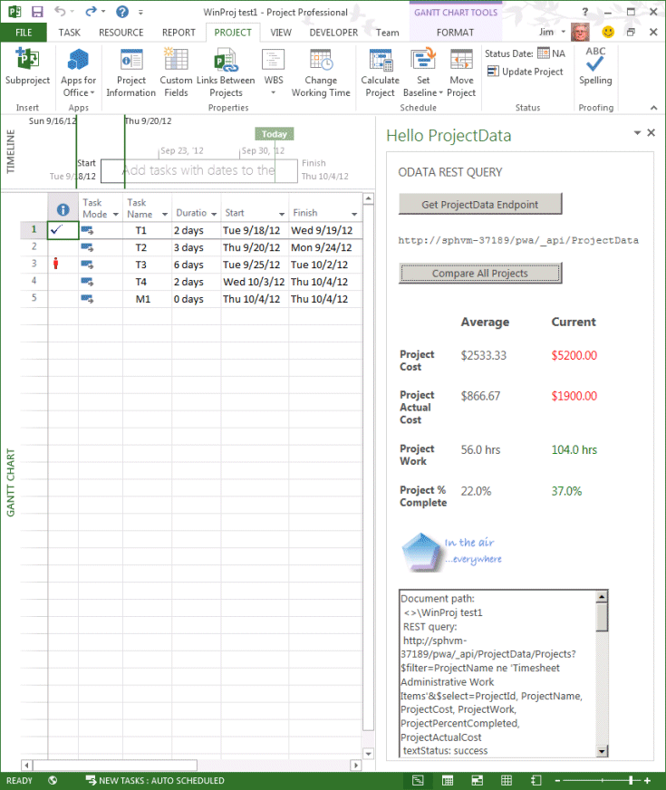

# <a name="updates-for-developers-in-project"></a><span data-ttu-id="1fe20-103">Updates für Entwickler in Project</span><span class="sxs-lookup"><span data-stu-id="1fe20-103">Updates for developers in Project</span></span>

<span data-ttu-id="1fe20-104">Erweiterungsmöglichkeiten in Project Server 2013 arbeiten mit der add-ins für Project Online und mit-Installationen vor Ort.</span><span class="sxs-lookup"><span data-stu-id="1fe20-104">Extensibility features in Project Server 2013 work with add-ins for Project Online and with on-premises installations.</span></span> <span data-ttu-id="1fe20-105">Neue Features umfassen eine Client-seitigen Objektmodell (CSOM), die REST-Schnittstellen, die einen OData-Dienst für reporting, remote-Ereignisempfänger, deklarative Workflows und Task Pane-add-ins für Project-Clients.</span><span class="sxs-lookup"><span data-stu-id="1fe20-105">New features include a client-side object model (CSOM), REST interfaces, an OData service for reporting, remote event receivers, declarative workflows, and task pane add-ins for Project clients.</span></span> <span data-ttu-id="1fe20-106">Auch Informationen Sie zu veralteten Features, die nicht für die Entwicklung neuer verwendet werden soll.</span><span class="sxs-lookup"><span data-stu-id="1fe20-106">Also learn about deprecated features that should not be used for new development.</span></span>
  
<span data-ttu-id="1fe20-107">Projektserver 2013 basiert auf dem Framework mit Microsoft Office Project Server 2007 eingeführt und von Project Server 2010 erweitert.</span><span class="sxs-lookup"><span data-stu-id="1fe20-107">Project Server 2013 builds on the framework introduced with Microsoft Office Project Server 2007 and extended by Project Server 2010.</span></span> <span data-ttu-id="1fe20-108">Projektserver 2013 Fügt eine Client-seitigen Objektmodell (CSOM), das umgestaltet wird von Project Server Interface (PSI) vereinfacht und enthält eine JavaScript-Bibliothek und .NET Framework 4-Bibliotheken für apps Windows, Windows Phone 8 und Microsoft Silverlight.</span><span class="sxs-lookup"><span data-stu-id="1fe20-108">Project Server 2013 adds a client-side object model (CSOM) that is refactored and simplified from the Project Server Interface (PSI), and includes a JavaScript library and .NET Framework 4 libraries for Windows apps, Windows Phone 8, and Microsoft Silverlight.</span></span> <span data-ttu-id="1fe20-109">Das CSOM ist darauf ausgelegt, für die Entwicklung für Project Online und kann auch mit einer lokalen Project Server-Installation.</span><span class="sxs-lookup"><span data-stu-id="1fe20-109">The CSOM is designed for development for Project Online, and also works with an on-premises Project Server installation.</span></span> 

<span data-ttu-id="1fe20-110">Die Project Server-Datenbanken werden in eine einzelne Datenbank kombiniert. Sie können die online reporting Tabellen und Ansichten über einen OData-Dienst zugreifen.</span><span class="sxs-lookup"><span data-stu-id="1fe20-110">The Project Server databases are combined into a single database; you can access the online reporting tables and views through an OData service.</span></span> <span data-ttu-id="1fe20-111">Das CSOM und des OData-Diensts enthalten eine Schnittstelle Representational State Transfer (REST).</span><span class="sxs-lookup"><span data-stu-id="1fe20-111">The CSOM and the OData service include a Representational State Transfer (REST) interface.</span></span> <span data-ttu-id="1fe20-112">Project Server-Workflows können mithilfe von SharePoint Designer 2013 erstellt werden.</span><span class="sxs-lookup"><span data-stu-id="1fe20-112">Project Server workflows can be created by using SharePoint Designer 2013.</span></span> <span data-ttu-id="1fe20-113">Project Professional 2013 kann in Project Server-Daten, SharePoint-Aufgabenlisten und andere externe Inhalte mithilfe des Office-Add-ins Erweiterbarkeit-Modells für Aufgabenbereiche reporting integriert werden.</span><span class="sxs-lookup"><span data-stu-id="1fe20-113">Project Professional 2013 can integrate with Project Server reporting data, SharePoint task lists, and other external content by using the Office Add-ins extensibility model for task panes.</span></span> <span data-ttu-id="1fe20-114">Project Standard 2013 kann Task Pane-add-ins verwenden, um allgemeine externe Inhalte zu integrieren.</span><span class="sxs-lookup"><span data-stu-id="1fe20-114">Project Standard 2013 can use task pane add-ins to integrate with general external content.</span></span>
  
<span data-ttu-id="1fe20-115">Diagramme und Weitere Informationen zu den wichtigsten Änderungen in Project Server 2013 finden Sie unter [Architektur von Project Server 2013](project-server-2013-architecture.md).</span><span class="sxs-lookup"><span data-stu-id="1fe20-115">For diagrams and more information about major changes in Project Server 2013, see [Project Server 2013 architecture](project-server-2013-architecture.md).</span></span>
  
> [!NOTE]
> <span data-ttu-id="1fe20-116">Projektserver 2013 basiert auf der Plattform für SharePoint Server 2013 und Project 2013 enthält einen Großteil der gleichen Infrastruktur als andere Office 2013-Anwendungen.</span><span class="sxs-lookup"><span data-stu-id="1fe20-116">Project Server 2013 is built on the SharePoint Server 2013 platform, and Project 2013 includes much of the same infrastructure as the other Office 2013 applications.</span></span> <span data-ttu-id="1fe20-117">Eine Dokumentation der einzelnen Details des Modells für SharePoint-Add-ins, SharePoint-basierten Workflows finden Sie unter Webparts, Entwicklung mit anderen SharePoint-Features und eine Dokumentation der Office-Add-ins, [SharePoint-Add-ins](https://docs.microsoft.com/sharepoint/dev/sp-add-ins/sharepoint-add-ins), [Office-Add-ins](https://docs.microsoft.com/office/dev/add-ins/overview/office-add-ins)und [SharePoint Übersicht über die Entwicklung von 2013](https://msdn.microsoft.com/library/jj164084%28office.15%29.aspx).</span><span class="sxs-lookup"><span data-stu-id="1fe20-117">For documentation of the model for SharePoint Add-ins, SharePoint-based workflows, Web Parts, development with other SharePoint features, and documentation of Office Add-ins, see [SharePoint Add-ins](https://docs.microsoft.com/sharepoint/dev/sp-add-ins/sharepoint-add-ins), [Office Add-ins](https://docs.microsoft.com/office/dev/add-ins/overview/office-add-ins), and [SharePoint 2013 development overview](https://msdn.microsoft.com/library/jj164084%28office.15%29.aspx).</span></span> 
  
## <a name="major-new-features-in-project-2013"></a><span data-ttu-id="1fe20-118">Wichtigsten neuen Features in Project 2013</span><span class="sxs-lookup"><span data-stu-id="1fe20-118">Major new features in Project 2013</span></span>
<span data-ttu-id="1fe20-119"><a name="pj15_WhatsNew_MajorNewFeatures"> </a></span><span class="sxs-lookup"><span data-stu-id="1fe20-119"></span></span>

<span data-ttu-id="1fe20-120">Neue Features in Project Standard 2013 und Project Professional 2013 umfassen eine verbesserte Benutzeroberfläche, die andere Office 2013-Anwendungen entspricht und unterstützt die modernen Style-Benutzeroberfläche in Windows 8, Integration in Office Art-Objekte für Berichte, burndown Berichte und neue Programmierbarkeit Features für Berichte.</span><span class="sxs-lookup"><span data-stu-id="1fe20-120">New features in Project Standard 2013 and Project Professional 2013 include an improved user interface that matches other Office 2013 applications and supports the modern style user interface in Windows 8, integration with Office Art objects for reports, burndown reports, and new programmability features for reports.</span></span> <span data-ttu-id="1fe20-121">Project Professional 2013 ermöglicht eine ausführlichere Freigabe und Synchronisierung von Projekten in SharePoint Server 2013, zusammen mit der Task Pane-add-ins, die auch in anderen Office 2013-Anwendungen wie Word, Excel und Outlook implementiert sind.</span><span class="sxs-lookup"><span data-stu-id="1fe20-121">Project Professional 2013 enables more extensive sharing and synchronizing projects on SharePoint Server 2013, along with the task pane add-ins that are also implemented in other Office 2013 applications such as Word, Excel, and Outlook.</span></span>
  
<span data-ttu-id="1fe20-122">Es gibt viele neue Features in Project Server 2013.</span><span class="sxs-lookup"><span data-stu-id="1fe20-122">There are many new features in Project Server 2013.</span></span> <span data-ttu-id="1fe20-123">Einige verfügen nicht über die wichtigsten Programmierbarkeit Textabschnitt, wie die neuen Zeitachse in Project Web App.</span><span class="sxs-lookup"><span data-stu-id="1fe20-123">Some do not have a major programmability story, such as the new timeline in Project Web App.</span></span> <span data-ttu-id="1fe20-124">Diese Features werden in der Produktdokumentation Hilfe und Endbenutzer auf Microsoft Office Online und in den Themen in der Übergangsphase Administratoren und IT-Experten im Microsoft TechNet dokumentiert.</span><span class="sxs-lookup"><span data-stu-id="1fe20-124">Those features will be documented in the product help and end-user documentation on Microsoft Office Online and in topics targeted at administrators and IT professionals on Microsoft TechNet.</span></span> <span data-ttu-id="1fe20-125">Andere neuen Funktionen, beispielsweise verbesserte Arbeitszeittabellen erleichtern für Entwickler von Drittanbietern zur Interaktion mit Arbeitszeittabellen und statuserfassung über Project Server Interface (PSI).</span><span class="sxs-lookup"><span data-stu-id="1fe20-125">Other new features, such as improved timesheets, make it easier for third-party developers to interact with timesheets and statusing through the Project Server Interface (PSI).</span></span>
  
<span data-ttu-id="1fe20-126">Das Hinzufügen von Project Online und den Office Store (https://office.microsoft.com/store) für Projekt-add-ins weit reichende Änderungen sind, auf dem Project Server über Microsoft Azure zugänglich ist.</span><span class="sxs-lookup"><span data-stu-id="1fe20-126">The addition of Project Online and the Office Store (https://office.microsoft.com/store) for Project add-ins are far-reaching changes, where Project Server is accessible through Microsoft Azure.</span></span> <span data-ttu-id="1fe20-127">Cloud-basierten Zugriff auf Project Server verwendet ein Client-seitigen Objektmodell (CSOM) für die Entwicklung von add-ins mit dem Microsoft .NET Framework, Microsoft Silverlight, Windows Phone und Web-apps, die JavaScript verwenden.</span><span class="sxs-lookup"><span data-stu-id="1fe20-127">Cloud-based access to Project Server uses a client-side object model (CSOM) for development of add-ins with the Microsoft .NET Framework, Microsoft Silverlight, Windows Phone, and web apps that use JavaScript.</span></span> <span data-ttu-id="1fe20-128">Eine Anforderung von Project Online ist, dass die vier Project Server-Datenbanken aus früheren Versionen in einer einzigen Datenbank zusammengeführt werden.</span><span class="sxs-lookup"><span data-stu-id="1fe20-128">A requirement of Project Online is that the four Project Server databases of previous versions are merged into one database.</span></span>
  
<span data-ttu-id="1fe20-129">Project Server 2013 Leistung und Skalierbarkeit wird in vielen Bereichen wie Vorgangsstatus, Arbeitszeittabellen und Projektmanagement verbessert.</span><span class="sxs-lookup"><span data-stu-id="1fe20-129">Project Server 2013 performance and scalability is improved in many areas such as task status, timesheets, and project management.</span></span> <span data-ttu-id="1fe20-130">Project Server-Workflows werden mit 4-Version von Windows Workflow Foundation (WF4) neu gestaltet.</span><span class="sxs-lookup"><span data-stu-id="1fe20-130">Project Server workflows are redesigned with version 4 of Windows Workflow Foundation (WF4).</span></span> <span data-ttu-id="1fe20-131">Verwendung der .NET Framework 4 und Windows Communication Foundation (WCF) mit der PSI verbessert die Sicherheit, Leistung und Skalierbarkeit.</span><span class="sxs-lookup"><span data-stu-id="1fe20-131">Use of the .NET Framework 4 and Windows Communication Foundation (WCF) with the PSI improves security, performance, and scalability.</span></span> <span data-ttu-id="1fe20-132">Beispielsweise können Sie das Transportprotokoll der WCF-basierte Anwendungen ändern, mithilfe von Konfigurationsdateien, ohne den Code ändern oder neu zu kompilieren.</span><span class="sxs-lookup"><span data-stu-id="1fe20-132">For example, you can change the transport protocol of WCF-based applications by using configuration files, without changing the application code or recompiling.</span></span> <span data-ttu-id="1fe20-133">Project Web App speichert viele der PSI-Aufrufe, in dem Daten nicht erheblich geändert wird.</span><span class="sxs-lookup"><span data-stu-id="1fe20-133">Project Web App caches many of the PSI calls where data does not change significantly.</span></span>
  
> [!NOTE]
> <span data-ttu-id="1fe20-134">Für die Entwicklung mit Project Server 2013 können Sie Visual Studio mit den Office und SharePoint-Tools-Erweiterungen, die systemintern-add-ins für Office 2013-Produkte erstellen können.</span><span class="sxs-lookup"><span data-stu-id="1fe20-134">For development with Project Server 2013, you can use Visual Studio with the Office and SharePoint tools extensions, which can natively create add-ins for the Office 2013 products.</span></span> <span data-ttu-id="1fe20-135">Projektserver 2013 erfordert Visual Studio, um die Entwicklung von Features wie Projektdetailseiten und WCF-basierte Anwendungen vollständig zu aktivieren.</span><span class="sxs-lookup"><span data-stu-id="1fe20-135">Project Server 2013 requires Visual Studio to fully enable development of features such as project detail pages and WCF-based applications.</span></span> <span data-ttu-id="1fe20-136">Die SharePoint-Tools-Erweiterungen in Visual Studio können Webparts und anderen SharePoint-Features direkt in Project Web App und anderen SharePoint-Websites bereitstellen.</span><span class="sxs-lookup"><span data-stu-id="1fe20-136">The SharePoint tools extensions in Visual Studio can deploy Web Parts and other SharePoint features directly to Project Web App and other SharePoint sites.</span></span> 
>
> <span data-ttu-id="1fe20-137">Visual Studio ist nicht mehr erforderlich, zum Entwickeln von Project Server-Workflows, mit denen benutzerdefinierte Felder, Phasen, Phasen und Enterprise-Projekttypen, die in Project Web App verwaltet werden können.</span><span class="sxs-lookup"><span data-stu-id="1fe20-137">Visual Studio is no longer required to develop Project Server workflows that use custom fields, stages, phases, and enterprise project types that can be managed in Project Web App.</span></span> <span data-ttu-id="1fe20-138">Obwohl Sie Visual Studio zum Entwickeln von Workflows verwenden können, sind sie häufig leichter und schneller zu erstellen, indem Sie mithilfe von SharePoint Designer.</span><span class="sxs-lookup"><span data-stu-id="1fe20-138">Although you can use Visual Studio to develop workflows, they are often easier and quicker to create by using SharePoint Designer.</span></span> <span data-ttu-id="1fe20-139">Visual Studio kann für Workflows verwendet werden, die Zugriff auf das CSOM oder andere externe APIs erfordern.</span><span class="sxs-lookup"><span data-stu-id="1fe20-139">Visual Studio can be used for workflows that require access to the CSOM or other external APIs.</span></span> 
  
### <a name="project-add-ins"></a><span data-ttu-id="1fe20-140">Project-Add-ins</span><span class="sxs-lookup"><span data-stu-id="1fe20-140">Project add-ins</span></span>
<span data-ttu-id="1fe20-141"><a name="pj15_WhatsNew_Apps"> </a></span><span class="sxs-lookup"><span data-stu-id="1fe20-141"></span></span>

<span data-ttu-id="1fe20-142">Vertrieb und Marketing Software hat wurde mit dem Konzept ein Add-in revolutioniert.</span><span class="sxs-lookup"><span data-stu-id="1fe20-142">Distribution and marketing of software has been revolutionized with the concept of an add-in.</span></span> <span data-ttu-id="1fe20-143">Für Project 2013 können-add-ins für Erwerb und Download zur Verfügung gestellt, aus dem öffentlichen Office Store oder in einem privaten Katalog unter SharePoint verteilt werden.</span><span class="sxs-lookup"><span data-stu-id="1fe20-143">For Project 2013, add-ins can be made available for purchase and download from the public Office Store or distributed within a private catalog on SharePoint.</span></span> <span data-ttu-id="1fe20-144">Ein Add-In wird in der Regel eine eigenständige, interaktive Programm, das eine kleine Anzahl von Aufgaben im Zusammenhang mit ausführt.</span><span class="sxs-lookup"><span data-stu-id="1fe20-144">An add-in is typically a self-contained, interactive program that performs a small number of related tasks.</span></span> <span data-ttu-id="1fe20-145">Ein Projekt-Add-in kann ein Task Pane Add-in für die Project Standard 2013 oder Project Standard 2013-Clients oder ein Add-In für Project Server 2013 oder Project Online.</span><span class="sxs-lookup"><span data-stu-id="1fe20-145">A Project add-in can be a task pane add-in for the Project Standard 2013 or Project Standard 2013 clients, or an add-in for Project Server 2013 or Project Online.</span></span>
  
<span data-ttu-id="1fe20-146">Informationen zu Add-Ins für die Project-desktop-Clients finden Sie unter [Task Pane-add-ins in Project](#pj15_WhatsNew_Agave).</span><span class="sxs-lookup"><span data-stu-id="1fe20-146">For information about add-ins for the Project desktop clients, see [Task pane add-ins in Project](#pj15_WhatsNew_Agave).</span></span> <span data-ttu-id="1fe20-147">Ein Beispiel für Project Server 2013 finden Sie unter [Erstellen einer SharePoint gehosteten Project Server-add-in](create-a-sharepoint-hosted-project-server-add-in.md).</span><span class="sxs-lookup"><span data-stu-id="1fe20-147">For a Project Server 2013 example, see [Create a SharePoint-hosted Project Server add-in](create-a-sharepoint-hosted-project-server-add-in.md).</span></span> <span data-ttu-id="1fe20-148">Zusätzlich zu den Artikeln in [Office und SharePoint-Add-ins SDK](https://msdn.microsoft.com/library/fp161507.aspx)hat der [Office-Blog](https://blogs.office.com/dev/) viele Beiträge, die auch für Project 2013 und Project Online relevant sind.</span><span class="sxs-lookup"><span data-stu-id="1fe20-148">In addition to articles in the [Office and SharePoint Add-ins SDK](https://msdn.microsoft.com/library/fp161507.aspx), the [Office Blog](https://blogs.office.com/dev/) has many posts that are also relevant to Project 2013 and Project Online.</span></span> 
  
<span data-ttu-id="1fe20-149">Ein Add-In für Project Server 2013 kann mit einer lokalen Installation und Project Online arbeiten.</span><span class="sxs-lookup"><span data-stu-id="1fe20-149">An add-in for Project Server 2013 can work with both an on-premises installation and Project Online.</span></span> <span data-ttu-id="1fe20-150">Project Server-add-ins kann Webparts, remote-Ereignisempfänger und Geschäftslogik enthalten.</span><span class="sxs-lookup"><span data-stu-id="1fe20-150">Project Server add-ins can include Web Parts, remote event receivers, and business logic.</span></span> <span data-ttu-id="1fe20-151">Zugriff auf das Objektmodell von Project Server in einem Add-in ist über die CSOM, nicht die PSI.</span><span class="sxs-lookup"><span data-stu-id="1fe20-151">Access to the Project Server object model in an add-in is through the CSOM, not the PSI.</span></span> <span data-ttu-id="1fe20-152">Datenspeicher kann Cloud-basierten wie mit SQL Azure, wie beispielsweise über Microsoft Business Connectivity Services (BCS), interne mit einer lokalen Datenbank, externe oder gemischten sein.</span><span class="sxs-lookup"><span data-stu-id="1fe20-152">Data storage can be cloud-based such as with SQL Azure, external such as through Microsoft Business Connectivity Services (BCS), internal with a local database, or mixed.</span></span>
  
#### <a name="add-in-security"></a><span data-ttu-id="1fe20-153">Add-in-Sicherheit</span><span class="sxs-lookup"><span data-stu-id="1fe20-153">Add-in security</span></span>

<span data-ttu-id="1fe20-154">Im Allgemeinen sind Aktionen, die ein Add-in im Auftrag des Benutzers ausgeführt, die das Add-in ausgeführt wird. Sie verwenden nicht explizit Identitätswechsel oder angeben, die das Add-in ausgeführt werden kann.</span><span class="sxs-lookup"><span data-stu-id="1fe20-154">In general, actions that an add-in takes are performed on behalf of the user who runs the add-in; you do not explicitly use impersonation or specify who can run the add-in.</span></span> <span data-ttu-id="1fe20-155">Aktionen darf die Berechtigungsstufe des Benutzers nicht überschreiten, die das Add-in ausgeführt wird.</span><span class="sxs-lookup"><span data-stu-id="1fe20-155">Actions cannot exceed the permission level of the user who runs the add-in.</span></span> 
  
<span data-ttu-id="1fe20-156">In den Office Developer Tools für Visual Studio 2012 hat die AppManifext.xml-Datei einen Grafiken-Editor, in dem Sie den berechtigungsanforderungsbereich festlegen.</span><span class="sxs-lookup"><span data-stu-id="1fe20-156">In Office Developer Tools for Visual Studio 2012, the AppManifext.xml file has a graphical editor where you can set the permission request scope.</span></span> <span data-ttu-id="1fe20-157">Wählen Sie zum Beispiel ein Add-in erstellen, Projektmanager ihre Projekte, auf der Registerkarte **Berechtigungen** des **AppManifest.xml** -Designer-Bereich aktualisieren ermöglicht, **Mehrere Projekte** für den Bereich und **Schreiben** für die Berechtigung.</span><span class="sxs-lookup"><span data-stu-id="1fe20-157">For example, to create an add-in that enables project managers to update their projects, on the **Permissions** tab of the **AppManifest.xml** designer pane, select **Multiple Projects** for the scope and **Write** for the permission.</span></span> <span data-ttu-id="1fe20-158">Wenn der Benutzer Add-In-Projekt-Manager-Berechtigungen verfügt, können sie das Add-in für Projekte ausführen, die er verwaltet.</span><span class="sxs-lookup"><span data-stu-id="1fe20-158">If the add-in user has project manager permissions, she can run the add-in for projects that she manages.</span></span> <span data-ttu-id="1fe20-159">Der Code in der Datei AppManifest.XML würde Folgendes umfassen:</span><span class="sxs-lookup"><span data-stu-id="1fe20-159">The code in the AppManifest.xml file would include the following:</span></span> 
  
```XML
  <AppPermissionRequests>
    <AppPermissionRequest Scope="https://sharepoint/projectserver/projects" Right="Write" />
  </AppPermissionRequests>
```

<span data-ttu-id="1fe20-160">**In Tabelle 1. Berechtigungsanforderungsbereiche für Project Server-add-ins**</span><span class="sxs-lookup"><span data-stu-id="1fe20-160">**Table 1. Permission request scopes for Project Server add-ins**</span></span>

|<span data-ttu-id="1fe20-161">Umfang</span><span class="sxs-lookup"><span data-stu-id="1fe20-161">Scope</span></span>|<span data-ttu-id="1fe20-162">Berechtigungen</span><span class="sxs-lookup"><span data-stu-id="1fe20-162">Permissions</span></span>|
|:-----|:-----|
|<span data-ttu-id="1fe20-163">**Projektserver**</span><span class="sxs-lookup"><span data-stu-id="1fe20-163">**Project Server**</span></span> <br/> |<span data-ttu-id="1fe20-164">**Verwalten** (Erfordert Administratorberechtigungen für Project Server).</span><span class="sxs-lookup"><span data-stu-id="1fe20-164">**Manage** (Requires Project Server administrator permissions.)</span></span>  <br/> |
|<span data-ttu-id="1fe20-165">**Mehrere Projekte**</span><span class="sxs-lookup"><span data-stu-id="1fe20-165">**Multiple Projects**</span></span> <br/> |<span data-ttu-id="1fe20-166">**Lesen**, **Schreiben** (Project-Manager-Berechtigungen für einige Vorgänge; erfordert Team Members Berechtigungen in project finden Sie Basic Vorgänge, wie etwa vorgangszuordnungen.)</span><span class="sxs-lookup"><span data-stu-id="1fe20-166">**Read**, **Write** (Requires project manager permissions for some operations; project team member permissions for basic read operations, such as task assignments.)</span></span>  <br/> |
|<span data-ttu-id="1fe20-167">**Einzelnes Projekt**</span><span class="sxs-lookup"><span data-stu-id="1fe20-167">**Single Project**</span></span> <br/> |<span data-ttu-id="1fe20-168">**Lesen**, **Schreiben** (unter erfordert mindestens Team Members Berechtigungen in project Abhängigkeit von Zugriff auf Daten in einem Projekt auf andere Berechtigungsstufen.)</span><span class="sxs-lookup"><span data-stu-id="1fe20-168">**Read**, **Write** (Requires at least project team member permissions; access to some data in a project depends on other permission levels.)</span></span>  <br/> |
|<span data-ttu-id="1fe20-169">**Enterprise-Ressourcen**</span><span class="sxs-lookup"><span data-stu-id="1fe20-169">**Enterprise Resources**</span></span> <br/> |<span data-ttu-id="1fe20-170">**Lesen**, **Schreiben** (erfordert Berechtigungen für Ressourcen-Manager.)</span><span class="sxs-lookup"><span data-stu-id="1fe20-170">**Read**, **Write** (Requires resource manager permissions.)</span></span>  <br/> |
|<span data-ttu-id="1fe20-171">**Statuserfassung**</span><span class="sxs-lookup"><span data-stu-id="1fe20-171">**Statusing**</span></span> <br/> |<span data-ttu-id="1fe20-172">**SubmitStatus** (Erfordert die Berechtigung zum Status für Ihre Projekte zu übermitteln.)</span><span class="sxs-lookup"><span data-stu-id="1fe20-172">**SubmitStatus** (Requires permission to submit status for your projects.)</span></span>  <br/> |
|<span data-ttu-id="1fe20-173">**Reporting**</span><span class="sxs-lookup"><span data-stu-id="1fe20-173">**Reporting**</span></span> <br/> |<span data-ttu-id="1fe20-174">**Lesen** (Erfordert die Berechtigung zur Anmeldung in Project Server).</span><span class="sxs-lookup"><span data-stu-id="1fe20-174">**Read** (Requires permission to log on Project Server.)</span></span>  <br/> |
|<span data-ttu-id="1fe20-175">**Workflow**</span><span class="sxs-lookup"><span data-stu-id="1fe20-175">**Workflow**</span></span> <br/> |<span data-ttu-id="1fe20-176">**Zu erhöhen** (Erfordert die Berechtigung zur Ausführung von Workflows.</span><span class="sxs-lookup"><span data-stu-id="1fe20-176">**Elevate** (Requires permission to run workflows.</span></span> <span data-ttu-id="1fe20-177">Das Add-in ausgeführt wird mit erhöhten Berechtigungen, um Übergänge zwischen diesen Phasen berücksichtigt in einen Workflow zu aktivieren.</span><span class="sxs-lookup"><span data-stu-id="1fe20-177">The add-in runs with elevated permissions, to enable transitions from stage to stage in a workflow.</span></span> <span data-ttu-id="1fe20-178">Geschäftslogik in das Add-in steuert die Phasenübergänge.)</span><span class="sxs-lookup"><span data-stu-id="1fe20-178">Business logic in the add-in controls stage transitions.)</span></span>  <br/> |
   
> [!NOTE]
> <span data-ttu-id="1fe20-179">Projektserver 2013 und Project Online verwenden nicht im nur-app-Authentifizierungsmodell in SharePoint 2013 (siehe [-Add-in-autorisierungsrichtlinientypen in SharePoint 2013](https://msdn.microsoft.com/library/124879c7-a746-4c10-96a7-da76ad5327f0%28Office.15%29.aspx)).</span><span class="sxs-lookup"><span data-stu-id="1fe20-179">Project Server 2013 and Project Online do not use the app-only authentication model in SharePoint 2013 (see [Add-in authorization policy types in SharePoint 2013](https://msdn.microsoft.com/library/124879c7-a746-4c10-96a7-da76ad5327f0%28Office.15%29.aspx)).</span></span> 
  
<span data-ttu-id="1fe20-180">Informationen zum Entwickeln verteilen, hosten und Verwalten von Add-Ins, finden Sie unter [SharePoint-Add-ins](https://docs.microsoft.com/sharepoint/dev/sp-add-ins/sharepoint-add-ins) und [Office-Add-ins](https://docs.microsoft.com/office/dev/add-ins/overview/office-add-ins)und Verwandte Themen in der Entwicklerdokumentation für SharePoint Server 2013 und Office 2013.</span><span class="sxs-lookup"><span data-stu-id="1fe20-180">For information about developing, distributing, hosting, and managing add-ins, see [SharePoint Add-ins](https://docs.microsoft.com/sharepoint/dev/sp-add-ins/sharepoint-add-ins) and [Office Add-ins](https://docs.microsoft.com/office/dev/add-ins/overview/office-add-ins), and related topics in the SharePoint Server 2013 and Office 2013 developer documentation.</span></span> <span data-ttu-id="1fe20-181">Informationen zum berechtigungsanforderungsbereich für andere SharePoint-Add-ins finden Sie unter [Add-in-Berechtigungen in SharePoint 2013](https://msdn.microsoft.com/library/5f7a8440-3c09-4cf8-83ec-c236bfa2d6c4%28Office.15%29.aspx).</span><span class="sxs-lookup"><span data-stu-id="1fe20-181">For information about permission request scope for other SharePoint Add-ins, see [Add-in permissions in SharePoint 2013](https://msdn.microsoft.com/library/5f7a8440-3c09-4cf8-83ec-c236bfa2d6c4%28Office.15%29.aspx).</span></span>
  
### <a name="integrating-with-sharepoint-server"></a><span data-ttu-id="1fe20-182">Integrieren von SharePoint Server</span><span class="sxs-lookup"><span data-stu-id="1fe20-182">Integrating with SharePoint Server</span></span>
<span data-ttu-id="1fe20-183"><a name="pj15_WhatsNew_IntegrationWSS"> </a></span><span class="sxs-lookup"><span data-stu-id="1fe20-183"></span></span>

<span data-ttu-id="1fe20-184">Viele Funktionen in Project Web App erfordern die neue Infrastruktur in SharePoint Server 2013 wie OAuth und anspruchsbasierte Authentifizierung, Autorisierung von Project Server und über die SharePoint-Gruppen, Berechtigungen Synchronisierung von Projekten mit den SharePoint-Aufgabe Listen und deklarative Workflows für Project Server.</span><span class="sxs-lookup"><span data-stu-id="1fe20-184">Many features in Project Web App require the new infrastructure in SharePoint Server 2013 such as OAuth and claims-based authentication, Project Server authorization and permissions through SharePoint groups, synchronization of projects with SharePoint task lists, and Project Server declarative workflows.</span></span> <span data-ttu-id="1fe20-185">Die Project Service-Anwendung kann eine Websitesammlung in einer SharePoint-Farm zugeordnet werden.</span><span class="sxs-lookup"><span data-stu-id="1fe20-185">The Project Service Application can be associated with any site collection in a SharePoint farm.</span></span> <span data-ttu-id="1fe20-186">Project-Synchronisierung kann SharePoint verwaltet, in dem das Projekt mit einer SharePoint-Aufgabenliste.</span><span class="sxs-lookup"><span data-stu-id="1fe20-186">Project synchronization can be with a SharePoint task list, where SharePoint maintains the project.</span></span> <span data-ttu-id="1fe20-187">Enterprise-Projekt kann auch mit einer SharePoint-Aufgabenliste synchronisiert werden, auf dem Project Server Vollzugriff verwaltet.</span><span class="sxs-lookup"><span data-stu-id="1fe20-187">An enterprise project can also be synchronized with a SharePoint task list, where Project Server maintains full control.</span></span> <span data-ttu-id="1fe20-188">Architekturdiagramme und eine Erläuterung der Project-Synchronisierung finden Sie unter [Architektur von Project Server 2013](project-server-2013-architecture.md).</span><span class="sxs-lookup"><span data-stu-id="1fe20-188">For architectural diagrams and an explanation of project synchronization, see [Project Server 2013 architecture](project-server-2013-architecture.md).</span></span>
  
<span data-ttu-id="1fe20-189">Es gibt viele neue Features in SharePoint Server 2013.</span><span class="sxs-lookup"><span data-stu-id="1fe20-189">There are many new features in SharePoint Server 2013.</span></span> <span data-ttu-id="1fe20-190">Weitere Informationen finden Sie unter [SharePoint für Entwickler](https://msdn.microsoft.com/sharepoint).</span><span class="sxs-lookup"><span data-stu-id="1fe20-190">For more information, see [SharePoint for developers](https://msdn.microsoft.com/sharepoint).</span></span>
  
### <a name="integrating-with-workflows"></a><span data-ttu-id="1fe20-191">Integrieren von workflows</span><span class="sxs-lookup"><span data-stu-id="1fe20-191">Integrating with workflows</span></span>
<span data-ttu-id="1fe20-192"><a name="pj15_WhatsNew_Workflow"> </a></span><span class="sxs-lookup"><span data-stu-id="1fe20-192"></span></span>

<span data-ttu-id="1fe20-193">Workflows werden als zentrale Features von Project Portfoliomanagement.</span><span class="sxs-lookup"><span data-stu-id="1fe20-193">Workflows are a core feature of project portfolio management.</span></span> <span data-ttu-id="1fe20-194">Projektlebenszyklus kann lange Prozesse enthalten, die viele Phasen umfassen.</span><span class="sxs-lookup"><span data-stu-id="1fe20-194">A project life cycle can include long-running processes that span many phases.</span></span> <span data-ttu-id="1fe20-195">Governance Phasen gehören Projektvorschläge, Analysen geschäftliche Relevanz, auswählen, erstellen, planen, verwalten und Nachverfolgen von Projekten.</span><span class="sxs-lookup"><span data-stu-id="1fe20-195">Governance phases include project proposals, analyses of business impact, and selecting, creating, planning, managing, and tracking projects.</span></span>
  
<span data-ttu-id="1fe20-196">Project Server 2013-Workflows werden auf der SharePoint 2013-Workflow-Plattform integriert, die WF4 verwendet.</span><span class="sxs-lookup"><span data-stu-id="1fe20-196">Project Server 2013 workflows are built on the SharePoint 2013 workflow platform, which uses WF4.</span></span> <span data-ttu-id="1fe20-197">Anders als in früheren Versionen deklarative Workflows für Project Server 2013 mithilfe von SharePoint Designer 2013 erstellt werden können und für lokale und Onlineverwendung zugänglich sind.</span><span class="sxs-lookup"><span data-stu-id="1fe20-197">Unlike in previous versions, declarative workflows for Project Server 2013 can be created by using SharePoint Designer 2013 and are accessible for both on-premises and online use.</span></span> <span data-ttu-id="1fe20-198">Project Server-Workflows verwenden Sie das SharePoint-Workflow-Sicherheitsmodell mit OAuth und auf einer Project Web App-Website installiert werden können.</span><span class="sxs-lookup"><span data-stu-id="1fe20-198">Project Server workflows use the SharePoint workflow security model with OAuth, and can be installed on a Project Web App site.</span></span> <span data-ttu-id="1fe20-199">Abbildung 1 zeigt, dass SharePoint Designer 2013 Phasen eines Website-Workflows für das Bedarfsmanagement, hinzugefügt werden können, auf dem die Phasen in Project Web App definiert sind.</span><span class="sxs-lookup"><span data-stu-id="1fe20-199">Figure 1 shows that SharePoint Designer 2013 can add stages to a site workflow for Demand Management, where the stages are defined in Project Web App.</span></span>
  
<span data-ttu-id="1fe20-200">**Abbildung 1. Verwenden SharePoint Designer zum Hinzufügen von einer Phase zu einem Workflow für Project Web App**</span><span class="sxs-lookup"><span data-stu-id="1fe20-200">**Figure 1. Using SharePoint Designer to add a stage to a workflow for Project Web App**</span></span>

<span data-ttu-id="1fe20-201">![Hinzufügen einer Stufe zu einem Workflow in SPD] (media/pj15_CreateWorkflowSPD_AddStageInSPD.gif "Hinzufügen einer Stufe zu einem Workflow in SPD")</span><span class="sxs-lookup"><span data-stu-id="1fe20-201"></span></span>

<br/>

<span data-ttu-id="1fe20-202">Erstellen Sie einen deklarativen Workflow durch Hinzufügen von Workflowstufen, Aktionen, Bedingungen und andere Elemente in einem Entwurfstool, die SharePoint Designer 2013 oder Visual Studio 2012 sein kann.</span><span class="sxs-lookup"><span data-stu-id="1fe20-202">You build a declarative workflow by adding workflow stages, actions, conditions, and other elements in a design tool, which can be either SharePoint Designer 2013 or Visual Studio 2012.</span></span> <span data-ttu-id="1fe20-203">Das Entwurfstool speichert dann den Workflow als XAML-Code, der zur Laufzeit interpretiert wird.</span><span class="sxs-lookup"><span data-stu-id="1fe20-203">The design tool then saves the workflow as XAML code, which is interpreted at runtime.</span></span> <span data-ttu-id="1fe20-204">Deklarative Workflows können in Project Server 2013 lokal oder in Project Online ausführen.</span><span class="sxs-lookup"><span data-stu-id="1fe20-204">Declarative workflows can run either in Project Server 2013 on-premises or in Project Online.</span></span> <span data-ttu-id="1fe20-205">Mithilfe von Visual Studio 2012, können Sie auch benutzerdefinierte Aktionen und Formularen für zusätzliche Kontrolle erstellen, und speichern Workflowvorlagen für die Wiederverwendung mit mehreren Project Web App-Instanzen.</span><span class="sxs-lookup"><span data-stu-id="1fe20-205">By using Visual Studio 2012, you can also build custom actions and forms for additional control, and save workflow templates for reuse with multiple Project Web App instances.</span></span> <span data-ttu-id="1fe20-206">SharePoint Designer 2013 können benutzerdefinierte Aktionen nutzen, die in Visual Studio 2012 erstellt werden.</span><span class="sxs-lookup"><span data-stu-id="1fe20-206">SharePoint Designer 2013 can consume custom actions that are created in Visual Studio 2012.</span></span>
  
<span data-ttu-id="1fe20-207">Ein Project Server 2013-Workflow fungiert als eine app, in denen ein Administrator – Entwurf Berechtigungen für Project Web App – kann einen deklarativen Workflow veröffentlichen und einen Enterprise-Projekttyp (EPT) zuzuordnen.</span><span class="sxs-lookup"><span data-stu-id="1fe20-207">A Project Server 2013 workflow acts as an app, where an administrator—who has design permissions for Project Web App—can publish a declarative workflow and associate it with an enterprise project type (EPT).</span></span> <span data-ttu-id="1fe20-208">Die EPT muss für Enterprise-Projekt sein, auf dem Project Server Vollzugriff verwaltet.</span><span class="sxs-lookup"><span data-stu-id="1fe20-208">The EPT must be for an enterprise project, where Project Server maintains full control.</span></span> <span data-ttu-id="1fe20-209">SharePoint-Aufgabenliste kann nicht mithilfe eines Project Server-Workflows.</span><span class="sxs-lookup"><span data-stu-id="1fe20-209">A SharePoint task list cannot use a Project Server workflow.</span></span> 
  
<span data-ttu-id="1fe20-210">OAuth kann Projektmanager, die über Berechtigungen, die den Workflow ohne Verwenden des Identitätswechsels aufgerufen werden.</span><span class="sxs-lookup"><span data-stu-id="1fe20-210">OAuth enables project managers who have project creation permissions to invoke the workflow without using impersonation.</span></span> <span data-ttu-id="1fe20-211">Workflow-Aufrufe an Project Server, beispielsweise zum Lesen Sie eines Werts des benutzerdefinierten Feldes, um zu entscheiden, welche zweigstellenbereitstellung, denen Sie folgen, werden im Namen der Projektmanager vorgenommen.</span><span class="sxs-lookup"><span data-stu-id="1fe20-211">Workflow calls to Project Server, for example to read a custom field value to decide which branch to follow, are made on behalf of the project manager.</span></span> <span data-ttu-id="1fe20-212">Um zu verhindern, dass den Projektmanager Erstellen eines Workflows, das automatisch in die nächste Phase setzt, wird der Anruf zum Verschieben auf der nächsten Workflowstufe als workflowautor (Administrator) ausgeführt.</span><span class="sxs-lookup"><span data-stu-id="1fe20-212">To prevent the project manager from creating a workflow that automatically advances to the next stage, the call for moving to the next workflow stage runs as the workflow author (the administrator).</span></span> <span data-ttu-id="1fe20-213">Im Gegensatz dazu stellen Benutzern der Vorversion Project Server 2010-Workflows angenommener Anrufe über das Konto Workflow-Proxybenutzer, Administrator im Verlauf des gesamten Workflows zuzugreifen.</span><span class="sxs-lookup"><span data-stu-id="1fe20-213">In contrast, users of legacy Project Server 2010 workflows make impersonated calls through the Workflow Proxy User account to gain administrator access throughout the entire workflow.</span></span>
  
<span data-ttu-id="1fe20-214">Obwohl Project Server 2013 lokal kompilierte WF3.5 basierenden Workflows verwenden können, wird empfohlen, legacy-Workflows auf deklarative Workflows basierend auf WF4 zu aktualisieren.</span><span class="sxs-lookup"><span data-stu-id="1fe20-214">Although Project Server 2013 on-premises can use compiled WF3.5-based workflows, we recommend that you upgrade legacy workflows to declarative workflows based on WF4.</span></span> <span data-ttu-id="1fe20-215">Die neuere Technologie ist besser skalierbar und robuste.</span><span class="sxs-lookup"><span data-stu-id="1fe20-215">The newer technology is more scalable and robust.</span></span> <span data-ttu-id="1fe20-216">Geschäftsanalysten und PMO Mitarbeiter erstellen oder Aktualisieren von Workflow-Designs mithilfe von Visio 2013 und Project Server-Workflows ohne Code mithilfe von SharePoint Designer 2013 zu implementieren.</span><span class="sxs-lookup"><span data-stu-id="1fe20-216">Business analysts and PMO staff can create or update workflow designs by using Visio 2013 and implement Project Server workflows without coding by using SharePoint Designer 2013.</span></span>
  
<span data-ttu-id="1fe20-217">Informationen zum Erstellen eines deklarativen Workflows für Project Web App finden Sie unter [Erste Schritte bei der Entwicklung Project Server-Workflows](getting-started-developing-project-server-workflows.md).</span><span class="sxs-lookup"><span data-stu-id="1fe20-217">For information about creating a declarative workflow for Project Web App, see [Getting started developing Project Server workflows](getting-started-developing-project-server-workflows.md).</span></span> <span data-ttu-id="1fe20-218">Einen Vergleich mit SharePoint Designer und Visual Studio-Funktionen für Workflows finden Sie unter [Develop SharePoint 2013-Workflows mit Visual Studio](https://msdn.microsoft.com/library/office/jj163199.aspx).</span><span class="sxs-lookup"><span data-stu-id="1fe20-218">For a comparison of SharePoint Designer and Visual Studio capabilities for workflows, see [Develop SharePoint 2013 workflows using Visual Studio](https://msdn.microsoft.com/library/office/jj163199.aspx).</span></span>
  
### <a name="client-side-object-model"></a><span data-ttu-id="1fe20-219">Clientseitiges Objektmodell</span><span class="sxs-lookup"><span data-stu-id="1fe20-219">Client-side object model</span></span>
<span data-ttu-id="1fe20-220"><a name="pj15_WhatsNew_CSOM"> </a></span><span class="sxs-lookup"><span data-stu-id="1fe20-220"></span></span>

<span data-ttu-id="1fe20-221">Den programmgesteuerten Zugriff auf Project Online erfordert eine CSOM, die auf der SharePoint-CSOM basiert.</span><span class="sxs-lookup"><span data-stu-id="1fe20-221">Programmatic access to Project Online requires a CSOM that is built on the SharePoint CSOM.</span></span> <span data-ttu-id="1fe20-222">Project Online-Authentifizierung werden mit OAuth mit einer Windows Live ID, nicht Project Server formularbasierte Authentifizierung oder Windows-Authentifizierung.</span><span class="sxs-lookup"><span data-stu-id="1fe20-222">Project Online authentication will be with OAuth using a Windows Live ID, not Project Server Forms authentication or Windows authentication.</span></span>
  
<span data-ttu-id="1fe20-223">Es folgen die Prinzipien und dem CSOM in Project Server 2013-Features:</span><span class="sxs-lookup"><span data-stu-id="1fe20-223">Following are the principles and features of the CSOM in Project Server 2013:</span></span>
  
- <span data-ttu-id="1fe20-224">Das CSOM dient zur Bedienung.</span><span class="sxs-lookup"><span data-stu-id="1fe20-224">The CSOM is designed for ease of use.</span></span> <span data-ttu-id="1fe20-225">Angenommen, Methoden und Eigenschaften direkt verwenden oder Bereitstellen von Daten nach Name, statt dass viele GUIDs, _ChangeXml_ -Parameter oder um Datasets übergeben.</span><span class="sxs-lookup"><span data-stu-id="1fe20-225">For example, methods and properties directly use or provide data by name, rather than requiring many GUIDs,  _changeXml_ parameters, or passing around datasets.</span></span> 
    
- <span data-ttu-id="1fe20-226">Die Project Server-CSOM implementiert eine Teilmenge der PSI-Funktionen, basierend auf den am häufigsten verwendeten Anforderungen für Drittanbieter-Lösungen.</span><span class="sxs-lookup"><span data-stu-id="1fe20-226">The Project Server CSOM implements a subset of the PSI functionality, based on the most common requirements for third-party solutions.</span></span>
    
- <span data-ttu-id="1fe20-227">Das CSOM intern Ruft die PSI, doch unterschiedlich angepasst ist.</span><span class="sxs-lookup"><span data-stu-id="1fe20-227">The CSOM internally calls the PSI, but is factored differently.</span></span> <span data-ttu-id="1fe20-228">Beispielsweise Updates für alle Statusing-Änderungen über die **StatusAssignmentCollection.SubmitAllStatusUpdates** -Methode, durch die **Statusing.SubmitStatus** PSI-Methode für den Benutzer oder die **SubmitStatusForResource** -Methode nicht ausgeführt werden. für andere Ressourcen.</span><span class="sxs-lookup"><span data-stu-id="1fe20-228">For example, updates for all statusing changes are done through the **StatusAssignmentCollection.SubmitAllStatusUpdates** method, not by the **Statusing.SubmitStatus** PSI method for the user or the **SubmitStatusForResource** method for other resources.</span></span> 
    
- <span data-ttu-id="1fe20-229">Das CSOM kann zugegriffen werden über einen WCF-Dienst (Client.svc), statt die Daten über die 22 öffentliche Webdienste von die PSI.</span><span class="sxs-lookup"><span data-stu-id="1fe20-229">The CSOM is accessible through one WCF service (Client.svc), rather than through the 22 public services of the PSI.</span></span>
    
- <span data-ttu-id="1fe20-230">Initialisierung des Project Server-CSOM ist direkt über die [ProjectContext](https://msdn.microsoft.com/library/Microsoft.ProjectServer.Client.ProjectContext.aspx) -Klasse, mit der Project Web App-URL nicht mithilfe einer WCF-Verweis oder der Proxy-Assembly.</span><span class="sxs-lookup"><span data-stu-id="1fe20-230">Initialization of the Project Server CSOM is directly through the [ProjectContext](https://msdn.microsoft.com/library/Microsoft.ProjectServer.Client.ProjectContext.aspx) class with the Project Web App URL, not by using a WCF reference or proxy assembly.</span></span> 
    
- <span data-ttu-id="1fe20-231">Das CSOM implementiert mehrere Client-Bibliotheken und Schnittstellen, die von der internen SharePoint-CSOM-Infrastruktur unterstützt werden.</span><span class="sxs-lookup"><span data-stu-id="1fe20-231">The CSOM implements multiple client libraries and interfaces, which are supported by the internal SharePoint CSOM infrastructure.</span></span> <span data-ttu-id="1fe20-232">Die Client-Bibliotheken und Schnittstellen umfassen Folgendes:</span><span class="sxs-lookup"><span data-stu-id="1fe20-232">The client libraries and interfaces include the following:</span></span>
    
  - <span data-ttu-id="1fe20-233">Microsoft .NET-Clientbibliothek in der Assembly Microsoft.ProjectServer.Client.dll</span><span class="sxs-lookup"><span data-stu-id="1fe20-233">Microsoft .NET client library in the Microsoft.ProjectServer.Client.dll assembly</span></span>
    
  - <span data-ttu-id="1fe20-234">Silverlight-Bibliothek in der Assembly Microsoft.ProjectServer.Client.Silverlight.dll</span><span class="sxs-lookup"><span data-stu-id="1fe20-234">Silverlight library in the Microsoft.ProjectServer.Client.Silverlight.dll assembly</span></span>
    
  - <span data-ttu-id="1fe20-235">Windows Phone 8-Bibliothek in der Assembly Microsoft.ProjectServer.Client.Phone.dll</span><span class="sxs-lookup"><span data-stu-id="1fe20-235">Windows Phone 8 library in the Microsoft.ProjectServer.Client.Phone.dll assembly</span></span>
    
  - <span data-ttu-id="1fe20-236">JavaScript-Bibliothek für Webanwendungen in die PS.js oder PS.debug.js-Datei</span><span class="sxs-lookup"><span data-stu-id="1fe20-236">JavaScript library for web applications in the PS.js file or PS.debug.js file</span></span>
    
  - <span data-ttu-id="1fe20-237">REST-Endpunkte für den Zugriff mit dem OData-Protokoll</span><span class="sxs-lookup"><span data-stu-id="1fe20-237">REST endpoints, for access with the OData protocol</span></span>
    
  - <span data-ttu-id="1fe20-238">Systemeigene Unterstützung für LINQ-Abfragen mit dem Filter, um die Menge der Daten zu begrenzen, die zurückgegeben wird</span><span class="sxs-lookup"><span data-stu-id="1fe20-238">Native support for LINQ queries with filtering, to limit the amount of data that is returned</span></span>
    
- <span data-ttu-id="1fe20-239">Das CSOM kann sowohl für Project Online Solutions und in lokalen Lösungen, unabhängig von der PSI und anderen Project Server-Assemblys wie Microsoft.Office.Project.Server.Library.dll verwendet werden.</span><span class="sxs-lookup"><span data-stu-id="1fe20-239">The CSOM can be used both for Project Online solutions and for on-premises solutions, independently of the PSI and other Project Server assemblies such as Microsoft.Office.Project.Server.Library.dll.</span></span>
    
- <span data-ttu-id="1fe20-240">Zusätzliche Funktionalität von Project Server 2013-CSOM gilt für kumulative Updates und Servicepacks, basierend auf Anfragen von Project Server-Partnern und der Entwicklercommunity.</span><span class="sxs-lookup"><span data-stu-id="1fe20-240">Additional functionality of the Project Server 2013 CSOM may be considered for cumulative updates and service packs, based on requests by Project Server partners and the developer community.</span></span>
    
> [!NOTE]
> <span data-ttu-id="1fe20-241">Das CSOM ist die bevorzugte Schnittstelle für Project Server-Entwickler von Drittanbietern.</span><span class="sxs-lookup"><span data-stu-id="1fe20-241">The CSOM is the preferred interface for third-party Project Server developers.</span></span> <span data-ttu-id="1fe20-242">Es wird empfohlen, dass Sie das CSOM verwenden für die Entwicklung von neuen Anwendung, wenn das CSOM die Funktionen enthält, die die Anwendung erfordert.</span><span class="sxs-lookup"><span data-stu-id="1fe20-242">We recommend that you use the CSOM for developing new applications, if the CSOM includes the functionality that your application requires.</span></span> 
  
<span data-ttu-id="1fe20-243">Informationen zum Entwickeln mit dem Clientobjektmodell finden Sie unter [Client-seitigen Objektmodell (CSOM) für Project 2013](client-side-object-model-csom-for-project-2013.md).</span><span class="sxs-lookup"><span data-stu-id="1fe20-243">For information about developing with the CSOM, see [Client-side object model (CSOM) for Project 2013](client-side-object-model-csom-for-project-2013.md).</span></span> <span data-ttu-id="1fe20-244">Informationen über die REST-Schnittstelle in SharePoint-Anwendungen finden Sie unter *Programmierung mithilfe des SharePoint-REST-Diensts* in der SharePoint 2013-Entwicklerdokumentation.</span><span class="sxs-lookup"><span data-stu-id="1fe20-244">For information about the REST interface in SharePoint applications, see  *Programming using the SharePoint REST service*  in the SharePoint 2013 developer documentation.</span></span> 
  
### <a name="changes-in-the-reporting-database"></a><span data-ttu-id="1fe20-245">Änderungen in der Berichtsdatenbank</span><span class="sxs-lookup"><span data-stu-id="1fe20-245">Changes in the Reporting database</span></span>
<span data-ttu-id="1fe20-246"><a name="pj15_WhatsNew_RDBChanges"> </a></span><span class="sxs-lookup"><span data-stu-id="1fe20-246"></span></span>

<span data-ttu-id="1fe20-247">Die vier Datenbanken in Project Server 2010 werden in einer einzelnen Projektdatenbank in Project Server 2013 zusammengefasst.</span><span class="sxs-lookup"><span data-stu-id="1fe20-247">The four databases in Project Server 2010 are combined into a single Project database in Project Server 2013.</span></span> <span data-ttu-id="1fe20-248">Der Standardname der Project-Datenbank ist ProjectService.</span><span class="sxs-lookup"><span data-stu-id="1fe20-248">The default name of the Project database is ProjectService.</span></span> <span data-ttu-id="1fe20-249">Tabellen und Sichten behalten ihre vorherigen Namen und Tabellen und Sichten aus der Datenbanken Entwurf, veröffentlicht und Archivierung haben die Präfixe Reporting `draft`, `pub`, und `ver` in der Datenbank ProjectService.</span><span class="sxs-lookup"><span data-stu-id="1fe20-249">Reporting tables and views retain their previous names, and tables and views from the Draft, Published, and Archive databases have the prefixes  `draft`,  `pub`, and  `ver` in the ProjectService database.</span></span> <span data-ttu-id="1fe20-250">Beispielsweise ist die Tabelle veröffentlichte Projekte Pub. MSP_PROJECTS.</span><span class="sxs-lookup"><span data-stu-id="1fe20-250">For example, the published projects table is pub.MSP_PROJECTS.</span></span> 
  
> [!IMPORTANT]
> <span data-ttu-id="1fe20-251">Direkter Zugriff wird nicht unterstützt, für den Entwurf (`draft` Präfix), veröffentlichte (`pub`), und die Archivdatenbank (`ver`) Tabellen und Ansichten.</span><span class="sxs-lookup"><span data-stu-id="1fe20-251">Direct access is not supported for the draft (`draft` prefix), published (`pub`), and archive (`ver`) tables and views.</span></span> <span data-ttu-id="1fe20-252">Nur die reporting Tabellen und Ansichten, in denen haben verwenden die `dbo` Präfix.</span><span class="sxs-lookup"><span data-stu-id="1fe20-252">Reports should use only the reporting tables and views, which have the `dbo` prefix.</span></span> <span data-ttu-id="1fe20-253">Beispielsweise der Tabelle Dbo. MSP_EpmProject-Tabelle enthält die Liste der Projekte in der Project Web App-Instanz.</span><span class="sxs-lookup"><span data-stu-id="1fe20-253">For example, the dbo.MSP_EpmProject table includes the list of projects in the Project Web App instance.</span></span> 
>
> <span data-ttu-id="1fe20-254">Es gibt nichts aktiv Sie verhindern, dass Datenbank direkt den programmgesteuerten Zugriff zum Aktualisieren von Daten in den Tabellen und Ansichten in der Project-Datenbank verwenden.</span><span class="sxs-lookup"><span data-stu-id="1fe20-254">There is nothing to actively prevent you from using direct programmatic database access to update data in any of the tables and views in the Project database.</span></span> <span data-ttu-id="1fe20-255">Sie sollten beachten Sie, dass der Project Professional-Cache, der Tabellen für die Entwurfsdatenbank und die veröffentlichten Daten und reporting Tabellen, die alle auf ein Cache Synchronisierungsprotokoll verlassen, die durch unterbrochen werden können Bearbeitung von Daten direkte.</span><span class="sxs-lookup"><span data-stu-id="1fe20-255">You should be aware that the Project Professional cache, the tables for draft and published data, and the reporting tables all rely on a cache synchronization protocol that can be disrupted by direct data editing.</span></span> <span data-ttu-id="1fe20-256">Wenn Sie Ihrer Project Server-Datenbanken beschädigen oder Project Professional beschädigte zwischengespeichert mit direkter Zugriff zum Ändern von Daten, eine Warnung angezeigt, dass nicht Produktsupport dazu beitragen kann mithilfe der clientseitigen!</span><span class="sxs-lookup"><span data-stu-id="1fe20-256">If you damage your Project Server databases or corrupt Project Professional client-side caches by using direct access to change data, be warned that product support won't be able to help!</span></span> 
  
<span data-ttu-id="1fe20-257">Projektserver 2013 stellt einen OData-Dienst für online und lokalen Zugriff.</span><span class="sxs-lookup"><span data-stu-id="1fe20-257">Project Server 2013 introduces an OData service for online and on-premises access.</span></span> <span data-ttu-id="1fe20-258">Online reporting Tabellen und Sichten, werden nur die von der OData-Schnittstelle verfügbar gemacht. für die Verwendung von lokalen können Sie die OData-Schnittstelle verwenden oder direkt Zugriff auf die Berichte Tabellen und Ansichten in der Datenbank ProjectService in der SharePoint-Farm.</span><span class="sxs-lookup"><span data-stu-id="1fe20-258">The online reporting tables and views are exposed only by the OData interface; for on-premises use, you can use the OData interface or directly access the reporting tables and views in the ProjectService database in the SharePoint farm.</span></span> <span data-ttu-id="1fe20-259">Project Online wird eine mandantenfähigen Datenbank nicht unterstützt werden.</span><span class="sxs-lookup"><span data-stu-id="1fe20-259">Project Online does not support a multitenant database.</span></span> <span data-ttu-id="1fe20-260">Mehrere Instanzen von Project Web App jedes haben d. h., ihre eigenen Project-Datenbank.</span><span class="sxs-lookup"><span data-stu-id="1fe20-260">That is, multiple instances of Project Web App each have their own Project database.</span></span> <span data-ttu-id="1fe20-261">OData-Dienst intern SQL-Abfragen auf reporting Tabellen und Sichten ausgeführt wird, und bietet eine XML- oder JSON-Nutzlast.</span><span class="sxs-lookup"><span data-stu-id="1fe20-261">The OData service internally runs SQL queries on the reporting tables and views, and delivers an XML or JSON payload.</span></span> <span data-ttu-id="1fe20-262">Eine Einführung in die OData-Dienst für die berichterstellung in Project Server 2013 und für den **ProjectData** -Schemareferenz (engl.) finden Sie unter [ProjectData - Projekt OData-Dienstverweises](https://msdn.microsoft.com/library/office/jj163015.aspx).</span><span class="sxs-lookup"><span data-stu-id="1fe20-262">For an introduction to the OData service for reporting in Project Server 2013, and for the **ProjectData** schema reference, see [ProjectData - Project OData service reference](https://msdn.microsoft.com/library/office/jj163015.aspx).</span></span>
  
<span data-ttu-id="1fe20-263">Allgemeine Informationen zu OData-Abfragen finden Sie unter [OData: URI Konventionen](https://www.odata.org/documentation/).</span><span class="sxs-lookup"><span data-stu-id="1fe20-263">For general information about OData queries, see [OData: URI conventions](https://www.odata.org/documentation/).</span></span> <span data-ttu-id="1fe20-264">Beispielsweise können Sie alle Projekte in einer lokalen Instanz von Project Web App finden Sie unter der Namen des Projekts, in dem mit "Test" beginnt, mithilfe der folgenden Abfrage in einem Browser.</span><span class="sxs-lookup"><span data-stu-id="1fe20-264">For example, you can see all of the projects in an on-premises instance of Project Web App where the project name starts with "Test" by using the following query in a browser.</span></span> <span data-ttu-id="1fe20-265">Mit der rechten Maustaste auf der Browser, und klicken Sie dann auf **Quelle anzeigen**.</span><span class="sxs-lookup"><span data-stu-id="1fe20-265">Right-click in the browser page, and then click **View source**.</span></span>
  
```html
https://ServerName /ProjectServerName /_api/ProjectData/Projects?$filter=startswith(ProjectName, 'Test') eq true
```

<span data-ttu-id="1fe20-266">Zum Importieren von Project-Daten in PowerPivot in Excel 2013, auf dem Menüband Daten, wählen Sie im Dropdown-Menü **Aus anderen Quellen** **aus OData-Datenfeeds** aus.</span><span class="sxs-lookup"><span data-stu-id="1fe20-266">To import project data into PowerPivot in Excel 2013, on the DATA ribbon, select **From OData data feed** in the **From Other Sources** drop-down menu.</span></span> <span data-ttu-id="1fe20-267">Geben Sie im Dialogfeld **Datenverbindungs-Assistenten** https://ServerName/ProjectServerName/_api/ProjectData/ in den Daten feed Speicherort, wählen Sie **Weiter,** und wählen Sie dann in den **Tabellen auswählen** -Seite des Assistenten die **Projects** -Tabelle aus.</span><span class="sxs-lookup"><span data-stu-id="1fe20-267">In the **Data Connection Wizard** dialog box, type https://ServerName/ProjectServerName/_api/ProjectData/ in the data feed location, choose **Next**, and then select the **Projects** table in the **Select Tables** page of the wizard.</span></span> <span data-ttu-id="1fe20-268">Benennen Sie und speichern Sie die ODC-Datei, und wählen Sie dann auf **Fertig stellen**.</span><span class="sxs-lookup"><span data-stu-id="1fe20-268">Name and save the .odc file, and then choose **Finish**.</span></span> <span data-ttu-id="1fe20-269">Wählen Sie im Dialogfeld **Daten importieren** **PivotTable-Bericht**aus.</span><span class="sxs-lookup"><span data-stu-id="1fe20-269">In the **Import Data** dialog box, choose **PivotTable Report**.</span></span> <span data-ttu-id="1fe20-270">Wählen Sie die Felder für die Pivot-Tabellenzeilen und Spalten an, denen Sie anzeigen möchten, auf dem Excel-Arbeitsblatt.</span><span class="sxs-lookup"><span data-stu-id="1fe20-270">On the Excel worksheet, choose fields for the pivot table rows and columns that you want to show.</span></span>
  
<span data-ttu-id="1fe20-271">Der lokale Project Server-Benutzer, die über die richtigen Berechtigungen verfügen, können direkt reporting Tabellen und Sichten über Microsoft SQL Server zum Erstellen von Berichten, zugreifen wie in Project Server 2010.</span><span class="sxs-lookup"><span data-stu-id="1fe20-271">On-premises Project Server users, who have the correct permissions, can directly access the reporting tables and views through Microsoft SQL Server to create reports, as they do in Project Server 2010.</span></span> <span data-ttu-id="1fe20-272">In Project Server 2013 können Benutzer auch Zugriff auf das lokale reporting Tabellen über die OData-Schnittstelle.</span><span class="sxs-lookup"><span data-stu-id="1fe20-272">In Project Server 2013, users can also access the on-premises reporting tables through the OData interface.</span></span> <span data-ttu-id="1fe20-273">Sie können Project Server-Daten online oder lokalen über REST-Endpunkte für den OData-Dienst abrufen.</span><span class="sxs-lookup"><span data-stu-id="1fe20-273">You can retrieve Project Server data online or on-premises through REST endpoints for the OData service.</span></span> <span data-ttu-id="1fe20-274">Beispielsweise der Tabelle Dbo. MSP_PROJECT Tabelle und der Tabelle Dbo. MSP_EpmProject_UserView Ansicht kann für Berichte verwendet werden.</span><span class="sxs-lookup"><span data-stu-id="1fe20-274">For example, the dbo.MSP_PROJECT table and the dbo.MSP_EpmProject_UserView view can be used for reports.</span></span> <span data-ttu-id="1fe20-275">Tabellen und Ansichten, die ein `draft`, `pub`, oder `ver` Präfix sind nur zur internen Verwendung von Project Server, und nicht für die berichterstellung verwenden.</span><span class="sxs-lookup"><span data-stu-id="1fe20-275">Any tables or views that have a  `draft`,  `pub`, or  `ver` prefix are for internal use by Project Server only, and are not for reporting use.</span></span> <span data-ttu-id="1fe20-276">Beispielsweise ist der Entwurf. MSP_TASKS-Tabelle und die Pub. MSP_PROJECTS_WORKING_VIEW Ansicht nicht dokumentiert werden und werden nur zur internen Verwendung.</span><span class="sxs-lookup"><span data-stu-id="1fe20-276">For example, the draft.MSP_TASKS table and the pub.MSP_PROJECTS_WORKING_VIEW view are not documented and are for internal use only.</span></span> 
  
> [!NOTE]
> <span data-ttu-id="1fe20-277">Sie können lokale reporting durch Hinzufügen von Tabellen, Ansichten, Felder und gespeicherte Prozeduren in einer separaten Datenbank erweitern.</span><span class="sxs-lookup"><span data-stu-id="1fe20-277">You can extend on-premises reporting by adding tables, views, fields, and stored procedures in a separate database.</span></span> <span data-ttu-id="1fe20-278">Sie sollten die vorhandenen reporting Tabellen und Ansichten in der Project Server-Datenbank nicht ändern.</span><span class="sxs-lookup"><span data-stu-id="1fe20-278">You should not modify the existing reporting tables and views in the Project Server database.</span></span> 
  
<span data-ttu-id="1fe20-279">Die Berichte Tabellen, Ansichten und Feldern in der Project-Datenbank werden in einer HTML-Hilfe-Datei in einem neueren Update des Project 2013-SDK-Downloads dokumentiert.</span><span class="sxs-lookup"><span data-stu-id="1fe20-279">The reporting tables, views, and fields in the Project database will be documented in an HTML Help file in a later update of the Project 2013 SDK download.</span></span> <span data-ttu-id="1fe20-280">Eine Dokumentation der OData-XML-Schema für den **ProjectData** -Dienst finden Sie unter [ProjectData - Projekt OData-Dienstverweises](https://msdn.microsoft.com/library/office/jj163015.aspx).</span><span class="sxs-lookup"><span data-stu-id="1fe20-280">For documentation of the OData XML schema for the **ProjectData** service, see [ProjectData - Project OData service reference](https://msdn.microsoft.com/library/office/jj163015.aspx).</span></span> <span data-ttu-id="1fe20-281">Abfragen der reporting Tabellen und Ansichten, die für Project Server 2010 erstellt wurden, in den meisten Fällen mit der Project-Datenbank in Project Server 2013 funktioniert.</span><span class="sxs-lookup"><span data-stu-id="1fe20-281">Queries of the reporting tables and views that were created for Project Server 2010 will, in most cases, work with the Project database in Project Server 2013.</span></span> <span data-ttu-id="1fe20-282">Lokale Benutzer können die Project Server-OLAP-Cubes in SQL Server Analysis Services zugreifen, wie aktuell.</span><span class="sxs-lookup"><span data-stu-id="1fe20-282">On-premises users can access the Project Server OLAP cubes in SQL Server Analysis Services, as they currently do.</span></span> <span data-ttu-id="1fe20-283">OLAP-Cubes sind in Project Online nicht verfügbar.</span><span class="sxs-lookup"><span data-stu-id="1fe20-283">In Project Online, OLAP cubes are not available.</span></span>
  
### <a name="task-pane-add-ins-in-project"></a><span data-ttu-id="1fe20-284">Task Pane-add-ins in Project</span><span class="sxs-lookup"><span data-stu-id="1fe20-284">Task pane add-ins in Project</span></span>
<span data-ttu-id="1fe20-285"><a name="pj15_WhatsNew_Agave"> </a></span><span class="sxs-lookup"><span data-stu-id="1fe20-285"></span></span>

<span data-ttu-id="1fe20-286">Project Standard 2013 und Project Professional 2013 unterstützen Aufgabe Bereich-add-ins, die zum integrieren und anzeigen externer Inhalte auf einer Webseite verwendet werden können.</span><span class="sxs-lookup"><span data-stu-id="1fe20-286">Both Project Standard 2013 and Project Professional 2013 support task pane add-ins, which can be used to integrate with and display external content in a webpage.</span></span> <span data-ttu-id="1fe20-287">Der Aufgabenbereich zeigt Webseiteninhalten, die über JavaScript auf Aufgaben, Ressourcen, Ansichten und allgemeine Project-Daten zugreifen.</span><span class="sxs-lookup"><span data-stu-id="1fe20-287">The task pane shows webpage content that has access through JavaScript to tasks, resources, views, and general project data.</span></span> <span data-ttu-id="1fe20-288">Das JavaScript-Objektmodell für Project kann Abrufen von Informationen über einen ausgewählten Vorgang oder eine Ressource, und kann Abrufen von Daten in einer ausgewählten Zelle im Raster für Ansichten wie das Gantt-Diagramm.</span><span class="sxs-lookup"><span data-stu-id="1fe20-288">The JavaScript object model for Project can get information about a selected task or resource, and can get data in a selected cell in the grid for views such as the Gantt chart.</span></span> <span data-ttu-id="1fe20-289">Task Pane-add-ins für Project können auch implementieren die Ereignishandler für Vorgangs-, Ressourcen- oder SelectionChanged-Ereignisse anzeigen.</span><span class="sxs-lookup"><span data-stu-id="1fe20-289">Task pane add-ins for Project can also implement event handlers for task, resource, or view selection changed events.</span></span> 
  
<span data-ttu-id="1fe20-290">Abbildung 2 zeigt die **Hallo ProjectData** Aufgabe Bereich add-Ins, die fragt des **ProjectData** -Diensts, und klicken Sie dann vergleicht die Daten im aktuellen Projekt mit die Durchschnittswerte für alle Projekte.</span><span class="sxs-lookup"><span data-stu-id="1fe20-290">Figure 2 shows the **Hello ProjectData** task pane add-in that queries the **ProjectData** service, and then compares data in the current project with the averages for all projects.</span></span> <span data-ttu-id="1fe20-291">Der Project 2013-SDK-Download enthält den vollständigen Quellcode für das Add-in.</span><span class="sxs-lookup"><span data-stu-id="1fe20-291">The Project 2013 SDK download includes the complete source code for the add-in.</span></span> 
  
<span data-ttu-id="1fe20-292">**Abbildung 2. Eine Aufgabe Bereich add-Ins in Project Professional kann die Daten in Project Server zugreifen.**</span><span class="sxs-lookup"><span data-stu-id="1fe20-292">**Figure 2. A task pane add-in in Project Professional can access data in Project Server**</span></span>

<span data-ttu-id="1fe20-293">![Vergleichen des aktuellen Projekts mit allen Projekten] (media/pj15_RestQueryApp_CompareProject.gif "Vergleichen des aktuellen Projekts mit allen Projekten")</span><span class="sxs-lookup"><span data-stu-id="1fe20-293"></span></span>
  
> [!NOTE]
> <span data-ttu-id="1fe20-294">Project Standard 2013 kann nicht direkt in Project Server 2013 über Task Pane-add-ins integriert werden.</span><span class="sxs-lookup"><span data-stu-id="1fe20-294">Project Standard 2013 cannot directly integrate with Project Server 2013 through task pane add-ins.</span></span> 
  
<span data-ttu-id="1fe20-295">Task Pane-add-ins in Project Professional kann Webparts unterstützen, die für Project Server 2013 integriert sind, so dass Entwickler eine Erweiterung erstellen können, nachdem mit Project Web App und Project Professional ausgeführt wird.</span><span class="sxs-lookup"><span data-stu-id="1fe20-295">Task pane add-ins in Project Professional can support Web Parts that are built for Project Server 2013, so developers can build an extension once that runs with both Project Web App and Project Professional.</span></span> <span data-ttu-id="1fe20-296">Allgemeine Task Pane-add-ins, die für andere Office 2013-Produkte entwickelt werden kann auch mit Project Standard 2013 und Project Professional 2013 verwendet werden.</span><span class="sxs-lookup"><span data-stu-id="1fe20-296">General task pane add-ins that are developed for other Office 2013 products can also be used with Project Standard 2013 and Project Professional 2013.</span></span> <span data-ttu-id="1fe20-297">Weitere Informationen finden Sie unter [Task Pane-add-ins für Project](task-pane-add-ins-for-project.md).</span><span class="sxs-lookup"><span data-stu-id="1fe20-297">For more information, see [Task pane add-ins for Project](task-pane-add-ins-for-project.md).</span></span>
  
### <a name="project-server-event-receivers"></a><span data-ttu-id="1fe20-298">Project Server-Ereignisempfänger</span><span class="sxs-lookup"><span data-stu-id="1fe20-298">Project Server event receivers</span></span>
<span data-ttu-id="1fe20-299"><a name="pj15_WhatsNew_Events"> </a></span><span class="sxs-lookup"><span data-stu-id="1fe20-299"></span></span>

<span data-ttu-id="1fe20-300">In einer SharePoint-Farm, die die Back-End-Project Service-Anwendung enthält, kann mehrere Project Web App-Server (auch als Front-End-Webserver oder WFEs bezeichnet) sein.</span><span class="sxs-lookup"><span data-stu-id="1fe20-300">There can be multiple Project Web App servers (also called web front end servers, or WFEs) in a SharePoint farm that includes the back-end Project Service Application.</span></span> <span data-ttu-id="1fe20-301">Ereignisempfänger können auch Ereignishandler aufgerufen werden.</span><span class="sxs-lookup"><span data-stu-id="1fe20-301">Event receivers can also be called event handlers.</span></span> <span data-ttu-id="1fe20-302">Lokale Ereignishandler können mit voll vertrauenswürdiger Code implementiert und auf allen der WFEs für eine lokale Installation von Project Server bereitgestellt werden.</span><span class="sxs-lookup"><span data-stu-id="1fe20-302">Local event handlers can be implemented with full-trust code and deployed on all of the WFEs for a local Project Server installation.</span></span> <span data-ttu-id="1fe20-303">Remote-Ereignisempfänger können in Webdiensten auf lokalen oder Remoteservern implementiert und von mehreren WFEs und mehrere Project Server-Installationen aufgerufen werden.</span><span class="sxs-lookup"><span data-stu-id="1fe20-303">Remote event receivers can be implemented in web services on local or remote servers and accessed by multiple WFEs and multiple Project Server installations.</span></span> <span data-ttu-id="1fe20-304">Project Online kann nur remote-Ereignisempfänger verwenden.</span><span class="sxs-lookup"><span data-stu-id="1fe20-304">Project Online can use only remote event receivers.</span></span>
  
<span data-ttu-id="1fe20-305">Project Server-Ereignishandler werden von SharePoint für jede Project Web App-Instanz, statt die Daten von einer bestimmten Project Web App-Einstellungen-Seite verwaltet.</span><span class="sxs-lookup"><span data-stu-id="1fe20-305">Project Server event handlers are managed by SharePoint for each Project Web App instance, rather than by a specific Project Web App Settings page.</span></span> <span data-ttu-id="1fe20-306">Wählen Sie in der Anwendung der SharePoint-Zentraladministration **Allgemeine Anwendungseinstellungen**, wählen Sie **Verwalten** unter **Einstellungen für PWA**und wählen Sie dann die Instanz in der **Project Web App-Instanz** Dropdown-Liste auf der PWA-Einstellungen auf der Seite.</span><span class="sxs-lookup"><span data-stu-id="1fe20-306">In the SharePoint Central Administration application, choose **General Application Settings**, choose **Manage** under **PWA Settings**, and then choose the instance in the **Project Web App Instance** drop-down list on the PWA Settings page.</span></span> <span data-ttu-id="1fe20-307">Um eine lokale Ereignishandler oder einen remote-Ereignisempfänger hinzuzufügen, wählen Sie **Serverseitige Ereignishandler**.</span><span class="sxs-lookup"><span data-stu-id="1fe20-307">To add a local event handler or a remote event receiver, choose **Server Side Event Handlers**.</span></span>
  
<span data-ttu-id="1fe20-308">Für eine lokale Installation von Project Server, können Sie einen remote-Ereignisempfänger als SharePoint-Feature, das die [Microsoft.ProjectServer.Client.EventHandlerCreationInformation](https://msdn.microsoft.com/library/Microsoft.ProjectServer.Client.EventHandlerCreationInformation.aspx) -Klasse verwendet, in dem Clientobjektmodell wird erstellen und anschließend programmgesteuert verwalten die Ereignisempfänger mithilfe der Methoden in der [EventHandlerCollection](https://msdn.microsoft.com/library/Microsoft.ProjectServer.Client.EventHandlerCollection.aspx) -Klasse.</span><span class="sxs-lookup"><span data-stu-id="1fe20-308">For an on-premises installation of Project Server, you can create a remote event receiver as a SharePoint feature that uses the [Microsoft.ProjectServer.Client.EventHandlerCreationInformation](https://msdn.microsoft.com/library/Microsoft.ProjectServer.Client.EventHandlerCreationInformation.aspx) class in the CSOM, and then programmatically manage the event receiver by using methods in the [EventHandlerCollection](https://msdn.microsoft.com/library/Microsoft.ProjectServer.Client.EventHandlerCollection.aspx) class.</span></span> <span data-ttu-id="1fe20-309">Für remote-Ereignisempfänger, Pre-Ereignisse sind synchrone, nach der Ereignisse sind asynchron und es ist ein Timeout für Fälle, in dem der remote-Ereignisempfänger nicht zurückgegeben wird.</span><span class="sxs-lookup"><span data-stu-id="1fe20-309">For remote event receivers, pre-events are synchronous, post-events are asynchronous, and there is a timeout for cases where the remote event receiver does not return.</span></span> 
  
> [!NOTE]
> <span data-ttu-id="1fe20-310">SharePoint-Zentraladministration wird nur für lokale Installationen zur Verfügung.</span><span class="sxs-lookup"><span data-stu-id="1fe20-310">SharePoint Central Administration is available only for on-premises installations.</span></span> <span data-ttu-id="1fe20-311">Für Project Online und SharePoint Online können Sie hinzufügen oder Entfernen von remote-Ereignisempfänger mithilfe eines CSOM-basierte app-Pakets.</span><span class="sxs-lookup"><span data-stu-id="1fe20-311">For Project Online and SharePoint Online, you can add or remove remote event receivers by using a CSOM-based app package.</span></span> 
  
<span data-ttu-id="1fe20-312">Auf der Seite serverseitige Ereignishandler ist der Prozess zum Hinzufügen eines lokalen-ereignishandlers für eine lokale Project Server-Installation nahezu identisch mit dem für Project Server in das [Erstellen eines Project Server-ereignishandlers und Protokollieren eines Ereignisses](https://msdn.microsoft.com/library/gg615466.aspx) Thema beschriebenen Prozess 2010.</span><span class="sxs-lookup"><span data-stu-id="1fe20-312">On the Server Side Event Handlers page, the process to add a local event handler for an on-premises Project Server installation is nearly the same as the process described in the [Create a Project Server event handler and log an event](https://msdn.microsoft.com/library/gg615466.aspx) topic for Project Server 2010.</span></span> <span data-ttu-id="1fe20-313">Der Unterschied besteht darin, dass die Seite neuer Ereignishandler zusätzliche Optionen verfügt.</span><span class="sxs-lookup"><span data-stu-id="1fe20-313">The difference is that the New Event Handler page has additional options.</span></span> <span data-ttu-id="1fe20-314">Angenommen, wählen Sie in der Liste **Ereignisse** **Projekt zu erstellen** , und wählen Sie dann auf **Neuer EREIGNISHANDLER**.</span><span class="sxs-lookup"><span data-stu-id="1fe20-314">For example, choose **Project Creating** in the **Events** list, and then choose **NEW EVENT HANDLER**.</span></span> <span data-ttu-id="1fe20-315">Auf der Seite Neues Ereignis-Handler erforderlichen nur zwei Felder werden **Name** und **Reihenfolge** (siehe Abbildung 3).</span><span class="sxs-lookup"><span data-stu-id="1fe20-315">On the New Event handler page, the only two required fields are **Name** and **Order** (see Figure 3).</span></span> <span data-ttu-id="1fe20-316">Wenn Sie einen lokalen voll vertrauenswürdige-Ereignishandler hinzufügen, fügen Sie das Feld **Assembly-Name** und das Feld **Klassenname** ; Lassen Sie **Endpunkt-Url** leer.</span><span class="sxs-lookup"><span data-stu-id="1fe20-316">If you are adding a local full-trust event handler, add the **Assembly Name** field and the **Class Name** field; leave **Endpoint Url** empty.</span></span> <span data-ttu-id="1fe20-317">Wenn Sie einen remote-Ereignisempfänger hinzufügen möchten, fügen Sie **Endpunkt-Url**, und lassen Sie **Assemblynamen** und den **Namen der Klasse** leer.</span><span class="sxs-lookup"><span data-stu-id="1fe20-317">If you are adding a remote event receiver, add **Endpoint Url**, and leave **Assembly Name** and **Class Name** empty.</span></span> 
  
> [!CAUTION]
> <span data-ttu-id="1fe20-318">Wenn Sie *sowohl* den Namen der Assembly-Name-Klasse und die Endpunkt-URL angeben, Project Server ruft nur die lokale (lokal)-Ereignishandler.</span><span class="sxs-lookup"><span data-stu-id="1fe20-318">If you specify  *both*  the assembly name/class name, and the endpoint URL, Project Server calls only the local (on-premises) event handler.</span></span> <span data-ttu-id="1fe20-319">Der remote-Ereignisempfänger wird ignoriert.</span><span class="sxs-lookup"><span data-stu-id="1fe20-319">The remote event receiver is ignored.</span></span> 
> 
> <span data-ttu-id="1fe20-320">Wenn Sie zwei Ereignishandler für das gleiche-Ereignis erstellen, in dem ein Ereignishandler ist lokal und einer ist eine remote-Ereignisempfänger und der **Order** -Wert wird sowohl für, wird von Project Server den remote-Ereignisempfänger ignoriert.</span><span class="sxs-lookup"><span data-stu-id="1fe20-320">If you create two event handlers for the same event, where one event handler is local and one is a remote event receiver, and the **Order** value is the same for both, Project Server ignores the remote event receiver.</span></span> 
  
<span data-ttu-id="1fe20-321">**Abbildung 3. Eine lokale Ereignishandler oder einen remote-Ereignisempfänger hinzufügen**</span><span class="sxs-lookup"><span data-stu-id="1fe20-321">**Figure 3. Adding a local event handler or a remote event receiver**</span></span>

<span data-ttu-id="1fe20-322">![Konfigurieren eines ereignishandlers oder Ereignisempfängers] (media/pj15_EventHandlers_NewEventHandler.gif "Konfigurieren eines ereignishandlers oder Ereignisempfängers")</span><span class="sxs-lookup"><span data-stu-id="1fe20-322"></span></span>
    
<span data-ttu-id="1fe20-323">Wenn Sie Zugriff auf die PSI Datasets für eine lokale Ereignishandler benötigen, können Sie kopieren Sie die Assembly Microsoft.Office.Project.Schema.dll, aus der [Windows]\Microsoft.NET\assembly\GAC\_MSIL\Microsoft.Office.Project.Schema\v4.0_15.0.0.0__ 71e9bce111e9429c Verzeichnis.</span><span class="sxs-lookup"><span data-stu-id="1fe20-323">If you require access to PSI datasets for a local event handler, you can copy the Microsoft.Office.Project.Schema.dll assembly from the [Windows]\Microsoft.NET\assembly\GAC\_MSIL\Microsoft.Office.Project.Schema\v4.0_15.0.0.0__71e9bce111e9429c directory.</span></span> 

<span data-ttu-id="1fe20-324">Anstelle der PSI wird empfohlen, dass Sie die Ereignisklassen im **Microsoft.ProjectServer.Client** -Namespace verwenden; Entwicklung mit dem Clientobjektmodell erforderlich keine Bearbeitung des Datasets.</span><span class="sxs-lookup"><span data-stu-id="1fe20-324">Instead of the PSI, we recommend that you use the event classes in the **Microsoft.ProjectServer.Client** namespace; development with the CSOM does not require manipulation of datasets.</span></span> <span data-ttu-id="1fe20-325">Informationen zum Entwickeln von remote-Ereignisempfänger für Project Online, müssen Sie die [Event](https://msdn.microsoft.com/library/Microsoft.ProjectServer.Client.Event.aspx) -Klasse und die [EventHandlerCreationInformation](https://msdn.microsoft.com/library/Microsoft.ProjectServer.Client.EventHandlerCreationInformation.aspx) -Klasse in der CSOM verwenden.</span><span class="sxs-lookup"><span data-stu-id="1fe20-325">To develop remote event receivers for Project Online, you must use the [Event](https://msdn.microsoft.com/library/Microsoft.ProjectServer.Client.Event.aspx) class and the [EventHandlerCreationInformation](https://msdn.microsoft.com/library/Microsoft.ProjectServer.Client.EventHandlerCreationInformation.aspx) class in the CSOM.</span></span> 
  
<span data-ttu-id="1fe20-326">Bevor Sie einen Project Server-Ereignishandler bereitstellen, installieren und Testen des ereignishandlers sorgfältig auf einer Testinstallation von Project Server.</span><span class="sxs-lookup"><span data-stu-id="1fe20-326">Before you deploy a Project Server event handler, install and test the event handler thoroughly on a test installation of Project Server.</span></span> <span data-ttu-id="1fe20-327">Für eine lokale Project Server-Installation Wenn der lokale Ereignishandler, den Sie hinzufügen nicht funktionsfähigen, wird wird nicht der Project Server 2013-Ereignisdienst der anderen gültigen benutzerdefinierte Ereignishandler geladen.</span><span class="sxs-lookup"><span data-stu-id="1fe20-327">For an on-premises Project Server installation, if the local event handler that you add becomes inoperative, the Project Server 2013 Events Service fails to load the other valid custom event handlers.</span></span> <span data-ttu-id="1fe20-328">In diesem Fall müssen Sie den Ereignishandler Problem entfernen und erneutes Starten des Diensts Ereignisse.</span><span class="sxs-lookup"><span data-stu-id="1fe20-328">In that case, you must remove the problem event handler and restart the Events service.</span></span>
  
> [!NOTE]
> <span data-ttu-id="1fe20-329">Für eine lokale Project Server-Installation wird empfohlen, dass Sie die Migration zu remote-Ereignisempfänger mit dem Clientobjektmodell zur Entwicklung von Ereignisempfängern an.</span><span class="sxs-lookup"><span data-stu-id="1fe20-329">For an on-premises Project Server installation, we recommend that you migrate to remote event receivers by using the CSOM to develop event receivers.</span></span> <span data-ttu-id="1fe20-330">Da remote-Ereignisempfänger nicht Drittanbieter-Code, der in der Project Server-Ereignisdienst ausgeführt haben, sind die remote-Ereignisempfänger stabiler.</span><span class="sxs-lookup"><span data-stu-id="1fe20-330">Because remote event receivers do not have third-party code running within the Project Server Events Service, remote event receivers are more stable.</span></span> <span data-ttu-id="1fe20-331">Lokale Administratoren sind erlassene der Zuständigkeit für die Verwaltung der Project Server-Ereignisdienst.</span><span class="sxs-lookup"><span data-stu-id="1fe20-331">Local administrators are relieved of the responsibility for maintaining the Project Server Events Service.</span></span> 
  
<span data-ttu-id="1fe20-332">Allgemeine Informationen zu Ereignissen finden Sie unter [Behandeln von Ereignissen in apps für SharePoint](https://msdn.microsoft.com/library/jj220048%28office.15%29.aspx).</span><span class="sxs-lookup"><span data-stu-id="1fe20-332">For general information about events, see [Handling events in apps for SharePoint](https://msdn.microsoft.com/library/jj220048%28office.15%29.aspx).</span></span> 
  
## <a name="deprecated-features"></a><span data-ttu-id="1fe20-333">Veraltete features</span><span class="sxs-lookup"><span data-stu-id="1fe20-333">Deprecated features</span></span>
<span data-ttu-id="1fe20-334"><a name="pj15_WhatsNew_Deprecated"> </a></span><span class="sxs-lookup"><span data-stu-id="1fe20-334"></span></span>

> [!NOTE]
> <span data-ttu-id="1fe20-335">Informationen zu Features und APIs, die als veraltet gekennzeichnet oder in Project Server 2016 Preview entfernt werden, finden Sie unter [Was als veraltet gekennzeichnet oder in Project Server 2016 Preview entfernt wurde](https://technet.microsoft.com/library/mt422816%28v=office.16%29.aspx).</span><span class="sxs-lookup"><span data-stu-id="1fe20-335">For information about features and APIs that are deprecated or removed in Project Server 2016 Preview, see [What's deprecated or removed in Project Server 2016 Preview](https://technet.microsoft.com/library/mt422816%28v=office.16%29.aspx).</span></span> 
  
<span data-ttu-id="1fe20-336">Veraltete Features in Project 2013 für einige Lösungen weiterhin verfügbar sind, aber sollte nicht für die Entwicklung neuer verwendet werden.</span><span class="sxs-lookup"><span data-stu-id="1fe20-336">Deprecated features are still available in Project 2013 for some solutions, but should not be used for new development.</span></span> <span data-ttu-id="1fe20-337">Die meisten der folgenden Methoden und Features funktionieren nicht mit Project Online oder mit der standardmäßigen lokalen Installation von Project Server 2013 in SharePoint-Berechtigungsmodus.</span><span class="sxs-lookup"><span data-stu-id="1fe20-337">Most of the following features and practices do not work with Project Online, or with the default on-premises installation of Project Server 2013 in SharePoint permission mode.</span></span> <span data-ttu-id="1fe20-338">Vorhandene Lösungen, die diese Features verwenden, funktionieren möglicherweise nicht für ein Upgrade von Project Server 2010 auf Project Server 2013.</span><span class="sxs-lookup"><span data-stu-id="1fe20-338">Existing solutions that use these features may not work for an upgrade of Project Server 2010 to Project Server 2013.</span></span> <span data-ttu-id="1fe20-339">Jedoch veraltet Lösungen, mit denen Features können weiterhin in einigen Fällen arbeiten, sie werden nicht vollständig für alle Project 2013-Installationen unterstützt.</span><span class="sxs-lookup"><span data-stu-id="1fe20-339">Although solutions that use deprecated features may continue to work in some cases, they are not fully supported for all Project 2013 installations.</span></span>
  
<span data-ttu-id="1fe20-340">Wenn Ihre Lösungen veralteten Features verwenden, sie sollten vor der Bereitstellung sorgfältig getestet werden, und Sie sollten ändern sie auf Features verwenden, die unterstützt, sobald praktische unverändert.</span><span class="sxs-lookup"><span data-stu-id="1fe20-340">If your solutions use deprecated features, they should be tested thoroughly before deployment, and you should modify them to use supported features as soon as is practical.</span></span> <span data-ttu-id="1fe20-341">Informationen zum Konfigurieren von lokalen Project Server 2013-Sicherheit für Project-Berechtigungsmodus finden Sie im Abschnitt *SharePoint-Berechtigungsmodus* in [What's new for IT-Spezialisten in Project Server 2013](https://technet.microsoft.com/en-us/library/ff631142%28office.15%29.aspx).</span><span class="sxs-lookup"><span data-stu-id="1fe20-341">For information about configuring on-premises Project Server 2013 security for Project permission mode, see the  *SharePoint Permission Mode*  section in [What's new for IT pros in Project Server 2013](https://technet.microsoft.com/en-us/library/ff631142%28office.15%29.aspx).</span></span>
  
- <span data-ttu-id="1fe20-342">**Erweiterungen** [PSI-Erweiterung Szenarien](https://msdn.microsoft.com/library/office/ff843378%28v=office.14%29.aspx) sind veraltet und wird in zukünftigen Versionen nicht unterstützt.</span><span class="sxs-lookup"><span data-stu-id="1fe20-342">**Extensions** [PSI extension scenarios](https://msdn.microsoft.com/library/office/ff843378%28v=office.14%29.aspx) are deprecated, and will not be supported in future releases.</span></span> <span data-ttu-id="1fe20-343">Diese Szenarien des lokalen Project Server 2013 aktiviert Integration mithilfe von benutzerdefinierten Windows Communication Foundation (WCF) Dienste.</span><span class="sxs-lookup"><span data-stu-id="1fe20-343">These on-premises Project Server 2013 scenarios enabled integration by using custom Windows Communication Foundation (WCF) services.</span></span> 
  
- <span data-ttu-id="1fe20-344">**Project-PSI** Die [Project-Klasse](https://docs.microsoft.com/office/client-developer/project/project-psi-reference-overview) von der PSI ist veraltet.</span><span class="sxs-lookup"><span data-stu-id="1fe20-344">**Project PSI** The [Project class](https://docs.microsoft.com/office/client-developer/project/project-psi-reference-overview) of the PSI is deprecated.</span></span> <span data-ttu-id="1fe20-345">Verwenden Sie für alle Neuentwicklungen des [Project-CSOM](client-side-object-model-csom-for-project-2013.md).</span><span class="sxs-lookup"><span data-stu-id="1fe20-345">For all new development, use the [Project CSOM](client-side-object-model-csom-for-project-2013.md).</span></span> <span data-ttu-id="1fe20-346">Project Server 2013-apps, die die Project-PSI zu verwenden sind weiterhin funktionsfähig, aber Project Online apps müssen alle Projektklasse PSI-Methoden mit ihren entsprechenden CSOM-Methoden zu ersetzen.</span><span class="sxs-lookup"><span data-stu-id="1fe20-346">Project Server 2013 apps that use the Project PSI will continue to work, but Project Online apps will need to replace any Project-class PSI methods with their equivalent CSOM methods.</span></span>
  
- <span data-ttu-id="1fe20-347">**Ressourcenplan-PSI** Die [Ressource planen PSI](https://msdn.microsoft.com/library/office/websvcresourceplan_di_pj14mref.aspx) ist veraltet.</span><span class="sxs-lookup"><span data-stu-id="1fe20-347">**Resource Plan PSI** The [Resource Plan PSI](https://msdn.microsoft.com/library/office/websvcresourceplan_di_pj14mref.aspx) is deprecated.</span></span> <span data-ttu-id="1fe20-348">Es werden weiterhin für die Entwicklung für Project 2013 unterstützt werden, jedoch wird in zukünftigen Versionen nicht unterstützt.</span><span class="sxs-lookup"><span data-stu-id="1fe20-348">It will continue to be supported for Project 2013 development, but will not be supported in future releases.</span></span> 
  
- <span data-ttu-id="1fe20-349">**ASMX-Schnittstelle für die PSI** Die PSI enthält doppelte Schnittstellen für die Entwicklung von lokalen Project Server Extensions.</span><span class="sxs-lookup"><span data-stu-id="1fe20-349">**ASMX interface for the PSI** The PSI includes duplicate interfaces for developing on-premises Project Server extensions.</span></span> <span data-ttu-id="1fe20-350">Die ASMX-Dienste Weboberfläche wurde mit der ersten Implementierung von die PSI in Office Project Server 2007 eingeführt.</span><span class="sxs-lookup"><span data-stu-id="1fe20-350">The ASMX web services interface was introduced with the first implementation of the PSI in Office Project Server 2007.</span></span> <span data-ttu-id="1fe20-351">Projektserver 2010 hinzugefügt, die WCF-Dienste-Schnittstelle, in dem das Objektmodell der ASMX-Webdienste im Wesentlichen dupliziert.</span><span class="sxs-lookup"><span data-stu-id="1fe20-351">Project Server 2010 added the WCF services interface, where the object model essentially duplicates the ASMX web services.</span></span> <span data-ttu-id="1fe20-352">Obwohl Project Server 2013 ASMX- und WCF unterstützt weiterhin, sollten neue Lösungen, die die PSI erfordern die WCF-Dienste verwenden.</span><span class="sxs-lookup"><span data-stu-id="1fe20-352">Although Project Server 2013 continues to support both ASMX and WCF, new solutions that require the PSI should use the WCF services.</span></span> <span data-ttu-id="1fe20-353">Wenn möglich, sollten neue Lösungen mit dem Clientobjektmodell geschrieben werden.</span><span class="sxs-lookup"><span data-stu-id="1fe20-353">If possible, new solutions should be written using the CSOM.</span></span> 
  
  <span data-ttu-id="1fe20-354">Die ASMX-Webdienste auf die PSI sind in Project Server 2013 veraltet.</span><span class="sxs-lookup"><span data-stu-id="1fe20-354">The ASMX web services of the PSI are deprecated in Project Server 2013.</span></span> <span data-ttu-id="1fe20-355">Um in zukünftigen Versionen von Project Server zu arbeiten, müssen Lösungen, die die ASMX-Webdienste umgeschrieben werden, um die WCF-Dienste oder das CSOM verwenden.</span><span class="sxs-lookup"><span data-stu-id="1fe20-355">To work in future Project Server versions, solutions that use the ASMX web services must be rewritten to use either the WCF services or the CSOM.</span></span> <span data-ttu-id="1fe20-356">Weitere Informationen finden Sie im Abschnitt *Aktualisieren von Clientanwendungen mit den Project Server-APIs* in [Project Server-Programmierbarkeit](project-server-programmability.md).</span><span class="sxs-lookup"><span data-stu-id="1fe20-356">For more information, see the  *Upgrading applications with the Project Server APIs*  section in [Project Server programmability](project-server-programmability.md).</span></span>
  
- <span data-ttu-id="1fe20-357">**Object Link Provider (OLP)** In früheren Versionen von Project Server bietet (siehe [WebSvcObjectLinkProvider](https://msdn.microsoft.com/library/WebSvcObjectLinkProvider.aspx) ) der **ObjectLinkProvider** -Dienst in die PSI eine Möglichkeit zum Verwalten von Web-objektverknüpfungen zwischen Projektvorgängen Enterprise und spezielle SharePoint-Listen in der Projektwebsite für Probleme, Risiken, Lieferumfang und Dokumenten.</span><span class="sxs-lookup"><span data-stu-id="1fe20-357">**Object Link Provider (OLP)** In previous versions of Project Server, the **ObjectLinkProvider** service in the PSI (see [WebSvcObjectLinkProvider](https://msdn.microsoft.com/library/WebSvcObjectLinkProvider.aspx) ) provides a way to manage web object links between enterprise project tasks and specialized SharePoint lists in the project site for issues, risks, deliverables, and documents.</span></span> <span data-ttu-id="1fe20-358">In Project Server 2013 ist OLP veraltet.</span><span class="sxs-lookup"><span data-stu-id="1fe20-358">In Project Server 2013, the OLP is deprecated.</span></span> 
  
  <span data-ttu-id="1fe20-359">Sie können mithilfe der **[RelatedItemManager](https://msdn.microsoft.com/library/microsoft.sharepoint.client.relateditemmanager.aspx)** -Klasse in der SharePoint-CSOM zum Erstellen, lesen, und Web-Objekt Links zwischen Elementen in der Aufgabenliste und andere Listen in eine Projektwebsite löschen.</span><span class="sxs-lookup"><span data-stu-id="1fe20-359">You can use the **[RelatedItemManager](https://msdn.microsoft.com/library/microsoft.sharepoint.client.relateditemmanager.aspx)** class in the SharePoint CSOM to create, read, and delete web object links between items in the tasks list and the other lists in a project site.</span></span> <span data-ttu-id="1fe20-360">Um einen Link aus ein Aufgabenelement ein Problem hinzugefügt haben, können Sie beispielsweise die **[AddSingleLink](https://msdn.microsoft.com/library/office/microsoft.sharepoint.client.relateditemmanager.addsinglelink.aspx)** -Methode oder einer der beiden ähnliche Methoden **AddSingleLinkFromUrl** oder **AddSingleLinkToUrl**verwenden.</span><span class="sxs-lookup"><span data-stu-id="1fe20-360">For example, to add a link from a task item to an issue, you can use the **[AddSingleLink](https://msdn.microsoft.com/library/office/microsoft.sharepoint.client.relateditemmanager.addsinglelink.aspx)** method or either of two similar methods, **AddSingleLinkFromUrl** or **AddSingleLinkToUrl**.</span></span> <span data-ttu-id="1fe20-361">Die **RelatedItemManager** -Klasse enthält auch Methoden zum Löschen einer webobjektverknüpfung und verwandte Elemente lesen.</span><span class="sxs-lookup"><span data-stu-id="1fe20-361">The **RelatedItemManager** class also includes methods for deleting a web object link and reading related items.</span></span> <span data-ttu-id="1fe20-362">Die entsprechende Klasse in der JSOM (JavaScript-Objektmodell) finden Sie unter [SP. RelatedItemManager Object (sp.js)](https://msdn.microsoft.com/library/jj838582.aspx).</span><span class="sxs-lookup"><span data-stu-id="1fe20-362">For the equivalent class in the JSOM (the JavaScript object model), see [SP.RelatedItemManager object (sp.js)](https://msdn.microsoft.com/library/jj838582.aspx).</span></span>
  
  <span data-ttu-id="1fe20-363">Es wird empfohlen, für die Verwendung des SharePoint-CSOM zum Erstellen von OLP-Typ apps für eine lokale Installation von Project Server 2013 und Project Online.</span><span class="sxs-lookup"><span data-stu-id="1fe20-363">We recommend that you use the SharePoint CSOM to create OLP-type apps for an on-premises installation of Project Server 2013 and for Project Online.</span></span> <span data-ttu-id="1fe20-364">Der [Microsoft.SharePoint](https://msdn.microsoft.com/library/microsoft.sharepoint.aspx) -Namespace enthält keine **RelatedItemManager** \*\*\* Klasse.</span><span class="sxs-lookup"><span data-stu-id="1fe20-364">The [Microsoft.SharePoint](https://msdn.microsoft.com/library/microsoft.sharepoint.aspx) namespace does not include a **RelatedItemManager** \*\*\*\* class.</span></span> 
  
- <span data-ttu-id="1fe20-365">**Benutzerdefinierte Berechtigungen** Benutzerdefinierte Sicherheitsberechtigungen für den Zugriff auf bestimmte Features von Project Server oder Erweiterungen wurden in Office Project Server 2007 unterstützt, in dem ein SDK-Artikel erläutert wird, deren Erstellung die veröffentlichten Datenbank direkt geändert.</span><span class="sxs-lookup"><span data-stu-id="1fe20-365">**Custom permissions** Custom security permissions to access specific Project Server features or extensions were supported in Office Project Server 2007, where an SDK article explained how to create them by directly modifying the Published database.</span></span> <span data-ttu-id="1fe20-366">In Project Server 2010 benutzerdefinierte Berechtigungen weiterhin funktionieren jedoch veraltet sind.</span><span class="sxs-lookup"><span data-stu-id="1fe20-366">In Project Server 2010, custom permissions still work but are deprecated.</span></span> <span data-ttu-id="1fe20-367">In Project Server 2013 funktionieren benutzerdefinierte Berechtigungen nicht mit der standardmäßigen SharePoint-Berechtigungsmodus für lokale Installationen.</span><span class="sxs-lookup"><span data-stu-id="1fe20-367">In Project Server 2013, custom permissions do not work with the default SharePoint permission mode for on-premises installations.</span></span> <span data-ttu-id="1fe20-368">Benutzerdefinierte Berechtigungen werden für den Berechtigungsmodus Project unterstützt.</span><span class="sxs-lookup"><span data-stu-id="1fe20-368">For the Project permission mode, custom permissions are supported.</span></span> <span data-ttu-id="1fe20-369">Mit Project Online ist direkten Datenbankzugriff nicht möglich.</span><span class="sxs-lookup"><span data-stu-id="1fe20-369">With Project Online, direct database access is not possible.</span></span> 
  
- <span data-ttu-id="1fe20-370">**Identitätswechsel** Identitätswechsel in PSI-basierten apps ist, in dem der Benutzer einer App die Sicherheitsberechtigungen von einem anderen Project Server-Benutzer übernehmen kann in Project Server 2013 veraltet.</span><span class="sxs-lookup"><span data-stu-id="1fe20-370">**Impersonation** Impersonation in PSI-based apps, where the user of an app can assume the security permissions of a different Project Server user, is deprecated in Project Server 2013.</span></span> <span data-ttu-id="1fe20-371">Wie zuvor angegeben in der lokalen einer standardmäßiges Project Server 2013-Installation SharePoint-Berechtigungsmodus verwendet, der kein Identitätswechsel in der Project Server-Sicherheitsgruppen erlaubt.</span><span class="sxs-lookup"><span data-stu-id="1fe20-371">As previously indicated, a default on-premises Project Server 2013 installation uses SharePoint permission mode, which does not allow impersonation in the Project Server security groups.</span></span> <span data-ttu-id="1fe20-372">Weitere Informationen finden Sie unter [Authentifizierung, Autorisierung und Sicherheit in SharePoint 2013](https://msdn.microsoft.com/library/ms457529%28office.15%29.aspx).</span><span class="sxs-lookup"><span data-stu-id="1fe20-372">For more information, see [Authentication, authorization, and security in SharePoint 2013](https://msdn.microsoft.com/library/ms457529%28office.15%29.aspx).</span></span>
  
  <span data-ttu-id="1fe20-373">Statusing sind typische Erweiterungen, die in früheren Versionen von Project Server möglicherweise Identitätswechsel verwendet haben.</span><span class="sxs-lookup"><span data-stu-id="1fe20-373">Statusing applications are typical extensions that might have used impersonation in previous versions of Project Server.</span></span> <span data-ttu-id="1fe20-374">Projektserver 2010 eingeführt, die **ReadStatusForResource** -Methode und der **SubmitStatusForResource** -Methode in die PSI, zusammen mit der **StatusBrokerPermission** globale Berechtigung für die Notwendigkeit für den Identitätswechsel zum Lesen von eliminiert und Aktualisieren des Status im Auftrag eines anderen Benutzers.</span><span class="sxs-lookup"><span data-stu-id="1fe20-374">Project Server 2010 introduced the **ReadStatusForResource** method and the **SubmitStatusForResource** method in the PSI, along with the **StatusBrokerPermission** global permission, which eliminated the need for impersonation to read and update status on behalf of another user.</span></span> <span data-ttu-id="1fe20-375">Das CSOM in Project Server 2013 verwendet, die zugrunde liegenden PSI um transparent Zeitberichte Extensions aktivieren, und für Project Online oder lokale-Installationen verwendet werden kann.</span><span class="sxs-lookup"><span data-stu-id="1fe20-375">The CSOM in Project Server 2013 uses the underlying PSI to transparently enable statusing extensions, and can be used for either Project Online or on-premises installations.</span></span> 
  
- <span data-ttu-id="1fe20-376">**Datenbank-Erweiterungen Reporting** Hinzufügen von benutzerdefinierten Tabellen und Ansichten auf die Berichtsdatenbank ist üblich mit früheren Versionen von Project Server.</span><span class="sxs-lookup"><span data-stu-id="1fe20-376">**Reporting database extensions** Adding custom tables and views to the Reporting database is a common practice with previous versions of Project Server.</span></span> <span data-ttu-id="1fe20-377">Da Project Server 2013 früherer Versionen die vier Datenbanken in einer einzigen Datenbank kombiniert werden, werden Upgrades nicht benutzerdefinierte Tabellen, Sichten oder Routeninformationen an den reporting Tabellen in der Project Server 2013-Datenbank übertragen.</span><span class="sxs-lookup"><span data-stu-id="1fe20-377">Because Project Server 2013 combines the four databases of previous versions into one database, upgrades do not transfer custom tables, views, or SPROCs to the reporting tables in the Project Server 2013 database.</span></span> 
  
  <span data-ttu-id="1fe20-378">Es wird empfohlen, dass Sie verwenden SQL Azure oder einer separaten SQL Server-Datenbank für benutzerdefinierte Berichte Tabellen und Sichten, in dem Sie datenbanksicherungen und Updates verwalten.</span><span class="sxs-lookup"><span data-stu-id="1fe20-378">We recommend that you use either SQL Azure or a separate SQL Server database for custom reporting tables and views, where you can manage database backups and updates.</span></span> <span data-ttu-id="1fe20-379">Dies ist für Project Online erforderlich.</span><span class="sxs-lookup"><span data-stu-id="1fe20-379">For Project Online, this is required.</span></span>
  
- <span data-ttu-id="1fe20-380">**Reporting** Lokale reporting Tabellen und Sichten in der Project Server-Datenbank und der OLAP-Cubes werden *nicht* als veraltet markiert, und bleiben vollständig unterstützt.</span><span class="sxs-lookup"><span data-stu-id="1fe20-380">**Reporting** The local reporting tables and views in the Project Server database, and the OLAP cubes, are  *not*  deprecated, and remain fully supported.</span></span> <span data-ttu-id="1fe20-381">Die Berichte Tabellen und Ansichten (die Berichtsdatenbank in früheren Versionen von Project Server) sind jedoch nicht in Project Online zugegriffen werden.</span><span class="sxs-lookup"><span data-stu-id="1fe20-381">However, the reporting tables and views (the Reporting database in previous Project Server versions) are not accessible in Project Online.</span></span> <span data-ttu-id="1fe20-382">OLAP-Cubes werden auf ähnliche Weise nur für lokale Installationen von Project Server 2013 verfügbar.</span><span class="sxs-lookup"><span data-stu-id="1fe20-382">Similarly, OLAP cubes are available only with on-premises installations of Project Server 2013.</span></span> <span data-ttu-id="1fe20-383">Für Anwendungen mit Project Online-Berichte, können Sie den **ProjectData** -Dienst über die REST-Abfragen mit dem OData-Protokoll verwenden.</span><span class="sxs-lookup"><span data-stu-id="1fe20-383">For reporting applications with Project Online, you can use the **ProjectData** service, through REST queries with the OData protocol.</span></span> 
  
- <span data-ttu-id="1fe20-384">**Leitfaden für Project** Der Projektberater ist ein standard-Feature in Office Project 2007-desktopanwendungen, in dem enthält HTML- und JavaScript-Inhalten in einem Aufgabenbereich interaktive Anleitungen für das Erstellen und Verwalten von Projekten.</span><span class="sxs-lookup"><span data-stu-id="1fe20-384">**Project Guide** The Project Guide is a standard feature in the Office Project 2007 desktop applications, where HTML and JavaScript content in a task pane provides interactive guidance for creating and managing projects.</span></span> <span data-ttu-id="1fe20-385">In Project 2010 der Projektberater ist in einer Standardinstallation nicht verfügbar, aber über VBA oder eines VSTO-add-Ins aktiviert werden kann.</span><span class="sxs-lookup"><span data-stu-id="1fe20-385">In Project 2010, the Project Guide is not available in a default installation, but can be enabled through VBA or a VSTO add-in.</span></span> <span data-ttu-id="1fe20-386">Der Project 2010 SDK-Download enthält die geänderten Projektberater-Dateien.</span><span class="sxs-lookup"><span data-stu-id="1fe20-386">The Project 2010 SDK download includes the modified Project Guide files.</span></span> 
  
  <span data-ttu-id="1fe20-387">Das Objektmodell für VBA und das **Microsoft.Office.Interop.MSProject** -Objektmodell in Project 2013 umfassen weiterhin 22 Member der Klasse **Application** und der **Project** -Klasse, die im Projektberater verwalten können.</span><span class="sxs-lookup"><span data-stu-id="1fe20-387">The VBA object model and the **Microsoft.Office.Interop.MSProject** object model in Project 2013 still include the 22 members of the **Application** class and the **Project** class that can manage the Project Guide.</span></span> <span data-ttu-id="1fe20-388">Jedoch werden Project 2013 Aufgabenbereich-apps in Konflikt mit Aktionen in einem Aufgabenbereich Projektberater und Projektberater Inhalt können nicht auf einfache Weise verteilten oder im Office Store verkauft.</span><span class="sxs-lookup"><span data-stu-id="1fe20-388">However, Project 2013 task pane apps may conflict with actions in a Project Guide task pane and Project Guide contents cannot be easily distributed or sold in the Office Store.</span></span> <span data-ttu-id="1fe20-389">Es wird dringend empfohlen, Project Aufgabe Bereich Lösungen mit Office-Add-ins nicht benutzerdefinierten Projektberater Inhalt zu entwickeln.</span><span class="sxs-lookup"><span data-stu-id="1fe20-389">We strongly recommend that you develop Project task pane solutions with Office Add-ins, not custom Project Guide content.</span></span> <span data-ttu-id="1fe20-390">Weitere Informationen zu den Projektberater finden Sie in der [Project 2010 SDK-Dokumentation](https://msdn.microsoft.com/library/ms512767.aspx).</span><span class="sxs-lookup"><span data-stu-id="1fe20-390">For more information about the Project Guide, see the [Project 2010 SDK Documentation](https://msdn.microsoft.com/library/ms512767.aspx).</span></span>
  
## <a name="comparing-project-server-on-premises-with-project-online"></a><span data-ttu-id="1fe20-391">Vergleichen von Projektserver zur lokalen Verwendung mit Project Online</span><span class="sxs-lookup"><span data-stu-id="1fe20-391">Comparing Project Server on-premises with Project Online</span></span>
<span data-ttu-id="1fe20-392"><a name="pj15_WhatsNew_Comparing"> </a></span><span class="sxs-lookup"><span data-stu-id="1fe20-392"></span></span>

<span data-ttu-id="1fe20-393">Um besser entscheiden, ob Sie Project Server lokale oder Project Online verwenden, und welche Arten von Erweiterungen in beiden Fällen entwickeln können, werden in Tabelle 2 die extensible Features einer lokalen Installation von Project Server 2013 mit Project Online verglichen.</span><span class="sxs-lookup"><span data-stu-id="1fe20-393">To help you decide whether to use Project Server on-premises or Project Online, and what kinds of extensions you can develop in either case, Table 2 compares the extensible features of an on-premises installation of Project Server 2013 with Project Online.</span></span> <span data-ttu-id="1fe20-394">In Tabelle 2 sind die Unterschiede in der Bereitstellung, Verwaltung oder Usage nicht enthalten.</span><span class="sxs-lookup"><span data-stu-id="1fe20-394">Table 2 does not include differences in deployment, administration, or usage.</span></span> <span data-ttu-id="1fe20-395">Weitere Informationen zu Project Online und Project Server 2013 finden Sie unter [Project 2013 für Entwickler](https://msdn.microsoft.com/office/fp161502) und [Project Online](https://developer.microsoft.com/en-us/project).</span><span class="sxs-lookup"><span data-stu-id="1fe20-395">For more information about Project Online and Project Server 2013, see [Project 2013 for developers](https://msdn.microsoft.com/office/fp161502) and [Project Online](https://developer.microsoft.com/en-us/project).</span></span>
  
<span data-ttu-id="1fe20-396">**In Tabelle 2. Erweiterbarkeit von Projektserver: lokal und Project Online**</span><span class="sxs-lookup"><span data-stu-id="1fe20-396">**Table 2. Extensibility of Project Server on-premises and Project Online**</span></span>

| <span data-ttu-id="1fe20-397">Feature</span><span class="sxs-lookup"><span data-stu-id="1fe20-397">Feature</span></span> |<span data-ttu-id="1fe20-398">Projektserver lokal</span><span class="sxs-lookup"><span data-stu-id="1fe20-398">Project Server on-premises</span></span> | <span data-ttu-id="1fe20-399">Project Online</span><span class="sxs-lookup"><span data-stu-id="1fe20-399">Project Online</span></span> |
|:-----|:-----|:-----|
|<span data-ttu-id="1fe20-400">**Programmierbarkeit**</span><span class="sxs-lookup"><span data-stu-id="1fe20-400">**Programmability**</span></span> <br/> |<span data-ttu-id="1fe20-401">CSOM-basierter apps; konsistente Programmiermodell</span><span class="sxs-lookup"><span data-stu-id="1fe20-401">CSOM-based apps; consistent programming model</span></span>  <br/><span data-ttu-id="1fe20-402">-.NET, Silverlight, Windows Phone-Client-Bibliotheken</span><span class="sxs-lookup"><span data-stu-id="1fe20-402">- .NET, Silverlight, Windows Phone client libraries</span></span>  <br/><span data-ttu-id="1fe20-403">-JavaScript Bibliothek für benutzerdefinierte Seiten, Webparts und menübanderweiterungen</span><span class="sxs-lookup"><span data-stu-id="1fe20-403">- JavaScript library for custom pages, Web Parts, and ribbon extensions</span></span>  <br/><span data-ttu-id="1fe20-404">-OData und REST-Protokolle</span><span class="sxs-lookup"><span data-stu-id="1fe20-404">- OData and REST protocols</span></span><br/><br/> <span data-ttu-id="1fe20-405">PSI-basierten apps; komplexe Programmiermodell sowie können auch Erstellen von apps für die Administration, Portfolioanalyse, Benachrichtigungen, Project-Sicherheitsmodus, Warteschlangensystem und andere Bereiche</span><span class="sxs-lookup"><span data-stu-id="1fe20-405">PSI-based apps; complex programming model, can also create apps for administration, portfolio analysis, notifications, Project mode security, queue system, and other areas</span></span><br/><br/><span data-ttu-id="1fe20-406">PSI-Erweiterungen</span><span class="sxs-lookup"><span data-stu-id="1fe20-406">PSI extensions</span></span>  <br/><br/><span data-ttu-id="1fe20-407">Benutzerdefinierte Berechtigungen mit Project-Sicherheitsmodus (veraltet)</span><span class="sxs-lookup"><span data-stu-id="1fe20-407">Custom permissions with Project mode security (deprecated)</span></span>  <br/><br/><span data-ttu-id="1fe20-408">Identitätswechsel mit der PSI (veraltet)</span><span class="sxs-lookup"><span data-stu-id="1fe20-408">Impersonation with the PSI (deprecated)</span></span>  <br/><br/><span data-ttu-id="1fe20-409">Voll vertrauenswürdiger Code; Installieren von Erweiterungen in SharePoint-farm</span><span class="sxs-lookup"><span data-stu-id="1fe20-409">Full-trust code; install extensions in SharePoint farm</span></span>  <br/> |<span data-ttu-id="1fe20-410">CSOM-basierter apps; konsistente Programmiermodell</span><span class="sxs-lookup"><span data-stu-id="1fe20-410">CSOM-based apps; consistent programming model</span></span>  <br/><span data-ttu-id="1fe20-411">-.NET, Silverlight, Windows Phone-Client-Bibliotheken</span><span class="sxs-lookup"><span data-stu-id="1fe20-411">- .NET, Silverlight, Windows Phone client libraries</span></span><br/><span data-ttu-id="1fe20-412">-JavaScript Bibliothek für benutzerdefinierte Seiten, Webparts und menübanderweiterungen</span><span class="sxs-lookup"><span data-stu-id="1fe20-412">- JavaScript library for custom pages, Web Parts, and ribbon extensions</span></span><br/><span data-ttu-id="1fe20-413">-OData und REST-Protokolle</span><span class="sxs-lookup"><span data-stu-id="1fe20-413">- OData and REST protocols</span></span><br/><br/><span data-ttu-id="1fe20-414">Die PSI verwenden können, jedoch nicht unterstützt: keine OAuth und keine Verbindungen Dienst</span><span class="sxs-lookup"><span data-stu-id="1fe20-414">Can use the PSI, but not supported: no OAuth and no service-to-service connections</span></span><br/><br/><span data-ttu-id="1fe20-415">Keine Erweiterungen der CSOM-API</span><span class="sxs-lookup"><span data-stu-id="1fe20-415">No extensions of the CSOM API</span></span><br/><br/><span data-ttu-id="1fe20-416">Keine benutzerdefinierten Berechtigungen</span><span class="sxs-lookup"><span data-stu-id="1fe20-416">No custom permissions</span></span><br/><br/><span data-ttu-id="1fe20-417">Kein Identitätswechsel</span><span class="sxs-lookup"><span data-stu-id="1fe20-417">No impersonation</span></span><br/><br/><span data-ttu-id="1fe20-418">Keine voll vertrauenswürdiger code</span><span class="sxs-lookup"><span data-stu-id="1fe20-418">No full-trust code</span></span>  <br/> |
|<span data-ttu-id="1fe20-419">**Benutzerdefinierte Datenbanken**</span><span class="sxs-lookup"><span data-stu-id="1fe20-419">**Custom databases**</span></span> <br/> |<span data-ttu-id="1fe20-420">-SQL Azure</span><span class="sxs-lookup"><span data-stu-id="1fe20-420">- SQL Azure</span></span>  <br/><span data-ttu-id="1fe20-421">-SQL Server (Änderung der reporting Tabellen und Ansichten in der Project Server-Datenbank nicht unterstützt wird)</span><span class="sxs-lookup"><span data-stu-id="1fe20-421">- SQL Server (modification of reporting tables and views in the Project Server database is not supported)</span></span>  <br/> |<span data-ttu-id="1fe20-422">-SQL Azure</span><span class="sxs-lookup"><span data-stu-id="1fe20-422">- SQL Azure</span></span>  <br/><span data-ttu-id="1fe20-423">-SQL Server (Änderung der reporting Tabellen und Ansichten in der Project Server-Datenbank nicht unterstützt wird)</span><span class="sxs-lookup"><span data-stu-id="1fe20-423">- SQL Server (modification of reporting tables and views in the Project Server database is not supported)</span></span>  <br/> |
|<span data-ttu-id="1fe20-424">**Reporting**</span><span class="sxs-lookup"><span data-stu-id="1fe20-424">**Reporting**</span></span> <br/> |<span data-ttu-id="1fe20-425">- **ProjectData** -Dienst OData und REST-Protokolle</span><span class="sxs-lookup"><span data-stu-id="1fe20-425">- **ProjectData** service; OData and REST protocols</span></span>  <br/><span data-ttu-id="1fe20-426">-Reporting Tabellen und Ansichten in der Project Server-Datenbank</span><span class="sxs-lookup"><span data-stu-id="1fe20-426">- Reporting tables and views in the Project Server database</span></span><br/><span data-ttu-id="1fe20-427">-OLAP Datenbank</span><span class="sxs-lookup"><span data-stu-id="1fe20-427">- OLAP database</span></span>  <br/> |<span data-ttu-id="1fe20-428">- **ProjectData** -Dienst OData und REST-Protokolle</span><span class="sxs-lookup"><span data-stu-id="1fe20-428">- **ProjectData** service; OData and REST protocols</span></span>  <br/> |
|<span data-ttu-id="1fe20-429">**Ereignishandler**</span><span class="sxs-lookup"><span data-stu-id="1fe20-429">**Event handlers**</span></span> <br/> |<span data-ttu-id="1fe20-430">-Remote-Ereignisempfänger, zugänglich über WCF-Endpunkten</span><span class="sxs-lookup"><span data-stu-id="1fe20-430">- Remote event receivers, accessible through WCF endpoints</span></span><br/><span data-ttu-id="1fe20-431">-Full-Trust-Ereignishandler in SharePoint-Farm installiert</span><span class="sxs-lookup"><span data-stu-id="1fe20-431">- Full-trust event handlers, installed in SharePoint farm</span></span>  <br/> | <span data-ttu-id="1fe20-432">-Remote-Ereignisempfänger, zugänglich über WCF-Endpunkten</span><span class="sxs-lookup"><span data-stu-id="1fe20-432">- Remote event receivers, accessible through WCF endpoints</span></span>  <br/> |
|<span data-ttu-id="1fe20-433">**Workflows**</span><span class="sxs-lookup"><span data-stu-id="1fe20-433">**Workflows**</span></span> <br/> |<span data-ttu-id="1fe20-434">Deklarative Workflows mit SharePoint Designer 2013 erstellt wurden</span><span class="sxs-lookup"><span data-stu-id="1fe20-434">Declarative workflows, created with SharePoint Designer 2013</span></span><br/><span data-ttu-id="1fe20-435">-Verwenden Sie nur auf einer bestimmten Project Web App-Instanz</span><span class="sxs-lookup"><span data-stu-id="1fe20-435">- Use only on a specific Project Web App instance</span></span><br/><span data-ttu-id="1fe20-436">-Einen Workflowentwurf für können aus Visio 2013 importiert werden.</span><span class="sxs-lookup"><span data-stu-id="1fe20-436">- Can import a workflow design from Visio 2013</span></span><br/><span data-ttu-id="1fe20-437">-Importieren und Verwenden von benutzerdefinierten Aktionen können</span><span class="sxs-lookup"><span data-stu-id="1fe20-437">- Can import and use custom actions</span></span><br/><br/> <span data-ttu-id="1fe20-438">Deklarative Workflows mit Visual Studio 2012 erstellt wurden</span><span class="sxs-lookup"><span data-stu-id="1fe20-438">Declarative workflows, created with Visual Studio 2012</span></span><br/><span data-ttu-id="1fe20-439">-Erstellen Sie eine app, die Workflows enthalten kann</span><span class="sxs-lookup"><span data-stu-id="1fe20-439">- Create an app that can include workflows</span></span><br/><span data-ttu-id="1fe20-440">-Erstellen Sie ein SharePoint-Lösungspaket (WSP-Datei), die Workflows enthalten kann</span><span class="sxs-lookup"><span data-stu-id="1fe20-440">- Create a SharePoint solution package (.wsp) that can include workflows</span></span><br/><span data-ttu-id="1fe20-441">-Erstellen von Workflow-Vorlagen für die Wiederverwendung</span><span class="sxs-lookup"><span data-stu-id="1fe20-441">- Create workflow templates for reuse</span></span><br/><span data-ttu-id="1fe20-442">-Erstellen und Verwenden von benutzerdefinierten Aktionen</span><span class="sxs-lookup"><span data-stu-id="1fe20-442">- Create and use custom actions</span></span>  <br/><br/><span data-ttu-id="1fe20-443">Können legacy kompilierte, erstellte Workflows mit WF3.5 (Upgrade auf deklarative WF4 Workflow empfohlen)</span><span class="sxs-lookup"><span data-stu-id="1fe20-443">Can use legacy compiled workflows, created with WF3.5 (recommend upgrade to declarative WF4 workflow)</span></span>  <br/> |<span data-ttu-id="1fe20-444">Deklarative Workflows mit SharePoint Designer 2013 erstellt wurden</span><span class="sxs-lookup"><span data-stu-id="1fe20-444">Declarative workflows, created with SharePoint Designer 2013</span></span><br/><span data-ttu-id="1fe20-445">-Verwenden Sie nur auf einer bestimmten Project Web App-Instanz</span><span class="sxs-lookup"><span data-stu-id="1fe20-445">- Use only on a specific Project Web App instance</span></span><br/><span data-ttu-id="1fe20-446">-Einen Workflowentwurf für können aus Visio 2013 importiert werden.</span><span class="sxs-lookup"><span data-stu-id="1fe20-446">- Can import a workflow design from Visio 2013</span></span><br/><span data-ttu-id="1fe20-447">-Importieren und Verwenden von benutzerdefinierten Aktionen können</span><span class="sxs-lookup"><span data-stu-id="1fe20-447">- Can import and use custom actions</span></span>  <br/><br/><span data-ttu-id="1fe20-448">Deklarative Workflows mit Visual Studio 2012 erstellt wurden</span><span class="sxs-lookup"><span data-stu-id="1fe20-448">Declarative workflows, created with Visual Studio 2012</span></span><br/><span data-ttu-id="1fe20-449">-Erstellen Sie eine app, die Workflows enthalten kann</span><span class="sxs-lookup"><span data-stu-id="1fe20-449">- Create an app that can include workflows</span></span>  <br/><span data-ttu-id="1fe20-450">-Erstellen Sie ein SharePoint-Lösungspaket (WSP-Datei), die Workflows enthalten kann</span><span class="sxs-lookup"><span data-stu-id="1fe20-450">- Create a SharePoint solution package (.wsp) that can include workflows</span></span><br/><span data-ttu-id="1fe20-451">-Erstellen von Workflow-Vorlagen für die Wiederverwendung</span><span class="sxs-lookup"><span data-stu-id="1fe20-451">- Create workflow templates for reuse</span></span> <br/><span data-ttu-id="1fe20-452">-Erstellen und Verwenden von benutzerdefinierten Aktionen</span><span class="sxs-lookup"><span data-stu-id="1fe20-452">- Create and use custom actions</span></span>  <br/> |
|<span data-ttu-id="1fe20-453">**Verteilung**</span><span class="sxs-lookup"><span data-stu-id="1fe20-453">**Distribution**</span></span> <br/> |<span data-ttu-id="1fe20-454">-Office Shop (für CSOM-basierter apps)</span><span class="sxs-lookup"><span data-stu-id="1fe20-454">- Office Store (for CSOM-based apps)</span></span><br/><span data-ttu-id="1fe20-455">-Privaten app-Katalog in SharePoint</span><span class="sxs-lookup"><span data-stu-id="1fe20-455">- Private app catalog on SharePoint</span></span><br/><span data-ttu-id="1fe20-456">-Intranet Dateifreigabe</span><span class="sxs-lookup"><span data-stu-id="1fe20-456">- Intranet file share</span></span>  <br/> |<span data-ttu-id="1fe20-457">-Office Shop</span><span class="sxs-lookup"><span data-stu-id="1fe20-457">- Office Store</span></span><br/><span data-ttu-id="1fe20-458">-Privaten app-Katalog in SharePoint</span><span class="sxs-lookup"><span data-stu-id="1fe20-458">- Private app catalog on SharePoint</span></span>  <br/> |

   
## <a name="conclusion"></a><span data-ttu-id="1fe20-459">Schlussbemerkung</span><span class="sxs-lookup"><span data-stu-id="1fe20-459">Conclusion</span></span>
<span data-ttu-id="1fe20-460"><a name="pj15_WhatsNew_Conclusion"> </a></span><span class="sxs-lookup"><span data-stu-id="1fe20-460"></span></span>

<span data-ttu-id="1fe20-461">Projektserver 2013 bietet eine Vielzahl von neuen Entwicklungsfunktionen und Szenarios, in denen Geschäftspartnern und Kunden können Sie anpassen und erweitern die Funktionalität und die Nützlichkeit von Project Server in großen Unternehmen und kleine Unternehmen.</span><span class="sxs-lookup"><span data-stu-id="1fe20-461">Project Server 2013 provides a wealth of new development capabilities and scenarios that partners and customers can use to adapt and extend the capabilities and usefulness of Project Server in large enterprises and in small organizations.</span></span> <span data-ttu-id="1fe20-462">Sie können die Infrastruktur für Office 2013 und SharePoint 2013 zum Erstellen und Verteilen von apps für Project 2013, die deutlich die Marktwert und Verwendung von benutzerdefinierten Anwendungen erweitern können.</span><span class="sxs-lookup"><span data-stu-id="1fe20-462">You can use the infrastructure for Office 2013 and SharePoint 2013 to help create and distribute apps for Project 2013 that can greatly extend the marketability and use of custom applications.</span></span> <span data-ttu-id="1fe20-463">Einige Features für die Erweiterbarkeit und-Verwendung von früheren Versionen sind veraltet in Project 2013, insbesondere die ASMX-Webdienste PSI und Features, die betreffen Identitätswechsel oder Datenbank direkt Änderungen, die mit Project Online verwendet werden kann.</span><span class="sxs-lookup"><span data-stu-id="1fe20-463">Some extensibility features and practices of previous versions are deprecated in Project 2013, particularly the ASMX web services of the PSI and features that involve impersonation or direct database changes, which cannot be used with Project Online.</span></span>
  
<span data-ttu-id="1fe20-464">Die Einführung der CSOM ermöglicht den programmgesteuerten Zugriff auf Project Online für eine Vielzahl von Geräten und mithilfe von JavaScript in Webanwendungen.</span><span class="sxs-lookup"><span data-stu-id="1fe20-464">The introduction of the CSOM enables programmatic access to Project Online for a wide variety of devices and by using JavaScript in web applications.</span></span> <span data-ttu-id="1fe20-465">Das CSOM bietet ein konsistentes Programmiermodell im Vergleich zu den PSI.</span><span class="sxs-lookup"><span data-stu-id="1fe20-465">The CSOM provides a more consistent programming model compared to the PSI.</span></span> <span data-ttu-id="1fe20-466">Project Server-Daten können auf viele weitere Weise als in früheren Versionen, einschließlich über den OData-Onlinedienst und über die REST-Endpunkte für Berichtsdaten in der Project-Datenbank zugegriffen werden.</span><span class="sxs-lookup"><span data-stu-id="1fe20-466">Project Server data can be accessed in many more ways than in previous versions, including through the online OData service and through REST endpoints for reporting data in the Project database.</span></span> <span data-ttu-id="1fe20-467">Vorhandene Berichte funktionieren weiterhin auf die gleiche Weise für die lokale Verwendung; neue Berichte haben mehr Flexibilität.</span><span class="sxs-lookup"><span data-stu-id="1fe20-467">Existing reports still work in the same way for on-premises use; new reports have more flexibility.</span></span>
  
<span data-ttu-id="1fe20-468">Office-Add-ins bieten eine neue öffnet Verkauf Solutions und Integrieren von Project Standard 2013 mit Web-Inhalt und andere Office 2013-Produkte.</span><span class="sxs-lookup"><span data-stu-id="1fe20-468">Office Add-ins provide a new avenue for selling solutions and integrating Project Standard 2013 with web content and other Office 2013 products.</span></span> <span data-ttu-id="1fe20-469">Sie können auch neue Möglichkeiten zum Integrieren von Project Professional 2013 mit Project Server-Daten erstellen, und SharePoint-Listen durch Aufgabenbereich Office-Add-ins.</span><span class="sxs-lookup"><span data-stu-id="1fe20-469">You can also create new ways to integrate Project Professional 2013 with Project Server data and SharePoint lists through task pane Office Add-ins.</span></span>
  
<span data-ttu-id="1fe20-470">Weitere Informationen zum Entwickeln von apps, und verwenden die Programmierbarkeit Features und CSOM von SharePoint Server 2013 finden Sie unter [SharePoint für Entwickler](https://msdn.microsoft.com/sharepoint) und [Office für Entwickler](https://msdn.microsoft.com/office).</span><span class="sxs-lookup"><span data-stu-id="1fe20-470">For more information about developing apps, and using the programmability features and the CSOM of SharePoint Server 2013, see [SharePoint for developers](https://msdn.microsoft.com/sharepoint) and [Office for developers](https://msdn.microsoft.com/office).</span></span>
  
## <a name="see-also"></a><span data-ttu-id="1fe20-471">Siehe auch</span><span class="sxs-lookup"><span data-stu-id="1fe20-471">See also</span></span>

- [<span data-ttu-id="1fe20-472">Project Server 2013-Architektur</span><span class="sxs-lookup"><span data-stu-id="1fe20-472">Project Server 2013 architecture</span></span>](project-server-2013-architecture.md)  
- [<span data-ttu-id="1fe20-473">Project-Programmieraufgaben</span><span class="sxs-lookup"><span data-stu-id="1fe20-473">Project programming tasks</span></span>](project-programming-tasks.md) 
- [<span data-ttu-id="1fe20-474">Clientseitiges Objektmodell (CSOM) für Project 2013</span><span class="sxs-lookup"><span data-stu-id="1fe20-474">Client-side object model (CSOM) for Project 2013</span></span>](client-side-object-model-csom-for-project-2013.md) 
- [<span data-ttu-id="1fe20-475">ProjectData – OData-Dienstreferenz für Project</span><span class="sxs-lookup"><span data-stu-id="1fe20-475">ProjectData - Project OData service reference</span></span>](https://msdn.microsoft.com/library/office/jj163015.aspx)  
- [<span data-ttu-id="1fe20-476">Aufgabenbereich-Add-Ins für Project</span><span class="sxs-lookup"><span data-stu-id="1fe20-476">Task pane add-ins for Project</span></span>](task-pane-add-ins-for-project.md)   
- [<span data-ttu-id="1fe20-477">OData: URI-Konventionen</span><span class="sxs-lookup"><span data-stu-id="1fe20-477">OData: URI conventions</span></span>](https://www.odata.org/documentation/uri-conventions#FilterSystemQueryOption)    
- [<span data-ttu-id="1fe20-478">SharePoint für Entwickler</span><span class="sxs-lookup"><span data-stu-id="1fe20-478">SharePoint for developers</span></span>](https://msdn.microsoft.com/sharepoint)    
- [<span data-ttu-id="1fe20-479">Office für Entwickler</span><span class="sxs-lookup"><span data-stu-id="1fe20-479">Office for developers</span></span>](https://msdn.microsoft.com/office)   
- [<span data-ttu-id="1fe20-480">Behandeln von Ereignissen in apps für SharePoint</span><span class="sxs-lookup"><span data-stu-id="1fe20-480">Handling events in apps for SharePoint</span></span>](https://msdn.microsoft.com/library/jj220048%28office.15%29.aspx)   
- [<span data-ttu-id="1fe20-481">Office Store</span><span class="sxs-lookup"><span data-stu-id="1fe20-481">Office Store</span></span>](https://office.microsoft.com/en-us/store/)   
- [<span data-ttu-id="1fe20-482">Project Online</span><span class="sxs-lookup"><span data-stu-id="1fe20-482">Project Online</span></span>](https://developer.microsoft.com/en-us/project)
    

