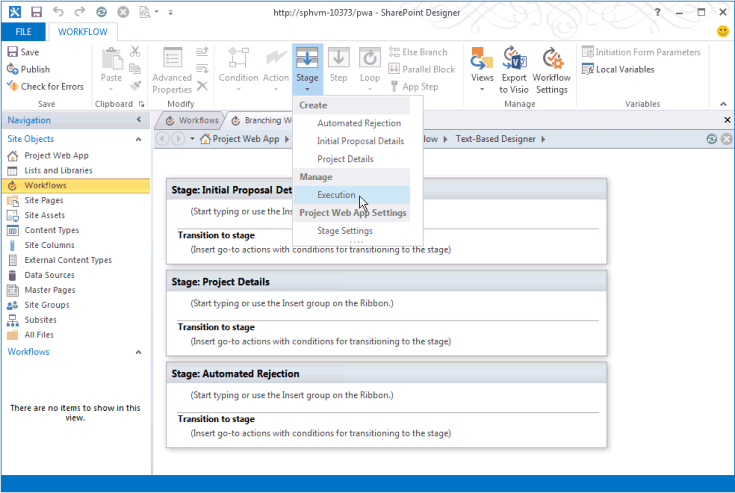

# <a name="updates-for-developers-in-project"></a><span data-ttu-id="4be4d-103">Updates für Entwickler in Project</span><span class="sxs-lookup"><span data-stu-id="4be4d-103">Updates for developers in Project</span></span>

<span data-ttu-id="4be4d-104">Erweiterungsfeatures in Project Server 2013 arbeiten mit Add-Ins für Project Online und mit lokalen Installationen.</span><span class="sxs-lookup"><span data-stu-id="4be4d-104">Extensibility features in Project Server 2013 work with add-ins for Project Online and with on-premises installations.</span></span> <span data-ttu-id="4be4d-105">Zu den neuen Features gehören ein clientseitiges Objektmodell (CSOM), Rest-Schnittstellen, ein OData-Dienst für die Berichterstellung, Remoteereignis Empfänger, deklarative Workflows und Aufgabenbereich-Add-Ins für Projekt Clients.</span><span class="sxs-lookup"><span data-stu-id="4be4d-105">New features include a client-side object model (CSOM), REST interfaces, an OData service for reporting, remote event receivers, declarative workflows, and task pane add-ins for Project clients.</span></span> <span data-ttu-id="4be4d-106">Erfahren Sie auch mehr über veraltete Features, die nicht für die neue Entwicklung verwendet werden sollten.</span><span class="sxs-lookup"><span data-stu-id="4be4d-106">Also learn about deprecated features that should not be used for new development.</span></span>
  
<span data-ttu-id="4be4d-107">Project Server 2013 basiert auf dem mit Microsoft Office Project Server 2007 eingeführten Framework und wird von Project Server 2010 erweitert.</span><span class="sxs-lookup"><span data-stu-id="4be4d-107">Project Server 2013 builds on the framework introduced with Microsoft Office Project Server 2007 and extended by Project Server 2010.</span></span> <span data-ttu-id="4be4d-108">Project Server 2013 fügt ein clientseitiges Objektmodell (CSOM) hinzu, das von der Project Server-Schnittstelle (PSI) umgestaltet und vereinfacht wurde, und enthält eine JavaScript-Bibliothek und .NET Framework 4 Bibliotheken für Windows-apps, Windows Phone 8 und Microsoft Silverlight.</span><span class="sxs-lookup"><span data-stu-id="4be4d-108">Project Server 2013 adds a client-side object model (CSOM) that is refactored and simplified from the Project Server Interface (PSI), and includes a JavaScript library and .NET Framework 4 libraries for Windows apps, Windows Phone 8, and Microsoft Silverlight.</span></span> <span data-ttu-id="4be4d-109">Das CSOM ist für die Entwicklung für Project Online konzipiert und kann auch mit einer lokalen Project Server-Installation verwendet werden.</span><span class="sxs-lookup"><span data-stu-id="4be4d-109">The CSOM is designed for development for Project Online, and also works with an on-premises Project Server installation.</span></span> 

<span data-ttu-id="4be4d-110">Die Project Server-Datenbankenwerden zu einer einzigen Datenbank zusammengefasst. Sie können auf die Online Berichtstabellen und-Ansichten über einen OData-Dienst zugreifen.</span><span class="sxs-lookup"><span data-stu-id="4be4d-110">The Project Server databases are combined into a single database; you can access the online reporting tables and views through an OData service.</span></span> <span data-ttu-id="4be4d-111">Die CSOM und der OData-Dienst enthalten eine Rest-Schnittstelle (Representational State Transfer).</span><span class="sxs-lookup"><span data-stu-id="4be4d-111">The CSOM and the OData service include a Representational State Transfer (REST) interface.</span></span> <span data-ttu-id="4be4d-112">Project Server-Workflows können mithilfe von SharePoint Designer 2013 erstellt werden.</span><span class="sxs-lookup"><span data-stu-id="4be4d-112">Project Server workflows can be created by using SharePoint Designer 2013.</span></span> <span data-ttu-id="4be4d-113">Project Professional 2013 können in Project Server-Berichtsdaten, SharePoint-Aufgabenlisten und andere externe Inhalte mithilfe des Office-Add-ins-Erweiterbarkeitsmodells für Aufgabenbereiche integriert werden.</span><span class="sxs-lookup"><span data-stu-id="4be4d-113">Project Professional 2013 can integrate with Project Server reporting data, SharePoint task lists, and other external content by using the Office Add-ins extensibility model for task panes.</span></span> <span data-ttu-id="4be4d-114">Project Standard 2013 können Aufgabenbereich-Add-Ins verwenden, um Sie in allgemeine externe Inhalte zu integrieren.</span><span class="sxs-lookup"><span data-stu-id="4be4d-114">Project Standard 2013 can use task pane add-ins to integrate with general external content.</span></span>
  
<span data-ttu-id="4be4d-115">Diagramme und weitere Informationen zu wichtigen Änderungen in Project Server 2013 finden Sie unter [Project Server 2013 Architecture](project-server-2013-architecture.md).</span><span class="sxs-lookup"><span data-stu-id="4be4d-115">For diagrams and more information about major changes in Project Server 2013, see [Project Server 2013 architecture](project-server-2013-architecture.md).</span></span>
  
> [!NOTE]
> <span data-ttu-id="4be4d-116">Project Server 2013 basiert auf der SharePoint Server 2013- Plattform; Project 2013 weist größtenteils dieselbe Infrastruktur wie die anderen Office 2013-Anwendungen auf.</span><span class="sxs-lookup"><span data-stu-id="4be4d-116">Project Server 2013 is built on the SharePoint Server 2013 platform, and Project 2013 includes much of the same infrastructure as the other Office 2013 applications.</span></span> <span data-ttu-id="4be4d-117">Informationen zur Dokumentation der Modell für SharePoint-Add-Ins, SharePoint-basierten Workflows, Webparts, zur Entwicklung mit anderen SharePoint-Features und zur Dokumentation von Office-Add-Ins finden Sie unter [SharePoint-Add-ins](https://docs.microsoft.com/sharepoint/dev/sp-add-ins/sharepoint-add-ins), [Office-Add-ins](https://docs.microsoft.com/office/dev/add-ins/overview/office-add-ins)und [SharePoint 2013-Entwicklungsübersicht](https://msdn.microsoft.com/library/jj164084%28office.15%29.aspx).</span><span class="sxs-lookup"><span data-stu-id="4be4d-117">For documentation of the model for SharePoint Add-ins, SharePoint-based workflows, Web Parts, development with other SharePoint features, and documentation of Office Add-ins, see [SharePoint Add-ins](https://docs.microsoft.com/sharepoint/dev/sp-add-ins/sharepoint-add-ins), [Office Add-ins](https://docs.microsoft.com/office/dev/add-ins/overview/office-add-ins), and [SharePoint 2013 development overview](https://msdn.microsoft.com/library/jj164084%28office.15%29.aspx).</span></span> 
  
## <a name="major-new-features-in-project-2013"></a><span data-ttu-id="4be4d-118">Wichtige neue Features in Project 2013</span><span class="sxs-lookup"><span data-stu-id="4be4d-118">Major new features in Project 2013</span></span>
<span data-ttu-id="4be4d-119"><a name="pj15_WhatsNew_MajorNewFeatures"> </a></span><span class="sxs-lookup"><span data-stu-id="4be4d-119"></span></span>

<span data-ttu-id="4be4d-120">Zu den neuen Features in Project Standard 2013 und Project Professional 2013 gehören eine verbesserte Benutzeroberfläche, die mit anderen Office 2013-Anwendungen übereinstimmt, und unterstützt die moderne Benutzeroberfläche in Windows 8, Integration in Office-Grafikobjekte für Berichte, Burndown Berichte und neue Programmierfunktionen für Berichte.</span><span class="sxs-lookup"><span data-stu-id="4be4d-120">New features in Project Standard 2013 and Project Professional 2013 include an improved user interface that matches other Office 2013 applications and supports the modern style user interface in Windows 8, integration with Office Art objects for reports, burndown reports, and new programmability features for reports.</span></span> <span data-ttu-id="4be4d-121">Project Professional 2013 ermöglicht eine umfassendere Freigabe und Synchronisierung von Projekten auf SharePoint Server 2013 sowie die Aufgabenbereich-Add-Ins, die auch in anderen Office 2013 Anwendungen wie Word, Excel und Outlook implementiert sind.</span><span class="sxs-lookup"><span data-stu-id="4be4d-121">Project Professional 2013 enables more extensive sharing and synchronizing projects on SharePoint Server 2013, along with the task pane add-ins that are also implemented in other Office 2013 applications such as Word, Excel, and Outlook.</span></span>
  
<span data-ttu-id="4be4d-122">In Project Server 2013 gibt es viele neue Features.</span><span class="sxs-lookup"><span data-stu-id="4be4d-122">There are many new features in Project Server 2013.</span></span> <span data-ttu-id="4be4d-123">Einige haben keine wichtige Programmierbarkeit, wie beispielsweise die neue Zeitachse in Project Web App.</span><span class="sxs-lookup"><span data-stu-id="4be4d-123">Some do not have a major programmability story, such as the new timeline in Project Web App.</span></span> <span data-ttu-id="4be4d-124">Diese Features werden in der Produkt-und Endbenutzerdokumentation zu Microsoft Office Online und in Themen, die auf Administratoren und IT-Experten in Microsoft TechNet ausgerichtet sind, dokumentiert.</span><span class="sxs-lookup"><span data-stu-id="4be4d-124">Those features will be documented in the product help and end-user documentation on Microsoft Office Online and in topics targeted at administrators and IT professionals on Microsoft TechNet.</span></span> <span data-ttu-id="4be4d-125">Andere neue Features wie verbesserte Arbeitszeittabellen erleichtern Drittanbieterentwicklern die Interaktion mit Arbeitszeittabellen und dem Status über die Project Server-Schnittstelle (PSI).</span><span class="sxs-lookup"><span data-stu-id="4be4d-125">Other new features, such as improved timesheets, make it easier for third-party developers to interact with timesheets and statusing through the Project Server Interface (PSI).</span></span>
  
<span data-ttu-id="4be4d-126">Das Hinzufügen von Project Online und der Office Storehttps://office.microsoft.com/store) (für Projekt-Add-Ins sind weit reichende Änderungen, bei denen auf Project Server über Microsoft Azure zugegriffen werden kann.</span><span class="sxs-lookup"><span data-stu-id="4be4d-126">The addition of Project Online and the Office Store (https://office.microsoft.com/store) for Project add-ins are far-reaching changes, where Project Server is accessible through Microsoft Azure.</span></span> <span data-ttu-id="4be4d-127">Der Cloud-basierte Zugriff auf Project Server verwendet ein clientseitiges Objektmodell (CSOM) für die Entwicklung von Add-Ins mit den Microsoft .NET Framework, Microsoft Silverlight, Windows Phone und Webanwendungen, die JavaScript verwenden.</span><span class="sxs-lookup"><span data-stu-id="4be4d-127">Cloud-based access to Project Server uses a client-side object model (CSOM) for development of add-ins with the Microsoft .NET Framework, Microsoft Silverlight, Windows Phone, and web apps that use JavaScript.</span></span> <span data-ttu-id="4be4d-128">Eine Voraussetzung für Project Online ist, dass die vier Project Server-Datenbanken früherer Versionen in einer Datenbank zusammengeführt werden.</span><span class="sxs-lookup"><span data-stu-id="4be4d-128">A requirement of Project Online is that the four Project Server databases of previous versions are merged into one database.</span></span>
  
<span data-ttu-id="4be4d-129">Project Server 2013 Leistung und Skalierbarkeit werden in vielen Bereichen wie Aufgabenstatus, Arbeitszeittabellen und Projektmanagement verbessert.</span><span class="sxs-lookup"><span data-stu-id="4be4d-129">Project Server 2013 performance and scalability is improved in many areas such as task status, timesheets, and project management.</span></span> <span data-ttu-id="4be4d-130">Project Server-Workflows werden mit Version 4 von Windows Workflow Foundation (WF4) neu gestaltet.</span><span class="sxs-lookup"><span data-stu-id="4be4d-130">Project Server workflows are redesigned with version 4 of Windows Workflow Foundation (WF4).</span></span> <span data-ttu-id="4be4d-131">Die Verwendung der .NET Framework 4 und Windows Communication Foundation (WCF) mit dem PSI verbessert die Sicherheit, Leistung und Skalierbarkeit.</span><span class="sxs-lookup"><span data-stu-id="4be4d-131">Use of the .NET Framework 4 and Windows Communication Foundation (WCF) with the PSI improves security, performance, and scalability.</span></span> <span data-ttu-id="4be4d-132">Beispielsweise können Sie das Transportprotokoll von WCF-basierten Anwendungen mithilfe von Konfigurationsdateien ändern, ohne den Anwendungscode zu ändern oder neu zu kompilieren.</span><span class="sxs-lookup"><span data-stu-id="4be4d-132">For example, you can change the transport protocol of WCF-based applications by using configuration files, without changing the application code or recompiling.</span></span> <span data-ttu-id="4be4d-133">In Project Web App werden viele PSI-Aufrufe zwischengespeichert, bei denen sich die Daten nicht erheblich ändern.</span><span class="sxs-lookup"><span data-stu-id="4be4d-133">Project Web App caches many of the PSI calls where data does not change significantly.</span></span>
  
> [!NOTE]
> <span data-ttu-id="4be4d-134">Für die Entwicklung mit Project Server 2013 können Sie Visual Studio mit den Office-und SharePoint-Tools-Erweiterungen verwenden, die systemeigene Add-Ins für die Office 2013 Produkte erstellen können.</span><span class="sxs-lookup"><span data-stu-id="4be4d-134">For development with Project Server 2013, you can use Visual Studio with the Office and SharePoint tools extensions, which can natively create add-ins for the Office 2013 products.</span></span> <span data-ttu-id="4be4d-135">Project Server 2013 erfordert Visual Studio, um die Entwicklung von Features wie Projektdetailseiten und WCF-basierten Anwendungen vollständig zu ermöglichen.</span><span class="sxs-lookup"><span data-stu-id="4be4d-135">Project Server 2013 requires Visual Studio to fully enable development of features such as project detail pages and WCF-based applications.</span></span> <span data-ttu-id="4be4d-136">Die SharePoint-Tools-Erweiterungen in Visual Studio können Webparts und andere SharePoint-Features direkt für Project Web App und andere SharePoint-Websites bereitstellen.</span><span class="sxs-lookup"><span data-stu-id="4be4d-136">The SharePoint tools extensions in Visual Studio can deploy Web Parts and other SharePoint features directly to Project Web App and other SharePoint sites.</span></span> 
>
> <span data-ttu-id="4be4d-137">Visual Studio ist nicht mehr erforderlich, um Project Server-Workflows zu entwickeln, die benutzerdefinierte Felder, Phasen, Phasen und Enterprise-Projekttypen verwenden, die in Project Web App verwaltet werden können.</span><span class="sxs-lookup"><span data-stu-id="4be4d-137">Visual Studio is no longer required to develop Project Server workflows that use custom fields, stages, phases, and enterprise project types that can be managed in Project Web App.</span></span> <span data-ttu-id="4be4d-138">Sie können zwar Visual Studio zum Entwickeln von Workflows verwenden, diese werden jedoch häufig einfacher und schneller mithilfe von SharePoint Designer erstellt.</span><span class="sxs-lookup"><span data-stu-id="4be4d-138">Although you can use Visual Studio to develop workflows, they are often easier and quicker to create by using SharePoint Designer.</span></span> <span data-ttu-id="4be4d-139">Visual Studio können für Workflows verwendet werden, die Zugriff auf die CSOM oder andere externe APIs benötigen.</span><span class="sxs-lookup"><span data-stu-id="4be4d-139">Visual Studio can be used for workflows that require access to the CSOM or other external APIs.</span></span> 
  
### <a name="project-add-ins"></a><span data-ttu-id="4be4d-140">Project-Add-Ins</span><span class="sxs-lookup"><span data-stu-id="4be4d-140">Project add-ins</span></span>
<span data-ttu-id="4be4d-141"><a name="pj15_WhatsNew_Apps"> </a></span><span class="sxs-lookup"><span data-stu-id="4be4d-141"></span></span>

<span data-ttu-id="4be4d-142">Die Verteilung und Vermarktung von Software wurde mit dem Konzept eines Add-ins revolutioniert.</span><span class="sxs-lookup"><span data-stu-id="4be4d-142">Distribution and marketing of software has been revolutionized with the concept of an add-in.</span></span> <span data-ttu-id="4be4d-143">Für Project 2013 können Add-Ins zum erwerben und herunterladen aus dem öffentlichen Office Store oder in einem privaten Katalog in SharePoint bereitgestellt werden.</span><span class="sxs-lookup"><span data-stu-id="4be4d-143">For Project 2013, add-ins can be made available for purchase and download from the public Office Store or distributed within a private catalog on SharePoint.</span></span> <span data-ttu-id="4be4d-144">Ein Add-in ist normalerweise ein eigenständiges, interaktives Programm, das eine kleine Anzahl verwandter Aufgaben ausführt.</span><span class="sxs-lookup"><span data-stu-id="4be4d-144">An add-in is typically a self-contained, interactive program that performs a small number of related tasks.</span></span> <span data-ttu-id="4be4d-145">Ein Project-Add-in kann ein Aufgabenbereich-Add-in für die Project Standard 2013-oder Project Standard 2013-Clients oder ein Add-in für Project Server 2013 oder Project online sein.</span><span class="sxs-lookup"><span data-stu-id="4be4d-145">A Project add-in can be a task pane add-in for the Project Standard 2013 or Project Standard 2013 clients, or an add-in for Project Server 2013 or Project Online.</span></span>
  
<span data-ttu-id="4be4d-146">Informationen zu Add-Ins für die Project-Desktop Clients finden Sie unter [Aufgabenbereich-Add-Ins in Project](#pj15_WhatsNew_Agave).</span><span class="sxs-lookup"><span data-stu-id="4be4d-146">For information about add-ins for the Project desktop clients, see [Task pane add-ins in Project](#pj15_WhatsNew_Agave).</span></span> <span data-ttu-id="4be4d-147">Ein Project Server 2013 Beispiel finden Sie unter [Create a SharePoint-Hosted Project Server Add-in](create-a-sharepoint-hosted-project-server-add-in.md).</span><span class="sxs-lookup"><span data-stu-id="4be4d-147">For a Project Server 2013 example, see [Create a SharePoint-hosted Project Server add-in](create-a-sharepoint-hosted-project-server-add-in.md).</span></span> <span data-ttu-id="4be4d-148">Zusätzlich zu Artikeln im [Office-und SharePoint-Add-ins SDK](https://msdn.microsoft.com/library/fp161507.aspx)enthält der Office- [Blog](https://blogs.office.com/dev/) viele Beiträge, die auch für Project 2013 und Project Online relevant sind.</span><span class="sxs-lookup"><span data-stu-id="4be4d-148">In addition to articles in the [Office and SharePoint Add-ins SDK](https://msdn.microsoft.com/library/fp161507.aspx), the [Office Blog](https://blogs.office.com/dev/) has many posts that are also relevant to Project 2013 and Project Online.</span></span> 
  
<span data-ttu-id="4be4d-149">Ein Add-in für Project Server 2013 kann sowohl mit einer lokalen Installation als auch mit Project Online funktionieren.</span><span class="sxs-lookup"><span data-stu-id="4be4d-149">An add-in for Project Server 2013 can work with both an on-premises installation and Project Online.</span></span> <span data-ttu-id="4be4d-150">Project Server-Add-Ins können Webparts, Remote-Ereignisempfänger und Geschäftslogik enthalten.</span><span class="sxs-lookup"><span data-stu-id="4be4d-150">Project Server add-ins can include Web Parts, remote event receivers, and business logic.</span></span> <span data-ttu-id="4be4d-151">Der Zugriff auf das Project Server-Objektmodell in einem Add-in erfolgt über die CSOM, nicht über die PSI.</span><span class="sxs-lookup"><span data-stu-id="4be4d-151">Access to the Project Server object model in an add-in is through the CSOM, not the PSI.</span></span> <span data-ttu-id="4be4d-152">Der Datenspeicher kann Cloud-basiert sein, beispielsweise mit SQL Azure, externe wie über Microsoft Business Connectivity Services (BCS), intern mit einer lokalen Datenbank oder gemischten.</span><span class="sxs-lookup"><span data-stu-id="4be4d-152">Data storage can be cloud-based such as with SQL Azure, external such as through Microsoft Business Connectivity Services (BCS), internal with a local database, or mixed.</span></span>
  
#### <a name="add-in-security"></a><span data-ttu-id="4be4d-153">Add-in-Sicherheit</span><span class="sxs-lookup"><span data-stu-id="4be4d-153">Add-in security</span></span>

<span data-ttu-id="4be4d-154">Im Allgemeinen werden Aktionen, die ein Add-in ausführt, im Namen des Benutzers ausgeführt, der das Add-in ausführt; Sie verwenden nicht explizit den Identitätswechsel oder geben an, wer das Add-in ausführen kann.</span><span class="sxs-lookup"><span data-stu-id="4be4d-154">In general, actions that an add-in takes are performed on behalf of the user who runs the add-in; you do not explicitly use impersonation or specify who can run the add-in.</span></span> <span data-ttu-id="4be4d-155">Aktionen dürfen die Berechtigungsstufe des Benutzers, der das Add-in ausführt, nicht überschreiten.</span><span class="sxs-lookup"><span data-stu-id="4be4d-155">Actions cannot exceed the permission level of the user who runs the add-in.</span></span> 
  
<span data-ttu-id="4be4d-156">In Office Developer Tools für Visual Studio 2012 verfügt die Datei AppManifext. XML über einen grafischen Editor, in dem Sie den Bereich für Berechtigungsanforderungen festlegen können.</span><span class="sxs-lookup"><span data-stu-id="4be4d-156">In Office Developer Tools for Visual Studio 2012, the AppManifext.xml file has a graphical editor where you can set the permission request scope.</span></span> <span data-ttu-id="4be4d-157">Um beispielsweise ein Add-in zu erstellen, mit dem Projektmanager Ihre Projekte aktualisieren können, wählen Sie auf der Registerkarte **Berechtigungen** des Bereichs **AppManifest. XML** -Designer **mehrere Projekte** für den Bereich aus, und **Schreiben** Sie für die Berechtigung.</span><span class="sxs-lookup"><span data-stu-id="4be4d-157">For example, to create an add-in that enables project managers to update their projects, on the **Permissions** tab of the **AppManifest.xml** designer pane, select **Multiple Projects** for the scope and **Write** for the permission.</span></span> <span data-ttu-id="4be4d-158">Wenn der Add-in-Benutzer über Project Manager-Berechtigungen verfügt, kann er das Add-in für von ihm verwaltete Projekte ausführen.</span><span class="sxs-lookup"><span data-stu-id="4be4d-158">If the add-in user has project manager permissions, she can run the add-in for projects that she manages.</span></span> <span data-ttu-id="4be4d-159">Der Code in der Datei AppManifest. XML würde Folgendes umfassen:</span><span class="sxs-lookup"><span data-stu-id="4be4d-159">The code in the AppManifest.xml file would include the following:</span></span> 
  
```XML
  <AppPermissionRequests>
    <AppPermissionRequest Scope="https://sharepoint/projectserver/projects" Right="Write" />
  </AppPermissionRequests>
```

<span data-ttu-id="4be4d-160">**Tabelle 1. Berechtigungs Anforderungsbereiche für Project Server-Add-ins**</span><span class="sxs-lookup"><span data-stu-id="4be4d-160">**Table 1. Permission request scopes for Project Server add-ins**</span></span>

|<span data-ttu-id="4be4d-161">Bereich</span><span class="sxs-lookup"><span data-stu-id="4be4d-161">Scope</span></span>|<span data-ttu-id="4be4d-162">Berechtigungen</span><span class="sxs-lookup"><span data-stu-id="4be4d-162">Permissions</span></span>|
|:-----|:-----|
|<span data-ttu-id="4be4d-163">**Project Server**</span><span class="sxs-lookup"><span data-stu-id="4be4d-163">**Project Server**</span></span> <br/> |<span data-ttu-id="4be4d-164">**Verwalten** (erfordert Project Server-Administratorberechtigungen)</span><span class="sxs-lookup"><span data-stu-id="4be4d-164">**Manage** (Requires Project Server administrator permissions.)</span></span>  <br/> |
|<span data-ttu-id="4be4d-165">**Mehrere Projekte**</span><span class="sxs-lookup"><span data-stu-id="4be4d-165">**Multiple Projects**</span></span> <br/> |<span data-ttu-id="4be4d-166">**Lesen**, **Schreiben** (erfordert Projektmanager-Berechtigungen für einige Vorgänge; Projektteammitglieder Berechtigungen für grundlegende Lesevorgänge wie vorgangszuweisungen.)</span><span class="sxs-lookup"><span data-stu-id="4be4d-166">**Read**, **Write** (Requires project manager permissions for some operations; project team member permissions for basic read operations, such as task assignments.)</span></span>  <br/> |
|<span data-ttu-id="4be4d-167">**Einzelnes Projekt**</span><span class="sxs-lookup"><span data-stu-id="4be4d-167">**Single Project**</span></span> <br/> |<span data-ttu-id="4be4d-168">**Lesen**, **Schreiben** (erfordert mindestens Berechtigungen für Projektteammitglieder; der Zugriff auf einige Daten in einem Projekt hängt von anderen Berechtigungsstufen ab.)</span><span class="sxs-lookup"><span data-stu-id="4be4d-168">**Read**, **Write** (Requires at least project team member permissions; access to some data in a project depends on other permission levels.)</span></span>  <br/> |
|<span data-ttu-id="4be4d-169">**Enterprise-Ressourcen**</span><span class="sxs-lookup"><span data-stu-id="4be4d-169">**Enterprise Resources**</span></span> <br/> |<span data-ttu-id="4be4d-170">**Lesen**, **Schreiben** (erfordert Ressourcen-Manager-Berechtigungen.)</span><span class="sxs-lookup"><span data-stu-id="4be4d-170">**Read**, **Write** (Requires resource manager permissions.)</span></span>  <br/> |
|<span data-ttu-id="4be4d-171">**Statusing**</span><span class="sxs-lookup"><span data-stu-id="4be4d-171">**Statusing**</span></span> <br/> |<span data-ttu-id="4be4d-172">**SubmitStatus** (erfordert die Berechtigung zum Übermitteln des Status für Ihre Projekte.)</span><span class="sxs-lookup"><span data-stu-id="4be4d-172">**SubmitStatus** (Requires permission to submit status for your projects.)</span></span>  <br/> |
|<span data-ttu-id="4be4d-173">**Berichterstellung**</span><span class="sxs-lookup"><span data-stu-id="4be4d-173">**Reporting**</span></span> <br/> |<span data-ttu-id="4be4d-174">**Lesen** (erfordert die Berechtigung zum Anmelden bei Project Server)</span><span class="sxs-lookup"><span data-stu-id="4be4d-174">**Read** (Requires permission to log on Project Server.)</span></span>  <br/> |
|<span data-ttu-id="4be4d-175">**Workflow**</span><span class="sxs-lookup"><span data-stu-id="4be4d-175">**Workflow**</span></span> <br/> |<span data-ttu-id="4be4d-176">**Elevate** (erfordert die Berechtigung zum Ausführen von Workflows.</span><span class="sxs-lookup"><span data-stu-id="4be4d-176">**Elevate** (Requires permission to run workflows.</span></span> <span data-ttu-id="4be4d-177">Das Add-in wird mit erhöhten Berechtigungen ausgeführt, um Übergänge von Stage zu Stage in einem Workflow zu aktivieren.</span><span class="sxs-lookup"><span data-stu-id="4be4d-177">The add-in runs with elevated permissions, to enable transitions from stage to stage in a workflow.</span></span> <span data-ttu-id="4be4d-178">Die Geschäftslogik im Add-in steuert die Phasenübergänge.)</span><span class="sxs-lookup"><span data-stu-id="4be4d-178">Business logic in the add-in controls stage transitions.)</span></span>  <br/> |
   
> [!NOTE]
> <span data-ttu-id="4be4d-179">Project Server 2013 und Project Online verwenden nicht das nur-App-Authentifizierungsmodell in SharePoint 2013 (Weitere Informationen finden Sie unter [Add-in-Autorisierungsrichtlinientypen in SharePoint 2013](https://msdn.microsoft.com/library/124879c7-a746-4c10-96a7-da76ad5327f0%28Office.15%29.aspx)).</span><span class="sxs-lookup"><span data-stu-id="4be4d-179">Project Server 2013 and Project Online do not use the app-only authentication model in SharePoint 2013 (see [Add-in authorization policy types in SharePoint 2013](https://msdn.microsoft.com/library/124879c7-a746-4c10-96a7-da76ad5327f0%28Office.15%29.aspx)).</span></span> 
  
<span data-ttu-id="4be4d-180">Informationen zum entwickeln, verteilen, hosten und Verwalten von Add-Ins finden Sie unter [SharePoint-Add-ins](https://docs.microsoft.com/sharepoint/dev/sp-add-ins/sharepoint-add-ins) und [Office-Add-ins](https://docs.microsoft.com/office/dev/add-ins/overview/office-add-ins)und Verwandte Themen in der SharePoint Server 2013 und Office 2013 Entwicklerdokumentation.</span><span class="sxs-lookup"><span data-stu-id="4be4d-180">For information about developing, distributing, hosting, and managing add-ins, see [SharePoint Add-ins](https://docs.microsoft.com/sharepoint/dev/sp-add-ins/sharepoint-add-ins) and [Office Add-ins](https://docs.microsoft.com/office/dev/add-ins/overview/office-add-ins), and related topics in the SharePoint Server 2013 and Office 2013 developer documentation.</span></span> <span data-ttu-id="4be4d-181">Informationen zum Bereich Berechtigungsanforderung für andere SharePoint-Add-Ins finden Sie unter [Add-in Permissions in SharePoint 2013](https://msdn.microsoft.com/library/5f7a8440-3c09-4cf8-83ec-c236bfa2d6c4%28Office.15%29.aspx).</span><span class="sxs-lookup"><span data-stu-id="4be4d-181">For information about permission request scope for other SharePoint Add-ins, see [Add-in permissions in SharePoint 2013](https://msdn.microsoft.com/library/5f7a8440-3c09-4cf8-83ec-c236bfa2d6c4%28Office.15%29.aspx).</span></span>
  
### <a name="integrating-with-sharepoint-server"></a><span data-ttu-id="4be4d-182">Integrieren mit SharePoint Server</span><span class="sxs-lookup"><span data-stu-id="4be4d-182">Integrating with SharePoint Server</span></span>
<span data-ttu-id="4be4d-183"><a name="pj15_WhatsNew_IntegrationWSS"> </a></span><span class="sxs-lookup"><span data-stu-id="4be4d-183"></span></span>

<span data-ttu-id="4be4d-184">Viele Features in Project Web App erfordern die neue Infrastruktur in SharePoint Server 2013 wie OAuth und anspruchsbasierte Authentifizierung, Project Server-Autorisierung und Berechtigungen über SharePoint-Gruppen, Synchronisierung von Projekten mit SharePoint-Aufgabe Listen und deklarative Workflows in Project Server.</span><span class="sxs-lookup"><span data-stu-id="4be4d-184">Many features in Project Web App require the new infrastructure in SharePoint Server 2013 such as OAuth and claims-based authentication, Project Server authorization and permissions through SharePoint groups, synchronization of projects with SharePoint task lists, and Project Server declarative workflows.</span></span> <span data-ttu-id="4be4d-185">Die Project-Dienstanwendung kann einer beliebigen Websitesammlung in einer SharePoint-Farm zugeordnet werden.</span><span class="sxs-lookup"><span data-stu-id="4be4d-185">The Project Service Application can be associated with any site collection in a SharePoint farm.</span></span> <span data-ttu-id="4be4d-186">Die Projektsynchronisierung kann mit einer SharePoint-Aufgabenliste erfolgen, in der SharePoint das Projekt verwaltet.</span><span class="sxs-lookup"><span data-stu-id="4be4d-186">Project synchronization can be with a SharePoint task list, where SharePoint maintains the project.</span></span> <span data-ttu-id="4be4d-187">Ein Enterprise-Projekt kann auch mit einer SharePoint-Aufgabenliste synchronisiert werden, in der Project Server den Vollzugriff aufrecht erhält.</span><span class="sxs-lookup"><span data-stu-id="4be4d-187">An enterprise project can also be synchronized with a SharePoint task list, where Project Server maintains full control.</span></span> <span data-ttu-id="4be4d-188">Informationen zu Architekturdiagrammen und eine Erläuterung der Projektsynchronisierung finden Sie unter [Project Server 2013 Architektur](project-server-2013-architecture.md).</span><span class="sxs-lookup"><span data-stu-id="4be4d-188">For architectural diagrams and an explanation of project synchronization, see [Project Server 2013 architecture](project-server-2013-architecture.md).</span></span>
  
<span data-ttu-id="4be4d-189">In SharePoint Server 2013 gibt es viele neue Features.</span><span class="sxs-lookup"><span data-stu-id="4be4d-189">There are many new features in SharePoint Server 2013.</span></span> <span data-ttu-id="4be4d-190">Weitere Informationen finden Sie unter [SharePoint für Entwickler](https://msdn.microsoft.com/sharepoint).</span><span class="sxs-lookup"><span data-stu-id="4be4d-190">For more information, see [SharePoint for developers](https://msdn.microsoft.com/sharepoint).</span></span>
  
### <a name="integrating-with-workflows"></a><span data-ttu-id="4be4d-191">Integrieren in Workflows</span><span class="sxs-lookup"><span data-stu-id="4be4d-191">Integrating with workflows</span></span>
<span data-ttu-id="4be4d-192"><a name="pj15_WhatsNew_Workflow"> </a></span><span class="sxs-lookup"><span data-stu-id="4be4d-192"></span></span>

<span data-ttu-id="4be4d-193">Workflows sind ein Hauptfeature der Projektportfolioverwaltung.</span><span class="sxs-lookup"><span data-stu-id="4be4d-193">Workflows are a core feature of project portfolio management.</span></span> <span data-ttu-id="4be4d-194">Ein Projektlebenszyklus kann lang andauernde Prozesse umfassen, die sich über mehrere Phasen erstrecken.</span><span class="sxs-lookup"><span data-stu-id="4be4d-194">A project life cycle can include long-running processes that span many phases.</span></span> <span data-ttu-id="4be4d-195">Zu den Steuerungs Phasen zählen Projektvorschläge, Analysen der geschäftlichen Auswirkungen sowie auswählen, erstellen, planen, verwalten und Nachverfolgen von Projekten.</span><span class="sxs-lookup"><span data-stu-id="4be4d-195">Governance phases include project proposals, analyses of business impact, and selecting, creating, planning, managing, and tracking projects.</span></span>
  
<span data-ttu-id="4be4d-196">Project Server 2013 Workflows basieren auf der SharePoint 2013-Workflow Plattform, die WF4 verwendet.</span><span class="sxs-lookup"><span data-stu-id="4be4d-196">Project Server 2013 workflows are built on the SharePoint 2013 workflow platform, which uses WF4.</span></span> <span data-ttu-id="4be4d-197">Im Gegensatz zu früheren Versionen können deklarative Workflows für Project Server 2013 mithilfe von SharePoint Designer 2013 erstellt werden und sind sowohl für die lokale als auch für die Online Nutzung zugänglich.</span><span class="sxs-lookup"><span data-stu-id="4be4d-197">Unlike in previous versions, declarative workflows for Project Server 2013 can be created by using SharePoint Designer 2013 and are accessible for both on-premises and online use.</span></span> <span data-ttu-id="4be4d-198">Project Server-Workflows verwenden das SharePoint-Workflow Sicherheitsmodell mit OAuth und können auf einer Project Web App Website installiert werden.</span><span class="sxs-lookup"><span data-stu-id="4be4d-198">Project Server workflows use the SharePoint workflow security model with OAuth, and can be installed on a Project Web App site.</span></span> <span data-ttu-id="4be4d-199">Abbildung 1 zeigt, dass SharePoint Designer 2013 Stufen zu einem Websiteworkflow für die Bedarfs Verwaltung hinzufügen können, wobei die Phasen in Project Web App definiert sind.</span><span class="sxs-lookup"><span data-stu-id="4be4d-199">Figure 1 shows that SharePoint Designer 2013 can add stages to a site workflow for Demand Management, where the stages are defined in Project Web App.</span></span>
  
<span data-ttu-id="4be4d-200">**Abbildung 1. Verwenden von SharePoint Designer zum Hinzufügen einer Phase zu einem Workflow für Project Web App**</span><span class="sxs-lookup"><span data-stu-id="4be4d-200">**Figure 1. Using SharePoint Designer to add a stage to a workflow for Project Web App**</span></span>

<span data-ttu-id="4be4d-201"></span><span class="sxs-lookup"><span data-stu-id="4be4d-201"></span></span>

<br/>

<span data-ttu-id="4be4d-202">Sie erstellen einen deklarativen Workflow, indem Sie workflowstufen, Aktionen, Bedingungen und andere Elemente in einem Entwurfstool hinzufügen, das entweder SharePoint Designer 2013 oder Visual Studio 2012 sein kann.</span><span class="sxs-lookup"><span data-stu-id="4be4d-202">You build a declarative workflow by adding workflow stages, actions, conditions, and other elements in a design tool, which can be either SharePoint Designer 2013 or Visual Studio 2012.</span></span> <span data-ttu-id="4be4d-203">Das Entwurfstool speichert dann den Workflow als XAML-Code, der zur Laufzeit interpretiert wird.</span><span class="sxs-lookup"><span data-stu-id="4be4d-203">The design tool then saves the workflow as XAML code, which is interpreted at runtime.</span></span> <span data-ttu-id="4be4d-204">Deklarative Workflows können entweder in Project Server 2013 lokal oder in Project online ausgeführt werden.</span><span class="sxs-lookup"><span data-stu-id="4be4d-204">Declarative workflows can run either in Project Server 2013 on-premises or in Project Online.</span></span> <span data-ttu-id="4be4d-205">Mithilfe von Visual Studio 2012 können Sie auch benutzerdefinierte Aktionen und Formulare für zusätzliche Steuerelemente erstellen und Workflowvorlagen zur Wiederverwendung mit mehreren Project Web App-Instanzen speichern.</span><span class="sxs-lookup"><span data-stu-id="4be4d-205">By using Visual Studio 2012, you can also build custom actions and forms for additional control, and save workflow templates for reuse with multiple Project Web App instances.</span></span> <span data-ttu-id="4be4d-206">SharePoint Designer 2013 können benutzerdefinierte Aktionen verarbeiten, die in Visual Studio 2012 erstellt wurden.</span><span class="sxs-lookup"><span data-stu-id="4be4d-206">SharePoint Designer 2013 can consume custom actions that are created in Visual Studio 2012.</span></span>
  
<span data-ttu-id="4be4d-207">Ein Project Server 2013-Workflow fungiert als APP, bei der ein Administrator, der über Entwurfsberechtigungen für Project Web App verfügt, einen deklarativen Workflow veröffentlichen und einem Enterprise-Projekttyp (EPT) zuordnen kann.</span><span class="sxs-lookup"><span data-stu-id="4be4d-207">A Project Server 2013 workflow acts as an app, where an administrator—who has design permissions for Project Web App—can publish a declarative workflow and associate it with an enterprise project type (EPT).</span></span> <span data-ttu-id="4be4d-208">Die EPT muss für ein Enterprise-Projekt gelten, in dem Project Server den Vollzugriff aufrecht erhält.</span><span class="sxs-lookup"><span data-stu-id="4be4d-208">The EPT must be for an enterprise project, where Project Server maintains full control.</span></span> <span data-ttu-id="4be4d-209">In einer SharePoint-Aufgabenliste kann kein Project Server-Workflow verwendet werden.</span><span class="sxs-lookup"><span data-stu-id="4be4d-209">A SharePoint task list cannot use a Project Server workflow.</span></span> 
  
<span data-ttu-id="4be4d-210">OAuth ermöglicht Projektmanagern mit Berechtigungen zum Erstellen von Projekten, den Workflow ohne Identitätswechsel aufzurufen.</span><span class="sxs-lookup"><span data-stu-id="4be4d-210">OAuth enables project managers who have project creation permissions to invoke the workflow without using impersonation.</span></span> <span data-ttu-id="4be4d-211">Workflow Aufrufe an Project Server, beispielsweise um einen benutzerdefinierten Feldwert zu lesen, um zu entscheiden, welche Verzweigung folgen soll, werden im Namen des Projektmanagers vorgenommen.</span><span class="sxs-lookup"><span data-stu-id="4be4d-211">Workflow calls to Project Server, for example to read a custom field value to decide which branch to follow, are made on behalf of the project manager.</span></span> <span data-ttu-id="4be4d-212">Um zu verhindern, dass der Projektmanager einen Workflow erstellt, der automatisch zur nächsten Stufe wechselt, wird der Aufruf zum Wechseln zur nächsten workflowstufe als Workflowautor (Administrator) ausgeführt.</span><span class="sxs-lookup"><span data-stu-id="4be4d-212">To prevent the project manager from creating a workflow that automatically advances to the next stage, the call for moving to the next workflow stage runs as the workflow author (the administrator).</span></span> <span data-ttu-id="4be4d-213">Im Gegensatz dazu führen Benutzer von älteren Project Server 2010-Workflows imitierte Anrufe über das Workflow-Proxy Benutzerkonto durch, um den Administratorzugriff über den gesamten Workflow hinweg zu erhalten.</span><span class="sxs-lookup"><span data-stu-id="4be4d-213">In contrast, users of legacy Project Server 2010 workflows make impersonated calls through the Workflow Proxy User account to gain administrator access throughout the entire workflow.</span></span>
  
<span data-ttu-id="4be4d-214">Obwohl Project Server 2013 lokal kompilierte WF 3.5-basierte Workflows verwenden kann, wird empfohlen, dass Sie ältere Workflows auf deklarative Workflows basierend auf WF4 aktualisieren.</span><span class="sxs-lookup"><span data-stu-id="4be4d-214">Although Project Server 2013 on-premises can use compiled WF3.5-based workflows, we recommend that you upgrade legacy workflows to declarative workflows based on WF4.</span></span> <span data-ttu-id="4be4d-215">Die neuere Technologie ist skalierbarer und robuster.</span><span class="sxs-lookup"><span data-stu-id="4be4d-215">The newer technology is more scalable and robust.</span></span> <span data-ttu-id="4be4d-216">Geschäftsanalysten und Mitarbeiter von PMO können Workflow Designs mithilfe von Visio 2013 erstellen oder aktualisieren und Project Server-Workflows ohne Codierung mithilfe von SharePoint Designer 2013 implementieren.</span><span class="sxs-lookup"><span data-stu-id="4be4d-216">Business analysts and PMO staff can create or update workflow designs by using Visio 2013 and implement Project Server workflows without coding by using SharePoint Designer 2013.</span></span>
  
<span data-ttu-id="4be4d-217">Informationen zum Erstellen eines deklarativen Workflows für Project Web App finden Sie unter [Erste Schritte beim Entwickeln von Project Server-Workflows](getting-started-developing-project-server-workflows.md).</span><span class="sxs-lookup"><span data-stu-id="4be4d-217">For information about creating a declarative workflow for Project Web App, see [Getting started developing Project Server workflows](getting-started-developing-project-server-workflows.md).</span></span> <span data-ttu-id="4be4d-218">Einen Vergleich der SharePoint Designer-und Visual Studio Funktionen für Workflows finden Sie unter [develop SharePoint 2013 Workflows using Visual Studio](https://msdn.microsoft.com/library/office/jj163199.aspx).</span><span class="sxs-lookup"><span data-stu-id="4be4d-218">For a comparison of SharePoint Designer and Visual Studio capabilities for workflows, see [Develop SharePoint 2013 workflows using Visual Studio](https://msdn.microsoft.com/library/office/jj163199.aspx).</span></span>
  
### <a name="client-side-object-model"></a><span data-ttu-id="4be4d-219">Clientseitiges Objektmodell</span><span class="sxs-lookup"><span data-stu-id="4be4d-219">Client-side object model</span></span>
<span data-ttu-id="4be4d-220"><a name="pj15_WhatsNew_CSOM"> </a></span><span class="sxs-lookup"><span data-stu-id="4be4d-220"></span></span>

<span data-ttu-id="4be4d-221">Für den programmgesteuerten Zugriff auf Project Online ist ein CSOM erforderlich, das auf dem SharePoint-CSOM basiert.</span><span class="sxs-lookup"><span data-stu-id="4be4d-221">Programmatic access to Project Online requires a CSOM that is built on the SharePoint CSOM.</span></span> <span data-ttu-id="4be4d-222">Project Online Authentifizierung erfolgt mit OAuth unter Verwendung einer Windows Live ID, nicht der Project Server-Formularauthentifizierung oder der Windows-Authentifizierung.</span><span class="sxs-lookup"><span data-stu-id="4be4d-222">Project Online authentication will be with OAuth using a Windows Live ID, not Project Server Forms authentication or Windows authentication.</span></span>
  
<span data-ttu-id="4be4d-223">Im folgenden finden Sie die Grundsätze und Features des CSOM in Project Server 2013:</span><span class="sxs-lookup"><span data-stu-id="4be4d-223">Following are the principles and features of the CSOM in Project Server 2013:</span></span>
  
- <span data-ttu-id="4be4d-224">Das CSOM ist für die einfache Verwendung konzipiert.</span><span class="sxs-lookup"><span data-stu-id="4be4d-224">The CSOM is designed for ease of use.</span></span> <span data-ttu-id="4be4d-225">Beispielsweise verwenden Methoden und Eigenschaften direkt oder Bereitstellen von Daten anhand des Namens, statt viele GUIDs, _changeXml_ -Parameter oder um Datasets zu übergeben.</span><span class="sxs-lookup"><span data-stu-id="4be4d-225">For example, methods and properties directly use or provide data by name, rather than requiring many GUIDs,  _changeXml_ parameters, or passing around datasets.</span></span> 
    
- <span data-ttu-id="4be4d-226">Die Project Server-CSOM implementiert eine Teilmenge der PSI-Funktionalität basierend auf den am häufigsten verwendeten Anforderungen für Lösungen von Drittanbietern.</span><span class="sxs-lookup"><span data-stu-id="4be4d-226">The Project Server CSOM implements a subset of the PSI functionality, based on the most common requirements for third-party solutions.</span></span>
    
- <span data-ttu-id="4be4d-227">Das CSOM-Element ruft intern die PSI auf, wird jedoch unterschiedlich berücksichtigt.</span><span class="sxs-lookup"><span data-stu-id="4be4d-227">The CSOM internally calls the PSI, but is factored differently.</span></span> <span data-ttu-id="4be4d-228">Beispielsweise werden Aktualisierungen für alle Statusänderungen über die **StatusAssignmentCollection. SubmitAllStatusUpdates** -Methode und nicht durch die **Statusing. SubmitStatus** PSI-Methode für den Benutzer oder die **SubmitStatusForResource** -Methode für andere Ressourcen durchgeführt.</span><span class="sxs-lookup"><span data-stu-id="4be4d-228">For example, updates for all statusing changes are done through the **StatusAssignmentCollection.SubmitAllStatusUpdates** method, not by the **Statusing.SubmitStatus** PSI method for the user or the **SubmitStatusForResource** method for other resources.</span></span> 
    
- <span data-ttu-id="4be4d-229">Auf die CSOM kann über einen WCF-Dienst (Client. svc) zugegriffen werden, statt über die 22 öffentlichen Dienste des PSI.</span><span class="sxs-lookup"><span data-stu-id="4be4d-229">The CSOM is accessible through one WCF service (Client.svc), rather than through the 22 public services of the PSI.</span></span>
    
- <span data-ttu-id="4be4d-230">Die Initialisierung des Project Server-CSOM erfolgt direkt über die [projectcontext](https://msdn.microsoft.com/library/Microsoft.ProjectServer.Client.ProjectContext.aspx) -Klasse mit der Project Web App-URL, nicht mithilfe eines WCF-Verweises oder einer Proxy-Assembly.</span><span class="sxs-lookup"><span data-stu-id="4be4d-230">Initialization of the Project Server CSOM is directly through the [ProjectContext](https://msdn.microsoft.com/library/Microsoft.ProjectServer.Client.ProjectContext.aspx) class with the Project Web App URL, not by using a WCF reference or proxy assembly.</span></span> 
    
- <span data-ttu-id="4be4d-231">Das CSOM implementiert mehrere Clientbibliotheken und-Schnittstellen, die von der internen SharePoint CSOM-Infrastruktur unterstützt werden.</span><span class="sxs-lookup"><span data-stu-id="4be4d-231">The CSOM implements multiple client libraries and interfaces, which are supported by the internal SharePoint CSOM infrastructure.</span></span> <span data-ttu-id="4be4d-232">Die Clientbibliotheken und-Schnittstellen umfassen Folgendes:</span><span class="sxs-lookup"><span data-stu-id="4be4d-232">The client libraries and interfaces include the following:</span></span>
    
  - <span data-ttu-id="4be4d-233">Microsoft .NET-Clientbibliothek in der Microsoft. projectserver. Client. dll-Assembly</span><span class="sxs-lookup"><span data-stu-id="4be4d-233">Microsoft .NET client library in the Microsoft.ProjectServer.Client.dll assembly</span></span>
    
  - <span data-ttu-id="4be4d-234">Silverlight-Bibliothek in der Assembly "Microsoft. projectserver. Client. Silverlight. dll"</span><span class="sxs-lookup"><span data-stu-id="4be4d-234">Silverlight library in the Microsoft.ProjectServer.Client.Silverlight.dll assembly</span></span>
    
  - <span data-ttu-id="4be4d-235">Windows Phone 8 Bibliothek in der Assembly "Microsoft. projectserver. Client. Phone. dll"</span><span class="sxs-lookup"><span data-stu-id="4be4d-235">Windows Phone 8 library in the Microsoft.ProjectServer.Client.Phone.dll assembly</span></span>
    
  - <span data-ttu-id="4be4d-236">JavaScript-Bibliothek für Webanwendungen in der Datei "PS. js" oder "PS. Debug. js"</span><span class="sxs-lookup"><span data-stu-id="4be4d-236">JavaScript library for web applications in the PS.js file or PS.debug.js file</span></span>
    
  - <span data-ttu-id="4be4d-237">Rest-Endpunkte für den Zugriff mit dem OData-Protokoll</span><span class="sxs-lookup"><span data-stu-id="4be4d-237">REST endpoints, for access with the OData protocol</span></span>
    
  - <span data-ttu-id="4be4d-238">Systemeigene Unterstützung für LINQ-Abfragen mit Filterung, um die zurückgegebene Datenmenge einzuschränken</span><span class="sxs-lookup"><span data-stu-id="4be4d-238">Native support for LINQ queries with filtering, to limit the amount of data that is returned</span></span>
    
- <span data-ttu-id="4be4d-239">Das CSOM kann sowohl für Project Online Lösungen als auch für lokale Lösungen verwendet werden, unabhängig von PSI und anderen Project Server-Assemblys wie Microsoft. Office. Project. Server. Library. dll.</span><span class="sxs-lookup"><span data-stu-id="4be4d-239">The CSOM can be used both for Project Online solutions and for on-premises solutions, independently of the PSI and other Project Server assemblies such as Microsoft.Office.Project.Server.Library.dll.</span></span>
    
- <span data-ttu-id="4be4d-240">Zusätzliche Funktionen der Project Server 2013 CSOM können für kumulative Updates und Service Packs in Betracht gezogen werden, basierend auf Anfragen von Project Server-Partnern und der Entwicklercommunity.</span><span class="sxs-lookup"><span data-stu-id="4be4d-240">Additional functionality of the Project Server 2013 CSOM may be considered for cumulative updates and service packs, based on requests by Project Server partners and the developer community.</span></span>
    
> [!NOTE]
> <span data-ttu-id="4be4d-241">Das CSOM ist die bevorzugte Schnittstelle für Project Server-Entwickler von Drittanbietern.</span><span class="sxs-lookup"><span data-stu-id="4be4d-241">The CSOM is the preferred interface for third-party Project Server developers.</span></span> <span data-ttu-id="4be4d-242">Wir empfehlen, dass Sie für die Entwicklung neuer Anwendungen das CSOM verwenden, sofern das CSOM alle für Ihre Anwendung erforderlichen Funktionen umfasst.</span><span class="sxs-lookup"><span data-stu-id="4be4d-242">We recommend that you use the CSOM for developing new applications, if the CSOM includes the functionality that your application requires.</span></span> 
  
<span data-ttu-id="4be4d-243">Informationen zum Entwickeln mit dem CSOM finden Sie unter [Client seitiges Objektmodell (CSOM) für Project 2013](client-side-object-model-csom-for-project-2013.md).</span><span class="sxs-lookup"><span data-stu-id="4be4d-243">For information about developing with the CSOM, see [Client-side object model (CSOM) for Project 2013](client-side-object-model-csom-for-project-2013.md).</span></span> <span data-ttu-id="4be4d-244">Informationen zur Rest-Schnittstelle in SharePoint-Anwendungen finden Sie unter *Programmieren mit dem SharePoint Rest-Dienst* im SharePoint 2013: Dokumentation für Entwickler.</span><span class="sxs-lookup"><span data-stu-id="4be4d-244">For information about the REST interface in SharePoint applications, see  *Programming using the SharePoint REST service*  in the SharePoint 2013 developer documentation.</span></span> 
  
### <a name="changes-in-the-reporting-database"></a><span data-ttu-id="4be4d-245">Änderungen in der Berichtsdatenbank</span><span class="sxs-lookup"><span data-stu-id="4be4d-245">Changes in the Reporting database</span></span>
<span data-ttu-id="4be4d-246"><a name="pj15_WhatsNew_RDBChanges"> </a></span><span class="sxs-lookup"><span data-stu-id="4be4d-246"></span></span>

<span data-ttu-id="4be4d-247">Die vier Datenbanken in Project Server 2010 werden in Project Server 2013 in einer einzigen Projektdatenbank zusammengefasst.</span><span class="sxs-lookup"><span data-stu-id="4be4d-247">The four databases in Project Server 2010 are combined into a single Project database in Project Server 2013.</span></span> <span data-ttu-id="4be4d-248">Der Standardname der Projektdatenbank lautet ProjectService.</span><span class="sxs-lookup"><span data-stu-id="4be4d-248">The default name of the Project database is ProjectService.</span></span> <span data-ttu-id="4be4d-249">Berichtstabellen und-Ansichten behalten ihre vorherigen Namen bei, und Tabellen und Ansichten aus der Entwurfs-, Veröffentlichungs-und Archivdatenbank `draft`weisen `pub`die Präfixe und `ver` in der ProjectService-Datenbank auf.</span><span class="sxs-lookup"><span data-stu-id="4be4d-249">Reporting tables and views retain their previous names, and tables and views from the Draft, Published, and Archive databases have the prefixes  `draft`,  `pub`, and  `ver` in the ProjectService database.</span></span> <span data-ttu-id="4be4d-250">Beispielsweise ist die Tabelle veröffentlichter Projekte Pub. MSP_PROJECTS.</span><span class="sxs-lookup"><span data-stu-id="4be4d-250">For example, the published projects table is pub.MSP_PROJECTS.</span></span> 
  
> [!IMPORTANT]
> <span data-ttu-id="4be4d-251">Der direkte Zugriff wird für die Tabellen und Ansichten`draft` Entwurf (Präfix),`pub`publiziert () und Archiv`ver`() nicht unterstützt.</span><span class="sxs-lookup"><span data-stu-id="4be4d-251">Direct access is not supported for the draft (`draft` prefix), published (`pub`), and archive (`ver`) tables and views.</span></span> <span data-ttu-id="4be4d-252">In Berichten sollten nur die Berichtstabellen und-Ansichten verwendet werden, `dbo` die über das Präfix verfügen.</span><span class="sxs-lookup"><span data-stu-id="4be4d-252">Reports should use only the reporting tables and views, which have the `dbo` prefix.</span></span> <span data-ttu-id="4be4d-253">Beispielsweise wird die dbo. MSP_EpmProject Tabelle enthält die Liste der Projekte in der Project Web App-Instanz.</span><span class="sxs-lookup"><span data-stu-id="4be4d-253">For example, the dbo.MSP_EpmProject table includes the list of projects in the Project Web App instance.</span></span> 
>
> <span data-ttu-id="4be4d-254">Es gibt nichts, das Sie aktiv daran hindert, den direkten programmgesteuerten Datenbankzugriff zu verwenden, um Daten in einer der Tabellen und Ansichten in der Projektdatenbank zu aktualisieren.</span><span class="sxs-lookup"><span data-stu-id="4be4d-254">There is nothing to actively prevent you from using direct programmatic database access to update data in any of the tables and views in the Project database.</span></span> <span data-ttu-id="4be4d-255">Beachten Sie, dass der Project Professional Cache, die Tabellen für Entwurf und veröffentlichte Daten und die Berichtstabellen alle auf einem Cache Synchronisierungsprotokoll beruhen, das durch direkte Datenbearbeitung gestört werden kann.</span><span class="sxs-lookup"><span data-stu-id="4be4d-255">You should be aware that the Project Professional cache, the tables for draft and published data, and the reporting tables all rely on a cache synchronization protocol that can be disrupted by direct data editing.</span></span> <span data-ttu-id="4be4d-256">Wenn Sie Ihre Project Server-Datenbanken beschädigen oder Project Professional clientseitigen Caches mithilfe des direkten Zugriffs auf Änderungsdaten beschädigt haben, sollten Sie darauf hingewiesen werden, dass der Produktsupport Ihnen nicht helfen kann!</span><span class="sxs-lookup"><span data-stu-id="4be4d-256">If you damage your Project Server databases or corrupt Project Professional client-side caches by using direct access to change data, be warned that product support won't be able to help!</span></span> 
  
<span data-ttu-id="4be4d-257">Project Server 2013 stellt einen OData-Dienst für den Online-und lokalen Zugriff vor.</span><span class="sxs-lookup"><span data-stu-id="4be4d-257">Project Server 2013 introduces an OData service for online and on-premises access.</span></span> <span data-ttu-id="4be4d-258">Die Online Berichtstabellen und-Ansichten werden nur von der OData-Schnittstelle verfügbar gemacht. für die lokale Verwendung können Sie die OData-Schnittstelle verwenden oder direkt auf die Berichtstabellen und-Ansichten in der ProjectService-Datenbank in der SharePoint-Farm zugreifen.</span><span class="sxs-lookup"><span data-stu-id="4be4d-258">The online reporting tables and views are exposed only by the OData interface; for on-premises use, you can use the OData interface or directly access the reporting tables and views in the ProjectService database in the SharePoint farm.</span></span> <span data-ttu-id="4be4d-259">Project Online unterstützt keine Multitenant-Datenbank.</span><span class="sxs-lookup"><span data-stu-id="4be4d-259">Project Online does not support a multitenant database.</span></span> <span data-ttu-id="4be4d-260">Das bedeutet, dass mehrere Instanzen von Project Web App jeweils über eine eigene Projektdatenbank verfügen.</span><span class="sxs-lookup"><span data-stu-id="4be4d-260">That is, multiple instances of Project Web App each have their own Project database.</span></span> <span data-ttu-id="4be4d-261">Der OData-Dienst führt intern SQL-Abfragen für die Berichtstabellen und-Sichten aus und liefert eine XML-oder JSON-Nutzlast.</span><span class="sxs-lookup"><span data-stu-id="4be4d-261">The OData service internally runs SQL queries on the reporting tables and views, and delivers an XML or JSON payload.</span></span> <span data-ttu-id="4be4d-262">Eine Einführung in den odata-Dienst für die Berichterstellung in Project Server 2013 und für die **ProjectData** -Schemareferenz finden Sie unter [ProjectData-Project odata Service Reference](https://msdn.microsoft.com/library/office/jj163015.aspx).</span><span class="sxs-lookup"><span data-stu-id="4be4d-262">For an introduction to the OData service for reporting in Project Server 2013, and for the **ProjectData** schema reference, see [ProjectData - Project OData service reference](https://msdn.microsoft.com/library/office/jj163015.aspx).</span></span>
  
<span data-ttu-id="4be4d-263">Allgemeine Informationen zu odata-Abfragen finden Sie unter [odata: URI Conventions](https://www.odata.org/documentation/).</span><span class="sxs-lookup"><span data-stu-id="4be4d-263">For general information about OData queries, see [OData: URI conventions](https://www.odata.org/documentation/).</span></span> <span data-ttu-id="4be4d-264">Beispielsweise können Sie alle Projekte in einer lokalen Instanz von Project Web App anzeigen, in der der Projektname mit "Test" beginnt, indem Sie die folgende Abfrage in einem Browser verwenden.</span><span class="sxs-lookup"><span data-stu-id="4be4d-264">For example, you can see all of the projects in an on-premises instance of Project Web App where the project name starts with "Test" by using the following query in a browser.</span></span> <span data-ttu-id="4be4d-265">Klicken Sie mit der rechten Maustaste auf die Browser Seite, und klicken Sie dann auf **Quelle anzeigen**.</span><span class="sxs-lookup"><span data-stu-id="4be4d-265">Right-click in the browser page, and then click **View source**.</span></span>
  
```html
https://ServerName /ProjectServerName /_api/ProjectData/Projects?$filter=startswith(ProjectName, 'Test') eq true
```

<span data-ttu-id="4be4d-266">Um Projektdaten in PowerPivot in Excel 2013 zu importieren, wählen Sie auf dem Menüband Daten im Dropdownmenü **aus andere Quellen** den Eintrag **OData-Daten Feed** aus.</span><span class="sxs-lookup"><span data-stu-id="4be4d-266">To import project data into PowerPivot in Excel 2013, on the DATA ribbon, select **From OData data feed** in the **From Other Sources** drop-down menu.</span></span> <span data-ttu-id="4be4d-267">Geben https://ServerName/ProjectServerName/_api/ProjectData/ Sie im Dialogfeld **Datenverbindungs-Assistent** den Speicherort für den Daten Feed ein, wählen Sie **weiter**aus, und wählen Sie dann im Assistenten auf der Seite **Tabellen auswählen** die Tabelle **Projekte** aus.</span><span class="sxs-lookup"><span data-stu-id="4be4d-267">In the **Data Connection Wizard** dialog box, type https://ServerName/ProjectServerName/_api/ProjectData/ in the data feed location, choose **Next**, and then select the **Projects** table in the **Select Tables** page of the wizard.</span></span> <span data-ttu-id="4be4d-268">Name und speichern Sie die ODC-Datei, und wählen Sie dann **Fertig stellen**aus.</span><span class="sxs-lookup"><span data-stu-id="4be4d-268">Name and save the .odc file, and then choose **Finish**.</span></span> <span data-ttu-id="4be4d-269">Wählen Sie im Dialogfeld **Daten importieren** die Option **PivotTable-Bericht**aus.</span><span class="sxs-lookup"><span data-stu-id="4be4d-269">In the **Import Data** dialog box, choose **PivotTable Report**.</span></span> <span data-ttu-id="4be4d-270">Wählen Sie im Excel-Arbeitsblatt Felder für die Pivot-Tabellenzeilen und-Spalten aus, die Sie anzeigen möchten.</span><span class="sxs-lookup"><span data-stu-id="4be4d-270">On the Excel worksheet, choose fields for the pivot table rows and columns that you want to show.</span></span>
  
<span data-ttu-id="4be4d-271">Lokale Project Server-Benutzer, die über die richtigen Berechtigungen verfügen, können über Microsoft SQL Server direkt auf die Berichtstabellen und-Ansichten zugreifen, um Berichte wie in Project Server 2010 zu erstellen.</span><span class="sxs-lookup"><span data-stu-id="4be4d-271">On-premises Project Server users, who have the correct permissions, can directly access the reporting tables and views through Microsoft SQL Server to create reports, as they do in Project Server 2010.</span></span> <span data-ttu-id="4be4d-272">In Project Server 2013 können Benutzer auch über die OData-Schnittstelle auf die lokalen Berichtstabellen zugreifen.</span><span class="sxs-lookup"><span data-stu-id="4be4d-272">In Project Server 2013, users can also access the on-premises reporting tables through the OData interface.</span></span> <span data-ttu-id="4be4d-273">Sie können Project Server-Daten online oder lokal über Rest-Endpunkte für den OData-Dienst abrufen.</span><span class="sxs-lookup"><span data-stu-id="4be4d-273">You can retrieve Project Server data online or on-premises through REST endpoints for the OData service.</span></span> <span data-ttu-id="4be4d-274">Beispielsweise wird die dbo. MSP_PROJECT Tabelle und der dbo. MSP_EpmProject_UserView Ansicht kann für Berichte verwendet werden.</span><span class="sxs-lookup"><span data-stu-id="4be4d-274">For example, the dbo.MSP_PROJECT table and the dbo.MSP_EpmProject_UserView view can be used for reports.</span></span> <span data-ttu-id="4be4d-275">Alle Tabellen oder Sichten, die über `draft`ein `pub`,- `ver` oder-Präfix verfügen, sind nur für die interne Verwendung durch Project Server und nicht für die Verwendung in Berichten.</span><span class="sxs-lookup"><span data-stu-id="4be4d-275">Any tables or views that have a  `draft`,  `pub`, or  `ver` prefix are for internal use by Project Server only, and are not for reporting use.</span></span> <span data-ttu-id="4be4d-276">Beispiel: der Entwurf. MSP_TASKS Tabelle und Pub. MSP_PROJECTS_WORKING_VIEW Ansicht sind nicht dokumentiert und dienen nur der internen Verwendung.</span><span class="sxs-lookup"><span data-stu-id="4be4d-276">For example, the draft.MSP_TASKS table and the pub.MSP_PROJECTS_WORKING_VIEW view are not documented and are for internal use only.</span></span> 
  
> [!NOTE]
> <span data-ttu-id="4be4d-277">Sie können die lokale Berichterstellung erweitern, indem Sie Tabellen, Ansichten, Felder und gespeicherte Prozeduren in einer separaten Datenbank hinzufügen.</span><span class="sxs-lookup"><span data-stu-id="4be4d-277">You can extend on-premises reporting by adding tables, views, fields, and stored procedures in a separate database.</span></span> <span data-ttu-id="4be4d-278">Sie sollten die vorhandenen Berichtstabellen und-Ansichten in der Project Server-Datenbank nicht ändern.</span><span class="sxs-lookup"><span data-stu-id="4be4d-278">You should not modify the existing reporting tables and views in the Project Server database.</span></span> 
  
<span data-ttu-id="4be4d-279">Die Berichtstabellen, Ansichten und Felder in der Projektdatenbank werden in einer HTML-Hilfedatei in einem späteren Update des Project 2013 SDK-Downloads dokumentiert.</span><span class="sxs-lookup"><span data-stu-id="4be4d-279">The reporting tables, views, and fields in the Project database will be documented in an HTML Help file in a later update of the Project 2013 SDK download.</span></span> <span data-ttu-id="4be4d-280">Dokumentation des odata-XML-Schemas für den **ProjectData** -Dienst finden Sie unter [ProjectData-Project odata Service Reference](https://msdn.microsoft.com/library/office/jj163015.aspx).</span><span class="sxs-lookup"><span data-stu-id="4be4d-280">For documentation of the OData XML schema for the **ProjectData** service, see [ProjectData - Project OData service reference](https://msdn.microsoft.com/library/office/jj163015.aspx).</span></span> <span data-ttu-id="4be4d-281">Abfragen der Berichtstabellen und Ansichten, die für Project Server 2010 erstellt wurden, arbeiten in den meisten Fällen mit der Project-Datenbank in Project Server 2013.</span><span class="sxs-lookup"><span data-stu-id="4be4d-281">Queries of the reporting tables and views that were created for Project Server 2010 will, in most cases, work with the Project database in Project Server 2013.</span></span> <span data-ttu-id="4be4d-282">Lokale Benutzer können auf die Project Server-OLAP-Cubes in SQL Server Analysis Services zugreifen, wie Sie dies derzeit tun.</span><span class="sxs-lookup"><span data-stu-id="4be4d-282">On-premises users can access the Project Server OLAP cubes in SQL Server Analysis Services, as they currently do.</span></span> <span data-ttu-id="4be4d-283">In Project Online stehen keine OLAP-Cubes zur Verfügung.</span><span class="sxs-lookup"><span data-stu-id="4be4d-283">In Project Online, OLAP cubes are not available.</span></span>
  
### <a name="task-pane-add-ins-in-project"></a><span data-ttu-id="4be4d-284">Aufgabenbereich-Add-Ins in Project</span><span class="sxs-lookup"><span data-stu-id="4be4d-284">Task pane add-ins in Project</span></span>
<span data-ttu-id="4be4d-285"><a name="pj15_WhatsNew_Agave"> </a></span><span class="sxs-lookup"><span data-stu-id="4be4d-285"></span></span>

<span data-ttu-id="4be4d-286">Sowohl Project Standard 2013 als auch Project Professional 2013 unterstützen Aufgabenbereich-Add-Ins, die zur Integration in und anzeigen externer Inhalte in einer Webseite verwendet werden können.</span><span class="sxs-lookup"><span data-stu-id="4be4d-286">Both Project Standard 2013 and Project Professional 2013 support task pane add-ins, which can be used to integrate with and display external content in a webpage.</span></span> <span data-ttu-id="4be4d-287">Im Aufgabenbereich werden Webseiteninhalte angezeigt, die über JavaScript auf Aufgaben, Ressourcen, Ansichten und allgemeine Projektdaten zugreifen können.</span><span class="sxs-lookup"><span data-stu-id="4be4d-287">The task pane shows webpage content that has access through JavaScript to tasks, resources, views, and general project data.</span></span> <span data-ttu-id="4be4d-288">Das JavaScript-Objektmodell für Project kann Informationen über einen ausgewählten Vorgang oder eine ausgewählte Ressource abrufen und Daten in einer ausgewählten Zelle im Raster für Ansichten wie das Gantt-Diagramm abrufen.</span><span class="sxs-lookup"><span data-stu-id="4be4d-288">The JavaScript object model for Project can get information about a selected task or resource, and can get data in a selected cell in the grid for views such as the Gantt chart.</span></span> <span data-ttu-id="4be4d-289">Aufgabenbereich-Add-Ins für Project können auch Ereignishandler für geänderte Ereignisse im Hinblick auf Vorgangs-, Ressourcen-oder Ansichtsauswahl implementieren.</span><span class="sxs-lookup"><span data-stu-id="4be4d-289">Task pane add-ins for Project can also implement event handlers for task, resource, or view selection changed events.</span></span> 
  
<span data-ttu-id="4be4d-290">Abbildung 2 zeigt das Add-in **Hello ProjectData** -Aufgabenbereich, das den **ProjectData** -Dienst abfragt, und vergleicht dann Daten im aktuellen Projekt mit den Durchschnittswerten für alle Projekte.</span><span class="sxs-lookup"><span data-stu-id="4be4d-290">Figure 2 shows the **Hello ProjectData** task pane add-in that queries the **ProjectData** service, and then compares data in the current project with the averages for all projects.</span></span> <span data-ttu-id="4be4d-291">Der Project 2013 SDK-Download enthält den vollständigen Quellcode für das Add-in.</span><span class="sxs-lookup"><span data-stu-id="4be4d-291">The Project 2013 SDK download includes the complete source code for the add-in.</span></span> 
  
<span data-ttu-id="4be4d-292">**Abbildung 2. Ein Aufgabenbereich-Add-in in Project Professional kann auf Daten in Project Server zugreifen.**</span><span class="sxs-lookup"><span data-stu-id="4be4d-292">**Figure 2. A task pane add-in in Project Professional can access data in Project Server**</span></span>

<span data-ttu-id="4be4d-293"></span><span class="sxs-lookup"><span data-stu-id="4be4d-293"></span></span>
  
> [!NOTE]
> <span data-ttu-id="4be4d-294">Project Standard 2013 können nicht direkt in Project Server 2013 über Aufgabenbereich-Add-Ins integriert werden.</span><span class="sxs-lookup"><span data-stu-id="4be4d-294">Project Standard 2013 cannot directly integrate with Project Server 2013 through task pane add-ins.</span></span> 
  
<span data-ttu-id="4be4d-295">Aufgabenbereich-Add-Ins in Project Professional können Webparts unterstützen, die für Project Server 2013 erstellt wurden, sodass Entwickler eine Erweiterung einmal erstellen können, die sowohl mit Project Web App als auch mit Project Professional ausgeführt wird.</span><span class="sxs-lookup"><span data-stu-id="4be4d-295">Task pane add-ins in Project Professional can support Web Parts that are built for Project Server 2013, so developers can build an extension once that runs with both Project Web App and Project Professional.</span></span> <span data-ttu-id="4be4d-296">Allgemeine Aufgabenbereich-Add-Ins, die für andere Office 2013 Produkte entwickelt wurden, können auch mit Project Standard 2013 und Project Professional 2013 verwendet werden.</span><span class="sxs-lookup"><span data-stu-id="4be4d-296">General task pane add-ins that are developed for other Office 2013 products can also be used with Project Standard 2013 and Project Professional 2013.</span></span> <span data-ttu-id="4be4d-297">Weitere Informationen finden Sie unter [Aufgabenbereich-Add-Ins für Project](task-pane-add-ins-for-project.md).</span><span class="sxs-lookup"><span data-stu-id="4be4d-297">For more information, see [Task pane add-ins for Project](task-pane-add-ins-for-project.md).</span></span>
  
### <a name="project-server-event-receivers"></a><span data-ttu-id="4be4d-298">Project Server-Ereignisempfänger</span><span class="sxs-lookup"><span data-stu-id="4be4d-298">Project Server event receivers</span></span>
<span data-ttu-id="4be4d-299"><a name="pj15_WhatsNew_Events"> </a></span><span class="sxs-lookup"><span data-stu-id="4be4d-299"></span></span>

<span data-ttu-id="4be4d-300">In einer SharePoint-Farm, die die Back-End-Projektdienst Anwendung enthält, können mehrere Project Web App-Server (auch als "webfront-End-Server" oder "WFEs" bezeichnet) vorhanden sein.</span><span class="sxs-lookup"><span data-stu-id="4be4d-300">There can be multiple Project Web App servers (also called web front end servers, or WFEs) in a SharePoint farm that includes the back-end Project Service Application.</span></span> <span data-ttu-id="4be4d-301">Ereignisempfänger werden auch Ereignishandler genannt.</span><span class="sxs-lookup"><span data-stu-id="4be4d-301">Event receivers can also be called event handlers.</span></span> <span data-ttu-id="4be4d-302">Lokale Ereignishandler können mit voll vertrauenswürdigem Code implementiert und auf allen WFEs für eine lokale Project Server-Installation bereitgestellt werden.</span><span class="sxs-lookup"><span data-stu-id="4be4d-302">Local event handlers can be implemented with full-trust code and deployed on all of the WFEs for a local Project Server installation.</span></span> <span data-ttu-id="4be4d-303">Remote Ereignisempfänger können in Webdiensten auf lokalen oder Remoteservern implementiert werden, und es werden mehrere WFEs und mehrere Project Server-Installationen verwendet.</span><span class="sxs-lookup"><span data-stu-id="4be4d-303">Remote event receivers can be implemented in web services on local or remote servers and accessed by multiple WFEs and multiple Project Server installations.</span></span> <span data-ttu-id="4be4d-304">Project Online können nur Remoteereignis Empfänger verwenden.</span><span class="sxs-lookup"><span data-stu-id="4be4d-304">Project Online can use only remote event receivers.</span></span>
  
<span data-ttu-id="4be4d-305">Project Server-Ereignishandler werden von SharePoint für jede Project Web App Instanz verwaltet, statt auf eine bestimmte Seite mit Project Web App Einstellungen.</span><span class="sxs-lookup"><span data-stu-id="4be4d-305">Project Server event handlers are managed by SharePoint for each Project Web App instance, rather than by a specific Project Web App Settings page.</span></span> <span data-ttu-id="4be4d-306">Klicken Sie in der Anwendung für die SharePoint-zentral Administration auf **Allgemeine Anwendungseinstellungen**, wählen Sie unter **PWA-Einstellungen** **Verwalten** , und wählen Sie dann in der Dropdownliste **Project Web App Instanz** auf der Seite PWA-Einstellungen die Instanz aus.</span><span class="sxs-lookup"><span data-stu-id="4be4d-306">In the SharePoint Central Administration application, choose **General Application Settings**, choose **Manage** under **PWA Settings**, and then choose the instance in the **Project Web App Instance** drop-down list on the PWA Settings page.</span></span> <span data-ttu-id="4be4d-307">Zum Hinzufügen eines lokalen Ereignishandlers oder eines Remoteereignis Empfängers wählen Sie **Server seitige Ereignis**Handler aus.</span><span class="sxs-lookup"><span data-stu-id="4be4d-307">To add a local event handler or a remote event receiver, choose **Server Side Event Handlers**.</span></span>
  
<span data-ttu-id="4be4d-308">Für eine lokale Installation von Project Server können Sie einen Remoteereignis Empfänger als SharePoint-Feature erstellen, das die [Microsoft. projectserver. Client. EventHandlerCreationInformation](https://msdn.microsoft.com/library/Microsoft.ProjectServer.Client.EventHandlerCreationInformation.aspx) -Klasse in der CSOM verwendet und dann den Ereignisempfänger mithilfe von Methoden in der [eventhandlercollection](https://msdn.microsoft.com/library/Microsoft.ProjectServer.Client.EventHandlerCollection.aspx) -Klasse programmgesteuert verwaltet.</span><span class="sxs-lookup"><span data-stu-id="4be4d-308">For an on-premises installation of Project Server, you can create a remote event receiver as a SharePoint feature that uses the [Microsoft.ProjectServer.Client.EventHandlerCreationInformation](https://msdn.microsoft.com/library/Microsoft.ProjectServer.Client.EventHandlerCreationInformation.aspx) class in the CSOM, and then programmatically manage the event receiver by using methods in the [EventHandlerCollection](https://msdn.microsoft.com/library/Microsoft.ProjectServer.Client.EventHandlerCollection.aspx) class.</span></span> <span data-ttu-id="4be4d-309">Bei Remoteereignis Empfängern sind Prä-Ereignisse synchron, Post-Ereignisse asynchron und es gibt ein Timeout für Fälle, in denen der Remoteereignis Empfänger nicht zurückgegeben wird.</span><span class="sxs-lookup"><span data-stu-id="4be4d-309">For remote event receivers, pre-events are synchronous, post-events are asynchronous, and there is a timeout for cases where the remote event receiver does not return.</span></span> 
  
> [!NOTE]
> <span data-ttu-id="4be4d-310">Die SharePoint-zentral Administration steht nur für lokale Installationen zur Verfügung.</span><span class="sxs-lookup"><span data-stu-id="4be4d-310">SharePoint Central Administration is available only for on-premises installations.</span></span> <span data-ttu-id="4be4d-311">Für Project Online und SharePoint Online können Sie Remoteereignis Empfänger mithilfe eines CSOM-basierten App-Pakets hinzufügen oder entfernen.</span><span class="sxs-lookup"><span data-stu-id="4be4d-311">For Project Online and SharePoint Online, you can add or remove remote event receivers by using a CSOM-based app package.</span></span> 
  
<span data-ttu-id="4be4d-312">Auf der Seite mit den Server seitigen Ereignishandlern ist der Prozess zum Hinzufügen eines lokalen Ereignishandlers für eine lokale Project Server-Installation fast identisch mit dem im Thema [Create a Project Server EventHandler beschriebenen Prozess und Protokollieren eines Ereignis](https://msdn.microsoft.com/library/gg615466.aspx) Themas für Project Server 2010.</span><span class="sxs-lookup"><span data-stu-id="4be4d-312">On the Server Side Event Handlers page, the process to add a local event handler for an on-premises Project Server installation is nearly the same as the process described in the [Create a Project Server event handler and log an event](https://msdn.microsoft.com/library/gg615466.aspx) topic for Project Server 2010.</span></span> <span data-ttu-id="4be4d-313">Der Unterschied besteht darin, dass die neue Seite des Ereignishandlers zusätzliche Optionen aufweist.</span><span class="sxs-lookup"><span data-stu-id="4be4d-313">The difference is that the New Event Handler page has additional options.</span></span> <span data-ttu-id="4be4d-314">Wählen Sie beispielsweise **Projekt erstellen** in der Liste **Ereignisse** aus, und wählen Sie dann **neuer Ereignis Handler**aus.</span><span class="sxs-lookup"><span data-stu-id="4be4d-314">For example, choose **Project Creating** in the **Events** list, and then choose **NEW EVENT HANDLER**.</span></span> <span data-ttu-id="4be4d-315">Auf der Seite neuer Ereignishandler sind nur die beiden erforderlichen Felder **Name** und **Order** (siehe Abbildung 3).</span><span class="sxs-lookup"><span data-stu-id="4be4d-315">On the New Event handler page, the only two required fields are **Name** and **Order** (see Figure 3).</span></span> <span data-ttu-id="4be4d-316">Wenn Sie einen lokalen voll vertrauenswürdigen Ereignishandler hinzufügen, fügen Sie das Feld **Assembly Name** und das Feld **Klassenname** hinzu. lassen Sie die **Endpunkt-URL** leer.</span><span class="sxs-lookup"><span data-stu-id="4be4d-316">If you are adding a local full-trust event handler, add the **Assembly Name** field and the **Class Name** field; leave **Endpoint Url** empty.</span></span> <span data-ttu-id="4be4d-317">Wenn Sie einen Remoteereignis Empfänger hinzufügen, fügen Sie die **Endpunkt-URL**hinzu, und lassen Sie den Namen und den **Klassennamen** der **Assembly** leer.</span><span class="sxs-lookup"><span data-stu-id="4be4d-317">If you are adding a remote event receiver, add **Endpoint Url**, and leave **Assembly Name** and **Class Name** empty.</span></span> 
  
> [!CAUTION]
> <span data-ttu-id="4be4d-318">Wenn Sie sowohl den Namen der Assembly *als* auch den Klassennamen und die Endpunkt-URL angeben, ruft Project Server nur den lokalen Ereignishandler (lokal) auf.</span><span class="sxs-lookup"><span data-stu-id="4be4d-318">If you specify  *both*  the assembly name/class name, and the endpoint URL, Project Server calls only the local (on-premises) event handler.</span></span> <span data-ttu-id="4be4d-319">Der Remoteereignis Empfänger wird ignoriert.</span><span class="sxs-lookup"><span data-stu-id="4be4d-319">The remote event receiver is ignored.</span></span> 
> 
> <span data-ttu-id="4be4d-320">Wenn Sie zwei Ereignishandler für dasselbe Ereignis erstellen, wobei ein Ereignishandler lokal und einer der Remoteereignis Empfänger ist und der Wert für " **Order** " für beides identisch ist, ignoriert Project Server den Remoteereignis Empfänger.</span><span class="sxs-lookup"><span data-stu-id="4be4d-320">If you create two event handlers for the same event, where one event handler is local and one is a remote event receiver, and the **Order** value is the same for both, Project Server ignores the remote event receiver.</span></span> 
  
<span data-ttu-id="4be4d-321">**Abbildung 3. Hinzufügen eines lokalen Ereignishandlers oder eines Remoteereignis Empfängers**</span><span class="sxs-lookup"><span data-stu-id="4be4d-321">**Figure 3. Adding a local event handler or a remote event receiver**</span></span>

<span data-ttu-id="4be4d-322"></span><span class="sxs-lookup"><span data-stu-id="4be4d-322"></span></span>
    
<span data-ttu-id="4be4d-323">Wenn Sie Zugriff auf PSI-Datasets für einen lokalen Ereignishandler benötigen, können Sie die Microsoft. Office. Project. Schema. dll-Assembly aus dem Verzeichnis [Windows\_] \Microsoft.NET\assembly\GAC msil\microsoft.Office.Project.schema\v4.0_15.0.0.0__71e9bce111e9429c kopieren.</span><span class="sxs-lookup"><span data-stu-id="4be4d-323">If you require access to PSI datasets for a local event handler, you can copy the Microsoft.Office.Project.Schema.dll assembly from the [Windows]\Microsoft.NET\assembly\GAC\_MSIL\Microsoft.Office.Project.Schema\v4.0_15.0.0.0__71e9bce111e9429c directory.</span></span> 

<span data-ttu-id="4be4d-324">Anstelle des PSI wird empfohlen, dass Sie die Ereignisklassen im **Microsoft. projectserver. Client** -Namespace verwenden; für die Entwicklung mit dem CSOM ist keine Manipulation von Datasets erforderlich.</span><span class="sxs-lookup"><span data-stu-id="4be4d-324">Instead of the PSI, we recommend that you use the event classes in the **Microsoft.ProjectServer.Client** namespace; development with the CSOM does not require manipulation of datasets.</span></span> <span data-ttu-id="4be4d-325">Zum Entwickeln von Remoteereignis Empfängern für Project Online müssen Sie die [Ereignis](https://msdn.microsoft.com/library/Microsoft.ProjectServer.Client.Event.aspx) Klasse und die [EventHandlerCreationInformation](https://msdn.microsoft.com/library/Microsoft.ProjectServer.Client.EventHandlerCreationInformation.aspx) -Klasse in der CSOM verwenden.</span><span class="sxs-lookup"><span data-stu-id="4be4d-325">To develop remote event receivers for Project Online, you must use the [Event](https://msdn.microsoft.com/library/Microsoft.ProjectServer.Client.Event.aspx) class and the [EventHandlerCreationInformation](https://msdn.microsoft.com/library/Microsoft.ProjectServer.Client.EventHandlerCreationInformation.aspx) class in the CSOM.</span></span> 
  
<span data-ttu-id="4be4d-326">Bevor Sie einen Project Server-Ereignishandler bereitstellen, müssen Sie den Ereignishandler gründlich in einer Testinstallation von Project Server installieren und testen.</span><span class="sxs-lookup"><span data-stu-id="4be4d-326">Before you deploy a Project Server event handler, install and test the event handler thoroughly on a test installation of Project Server.</span></span> <span data-ttu-id="4be4d-327">Wenn der lokale Ereignishandler, den Sie hinzufügen, in einer lokalen Project Server-Installation nicht mehr funktionsfähig ist, kann der Dienst für Project Server 2013 Ereignisse die anderen gültigen benutzerdefinierten Ereignishandler nicht laden.</span><span class="sxs-lookup"><span data-stu-id="4be4d-327">For an on-premises Project Server installation, if the local event handler that you add becomes inoperative, the Project Server 2013 Events Service fails to load the other valid custom event handlers.</span></span> <span data-ttu-id="4be4d-328">In diesem Fall müssen Sie den Ereignishandler "Problem" entfernen und den Ereignisdienst neu starten.</span><span class="sxs-lookup"><span data-stu-id="4be4d-328">In that case, you must remove the problem event handler and restart the Events service.</span></span>
  
> [!NOTE]
> <span data-ttu-id="4be4d-329">Für eine lokale Project Server-Installation empfehlen wir die Migration zu Remoteereignis Empfängern mithilfe der CSOM zum Entwickeln von Ereignisempfängern.</span><span class="sxs-lookup"><span data-stu-id="4be4d-329">For an on-premises Project Server installation, we recommend that you migrate to remote event receivers by using the CSOM to develop event receivers.</span></span> <span data-ttu-id="4be4d-330">Da Remoteereignis Empfänger keinen Code von Drittanbietern im Project Server-Ereignisdienst ausführen, sind Remoteereignis Empfänger stabiler.</span><span class="sxs-lookup"><span data-stu-id="4be4d-330">Because remote event receivers do not have third-party code running within the Project Server Events Service, remote event receivers are more stable.</span></span> <span data-ttu-id="4be4d-331">Lokale Administratoren werden von der Verantwortung für die Verwaltung des Project Server-Ereignis Diensts enthoben.</span><span class="sxs-lookup"><span data-stu-id="4be4d-331">Local administrators are relieved of the responsibility for maintaining the Project Server Events Service.</span></span> 
  
<span data-ttu-id="4be4d-332">Allgemeine Informationen zu Ereignissen finden Sie unter [Behandeln von Ereignissen in Apps für SharePoint](https://msdn.microsoft.com/library/jj220048%28office.15%29.aspx).</span><span class="sxs-lookup"><span data-stu-id="4be4d-332">For general information about events, see [Handling events in apps for SharePoint](https://msdn.microsoft.com/library/jj220048%28office.15%29.aspx).</span></span> 
  
## <a name="deprecated-features"></a><span data-ttu-id="4be4d-333">Veraltete Features</span><span class="sxs-lookup"><span data-stu-id="4be4d-333">Deprecated features</span></span>
<span data-ttu-id="4be4d-334"><a name="pj15_WhatsNew_Deprecated"> </a></span><span class="sxs-lookup"><span data-stu-id="4be4d-334"></span></span>

> [!NOTE]
> <span data-ttu-id="4be4d-335">Informationen zu Features und APIs, die in Project Server 2016 Preview veraltet sind oder entfernt wurden, finden Sie unter [What es deprecated or removed in Project Server 2016 Preview](https://docs.microsoft.com/project/what-s-deprecated-or-removed-in-project-server-2016).</span><span class="sxs-lookup"><span data-stu-id="4be4d-335">For information about features and APIs that are deprecated or removed in Project Server 2016 Preview, see [What's deprecated or removed in Project Server 2016 Preview](https://docs.microsoft.com/project/what-s-deprecated-or-removed-in-project-server-2016).</span></span> 
  
<span data-ttu-id="4be4d-336">Veraltete Features stehen in Project 2013 für einige Lösungen weiterhin zur Verfügung, sollten jedoch nicht für neue Entwicklungen verwendet werden.</span><span class="sxs-lookup"><span data-stu-id="4be4d-336">Deprecated features are still available in Project 2013 for some solutions, but should not be used for new development.</span></span> <span data-ttu-id="4be4d-337">Die meisten der folgenden Features und Methoden funktionieren nicht mit Project Online oder mit der standardmäßigen lokalen Installation von Project Server 2013 im SharePoint-Berechtigungsmodus.</span><span class="sxs-lookup"><span data-stu-id="4be4d-337">Most of the following features and practices do not work with Project Online, or with the default on-premises installation of Project Server 2013 in SharePoint permission mode.</span></span> <span data-ttu-id="4be4d-338">Vorhandene Lösungen, die diese Features verwenden, funktionieren möglicherweise nicht für ein Upgrade von Project Server 2010 auf Project Server 2013.</span><span class="sxs-lookup"><span data-stu-id="4be4d-338">Existing solutions that use these features may not work for an upgrade of Project Server 2010 to Project Server 2013.</span></span> <span data-ttu-id="4be4d-339">Obwohl Lösungen mit veralteten Features in einigen Fällen möglicherweise weiterhin funktionieren, werden Sie für alle Project 2013 Installationen nicht vollständig unterstützt.</span><span class="sxs-lookup"><span data-stu-id="4be4d-339">Although solutions that use deprecated features may continue to work in some cases, they are not fully supported for all Project 2013 installations.</span></span>
  
<span data-ttu-id="4be4d-340">Wenn Ihre Lösungen veraltete Features verwenden, sollten Sie vor der Bereitstellung sorgfältig getestet werden, und Sie sollten Sie so ändern, dass die unterstützten Features so schnell wie möglich verwendet werden.</span><span class="sxs-lookup"><span data-stu-id="4be4d-340">If your solutions use deprecated features, they should be tested thoroughly before deployment, and you should modify them to use supported features as soon as is practical.</span></span> <span data-ttu-id="4be4d-341">Informationen zum Konfigurieren der lokalen Project Server 2013 Sicherheit für den Project-Berechtigungsmodus finden Sie im Abschnitt *SharePoint-Berechtigungsmodus* unter [What es New for IT Pros in Project Server 2013](https://docs.microsoft.com/project/what-s-new-for-it-pros-in-project-server-2016).</span><span class="sxs-lookup"><span data-stu-id="4be4d-341">For information about configuring on-premises Project Server 2013 security for Project permission mode, see the  *SharePoint Permission Mode*  section in [What's new for IT pros in Project Server 2013](https://docs.microsoft.com/project/what-s-new-for-it-pros-in-project-server-2016).</span></span>
  
- <span data-ttu-id="4be4d-342">**Erweiterungen** [PSI-Erweiterungs Szenarien](https://docs.microsoft.com/previous-versions/office/developer/office-2010/ff843378(v=office.14)) sind veraltet und werden in zukünftigen Versionen nicht unterstützt.</span><span class="sxs-lookup"><span data-stu-id="4be4d-342">**Extensions** [PSI extension scenarios](https://docs.microsoft.com/previous-versions/office/developer/office-2010/ff843378(v=office.14)) are deprecated, and will not be supported in future releases.</span></span> <span data-ttu-id="4be4d-343">Diese lokalen Project Server 2013 Szenarien ermöglichen die Integration mithilfe von benutzerdefinierten Windows Communication Foundation (WCF) Diensten.</span><span class="sxs-lookup"><span data-stu-id="4be4d-343">These on-premises Project Server 2013 scenarios enabled integration by using custom Windows Communication Foundation (WCF) services.</span></span> 
  
- <span data-ttu-id="4be4d-344">**Project PSI** Die [Project-Klasse](https://docs.microsoft.com/office/client-developer/project/project-psi-reference-overview) der PSI ist veraltet.</span><span class="sxs-lookup"><span data-stu-id="4be4d-344">**Project PSI** The [Project class](https://docs.microsoft.com/office/client-developer/project/project-psi-reference-overview) of the PSI is deprecated.</span></span> <span data-ttu-id="4be4d-345">Verwenden Sie für alle neuen Entwicklungen das [Projekt CSOM](client-side-object-model-csom-for-project-2013.md).</span><span class="sxs-lookup"><span data-stu-id="4be4d-345">For all new development, use the [Project CSOM](client-side-object-model-csom-for-project-2013.md).</span></span> <span data-ttu-id="4be4d-346">Project Server 2013 apps, die das PSI-Projekt verwenden, sind weiterhin funktionsfähig, aber Project Online-apps müssen alle PSI-Methoden der Project-Klasse durch ihre äquivalenten CSOM-Methoden ersetzen.</span><span class="sxs-lookup"><span data-stu-id="4be4d-346">Project Server 2013 apps that use the Project PSI will continue to work, but Project Online apps will need to replace any Project-class PSI methods with their equivalent CSOM methods.</span></span>
  
- <span data-ttu-id="4be4d-347">**Ressourcen Plan PSI** Der [Ressourcen Plan PSI](https://docs.microsoft.com/previous-versions/office/project-class/gg240019(v=office.15)) ist veraltet.</span><span class="sxs-lookup"><span data-stu-id="4be4d-347">**Resource Plan PSI** The [Resource Plan PSI](https://docs.microsoft.com/previous-versions/office/project-class/gg240019(v=office.15)) is deprecated.</span></span> <span data-ttu-id="4be4d-348">Sie wird weiterhin für Project 2013 Entwicklung unterstützt, wird in zukünftigen Versionen jedoch nicht unterstützt.</span><span class="sxs-lookup"><span data-stu-id="4be4d-348">It will continue to be supported for Project 2013 development, but will not be supported in future releases.</span></span> 
  
- <span data-ttu-id="4be4d-349">**ASMX-Schnittstelle für PSI** Das PSI umfasst doppelte Schnittstellen für die Entwicklung lokaler Project Server-Erweiterungen.</span><span class="sxs-lookup"><span data-stu-id="4be4d-349">**ASMX interface for the PSI** The PSI includes duplicate interfaces for developing on-premises Project Server extensions.</span></span> <span data-ttu-id="4be4d-350">Die ASMX-Webdienste-Schnittstelle wurde mit der ersten Implementierung des PSI in Office Project Server 2007 eingeführt.</span><span class="sxs-lookup"><span data-stu-id="4be4d-350">The ASMX web services interface was introduced with the first implementation of the PSI in Office Project Server 2007.</span></span> <span data-ttu-id="4be4d-351">Project Server 2010 wurde die Schnittstelle WCF-Dienste hinzugefügt, in der das Objektmodell die ASMX-Webdienste im wesentlichen dupliziert.</span><span class="sxs-lookup"><span data-stu-id="4be4d-351">Project Server 2010 added the WCF services interface, where the object model essentially duplicates the ASMX web services.</span></span> <span data-ttu-id="4be4d-352">Obwohl Project Server 2013 weiterhin sowohl ASMX als auch WCF unterstützt, sollten neue Lösungen, die das PSI erfordern, die WCF-Dienste verwenden.</span><span class="sxs-lookup"><span data-stu-id="4be4d-352">Although Project Server 2013 continues to support both ASMX and WCF, new solutions that require the PSI should use the WCF services.</span></span> <span data-ttu-id="4be4d-353">Wenn möglich, sollten neue Lösungen mithilfe der CSOM geschrieben werden.</span><span class="sxs-lookup"><span data-stu-id="4be4d-353">If possible, new solutions should be written using the CSOM.</span></span> 
  
  <span data-ttu-id="4be4d-354">Die ASMX-Webdienste des PSI sind in Project Server 2013 veraltet.</span><span class="sxs-lookup"><span data-stu-id="4be4d-354">The ASMX web services of the PSI are deprecated in Project Server 2013.</span></span> <span data-ttu-id="4be4d-355">Um in zukünftigen Project Server-Versionen zu arbeiten, müssen Lösungen, die die ASMX-Webdienste verwenden, umgeschrieben werden, um entweder die WCF-Dienste oder die CSOM zu verwenden.</span><span class="sxs-lookup"><span data-stu-id="4be4d-355">To work in future Project Server versions, solutions that use the ASMX web services must be rewritten to use either the WCF services or the CSOM.</span></span> <span data-ttu-id="4be4d-356">Weitere Informationen finden Sie im Abschnitt *Aktualisieren von Anwendungen mit dem Project Server-APIs* in [Project Server-Programmierbarkeit](project-server-programmability.md).</span><span class="sxs-lookup"><span data-stu-id="4be4d-356">For more information, see the  *Upgrading applications with the Project Server APIs*  section in [Project Server programmability](project-server-programmability.md).</span></span>
  
- <span data-ttu-id="4be4d-357">**Object Link Provider (OLP)** In früheren Versionen von Project Server bietet der **ObjectLinkProvider** -Dienst in der PSI (siehe [WebSvcObjectLinkProvider](https://docs.microsoft.com/previous-versions/office/ms481347(v=office.14)) eine Möglichkeit zum Verwalten von Webobjekt Verknüpfungen zwischen Enterprise-Projektaufgaben und spezialisierten SharePoint-Listen im Projektwebsite für Probleme, Risiken, Lieferumfang und Dokumente.</span><span class="sxs-lookup"><span data-stu-id="4be4d-357">**Object Link Provider (OLP)** In previous versions of Project Server, the **ObjectLinkProvider** service in the PSI (see [WebSvcObjectLinkProvider](https://docs.microsoft.com/previous-versions/office/ms481347(v=office.14)) provides a way to manage web object links between enterprise project tasks and specialized SharePoint lists in the project site for issues, risks, deliverables, and documents.</span></span> <span data-ttu-id="4be4d-358">In Project Server 2013 ist die OLP veraltet.</span><span class="sxs-lookup"><span data-stu-id="4be4d-358">In Project Server 2013, the OLP is deprecated.</span></span> 
  
  <span data-ttu-id="4be4d-359">Sie können die **[RelatedItemManager](https://docs.microsoft.com/previous-versions/office/sharepoint-server/jj168020(v=office.15))** -Klasse in der SharePoint-CSOM verwenden, um Webobjekt Verknüpfungen zwischen Elementen in der Aufgabenliste und den anderen Listen in einem Projektwebsite zu erstellen, zu lesen und zu löschen.</span><span class="sxs-lookup"><span data-stu-id="4be4d-359">You can use the **[RelatedItemManager](https://docs.microsoft.com/previous-versions/office/sharepoint-server/jj168020(v=office.15))** class in the SharePoint CSOM to create, read, and delete web object links between items in the tasks list and the other lists in a project site.</span></span> <span data-ttu-id="4be4d-360">Wenn Sie beispielsweise einen Link von einem Aufgabenelement zu einem Problem hinzufügen möchten, können Sie die **[AddSingleLink](https://docs.microsoft.com/previous-versions/office/sharepoint-server/jj166451(v=office.15))** -Methode oder eine von zwei ähnlichen Methoden, **AddSingleLinkFromUrl** oder **AddSingleLinkToUrl**, verwenden.</span><span class="sxs-lookup"><span data-stu-id="4be4d-360">For example, to add a link from a task item to an issue, you can use the **[AddSingleLink](https://docs.microsoft.com/previous-versions/office/sharepoint-server/jj166451(v=office.15))** method or either of two similar methods, **AddSingleLinkFromUrl** or **AddSingleLinkToUrl**.</span></span> <span data-ttu-id="4be4d-361">Die **RelatedItemManager** -Klasse enthält auch Methoden zum Löschen einer Webobjekt Verknüpfung und lesen verwandter Elemente.</span><span class="sxs-lookup"><span data-stu-id="4be4d-361">The **RelatedItemManager** class also includes methods for deleting a web object link and reading related items.</span></span> <span data-ttu-id="4be4d-362">Die entsprechende Klasse in der JSOM (das JavaScript-Objektmodell) finden Sie unter [SP. RelatedItemManager-Objekt (SP. js)](https://docs.microsoft.com/previous-versions/office/sharepoint-visio/jj838582(v=office.15)).</span><span class="sxs-lookup"><span data-stu-id="4be4d-362">For the equivalent class in the JSOM (the JavaScript object model), see [SP.RelatedItemManager object (sp.js)](https://docs.microsoft.com/previous-versions/office/sharepoint-visio/jj838582(v=office.15)).</span></span>
  
  <span data-ttu-id="4be4d-363">Es wird empfohlen, dass Sie die SharePoint-CSOM verwenden, um OLP-Apps für eine lokale Installation von Project Server 2013 und Project online zu erstellen.</span><span class="sxs-lookup"><span data-stu-id="4be4d-363">We recommend that you use the SharePoint CSOM to create OLP-type apps for an on-premises installation of Project Server 2013 and for Project Online.</span></span> <span data-ttu-id="4be4d-364">Der [Microsoft. SharePoint](https://docs.microsoft.com/previous-versions/office/sharepoint-server/ms464984(v=office.15)) -Namespace enthält keine **RelatedItemManager** \* \* \* \*-Klasse.</span><span class="sxs-lookup"><span data-stu-id="4be4d-364">The [Microsoft.SharePoint](https://docs.microsoft.com/previous-versions/office/sharepoint-server/ms464984(v=office.15)) namespace does not include a **RelatedItemManager** \*\*\*\* class.</span></span> 
  
- <span data-ttu-id="4be4d-365">**Benutzerdefinierte Berechtigungen** Benutzerdefinierte Sicherheitsberechtigungen für den Zugriff auf bestimmte Project Server-Features oder-Erweiterungen wurden in Office Project Server 2007 unterstützt, wobei in einem SDK-Artikel erklärt wurde, wie Sie diese erstellen, indem Sie die veröffentlichte Datenbank direkt ändern.</span><span class="sxs-lookup"><span data-stu-id="4be4d-365">**Custom permissions** Custom security permissions to access specific Project Server features or extensions were supported in Office Project Server 2007, where an SDK article explained how to create them by directly modifying the Published database.</span></span> <span data-ttu-id="4be4d-366">In Project Server 2010 funktionieren benutzerdefinierte Berechtigungen weiterhin, sind jedoch veraltet.</span><span class="sxs-lookup"><span data-stu-id="4be4d-366">In Project Server 2010, custom permissions still work but are deprecated.</span></span> <span data-ttu-id="4be4d-367">In Project Server 2013 funktionieren benutzerdefinierte Berechtigungen nicht mit dem standardmäßigen SharePoint-Berechtigungsmodus für lokale Installationen.</span><span class="sxs-lookup"><span data-stu-id="4be4d-367">In Project Server 2013, custom permissions do not work with the default SharePoint permission mode for on-premises installations.</span></span> <span data-ttu-id="4be4d-368">Für den Project-Berechtigungsmodus werden benutzerdefinierte Berechtigungen unterstützt.</span><span class="sxs-lookup"><span data-stu-id="4be4d-368">For the Project permission mode, custom permissions are supported.</span></span> <span data-ttu-id="4be4d-369">Mit Project Online ist kein direkter Datenbankzugriff möglich.</span><span class="sxs-lookup"><span data-stu-id="4be4d-369">With Project Online, direct database access is not possible.</span></span> 
  
- <span data-ttu-id="4be4d-370">**Identitätswechsel** Identitätswechsel in PSI-basierten apps, bei denen der Benutzer einer APP die Sicherheitsberechtigungen eines anderen Project Server-Benutzers übernehmen kann, ist in Project Server 2013 veraltet.</span><span class="sxs-lookup"><span data-stu-id="4be4d-370">**Impersonation** Impersonation in PSI-based apps, where the user of an app can assume the security permissions of a different Project Server user, is deprecated in Project Server 2013.</span></span> <span data-ttu-id="4be4d-371">Wie bereits erwähnt, verwendet eine lokale Standard Project Server 2013 Installation den SharePoint-Berechtigungsmodus, der den Identitätswechsel in den Project Server-Sicherheitsgruppen nicht zulässt.</span><span class="sxs-lookup"><span data-stu-id="4be4d-371">As previously indicated, a default on-premises Project Server 2013 installation uses SharePoint permission mode, which does not allow impersonation in the Project Server security groups.</span></span> <span data-ttu-id="4be4d-372">Weitere Informationen finden Sie unter [Authentication, authorization, and security in SharePoint 2013](https://docs.microsoft.com/sharepoint/dev/general-development/authentication-authorization-and-security-in-sharepoint).</span><span class="sxs-lookup"><span data-stu-id="4be4d-372">For more information, see [Authentication, authorization, and security in SharePoint 2013](https://docs.microsoft.com/sharepoint/dev/general-development/authentication-authorization-and-security-in-sharepoint).</span></span>
  
  <span data-ttu-id="4be4d-373">Status Anwendungen sind typische Erweiterungen, die möglicherweise den Identitätswechsel in früheren Versionen von Project Server verwendet haben.</span><span class="sxs-lookup"><span data-stu-id="4be4d-373">Statusing applications are typical extensions that might have used impersonation in previous versions of Project Server.</span></span> <span data-ttu-id="4be4d-374">Project Server 2010 hat die **ReadStatusForResource** -Methode und die **SubmitStatusForResource** -Methode in der PSI sowie die globale **StatusBrokerPermission** -Berechtigung eingeführt, wodurch die Notwendigkeit eines Identitätswechsels zum Lesen und Aktualisieren des Status im Namen eines anderen Benutzers entfällt.</span><span class="sxs-lookup"><span data-stu-id="4be4d-374">Project Server 2010 introduced the **ReadStatusForResource** method and the **SubmitStatusForResource** method in the PSI, along with the **StatusBrokerPermission** global permission, which eliminated the need for impersonation to read and update status on behalf of another user.</span></span> <span data-ttu-id="4be4d-375">Das CSOM in Project Server 2013 verwendet den zugrunde liegenden PSI, um Status Erweiterungen transparent zu aktivieren, und kann für Project Online oder lokale Installationen verwendet werden.</span><span class="sxs-lookup"><span data-stu-id="4be4d-375">The CSOM in Project Server 2013 uses the underlying PSI to transparently enable statusing extensions, and can be used for either Project Online or on-premises installations.</span></span> 
  
- <span data-ttu-id="4be4d-376">**Berichtsdaten Bank Erweiterungen** Das Hinzufügen von benutzerdefinierten Tabellen und Ansichten zur Berichtsdatenbank ist eine gängige Vorgehensweise für frühere Versionen von Project Server.</span><span class="sxs-lookup"><span data-stu-id="4be4d-376">**Reporting database extensions** Adding custom tables and views to the Reporting database is a common practice with previous versions of Project Server.</span></span> <span data-ttu-id="4be4d-377">Da Project Server 2013 die vier Datenbanken früherer Versionen in einer Datenbank kombiniert, übertragen Upgrades keine benutzerdefinierten Tabellen, Ansichten oder Sprocs an die Berichtstabellen in der Project Server 2013-Datenbank.</span><span class="sxs-lookup"><span data-stu-id="4be4d-377">Because Project Server 2013 combines the four databases of previous versions into one database, upgrades do not transfer custom tables, views, or SPROCs to the reporting tables in the Project Server 2013 database.</span></span> 
  
  <span data-ttu-id="4be4d-378">Es wird empfohlen, entweder SQL Azure oder eine separate SQL Server Datenbank für benutzerdefinierte Berichtstabellen und-Ansichten zu verwenden, in der Sie Datenbanksicherungen und-Aktualisierungen verwalten können.</span><span class="sxs-lookup"><span data-stu-id="4be4d-378">We recommend that you use either SQL Azure or a separate SQL Server database for custom reporting tables and views, where you can manage database backups and updates.</span></span> <span data-ttu-id="4be4d-379">Für Project Online ist dies erforderlich.</span><span class="sxs-lookup"><span data-stu-id="4be4d-379">For Project Online, this is required.</span></span>
  
- <span data-ttu-id="4be4d-380">**Berichterstellung** Die lokalen Berichtstabellen und-Ansichten in der Project Server-Datenbank und die OLAP-Cubes sind *nicht* veraltet und werden weiterhin vollständig unterstützt.</span><span class="sxs-lookup"><span data-stu-id="4be4d-380">**Reporting** The local reporting tables and views in the Project Server database, and the OLAP cubes, are  *not*  deprecated, and remain fully supported.</span></span> <span data-ttu-id="4be4d-381">Die Berichtstabellen und-Ansichten (die Berichtsdatenbank in früheren Versionen von Project Server) sind in Project Online jedoch nicht verfügbar.</span><span class="sxs-lookup"><span data-stu-id="4be4d-381">However, the reporting tables and views (the Reporting database in previous Project Server versions) are not accessible in Project Online.</span></span> <span data-ttu-id="4be4d-382">Ähnlich sind OLAP-Cubes nur bei lokalen Installationen von Project Server 2013 verfügbar.</span><span class="sxs-lookup"><span data-stu-id="4be4d-382">Similarly, OLAP cubes are available only with on-premises installations of Project Server 2013.</span></span> <span data-ttu-id="4be4d-383">Für Berichtsanwendungen mit Project Online können Sie den **ProjectData** -Dienst über Rest-Abfragen mit dem OData-Protokoll verwenden.</span><span class="sxs-lookup"><span data-stu-id="4be4d-383">For reporting applications with Project Online, you can use the **ProjectData** service, through REST queries with the OData protocol.</span></span> 
  
- <span data-ttu-id="4be4d-384">**Projektberater** Der Projektberater ist eine Standardfunktion in den Office Project 2007 Desktopanwendungen, wobei HTML-und JavaScript-Inhalte in einem Aufgabenbereich interaktive Anleitungen zum Erstellen und Verwalten von Projekten bieten.</span><span class="sxs-lookup"><span data-stu-id="4be4d-384">**Project Guide** The Project Guide is a standard feature in the Office Project 2007 desktop applications, where HTML and JavaScript content in a task pane provides interactive guidance for creating and managing projects.</span></span> <span data-ttu-id="4be4d-385">In Project 2010 ist der Projektberater in einer Standardinstallation nicht verfügbar, kann jedoch über VBA oder ein VSTO-Add-in aktiviert werden.</span><span class="sxs-lookup"><span data-stu-id="4be4d-385">In Project 2010, the Project Guide is not available in a default installation, but can be enabled through VBA or a VSTO add-in.</span></span> <span data-ttu-id="4be4d-386">Der Project 2010 SDK-Download enthält die geänderten Projektberater Dateien.</span><span class="sxs-lookup"><span data-stu-id="4be4d-386">The Project 2010 SDK download includes the modified Project Guide files.</span></span> 
  
  <span data-ttu-id="4be4d-387">Das VBA-Objektmodell und das **Microsoft. Office. Interop. MSProject** -Objektmodell in Project 2013 enthalten weiterhin 22 Elemente der **Application** -Klasse und die **Project** -Klasse, die den Projektberater verwalten kann.</span><span class="sxs-lookup"><span data-stu-id="4be4d-387">The VBA object model and the **Microsoft.Office.Interop.MSProject** object model in Project 2013 still include the 22 members of the **Application** class and the **Project** class that can manage the Project Guide.</span></span> <span data-ttu-id="4be4d-388">Project 2013 Aufgabenbereich-Apps können jedoch mit Aktionen in einem Projektberater-Aufgabenbereich in Konflikt stehen, und Projektberater Inhalte können nicht einfach im Office Store verteilt oder verkauft werden.</span><span class="sxs-lookup"><span data-stu-id="4be4d-388">However, Project 2013 task pane apps may conflict with actions in a Project Guide task pane and Project Guide contents cannot be easily distributed or sold in the Office Store.</span></span> <span data-ttu-id="4be4d-389">Es wird dringend empfohlen, dass Sie Projektaufgaben Bereich-Lösungen mit Office-Add-Ins, nicht mit benutzerdefinierten Projektberater Inhalten entwickeln.</span><span class="sxs-lookup"><span data-stu-id="4be4d-389">We strongly recommend that you develop Project task pane solutions with Office Add-ins, not custom Project Guide content.</span></span> <span data-ttu-id="4be4d-390">Weitere Informationen zum Projektberater finden Sie in der [Dokumentation zum Project 2010 SDK](https://msdn.microsoft.com/library/ms512767.aspx).</span><span class="sxs-lookup"><span data-stu-id="4be4d-390">For more information about the Project Guide, see the [Project 2010 SDK Documentation](https://msdn.microsoft.com/library/ms512767.aspx).</span></span>
  
## <a name="comparing-project-server-on-premises-with-project-online"></a><span data-ttu-id="4be4d-391">Vergleich von Project Server lokal mit Project Online</span><span class="sxs-lookup"><span data-stu-id="4be4d-391">Comparing Project Server on-premises with Project Online</span></span>
<span data-ttu-id="4be4d-392"><a name="pj15_WhatsNew_Comparing"> </a></span><span class="sxs-lookup"><span data-stu-id="4be4d-392"></span></span>

<span data-ttu-id="4be4d-393">Um Sie bei der Entscheidung zu unterstützen, ob Project Server lokal oder Project Online verwendet werden kann und welche Arten von Erweiterungen Sie in beiden Fällen entwickeln können, vergleicht Tabelle 2 die erweiterbaren Features einer lokalen Installation von Project Server 2013 mit Project online.</span><span class="sxs-lookup"><span data-stu-id="4be4d-393">To help you decide whether to use Project Server on-premises or Project Online, and what kinds of extensions you can develop in either case, Table 2 compares the extensible features of an on-premises installation of Project Server 2013 with Project Online.</span></span> <span data-ttu-id="4be4d-394">Tabelle 2 enthält keine Unterschiede bei der Bereitstellung, Verwaltung oder Verwendung.</span><span class="sxs-lookup"><span data-stu-id="4be4d-394">Table 2 does not include differences in deployment, administration, or usage.</span></span> <span data-ttu-id="4be4d-395">Weitere Informationen zu Project Online und Project Server 2013 finden Sie unter [Project 2013 for Developers](https://developer.microsoft.com/project/docs) and [Project Online](https://developer.microsoft.com/project).</span><span class="sxs-lookup"><span data-stu-id="4be4d-395">For more information about Project Online and Project Server 2013, see [Project 2013 for developers](https://developer.microsoft.com/project/docs) and [Project Online](https://developer.microsoft.com/project).</span></span>
  
<span data-ttu-id="4be4d-396">**Tabelle 2. Erweiterbarkeit von Project Server lokal und Project Online**</span><span class="sxs-lookup"><span data-stu-id="4be4d-396">**Table 2. Extensibility of Project Server on-premises and Project Online**</span></span>

| <span data-ttu-id="4be4d-397">Feature</span><span class="sxs-lookup"><span data-stu-id="4be4d-397">Feature</span></span> |<span data-ttu-id="4be4d-398">Project Server lokal</span><span class="sxs-lookup"><span data-stu-id="4be4d-398">Project Server on-premises</span></span> | <span data-ttu-id="4be4d-399">Project Online</span><span class="sxs-lookup"><span data-stu-id="4be4d-399">Project Online</span></span> |
|:-----|:-----|:-----|
|<span data-ttu-id="4be4d-400">**Programmierbarkeits**</span><span class="sxs-lookup"><span data-stu-id="4be4d-400">**Programmability**</span></span> <br/> |<span data-ttu-id="4be4d-401">CSOM-basierte apps; konsistentes Programmiermodell</span><span class="sxs-lookup"><span data-stu-id="4be4d-401">CSOM-based apps; consistent programming model</span></span>  <br/><span data-ttu-id="4be4d-402">-.Net, Silverlight, Windows Phone-Clientbibliotheken</span><span class="sxs-lookup"><span data-stu-id="4be4d-402">- .NET, Silverlight, Windows Phone client libraries</span></span>  <br/><span data-ttu-id="4be4d-403">-JavaScript-Bibliothek für benutzerdefinierte Seiten, Webparts und Menü Band Erweiterungen</span><span class="sxs-lookup"><span data-stu-id="4be4d-403">- JavaScript library for custom pages, Web Parts, and ribbon extensions</span></span>  <br/><span data-ttu-id="4be4d-404">-OData-und Rest-Protokolle</span><span class="sxs-lookup"><span data-stu-id="4be4d-404">- OData and REST protocols</span></span><br/><br/> <span data-ttu-id="4be4d-405">PSI-basierte apps; Komplexes Programmiermodell, kann auch Apps für Verwaltung, Portfolioanalyse, Benachrichtigungen, Sicherheit im Projektmodus, Warteschlangensystem und andere Bereiche erstellen.</span><span class="sxs-lookup"><span data-stu-id="4be4d-405">PSI-based apps; complex programming model, can also create apps for administration, portfolio analysis, notifications, Project mode security, queue system, and other areas</span></span><br/><br/><span data-ttu-id="4be4d-406">PSI-Erweiterungen</span><span class="sxs-lookup"><span data-stu-id="4be4d-406">PSI extensions</span></span>  <br/><br/><span data-ttu-id="4be4d-407">Benutzerdefinierte Berechtigungen mit Project Mode Security (veraltet)</span><span class="sxs-lookup"><span data-stu-id="4be4d-407">Custom permissions with Project mode security (deprecated)</span></span>  <br/><br/><span data-ttu-id="4be4d-408">Identitätswechsel mit dem PSI (veraltet)</span><span class="sxs-lookup"><span data-stu-id="4be4d-408">Impersonation with the PSI (deprecated)</span></span>  <br/><br/><span data-ttu-id="4be4d-409">Voll vertrauenswürdiger Code; Installieren von Erweiterungen in der SharePoint-Farm</span><span class="sxs-lookup"><span data-stu-id="4be4d-409">Full-trust code; install extensions in SharePoint farm</span></span>  <br/> |<span data-ttu-id="4be4d-410">CSOM-basierte apps; konsistentes Programmiermodell</span><span class="sxs-lookup"><span data-stu-id="4be4d-410">CSOM-based apps; consistent programming model</span></span>  <br/><span data-ttu-id="4be4d-411">-.Net, Silverlight, Windows Phone-Clientbibliotheken</span><span class="sxs-lookup"><span data-stu-id="4be4d-411">- .NET, Silverlight, Windows Phone client libraries</span></span><br/><span data-ttu-id="4be4d-412">-JavaScript-Bibliothek für benutzerdefinierte Seiten, Webparts und Menü Band Erweiterungen</span><span class="sxs-lookup"><span data-stu-id="4be4d-412">- JavaScript library for custom pages, Web Parts, and ribbon extensions</span></span><br/><span data-ttu-id="4be4d-413">-OData-und Rest-Protokolle</span><span class="sxs-lookup"><span data-stu-id="4be4d-413">- OData and REST protocols</span></span><br/><br/><span data-ttu-id="4be4d-414">Das PSI kann verwendet werden, wird jedoch nicht unterstützt: keine OAuth und keine Dienst-zu-Dienst-Verbindungen</span><span class="sxs-lookup"><span data-stu-id="4be4d-414">Can use the PSI, but not supported: no OAuth and no service-to-service connections</span></span><br/><br/><span data-ttu-id="4be4d-415">Keine Erweiterungen der CSOM-API</span><span class="sxs-lookup"><span data-stu-id="4be4d-415">No extensions of the CSOM API</span></span><br/><br/><span data-ttu-id="4be4d-416">Keine benutzerdefinierten Berechtigungen</span><span class="sxs-lookup"><span data-stu-id="4be4d-416">No custom permissions</span></span><br/><br/><span data-ttu-id="4be4d-417">Kein Identitätswechsel</span><span class="sxs-lookup"><span data-stu-id="4be4d-417">No impersonation</span></span><br/><br/><span data-ttu-id="4be4d-418">Kein voll vertrauenswürdiger Code</span><span class="sxs-lookup"><span data-stu-id="4be4d-418">No full-trust code</span></span>  <br/> |
|<span data-ttu-id="4be4d-419">**Benutzerdefinierte Datenbanken**</span><span class="sxs-lookup"><span data-stu-id="4be4d-419">**Custom databases**</span></span> <br/> |<span data-ttu-id="4be4d-420">-SQL Azure</span><span class="sxs-lookup"><span data-stu-id="4be4d-420">- SQL Azure</span></span>  <br/><span data-ttu-id="4be4d-421">-SQL Server (die Änderung von Berichtstabellen und Ansichten in der Project Server-Datenbank wird nicht unterstützt)</span><span class="sxs-lookup"><span data-stu-id="4be4d-421">- SQL Server (modification of reporting tables and views in the Project Server database is not supported)</span></span>  <br/> |<span data-ttu-id="4be4d-422">-SQL Azure</span><span class="sxs-lookup"><span data-stu-id="4be4d-422">- SQL Azure</span></span>  <br/><span data-ttu-id="4be4d-423">-SQL Server (die Änderung von Berichtstabellen und Ansichten in der Project Server-Datenbank wird nicht unterstützt)</span><span class="sxs-lookup"><span data-stu-id="4be4d-423">- SQL Server (modification of reporting tables and views in the Project Server database is not supported)</span></span>  <br/> |
|<span data-ttu-id="4be4d-424">**Berichterstellung**</span><span class="sxs-lookup"><span data-stu-id="4be4d-424">**Reporting**</span></span> <br/> |<span data-ttu-id="4be4d-425">- **ProjectData** -Dienst; OData-und Rest-Protokolle</span><span class="sxs-lookup"><span data-stu-id="4be4d-425">- **ProjectData** service; OData and REST protocols</span></span>  <br/><span data-ttu-id="4be4d-426">-Melden von Tabellen und Ansichten in der Project Server-Datenbank</span><span class="sxs-lookup"><span data-stu-id="4be4d-426">- Reporting tables and views in the Project Server database</span></span><br/><span data-ttu-id="4be4d-427">-OLAP-Datenbank</span><span class="sxs-lookup"><span data-stu-id="4be4d-427">- OLAP database</span></span>  <br/> |<span data-ttu-id="4be4d-428">- **ProjectData** -Dienst; OData-und Rest-Protokolle</span><span class="sxs-lookup"><span data-stu-id="4be4d-428">- **ProjectData** service; OData and REST protocols</span></span>  <br/> |
|<span data-ttu-id="4be4d-429">**Ereignishandler**</span><span class="sxs-lookup"><span data-stu-id="4be4d-429">**Event handlers**</span></span> <br/> |<span data-ttu-id="4be4d-430">-Remote Ereignisempfänger, auf die über WCF-Endpunkte zugegriffen werden kann</span><span class="sxs-lookup"><span data-stu-id="4be4d-430">- Remote event receivers, accessible through WCF endpoints</span></span><br/><span data-ttu-id="4be4d-431">-Voll vertrauenswürdige Ereignishandler, die in der SharePoint-Farm installiert sind</span><span class="sxs-lookup"><span data-stu-id="4be4d-431">- Full-trust event handlers, installed in SharePoint farm</span></span>  <br/> | <span data-ttu-id="4be4d-432">-Remote Ereignisempfänger, auf die über WCF-Endpunkte zugegriffen werden kann</span><span class="sxs-lookup"><span data-stu-id="4be4d-432">- Remote event receivers, accessible through WCF endpoints</span></span>  <br/> |
|<span data-ttu-id="4be4d-433">**Workflows**</span><span class="sxs-lookup"><span data-stu-id="4be4d-433">**Workflows**</span></span> <br/> |<span data-ttu-id="4be4d-434">Deklarative Workflows, erstellt mit SharePoint Designer 2013</span><span class="sxs-lookup"><span data-stu-id="4be4d-434">Declarative workflows, created with SharePoint Designer 2013</span></span><br/><span data-ttu-id="4be4d-435">-Nur für eine bestimmte Project Web App Instanz verwenden</span><span class="sxs-lookup"><span data-stu-id="4be4d-435">- Use only on a specific Project Web App instance</span></span><br/><span data-ttu-id="4be4d-436">-Kann ein Workflow Design aus Visio 2013 importieren</span><span class="sxs-lookup"><span data-stu-id="4be4d-436">- Can import a workflow design from Visio 2013</span></span><br/><span data-ttu-id="4be4d-437">-Kann benutzerdefinierte Aktionen importieren und verwenden</span><span class="sxs-lookup"><span data-stu-id="4be4d-437">- Can import and use custom actions</span></span><br/><br/> <span data-ttu-id="4be4d-438">Deklarative Workflows, erstellt mit Visual Studio 2012</span><span class="sxs-lookup"><span data-stu-id="4be4d-438">Declarative workflows, created with Visual Studio 2012</span></span><br/><span data-ttu-id="4be4d-439">-Erstellen einer APP, die Workflows enthalten kann</span><span class="sxs-lookup"><span data-stu-id="4be4d-439">- Create an app that can include workflows</span></span><br/><span data-ttu-id="4be4d-440">-Erstellen eines SharePoint-Lösungspakets (WSP), das Workflows enthalten kann</span><span class="sxs-lookup"><span data-stu-id="4be4d-440">- Create a SharePoint solution package (.wsp) that can include workflows</span></span><br/><span data-ttu-id="4be4d-441">-Erstellen von Workflowvorlagen zur Wiederverwendung</span><span class="sxs-lookup"><span data-stu-id="4be4d-441">- Create workflow templates for reuse</span></span><br/><span data-ttu-id="4be4d-442">-Erstellen und Verwenden von benutzerdefinierten Aktionen</span><span class="sxs-lookup"><span data-stu-id="4be4d-442">- Create and use custom actions</span></span>  <br/><br/><span data-ttu-id="4be4d-443">Kann ältere kompilierte Workflows verwenden, die mit WF 3.5 erstellt wurden (Empfehlung: Upgrade auf deklarativen WF4-Workflow)</span><span class="sxs-lookup"><span data-stu-id="4be4d-443">Can use legacy compiled workflows, created with WF3.5 (recommend upgrade to declarative WF4 workflow)</span></span>  <br/> |<span data-ttu-id="4be4d-444">Deklarative Workflows, erstellt mit SharePoint Designer 2013</span><span class="sxs-lookup"><span data-stu-id="4be4d-444">Declarative workflows, created with SharePoint Designer 2013</span></span><br/><span data-ttu-id="4be4d-445">-Nur für eine bestimmte Project Web App Instanz verwenden</span><span class="sxs-lookup"><span data-stu-id="4be4d-445">- Use only on a specific Project Web App instance</span></span><br/><span data-ttu-id="4be4d-446">-Kann ein Workflow Design aus Visio 2013 importieren</span><span class="sxs-lookup"><span data-stu-id="4be4d-446">- Can import a workflow design from Visio 2013</span></span><br/><span data-ttu-id="4be4d-447">-Kann benutzerdefinierte Aktionen importieren und verwenden</span><span class="sxs-lookup"><span data-stu-id="4be4d-447">- Can import and use custom actions</span></span>  <br/><br/><span data-ttu-id="4be4d-448">Deklarative Workflows, erstellt mit Visual Studio 2012</span><span class="sxs-lookup"><span data-stu-id="4be4d-448">Declarative workflows, created with Visual Studio 2012</span></span><br/><span data-ttu-id="4be4d-449">-Erstellen einer APP, die Workflows enthalten kann</span><span class="sxs-lookup"><span data-stu-id="4be4d-449">- Create an app that can include workflows</span></span>  <br/><span data-ttu-id="4be4d-450">-Erstellen eines SharePoint-Lösungspakets (WSP), das Workflows enthalten kann</span><span class="sxs-lookup"><span data-stu-id="4be4d-450">- Create a SharePoint solution package (.wsp) that can include workflows</span></span><br/><span data-ttu-id="4be4d-451">-Erstellen von Workflowvorlagen zur Wiederverwendung</span><span class="sxs-lookup"><span data-stu-id="4be4d-451">- Create workflow templates for reuse</span></span> <br/><span data-ttu-id="4be4d-452">-Erstellen und Verwenden von benutzerdefinierten Aktionen</span><span class="sxs-lookup"><span data-stu-id="4be4d-452">- Create and use custom actions</span></span>  <br/> |
|<span data-ttu-id="4be4d-453">**Verteiler**</span><span class="sxs-lookup"><span data-stu-id="4be4d-453">**Distribution**</span></span> <br/> |<span data-ttu-id="4be4d-454">-Office Store (für CSOM-basierte Apps)</span><span class="sxs-lookup"><span data-stu-id="4be4d-454">- Office Store (for CSOM-based apps)</span></span><br/><span data-ttu-id="4be4d-455">-Privater App-Katalog unter SharePoint</span><span class="sxs-lookup"><span data-stu-id="4be4d-455">- Private app catalog on SharePoint</span></span><br/><span data-ttu-id="4be4d-456">-Intranet-Dateifreigabe</span><span class="sxs-lookup"><span data-stu-id="4be4d-456">- Intranet file share</span></span>  <br/> |<span data-ttu-id="4be4d-457">-Office Store</span><span class="sxs-lookup"><span data-stu-id="4be4d-457">- Office Store</span></span><br/><span data-ttu-id="4be4d-458">-Privater App-Katalog unter SharePoint</span><span class="sxs-lookup"><span data-stu-id="4be4d-458">- Private app catalog on SharePoint</span></span>  <br/> |

   
## <a name="conclusion"></a><span data-ttu-id="4be4d-459">Schlussbemerkung</span><span class="sxs-lookup"><span data-stu-id="4be4d-459">Conclusion</span></span>
<span data-ttu-id="4be4d-460"><a name="pj15_WhatsNew_Conclusion"> </a></span><span class="sxs-lookup"><span data-stu-id="4be4d-460"></span></span>

<span data-ttu-id="4be4d-461">Project Server 2013 bietet eine Vielzahl von neuen Entwicklungsfunktionen und Szenarien, mit denen Partner und Kunden die Funktionen und den Nutzen von Project Server in großen Unternehmen und in kleinen Organisationen anpassen und erweitern können.</span><span class="sxs-lookup"><span data-stu-id="4be4d-461">Project Server 2013 provides a wealth of new development capabilities and scenarios that partners and customers can use to adapt and extend the capabilities and usefulness of Project Server in large enterprises and in small organizations.</span></span> <span data-ttu-id="4be4d-462">Sie können die Infrastruktur für Office 2013 und SharePoint 2013 verwenden, um Apps für Project 2013 zu erstellen und zu verteilen, die die Marktstellung und die Verwendung benutzerdefinierter Anwendungen erheblich erweitern können.</span><span class="sxs-lookup"><span data-stu-id="4be4d-462">You can use the infrastructure for Office 2013 and SharePoint 2013 to help create and distribute apps for Project 2013 that can greatly extend the marketability and use of custom applications.</span></span> <span data-ttu-id="4be4d-463">Einige Erweiterbarkeitsfeatures und-Methoden früherer Versionen sind in Project 2013 veraltet, insbesondere die ASMX-Webdienste des PSI und Features, die Identitätswechsel oder direkte Datenbankänderungen beinhalten, die nicht mit Project Online verwendet werden können.</span><span class="sxs-lookup"><span data-stu-id="4be4d-463">Some extensibility features and practices of previous versions are deprecated in Project 2013, particularly the ASMX web services of the PSI and features that involve impersonation or direct database changes, which cannot be used with Project Online.</span></span>
  
<span data-ttu-id="4be4d-464">Die Einführung des CSOM ermöglicht den programmgesteuerten Zugriff auf Project Online für eine Vielzahl von Geräten und unter Verwendung von JavaScript in Webanwendungen.</span><span class="sxs-lookup"><span data-stu-id="4be4d-464">The introduction of the CSOM enables programmatic access to Project Online for a wide variety of devices and by using JavaScript in web applications.</span></span> <span data-ttu-id="4be4d-465">Das CSOM bietet ein konsistenteres Programmiermodell im Vergleich zum PSI.</span><span class="sxs-lookup"><span data-stu-id="4be4d-465">The CSOM provides a more consistent programming model compared to the PSI.</span></span> <span data-ttu-id="4be4d-466">Auf Project Server-Daten kann auf vielfältige Weise zugegriffen werden als in früheren Versionen, einschließlich über den Online-OData-Dienst und über Rest-Endpunkte für Berichtsdaten in der Projektdatenbank.</span><span class="sxs-lookup"><span data-stu-id="4be4d-466">Project Server data can be accessed in many more ways than in previous versions, including through the online OData service and through REST endpoints for reporting data in the Project database.</span></span> <span data-ttu-id="4be4d-467">Vorhandene Berichte funktionieren weiterhin auf die gleiche Weise für die lokale Verwendung; neue Berichte haben mehr Flexibilität.</span><span class="sxs-lookup"><span data-stu-id="4be4d-467">Existing reports still work in the same way for on-premises use; new reports have more flexibility.</span></span>
  
<span data-ttu-id="4be4d-468">Office-Add-Ins bieten eine neue Allee für den Verkauf von Lösungen und die Integration von Project Standard 2013 mit Webinhalten und anderen Office 2013-Produkten.</span><span class="sxs-lookup"><span data-stu-id="4be4d-468">Office Add-ins provide a new avenue for selling solutions and integrating Project Standard 2013 with web content and other Office 2013 products.</span></span> <span data-ttu-id="4be4d-469">Sie können auch neue Möglichkeiten zum Integrieren von Project Professional 2013 mit Project Server-Daten und SharePoint-Listen über Aufgabenbereich-Office-Add-Ins erstellen.</span><span class="sxs-lookup"><span data-stu-id="4be4d-469">You can also create new ways to integrate Project Professional 2013 with Project Server data and SharePoint lists through task pane Office Add-ins.</span></span>
  
<span data-ttu-id="4be4d-470">Weitere Informationen zum Entwickeln von apps und zur Verwendung der Programmierfeatures und der CSOM SharePoint Server 2013 finden Sie unter [SharePoint für Entwickler](https://docs.microsoft.com/sharepoint/dev/) und [Office für Entwickler](https://developer.microsoft.com/office/docs).</span><span class="sxs-lookup"><span data-stu-id="4be4d-470">For more information about developing apps, and using the programmability features and the CSOM of SharePoint Server 2013, see [SharePoint for developers](https://docs.microsoft.com/sharepoint/dev/) and [Office for developers](https://developer.microsoft.com/office/docs).</span></span>
  
## <a name="see-also"></a><span data-ttu-id="4be4d-471">Siehe auch</span><span class="sxs-lookup"><span data-stu-id="4be4d-471">See also</span></span>

- [<span data-ttu-id="4be4d-472">Project Server 2013-Architektur</span><span class="sxs-lookup"><span data-stu-id="4be4d-472">Project Server 2013 architecture</span></span>](project-server-2013-architecture.md)  
- [<span data-ttu-id="4be4d-473">Project-Programmieraufgaben</span><span class="sxs-lookup"><span data-stu-id="4be4d-473">Project programming tasks</span></span>](project-programming-tasks.md) 
- [<span data-ttu-id="4be4d-474">Clientseitiges Objektmodell (CSOM) für Project 2013</span><span class="sxs-lookup"><span data-stu-id="4be4d-474">Client-side object model (CSOM) for Project 2013</span></span>](client-side-object-model-csom-for-project-2013.md) 
- [<span data-ttu-id="4be4d-475">ProjectData – OData-Dienstreferenz für Project</span><span class="sxs-lookup"><span data-stu-id="4be4d-475">ProjectData - Project OData service reference</span></span>](https://msdn.microsoft.com/library/office/jj163015.aspx)  
- [<span data-ttu-id="4be4d-476">Aufgabenbereich-Add-Ins für Project</span><span class="sxs-lookup"><span data-stu-id="4be4d-476">Task pane add-ins for Project</span></span>](task-pane-add-ins-for-project.md)   
- [<span data-ttu-id="4be4d-477">OData: URI-Konventionen</span><span class="sxs-lookup"><span data-stu-id="4be4d-477">OData: URI conventions</span></span>](https://www.odata.org/documentation/uri-conventions#FilterSystemQueryOption)    
- [<span data-ttu-id="4be4d-478">SharePoint für Entwickler</span><span class="sxs-lookup"><span data-stu-id="4be4d-478">SharePoint for developers</span></span>](https://msdn.microsoft.com/sharepoint)    
- [<span data-ttu-id="4be4d-479">Office für Entwickler</span><span class="sxs-lookup"><span data-stu-id="4be4d-479">Office for developers</span></span>](https://msdn.microsoft.com/office)   
- [<span data-ttu-id="4be4d-480">Behandeln von Ereignissen in Apps für SharePoint</span><span class="sxs-lookup"><span data-stu-id="4be4d-480">Handling events in apps for SharePoint</span></span>](https://msdn.microsoft.com/library/jj220048%28office.15%29.aspx)   
- [<span data-ttu-id="4be4d-481">AppSource</span><span class="sxs-lookup"><span data-stu-id="4be4d-481">AppSource</span></span>](https://appsource.microsoft.com/marketplace/apps?product=office)   
- [<span data-ttu-id="4be4d-482">Project Online</span><span class="sxs-lookup"><span data-stu-id="4be4d-482">Project Online</span></span>](https://developer.microsoft.com/project)
    

