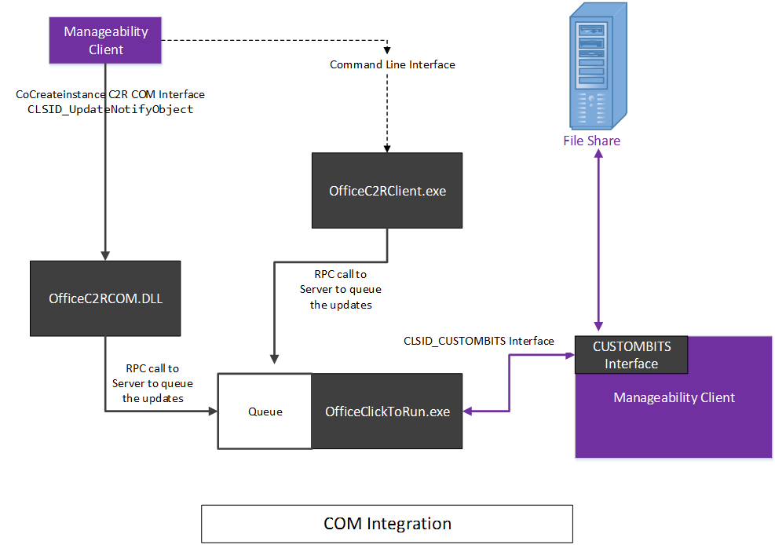
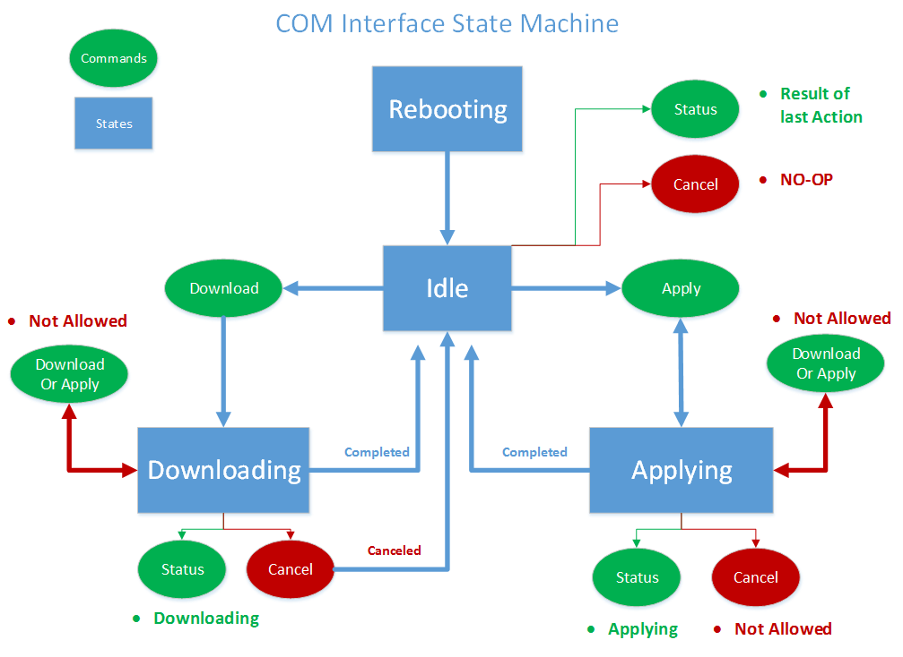
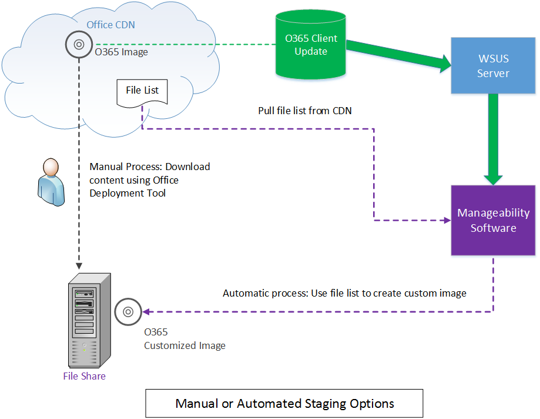
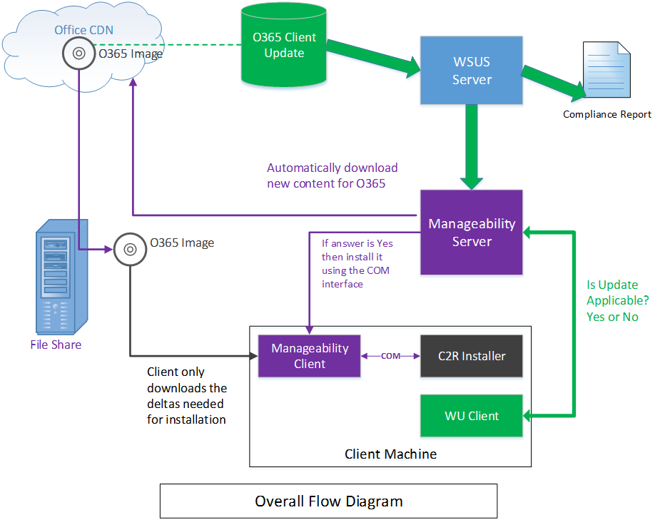

# <a name="integrating-manageability-applications-with-office-365-click-to-run-installer"></a><span data-ttu-id="07e85-103">Integrieren von Office 365 Klick-und-Los-Installer Verwaltbarkeit Applikationen</span><span class="sxs-lookup"><span data-stu-id="07e85-103">Integrating manageability applications with Office 365 click-to-run installer</span></span>

<span data-ttu-id="07e85-104">Erfahren Sie, wie das Installationsprogramm von Office 365 Klick-und-Los in eine Software Management-Lösung zu integrieren.</span><span class="sxs-lookup"><span data-stu-id="07e85-104">Learn how to integrate the Office 365 Click-to-Run installer with a software management solution.</span></span>
  
<span data-ttu-id="07e85-105">Der Office 365 Klick-und-Los-Installer bietet eine COM-Schnittstelle, die IT-Spezialisten und Software-Management-Lösungen programmgesteuerte Kontrolle über die Verwaltung von ermöglicht.</span><span class="sxs-lookup"><span data-stu-id="07e85-105">The Office 365 Click-to-Run installer provides a COM interface that allows IT Professionals and software management solutions programmatic control over update management.</span></span> <span data-ttu-id="07e85-106">Diese Schnittstelle bietet zusätzliche Verwaltungsfunktionen außerhalb von Office-Bereitstellungstool bereitgestellt werden.</span><span class="sxs-lookup"><span data-stu-id="07e85-106">This interface provides additional management capabilities beyond what is provided by the Office Deployment Tool.</span></span>
  
> [!NOTE]
> <span data-ttu-id="07e85-107">Dieser Artikel bezieht sich auf Office 2016 und höher, Office 365.</span><span class="sxs-lookup"><span data-stu-id="07e85-107">This article applies to Office 2016 and later, Office 365.</span></span> 
  
## <a name="integrating-with-the-click-to-run"></a><span data-ttu-id="07e85-108">Integrieren von Klick-und-los</span><span class="sxs-lookup"><span data-stu-id="07e85-108">Integrating with the Click-to-Run</span></span>

<span data-ttu-id="07e85-109">Wenn diese Schnittstelle verwenden möchten, eine Verwaltbarkeit-Anwendung die COM-Schnittstelle aufgerufen, und Aufrufe verfügbar gemacht, APIs, die direkt mit der Klick-und-Los-Installationsdienst kommunizieren.</span><span class="sxs-lookup"><span data-stu-id="07e85-109">To use this interface, a manageability application invokes the COM interface and calls exposed APIs that communicate directly with the Click-to-Run installation service.</span></span> 
  
> [!NOTE]
> <span data-ttu-id="07e85-110">Das Installationsprogramm von Office Klick-und-Los kann über die Befehlszeile aufgerufen mit Parametern, die das Verhalten steuern können ausgeführt werden, wie in der [Office-Bereitstellungstool für Klick-und-Los](https://www.microsoft.com/en-us/download/details.aspx?id=49117)dokumentiert.</span><span class="sxs-lookup"><span data-stu-id="07e85-110">The Office Click-to-Run installer can be run from the command-line with parameters that can control the behavior, as documented in [Office Deployment Tool for Click-to-Run](https://www.microsoft.com/en-us/download/details.aspx?id=49117).</span></span> 
  
<span data-ttu-id="07e85-111">**Nachfolgend sehen Sie ein konzeptionelles Diagramm der COM-Schnittstelle**</span><span class="sxs-lookup"><span data-stu-id="07e85-111">**Following is a conceptual diagram of the COM interface**</span></span>

<span data-ttu-id="07e85-112">![Ein Diagramm der Verwendung der COM-Schnittstelle auf das Installationsprogramm von Office Klick-und-los.] (media/e7ac2523-e67b-4a44-ae67-c048709f872a.png "Ein Diagramm der Verwendung der COM-Schnittstelle auf die Office Klick-und-Los-installer")</span><span class="sxs-lookup"><span data-stu-id="07e85-112"></span></span>
  
<span data-ttu-id="07e85-113">Die Office 365-Klick-und-Los-Installer implementiert, die ein COM-basiertes Schnittstelle **IUpdateNotify** registriert für CLSID **CLSID_UpdateNotifyObject**.</span><span class="sxs-lookup"><span data-stu-id="07e85-113">The Office 365 Click-to-Run installer implements a COM-based interface, **IUpdateNotify** registered to CLSID **CLSID_UpdateNotifyObject**.</span></span>
  
<span data-ttu-id="07e85-114">Diese Schnittstelle kann wie folgt aufgerufen werden:</span><span class="sxs-lookup"><span data-stu-id="07e85-114">This interface can be invoked as follows:</span></span>
  
```cpp
hr = CoCreateInstance(CLSID_UpdateNotifyObject, NULL, CLSCTX_ALL,
       IID_IUpdateNotify, 
      (void **)&p); 
```

<span data-ttu-id="07e85-115">Der Anruf nur erfolgreich, wenn der Aufrufer unter erhöhten Berechtigungen ausgeführt wird wie das Klick-und-Los-Installationsprogramm mit erhöhten Rechten ausgeführt werden muss.</span><span class="sxs-lookup"><span data-stu-id="07e85-115">The call will only succeed if the caller is running under elevated privileges, as the Click-to-Run installation program must be run with elevated privileges.</span></span>
  
<span data-ttu-id="07e85-116">Die **IUpdateNotify** COM-Schnittstelle werden drei asynchrone Funktionen verantwortlich für die Überprüfung der Befehle und Parameter und planen die Ausführung mit der Klick-und-Los-Installationsdienst verfügbar gemacht.</span><span class="sxs-lookup"><span data-stu-id="07e85-116">The **IUpdateNotify** COM interface exposes three asynchronous functions responsible for validating the commands and parameters and scheduling execution with the Click-to-Run installation service.</span></span> 
  
```cpp
HRESULT Download([in] LPWSTR pcwszParameters) // Download update content.
HRESULT Apply([in] LPWSTR pcwszParameters) // Apply update content.
HRESULT Cancel() // Cancel the download action.

```

<span data-ttu-id="07e85-117">Eine Methode, **Status**, kann vorwärts zum Abrufen von Informationen über den Status des letzten ausgeführten Befehl oder den Status der derzeit ausgeführten Befehl (d. h. Erfolg, Fehler, detaillierten Fehlercodes) verwendet werden.</span><span class="sxs-lookup"><span data-stu-id="07e85-117">A forth method, **Status**, can be used to get information about the status of the last executed command or the status of the currently executing command (i.e. success, failure, detailed error codes).</span></span>
  
```cpp
HRESULT status([out] _UPDATE_STATUS_REPORT* pUpdateStatusReport) // Get status of current action. 
typedef struct _UPDATE_STATUS_REPORT  
{  
UPDATE_STATUS status;  
UINT error; 
BSTR contentid;  
} UPDATE_STATUS_REPORT;

```

<span data-ttu-id="07e85-118">Es gibt vier Zustände, die die Klick-und-Los-Installationsdienst in während ihres Lebenszyklus möglicherweise während der möglicherweise **IUpdateNotify** Methoden aufgerufen werden. Neustart Leerlauf, herunterladen und anwenden.</span><span class="sxs-lookup"><span data-stu-id="07e85-118">There are four states that the Click-to-Run installation service may be in during its lifecycle, during which **IUpdateNotify** methods may be called; Rebooting, Idle, Downloading and Applying.</span></span> 
  
<span data-ttu-id="07e85-119">**Nachfolgend sehen Sie das COM-Schnittstelle Zustandsautomat-Diagramm**</span><span class="sxs-lookup"><span data-stu-id="07e85-119">**Following is the COM Interface State Machine diagram**</span></span>

<span data-ttu-id="07e85-120">![Ein Zustandsdiagramm für die COM-Schnittstelle.] (media/a409003e-6876-4ab3-bb4c-cd0c0fed5cbb.png "Ein Zustandsdiagramm für die COM-Schnittstelle")</span><span class="sxs-lookup"><span data-stu-id="07e85-120"></span></span>
  
> [!NOTE]
> <span data-ttu-id="07e85-121">**Rebooting**: beim Starten des Computers ist eine bestimmte Zeitspanne bei der Klick-und-Los-Installer-Dienst nicht verfügbar ist ist.</span><span class="sxs-lookup"><span data-stu-id="07e85-121">**Rebooting**: When the machine is booting there is a period of time when the Click-to-Run installer service is not available.</span></span> <span data-ttu-id="07e85-122">Ein erfolgreicher Aufruf an die Status-Methode nach einem Neustart wird eUPDATE_UNKNOWN zurückgegeben.</span><span class="sxs-lookup"><span data-stu-id="07e85-122">A successful call to the Status method after a reboot will return eUPDATE_UNKNOWN.</span></span> 
  
<span data-ttu-id="07e85-123">**Im Leerlauf:** Wenn das Klick-und-Los-Installationsprogramm im Leerlauf ist, können Sie aufrufen:</span><span class="sxs-lookup"><span data-stu-id="07e85-123">**Idle:** When the Click-to-Run installer is in the idle state, you can call:</span></span> 
  
- <span data-ttu-id="07e85-124">**Übernehmen**: Install zuvor Inhalte heruntergeladen.</span><span class="sxs-lookup"><span data-stu-id="07e85-124">**Apply**: Install previously downloaded content.</span></span>
    
- <span data-ttu-id="07e85-125">**Abbrechen**: Gibt `0x800000e`, "wurde eine Methode aufgerufen zu einem unerwarteten Zeitpunkt."</span><span class="sxs-lookup"><span data-stu-id="07e85-125">**Cancel**: Returns  `0x800000e`, "A method was called at an unexpected time."</span></span>
    
- <span data-ttu-id="07e85-126">**Herunterladen**: neuen Inhalte an den Client für spätere Installation Downloads.</span><span class="sxs-lookup"><span data-stu-id="07e85-126">**Download**: Downloads new content to the client for later installation.</span></span>
    
- <span data-ttu-id="07e85-127">**Status**: Gibt das Ergebnis der letzten abgeschlossenen Aktion oder eine Fehlermeldung zurück, wenn die Aktion Fehler beendet.</span><span class="sxs-lookup"><span data-stu-id="07e85-127">**Status**: Returns the result of the last completed action, or an error message if the action ended in failure.</span></span> <span data-ttu-id="07e85-128">Wenn keine vorherige Aktion vorhanden ist, gibt **Status** `eUPDATE_UNKNOWN`.</span><span class="sxs-lookup"><span data-stu-id="07e85-128">If there is no previous action, **Status** returns  `eUPDATE_UNKNOWN`.</span></span>
    
<span data-ttu-id="07e85-129">**Herunterladen:** Wenn das Klick-und-Los-Installationsprogramm im Download Zustand befindet, können Sie aufrufen:</span><span class="sxs-lookup"><span data-stu-id="07e85-129">**Downloading:** When the Click-to-Run installer is in the downloading state, you can call:</span></span> 
  
- <span data-ttu-id="07e85-130">**Übernehmen**: Gibt ein **HRESULT** mit dem Wert `0x800000e`, "wurde eine Methode aufgerufen zu einem unerwarteten Zeitpunkt."</span><span class="sxs-lookup"><span data-stu-id="07e85-130">**Apply**: Returns an **HRESULT** with the value  `0x800000e`, "A method was called at an unexpected time."</span></span>
    
- <span data-ttu-id="07e85-131">**Abbrechen**: stoppt das Herunterladen und die teilweise heruntergeladene Inhalte entfernt.</span><span class="sxs-lookup"><span data-stu-id="07e85-131">**Cancel**: Stops the download and removes the partially downloaded content.</span></span>
    
- <span data-ttu-id="07e85-132">**Herunterladen**: Gibt ein **HRESULT** mit dem Wert `0x800000e`, "wurde eine Methode aufgerufen zu einem unerwarteten Zeitpunkt."</span><span class="sxs-lookup"><span data-stu-id="07e85-132">**Download**: Returns an **HRESULT** with the value  `0x800000e`, "A method was called at an unexpected time."</span></span> 
    
- <span data-ttu-id="07e85-133">**Status**: Gibt **DOWNLOAD_WIP** , um anzugeben, dass der Download Arbeit ausgeführt wird.</span><span class="sxs-lookup"><span data-stu-id="07e85-133">**Status**: Returns **DOWNLOAD_WIP** to indicate that download work is in progress.</span></span> 
    
<span data-ttu-id="07e85-134">**Anwenden:** Wenn der Klick-und-Los-Installer ist während der Installation zuvor Download von Inhalten:</span><span class="sxs-lookup"><span data-stu-id="07e85-134">**Applying:** When the Click-to-Run installer is in the process of installing previously download content:</span></span> 
  
- <span data-ttu-id="07e85-135">**Übernehmen**: Gibt ein **HRESULT** mit dem Wert `0x800000e`, "wurde eine Methode aufgerufen zu einem unerwarteten Zeitpunkt."</span><span class="sxs-lookup"><span data-stu-id="07e85-135">**Apply**: Returns an **HRESULT** with the value  `0x800000e`, "A method was called at an unexpected time."</span></span>
    
- <span data-ttu-id="07e85-136">**Abbrechen**: Gibt `0x800000e`, die Apply-Aktion kann nicht abgebrochen werden.</span><span class="sxs-lookup"><span data-stu-id="07e85-136">**Cancel**: Returns  `0x800000e`, the Apply action cannot be canceled.</span></span>
    
- <span data-ttu-id="07e85-137">**Herunterladen**: Gibt ein **HRESULT** mit dem Wert `0x800000e`, "wurde eine Methode aufgerufen zu einem unerwarteten Zeitpunkt."</span><span class="sxs-lookup"><span data-stu-id="07e85-137">**Download**: Returns an **HRESULT** with the value  `0x800000e`, "A method was called at an unexpected time."</span></span> 
    
- <span data-ttu-id="07e85-138">**Status**: Gibt **APPLY_WIP** , um anzugeben, die Arbeit gelten wird gerade durchgeführt.</span><span class="sxs-lookup"><span data-stu-id="07e85-138">**Status**: Returns **APPLY_WIP** to indicate that apply work is in progress.</span></span> 
    
> [!NOTE]
> <span data-ttu-id="07e85-139">Da OfficeC2RCOM ein COM-+-Dienst ist und dynamisch geladen wird, müssen Sie **CoCreateInstance** aufrufen, jedes Mal, wenn Sie eine Methode aufrufen, klicken Sie auf diese Klasse, um sicherzustellen, dass das erwartete Ergebnis zu erhalten.</span><span class="sxs-lookup"><span data-stu-id="07e85-139">Since OfficeC2RCOM is a COM+ service and is dynamically loaded, you need to call **CoCreateInstance** every time you call a method on this class to ensure that you get the expected result.</span></span> <span data-ttu-id="07e85-140">Erstellen einer neuen Instanz bei Bedarf behandelt dem COM + Service.</span><span class="sxs-lookup"><span data-stu-id="07e85-140">The COM+ service will handle creating a new instance if necessary.</span></span> <span data-ttu-id="07e85-141">Wenn eine der Methoden zum ersten Mal aufgerufen wird, COM + lädt das **IUpdateNotify** -Objekt und führen Sie es in einem der dllhost.exe Instanzen.</span><span class="sxs-lookup"><span data-stu-id="07e85-141">When one of the methods is called for the first time, COM+ will load the **IUpdateNotify** object and run it within one of the dllhost.exe instances.</span></span> <span data-ttu-id="07e85-142">Das neue Objekt wird für etwa 3 Minuten im Leerlauf aktiv bleiben.</span><span class="sxs-lookup"><span data-stu-id="07e85-142">The new object will stay active for about 3 minutes in idle.</span></span> <span data-ttu-id="07e85-143">Wenn ein nachfolgender Aufruf innerhalb von drei Minuten des letzten Aufrufs erfolgt, bleibt das **IUpdateNotify** -Objekt geladen, und eine neue Instanz wird nicht erstellt.</span><span class="sxs-lookup"><span data-stu-id="07e85-143">If a subsequent call is made within three minutes of the last call, the **IUpdateNotify** object will remain loaded and a new instance is not created.</span></span> <span data-ttu-id="07e85-144">Wenn kein Aufruf innerhalb von drei Minuten ausgeführt wird, das IUpdateNotify-Objekt wird nicht geladen, und ein neues **IUpdateNotify** -Objekt erstellt werden, wenn beim nächste Aufruf erfolgt.</span><span class="sxs-lookup"><span data-stu-id="07e85-144">If no call is made within three minutes, the IUpdateNotify object will be unloaded and a new **IUpdateNotify** object will be created when the next call is made.</span></span> 
  
## <a name="click-to-run-installer-com-api-reference-guide"></a><span data-ttu-id="07e85-145">Klick-und-Los-Installer COM-API (engl.)</span><span class="sxs-lookup"><span data-stu-id="07e85-145">Click-to-Run installer COM API reference guide</span></span>

<span data-ttu-id="07e85-146">In der folgenden API-Dokumentation:</span><span class="sxs-lookup"><span data-stu-id="07e85-146">In the following API reference documentation:</span></span>
  
- <span data-ttu-id="07e85-147">Parameter sind in einem Schlüssel/Wert-Paar Format durch Leerzeichen getrennt ein.</span><span class="sxs-lookup"><span data-stu-id="07e85-147">Parameters are in a key/value pair format separated by a space.</span></span>
    
- <span data-ttu-id="07e85-148">Der Parameter/Kleinschreibung nicht beachtet.</span><span class="sxs-lookup"><span data-stu-id="07e85-148">The parameters are not case-sensitive.</span></span>
    
- <span data-ttu-id="07e85-149">Es ist eine [Liste der Parameter](https://blogs.technet.microsoft.com/odsupport/2014/03/03/the-new-update-now-feature-for-office-2013-click-to-run-for-office365-and-its-associated-command-line-and-switches/) -Dokumentation verfügbar.</span><span class="sxs-lookup"><span data-stu-id="07e85-149">There is a [list of parameters](https://blogs.technet.microsoft.com/odsupport/2014/03/03/the-new-update-now-feature-for-office-2013-click-to-run-for-office365-and-its-associated-command-line-and-switches/) with documentation available.</span></span> 
    
- <span data-ttu-id="07e85-150">Zusammenfassung der IUpdateNotify2-Schnittstelle ist nun enthalten.</span><span class="sxs-lookup"><span data-stu-id="07e85-150">Summary of IUpdateNotify2 interface is now included.</span></span>
    
### <a name="apply"></a><span data-ttu-id="07e85-151">Apply</span><span class="sxs-lookup"><span data-stu-id="07e85-151">Apply</span></span>

```cpp
HRESULT Apply([in] LPWSTR pcwszParameters) // Apply update content.
```

#### <a name="parameters"></a><span data-ttu-id="07e85-152">Parameter</span><span class="sxs-lookup"><span data-stu-id="07e85-152">Parameters</span></span>

-  <span data-ttu-id="07e85-153">_Displaylevel_: **true** , wenn der Installationsstatus angezeigt, einschließlich Fehler, während des Aktualisierungsvorgangs; anzeigen **false** , wenn der Installationsstatus angezeigt, einschließlich Fehler, während des Aktualisierungsvorgangs ausblenden.</span><span class="sxs-lookup"><span data-stu-id="07e85-153">_displaylevel_: **true** to show the installation status, including errors, during the update process; **false** to hide the installation status, including errors, during the update process.</span></span> <span data-ttu-id="07e85-154">Der Standardwert ist **false**.</span><span class="sxs-lookup"><span data-stu-id="07e85-154">The default is **false**.</span></span>
    
-  <span data-ttu-id="07e85-155">_Forceappshutdown_: **true,** um das Office-Clientanwendungen heruntergefahren, wenn die Aktion **Übernehmen** sofort ausgelöst wird; zu erzwingen **false** , wenn Fehler auftreten, wenn Office-Clientanwendungen ausgeführt werden.</span><span class="sxs-lookup"><span data-stu-id="07e85-155">_forceappshutdown_: **true** to force Office applications to shut down immediately when the **Apply** action is triggered; **false** to fail if any Office applications are running.</span></span> <span data-ttu-id="07e85-156">Der Standardwert ist **false**.</span><span class="sxs-lookup"><span data-stu-id="07e85-156">The default is **false**.</span></span> <span data-ttu-id="07e85-157">Weitere Informationen finden Sie unter ["Hinweise"](#bk_ApplyRemark) .</span><span class="sxs-lookup"><span data-stu-id="07e85-157">See [Remarks](#bk_ApplyRemark) for more information.</span></span> 
    
  <span data-ttu-id="07e85-158">Wenn eine beliebige Office-Anwendung ausgeführt wird, wenn die Aktion **Übernehmen** ausgelöst wird, schlägt die **Apply** -Aktion in der Regel fehl.</span><span class="sxs-lookup"><span data-stu-id="07e85-158">If any Office application is running when the **Apply** action is triggered, the **Apply** action will usually fail.</span></span> <span data-ttu-id="07e85-159">Übergeben von `forceappshutdown=true` zu **Übernehmen** Methode bewirkt, dass den Dienst **OfficeClickToRun** sofort Herunterfahren der Anwendung und das Update installieren.</span><span class="sxs-lookup"><span data-stu-id="07e85-159">Passing  `forceappshutdown=true` to the **Apply** method will cause the **OfficeClickToRun** service to immediately shut down the applications and apply the update.</span></span> <span data-ttu-id="07e85-160">Der Benutzer kann in diesem Fall zu Datenverlusten kommen.</span><span class="sxs-lookup"><span data-stu-id="07e85-160">The user may experience data loss in this case.</span></span> 
    
#### <a name="return-results"></a><span data-ttu-id="07e85-161">Zurückgeben von Ergebnissen</span><span class="sxs-lookup"><span data-stu-id="07e85-161">Return results</span></span>

|||
|:-----|:-----|
|<span data-ttu-id="07e85-162">**S_OK**</span><span class="sxs-lookup"><span data-stu-id="07e85-162">**S_OK**</span></span> <br/> |<span data-ttu-id="07e85-163">Aktion wurde erfolgreich an den Klick-und-Los-Dienst für die Ausführung übermittelt.</span><span class="sxs-lookup"><span data-stu-id="07e85-163">Action was successfully submitted to the Click-To-Run service for execution.</span></span>  <br/> |
|<span data-ttu-id="07e85-164">**E_ACCESSDENIED**</span><span class="sxs-lookup"><span data-stu-id="07e85-164">**E_ACCESSDENIED**</span></span> <br/> |<span data-ttu-id="07e85-165">Der Anrufer wird nicht mit erhöhten Rechten ausgeführt.</span><span class="sxs-lookup"><span data-stu-id="07e85-165">The caller is not running with elevated privileges.</span></span>  <br/> |
|<span data-ttu-id="07e85-166">**E_INVALIDARG**</span><span class="sxs-lookup"><span data-stu-id="07e85-166">**E_INVALIDARG**</span></span> <br/> |<span data-ttu-id="07e85-167">Es wurden ungültige Parameter übergeben.</span><span class="sxs-lookup"><span data-stu-id="07e85-167">Invalid parameters were passed.</span></span>  <br/> |
|<span data-ttu-id="07e85-168">**E_ILLEGAL_METHOD_CALL**</span><span class="sxs-lookup"><span data-stu-id="07e85-168">**E_ILLEGAL_METHOD_CALL**</span></span> <br/> |<span data-ttu-id="07e85-169">Aktion ist zu diesem Zeitpunkt nicht zulässig.</span><span class="sxs-lookup"><span data-stu-id="07e85-169">Action is not allowed at this time.</span></span> <span data-ttu-id="07e85-170">Weitere Informationen finden Sie unter ["Hinweise"](#bk_ApplyRemark) .</span><span class="sxs-lookup"><span data-stu-id="07e85-170">See [Remarks](#bk_ApplyRemark) for more information.</span></span>  <br/> |

<a name="bk_ApplyRemark"></a>

#### <a name="remarks"></a><span data-ttu-id="07e85-171">Hinweise</span><span class="sxs-lookup"><span data-stu-id="07e85-171">Remarks</span></span>

- <span data-ttu-id="07e85-172">Wenn eine beliebige Office-Anwendung ausgeführt wird, wenn die Aktion **Übernehmen** ausgelöst wird, wird die Aktion **Übernehmen** fehl.</span><span class="sxs-lookup"><span data-stu-id="07e85-172">If any Office application is running when the **Apply** action is triggered, the **Apply** action will fail.</span></span> <span data-ttu-id="07e85-173">Übergeben von `forceappshutdown=true` für die **Apply** Methode bewirkt, dass den Dienst **OfficeClickToRun** sofort alle Office-Clientanwendungen Herunterfahren, die ausgeführt werden, und wenden Sie das Update.</span><span class="sxs-lookup"><span data-stu-id="07e85-173">Passing  `forceappshutdown=true` to the **Apply** method will cause the **OfficeClickToRun** service to immediately shut down any Office applications that are running and apply the update.</span></span> <span data-ttu-id="07e85-174">Der Benutzer kann Daten auftreten, wenn sie nicht, zum Speichern von Änderungen zum Öffnen von Dokumenten aufgefordert werden.</span><span class="sxs-lookup"><span data-stu-id="07e85-174">The user may experience data as they are not prompted to save changes to open documents..</span></span> 
    
- <span data-ttu-id="07e85-175">Diese Aktion kann nur ausgelöst werden, wenn der COM-Status auf einen der folgenden ist:</span><span class="sxs-lookup"><span data-stu-id="07e85-175">This action can only be triggered when the COM status is one of the following:</span></span> 
    
  - <span data-ttu-id="07e85-176">**eUPDATE_UNKNOWN**</span><span class="sxs-lookup"><span data-stu-id="07e85-176">**eUPDATE_UNKNOWN**</span></span>
    
  - <span data-ttu-id="07e85-177">**eDOWNLOAD_CANCELLED**</span><span class="sxs-lookup"><span data-stu-id="07e85-177">**eDOWNLOAD_CANCELLED**</span></span>
    
  - <span data-ttu-id="07e85-178">**eDOWNLOAD_FAILED**</span><span class="sxs-lookup"><span data-stu-id="07e85-178">**eDOWNLOAD_FAILED**</span></span>
    
  - <span data-ttu-id="07e85-179">**eDOWNLOAD_SUCCEEDED**</span><span class="sxs-lookup"><span data-stu-id="07e85-179">**eDOWNLOAD_SUCCEEDED**</span></span>
    
  - <span data-ttu-id="07e85-180">**eAPPLY_SUCCEEDED**</span><span class="sxs-lookup"><span data-stu-id="07e85-180">**eAPPLY_SUCCEEDED**</span></span>
    
  - <span data-ttu-id="07e85-181">**eAPPLY_FAILED**</span><span class="sxs-lookup"><span data-stu-id="07e85-181">**eAPPLY_FAILED**</span></span>
    
- <span data-ttu-id="07e85-182">Wenn Sie die **Apply** -Methode aufrufen, ohne zuvor Herunterladen von Inhalten, meldet die **Apply** -Methode nothing anzuwendende erkannt und den Prozess **Übernehmen** erfolgreich abgeschlossen wurde **erfolgreich beendet** .</span><span class="sxs-lookup"><span data-stu-id="07e85-182">If you call the **Apply** method without previously downloading content, the **Apply** method will report **Succeeded** as it detected nothing to apply and completed the **Apply** process successfully.</span></span> 
    
### <a name="cancel"></a><span data-ttu-id="07e85-183">Cancel</span><span class="sxs-lookup"><span data-stu-id="07e85-183">Cancel</span></span>

```cpp
HRESULT Cancel() // Cancel the download action.
```

#### <a name="return-results"></a><span data-ttu-id="07e85-184">Zurückgeben von Ergebnissen</span><span class="sxs-lookup"><span data-stu-id="07e85-184">Return results</span></span>

|||
|:-----|:-----|
|<span data-ttu-id="07e85-185">S_OK</span><span class="sxs-lookup"><span data-stu-id="07e85-185">S_OK</span></span>  <br/> |<span data-ttu-id="07e85-186">Aktion wurde erfolgreich an den Klick-und-Los-Dienst für die Ausführung übermittelt.</span><span class="sxs-lookup"><span data-stu-id="07e85-186">Action was successfully submitted to the Click-to-Run service for execution.</span></span>  <br/> |
|<span data-ttu-id="07e85-187">E_ILLEGAL_METHOD_CALL</span><span class="sxs-lookup"><span data-stu-id="07e85-187">E_ILLEGAL_METHOD_CALL</span></span>  <br/> |<span data-ttu-id="07e85-188">Aktion ist zu diesem Zeitpunkt nicht zulässig.</span><span class="sxs-lookup"><span data-stu-id="07e85-188">Action is not allowed at this time.</span></span> <span data-ttu-id="07e85-189">Finden Sie im Abschnitt ["Hinweise"](#bk_CancelRemarks) Weitere Informationen</span><span class="sxs-lookup"><span data-stu-id="07e85-189">See the [Remarks](#bk_CancelRemarks) section for more information</span></span>  <br/> |

<a name="bk_CancelRemarks"></a>

#### <a name="remarks"></a><span data-ttu-id="07e85-190">Hinweise</span><span class="sxs-lookup"><span data-stu-id="07e85-190">Remarks</span></span>

- <span data-ttu-id="07e85-191">Diese Methode kann nur dann ausgelöst, wenn die COM-Status Id **eDOWNLOAD_WIP**.</span><span class="sxs-lookup"><span data-stu-id="07e85-191">This method can only be triggered when the COM status id **eDOWNLOAD_WIP**.</span></span> <span data-ttu-id="07e85-192">Es wird versucht, die aktuelle Downloadaktion Abbrechen.</span><span class="sxs-lookup"><span data-stu-id="07e85-192">It will attempt to cancel the current download action.</span></span> <span data-ttu-id="07e85-193">Der COM-Status wird ändern, **eDOWNLOAD_CANCELLING** und schließlich auf **eDOWNLOAD_CANCELED**.</span><span class="sxs-lookup"><span data-stu-id="07e85-193">The COM status will change to **eDOWNLOAD_CANCELLING** and eventually change to **eDOWNLOAD_CANCELED**.</span></span> <span data-ttu-id="07e85-194">Der COM-Status wird **E_ILLEGAL_METHOD_CALL** zurück, wenn Sie zu einem anderen Zeitpunkt ausgelöst.</span><span class="sxs-lookup"><span data-stu-id="07e85-194">The COM status will return **E_ILLEGAL_METHOD_CALL** if triggered at any other time.</span></span> 
    
### <a name="download"></a><span data-ttu-id="07e85-195">Download</span><span class="sxs-lookup"><span data-stu-id="07e85-195">Download</span></span>

```cpp
HRESULT Download([in] LPWSTR pcwszParameters) // Download update content.
```

#### <a name="parameters"></a><span data-ttu-id="07e85-196">Parameter</span><span class="sxs-lookup"><span data-stu-id="07e85-196">Parameters</span></span>

-  <span data-ttu-id="07e85-197">_Displaylevel_: **true** , wenn der Installationsstatus angezeigt, einschließlich Fehler, während des Aktualisierungsvorgangs; anzeigen **false** , wenn der Installationsstatus angezeigt, einschließlich Fehler, während des Aktualisierungsvorgangs ausblenden.</span><span class="sxs-lookup"><span data-stu-id="07e85-197">_displaylevel_: **true** to show the installation status, including errors, during the update process; **false** to hide the installation status, including errors, during the update process.</span></span> <span data-ttu-id="07e85-198">Der Standardwert ist **false**.</span><span class="sxs-lookup"><span data-stu-id="07e85-198">The default is **false**.</span></span>
    
-  <span data-ttu-id="07e85-199">_Updatebaseurl_: URL auf die Quelle alternative herunterladen.</span><span class="sxs-lookup"><span data-stu-id="07e85-199">_updatebaseurl_: URL to the alternate download source.</span></span>
    
-  <span data-ttu-id="07e85-200">_Updatetoversion_: die Version Office zu aktualisieren.</span><span class="sxs-lookup"><span data-stu-id="07e85-200">_updatetoversion_: The version to update Office to.</span></span> <span data-ttu-id="07e85-201">Definieren Sie dieser Parameter, wenn Sie zu einer älteren Version als die Version zu aktualisieren, die derzeit installierten möchten.</span><span class="sxs-lookup"><span data-stu-id="07e85-201">Define this parameter if you want to update to an older version than the version that is currently installed.</span></span>
    
-  <span data-ttu-id="07e85-202">_Downloadsource_: CLSID der angepassten **IBackgroundCopyManager** -Implementierung (BITS Manager).</span><span class="sxs-lookup"><span data-stu-id="07e85-202">_downloadsource_: CLSID of the customized **IBackgroundCopyManager** implementation (BITS manager).</span></span> 
    
-  <span data-ttu-id="07e85-203">_Contentid_: identifiziert den Inhalt, den Content Server über die benutzerdefinierten BITS-Manager heruntergeladen werden.</span><span class="sxs-lookup"><span data-stu-id="07e85-203">_contentid_: Identifies the content to download from the content server through the customized BITS manager.</span></span> <span data-ttu-id="07e85-204">Dieser Wert wird über die BITS-Schnittstelle für die Interpretation übergeben.</span><span class="sxs-lookup"><span data-stu-id="07e85-204">This value is passed through the BITS interface for interpretation.</span></span>
    
#### <a name="return-results"></a><span data-ttu-id="07e85-205">Zurückgeben von Ergebnissen</span><span class="sxs-lookup"><span data-stu-id="07e85-205">Return results</span></span>

|||
|:-----|:-----|
|<span data-ttu-id="07e85-206">**S_OK**</span><span class="sxs-lookup"><span data-stu-id="07e85-206">**S_OK**</span></span> <br/> |<span data-ttu-id="07e85-207">Aktion wurde erfolgreich an den Klick-und-Los-Dienst für die Ausführung übermittelt.</span><span class="sxs-lookup"><span data-stu-id="07e85-207">Action was successfully submitted to the Click-To-Run service for execution.</span></span>  <br/> |
|<span data-ttu-id="07e85-208">**E_ACCESSDENIED**</span><span class="sxs-lookup"><span data-stu-id="07e85-208">**E_ACCESSDENIED**</span></span> <br/> |<span data-ttu-id="07e85-209">Der Anrufer wird nicht mit erhöhten Rechten ausgeführt.</span><span class="sxs-lookup"><span data-stu-id="07e85-209">The caller is not running with elevated privileges.</span></span>  <br/> |
|<span data-ttu-id="07e85-210">**E_INVALIDARG**</span><span class="sxs-lookup"><span data-stu-id="07e85-210">**E_INVALIDARG**</span></span> <br/> |<span data-ttu-id="07e85-211">Es wurden ungültige Parameter übergeben.</span><span class="sxs-lookup"><span data-stu-id="07e85-211">Invalid parameters were passed.</span></span>  <br/> |
|<span data-ttu-id="07e85-212">**E_ILLEGAL_METHOD_CALL**</span><span class="sxs-lookup"><span data-stu-id="07e85-212">**E_ILLEGAL_METHOD_CALL**</span></span> <br/> |<span data-ttu-id="07e85-213">Aktion ist zu diesem Zeitpunkt nicht zulässig.</span><span class="sxs-lookup"><span data-stu-id="07e85-213">Action is not allowed at this time.</span></span> <span data-ttu-id="07e85-214">Weitere Informationen finden Sie unter ["Hinweise"](#bk_DownloadRemark) .</span><span class="sxs-lookup"><span data-stu-id="07e85-214">See [Remarks](#bk_DownloadRemark) for more information.</span></span>  <br/> |

<a name="bk_DownloadRemark"></a>

#### <a name="remarks"></a><span data-ttu-id="07e85-215">Hinweise</span><span class="sxs-lookup"><span data-stu-id="07e85-215">Remarks</span></span>

- <span data-ttu-id="07e85-216">Sie müssen als ein Paar _Downloadsource_ und _Contentid_ angeben.</span><span class="sxs-lookup"><span data-stu-id="07e85-216">You must specify  _downloadsource_ and  _contentid_ as a pair.</span></span> <span data-ttu-id="07e85-217">Wenn dies nicht der Fall ist, wird die **Download** -Methode wird ein **E_INVALIDARG** -Fehler zurückgegeben.</span><span class="sxs-lookup"><span data-stu-id="07e85-217">If not, the **Download** method will return an **E_INVALIDARG** error.</span></span> 
    
- <span data-ttu-id="07e85-218">Wenn _Downloadsource_, _Contentid_und _Updatebaseurl_ angegeben werden, werden _Updatebaseurl_ ignoriert.</span><span class="sxs-lookup"><span data-stu-id="07e85-218">If  _downloadsource_,  _contentid_, and  _updatebaseurl_ are provided,  _updatebaseurl_ will be ignored.</span></span> 
    
- <span data-ttu-id="07e85-219">Diese Aktion kann nur ausgelöst werden, wenn der COM-Status auf einen der folgenden ist:</span><span class="sxs-lookup"><span data-stu-id="07e85-219">This action can only be triggered when the COM status is one of the following:</span></span> 
    
  - <span data-ttu-id="07e85-220">**eUPDATE_UNKNOWN**</span><span class="sxs-lookup"><span data-stu-id="07e85-220">**eUPDATE_UNKNOWN**</span></span>
    
  - <span data-ttu-id="07e85-221">**eDOWNLOAD_CANCELLED**</span><span class="sxs-lookup"><span data-stu-id="07e85-221">**eDOWNLOAD_CANCELLED**</span></span>
    
  - <span data-ttu-id="07e85-222">**eDOWNLOAD_FAILED**</span><span class="sxs-lookup"><span data-stu-id="07e85-222">**eDOWNLOAD_FAILED**</span></span>
    
  - <span data-ttu-id="07e85-223">**eDOWNLOAD_SUCCEEDED**</span><span class="sxs-lookup"><span data-stu-id="07e85-223">**eDOWNLOAD_SUCCEEDED**</span></span>
    
  - <span data-ttu-id="07e85-224">**eAPPLY_SUCCEEDED**</span><span class="sxs-lookup"><span data-stu-id="07e85-224">**eAPPLY_SUCCEEDED**</span></span>
    
  - <span data-ttu-id="07e85-225">**eAPPLY_FAILED**</span><span class="sxs-lookup"><span data-stu-id="07e85-225">**eAPPLY_FAILED**</span></span>
    
- <span data-ttu-id="07e85-226">Wenn Sie die **Apply** -Methode ohne zuvor heruntergeladenen Inhalte aufrufen, meldet die **Apply** -Methode nothing anzuwendende erkannt und den Prozess **Übernehmen** erfolgreich abgeschlossen wurde **erfolgreich beendet** .</span><span class="sxs-lookup"><span data-stu-id="07e85-226">If you call the **Apply** method without previously downloaded content, the **Apply** method will report **Succeeded** as it detected nothing to apply and completed the **Apply** process successfully.</span></span> 
    
#### <a name="examples"></a><span data-ttu-id="07e85-227">Beispiele</span><span class="sxs-lookup"><span data-stu-id="07e85-227">Examples</span></span>

- <span data-ttu-id="07e85-228">Zum Herunterladen des Inhalts aus dem angepassten BITS-Manager: Rufen Sie die **download()** -Funktion, indem Sie die folgenden Parameter übergeben:</span><span class="sxs-lookup"><span data-stu-id="07e85-228">To download the content from the customized BITS manager: Call the **download()** function passing the following parameters:</span></span> 
    
  ```cpp
  "downloadsource=CLSIDofBITSInterface contentid=BITSServerContentIdentifier"
  ```

- <span data-ttu-id="07e85-229">Zum Herunterladen des Inhalts aus dem Microsoft CDN: Rufen Sie die Funktion **download()** ohne Angabe von _Downloadsource_, _Contentid_oder _Updatebaseurl_ -Parameter.</span><span class="sxs-lookup"><span data-stu-id="07e85-229">To download the content from the Microsoft CDN: Call the **download()** function without specifying the  _downloadsource_,  _contentid_, or  _updatebaseurl_ parameters.</span></span> 
    
- <span data-ttu-id="07e85-230">Zum Herunterladen des Inhalts von einem benutzerdefinierten Speicherort: Rufen Sie die **download()** -Funktion, indem Sie den folgenden Parameter übergeben:</span><span class="sxs-lookup"><span data-stu-id="07e85-230">To download the content from a customized location: Call the **download()** function passing the following parameter:</span></span> 
    
  ```cpp
  "updatebaseurl=yourcontentserverurl"
  ```

### <a name="status"></a><span data-ttu-id="07e85-231">Status</span><span class="sxs-lookup"><span data-stu-id="07e85-231">Status</span></span>

```cpp
typdef struct _UPDATE_STATUS_REPORT
{
    UPDATE_STATUS status;
    UINT error;
    LPCWSTR contentid;
}UPDATE_STATUS_REPORT;
HRESULT status([out] _UPDATE_STATUS_REPORT& pUpdateStatusReport) // Get status of current action
```

#### <a name="parameters"></a><span data-ttu-id="07e85-232">Parameter</span><span class="sxs-lookup"><span data-stu-id="07e85-232">Parameters</span></span>

|||
|:-----|:-----|
| <span data-ttu-id="07e85-233">_pUpdateStatusReport_</span><span class="sxs-lookup"><span data-stu-id="07e85-233">_pUpdateStatusReport_</span></span> <br/> |<span data-ttu-id="07e85-234">Zeiger auf eine UPDATE_STATUS_REPORT-Struktur.</span><span class="sxs-lookup"><span data-stu-id="07e85-234">Pointer to an UPDATE_STATUS_REPORT structure.</span></span>  <br/> |
   
#### <a name="return-results"></a><span data-ttu-id="07e85-235">Zurückgeben von Ergebnissen</span><span class="sxs-lookup"><span data-stu-id="07e85-235">Return results</span></span>

|||
|:-----|:-----|
|<span data-ttu-id="07e85-236">**S_OK**</span><span class="sxs-lookup"><span data-stu-id="07e85-236">**S_OK**</span></span> <br/> |<span data-ttu-id="07e85-237">Die **Status** -Methode gibt immer dieses Ergebnis zurück.</span><span class="sxs-lookup"><span data-stu-id="07e85-237">The **Status** method always returns this result.</span></span> <span data-ttu-id="07e85-238">Überprüfen Sie die `UPDATE_STATUS_RESULT` Struktur für den Status der aktuellen Aktion.</span><span class="sxs-lookup"><span data-stu-id="07e85-238">Inspect the  `UPDATE_STATUS_RESULT` structure for the status of the current action.</span></span>  <br/> |
   
#### <a name="remarks"></a><span data-ttu-id="07e85-239">Hinweise</span><span class="sxs-lookup"><span data-stu-id="07e85-239">Remarks</span></span>

- <span data-ttu-id="07e85-240">Im Statusfeld der `UPDATE_STATUS_REPORT` enthält den Status der aktuellen Aktion.</span><span class="sxs-lookup"><span data-stu-id="07e85-240">The status field of the  `UPDATE_STATUS_REPORT` contains the status of the current action.</span></span> <span data-ttu-id="07e85-241">Die folgenden Status-Werte zurückgegeben:</span><span class="sxs-lookup"><span data-stu-id="07e85-241">One of the following status values is returned:</span></span> 
    
  ```cpp
  typedef enum _UPDATE_STATUS
  {
  eUPDATE_UNKNOWN = 0,
  eDOWNLOAD_PENDING,
  eDOWNLOAD_WIP,
  eDOWNLOAD_CANCELLING,
  eDOWNLOAD_CANCELLED,
  eDOWNLOAD_FAILED,
  eDOWNLOAD_SUCCEEDED,
  eAPPLY_PENDING,
  eAPPLY_WIP,
  eAPPLY_SUCCEEDED,
  eAPPLY_FAILED,
  } UPDATE_STATUS;
  
  ```

- <span data-ttu-id="07e85-242">Wenn ein Fehler auftritt, die Fehler dar, der im letzte Befehl zur Folge der `UPDATE_STATUS_REPORT` enthält detaillierte Informationen zu dem Fehler.</span><span class="sxs-lookup"><span data-stu-id="07e85-242">If the last command resulted in an error, the error field of the  `UPDATE_STATUS_REPORT` contains detailed information about the error.</span></span> <span data-ttu-id="07e85-243">Zwei Arten von Fehlercodes werden von der **Status** -Methode zurückgegeben.</span><span class="sxs-lookup"><span data-stu-id="07e85-243">Two types of error codes are returned from the **Status** method.</span></span> 
    
- <span data-ttu-id="07e85-244">Wenn der Fehler weniger als `UPDATE_ERROR_CODE::eUNKNOWN`, der Fehler befindet sich eine der folgenden vordefinierten Fehlercodes:</span><span class="sxs-lookup"><span data-stu-id="07e85-244">If the error less than  `UPDATE_ERROR_CODE::eUNKNOWN`, the error is one of the following pre-defined error codes:</span></span>
    
  ```cpp
  typedef enum _UPDATE_ERROR_CODE
  {
  eOK = 0,
  eFAILED_UNEXPECTED,
  eTRIGGER_DISABLED,
  ePIPELINE_IN_USE,
  eFAILED_STOP_C2RSERVICE,
  eFAILED_GET_CLIENTUPDATEFOLDER,
  eFAILED_LOCK_PACKAGE_TO_UPDATE,
  eFAILED_CREATE_STREAM_SESSION,
  eFAILED_PUBLISH_WORKING_CONFIGURATION,
  eFAILED_DOWNLOAD_UPGRADE_PACKAGE,
  eFAILED_APPLY_UPGRADE_PACKAGE,
  eFAILED_INITIALIZE_RSOD,
  eFAILED_PUBLISH_RSOD,
  // Keep this one as the last
  eUNKNOWN
  } UPDATE_ERROR_CODE;
  
  ```

  <span data-ttu-id="07e85-245">Wenn der zurückgegebenen Fehlercode übersteigt `UPDATE_ERROR_CODE::eUNKNOWN` **HRESULT** eines Funktionsaufrufs fehlgeschlagen ist.</span><span class="sxs-lookup"><span data-stu-id="07e85-245">If the return error code is larger than  `UPDATE_ERROR_CODE::eUNKNOWN` it is the **HRESULT** of a failed function call.</span></span> <span data-ttu-id="07e85-246">So extrahieren Sie das HRESULT subtrahieren `UPDATE_ERROR_CODE::eUNKNOWN` aus der im Fehlerfeld der zurückgegebene Wert der `UPDATE_STATUS_REPORT`.</span><span class="sxs-lookup"><span data-stu-id="07e85-246">To extract the HRESULT subtract  `UPDATE_ERROR_CODE::eUNKNOWN` from the value returned in the error field of the  `UPDATE_STATUS_REPORT`.</span></span>
    
  <span data-ttu-id="07e85-247">Die vollständige Liste der Status- und Fehlerinformationen Werte kann durch die **IUpdateNotify** -Typbibliothek in OfficeC2RCom.dll eingebettet überprüfen angezeigt werden.</span><span class="sxs-lookup"><span data-stu-id="07e85-247">The complete list of status and error values can be viewed by inspecting the **IUpdateNotify** type library embedded in OfficeC2RCom.dll.</span></span> 
    
- <span data-ttu-id="07e85-248">Feld Contentid wird für Anrufe beim **Status** nach dem **Download** wurde initiiert, und gibt die Contentid, die für den Aufruf der **herunterladen** übergeben wurde.</span><span class="sxs-lookup"><span data-stu-id="07e85-248">The contentid field is used for calls to **Status** after **Download** has initiated and returns the contentid that was passed in to the **Download** call.</span></span> <span data-ttu-id="07e85-249">Es ist ratsam, initialisiert dieses Feld auf **einen Nullwert fest** , bevor Sie die **Status** -Methode aufrufen, und überprüfen Sie den Wert an, nach dem **Status** zurückgegeben wurde.</span><span class="sxs-lookup"><span data-stu-id="07e85-249">It is a best practice to initialize this field to **null** before you call the **Status** method and then check the value after **Status** has been returned.</span></span> <span data-ttu-id="07e85-250">Wenn der Wert immer noch **null**ist, bedeutet dies, dass keine Contentid zurückzugebenden vorhanden ist.</span><span class="sxs-lookup"><span data-stu-id="07e85-250">If the value is still **null**, that means there is no contentid to return.</span></span> <span data-ttu-id="07e85-251">Wenn der Wert nicht **null**ist, müssen Sie es mit einem Aufruf von **SysFreeString() frei**frei.</span><span class="sxs-lookup"><span data-stu-id="07e85-251">If the value is not **null**, you need to free it with a call to **SysFreeString()**.</span></span> <span data-ttu-id="07e85-252">Nachfolgend finden Sie ein Codeausschnitt zum **Status** nach dem **herunterladen**aufrufen.</span><span class="sxs-lookup"><span data-stu-id="07e85-252">Here is a code snippet of how to call **Status** after **Download**.</span></span>
    
  ```cpp
  std::wstring contentID;
  UPDATE_STATUS_REPORT statusReport;
  statusReport.status = eUPDATE_UNKNOWN;
  statusReport.error = eOK;
  statusReport.contentid = NULL;
  hr = p->Status(&statusReport);
  if (statusReport.contentid != NULL)
  {
  contentID = statusReport.contentid;
  SysFreeString(statusReport.contentid);
  }
  wprintf(L"ContentID: %s, Status: %d, LastError: %d", contentID.c_str(), statusReport.status, statusReport.error);
  
  ```

### <a name="summary-of-iupdatenotify2-interface"></a><span data-ttu-id="07e85-253">Zusammenfassung der IUpdateNotify2-Schnittstelle</span><span class="sxs-lookup"><span data-stu-id="07e85-253">Summary of IUpdateNotify2 interface</span></span>

> [!NOTE]
> <span data-ttu-id="07e85-254">Diese Zusammenfassung wird als eine Ergänzung-Info für [Integrating Verwaltbarkeit Clientanwendungen mit dem Office 365 Klick-und-Los-Installationsprogramm](https://msdn.microsoft.com/EN-US/library/office/mt608768.aspx)bereitgestellt.</span><span class="sxs-lookup"><span data-stu-id="07e85-254">This summary is provided as a compliment info to [Integrating manageability applications with the Office 365 click-to-run installer](https://msdn.microsoft.com/EN-US/library/office/mt608768.aspx).</span></span> <span data-ttu-id="07e85-255">Nachdem die öffentlichen Doc aktualisiert wird, kann dieses Dokument als veraltet betrachtet werden.</span><span class="sxs-lookup"><span data-stu-id="07e85-255">Once the public doc is updated, this doc can be considered as obsolete.</span></span> 
  
<span data-ttu-id="07e85-256">Von C2RTenant [16.0.8208.6352](https://oloop/BuildGroup/Details/tenantc2rclient#3519/1255278) (erste öffentlich zugänglichen Build sollte Juni Verzweigung Build – 8326.\*) haben wir eine neue **IUpdateNotify2** Schnittstelle hinzugefügt.</span><span class="sxs-lookup"><span data-stu-id="07e85-256">From C2RTenant [16.0.8208.6352](https://oloop/BuildGroup/Details/tenantc2rclient#3519/1255278) (First publicly available build should be June fork build -- 8326.\*) we have added a new **IUpdateNotify2** interface.</span></span> <span data-ttu-id="07e85-257">Nachfolgend finden Sie einige grundlegende Informationen über diese Schnittstelle:</span><span class="sxs-lookup"><span data-stu-id="07e85-257">Here is some basic info about this interface:</span></span> 
  
- <span data-ttu-id="07e85-258">CLSID_UpdateNotifyObject2 {52C2F9C2-F1AC-4021-BF50-756A5FA8DDFE}</span><span class="sxs-lookup"><span data-stu-id="07e85-258">CLSID_UpdateNotifyObject2, {52C2F9C2-F1AC-4021-BF50-756A5FA8DDFE}</span></span>
    
- <span data-ttu-id="07e85-259">Diese Schnittstelle gehostet auch die ursprüngliche IUpdateNotify-Schnittstelle, um die Abwärtskompatibilität zu gewährleisten.</span><span class="sxs-lookup"><span data-stu-id="07e85-259">This interface also hosted the original IUpdateNotify interface to provide backward compatibility.</span></span> <span data-ttu-id="07e85-260">D. h., wenn Sie diese Schnittstelle verwenden, haben Sie Zugriff auf alle Methoden, die in **UpdateNotifyObject** -Schnittstelle bereitgestellt.</span><span class="sxs-lookup"><span data-stu-id="07e85-260">Which means if you use this interface, you have access to all the methods provided in **UpdateNotifyObject** interface.</span></span> 
    
- <span data-ttu-id="07e85-261">Neue Methoden IUpdateNotify2 hinzugefügt:</span><span class="sxs-lookup"><span data-stu-id="07e85-261">New methods added to IUpdateNotify2:</span></span>
    
  - <span data-ttu-id="07e85-262">**HRESULT** GetBlockingApps ([out] BSTR \* AppsList).</span><span class="sxs-lookup"><span data-stu-id="07e85-262">**HRESULT** GetBlockingApps([out] BSTR \* AppsList).</span></span> <span data-ttu-id="07e85-263">Rufen Sie Updates blockieren apps-Liste ab.</span><span class="sxs-lookup"><span data-stu-id="07e85-263">Get updates blocking apps list.</span></span> <span data-ttu-id="07e85-264">Dieses Anrufs gibt ausgeführten Office-apps zurück, die den Aktualisierungsprozess aus fortfahren blockiert wird.</span><span class="sxs-lookup"><span data-stu-id="07e85-264">This call will return running Office apps which will block the update process from proceeding.</span></span> 
    
  - <span data-ttu-id="07e85-265">**HRESULT** GetOfficeDeploymentData (Int unter DataType **LPCWSTR** PcwszName, BSTR [out] [in] [in] \* OfficeData).</span><span class="sxs-lookup"><span data-stu-id="07e85-265">**HRESULT** GetOfficeDeploymentData([in] int dataType, [in] **LPCWSTR** pcwszName, [out] BSTR \* OfficeData).</span></span> <span data-ttu-id="07e85-266">Möchten Sie Office-Bereitstellung Daten erhalten.</span><span class="sxs-lookup"><span data-stu-id="07e85-266">Get Office deployment Data.</span></span> 
    
- <span data-ttu-id="07e85-267">Wenn Sie die neuen Methoden verwenden möchten, müssen Sie dafür sorgen:</span><span class="sxs-lookup"><span data-stu-id="07e85-267">If you want to use the new methods, you need to make sure:</span></span>
    
  - <span data-ttu-id="07e85-268">Ihre C2R Version ist neuer als die oben genannten Build (\>= Juni Verzweigung Build).</span><span class="sxs-lookup"><span data-stu-id="07e85-268">Your C2R version is newer than the above build (\>= June fork build).</span></span>
    
  - <span data-ttu-id="07e85-269">Verwenden Sie UpdateNotifyObject2, anstatt **UpdateNotifyObject** **CoCreateInstance**aufrufen.</span><span class="sxs-lookup"><span data-stu-id="07e85-269">Use UpdateNotifyObject2, instead of **UpdateNotifyObject** to call **CoCreateInstance**.</span></span>
    
<span data-ttu-id="07e85-270">Wenn Sie eine der neuen Methoden nicht verwenden, müssen Sie nichts ändern.</span><span class="sxs-lookup"><span data-stu-id="07e85-270">If you don't use any of the new methods, you don't need to change anything.</span></span> <span data-ttu-id="07e85-271">Alle vorhandenen Methoden funktioniert als genau die gleiche Weise wie vor.</span><span class="sxs-lookup"><span data-stu-id="07e85-271">All the existing methods will work as exact the same way as before.</span></span>
  
## <a name="implementing-the-bits-interface"></a><span data-ttu-id="07e85-272">Implementieren der BITS-Schnittstelle</span><span class="sxs-lookup"><span data-stu-id="07e85-272">Implementing the BITS interface</span></span>

<span data-ttu-id="07e85-273">Den [Intelligenten Hintergrundübertragungsdienst](https://msdn.microsoft.com/library/bb968799(v=vs.85).aspx) (BITS) ist ein Dienst von Microsoft zum Übertragen von Dateien zwischen einem Client und Server bereitgestellt.</span><span class="sxs-lookup"><span data-stu-id="07e85-273">The [Background Intelligent Transfer Service](https://msdn.microsoft.com/library/bb968799(v=vs.85).aspx) (BITS) is a service provided by Microsoft to transfer files between a client and server.</span></span> <span data-ttu-id="07e85-274">BITS ist einer der Kanäle, die Office Klick-und-Los-Installer verwenden können, um Inhalte herunterzuladen.</span><span class="sxs-lookup"><span data-stu-id="07e85-274">BITS is one of the channels that Office Click-To-Run installer can use to download content.</span></span> <span data-ttu-id="07e85-275">In der Standardeinstellung integriert der Office Klick-und-Los Installer verwendet die Windows Implementierung von BITS zum Herunterladen des Inhalts aus dem CDN.</span><span class="sxs-lookup"><span data-stu-id="07e85-275">By default, the Office Click-To-Run installer uses the Windows' built in implementation of BITS to download the content from the CDN.</span></span> 
  
<span data-ttu-id="07e85-276">Durch eine benutzerdefinierte Implementierung BITS an **der Download()-Methode** der **IUpdateNotify** -Schnittstelle bereitstellen, kann Ihre Software Verwaltbarkeit steuern, wo und wie der Client den Inhalt downloads.</span><span class="sxs-lookup"><span data-stu-id="07e85-276">By providing a customized BITS implementation to the **download()** method of the **IUpdateNotify** interface, your manageability software can control where and how the client downloads the content.</span></span> <span data-ttu-id="07e85-277">Eine benutzerdefinierte BITS-Schnittstelle ist nützlich, wenn einen benutzerdefinierte Verteilung von Inhalten Channel als integrierte Klick-und-Los-Kanäle, wie beispielsweise dem Office-CDN IIS-Servern bereitstellen oder Dateifreigaben.</span><span class="sxs-lookup"><span data-stu-id="07e85-277">A customized BITS interface is useful when providing a custom content distribution channel other than the Click-to-Run built-in channels, such as the Office CDN, IIS servers, or file shares.</span></span> 
  
<span data-ttu-id="07e85-278">Die Mindestanforderung für eine benutzerdefinierte BITS-Schnittstelle zum Arbeiten mit Office C2R-Dienst ist:</span><span class="sxs-lookup"><span data-stu-id="07e85-278">The minimum requirement for a customized BITS interface to work with Office C2R service is:</span></span>
  
- <span data-ttu-id="07e85-279">Für **IBackgroundCopyManager**:</span><span class="sxs-lookup"><span data-stu-id="07e85-279">For **IBackgroundCopyManager**:</span></span>
    
  ```cpp
  HRESULT _stdcall CreateJob(
                      [in] LPWSTR DisplayName, 
                      [in] BG_JOB_TYPE Type, 
                      [out] GUID* pJobId, 
                      [out] IBackgroundCopyJob** ppJob)
  HRESULT _stdcall GetJob(
                      [in] GUID* jobID, 
                      [out] IBackgroundCopyJob** ppJob)
  HRESULT _stdcall EnumJobs(
                      [in] unsigned long dwFlags, 
                      [out] IEnumBackgroundCopyJobs** ppenum)
  
  ```

- <span data-ttu-id="07e85-280">Für **IBackgroundCopyJob**:</span><span class="sxs-lookup"><span data-stu-id="07e85-280">For **IBackgroundCopyJob**:</span></span>
    
  ```cpp
  HRESULT _stdcall AddFile(
                      [in] LPWSTR RemoteUrl, 
                      [in] LPWSTR LocalName)
  HRESULT _stdcall Resume()
  HRESULT _stdcall Complete()
  HRESULT _stdcall Cancel();
  HRESULT _stdcall GetState([out] BG_JOB_STATE* pVal);
  HRESULT GetProgress( [out] BG_JOB_PROGRESS *pProgress);
  
  ```

- <span data-ttu-id="07e85-281">Für **IBackgroundCopyJob3**:</span><span class="sxs-lookup"><span data-stu-id="07e85-281">For **IBackgroundCopyJob3**:</span></span>
    
  ```cpp
  HRESULT _stdcall AddFileWithRanges(
                      [in] LPWSTR RemoteUrl, 
                      [in] LPWSTR LocalName,
                      [in] DWORD RangeCount,
                      [in] BG_FILE_RANGE Ranges[])
  
  ```

- <span data-ttu-id="07e85-282">Für die `Addfile` und `AddFileWithRanges` Funktionen, die remote-URL ist im folgenden Format:</span><span class="sxs-lookup"><span data-stu-id="07e85-282">For the  `Addfile` and  `AddFileWithRanges` functions, the remote URL is in the following format:</span></span> 
    
  ```cpp
  cmbits://<contentid>/<relative path to target file>
  ```

  - <span data-ttu-id="07e85-283">Cmbits ist schwierig codiert und steht für angepasste BITS.</span><span class="sxs-lookup"><span data-stu-id="07e85-283">cmbits is hard coded, and stands for customized BITS.</span></span>
    
  -  <span data-ttu-id="07e85-284">_ \<Contentid\> _ ist der Parameter _Contentid_ für **die Download()-Methode** .</span><span class="sxs-lookup"><span data-stu-id="07e85-284">_\<contentid\>_ is the  _contentid_ parameter for the **Download()** method.</span></span> 
    
  -  <span data-ttu-id="07e85-285">_ \<relativen Pfad zur Zieldatei\> _ stellt den Speicherort und den Namen der Datei zum Herunterladen bereit.</span><span class="sxs-lookup"><span data-stu-id="07e85-285">_\<relative path to target file\>_ provides the location and file name of the file to download.</span></span> 
    
    <span data-ttu-id="07e85-286">Beispielsweise, wenn Sie eine _Contentid_ des bereitgestellt haben `f732af58-5d86-4299-abe9-7595c35136ef` der **Download()** -Methode und Office C2R möchte, laden Sie die Version CAB-Datei wie `v32.cab` Datei, wird es **AddFile()** aufrufen, durch den folgenden `RemoteUrl`:</span><span class="sxs-lookup"><span data-stu-id="07e85-286">For example, if you have provided a  _contentid_ of  `f732af58-5d86-4299-abe9-7595c35136ef` to the **Download()** method, and Office C2R wants to download the version cab file, such as  `v32.cab` file, it will call **AddFile()** with the following  `RemoteUrl`:</span></span>
    
  ```cpp
  cmbits://f732af58-5d86-4299-abe9-7595c35136ef/Office/Data/V32.cab
  ```

- <span data-ttu-id="07e85-287">Für **IBackgroundCopyError**:</span><span class="sxs-lookup"><span data-stu-id="07e85-287">For **IBackgroundCopyError**:</span></span>
    
  ```cpp
  HRESULT _stdcall GetErrorDescription(
        [in]  DWORD  LanguageId,
        [out] LPWSTR *ppErrorDescription);
  
  ```

- <span data-ttu-id="07e85-288">Für **IBackgroundCopyFile**:</span><span class="sxs-lookup"><span data-stu-id="07e85-288">For **IBackgroundCopyFile**:</span></span>
    
  ```cpp
  HRESULT _stdcall GetLocalName([out] LPWSTR *ppName); 
  HRESULT _stdcall GetRemoteName([out] LPWSTR *ppName);
  
  ```

<!--## Automating content staging

IT administrators can choose to have desktop clients enabled to automatically receive updates when they are available directly from the Microsoft Content Delivery Network (CDN) or they can choose to control the deployment of updates available from the [update channels](https://support.office.com/en-us/article/Overview-of-update-channels-for-Office-365-ProPlus-9ccf0f13-28ff-4975-9bd2-7e4ea2fefef4?ui=en-US&rs=en-US&ad=US) using the [Office 2016 Deployment Tool](https://www.microsoft.com/en-us/download/details.aspx?id=49117) or [System Center Configuration Manager](https://support.office.com/en-us/article/Manage-updates-to-Office-365-ProPlus-with-System-Center-Configuration-Manager-b4a17328-fcfe-40bf-9202-58d7cbf1cede).
  
The service supports the ability for management tools to recognize and automate the download of the content when updates are made available.
  
**Following is a diagram showing the overview of downloading a custom image**


  
In the above diagram you see that a new Office 365 ProPlus image is available on the Office Content Distribution Network (CDN). Along with the Office 365 ProPlus image, an XML-formatted file list is also available which has the information needed to enable manageability software to directly create customized images replacing the need for using the Office Deployment Tool.
  
An enterprise configures their WSUS to sync the Office 365 Client Updates. These updates do not contain the actual image payload but does allow the manageability software to recognize when new content is available. The manageability software can then read the Client Update metadata to understand what version of Office the update applies to.
  
If the update is applicable, the manageability software can use the CDN content and the file list to create the custom image and store it onto the file share location that it is configured to use.
  
### Format of the XML file list

There are two file lists available in a cab file on the CDN. One lists the files for the 32-bit version of Office and one for the 64-bit version of Office. The URL of the location of the Office File List (OFL.CAB) file is [https://officecdn.microsoft.com/pr/wsus/ofl.cab](https://officecdn.microsoft.com/pr/wsus/ofl.cab). The two file lists are called:
  
- O365Client_32bit.xml
    
- O365Client_64bit.xml
    
Within the XML for each of the file lists is an  `UpdateFiles` node which contains a version attribute.  `UpdateFiles version="1.4"`.
  
This version is incremented if changes are made to the file lists.
  
There are two parameters that need to be combined with the XML to make a custom image: 
  
- Replace  _%version%_ with the build version of Office. This can be derived from the Client Update metadata  `MoreInfoURL` field, see below. 
    
- Define  _baseURL_ by using the URL value associated with the branch the image is being created for. This can be derived from the Client Update metadata, see below. 
    
The steps for creating an image are:
  
1. Open the XML file list.
    
2. Replace occurrences of  _%version%_ with the applicable Office build version. The build version can be acquired from releasehistory.xml as described later in this article. 
    
3. Read the URL attribute for the target branch.
    
4. Remove language nodes for any languages not required in the custom image.
    
   > [!NOTE]
   > Nodes with language='0' are language neutral and must be included in the image. 
  
5. Construct a local image of the CDN by iterating through the XML file list and copying the CDN files, while creating the folder structure as needed. 
    
   - If the  _rename_ attribute is provided, then rename the copied file to the value provided in the  _rename_ attribute. This used to create the top-level default v64.cab and v32.cab files. These are the renamed versions of the top-level build cab file and are used as the default installation version if the version is not specified. 
    
   - Use URL + relativePath + filename to construct the CDN location.
    
The following examples use the Monthly channel (as defined by the  `baseURL` node) and build version 16.0.4229.1004 from releasehistory.xml. 
  
```cpp
baseURL branch="Monthly" URL="https://officecdn.microsoft.com/pr/492350f6-3a01-4f97-b9c0-c7c6ddf67d60" /
```

- The following is a language neutral file needed for all languages. The name of the file is v64_16.0.4229.1004.cab and it should be copied from https://officecdn.microsoft.com/pr/492350f6-3a01-4f97-b9c0-c7c6ddf67d60/office/data/v64_16.0.4229.1004.cab and renamed to …/office/data/v64.cab.
    
  ```cpp
  baseURL branch="Business" URL="https://officecdn.microsoft.com/pr/7ffbc6bf-bc32-4f92-8982-f9dd17fd3114" /
  File name="v64_%version%.cab" rename="v64.cab" relativePath="/office/data/" language="0"/
  
  ```

- The following is a file to be included in the en-US image as designated by the language LCID=1033. The name of the file is s641033.cab and it should be copied from https://officecdn.microsoft.com/pr/492350f6-3a01-4f97-b9c0-c7c6ddf67d60/office/data/16.0.4229.1004/s641033.cab and not renamed.
    
  ```cpp
  File name="s641033.cab" relativePath="/office/data/%version%/" language="1033" /
  ```

### Hash verification of data files

Image creation tools may verify the integrity of the downloaded .dat files by comparing a computed HASH value with the supplied HASH value associated with each of the .dat files. Below is an example of a .dat file from the Monthly channel with build version 16.0.4229.1004 and language set to Bulgarian.
  
```cpp
File name="stream.x64.bg-bg.dat" hashLocation="s641026.cab/stream.x64.bg-bg.hash" hashAlgo="Sha256" relativePath="/office/data/%version%/" language="1026"
```

- The  _hashLocation_ attribute specifies the relative path location of the stream.x64.bg-bg.hash for the stream.x64.bg-bg.dat file. Construct the hash file location by concatenating URL + relativePath + hashLocation. In this example the stream.x64.bg-bg.hash location would be https://officecdn.microsoft.com/pr/492350f6-3a01-4f97-b9c0-c7c6ddf67d60/office/data/16.0.4229.1004/s641026.cab/stream.x64.bg-bg.hash 
    
- The  _hashAlgo_ attribute specifies what hashing algorithm was used. In this case the Sha256 algorithm was used. 
    
To validate the integrity of the stream.x64.bg-bg.dat file, open the stream.x64.bg-bg.hash and read the hash value from the first line of text in the hash file. Compare this to the has value that you computed using the specified hashing algorithm to verify that the values match. Use the following C# code to read the hash.
  
```cs
string[] readHashes = System.IO.File.ReadAllLines(tmpFile, Encoding.Unicode);
string readHash = readHashes.First();

```

### Office 365 Client Updates

Office 365 Client Updates enable manageability software to treat the Office 365 Client Updates in a manner very similar to any other WU update with one exception; the client updates do not contain an actual payload. The Office 365 Client Updates should not be installed on any clients but rather used to trigger the workflows with the manageability software replacing the installation command with the COM based installation mechanism shown above.
  
**Office 365 Client Update workflow**


  
Each Office 365 Client Update that is published includes metadata about the update. This metadata includes a parameter called  _MoreInfoUrl_ which can be used to derive the following information: 
  
-  _Ver_: Identifies the Office version associated with this update. For example 16.0.4229.1004.
    
-  _Branch_: Identifies the Update Channel for this update. Values include InsiderFast, Insiders, Monthly, Targeted, Broad. Additional values may be added in the future.
    
-  _Arch_: Identifies the processor architecture associated with this update.
    
-  _xmlVer_: Identifies the version of the XML file lists to use to construct the base image for this update.
    
-  _xmlPath_: Path to the OFL.CAB file that contains the XML file lists.
    
-  _xmlFile_: The name of the file list that should be used for this update. The value will be  `O365Client_32bit` or  `O365Client_64bit` and will match the value in  _Arch_.
    
The following is an example of the  _MoreInfoURL_ parameter which refers to the Office 365 Client Update for the 32-bit version of Office with build version of 16.0.2342.2343 on the Current channel. 
  
```http
https://officecdn.microsoft.com/pr/wsus/ofl.cab is the location of the XML file lists for this update, specifically the O365Client_32bit.xml from within the OFL.CAB.
https://go.microsoft.com/fwlink/?LinkId=626090&Ver=16.0.8326.2096&Branch=Current&Arch=64&XMLVer=1.4&xmlPath=https://officecdn.microsoft.com/pr/wsus/ofl.cab&xmlFile=O365Client_64bit.xml 

```
THE ABOVE SECTION APPEARS TO BE A DUPLICATE OF THE FOLLOWING SECTION; TEMPORARILY COMMENTING IT OUT.-->

## <a name="automating-content-staging"></a><span data-ttu-id="07e85-289">Automatisieren von staging</span><span class="sxs-lookup"><span data-stu-id="07e85-289">Automating content staging</span></span>

<span data-ttu-id="07e85-290">IT-Administratoren können festlegen, dass Desktopclients aktiviert, um Updates automatisch zu erhalten, wenn sie direkt aus dem Microsoft Content Delivery Network (CDN) verfügbar sind oder sie verhindern können, dass die Bereitstellung von Updates von der Update steuern mit dem Office-Bereitstellungstools oder System Center Configuration Manager Kanäle.</span><span class="sxs-lookup"><span data-stu-id="07e85-290">IT administrators can choose to have desktop clients enabled to automatically receive updates when they are available directly from the Microsoft Content Delivery Network (CDN) or they can choose to control the deployment of updates available from the update channels using the Office Deployment Tool or System Center Configuration Manager.</span></span>
  
<span data-ttu-id="07e85-291">Der Dienst unterstützt die Möglichkeit für Verwaltungstools zu erkennen und das Herunterladen des Inhalts automatisieren, wenn Updates verfügbar gemacht werden.</span><span class="sxs-lookup"><span data-stu-id="07e85-291">The service supports the ability for management tools to recognize and automate the download of the content when updates are made available.</span></span>
  
<span data-ttu-id="07e85-292">**In der folgenden Abbildung wird eine Übersicht über ein benutzerdefiniertes Bild herunterladen**</span><span class="sxs-lookup"><span data-stu-id="07e85-292">**The following image is an overview of downloading a custom image**</span></span>

<span data-ttu-id="07e85-293">![Ein Diagramm der Verwendung der COM-Schnittstelle auf das Installationsprogramm von Office Klick-und-los.] (media/e7ac2523-e67b-4a44-ae67-c048709f872a.png "Ein Diagramm der Verwendung der COM-Schnittstelle auf die Office Klick-und-Los-installer")</span><span class="sxs-lookup"><span data-stu-id="07e85-293"></span></span>
  
### <a name="overview-of-downloading-a-custom-image"></a><span data-ttu-id="07e85-294">Übersicht über ein benutzerdefiniertes Bild herunterladen</span><span class="sxs-lookup"><span data-stu-id="07e85-294">Overview of downloading a custom image</span></span>
  
<span data-ttu-id="07e85-295">Im vorherigen Diagramm sehen Sie, dass ein neues Office 365 ProPlus Bild auf der Office Content Verteilung Network (CDN) verfügbar ist.</span><span class="sxs-lookup"><span data-stu-id="07e85-295">In the previous diagram, you see that a new Office 365 ProPlus image is available on the Office Content Distribution Network (CDN).</span></span> <span data-ttu-id="07e85-296">Zusammen mit der Office 365 ProPlus Bild ist eine XML-formatierte Dateiliste auch verfügbar hat die Informationen für die Verwaltbarkeit Software direkt angepassten Bilder ersetzen die Notwendigkeit für die Verwendung von Office-Bereitstellungstool erstellt werden kann.</span><span class="sxs-lookup"><span data-stu-id="07e85-296">Along with the Office 365 ProPlus image, an XML-formatted file list is also available which has the information needed to enable manageability software to directly create customized images replacing the need for using the Office Deployment Tool.</span></span>
  
<span data-ttu-id="07e85-297">Ein Unternehmen konfiguriert ihre WSUS, um die Office 365-Clientupdates synchronisieren.</span><span class="sxs-lookup"><span data-stu-id="07e85-297">An enterprise configures their WSUS to sync the Office 365 Client Updates.</span></span> <span data-ttu-id="07e85-298">Diese Updates lässt die Verwaltbarkeit Software zu erkennen, wenn neuer Inhalt verfügbar ist jedoch keine tatsächliche Bild Nutzlast enthalten.</span><span class="sxs-lookup"><span data-stu-id="07e85-298">These updates do not contain the actual image payload but does allow the manageability software to recognize when new content is available.</span></span> <span data-ttu-id="07e85-299">Die Verwaltbarkeit Software können Sie lesen, die Metadaten zu aktualisieren, um verstehen, welche Version von Office, das Update angewendet wird.</span><span class="sxs-lookup"><span data-stu-id="07e85-299">The manageability software can then read the Client Update metadata to understand what version of Office the update applies to.</span></span>
  
<span data-ttu-id="07e85-300">Wenn das Update anwendbar ist, die Verwaltbarkeit Software mit den CDN-Inhalt und der Dateiliste können Sie das benutzerdefinierte Bild erstellen und speichern Sie sie auf den Speicherort der Freigabe, die sie konfiguriert ist verwenden.</span><span class="sxs-lookup"><span data-stu-id="07e85-300">If the update is applicable, the manageability software can use the CDN content and the file list to create the custom image and store it onto the file share location that it is configured to use.</span></span>
  
### <a name="format-of-the-xml-file-list"></a><span data-ttu-id="07e85-301">Format der Liste der XML-Datei</span><span class="sxs-lookup"><span data-stu-id="07e85-301">Format of the XML file list</span></span>

<span data-ttu-id="07e85-302">Es stehen zwei Dateilisten in einer CAB-Datei auf dem CDN.</span><span class="sxs-lookup"><span data-stu-id="07e85-302">There are two file lists available in a cab file on the CDN.</span></span> <span data-ttu-id="07e85-303">Eine Listet die Dateien für die 32-Bit-Version von Office und einen für 64-Bit-Version von Office.</span><span class="sxs-lookup"><span data-stu-id="07e85-303">One lists the files for the 32-bit version of Office and one for the 64-bit version of Office.</span></span> <span data-ttu-id="07e85-304">Die URL des Speicherorts der Liste der Office-Datei (OFL. CAB-Datei) Datei ist [https://officecdn.microsoft.com/pr/wsus/ofl.cab](https://officecdn.microsoft.com/pr/wsus/ofl.cab).</span><span class="sxs-lookup"><span data-stu-id="07e85-304">The URL of the location of the Office File List (OFL.CAB) file is [https://officecdn.microsoft.com/pr/wsus/ofl.cab](https://officecdn.microsoft.com/pr/wsus/ofl.cab).</span></span> <span data-ttu-id="07e85-305">Die zwei Dateilisten heißen:</span><span class="sxs-lookup"><span data-stu-id="07e85-305">The two file lists are called:</span></span>
  
- <span data-ttu-id="07e85-306">O365Client_32bit.Xml</span><span class="sxs-lookup"><span data-stu-id="07e85-306">O365Client_32bit.xml</span></span>
    
- <span data-ttu-id="07e85-307">O365Client_64bit.Xml</span><span class="sxs-lookup"><span data-stu-id="07e85-307">O365Client_64bit.xml</span></span>
    
<span data-ttu-id="07e85-308">In den XML-Code für jede der Datei Listen ist ein <UpdateFiles> Knoten, der ein Versionsattribut enthält.</span><span class="sxs-lookup"><span data-stu-id="07e85-308">Within the XML for each of the file lists is an <UpdateFiles> node which contains a version attribute.</span></span>  <span data-ttu-id="07e85-309">`<UpdateFiles version="1.4">`.</span><span class="sxs-lookup"><span data-stu-id="07e85-309"></span></span> <span data-ttu-id="07e85-310">Diese Version wird erhöht, wenn die Dateilisten geändert werden.</span><span class="sxs-lookup"><span data-stu-id="07e85-310">This version is incremented if changes are made to the file lists.</span></span>
  
<span data-ttu-id="07e85-311">Es gibt zwei Parameter, die mit den XML-Code zu einem benutzerdefinierten Bild kombiniert werden müssen:</span><span class="sxs-lookup"><span data-stu-id="07e85-311">There are two parameters that need to be combined with the XML to make a custom image:</span></span> 
  
- <span data-ttu-id="07e85-312">Ersetzen Sie *Version %* durch die Version von Office.</span><span class="sxs-lookup"><span data-stu-id="07e85-312">Replace  *%version%*  with the build version of Office.</span></span> <span data-ttu-id="07e85-313">Dies kann aus den Client-Update-Metadaten (im nächsten Abschnitt erläutert) abgeleitet werden.</span><span class="sxs-lookup"><span data-stu-id="07e85-313">This can be derived from the Client Update metadata (explained in the next section).</span></span> 
    
- <span data-ttu-id="07e85-314">Definieren von *BaseURL* mithilfe von URL-Wert der zugeordneten der Verzweigung, die, der für das Bild erstellt wird.</span><span class="sxs-lookup"><span data-stu-id="07e85-314">Define  *baseURL*  by using the URL value associated with the branch the image is being created for.</span></span> <span data-ttu-id="07e85-315">Dies ist die Client-Update-Metadaten, die im folgenden Abschnitt erläutert abgeleitet.</span><span class="sxs-lookup"><span data-stu-id="07e85-315">This is derived from the Client Update metadata, explained in the following section.</span></span> 
    
<span data-ttu-id="07e85-316">Die Schritte zum Erstellen eines Images sind:</span><span class="sxs-lookup"><span data-stu-id="07e85-316">The steps for creating an image are:</span></span>
  
1. <span data-ttu-id="07e85-317">Öffnen Sie die Liste der XML-Datei.</span><span class="sxs-lookup"><span data-stu-id="07e85-317">Open the XML file list.</span></span>
    
2. <span data-ttu-id="07e85-318">Ersetzen Sie Vorkommen von *Version %* mit der entsprechenden Version des Office-Build.</span><span class="sxs-lookup"><span data-stu-id="07e85-318">Replace occurrences of  *%version%*  with the applicable Office build version.</span></span> <span data-ttu-id="07e85-319">Die Build-Version kann von releasehistory.xml erworben werden, wie weiter unten in diesem Artikel beschrieben.</span><span class="sxs-lookup"><span data-stu-id="07e85-319">The build version can be acquired from releasehistory.xml as described later in this article.</span></span> 
    
3. <span data-ttu-id="07e85-320">Lesen Sie das URL-Attribut für die Ziel-Verzweigung.</span><span class="sxs-lookup"><span data-stu-id="07e85-320">Read the URL attribute for the target branch.</span></span>
    
4. <span data-ttu-id="07e85-321">Entfernen Sie Knoten für alle Sprachen in benutzerdefinierten Bilds nicht erforderlich.</span><span class="sxs-lookup"><span data-stu-id="07e85-321">Remove language nodes for any languages not required in the custom image.</span></span>
    
   > [!NOTE]
   > <span data-ttu-id="07e85-322">Knoten mit Language = "0" Sprache neutral werden und muss in das Bild enthalten sein.</span><span class="sxs-lookup"><span data-stu-id="07e85-322">Nodes with language='0' are language neutral and must be included in the image.</span></span> 
  
5. <span data-ttu-id="07e85-323">Erstellen eines lokalen Bilds von dem CDN durch Durchlaufen der Liste der XML-Datei, und kopieren die CDN-Dateien beim Erstellen der Ordnerstruktur, je nach Bedarf.</span><span class="sxs-lookup"><span data-stu-id="07e85-323">Construct a local image of the CDN by iterating through the XML file list and copying the CDN files, while creating the folder structure as needed.</span></span> 
    
   - <span data-ttu-id="07e85-324">Wenn das *rename* -Attribut angegeben ist, bereitgestellt dann *Umbenennen* die kopierte Datei auf den Wert in das Attribut umbenennen.</span><span class="sxs-lookup"><span data-stu-id="07e85-324">If the  *rename*  attribute is provided, then  *rename*  the copied file to the value provided in the rename attribute.</span></span> <span data-ttu-id="07e85-325">Hiermit wird die v64.cab und v32.cab-Dateien auf oberster Ebene erstellen.</span><span class="sxs-lookup"><span data-stu-id="07e85-325">This is used to create the top-level default v64.cab and v32.cab files.</span></span> <span data-ttu-id="07e85-326">Dies sind die umbenannten Versionen der CAB-Datei auf oberster Ebene erstellen und als die Standardversion der Installation verwendet werden, wenn die Version nicht angegeben ist.</span><span class="sxs-lookup"><span data-stu-id="07e85-326">These are the renamed versions of the top-level build cab file and are used as the default installation version if the version is not specified.</span></span> 
    
   - <span data-ttu-id="07e85-327">Verwenden Sie URL RelativePath + Dateiname, um den Speicherort CDN erstellen.</span><span class="sxs-lookup"><span data-stu-id="07e85-327">Use URL + relativePath + filename to construct the CDN location.</span></span>
    
<span data-ttu-id="07e85-328">Im folgenden finden Sie Beispiele für die Verwendung den monatlichen DDE-Kanal (gemäß Definition durch die `<baseURL>` Knoten) und Buildversion 16.0.4229.1004 aus releasehistory.xml.</span><span class="sxs-lookup"><span data-stu-id="07e85-328">The following are examples that use the Monthly channel (as defined by the  `<baseURL>` node) and build version 16.0.4229.1004 from releasehistory.xml.</span></span> 
  
```xml
<baseURL branch="Monthly" URL="https://officecdn.microsoft.com/pr/492350f6-3a01-4f97-b9c0-c7c6ddf67d60" />
```

- <span data-ttu-id="07e85-329">Es folgt eine neutrale Language-Datei für alle Sprachen erforderlich ist.</span><span class="sxs-lookup"><span data-stu-id="07e85-329">The following is a language neutral file needed for all languages.</span></span> <span data-ttu-id="07e85-330">Der Name der Datei v64_16.0.4229.1004.cab und es aus kopiert werden sollte `https://officecdn.microsoft.com/pr/492350f6-3a01-4f97-b9c0-c7c6ddf67d60/office/data/v64_16.0.4229.1004.cab` und umbenannt in `…/office/data/v64.cab`.</span><span class="sxs-lookup"><span data-stu-id="07e85-330">The name of the file is v64_16.0.4229.1004.cab and it should be copied from `https://officecdn.microsoft.com/pr/492350f6-3a01-4f97-b9c0-c7c6ddf67d60/office/data/v64_16.0.4229.1004.cab` and renamed to `…/office/data/v64.cab`.</span></span> 
    
  ```xml
  <File name="v64_%version%.cab" rename="v64.cab" relativePath="/office/data/" language="0"/>
  
  ```

- <span data-ttu-id="07e85-331">Im folgenden finden Sie eine Datei in das Bild En-US enthalten sein, von der Sprache LCID Datenbankverzeichnis = 1033.</span><span class="sxs-lookup"><span data-stu-id="07e85-331">The following is a file to be included in the en-US image as designated by the language LCID=1033.</span></span> <span data-ttu-id="07e85-332">Der Name der Datei s641033.cab und es aus kopiert werden sollte `https://officecdn.microsoft.com/pr/492350f6-3a01-4f97-b9c0-c7c6ddf67d60/office/data/16.0.4229.1004/s641033.cab` und nicht umbenannt.</span><span class="sxs-lookup"><span data-stu-id="07e85-332">The name of the file is s641033.cab and it should be copied from `https://officecdn.microsoft.com/pr/492350f6-3a01-4f97-b9c0-c7c6ddf67d60/office/data/16.0.4229.1004/s641033.cab` and not renamed.</span></span>
    
  ```xml
  <File name="s641033.cab" relativePath="/office/data/%version%/" language="1033" />
  ```

### <a name="hash-verification-of-dat-files"></a><span data-ttu-id="07e85-333">Hash-Prüfung der .dat-Dateien</span><span class="sxs-lookup"><span data-stu-id="07e85-333">Hash verification of .dat files</span></span>

<span data-ttu-id="07e85-334">Bild-Erstellungstools können die Integrität der heruntergeladenen .dat-Dateien überprüfen, indem ein berechneter Hashwert mit dem angegebenen Hashwert gehörenden der .dat-Dateien vergleichen.</span><span class="sxs-lookup"><span data-stu-id="07e85-334">Image creation tools may verify the integrity of the downloaded .dat files by comparing a computed HASH value with the supplied HASH value associated with each of the .dat files.</span></span> <span data-ttu-id="07e85-335">Es folgt ein Beispiel einer .dat-Datei aus dem monatlichen Channel mit Buildversion 16.0.4229.1004 und Sprache Bulgarisch:</span><span class="sxs-lookup"><span data-stu-id="07e85-335">Following is an example of a .dat file from the Monthly channel with build version 16.0.4229.1004 and language set to Bulgarian:</span></span>
  
```xml
<File name="stream.x64.bg-bg.dat" hashLocation="s641026.cab/stream.x64.bg-bg.hash" hashAlgo="Sha256" relativePath="/office/data/%version%/" language="1026"/>
```

- <span data-ttu-id="07e85-336">Das **HashLocation** -Attribut gibt den relativen pfadspeicherort der die stream.x64.bg-bg.hash für die Datei stream.x64.bg bg.dat.</span><span class="sxs-lookup"><span data-stu-id="07e85-336">The **hashLocation** attribute specifies the relative path location of the stream.x64.bg-bg.hash for the stream.x64.bg-bg.dat file.</span></span> <span data-ttu-id="07e85-337">Erstellen Sie den Speicherort der Hash durch Verketten URL RelativePath + HashLocation.</span><span class="sxs-lookup"><span data-stu-id="07e85-337">Construct the hash file location by concatenating URL + relativePath + hashLocation.</span></span> <span data-ttu-id="07e85-338">Im folgenden Beispiel wäre der stream.x64.bg bg.hash-Speicherort:</span><span class="sxs-lookup"><span data-stu-id="07e85-338">In the following example, the stream.x64.bg-bg.hash location would be:</span></span> 
    
  ```http
  https://officecdn.microsoft.com/pr/492350f6-3a01-4f97-b9c0-c7c6ddf67d60/office/data/16.0.4229.1004/s641026.cab/stream.x64.bg-bg.hash 
  ```

- <span data-ttu-id="07e85-339">Das **HashAlgo** -Attribut gibt an, welcher Hashalgorithmus verwendet wurde.</span><span class="sxs-lookup"><span data-stu-id="07e85-339">The **hashAlgo** attribute specifies what hashing algorithm was used.</span></span> <span data-ttu-id="07e85-340">In diesem Fall diente Sha256.</span><span class="sxs-lookup"><span data-stu-id="07e85-340">In this case Sha256 was used.</span></span> 
    
  <span data-ttu-id="07e85-341">Überprüfen Sie die Integrität der Datei stream.x64.bg bg.dat, öffnen Sie die stream.x64.bg-bg.hash, und Lesen Sie den HASH-Wert, der die erste Zeile des Texts in der Hashdatei ist.</span><span class="sxs-lookup"><span data-stu-id="07e85-341">To validate the integrity of the stream.x64.bg-bg.dat file, open the stream.x64.bg-bg.hash and read the HASH value which is the first line of text in the hash file.</span></span> <span data-ttu-id="07e85-342">Vergleichen Sie dies mit den berechneten Hashwert (mit dem angegebenen Hashalgorithmus), um die Integrität der heruntergeladenen .dat-Datei zu überprüfen.</span><span class="sxs-lookup"><span data-stu-id="07e85-342">Compare this to the computed hash value (using the specified hashing algorithm) to verify the integrity of the downloaded .dat file.</span></span>
    
  <span data-ttu-id="07e85-343">Das folgende Beispiel zeigt den C#-Code zum Lesen von des Hashs.</span><span class="sxs-lookup"><span data-stu-id="07e85-343">The following example shows the C# code to read the hash.</span></span>
    
  ```cs
    string[] readHashes = System.IO.File.ReadAllLines(tmpFile, Encoding.Unicode);
    string readHash = readHashes.First();
  ```

### <a name="office-365-client-updates"></a><span data-ttu-id="07e85-344">Office 365-Clientupdates</span><span class="sxs-lookup"><span data-stu-id="07e85-344">Office 365 Client Updates</span></span>

<span data-ttu-id="07e85-345">Alle Office 365-Clientupdates werden mit dem [Microsoft Update-Katalog](https://www.catalog.update.microsoft.com/Search.aspx?q=office+365+client)veröffentlicht.</span><span class="sxs-lookup"><span data-stu-id="07e85-345">All Office 365 Client Updates are published to the [Microsoft Update Catalog](https://www.catalog.update.microsoft.com/Search.aspx?q=office+365+client).</span></span>
  
<span data-ttu-id="07e85-346">Office 365-Clientupdates aktivieren Verwaltbarkeit Software, die Office 365-Clientupdates sehr ähnlich wie andere WU Update mit einer Ausnahme behandeln. Die Clientupdates enthalten keine tatsächliche Nutzlast.</span><span class="sxs-lookup"><span data-stu-id="07e85-346">Office 365 Client Updates enable manageability software to treat the Office 365 Client Updates in a manner very similar to any other WU update with one exception; the client updates do not contain an actual payload.</span></span> <span data-ttu-id="07e85-347">Die Office 365-Clientupdates sollten nicht auf allen Clients installiert, sondern vielmehr verwendet, um die Workflows mit der Verwaltbarkeit Software ersetzen den Installationsbefehl mit dem COM-Installationsmechanismus oben gezeigten basierend Trigger.</span><span class="sxs-lookup"><span data-stu-id="07e85-347">The Office 365 Client Updates should not be installed on any clients but rather used to trigger the workflows with the manageability software replacing the installation command with the COM based installation mechanism shown above.</span></span> 
  
<span data-ttu-id="07e85-348">**Die folgende Abbildung zeigt ein Diagramm des Office 365-Clientupdate Workflows.**</span><span class="sxs-lookup"><span data-stu-id="07e85-348">**The following figure shows a diagram of the Office 365 Client Update workflow.**</span></span>

<span data-ttu-id="07e85-349">![Workflowdiagramm für O365PP Clientupdates.] (media/bc8092b0-62b8-402c-a5c0-04d55cca01d4.png "Workflowdiagramm für O365PP Clientupdates")</span><span class="sxs-lookup"><span data-stu-id="07e85-349"></span></span>
  
<span data-ttu-id="07e85-350">Jeder Office 365-Client zu aktualisieren, die veröffentlicht wird enthält Metadaten zum Update.</span><span class="sxs-lookup"><span data-stu-id="07e85-350">Each Office 365 Client Update that is published includes metadata about the update.</span></span> <span data-ttu-id="07e85-351">Diese Metadaten enthält einen Parameter namens *MoreInfoUrl* die abgeleitet werden die folgende Informationen verwendet werden kann:</span><span class="sxs-lookup"><span data-stu-id="07e85-351">This metadata includes a parameter called  *MoreInfoUrl*  which can be used to derive the following information:</span></span> 
  
-  <span data-ttu-id="07e85-352">*Ver*: identifiziert die Office-Version dieses Update zugeordnet.</span><span class="sxs-lookup"><span data-stu-id="07e85-352">*Ver*: Identifies the Office version associated with this update.</span></span> 
    
-  <span data-ttu-id="07e85-353">*Branch*: der Update-Kanal für dieses Update identifiziert.</span><span class="sxs-lookup"><span data-stu-id="07e85-353">*Branch*: Identifies the Update Channel for this update.</span></span> <span data-ttu-id="07e85-354">Werte enthalten InsiderFast, Insider, monatlich, gezielte, Broad.</span><span class="sxs-lookup"><span data-stu-id="07e85-354">Values include InsiderFast, Insiders, Monthly, Targeted, Broad.</span></span> <span data-ttu-id="07e85-355">Zusätzliche Werte können in der Zukunft hinzugefügt werden.</span><span class="sxs-lookup"><span data-stu-id="07e85-355">Additional values may be added in the future.</span></span> 
    
-  <span data-ttu-id="07e85-356">*Bogen*: identifiziert die Prozessorarchitektur dieses Update zugeordnet.</span><span class="sxs-lookup"><span data-stu-id="07e85-356">*Arch*: Identifies the processor architecture associated with this update.</span></span> 
    
-  <span data-ttu-id="07e85-357">*XmlVer*: die Version der XML-Dateilisten, die zum Erstellen des Basis Bilds für dieses Update verwendet werden soll.</span><span class="sxs-lookup"><span data-stu-id="07e85-357">*xmlVer*: The version of the XML file lists that should be used to construct the base image for this update.</span></span> 
    
-  <span data-ttu-id="07e85-358">*XmlPath*: Pfad zu der OFL. CAB-Datei, die die XML-Datei enthält enthält.</span><span class="sxs-lookup"><span data-stu-id="07e85-358">*xmlPath*: Path to the OFL.CAB file which contains the XML file lists.</span></span> 
    
-  <span data-ttu-id="07e85-359">*MlFile*: der Name der Dateiliste, die für dieses Update verwendet werden soll.</span><span class="sxs-lookup"><span data-stu-id="07e85-359">*mlFile*: The name of the file list that should be used for this update.</span></span> <span data-ttu-id="07e85-360">Der Wert ist O365Client_32bit oder O365Client_64bit und entspricht den Bogen.</span><span class="sxs-lookup"><span data-stu-id="07e85-360">The value will be O365Client_32bit or O365Client_64bit and will match the Arch.</span></span> 
    
<span data-ttu-id="07e85-361">Die folgende URL ist ein Beispiel des Parameters *MoreInfoURL* bezieht sich auf die Office 365-Client-Updates für die 32-Bit-Version von Office mit Buildversion von 16.0.2342.2343 auf dem aktuellen Kanal.</span><span class="sxs-lookup"><span data-stu-id="07e85-361">The following URL is an example of the  *MoreInfoURL*  parameter which refers to the Office 365 client update releases for the 32-bit version of Office with build version of 16.0.2342.2343 on the Current channel.</span></span> 
  
<span data-ttu-id="07e85-362">https://officecdn.microsoft.com/pr/wsus/ofl.cabist der Speicherort der XML-Dateilisten für dieses Update, insbesondere die O365Client_32bit.xml aus, die sich innerhalb der OFL. CAB-DATEI.</span><span class="sxs-lookup"><span data-stu-id="07e85-362">https://officecdn.microsoft.com/pr/wsus/ofl.cab is the location of the XML file lists for this update, specifically the O365Client_32bit.xml from within the OFL.CAB.</span></span>
  
[<span data-ttu-id="07e85-363">Office 365-Client-Kanal Updateversionen</span><span class="sxs-lookup"><span data-stu-id="07e85-363">Office 365 client update channel releases</span></span>](https://go.microsoft.com/fwlink/?LinkId=626090&Ver=16.0.8326.2096&Branch=Current&Arch=64&XMLVer=1.4&xmlPath=https://officecdn.microsoft.com/pr/wsus/ofl.cab&xmlFile=O365Client_64bit.xml)
  
### <a name="additional-metadata-for-automating-content-staging"></a><span data-ttu-id="07e85-364">Zusätzliche Metadaten für die Automatisierung von Content staging</span><span class="sxs-lookup"><span data-stu-id="07e85-364">Additional metadata for automating content staging</span></span>

<span data-ttu-id="07e85-365">Zusätzlich zu den Metadaten, die veröffentlicht wird definiert die vorhanden sind, auch zusätzliche XML-Dateien veröffentlicht das CDN kann, die zusätzliche Informationen zu den Office 365-Clients zu ermöglichen, die aus dem CDN Office verfügbar sind.</span><span class="sxs-lookup"><span data-stu-id="07e85-365">In addition to the metadata that is published which defines there are also additional XML files published to the CDN that can help provide additional information about the Office 365 clients that are available from the Office CDN.</span></span>
  
<span data-ttu-id="07e85-366">**SKUS. XML**</span><span class="sxs-lookup"><span data-stu-id="07e85-366">**SKUS.XML**</span></span>
  
<span data-ttu-id="07e85-367">Dieser XML-Datei in einer signierten CAB-Datei enthalten ist und auf dem Office CDN unter der folgenden URL veröffentlicht: [https://officecdn.microsoft.com/pr/wsus/skus.cab](https://officecdn.microsoft.com/pr/wsus/skus.cab).</span><span class="sxs-lookup"><span data-stu-id="07e85-367">This XML file is contained within a signed CAB and published to the Office CDN at the following URL: [https://officecdn.microsoft.com/pr/wsus/skus.cab](https://officecdn.microsoft.com/pr/wsus/skus.cab).</span></span>
  
<span data-ttu-id="07e85-368">Die Metadaten, die in der XML-Datei veröffentlicht eignet sich für bestimmen, welche Produkte für die Bereitstellung verfügbar sind und aus dem CDN Office zusammen mit verschiedenen Optionen für die einzelnen warten.</span><span class="sxs-lookup"><span data-stu-id="07e85-368">The metadata published in this XML file is useful for determining which products are available for deployment and servicing from the Office CDN along with various options for each.</span></span> 
  
```XML
<?xml version="1.0" encoding="utf-8"?>
<ReleaseInfo PublishedDate="08/07/2017 16:34">
  <!-- Suite / App catalog -->
  <Suite>
    <SKU Name="Office 365 ProPlus" ProductID="O365ProPlusRetail" Default="True">
      <Apps>
        <App Name="Access" AppID="Access" />
        <App Name="Excel" AppID="Excel" />
        <App Name="OneDrive for Business (Groove)" AppID="Groove" />
        <App Name="OneDrive for Business (Next Gen Sync Client)" AppID="OneDrive" />
        <App Name="OneNote" AppID="OneNote" />
        <App Name="Outlook" AppID="Outlook" />
        <App Name="PowerPoint" AppID="PowerPoint" />
        <App Name="Publisher" AppID="Publisher" />
        <App Name="Skype for Business" AppID="Lync" />
        <App Name="Word" AppID="Word" />
      </Apps>
      <Channels>
        <Channel ID="Monthly"/>
        <Channel ID="Insiders"/>
        <Channel ID="Targeted"/>
        <Channel ID="Broad"/>
      </Channels>
    </SKU>
```

<span data-ttu-id="07e85-369">\*\* \<ReleaseInfo\> \*\* Stammknoten enthält das PublishedDate-Attribut das das Datum identifiziert, die diese Datei veröffentlicht wurde.</span><span class="sxs-lookup"><span data-stu-id="07e85-369">**\<ReleaseInfo\>** root node contains the PublishedDate attribute which identifies the date which this file was published.</span></span> 
  
<span data-ttu-id="07e85-370">\*\* \<SKU\> \*\* Knoten identifiziert eine einzelne SKU.</span><span class="sxs-lookup"><span data-stu-id="07e85-370">**\<SKU\>** node identifies an individual SKU.</span></span> 
  
- <span data-ttu-id="07e85-371">Das *Produkt-ID* -Attribut identifiziert die ID, die als ID-Attribut in der Datei "Configuration.xml" übergeben wird, wenn die ODT verwenden.</span><span class="sxs-lookup"><span data-stu-id="07e85-371">The  *ProductID*  attribute identifies the ID that is passed as the ID attribute in the configuration.xml if using the ODT.</span></span> <span data-ttu-id="07e85-372">Beispiel: `<Product ID="O365ProPlusRetail">`.</span><span class="sxs-lookup"><span data-stu-id="07e85-372">For example, `<Product ID="O365ProPlusRetail">`.</span></span> 
    
- <span data-ttu-id="07e85-373">Die *Standard* -Attributs, wenn auf true ist, identifiziert die empfohlene SKU festgelegt.</span><span class="sxs-lookup"><span data-stu-id="07e85-373">The  *Default*  attribute, if set to True, identifies the recommended SKU.</span></span> 
    
<span data-ttu-id="07e85-374">\*\* \<App\> \*\* Knoten werden verwendet, um die einzelnen Office-apps zu definieren, die jede SKU unterstützt.</span><span class="sxs-lookup"><span data-stu-id="07e85-374">**\<App\>** nodes are used to define the individual Office apps that each SKU supports.</span></span> 
  
- <span data-ttu-id="07e85-375">*Name* -Attributs ist der angezeigten Anwendungsname.</span><span class="sxs-lookup"><span data-stu-id="07e85-375">The  *Name*  attribute is the displayed application name.</span></span> 
    
- <span data-ttu-id="07e85-376">Das Attribut *AppID* ist das ID-Attribut in der Datei "Configuration.xml" für übergeben der \*\* \<ExcludeApp\> \*\* Knoten, wenn die ODT verwenden.</span><span class="sxs-lookup"><span data-stu-id="07e85-376">The  *AppID*  attribute is the ID attribute passed in the configuration.xml for the **\<ExcludeApp\>** node if using the ODT.</span></span> <span data-ttu-id="07e85-377">Beispiel: `<ExcludeApp ID="Publisher" />`.</span><span class="sxs-lookup"><span data-stu-id="07e85-377">For example, `<ExcludeApp ID="Publisher" />`.</span></span> 
    
<span data-ttu-id="07e85-378">**RELEASEHISTORY. XML**</span><span class="sxs-lookup"><span data-stu-id="07e85-378">**RELEASEHISTORY.XML**</span></span>
  
<span data-ttu-id="07e85-379">Diese XML-Datei in einer signierten CAB-Datei enthalten ist und auf dem Office CDN am folgenden Speicherort veröffentlicht: [https://officecdn.microsoft.com/pr/wsus/releasehistory.cab](https://officecdn.microsoft.com/pr/wsus/releasehistory.cab).</span><span class="sxs-lookup"><span data-stu-id="07e85-379">This XML file is contained within a signed CAB and published to the Office CDN at the following location: [https://officecdn.microsoft.com/pr/wsus/releasehistory.cab](https://officecdn.microsoft.com/pr/wsus/releasehistory.cab).</span></span> 
  
<span data-ttu-id="07e85-380">Die Metadaten, die in der XML-Datei veröffentlicht ist nützlich für die Bestimmung, welche Kanäle für die Wartung der Updates aus dem CDN Office zusammen mit Informationen zum Verlauf Build für jeden unterstützten Kanäle unterstützt werden.</span><span class="sxs-lookup"><span data-stu-id="07e85-380">The metadata published in this XML file is useful for determining which channels are supported for servicing updates from the Office CDN along with information about the build history for each of the supported channels.</span></span>
  
```XML
<?xml version="1.0" encoding="utf-8"?>
<ReleaseHistory PublishedDate="10/22/2017 00:48">
  <UpdateChannel Name="Current" ID="Monthly" DisplayName="Monthly Channel">
    <Update Latest="True" Version="1709" LegacyVersion="16.0.8528.2139" Build="8528.2139" PubTime="2017-10-16T19:45:50.743Z" />
    <Update Latest="False" Version="1708" LegacyVersion="16.0.8431.2107" Build="8431.2107" PubTime="2017-10-11T01:52:33.793Z" />
    <Update Latest="False" Version="1708" LegacyVersion="16.0.8431.2079" Build="8431.2079" PubTime="2017-09-18T22:26:13.673Z" />
    <Update Latest="False" Version="1707" LegacyVersion="16.0.8326.2107" Build="8326.2107" PubTime="2017-09-12T18:56:53.657Z" />
    <Update Latest="False" Version="1707" LegacyVersion="16.0.8326.2096" Build="8326.2096" PubTime="2017-08-30T00:10:25.253Z" />
    <Update Latest="False" Version="1707" LegacyVersion="16.0.8326.2076" Build="8326.2076" PubTime="2017-08-19T00:13:01.787Z" />
    <Update Latest="False" Version="1707" LegacyVersion="16.0.8326.2073" Build="8326.2073" PubTime="2017-08-11T19:35:42.173Z" />
  </UpdateChannel>
```

<span data-ttu-id="07e85-381">Die \*\* \<ReleaseHistory\> \*\* Stammknoten enthält das PublishedDate-Attribut das das Datum identifiziert, die diese Datei veröffentlicht wurde.</span><span class="sxs-lookup"><span data-stu-id="07e85-381">The **\<ReleaseHistory\>** root node contains the PublishedDate attribute which identifies the date which this file was published.</span></span> 
  
<span data-ttu-id="07e85-382">Die \*\* \<UpdateChannel\> \*\* Knoten definiert einen unterstützten Kanal.</span><span class="sxs-lookup"><span data-stu-id="07e85-382">The **\<UpdateChannel\>** node defines a supported channel.</span></span> 
  
- <span data-ttu-id="07e85-383">Das *Name* -Attribut definiert die DDE-Kanal-ID, die zum Übergeben an die ODT in der Datei "Configuration.xml" als Channel-Attribut verwendet wird.</span><span class="sxs-lookup"><span data-stu-id="07e85-383">The  *Name*  attribute defines the channel ID which is used to pass to the ODT in the configuration.xml as the Channel attribute.</span></span> 
    
  <span data-ttu-id="07e85-384">Beispiel: `<Add SourcePath="\\Server\Share" OfficeClientEdition="32" Channel="Current">`</span><span class="sxs-lookup"><span data-stu-id="07e85-384">Example: `<Add SourcePath="\\Server\Share" OfficeClientEdition="32" Channel="Current">`</span></span> 
    
  > [!NOTE] 
  > <span data-ttu-id="07e85-385">Dieses Attribut ist veraltet und wird nur für Abwärtskompatibilität verwendet.</span><span class="sxs-lookup"><span data-stu-id="07e85-385">This attribute has been deprecated and is used for backward compatibility only.</span></span> <span data-ttu-id="07e85-386">Verwenden Sie das ID-Attribut anstelle des Name-Attributs.</span><span class="sxs-lookup"><span data-stu-id="07e85-386">Use the ID attribute in place of the Name attribute.</span></span> 
    
- <span data-ttu-id="07e85-387">Das *ID* -Attribut definiert die DDE-Kanal-ID, die zum Übergeben an die ODT in der Datei "Configuration.xml" als Channel-Attribut verwendet wird.</span><span class="sxs-lookup"><span data-stu-id="07e85-387">The  *ID*  attribute defines the channel ID which is used to pass to the ODT in the configuration.xml as the Channel attribute.</span></span> 
    
  <span data-ttu-id="07e85-388">Beispiel: `<Add SourcePath="\\Server\Share" OfficeClientEdition="32" Channel="Deferred">`</span><span class="sxs-lookup"><span data-stu-id="07e85-388">Example: `<Add SourcePath="\\Server\Share" OfficeClientEdition="32" Channel="Deferred">`</span></span> 
    
- <span data-ttu-id="07e85-389">Das **DisplayName** -Attribut wird als Anzeigename verwendet.</span><span class="sxs-lookup"><span data-stu-id="07e85-389">The **DisplayName**  attribute is used as the display name.</span></span> 
    
<span data-ttu-id="07e85-390">Die \*\* \<aktualisieren\> \*\* Knoten wird verwendet, um jedes Update zu definieren, die für den bestimmten Kanal veröffentlicht wurde.</span><span class="sxs-lookup"><span data-stu-id="07e85-390">The **\<Update\>** node is used to define each update that has been published for that particular channel.</span></span> 
  
- <span data-ttu-id="07e85-391">Die- **neueste** Attributs, wenn auf true ist, definiert die Version, die die neueste Version für diesen Kanal ist festgelegt.</span><span class="sxs-lookup"><span data-stu-id="07e85-391">The **Latest**  attribute, if set to True, defines the release that is the latest release for that channel.</span></span> 
    
- <span data-ttu-id="07e85-392">Das **Version** -Attribut definiert die Versionsnummer für dieses bestimmte Update.</span><span class="sxs-lookup"><span data-stu-id="07e85-392">The **Version** attribute defines the version number for this particular update.</span></span> 
    
- <span data-ttu-id="07e85-393">Das **LegacyVersion** -Attribut definiert die vollständige Versionsnummer für dieses bestimmte Update.</span><span class="sxs-lookup"><span data-stu-id="07e85-393">The **LegacyVersion** attribute defines the full version number for this particular update.</span></span> 
    
- <span data-ttu-id="07e85-394">Das **Build** -Attribut definiert die Buildnummer für dieses bestimmte Update.</span><span class="sxs-lookup"><span data-stu-id="07e85-394">The **Build** attribute defines the build number for this particular update.</span></span> 
    
- <span data-ttu-id="07e85-395">Das **PubTime** -Attribut definiert das Datum und die Uhrzeit, an dem dieses Update auf dem Office-CDN veröffentlicht wurde.</span><span class="sxs-lookup"><span data-stu-id="07e85-395">The **PubTime** attribute defines the date and time at which this update was published to the Office CDN.</span></span> 
    

