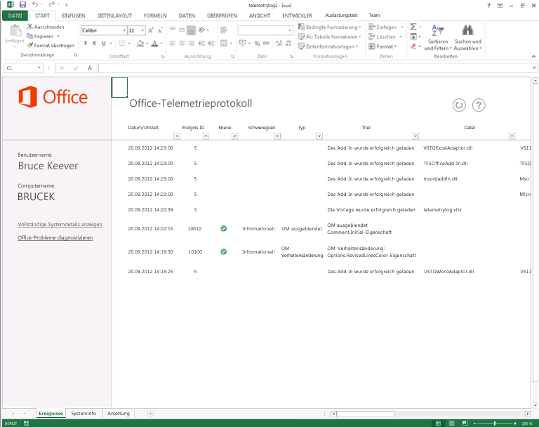

# Problembehandlung für Office-Dateien und benutzerdefinierte Lösungen mit dem TelemetrieprotokollTroubleshooting Office files and custom solutions with the telemetry log

Verwenden Sie das Telemetrieprotokoll für Office 2013, um Kompatibilitätsprobleme zwischen Office 2013 und Lösungen zu ermitteln, die für vorherige Versionen von Office entwickelt wurden.Use the Telemetry Log for Office 2013 to determine compatibility issues with Office 2013 and solutions built for previous versions of Office.
  
Der folgende Artikel beschreibt Telemetrieprotokoll und seine Verwendung.The following article describes the Telemetry Log and how to use it. Weitere Informationen zu bestimmten Ergebnisse, die im Telemetrieprotokoll angezeigt finden Sie unter [Kompatibilitätsprobleme in Office](compatibility-issues-in-office.md).For more information about specific results displayed in the Telemetry Log, see [Compatibility issues in Office](compatibility-issues-in-office.md).

Microsoft hat im Laufe der Zeit viele Versionen von Tools und Frameworks für die Anpassung, Automatisierung und Erweiterung von Office bereitgestellt. Dadurch haben Unternehmen und Benutzer die Möglichkeit, Lösungen oder Add-Ins für Office-Anwendungen zu erstellen, um deren Produktivität und Effizienz zu steigern. Die Komplexität dieser Lösungen ist ganz unterschiedlich und reicht von einfachen VBA-Makros (Visual Basic for Applications) bis hin zu robusten .NET Framework-Anpassungen. Viele Benutzer, die diese Lösungen besitzen, setzen sie bei der Ausführung geschäftskritischer Aufgaben ein und wissen möglicherweise gar nicht, dass sie eine Anpassung ihrer Office-Anwendungen verwenden.Over the course of many releases, Microsoft has provided tools and frameworks for customizing, automating, and extending Office. This has enabled businesses and users to build solutions or add-ins for Office applications to improve their productivity and efficiency. These solutions can range in complexity from simple Visual Basic for Applications (VBA) macros to robust .NET Framework customizations. Many users who have these solutions rely on them to complete business-critical tasks and may not even know that they are using a customization that is added to their Office applications.
  
Bei einer solchen Vielfalt an Office-Lösungen können Upgrades von Office-Versionen sehr komplex werden. Unternehmen und Benutzer wissen nicht, ob ihre wichtigen und wertvollen Lösungen mit der neuen Version vollständig kompatibel sind. Ihre Lösungen verwenden möglicherweise inzwischen veraltete Features und Computercode aus vorherigen Versionen von Office. Wenn eine Lösung, die ein veraltetes Feature verwendet, in die "Hostanwendung" geladen wird, verhält sich die Lösung möglicherweise anders als erwartet, verursacht einen Fehler, lädt nicht oder führt dazu, dass die Hostanwendung nicht richtig ausgeführt wird.With such a proliferation of Office solutions, upgrading versions of Office can be complex. Enterprises and users do not know whether their important and valuable solutions are completely compatible with the new version. Their solutions might use features and computer code that are available in previous versions of Office that have been deprecated in later versions. If a solution that uses a deprecated feature is loaded into the "host" application, the solution might behave differently, cause an error, fail to load, or cause the host application to fail.
  
Telemetrieprotokoll für Office 2013 ist ein auf Excel 2013 basierendes Tool und hilft Entwicklern und erfahrenen Benutzern bei der Diagnose von Kompatibilitätsproblemen durch die Anzeige von Ereignissen, die innerhalb ausgewählter Office 2013-Anwendungen auftreten. Anhand dieses Tools können Benutzer potenzielle Probleme mit Add-Ins ermitteln, die sie in ihrer Arbeitsumgebung verwenden. Die Entscheidungsträger im Unternehmen erhalten so die Informationen, die sie benötigen, um für oder gegen ein Upgrade auf Office 2013 zu entscheiden. Telemetrieprotokoll liefert zudem detailliertes Feedback zu bestimmten Änderungen oder veralteten Features in den Objektmodellen für die Office 2013-Anwendungen, damit Entwickler problematischen Code oder problematische Steuerelemente schneller identifizieren und umgestalten können. IT-Experten können mit Telemetriedashboard für Office 2013, einem ergänzenden Tool zu Telemetrieprotokoll, Trends in der Funktionsweise der Lösung über mehrere Clients anzeigen.The Telemetry Log for Office 2013, a tool built upon Excel 2013, helps developers and experienced users diagnose compatibility issues by displaying events that occur within select Office 2013 applications. Using this tool, users can determine potential issues with add-ins that they use in their work environment, giving enterprise decision-makers the information that they need to decide whether to upgrade to Office 2013. The Telemetry Log also gives detailed feedback about specific changes or deprecations in the object models for the Office 2013 applications, which helps developers quickly identify and refactor problematic code or controls. IT professionals can view trends in solution health across multiple clients by using the Telemetry Dashboard for Office 2013, a companion tool to the Telemetry Log.
  
Weitere Informationen finden Sie im Artikel [Bereitstellen des Office-Telemetriedashboards](http://technet.microsoft.com/library/f69cde72-689d-421f-99b8-c51676c77717).For more information, see [Deploy Office Telemetry Dashboard](http://technet.microsoft.com/library/f69cde72-689d-421f-99b8-c51676c77717).
  
## So funktioniert TelemetrieprotokollHow the Telemetry Log works

Wenn eine Office-Datei oder -Lösung geladen, verwendet oder geschlossen wird oder einen Fehler in einer der ausgewählten Office 2013-Anwendungen auslöst, fügt die Anwendung einen Datensatz in einem lokalen Datenspeicher (einer Datenbank auf demselben Computer) hinzu, der Informationen über das Ereignis enthält. Der Datensatz umfasst einen Titel für das Ereignis, den Namen der Anwendung, die das Ereignis protokolliert hat, die Uhrzeit, den Namen der Datei oder Lösung, den Schweregrad und eine kurze Beschreibung eventueller Fehler, die aufgetreten sind. Nach einer Aktualisierung zeigt die Telemetrieprotokoll-Arbeitsmappe eine Liste der im lokalen Datenspeicher enthaltenen Datensätze an.When an Office file or solution is loaded, used, closed, or raises an error in one of the selected Office 2013 applications, the application adds a record in a local data store (a database on the same computer) that includes information about the event. The record includes a title for the event, the application that logged the event, the time, the name of the file or solution, the severity, and a short description of any errors that may have occurred. When refreshed, the Telemetry Log workbook displays a list of the records contained in the local data store.
  
> [!NOTE]
> Der Standardspeicherort für den lokalen Datenspeicher ist % der Benutzer\[aktuellen User]\AppData\Local\Microsoft\Office\15.0\Telemetry.The default location for the local data store is %Users%\[Current user]\AppData\Local\Microsoft\Office\15.0\Telemetry. Die maximale Standardgröße für den Datenspeicher ist 5 MB groß sind (5.120 KB).The default maximum size for the data store is 5 MB (5,120 KB). 
  
Ausgewählte Office 2013-Anwendungen verfügen über eine Laufzeitprotokollierungs-API, die einen Datensatz im lokalen Datenspeicher erstellt, wann immer eine Datei oder eine Lösung eines der folgenden Ereignisse auslöst:Selected Office 2013 applications have a run-time logging API that creates a record in the local data store every time that a file or solution raises one of the following events:
  
- **OnLoad**: Ein Datensatz wird im lokalen Datenspeicher protokolliert, wenn eine Datei oder eine Lösung in bestimmte Office 2013-Anwendungen geladen wird. Die Laufzeitfehlerprotokollierung erfasst den Dateinamen, den Speicherort sowie andere Informationen im lokalen Arbeitsspeicher, wenn ein **OnLoad**-Ereignis ausgelöst wird.**OnLoad**: A record is logged in the local data store when a file or solution is loaded into specific Office 2013 applications. The run-time error logging records the file name, location, and other information in the local data store when an **OnLoad** event is raised. 
    
- **OnClose**: Ein Datensatz wird protokolliert, wenn eine Datei oder eine Lösung innerhalb der Anwendung geschlossen wird. Der Datensatz umfasst den Namen der Lösung bzw. Datei, ihren Speicherort und den Namen der Anwendung, die das Ereignis protokolliert hat.**OnClose**: A record is logged when a file or solution is closed within the application. The record includes the name of the solution or file, its location, and the application that logged the event.
    
- **OnError**: Ein Datensatz wird protokolliert, wenn in einer Lösung für bestimmte Office 2013-Anwendungen ein Fehler gefunden wird. Der Datensatz umfasst den Namen der Lösung oder Datei und den Laufzeitfehler oder das Kompatibilitätsproblem, der/das aufgetreten ist. Soweit möglich werden Fehler bekannten Kompatibilitätsproblemen zugeordnet und als solche in Telemetrieprotokoll angezeigt.**OnError**: A record is logged when an error is found in a solution for certain Office 2013 applications. The record includes the name of the solution or file and the run-time failure or compatibility issue that the user encountered. When possible, errors are mapped to known compatibility issues and are displayed as such in the Telemetry Log.
    
Telemetrieprotokoll zeigt Informationen über eine Vielzahl von Dateien und Lösungstypen für eine Auswahl von Office 2013-Anwendungen an. Die Art der Dateien und Lösungen, die durch Laufzeitprotokollierungs-APIs überwacht werden, ist je nach Anwendung unterschiedlich. Tabelle 1 liefert Informationen darüber, welche Arten von Lösungen überwacht werden.The Telemetry Log displays information about a large list of files and solution types for a selection of Office 2013 applications. The type of files and solutions that are monitored by the run-time logging APIs vary by application. See the Table 1 for more information about what kinds of solutions are monitored.
  
### Tabelle 1: Typen von Office-Dateien und -Lösungen, die in Telemetrieprotokoll protokolliert werdenTable 1. Types of Office files and solutions tracked in Telemetry Log

|**Lösungstyp****Solution type**|**Anwendungen****Applications**|**Beschreibung****Description**|
|:-----|:-----|:-----|
|Aufgabenbereich-AppsTask pane apps    |Excel 2013, Word 2013, Project 2013Excel 2013, Word 2013, Project 2013    |Dies sind Office-Add-Ins, die in einem Aufgabenbereich innerhalb der Clientanwendung gehostet werden.These are Office Add-ins that are hosted in a task pane within the client application.    |
|Inhalts-AppsContent apps    |Excel 2013Excel 2013    |Dies sind Office-Add-Ins, die in den Inhalt der Office-Datei integriert sind.These are Office Add-ins that are integrated into the content of the Office file.    |
|Mail-AppsMail apps    |Outlook 2013Outlook 2013    |Hierbei handelt es sich um apps, die erforderlichOutlook 2013 angezeigt werden, wenn bestimmte Bedingungen erfüllt sind (der e-Mail-Text oder Betreff enthält bestimmte Wörter oder Phrasen).These are apps that appear inOutlook 2013 when certain conditions are met (the email body or subject includes particular words or phrases).    |
|Aktive DokumenteActive documents    |Word 2013Word 2013    PowerPoint 2013PowerPoint 2013    Excel 2013Excel 2013    | Aktive Dokumente sind alle Office-Dokumentdateien, mit Ausnahme der sonstigen Lösungstypen, die in dieser Tabelle aufgeführt sind. Dazu gehören:Active documents are any Office document files other than the other solution types listed in this table. This can include the following:     Office-Dateien im Binärformat (DOC, PPT, PPS, XLS)Office binary format files (.doc, .ppt, .pps, .xls).     Office-Dateien im OpenXML-Format (DOCX, PPTX, PPSX, XLSX)Office OpenXML format files (.docx, .pptx, .ppsx, .xlsx).     Makroaktivierte Dateien mit VBA-Code (DOCM, DOTM, PPTM, POTM, XLSM, XLTM)Macro-enabled files that contain VBA code (.docm, .dotm, .pptm, .potm, .xlsm, .xltm).     Dateien mit ActiveX-SteuerelementenFiles that contain ActiveX controls.     Dateien mit externen DatenverbindungenFiles that have External Data Connections.    |
|COM-Add-InsCOM add-ins    |Word 2013Word 2013    PowerPoint 2013PowerPoint 2013    Excel 2013Excel 2013    Outlook 2013Outlook 2013    |COM-Add-Ins umfassen Office-Entwicklungstools in Visual Studio 2010-Add-Ins auf Anwendungsebene.COM add-ins include Office development tools in Visual Studio 2010 application-level add-ins.    |
|Excel-Automatisierungs-Add-InsExcel Automation add-ins    |Excel 2013Excel 2013    |Dieser Lösungstyp beinhaltet vorherige Versionen von Excel-unterstützten Automatisierungs-Add-Ins, die auf COM-Add-Ins gründen. Funktionen in Automatisierungs-Add-Ins können von Formeln in Excel-Arbeitsblättern aufgerufen werden.This solution type includes previous versions of Excel-supported Automation Add-ins, which are built upon COM add-ins. Functions in Automation add-ins can be called from formulas in Excel worksheets.    |
|Excel XLL-Add-InsExcel XLL add-ins    |Excel 2013Excel 2013    |XLL-Add-Ins (XLL) sind für Excel spezifisch und werden mit Compilern erstellt, die die Erstellung von DLLs (Dynamic Link Library) unterstützen. Sie müssen weder installiert noch registriert werden. XLL-Add-Ins enthalten auch DLLs, die benutzerdefinierte Befehle und Funktionen umfassen.XLL add-ins (.xll) are specific to Excel and built with any compiler that supports building DLLs (dynamic-link libraries). They do not have to be installed or registered. XLL add-ins also include DLLs that contain user-defined commands and functions.    |
|Excel XLS RTD-Add-InsExcel XLS RTD add-ins    |Excel 2013Excel 2013    |XLS RTD-Add-Ins (Real-Time Data) sind Excel-Arbeitsblätter, die die **RealTimeData**-Arbeitsblattfunktion zum Aufrufen eines Automatisierungsservers verwenden, um Daten in Echtzeit abzurufen.XLS real-time data (RTD) add-ins are Excel worksheets that use the **RealTimeData** worksheet function to call an Automation server to retrieve data in real-time.    |
|Word WLL-Add-InsWord WLL add-ins    |Word 2013Word 2013    |WLL-Add-Ins (WLL) sind spezifisch für Word und werden mit einem Compiler erstellt, der die Erstellung von DLLs unterstützt.WLL (.wll) add-ins are specific to Word and built with any compiler that supports building DLLs.    |
|Anwendungs-Add-InsApplication add-ins    |Word 2013Word 2013    PowerPoint 2013PowerPoint 2013    Excel 2013Excel 2013    |Anwendungs-Add-Ins sind anwendungsspezifische Dateien, die VBA-Code enthalten. Diese enthalten makroaktivierte Word-Vorlagen (DOTM), Excel-Add-Ins (XLA, XLAM) und PowerPoint-Add-Ins (PPA, PPAM).Application add-ins are application-specific files that contain VBA code. These include macro-enabled Word templates (.dotm), Excel add-ins (.xla, .xlam), and PowerPoint add-ins (.ppa, .ppam).    |
|VorlagenTemplates    |Word 2013Word 2013    PowerPoint 2013PowerPoint 2013    Excel 2013Excel 2013    |Vorlagen enthalten Dokument- (DOT, DOTX), Arbeitsblatt- (XLT, XLTX) oder Präsentationsvorlagen (POT, POTX), die an eine Office-Datei angehängt sind.Templates include document (.dot, .dotx), worksheet (.xlt, .xltx), or presentation (.pot, .potx) templates that are attached to an Office file.    |
   
## Verwenden von Office Telemetry LogUsing the Office Telemetry Log

Wenn Sie Office 2013 installieren, wird Telemetrieprotokoll installiert, der lokale Datenspeicher auf demselben Computer erstellt, und die Laufzeitprotokollierungs-APIs werden in den zuvor aufgeführten Office 2013-Anwendungen aktiviert. Allerdings muss eine Lösung bzw. eine Datei in der Anwendung geladen oder geöffnet werden, bevor Telemetrieprotokoll mit der Überwachung beginnen kann.When you install Office 2013, the Telemetry Log is installed, the local data store is created on the same computer, and the run-time logging APIs are enabled in the Office 2013 applications previously listed. However, a solution or file must be loaded or opened in the application before the Telemetry Log can start to monitor it.
  
Gehen Sie folgendermaßen vor, um die erfassten Office-Probleme in Telemetrieprotokoll anzuzeigen.Use the following procedure to display the recorded Office issues in the Telemetry Log. 
  
### So verwenden Sie TelemetrieprotokollTo use the Telemetry Log

1. Gehen Sie folgendermaßen vor, um Telemetrieprotokoll zu öffnen:To open the Telemetry Log, do one of the following:
    
   - **Für Windows 7:** Wählen Sie im **Startmenü** **Alle Programme**aus.**On Windows 7:** On the **Start** menu, choose **All Programs**. Klicken Sie dann in der Liste der Programme, erweitern Sie **Microsoft Office 2013**, erweitern Sie **Office 2013-Tools**, und klicken Sie dann auf **Office 2013 Telemetry Log**.Then, in the list of programs, expand **Microsoft Office 2013**, expand **Office 2013 Tools**, and then click **Office 2013 Telemetry Log**.
    
     In Excel 2013 wird eine neue Arbeitsmappe geöffnet. Die neue Arbeitsmappe enthält drei Arbeitsblätter: **Ereignisse**, **Systeminfo** und **Anleitung**.A new workbook in Excel 2013 opens. The workbook has three worksheets titled **Events** **System info**, and **Guide**.
    
   - **Für Windows 8:** Machen Sie eine Streifbewegung, um die App-Leiste anzuzeigen, wählen Sie **Alle Apps**, und wählen Sie dann **Office 2013 Telemetry Log**.**On Windows 8:** Swipe up to display the AppBar, choose **All Apps**, and then choose **Office 2013 Telemetry Log**.
    
     In Excel 2013 wird eine neue Arbeitsmappe geöffnet. Die neue Arbeitsmappe enthält drei Arbeitsblätter: **Ereignisse**, **Systeminfo** und **Anleitung**.A new workbook in Excel 2013 opens. The workbook has three worksheets titled **Events** **System info**, and **Guide**.
    
2. Um eine aktuelle Ereignisliste anzuzeigen, klicken Sie oben auf dem Arbeitsblatt **Ereignisse** auf **Aktualisieren**.To view an up-to-date list of events, on the **Events** worksheet, at the top of the worksheet, choose **Refresh**.
    
3. Um die Ereignisdaten einzusehen, die von Office 2013-Anwendungen gesammelt werden, prüfen Sie die Tabelle auf dem Arbeitsblatt **Ereignisse**.To view the event data that is collected from Office 2013 applications, review the table displayed on the **Events** worksheet. 
    
4. Um Informationen über den Computer zu erhalten, auf dem Office 2013 und Telemetrieprotokoll installiert sind, prüfen Sie die Informationen auf dem Arbeitsblatt **Systeminfo**.To review information about the computer on which Office 2013 and Telemetry Log are installed, review the information displayed on the **System Info** worksheet. 
    
> [!NOTE]
> Es ist nicht erforderlich, das Telemetrieprotokoll-Arbeitsblatt in Excel 2013 zu speichern, um die Ergebnisse als Datensatz abzulegen, da die Informationen im lokalen Datenspeicher (der unabhängig von Telemetrieprotokoll ist) gespeichert werden. Durch Speichern des Arbeitsblatts wird Telemetrieprotokoll aber auch nicht beschädigt.It is not necessary to save the Telemetry Log workbook in Excel 2013 to keep a record of the results, because the information is stored in the local data store (which is separate from the Telemetry Log). However, saving the workbook does not damage the Telemetry Log. 
  
Telemetrieprotokoll zeigt einige einfache Informationen über die erfassten Ereignisse an. Jeder in Telemetrieprotokoll angezeigte Datensatz enthält einen Titel und gibt den Schweregrad des angezeigten Ereignisses an. Bei Fehlern liefern die Datensätze zudem eine Beschreibung des Fehlers sowie eine Anleitung zur Abhilfe. Denken Sie daran, dass nicht alle der angezeigten Datensätze Fehler angeben, die von Office-Lösungen verursacht wurden. Telemetrieprotokoll zeigt auch an, wenn Lösungen und Dateien erfolgreich geladen oder geschlossen werden.The Telemetry Log displays some simple information about the recorded events. Each record displayed in the Telemetry Log contains a title and lists the severity of the event displayed. For errors, the records also include a description of the error together with steps to address the issue. Keep in mind that not all of the records displayed represent errors caused by Office solutions; the Telemetry Log also shows when solutions and files are loaded or closed successfully. 
  
Beispielsweise wird das Problem mit dem Titel "OM ausgeblendet: Comment.Initial-Eigenschaft" angezeigt, wenn eine Lösung oder eine in Word 2013 geöffnete makroaktivierte Datei versucht, die Initialen eines Kommentierenden abzurufen, der einem Kommentar zugeordnet ist. Word 2013 bietet eine verbesserte Kommentarfunktion, die die Initialen des Kommentierenden nicht standardmäßig anzeigt. Die mit dem älteren Kommentarmodell verknüpften APIs sind im Word 2013-Objektmodell ausgeblendet worden, bleiben jedoch für die Rückwärtskompatibilität erhalten. Das Problem "OM ausgeblendet: Comment.Initial" in gibt die Datei, die versucht hat, die API zu verwenden, die Anwendung, die das Ereignis ausgelöst hat (Word 2013), das Datum und die Uhrzeit des Ereignisses und die Kurzbeschreibung des Fehlers sowie die Abhilfemaßnahme an.For example, the issue titled "OM Hidden: Comment.Initial Property" appears if a solution or macro-enabled file opened in Word 2013 attempts to get the initials of a commenter who is associated with a comment. Word 2013 features an improved commenting experience that does not display commenter initials by default. The APIs associated with the older commenting model have been hidden in the Word 2013 object model but remain available for backwards-compatibility. The "OM Hidden: Comment.Initial" issue in the indicates the file that attempted to use the API, the application that raised the event (Word 2013), the time and date of the event, and short description about the error and how to fix it.
  
**Abbildung 1: Office Telemetry Log****Figure 1. Office Telemetry Log**
  
![Der Office-Ereignisanzeige zeigt Datensätze.] (media/off15_OfficeEventViewer_SD.png "Der Office-Ereignisanzeige zeigt Datensätze")
  
> [!NOTE]
>  Das Arbeitsblatt **Systeminfo** im Telemetrieprotokoll enthält Informationen zu dem Computer, auf dem Office 2013 installiert ist.The **System Info** worksheet in the Telemetry Log contains information about the computer on which Office 2013 is installed. Das Arbeitsblatt zeigt die folgende Informationen:The worksheet displays the following information: 
> - Den BenutzernamenUser name.
> - Den vollständigen Namen des ComputersFull computer name.
> - Die Architektur des Betriebssystems (x64/64 Bit oder x86/32 Bit)Architecture of the operating system (x64/64-bit or x86/32-bit).
> - Die auf dem Computer installierte Version von WindowsVersion of Windows that is installed on the computer.
> - Die Zeitzonen für die interne Uhr des ComputersTime zone for the computer's internal clock.
> - Die Version des Protokolls Telemetrie.Version of the Telemetry Log.
> - Die auf dem Computer installierte Version von OfficeVersion of Office that is installed on the computer.
> 
> Diese Informationen kann hilfreich sein, wenn Sie die Probleme und Ereignisse, die auf dem Arbeitsblatt **Ereignisse** aufgelisteten interpretiert werden.This information can be useful when you are interpreting the issues and events listed on the **Events** worksheet. 
  
In Telemetrieprotokoll wird zusammen mit den bekannten Problemen der Schweregrad angegeben. Wie im vorherigen Beispiel hat ein Problem, bei dem ein Teil des Objektmodells ausgeblendet wurde, meist den Schweregrad "Informationell". Andere bekannte Probleme können aber schwerwiegender sein und ein sofortiges Eingreifen erfordern. In Telemetrieprotokoll werden die folgenden Abstufungen nach Schweregrad vorgenommen:In the Telemetry Log, a level of severity is displayed together with the known issues. From the previous example, an issue in which a part of the object model has been hidden most often has an "Informative" level of severity. On the other hand, other known issues might be more serious and require more immediate action. The severity of the issues displayed in the Telemetry Log can be one of the following:
  
- **Informative** Das Problem hat möglicherweise keine sofortigen Auswirkungen auf die Anwendungskompatibilität, aber der Benutzer muss möglicherweise zu einem späteren Zeitpunkt Maßnahmen ergreifen. Viele Probleme des Typs "OM hidden" haben diesen Schweregrad.**Information** The issue may not have an immediate effect on application compatibility, but the user may have to take an action later. Many issues of the "OM hidden" type have this severity level. 
    
- **Warning** Das Problem könnte zu Datenverlust oder verminderter Darstellungstreue führen.**Warning** The issue could cause data loss or result in reduced visual fidelity. 
    
- **Critical** Das Problem könnte einen signifikanten Verlust an Funktionalität verursachen oder zum Absturz der Anwendung führen.**Critical** The issue could cause significant loss of functionality or lead the application to crash. 
    
### Tabelle 2: In Telemetrieprotokoll angezeigte EreignistypenTable 2. Types of events displayed in the Telemetry Log

Interpretieren Sie die in Telemetrieprotokoll angezeigten Datensätze anhand der folgenden Tabelle (Tabelle 2).Use the following table (Table 2) to interpret the records that are displayed in the Telemetry Log.
  
|**Ereignis-ID****Event ID**|**Titel****Title**|**Schweregrad****Severity**|**Beschreibung****Description**|
|:-----|:-----|:-----|:-----|
|11    |Das Dokument wurde erfolgreich geladenDocument loaded successfully    ||Die in der Spalte **File** angegebene Datei wurde in der Office-Anwendung ohne Probleme geöffnet.The file listed in the **File** column was opened in the Office application without any issues.    |
|22    |Das Dokument konnte nicht geladen werden.Document failed to load    |WarningWarning    | Die Anwendung konnte die Datei nicht laden. Möglicherweise ist ein zugrunde liegendes Kompatibilitätsproblem die Ursache.  The application was unable to load the file. There may be some underlying compatibility issue.    Weitere Informationen zur Reparatur einer beschädigten Arbeitsmappe in Excel 2013 finden Sie unter [Reparieren einer beschädigten Arbeitsmappe](http://office.microsoft.com/en-us/excel-help/repairing-a-corrupted-workbook-HA102749554.aspx).For more information about how to repair a corrupted workbook in Excel 2013, see [Repairing a corrupted workbook](http://office.microsoft.com/en-us/excel-help/repairing-a-corrupted-workbook-HA102749554.aspx).  Weitere Informationen zum Reparieren eines beschädigten Dokuments in Word 2013 finden Sie unter [Speichern und Wiederherstellen einer Sicherungskopie eines Dokuments](http://office.microsoft.com/en-us/word-help/save-and-recover-a-backup-copy-of-a-document-HA010121250.aspx).For more information about how to repair a corrupted document in Word 2013, see [Save and recover a backup copy of a document](http://office.microsoft.com/en-us/word-help/save-and-recover-a-backup-copy-of-a-document-HA010121250.aspx).   |
|33    |Die Vorlage wurde erfolgreich geladen.Template loaded successfully    ||Die in der Spalte **File** angegebene Vorlagendatei wurde in der Office-Anwendung ohne Probleme geöffnet.The template file listed in the **File** column was opened in the Office application without any issues.    |
|44    |Die Vorlage konnte nicht geladen werden.Template failed to load    |WarningWarning    | Die Anwendung konnte die Vorlagendatei nicht laden. Möglicherweise ist ein zugrunde liegendes Kompatibilitätsproblem die Ursache, oder die Vorlagenverfügbarkeit hat sich geändert.  The application was unable to load the template file. There may be some underlying compatibility issue or the template availability may have changed.  Weitere Informationen zur Reparatur einer beschädigten Arbeitsmappe in Excel 2013 finden Sie unter [Reparieren einer beschädigten Arbeitsmappe](http://office.microsoft.com/en-us/excel-help/repairing-a-corrupted-workbook-HA102749554.aspx).For more information about how to repair a corrupted workbook in Excel 2013, see [Repairing a corrupted workbook](http://office.microsoft.com/en-us/excel-help/repairing-a-corrupted-workbook-HA102749554.aspx).  Weitere Informationen zum Reparieren eines beschädigten Dokuments in Word 2013 finden Sie unter [Speichern und Wiederherstellen einer Sicherungskopie eines Dokuments](http://office.microsoft.com/en-us/word-help/save-and-recover-a-backup-copy-of-a-document-HA010121250.aspx).For more information about how to repair a corrupted document in Word 2013, see [Save and recover a backup copy of a document](http://office.microsoft.com/en-us/word-help/save-and-recover-a-backup-copy-of-a-document-HA010121250.aspx).   |
|55    |Das Add-In wurde erfolgreich geladen.Add-in loaded successfully    ||Das in der Spalte **File** angegebene Add-In wurde erfolgreich in die Office-Anwendung geladen. Es wurden keine Kompatibilitätsprobleme ermittelt.  The add-in listed in the **File** column loaded within the Office application successfully. No compatibility issues were detected.    |
|66    |Das Add-In konnte nicht geladen werden.Add-in failed to load    |CriticalCritical    | Die Anwendung konnte das in der Spalte **File** angegebene Add-In nicht laden.The application was unable to load the add-in listed in the **File** column.    Weitere Informationen zur Reparatur einer beschädigten Arbeitsmappe in Excel 2013 finden Sie unter [Reparieren einer beschädigten Arbeitsmappe](http://office.microsoft.com/en-us/excel-help/repairing-a-corrupted-workbook-HA102749554.aspx).For more information about how to repair a corrupted workbook in Excel 2013, see [Repairing a corrupted workbook](http://office.microsoft.com/en-us/excel-help/repairing-a-corrupted-workbook-HA102749554.aspx).     Weitere Informationen zum Reparieren eines beschädigten Dokuments in Word 2013 finden Sie unter [Speichern und Wiederherstellen einer Sicherungskopie eines Dokuments](http://office.microsoft.com/en-us/word-help/save-and-recover-a-backup-copy-of-a-document-HA010121250.aspx).For more information about how to repair a corrupted document in Word 2013, see [Save and recover a backup copy of a document](http://office.microsoft.com/en-us/word-help/save-and-recover-a-backup-copy-of-a-document-HA010121250.aspx).   |
|77    |Das Add-In-Manifest wurde erfolgreich heruntergeladen.Add-in manifest downloaded successfully    ||Die Host-Anwendung hat das Manifest für die Office-Add-In erfolgreich heruntergeladen.The host application loaded the manifest for the Office Add-in successfully.    |
|88    |Das Add-In-Manifest konnte nicht heruntergeladen werden.Add-in manifest did not download    |CriticalCritical    |Die Hostanwendung konnte die Manifestdatei für die Office-Add-In nicht aus dem SharePoint-Katalog, dem Unternehmenskatalog oder aus Office Store laden.The host application was unable to load the manifest file for the Office Add-in from the SharePoint catalog, corporate catalog, or the Office Store.    |
|99    |Das Add-In-Manifest konnte nicht analysiert werden.Add-in manifest could not be parsed    |CriticalCritical    |Die Hostanwendung hat das Office-Add-In-Manifest für das Add-In geladen, konnte jedoch das XML-Markup nicht lesen.The host application loaded the Office Add-in manifest for the add-in, but could not read the XML.    |
|1010    |Die CPU-Nutzung des Add-Ins ist zu hoch.Add-in used too much CPU    |CriticalCritical    |Die Office-Add-In hat über eine begrenzte Zeitspanne mehr als 90 % der CPU-Ressourcen beansprucht.The Office Add-in used more than 90% of the CPU resources over a finite period of time.    |
|1111    |Die Anwendung ist beim Laden abgestürzt.Application crashed on load    |CriticalCritical    |Die Office-Anwendung hat beim Start versucht, ein Dokument oder eine Lösung zu laden. Probleme mit dem Dokument bzw. der Lösung haben den Start der Anwendung verhindert.The Office application tried to load a document or solution when it launched, but problems with the document or solution prevented the application from launching.    |
|1212    |Die Anwendung wurde aufgrund eines Problems geschlossen.Application closed due to a problem    |CriticalCritical    |In der Anwendung ist ein kritischer Fehler aufgetreten. Sie musste geschlossen werden.Something caused a critical error in the application and it needed to close.    |
|1313    |Das Dokument wurde erfolgreich geschlossenDocument closed successfully    ||Die in der Spalte **File** aufgeführte Datei ist erfolgreich geschlossen worden.The file listed in the **File** column closed successfully.    |
|1414    |Die Anwendungssitzung wurde verlängert.Application session extended    ||Anwendungssitzungen, bei denen ein bestimmtes Dokument oder eine bestimmte Lösung geöffnet ist, sollten nicht länger als 24 Stunden dauern. Wenn eine Sitzung länger als 24 Stunden dauert, erstellt die Hostanwendung eine neue Sitzung.Application sessions with a particular document or solution open should only last 24 hours. If a session goes over 24 hours, the host application creates a new session.    |
|1515    |Das Add-In wurde aufgrund eines Timeouts bei der Zeichenfolgensuche deaktiviert.Add-in disabled due to string search time-out    ||Mail-Add-Ins durchsuchen die Betreffzeile und die Nachricht einer E-Mail, um zu ermitteln, ob sie mithilfe eines regulären Ausdrucks angezeigt werden sollte. Das Mail-Add-In, das in der Spalte **File** angegeben ist, wurde von Outlook 2013 deaktiviert, weil es bei dem Versuch, einen regulären Ausdruck zuzuordnen, mehrfach zu einer Zeitüberschreitung gekommen ist.  Mail add-in search the subject line and message of an email to determine whether they should be displayed by using a regular expression. The mail app listed in the **File** column was disabled by Outlook 2013 because it timed out repeatedly while trying to match a regular expression.    |
|1616    |Das Dokument war beim Absturz der Anwendung geöffnet.Document open when application crashed    |CriticalCritical    |Die in der Spalte **File** angegebene Datei war geöffnet, als die Anwendung (in der Spalte **Application** angegeben) abgestürzt ist. Möglicherweise ist die Datei für den Absturz der Anwendung verantwortlich.  The file listed in the **File** column was open when the application (listed in the application column) crashed. The file may or may not have been responsible for the **Application** crash.    |
|1717    |Das Add-In wurde erfolgreich geschlossen.Add-in closed successfully    |InformativeInformative    |Die Anwendung konnte das Add-In erfolgreich herunterfahren. successfully.The application was able to shut down the add-in successfully.    |
|1818    |Die App wurde erfolgreich geschlossen.App closed successfully    ||Die Hostanwendung konnte die Office-Add-In erfolgreich schließen.The host application was able to close the Office Add-in successfully.    |
|1919    |Für das Add-In ist ein Laufzeitfehler aufgetreten, der lokal protokolliert wurde.Add-in encountered runtime error    |CriticalCritical    |Bei der Office-Add-In ist ein Problem aufgetreten, das zu einem Fehler geführt hat. Weitere Einzelheiten können Sie dem Protokoll der Microsoft Office-Benachrichtigungen entnehmen. Zeigen Sie das Protokoll mit der Windows-Ereignisanzeige auf dem Computer an, auf dem der Fehler aufgetreten ist.The Office Add-in had a problem that caused it to fail. For more details, look at the Microsoft Office Alerts log using the Windows Event Viewer on the computer that encountered the error.    |
|2020    |Das Add-In konnte die Lizenzierung nicht überprüfen.Add-in failed to verify licensing    |CriticalCritical    |Die Lizenzinformationen für die Office-Add-In konnten nicht überprüft werden. Möglicherweise ist die Lizenz abgelaufen. Weitere Einzelheiten können Sie dem Protokoll der Microsoft Office-Benachrichtigungen entnehmen. Zeigen Sie das Protokoll mit der Windows-Ereignisanzeige auf dem Computer an, auf dem der Fehler aufgetreten ist.The licensing information for the Office Add-in could not be verified and may have expired. For more details, look at the Microsoft Office Alerts log using the Windows Event Viewer on the computer that encountered the error.    |
|SonstigeVarious    |"OM Behavior Change: ...""OM Behavior Change: ..."    |InformativeInformative    |Das Add-In oder makroaktivierter Dokumentcode verwendet ein Objekt, ein Member, eine Sammlung, eine Auflistung oder eine Konstante, das/die sich anders verhält als in vorherigen Versionen von Office.The add-in or macro-enabled document code uses an object, member, collection, enumeration, or constant that behaves differently from previous versions of Office.   Weitere Informationen finden Sie unter [Kompatibilitätsprobleme in Office](compatibility-issues-in-office.md).For more information, see [Compatibility issues in Office](compatibility-issues-in-office.md).    |
|SonstigeVarious    |"OM Removed: …""OM Removed: …"    |CriticalCritical    |Das Add-In oder makroaktivierter Dokumentcode verwendet ein Objekt, ein Member, eine Sammlung, eine Auflistung oder eine Konstante, das/die aus dem Objektmodell entfernt wurde.The add-in or macro-enabled document code uses an object, member, collection, enumeration, or constant that has been removed from the object model.  Weitere Informationen finden Sie unter [Kompatibilitätsprobleme in Office](compatibility-issues-in-office.md).For more information, see [Compatibility issues in Office](compatibility-issues-in-office.md).    |
|SonstigeVarious    |"OM Hidden: …""OM Hidden: …"    |InformativeInformative    |Das Add-In oder makroaktivierter Dokumentcode verwendet ein Objekt, ein Member, eine Sammlung, eine Auflistung oder eine Konstante, das/die im Objektmodell ausgeblendet wurde.The add-in or macro-enabled document code uses an object, member, collection, enumeration, or constant that has been hidden in the object model.  Weitere Informationen finden Sie unter [Kompatibilitätsprobleme in Office](compatibility-issues-in-office.md).For more information, see [Compatibility issues in Office](compatibility-issues-in-office.md).    |
|SonstigeVarious    |"Control: …""Control: …"    ||Die Datei enthält ein Steuerelement, das in Office 2013 oder vom Betriebssystem des Computers möglicherweise nicht unterstützt wird.The file contains a control that may not be supported in Office 2013 or on the computer's operating system.  Weitere Informationen finden Sie unter [Kompatibilitätsprobleme in Office](compatibility-issues-in-office.md).For more information, see [Compatibility issues in Office](compatibility-issues-in-office.md).    |
   
## SchlussbemerkungConclusion

Telemetrieprotokoll bietet großen Unternehmen, einzelnen Benutzern und Entwicklern ein einfaches Instrument für die Überwachung wichtiger Office-Lösungen. Indem Unternehmen problematische Office-Lösungen vor einem groß angelegten Upgrade identifizieren, können sie die Kosten einer Einführung von Office 2013 besser abschätzen.The Telemetry Log provides large enterprises, individual users, and developers with a simple tool for monitoring their critical Office solutions. By identifying problematic Office solutions before a large-scale upgrade, businesses can more reasonably predict the cost of adopting Office 2013.
  
## Siehe auchSee also

- [Office Developer CenterOffice Developer Center](http://msdn.microsoft.com/de-de/office/aa905340.aspx)
- [Kompatibilitätsprobleme in OfficeCompatibility issues in Office](compatibility-issues-in-office.md)
- [Bereitstellen von Office Telemetry DashboardDeploy Office Telemetry Dashboard](http://technet.microsoft.com/library/f69cde72-689d-421f-99b8-c51676c77717)
- [Office Developer CenterOffice Developer Center](http://msdn.microsoft.com/de-de/office/aa905340)
    

