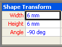
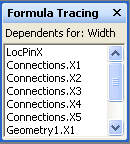

# Informationen zur zum FormelablauffensterAbout the Formula Tracing Window

Das Fenster **Formelprotokollierung** bietet Shape-Entwicklern Informationen über gegenseitige Abhängigkeiten zwischen Zellen, sowohl für abhängige Zellen (Zellen mit einer Abhängigkeit gegenüber einer bestimmten Zelle) als auch für Vorgängerzellen (Zellen, von denen eine bestimmte Zelle abhängt).The **Formula Tracing** window is designed to provide shape developers with information about cell interdependencies—both dependent cells (cells that have a dependency on a given cell), and precedent cells (cells that a given cell depends on). 
  
Die Zellen in einem Microsoft Visio-ShapeSheet enthalten Werte und Formeln.The cells in a Microsoft Visio ShapeSheet contain values and formulas. Formeln können wiederum Verweise auf andere Zellen, was Ihnen die Möglichkeit, einen Wert in einer Zelle basierend auf einer anderen Zelle Wert berechnen lassen.Formulas can, in turn, have references to other cells, giving you the power to calculate a value in one cell based on another cell's value. Beim Erstellen oder Verwalten komplexer Shapes, kann jedoch es schwierig sein, alle diese Abhängigkeiten identifiziert werden, da eine Formel, die eine beliebige Zelle in der Zeichnung verwiesen werden kann, ob es sich um eine Zelle in der gleichen ShapeSheet oder eine Zelle, die in ein anderes Objekt in der Zeichnung gehören ist, beispielsweise einer Seite, Formatvorlage, Master-Shape oder eine andere Form.When creating or maintaining complex shapes, however, it can be difficult to identify all these interdependencies because a formula can reference any cell in the drawing, whether it's a cell in the same ShapeSheet, or a cell belonging to another object in the drawing, for example, a page, style, master, or another shape. 
  
Im Fenster **Formelprotokollierung** enthält Informationen, mit denen das Verständnis die Auswirkungen von Änderungen, die Sie Zellen vornehmen.The **Formula Tracing** window provides information to help you understand the implications of changes you make to cells. 
  
## Anzeigen von FormelprotokollierungsfensterDisplaying the Formula Tracing Window

So zeigen Sie das Fenster **Formelprotokollierung** im ShapeSheet-Fenster aktiv ist, klicken Sie unter **ShapeSheet-Tools** auf an der \*\* Design \*\* klicken auf der Registerkarte in der Gruppe **Formelprotokollierung** **Fenster anzeigen**.To view the **Formula Tracing** window, with the ShapeSheet window active, under **ShapeSheet Tools** on the \*\* Design \*\* tab, in the **Formula Tracing** group, click **Show Window**. **Das Formelprotokollierungsfenster** angedockten im ShapeSheet-Fenster wird standardmäßig angezeigt, jedoch ist ein verankertes Fenster, das angedockt, Mauszeiger halten oder zusammengeführt werden kann mit anderen verfügbaren verankerten ShapeSheet-Fenster, beispielsweise das **Format-Explorer** -Fenster.The **Formula Tracing** window appears docked in the ShapeSheet window by default, but is an anchored window that can be docked, floated or merged with other available anchored ShapeSheet windows, for example, the **Style Explorer** window. 
  
## Verfolgen abhängiger ZellenTracing dependent cells

Zum Anzeigen einer Liste von Zellen, die von einer bestimmten Zelle abhängig sind, wählen Sie die betreffende Zelle im ShapeSheet-Fenster aus. In diesem Beispiel ist die Zelle Width ausgewählt.To see a list of cells that are dependent on a particular cell, select that cell in the ShapeSheet window. In this example, the Width cell is selected. 
  

  
Klicken Sie zum Anzeigen von ihr abhängigen Zellen klicken, in der Gruppe **Formelprotokollierung**auf **Spur zum Nachfolger**.To view its dependent cells, in the **Formula Tracing**group, click **Trace Dependents**.
  
Eine Liste aller von der Zelle Width abhängigen Zellen wird im Fenster Formelprotokollierung angezeigt. Sie können zu einer beliebigen Zelle in der Liste navigieren, indem Sie auf den entsprechenden Eintrag im Fenster Formelprotokollierung doppelklicken.A list of all the cells with a dependency on the Width cell appears in the **Formula Tracing** window. You can navigate to any cell in the list by double-clicking its entry in the **Formula Tracing** window. 
  

  
## Verfolgen Precendent ZellenTracing precendent cells

Wenn eine Liste aller Zellen angezeigt werden soll, von denen eine bestimmte Zelle abhängt, wählen Sie zunächst die Zelle im ShapeSheet-Fenster aus. In diesem Beispiel ist die Zelle Geometry1.X2 ausgewählt.To see a list of cells that a particular cell is dependent upon, first select the cell in the ShapeSheet window. In this example, the Geometry1.X2 cell is selected. 
  

  
Klicken Sie zum Anzeigen ihrer Vorgängerzellen klicken, in der Gruppe **Formelprotokollierung**auf **Spur zum Vorgänger**.To view its precedent cells, in the **Formula Tracing**group, click **Trace Precedents**.
  
Eine Liste aller Zellen, die die Zelle Geometry1.X2 abhängig ist, wird im Fenster **Formelprotokollierung** angezeigt.A list of all the cells that the Geometry1.X2 cell is dependent upon appears in the **Formula Tracing** window. Sie können auf eine beliebige Zelle in der Liste navigieren, indem Sie den Eintrag im Fenster **Formelprotokollierung** doppelklicken.You can navigate to any cell in the list by double-clicking its entry in the **Formula Tracing** window. 
  

  

