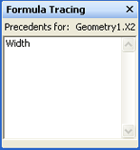

# Informationen zum Fenster "Formelprotokollierung"About the Formula Tracing Window

Das Fenster **Formelprotokollierung** bietet Shape-Entwicklern Informationen über gegenseitige Abhängigkeiten zwischen Zellen, sowohl für abhängige Zellen (Zellen mit einer Abhängigkeit gegenüber einer bestimmten Zelle) als auch für Vorgängerzellen (Zellen, von denen eine bestimmte Zelle abhängt).The **Formula Tracing** window is designed to provide shape developers with information about cell interdependencies—both dependent cells (cells that have a dependency on a given cell), and precedent cells (cells that a given cell depends on). 
  
Die Zellen in einem Microsoft Visio-ShapeSheet enthalten Werte und Formeln.The cells in a Microsoft Visio ShapeSheet contain values and formulas. Formeln können wiederum Verweise auf andere Zellen enthalten, sodass Sie die Möglichkeit haben, einen Wert in einer Zelle basierend auf dem Wert einer anderen Zelle zu berechnen.Formulas can, in turn, have references to other cells, giving you the power to calculate a value in one cell based on another cell's value. Beim Erstellen und Verwalten komplexer Shapes ist das Erkennen all dieser Abhängigkeiten jedoch unter Umständen sehr schwierig, da eine Formel auf eine beliebige Zelle in der Zeichnung verweisen kann, wobei es egal ist, ob es sich um eine Zelle in demselben ShapeSheet oder um eine Zelle eines anderen Objekts in der Zeichnung handelt, beispielsweise um eine Seite, eine Formatvorlage, einen Master oder ein anderes Shape.When creating or maintaining complex shapes, however, it can be difficult to identify all these interdependencies because a formula can reference any cell in the drawing, whether it's a cell in the same ShapeSheet, or a cell belonging to another object in the drawing, for example, a page, style, master, or another shape. 
  
Das Fenster für die **Formelprotokollierung** enthält Informationen, die Ihnen helfen, die Auswirkungen von Änderungen, die Sie an Zellen vornehmen, zu verstehen.The **Formula Tracing** window provides information to help you understand the implications of changes you make to cells. 
  
## Anzeigen des Fensters für die FormelprotokollierungDisplaying the Formula Tracing Window

Klicken Sie zum Anzeigen des Fensters für die **Formel Ablaufverfolgung** , wobei das ShapeSheet-Fenster aktiv ist, unter **ShapeSheet-Tools** auf der Registerkarte \* \* Design \* \* in der Gruppe **Formelprotokollierung** auf **Fenster anzeigen**.To view the **Formula Tracing** window, with the ShapeSheet window active, under **ShapeSheet Tools** on the \*\* Design \*\* tab, in the **Formula Tracing** group, click **Show Window**. Das Fenster für die **Formelprotokollierung** wird standardmäßig im ShapeSheet-Fenster angedockt, es handelt sich jedoch um ein verankertes Fenster, das angedockt, unverankert oder mit anderen verfügbaren verankerten ShapeSheet-Fenstern zusammengeführt werden kann, beispielsweise im Fenster **Format-Explorer** .The **Formula Tracing** window appears docked in the ShapeSheet window by default, but is an anchored window that can be docked, floated or merged with other available anchored ShapeSheet windows, for example, the **Style Explorer** window. 
  
## Verfolgen abhängiger ZellenTracing dependent cells

Zum Anzeigen einer Liste von Zellen, die von einer bestimmten Zelle abhängig sind, wählen Sie die betreffende Zelle im ShapeSheet-Fenster aus. In diesem Beispiel ist die Zelle Width ausgewählt.To see a list of cells that are dependent on a particular cell, select that cell in the ShapeSheet window. In this example, the Width cell is selected. 
  

  
Um die abhängigen Zellen anzuzeigen, klicken Sie in der Gruppe **Formelprotokollierung**auf **Ablauf Verfolgungs abhängige**.To view its dependent cells, in the **Formula Tracing**group, click **Trace Dependents**.
  
Eine Liste aller Zellen mit einer Abhängigkeit von der Zelle Breite wird im Fenster **Formelprotokollierung** angezeigt.A list of all the cells with a dependency on the Width cell appears in the **Formula Tracing** window. Sie können zu einer beliebigen Zelle in der Liste navigieren, indem Sie im Fenster **Formelprotokollierung** auf den entsprechenden Eintrag doppelklicken.You can navigate to any cell in the list by double-clicking its entry in the **Formula Tracing** window. 
  

  
## NachVerfolgen von precendent-ZellenTracing precendent cells

Wenn eine Liste aller Zellen angezeigt werden soll, von denen eine bestimmte Zelle abhängt, wählen Sie zunächst die Zelle im ShapeSheet-Fenster aus. In diesem Beispiel ist die Zelle Geometry1.X2 ausgewählt.To see a list of cells that a particular cell is dependent upon, first select the cell in the ShapeSheet window. In this example, the Geometry1.X2 cell is selected. 
  

  
Zum Anzeigen der Vorgängerzellen klicken Sie in der Gruppe **Formelprotokollierung**auf **Vorgänger**-Traces.To view its precedent cells, in the **Formula Tracing**group, click **Trace Precedents**.
  
Eine Liste aller Zellen, von denen die Zelle Geometry1. x2 abhängig ist, wird im Fenster **Formelprotokollierung** angezeigt.A list of all the cells that the Geometry1.X2 cell is dependent upon appears in the **Formula Tracing** window. Sie können zu einer beliebigen Zelle in der Liste navigieren, indem Sie im Fenster **Formelprotokollierung** auf den entsprechenden Eintrag doppelklicken.You can navigate to any cell in the list by double-clicking its entry in the **Formula Tracing** window. 
  

  

