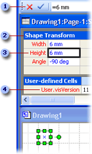

# Informationen zur ShapeSheet-Kalkulationstabelle

Jedem Objekt in Microsoft Visio (Dokument, Zeichenblatt, Formatvorlage, Shape, Gruppe, Shape oder Objekt in einer Gruppe, Master-Shape, Objekt aus einem anderen Programm, Führungslinie und Führungspunkt) ist eine ShapeSheet-Kalkulationstabelle zugeordnet, in der wichtige objektspezifische Informationen aufgeführt sind. Diese Kalkulationstabelle enthält Informationen wie Höhe, Breite, Winkel, Farbe sowie andere Attribute, die das Erscheinungsbild und das Verhalten des Shapes definieren.
  
Als Shape-Entwickler müssen Sie das Erscheinungsbild und Verhalten der von Ihnen erstellten Shapes ohne Einschränkungen und genauestens steuern können. Sie können das Standardverhalten eines Shapes ändern sowie seine Funktionalität erweitern, indem Sie es über seine ShapeSheet-Kalkulationstabelle bearbeiten. Auf diese Tabelle können Sie in einem ShapeSheet-Fenster oder programmgesteuert zugreifen.
  
## Anzeigen eines Objekts in einem ShapeSheet-Fenster

Das Visio-Zeichnungsfenster und das ShapeSheet-Fenster stellen verschiedene Ansichten desselben Shapes dar.
  
- Wenn Sie ein Shape in einem Zeichnungsfenster anzeigen, wird es grafisch gerendert angezeigt. Darüber hinaus verhält es sich gemäß den Formeln, die in seiner ShapeSheet-Kalkulationstabelle definiert sind.
    
- Wenn Sie ein Shape in einem ShapeSheet-Fenster anzeigen, sehen Sie die zugrunde liegenden Formeln, die bestimmen, wie das Shape auf dem Zeichenblatt angezeigt wird und wie es sich verhält.
    
Sie können ein ShapeSheet-Fenster und ein Zeichnungsfenster gleichzeitig anzeigen und sehen, wie das Shape im Zeichnungsfenster geändert wird, während Sie Zellen im entsprechenden ShapeSheet-Fenster ändern bzw. umgekehrt. Wenn Sie das Shape beispielsweise mit dem Mauszeiger verschieben, ändern sich die Formeln für PinX und PinY im Abschnitt Shape Transform, um die neue Position des Shapes auf dem Zeichenblatt anzuzeigen.
  
## Struktur des ShapeSheet-Fensters

Ein ShapeSheet ist  *in*  Abschnitte unterteilt, die einen bestimmten Aspekt des Verhaltens oder der Darstellung eines Shapes steuern, z. B. dessen Geometrie oder Formatierung. Jeder Abschnitt enthält eine oder mehrere *Zeilen,* die Zellen *enthalten.* Jede Zelle kann eine Formel, deren Ergebnis (im Allgemeinen als Zellenwert bezeichnet) sowie optionale Fehlerinformationen enthalten. Abhängig von der jeweiligen Zelle kann eine Formel erforderlich oder optional sein. Die Daten einer Zelle (z.B. ihre Formel oder ihr Wert) können lokal definiert oder, was häufiger vorkommt, aus der entsprechenden Zelle im Master-Shape oder in der Formatvorlage des Shapes übernommen werden. 
  
Das folgende Beispiel zeigt die Formelleiste , ein Abschnitt , eine Zelle und eine Zeile  im ShapeSheet-Fenster. 
  

  
Wenn Sie ein Shape zeichnen, wird es in Visio als Sammlung horizontaler und vertikaler Positionen gespeichert, die über Liniensegmente miteinander verbunden sind. Diese Positionen (als Scheitelpunkte bezeichnet) werden in den X- und Y-Zellen des Abschnitts **Geometry des Shapes** aufgezeichnet. Wie im folgenden Beispiel gezeigt, wird beim Klicken auf die X- und Y-Zellen im Abschnitt **Geometrie** des ShapeSheet-Fensters eines Shapes ein schwarz umrandes Feld angezeigt, in dem der Scheitelpunkt des Shapes im Zeichnungsfenster hervorgehoben wird. 
  

  
## Bearbeiten eines Objekts im ShapeSheet-Fenster

Wenn ein ShapeSheet-Fenster aktiv ist, ändert sich das Menüband entsprechend, um Optionen für das Arbeiten in diesem Fenster anzuzeigen. Wenn Sie eine ShapeSheet-Zelle auswählen, wird eine Formelleiste angezeigt, die Sie verwenden können, um die Formeln eines Objekts einzugeben oder zu ändern. Sie können aber auch direkt in der Zelle arbeiten.
  
In einem ShapeSheet-Fenster können Sie einem ShapeSheet Abschnitte hinzufügen, um dem Shape auf dem Zeichenblatt beispielsweise neue Merkmale hinzuzufügen. Sie können z. B. einen Abschnitt **"Verbindungspunkte"** hinzufügen, um eine Verbindung zu erstellen. Wenn Sie einen Abschnitt nicht mehr benötigen, können Sie ihn löschen. 
  
Sie können darüber hinaus einzelnen Abschnitten Zeilen hinzufügen, um zusätzliche Formeln zu speichern oder das Erscheinungsbild eines Shapes zu ändern. Sie können z. B. einem **Abschnitt Geometry** eine Zeile hinzufügen, um einem Shape ein Segment hinzuzufügen. Auch hier können Sie Zeilen löschen, die Sie nicht mehr benötigen. 
  
Sie können in Zellen entweder Formeln oder Werte anzeigen. Zeigen Sie Formeln an, wenn Sie neue Formeln eingeben, vorhandene Formeln ändern oder überprüfen möchten, in welcher Beziehung Formeln in verschiedenen Zellen zueinander stehen. Ein Wert ist das Ergebnis, das Sie erhalten, wenn Visio die Formel in einer Zelle berechnet. Sie können die Werte in den Zellen anzeigen, um die Ergebnisse der Berechnungen zu erhalten.
  
## Weitere Informationen zu ShapeSheets

Details zu einem bestimmten Abschnitt, einer Bestimmten Zeile oder Zelle im ShapeSheet finden Sie im entsprechenden Artikel in dieser [ShapeSheet-Referenz](reference-visio-shapesheet.md).
  
Einzelheiten zum programmgesteuerten Zugriff auf die ShapeSheet-Kalkulationstabelle finden Sie in der Microsoft Visio Automation Reference.
  

