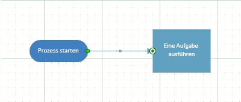

# <a name="manipulate-the-visio-file-format-programmatically"></a><span data-ttu-id="ab131-102">Programmgesteuertes Bearbeiten des Visio-Dateiformats</span><span class="sxs-lookup"><span data-stu-id="ab131-102">Manipulate the Visio file format programmatically</span></span>


  
<span data-ttu-id="ab131-104">Hier erfahren Sie, wie Sie eine Lösung in Visual Studio 2012, um den neuen Datei Format Paket in Visio 2013 lesen, wählen Sie Teile im Paket, ändern Sie die Daten in einem Webpart und hinzufügen neue Komponenten für das Paket zu erstellen.</span><span class="sxs-lookup"><span data-stu-id="ab131-104">Learn how to create a solution in Visual Studio 2012 to read the new file format package in Visio 2013, select parts in the package, change the data in a part, and add new parts to the package.</span></span>
  
|||
|:-----|:-----|
|<span data-ttu-id="ab131-105">**In diesem Artikel** [Visio-Datei Format Manipulation essentials](#vis15_ManipulateFF_Essentials) [Erstellen Sie eine vsdx-Datei und eine neue Visual Studio-Lösung](#vis15_ManipulateFF_CreateFile) [Öffnen Sie eine Visio 2013-Datei als Paket](#vis15_ManipulateFF_OpenPackage) [Wählen Sie aus, und Lesen Sie Paketteile aus einem Paket](#vis15_ManipulateFF_SelectPart) [Wählen Sie aus, und ändern Sie XML-Daten in einem Paket-Webpart](#vis15_ManipulateFF_ChangeXML) [Neuberechnen von Daten in der Datei](#vis15_ManipulateFF_Recalculate) [Hinzufügen eines neuen Paket-Webparts zu einem Paket](#vis15_ManipulateFF_AddNewPart) [Danksagung](#vis15_ManipulateFF_Ackn) [Weitere Ressourcen](#vis15_ManipulateFF_Additional)                                                                                         </span><span class="sxs-lookup"><span data-stu-id="ab131-105">**In this article**         [Visio file format manipulation essentials](#vis15_ManipulateFF_Essentials)          [Create a .vsdx file and a new Visual Studio solution](#vis15_ManipulateFF_CreateFile)          [Open a Visio 2013 file as a package](#vis15_ManipulateFF_OpenPackage)          [Select and read package parts from a package](#vis15_ManipulateFF_SelectPart)          [Select and change XML data in a package part](#vis15_ManipulateFF_ChangeXML)          [Recalculate data in the file](#vis15_ManipulateFF_Recalculate)          [Add a new package part to a package](#vis15_ManipulateFF_AddNewPart)          [Acknowledgements](#vis15_ManipulateFF_Ackn)          [Additional resources](#vis15_ManipulateFF_Additional)</span></span>||
   
## <a name="visio-file-format-manipulation-essentials"></a><span data-ttu-id="ab131-106">Grundlegendes zum Bearbeiten des Visio-Dateiformats</span><span class="sxs-lookup"><span data-stu-id="ab131-106">Visio file format manipulation essentials</span></span>
<span data-ttu-id="ab131-107"><a name="vis15_ManipulateFF_Essentials"> </a></span><span class="sxs-lookup"><span data-stu-id="ab131-107"></span></span>

<span data-ttu-id="ab131-108">Frühere Versionen von Visio gespeicherte Dateien in einem proprietären binären Dateiformat (.vsd) oder ein einzelnes Dokument Visio XML-Zeichnung-Dateiformat (VDX).</span><span class="sxs-lookup"><span data-stu-id="ab131-108">Previous versions of Visio saved files in a proprietary binary file format (.vsd) or a single-document Visio XML Drawing file format (.vdx).</span></span> <span data-ttu-id="ab131-109">Visio 2013 führt ein neues Dateiformat (.vsdx), die auf XML- und ZIP-Archiv-Technologie basiert.</span><span class="sxs-lookup"><span data-stu-id="ab131-109">Visio 2013 introduces a new file format (.vsdx), which is based on XML and ZIP archive technologies.</span></span> <span data-ttu-id="ab131-110">Wie in früheren Versionen von Visio werden die Dateien in einem einzelnen Container gespeichert.</span><span class="sxs-lookup"><span data-stu-id="ab131-110">Just as in previous versions of Visio, files are saved in a single container.</span></span> <span data-ttu-id="ab131-111">Im Gegensatz zu Legacydateien jedoch kann das neue Dateiformat geöffnet, lesen, aktualisiert und werden, geändert, ohne die Automatisierung Visio 2013-Anwendung erstellt.</span><span class="sxs-lookup"><span data-stu-id="ab131-111">Unlike legacy files, however, the new file format can be opened, read, updated, changed, and constructed without automating the Visio 2013 application.</span></span> <span data-ttu-id="ab131-112">Entwickler, die mit der Bearbeitung von XML und zum Arbeiten mit den [System.IO.Packaging](https://msdn.microsoft.com/library/System.IO.Packaging.aspx) -Namespace vertraut sind können schnell die ersten Schritte beim Arbeiten mit dem neuen Dateiformat programmgesteuert.</span><span class="sxs-lookup"><span data-stu-id="ab131-112">Developers who are familiar with manipulating XML or working with the [System.IO.Packaging](https://msdn.microsoft.com/library/System.IO.Packaging.aspx) namespace can quickly get started working with the new file format programmatically.</span></span> <span data-ttu-id="ab131-113">Entwickler, die mit dem Visio-XML-Zeichnung Format aus vorherigen Versionen gearbeitet haben können feststellen, dass viele die Strukturen von dieses Format in das neue Dateiformat beibehalten haben.</span><span class="sxs-lookup"><span data-stu-id="ab131-113">Developers who have worked with the Visio XML Drawing format from previous versions can find that many of the structures from that format have been retained in the new file format.</span></span> 
  
<span data-ttu-id="ab131-114">In diesem Artikel untersuchen wir zum Arbeiten mit dem Visio 2013-Dateiformat programmgesteuert mithilfe der Microsoft .NET Framework 4.5, c# oder Visual Basic und Visual Studio 2012.</span><span class="sxs-lookup"><span data-stu-id="ab131-114">In this article, we examine how to work with the Visio 2013 file format programmatically, using the Microsoft .NET Framework 4.5, C# or Visual Basic, and Visual Studio 2012.</span></span> <span data-ttu-id="ab131-115">Sie können die Informationen zum Öffnen einer Visio 2013-Datei, wählen Sie in der Datei Dokumentteile, Ändern von Daten in Webparts und erstellen einen neuen Dokumentteil.</span><span class="sxs-lookup"><span data-stu-id="ab131-115">You can see how to open a Visio 2013 file, select document parts within the file, change data in parts, and create a new document part.</span></span>
  
> [!NOTE]
> <span data-ttu-id="ab131-116">Die folgenden Codebeispiele in diesem Artikel wird davon ausgegangen, dass Sie ein rudimentäre Verständnis der Klassen im [System.Xml.Linq](https://msdn.microsoft.com/library/System.Xml.Linq.aspx) und [System.IO.Packaging](https://msdn.microsoft.com/library/System.IO.Packaging.aspx) -Namespace verfügen.</span><span class="sxs-lookup"><span data-stu-id="ab131-116">The code samples in this article assume that you have a rudimentary understanding of the classes in the [System.Xml.Linq](https://msdn.microsoft.com/library/System.Xml.Linq.aspx) and [System.IO.Packaging](https://msdn.microsoft.com/library/System.IO.Packaging.aspx) namespaces.</span></span> <span data-ttu-id="ab131-117">> In diesem Artikel wird davon ausgegangen, dass Sie die Konzepte und Terminologie der Open Packaging Conventions verstehen.</span><span class="sxs-lookup"><span data-stu-id="ab131-117">> This article also assumes that you understand the concepts and terminology of the Open Packaging Conventions.</span></span> <span data-ttu-id="ab131-118">Sie sollten einige gute Kenntnisse im Umgang mit den Konzepten der Pakete, Dokumentteile oder Paketteile und Beziehungen verfügen.</span><span class="sxs-lookup"><span data-stu-id="ab131-118">You should have some familiarity with the concepts of packages, document parts or package parts, and relationships.</span></span> <span data-ttu-id="ab131-119">Weitere Informationen finden Sie unter [OPC: ein neuer Standard für Packaging Your Data](http://msdn.microsoft.com/en-us/magazine/cc163372.aspx).</span><span class="sxs-lookup"><span data-stu-id="ab131-119">For more information, see [OPC: A New Standard for Packaging Your Data](http://msdn.microsoft.com/en-us/magazine/cc163372.aspx).</span></span> <span data-ttu-id="ab131-120">> Der Code veranschaulicht das Erstellen von LINQ (Language-Integrated Query) Abfragen, um XML auszuwählen.</span><span class="sxs-lookup"><span data-stu-id="ab131-120">> The code demonstrates how to create LINQ (Language-Integrated Query) queries to select XML.</span></span> <span data-ttu-id="ab131-121">Die meisten der Codebeispiele verwenden die Abfragesyntax für die Erstellung von LINQ-Abfragen.</span><span class="sxs-lookup"><span data-stu-id="ab131-121">Most of the code samples use the query syntax for building LINQ queries.</span></span> <span data-ttu-id="ab131-122">Sie können keines der LINQ-Abfragen im Code durch verwenden die Syntax der LINQ-Methode bereitgestellt, bei Bedarf umschreiben.</span><span class="sxs-lookup"><span data-stu-id="ab131-122">You can rewrite any of the LINQ queries provided in the code by using the LINQ method syntax, if necessary.</span></span> <span data-ttu-id="ab131-123">Weitere Informationen zu LINQ-Abfragesyntax und Methodensyntax finden Sie unter [LINQ-Abfragesyntax und Methodensyntax (c#)](http://msdn.microsoft.com/en-us/library/bb397947.aspx)> in Tabelle 1 sind die wichtigsten Themen, die Sie mit vertraut sein sollten, bevor Sie über die in diesem Artikel verwendet werden.</span><span class="sxs-lookup"><span data-stu-id="ab131-123">For more information about LINQ query syntax and method syntax, see [LINQ Query Syntax versus Method Syntax (C#)](http://msdn.microsoft.com/en-us/library/bb397947.aspx)> Table 1 shows the essential topics that you should be familiar with before you work through this article.</span></span> 
  
<span data-ttu-id="ab131-124">**Tabelle 1. Grundlegende Konzepte für die Bearbeitung des Visio 2013-Dateiformats**</span><span class="sxs-lookup"><span data-stu-id="ab131-124">**Table 1. Core concepts for manipulating the Visio 2013 file format**</span></span>

|<span data-ttu-id="ab131-125">**Titel des Artikels**</span><span class="sxs-lookup"><span data-stu-id="ab131-125">**Article title**</span></span>|<span data-ttu-id="ab131-126">**Beschreibung**</span><span class="sxs-lookup"><span data-stu-id="ab131-126">**Description**</span></span>|
|:-----|:-----|
|[<span data-ttu-id="ab131-127">Einführung in das Visio-Dateiformat (.vsdx)</span><span class="sxs-lookup"><span data-stu-id="ab131-127">Introduction to the Visio file format (.vsdx)</span></span>](introduction-to-the-visio-file-formatvsdx.md) <br/> |<span data-ttu-id="ab131-128">Diese Übersicht beschreibt einige der wichtigsten Features in das Visio 2013-Dateiformat.</span><span class="sxs-lookup"><span data-stu-id="ab131-128">This high-level overview describes some of the major features of the Visio 2013 file format.</span></span> <span data-ttu-id="ab131-129">Außerdem wird die Open Packaging-Konventionen (OPC) erläutert, wie sie das Visio 2013-Dateiformat angewendet wurden.</span><span class="sxs-lookup"><span data-stu-id="ab131-129">It discusses the Open Packaging Conventions (OPC) as they have been applied to the Visio 2013 file format.</span></span> <span data-ttu-id="ab131-130">Es sind auch einige Unterschiede zwischen dem Visio 2013-Dateiformat und der vorherigen Dateiformat für Visio XML-Zeichnung (VDX) aufgeführt.</span><span class="sxs-lookup"><span data-stu-id="ab131-130">It also lists some differences between the Visio 2013 file format and the previous Visio XML Drawing file format (.vdx).</span></span>  <br/> |
|[<span data-ttu-id="ab131-131">OPC: Ein neuer Standard für das Verpacken Ihrer Daten</span><span class="sxs-lookup"><span data-stu-id="ab131-131">OPC: A New Standard for Packaging Your Data</span></span>](http://msdn.microsoft.com/en-us/magazine/cc163372.aspx) <br/> |<span data-ttu-id="ab131-132">In diesem MSDN Magazine-Artikel werden die Open Packaging-Konventionen als Konzept beschrieben.</span><span class="sxs-lookup"><span data-stu-id="ab131-132">This MSDN Magazine article describes the Open Packaging Conventions as a concept.</span></span>  <br/> |
|[<span data-ttu-id="ab131-133">Grundlagen der Open Packaging Conventions</span><span class="sxs-lookup"><span data-stu-id="ab131-133">Essentials of the Open Packaging Conventions</span></span>](http://msdn.microsoft.com/en-us/library/ee361919.aspx) <br/> [<span data-ttu-id="ab131-134">Einführung in die Office (2007) Open XML-Dateiformate</span><span class="sxs-lookup"><span data-stu-id="ab131-134">Introducing the Office (2007) Open XML File Formats</span></span>](http://msdn.microsoft.com/en-us/library/aa338205.aspx) <br/> |<span data-ttu-id="ab131-135">Diese beiden Artikel erläutern, wie die Open Packaging-Konventionen auf Microsoft Office-Dateien angewendet wurden.</span><span class="sxs-lookup"><span data-stu-id="ab131-135">These two articles discuss how the Open Packaging Conventions have been applied to Microsoft Office files.</span></span> <span data-ttu-id="ab131-136">Sie enthalten eine Beschreibung der Funktionsweise Beziehungen in einem Paket und auch einige Codebeispiele enthalten.</span><span class="sxs-lookup"><span data-stu-id="ab131-136">They contain descriptions of how relationships work in a package and also include some code examples.</span></span>  <br/> |
   
## <a name="create-a-vsdx-file-and-a-new-visual-studio-solution"></a><span data-ttu-id="ab131-137">Erstellen einer VSDX-Datei und einer neuen Visual Studio-Lösung</span><span class="sxs-lookup"><span data-stu-id="ab131-137">Create a .vsdx file and a new Visual Studio solution</span></span>
<span data-ttu-id="ab131-138"><a name="vis15_ManipulateFF_CreateFile"> </a></span><span class="sxs-lookup"><span data-stu-id="ab131-138"></span></span>

<span data-ttu-id="ab131-139">Vor Beginn Durcharbeiten der Verfahren in diesem Artikel müssen Sie zum Erstellen einer Visio 2013-Datei zum Öffnen und bearbeiten.</span><span class="sxs-lookup"><span data-stu-id="ab131-139">Before you can begin working through the procedures in this article, you need to create a Visio 2013 file to open and manipulate.</span></span> <span data-ttu-id="ab131-140">Die Zeichnung in die Codebeispiele in diesem Artikel verwendeten enthält eine einzelne Seite mit zwei verbundene Shapes auf dem eines der Shapes wird eine Form "Start-/End" aus der Vorlage "Standardflussdiagramm".</span><span class="sxs-lookup"><span data-stu-id="ab131-140">The drawing used in the code examples in this article contains a single page with two connected shapes on it, one of the shapes being a "Start/End" shape from the "Basic Flowchart" template.</span></span>
  
<span data-ttu-id="ab131-141">Verwenden Sie das folgende Verfahren zum Erstellen einer neuen Visio 2013-Datei, in der restlichen Schritte in diesem Artikel zu verwenden.</span><span class="sxs-lookup"><span data-stu-id="ab131-141">Use the following procedure to create a new Visio 2013 file to use in the remaining procedures in this article.</span></span>
  
### <a name="to-create-new-file-in-visio-2013"></a><span data-ttu-id="ab131-142">So erstellen neue Datei in Visio 2013</span><span class="sxs-lookup"><span data-stu-id="ab131-142">To create new file in Visio 2013</span></span>

1. <span data-ttu-id="ab131-143">Öffnen Sie Visio 2013.</span><span class="sxs-lookup"><span data-stu-id="ab131-143">Open Visio 2013.</span></span>
    
2. <span data-ttu-id="ab131-144">Erstellen Sie ein neues Dokument basierend auf der Vorlage „Standardflussdiagramm“, indem Sie **Kategorien**, **Flussdiagramm**, **Standardflussdiagramm**, **Erstellen** auswählen.</span><span class="sxs-lookup"><span data-stu-id="ab131-144">Create a new document based on the Basic Flowchart template by choosing **CATEGORIES**, **Flowchart**, **Basic Flowchart**, **Create**.</span></span>
    
3. <span data-ttu-id="ab131-145">Ziehen Sie aus dem Fenster **Shapes** ein **Anfangs-/Ende**-Shape auf den Zeichenbereich.</span><span class="sxs-lookup"><span data-stu-id="ab131-145">From the **Shapes** window, drag a **Start/End** shape onto the canvas.</span></span> 
    
4. <span data-ttu-id="ab131-146">Wählen Sie das neue Anfangs-/Ende-Shape im Zeichenbereich aus, und geben Sie Prozess beginnen ein.</span><span class="sxs-lookup"><span data-stu-id="ab131-146">Select the new Start/End shape on the drawing canvas and type 'Begin Process'.</span></span>
    
5. <span data-ttu-id="ab131-147">Ziehen Sie aus dem Fenster **Shapes** ein **Prozess**-Shape auf den Zeichenbereich.</span><span class="sxs-lookup"><span data-stu-id="ab131-147">From the **Shapes** window, drag a **Process** shape onto the canvas.</span></span> 
    
6. <span data-ttu-id="ab131-148">Wählen Sie das neue Prozess-Shape im Zeichenbereich aus, und geben Sie Eine Aufgabe ausführen ein.</span><span class="sxs-lookup"><span data-stu-id="ab131-148">Select the new Process shape on the drawing canvas and type 'Perform some task'.</span></span>
    
7. <span data-ttu-id="ab131-149">Wählen Sie im Kontextmenü für das Anfangs-/Ende-Shape **Dem Zeichenblatt einen Verbinder hinzufügen** aus, und ziehen Sie dann einen Verbinder zwischen dem Anfangs-/Ende- und dem Prozess-Shape auf dem Zeichenbereich, wie in Abbildung 1 dargestellt.</span><span class="sxs-lookup"><span data-stu-id="ab131-149">On the shortcut menu for the Start/End shape, select **Add One Connector to the Page**, and then draw a connector between the Start/End and Process shapes on the canvas, as shown in Figure 1.</span></span>
    
    <span data-ttu-id="ab131-150">**Abbildung 1. Einfache Visio 2013-Zeichnung**</span><span class="sxs-lookup"><span data-stu-id="ab131-150">**Figure 1. Simple Visio 2013 drawing**</span></span>
    
     
  
8. <span data-ttu-id="ab131-152">Speichern Sie die Datei auf dem Desktop als VSDX-Datei, indem Sie **Datei**, **Speichern unter**, **Computer**, **Desktop** auswählen.</span><span class="sxs-lookup"><span data-stu-id="ab131-152">Save the file to your Desktop as a .vsdx file by choosing **File**, **Save As**, **Computer**, **Desktop**.</span></span>
    
    <span data-ttu-id="ab131-153">Geben Sie im Dialogfeld **Speichern unter** Visio-Paket in das Feld **Dateiname"** ", wählen **Visio-Zeichnung (\*.vsdx)** im Feld **Dateityp** der Liste, und klicken Sie dann auf die Schaltfläche **Speichern** .</span><span class="sxs-lookup"><span data-stu-id="ab131-153">In the **Save As** dialog box, enter Visio Package in the **File name** box"", select **Visio Drawing (\*.vsdx)** in the **Save as type** list, and then choose the **Save** button.</span></span> 
    
9. <span data-ttu-id="ab131-154">Schließen Sie die Datei, und schließen Sie dann Visio 2013.</span><span class="sxs-lookup"><span data-stu-id="ab131-154">Close the file and then close Visio 2013.</span></span>
    
> [!TIP]
> <span data-ttu-id="ab131-155">In einigen Fällen Visio öffnet eine Datei erfolgreich auch, wenn Probleme mit der Datei.</span><span class="sxs-lookup"><span data-stu-id="ab131-155">Sometimes Visio opens a file successfully even if there are issues with the file.</span></span> <span data-ttu-id="ab131-156">Um sicherzustellen, dass Visio über Probleme Datei darüber informiert werden, sollten Sie die Datei öffnen Warnungen aktivieren beim Testen von Lösungen, die Visio-Dateien auf Dateiebene Paket bearbeiten.</span><span class="sxs-lookup"><span data-stu-id="ab131-156">To ensure that Visio notifies you of any file issues, you should enable file open warnings when testing solutions that manipulate Visio files at the file package level.</span></span> <span data-ttu-id="ab131-157">> Wählen Sie die **Datei**, **Optionen**, **Erweitert**, um Datei öffnen Warnungen in Visio 2013 zu aktivieren.</span><span class="sxs-lookup"><span data-stu-id="ab131-157">> To enable file open warnings, in Visio 2013, choose **File**, **Options**, **Advanced**.</span></span> <span data-ttu-id="ab131-158">Wählen Sie unter **Speichern/Öffnen** **Datei öffnen Warnungen anzeigen**.</span><span class="sxs-lookup"><span data-stu-id="ab131-158">Under **Save/Open**, select **Show file open warnings**.</span></span> 
  
<span data-ttu-id="ab131-159">Verwenden eine Konsolenanwendung Windows dieser Verfahren zum Bearbeiten der Datei "Visio Package.vsdx".</span><span class="sxs-lookup"><span data-stu-id="ab131-159">These procedures use a Windows console application to manipulate the "Visio Package.vsdx" file.</span></span> <span data-ttu-id="ab131-160">Verwenden Sie das folgende Verfahren zum Erstellen und richten Sie eine neue Windows Konsolenanwendung in Visual Studio 2012.</span><span class="sxs-lookup"><span data-stu-id="ab131-160">Use the following procedure to create and set up a new Windows console application in Visual Studio 2012.</span></span>
  
### <a name="to-create-a-new-solution-in-visual-studio-2012"></a><span data-ttu-id="ab131-161">Zum Erstellen einer neuen Lösung in Visual Studio 2012</span><span class="sxs-lookup"><span data-stu-id="ab131-161">To create a new solution in Visual Studio 2012</span></span>

1. <span data-ttu-id="ab131-162">Klicken Sie im Menü **Datei** auf **Neu** und dann auf **Projekt**.</span><span class="sxs-lookup"><span data-stu-id="ab131-162">On the **File** menu, choose **New**, **Project**.</span></span>
    
2. <span data-ttu-id="ab131-163">Erweitern Sie im Dialogfeld **Neues Projekt** entweder **Visual C#** oder **Visual Basic**, und wählen Sie dann **Windows**, **Konsolenanwendung** aus.</span><span class="sxs-lookup"><span data-stu-id="ab131-163">In the **New Project** dialog box, expand either **Visual C#** or **Visual Basic**, and then choose **Windows**, **Console Application**.</span></span>
    
    <span data-ttu-id="ab131-164">Geben Sie im Feld **Name** 'VisioFileAccessor', wählen Sie einen Speicherort für das Projekt, und wählen Sie dann auf die Schaltfläche **OK** .</span><span class="sxs-lookup"><span data-stu-id="ab131-164">In the **Name** box, enter ' VisioFileAccessor', select a location for the project, and then choose the **OK** button.</span></span> 
    
3. <span data-ttu-id="ab131-165">Wählen Sie im Menü **Projekt** **Verweis hinzufügen** aus.</span><span class="sxs-lookup"><span data-stu-id="ab131-165">On the **Project** menu, choose **Add Reference**.</span></span> 
    
    <span data-ttu-id="ab131-166">Wählen Sie im Dialogfeld **Verweis-Manager** unter **Assemblys** die Option **Framework** aus, und fügen Sie dann einen Verweis auf die Komponenten **System.Xml** und **WindowsBase** hinzu.</span><span class="sxs-lookup"><span data-stu-id="ab131-166">In the **Reference Manager** dialog box, under **Assemblies**, choose **Framework**, and then add a reference to the **System.Xml** and **WindowsBase** components.</span></span> 
    
4. <span data-ttu-id="ab131-167">Fügen Sie in der Datei „Program.cs“ oder „Module1.vb“ für das Projekt die folgenden **using**-Direktiven (**Imports**-Anweisungen in Visual Basic) hinzu:</span><span class="sxs-lookup"><span data-stu-id="ab131-167">In the Program.cs or Module1.vb file for the project, add the following **using** directives (**Imports** statements in Visual Basic):</span></span> 
    
  ```cs
  using System.Xml;
  using System.Xml.Linq;
  using System.IO;
  using System.IO.Packaging;
  using System.Text;
  
  ```

  ```vb
  Imports System.Xml
  Imports System.Xml.Linq
  Imports System.IO
  Imports System.IO.Packaging
  Imports System.Text
  
  ```

5. <span data-ttu-id="ab131-168">Fügen Sie ebenfalls in der Datei „Program.cs“ oder „Module1.vb“ vor dem Ende der **Main**-Methode der **Program**-Klasse (**Module1** in Visual Basic) den folgenden Code hinzu, durch den die Ausführung der Konsolenanwendung angehalten wird, bis der Benutzer eine Taste drückt.</span><span class="sxs-lookup"><span data-stu-id="ab131-168">Also in the Program.cs or Module1.vb file, before the end of the **Main** method of the **Program** class (**Module1** in Visual Basic), add the following code that stops execution of the console application until the user presses a key.</span></span> 
    
  ```cs
  // This code stops the execution of the console application
  // so you can read the output.
  Console.WriteLine("Press any key to continue ...");
  Console.ReadKey();
  
  ```

  ```vb
  ' This code stops the execution of the console application
  ' so you can read the output.
  Console.WriteLine("Press any key to continue ...")
  Console.ReadKey()
  ```

## <a name="open-a-visio-2013-file-as-a-package"></a><span data-ttu-id="ab131-169">Öffnen Sie eine Visio 2013-Datei als Paket</span><span class="sxs-lookup"><span data-stu-id="ab131-169">Open a Visio 2013 file as a package</span></span>
<span data-ttu-id="ab131-170"><a name="vis15_ManipulateFF_OpenPackage"> </a></span><span class="sxs-lookup"><span data-stu-id="ab131-170"></span></span>

<span data-ttu-id="ab131-171">Bevor Sie die Daten in der Datei bearbeiten können, müssen Sie zuerst die Datei in einem [Paket](https://msdn.microsoft.com/library/System.IO.Packaging.Package.aspx) -Objekt öffnen, in dem in den [System.IO.Packaging](https://msdn.microsoft.com/library/System.IO.Packaging.aspx) -Namespace enthalten ist.</span><span class="sxs-lookup"><span data-stu-id="ab131-171">Before you can manipulate any of the data within the file, you need to first open the file within a [Package](https://msdn.microsoft.com/library/System.IO.Packaging.Package.aspx) object, which is contained within the [System.IO.Packaging](https://msdn.microsoft.com/library/System.IO.Packaging.aspx) namespace.</span></span> <span data-ttu-id="ab131-172">Das **Paket** -Objekt stellt die Visio-Datei als Ganzes.</span><span class="sxs-lookup"><span data-stu-id="ab131-172">The **Package** object represents the Visio file as a whole.</span></span> <span data-ttu-id="ab131-173">Macht Member, mit die Sie einzelne Dokumentteile in dem Dateipaket auswählen können.</span><span class="sxs-lookup"><span data-stu-id="ab131-173">It exposes members that allow you to select individual document parts within the file package.</span></span> <span data-ttu-id="ab131-174">Insbesondere macht die **Paket** -Klasse die statische [Open (String FileMode, FileAccess)](https://msdn.microsoft.com/library/System.IO.Packaging.Package.Open.aspx) -Methode, die Sie zum Öffnen einer Datei als Paket verwenden.</span><span class="sxs-lookup"><span data-stu-id="ab131-174">In particular, the **Package** class exposes the static [Open(String, FileMode, FileAccess)](https://msdn.microsoft.com/library/System.IO.Packaging.Package.Open.aspx) method that you use to open a file as a package.</span></span> <span data-ttu-id="ab131-175">Macht auch [für das Paket schließen, nachdem Sie haben eine Close()-Methode](https://msdn.microsoft.com/library/System.IO.Packaging.Package.Close.aspx) Verarbeitung beendet.</span><span class="sxs-lookup"><span data-stu-id="ab131-175">It also exposes a [Close()](https://msdn.microsoft.com/library/System.IO.Packaging.Package.Close.aspx) method for closing the package once you've finished with it.</span></span> 
  
> [!TIP]
> <span data-ttu-id="ab131-176">Es empfiehlt sich verwenden Sie einen Block **mithilfe** die Visio-Datei im **Paket** -Objekt geöffnet, damit Sie nicht, das Dateipaket explizit zu schließen, wenn Sie mit ihm fertig sind.</span><span class="sxs-lookup"><span data-stu-id="ab131-176">As a best practice, use a **using** block to open the Visio file in the **Package** object so that you don't have to explicitly close the file package when you're done with it.</span></span> <span data-ttu-id="ab131-177">Sie können auch explizit in **finally** -Block **Try/Catch/finally** konstruiert die **Package.Close** -Methode aufrufen.</span><span class="sxs-lookup"><span data-stu-id="ab131-177">You can also explicitly call the **Package.Close** method in the **finally** block of a **try/catch/finally** construction.</span></span> 
  
<span data-ttu-id="ab131-178">Verwenden Sie den folgenden Code, um den vollständigen Pfad für die Datei "Visio Package.vsdx" mithilfe eines [FileInfo](https://msdn.microsoft.com/library/System.IO.FileInfo.aspx) -Objekts erhalten möchten, übergeben Sie den Pfad als Argument an die **Package.Open** -Methode und klicken Sie dann ein **Paket** an den aufrufenden Code zurück.</span><span class="sxs-lookup"><span data-stu-id="ab131-178">Use the following code to get the full path for the "Visio Package.vsdx" file by using a [FileInfo](https://msdn.microsoft.com/library/System.IO.FileInfo.aspx) object, pass the path as an argument to the **Package.Open** method, and then return a **Package** object to the calling code.</span></span> 
  
### <a name="to-open-a-vsdx-file-as-a-package"></a><span data-ttu-id="ab131-179">So öffnen Sie eine VSDX-Datei als Paket</span><span class="sxs-lookup"><span data-stu-id="ab131-179">To open a .vsdx file as a package</span></span>

1. <span data-ttu-id="ab131-180">Fügen Sie nach der **Main**-Methode in der **Program**-Klasse (oder **Module1** in Visual Basic) den folgenden Code hinzu.</span><span class="sxs-lookup"><span data-stu-id="ab131-180">After the **Main** method in the **Program** class (or **Module1** in Visual Basic), add the following code.</span></span> 
    
  ```cs
  private static Package OpenPackage(string fileName, 
      Environment.SpecialFolder folder)
  {
      Package visioPackage = null;
      // Get a reference to the location 
      // where the Visio file is stored.
      string directoryPath = System.Environment.GetFolderPath(
          folder);
      DirectoryInfo dirInfo = new DirectoryInfo(directoryPath);
      // Get the Visio file from the location.
      FileInfo[] fileInfos = dirInfo.GetFiles(fileName);
      if (fileInfos.Count() > 0)
      {
          FileInfo fileInfo = fileInfos[0];
          string filePathName = fileInfo.FullName;
          // Open the Visio file as a package with
          // read/write file access.
          visioPackage = Package.Open(
              filePathName,
              FileMode.Open,
              FileAccess.ReadWrite);
          }
          // Return the Visio file as a package.
          return visioPackage;
  }
  ```

  ```vb
  Private Function OpenPackage(fileName As String, _
      folder As Environment.SpecialFolder) As Package
      Dim visioPackage As Package = Nothing
      ' Get a reference to the location
      ' where the Visio file is stored.
      Dim directoryPath As String = System.Environment.GetFolderPath( _
          folder)
      Dim dirInfo As DirectoryInfo = New DirectoryInfo(directoryPath)
      ' Get the Visio file from the location.
      Dim fileInfos As FileInfo() = dirInfo.GetFiles(fileName)
      If (fileInfos.Count() > 0) Then
          Dim fileInfo As FileInfo = fileInfos(0)
          Dim filePathName As String = fileInfo.FullName
          ' Open the Visio file as a package 
          ' with read/write access.
          visioPackage = Package.Open( _
              filePathName,
              FileMode.Open,
              FileAccess.ReadWrite)
          End If
      ' Return the Visio file as a package.
      Return visioPackage
  End Function
  
  ```

2. <span data-ttu-id="ab131-181">Fügen Sie in der **Main**-Methode der **Program**-Klasse (oder **Module1** in Visual Basic) den folgenden Code hinzu.</span><span class="sxs-lookup"><span data-stu-id="ab131-181">In the **Main** method of the **Program** class (or **Module1** in Visual Basic), add the following code.</span></span> 
    
  ```cs
  // Open the Visio file in a Package object.
  using (Package visioPackage = OpenPackage("Visio Package.vsdx", 
      Environment.SpecialFolder.Desktop))
  {
  }
  
  ```

  ```vb
  ' Open the Visio file in a Package object.
  Using visioPackage As Package = OpenPackage("Visio Package.vsdx", _
      Environment.SpecialFolder.Desktop)
  End Using
  
  ```

## <a name="select-and-read-package-parts-from-a-package"></a><span data-ttu-id="ab131-182">Auswählen und Lesen von Paketteilen aus einem Paket</span><span class="sxs-lookup"><span data-stu-id="ab131-182">Select and read package parts from a package</span></span>
<span data-ttu-id="ab131-183"><a name="vis15_ManipulateFF_SelectPart"> </a></span><span class="sxs-lookup"><span data-stu-id="ab131-183"></span></span>

<span data-ttu-id="ab131-184">Sobald Sie die Visio 2013-Datei als Paket geöffnet haben, können Sie die Dokumentteile darin enthaltenen unter Verwendung der in den **System.IO.Packaging** -Namespace enthalten [PackagePart](https://msdn.microsoft.com/library/System.IO.Packaging.PackagePart.aspx) -Klasse zugreifen.</span><span class="sxs-lookup"><span data-stu-id="ab131-184">Once you have the Visio 2013 file open as a package, you can access the document parts within it using the [PackagePart](https://msdn.microsoft.com/library/System.IO.Packaging.PackagePart.aspx) class included in the **System.IO.Packaging** namespace.</span></span> <span data-ttu-id="ab131-185">**PackagePart** -Objekte können einzeln oder als Sammlung instanziiert werden.</span><span class="sxs-lookup"><span data-stu-id="ab131-185">**PackagePart** objects can be instantiated individually or as a collection.</span></span> <span data-ttu-id="ab131-186">Die **Paket** -Klasse stellt eine [GetParts()](https://msdn.microsoft.com/library/System.IO.Packaging.Package.GetParts.aspx) -Methode und eine [GetPart(Uri)](https://msdn.microsoft.com/library/System.IO.Packaging.Package.GetPart.aspx) -Methode zum Abrufen von **PackagePart** -Objekte aus dem **Paket**.</span><span class="sxs-lookup"><span data-stu-id="ab131-186">The **Package** class exposes a [GetParts()](https://msdn.microsoft.com/library/System.IO.Packaging.Package.GetParts.aspx) method and a [GetPart(Uri)](https://msdn.microsoft.com/library/System.IO.Packaging.Package.GetPart.aspx) method for getting **PackagePart** objects out of the **Package**.</span></span> <span data-ttu-id="ab131-187">Die **Package.GetParts** -Methode wird eine Instanz der [PackagePartCollection](https://msdn.microsoft.com/library/System.IO.Packaging.PackagePartCollection.aspx) -Klasse, die Sie dann wie jede andere Auflistung interagieren können, die implementiert die [IEnumerator\<T\> ](https://msdn.microsoft.com/library/System.Collections.Generic.IEnumerator`1.aspx) Schnittstelle.</span><span class="sxs-lookup"><span data-stu-id="ab131-187">The **Package.GetParts** method returns an instance of the [PackagePartCollection](https://msdn.microsoft.com/library/System.IO.Packaging.PackagePartCollection.aspx) class, which you can then interact with like any other collection that implements the [IEnumerator\<T\>](https://msdn.microsoft.com/library/System.Collections.Generic.IEnumerator`1.aspx) interface.</span></span> 
  
<span data-ttu-id="ab131-188">Verwenden Sie den Code in dem folgenden Verfahren, um ein **PackagePartCollection**-Objekt aus der **Package** als Sammlung abzurufen, durchlaufen Sie die **PackagePart**-Objekte in der Sammlung, und schreiben Sie den URI und Inhaltstyp von allen **PackagePart** in die Konsole.</span><span class="sxs-lookup"><span data-stu-id="ab131-188">Use the code in the following procedure to get a **PackagePartCollection** object from the **Package** as a collection, iterate through the **PackagePart** objects in the collection, and write the URI and content type of each **PackagePart** to the console.</span></span> 
  
### <a name="to-iterate-through-the-package-parts-in-a-package"></a><span data-ttu-id="ab131-189">So durchlaufen Sie die Paketteile in einem Paket</span><span class="sxs-lookup"><span data-stu-id="ab131-189">To iterate through the package parts in a package</span></span>

1. <span data-ttu-id="ab131-190">Nach der `OpenPackage` -Methode in die **Programm** -Klasse (oder **Module1** in Visual Basic) fügen Sie den folgenden Code hinzu.</span><span class="sxs-lookup"><span data-stu-id="ab131-190">After the  `OpenPackage` method in the **Program** class (or **Module1** in Visual Basic), add the following code.</span></span> 
    
  ```cs
  private static void IteratePackageParts(Package filePackage)
  {
      
      // Get all of the package parts contained in the package
      // and then write the URI and content type of each one to the console.
      PackagePartCollection packageParts = filePackage.GetParts();
      foreach (PackagePart part in packageParts)
      {
          Console.WriteLine("Package part URI: {0}", part.Uri);
          Console.WriteLine("Content type: {0}", part.ContentType.ToString());
      }
  }
  
  ```

  ```vb
  Private Sub IteratePackageParts(filePackage As Package)
      ' Get all of the package parts contained in the package
      ' and then write the URI and content type of each one to the console.
      Dim packageParts As PackagePartCollection = filePackage.GetParts()
      For Each part In packageParts
          Console.WriteLine("Package part: {0}", part.Uri)
          Console.WriteLine("Content type: {0}", part.ContentType.ToString())
      Next
  End Sub 
  
  ```

2. <span data-ttu-id="ab131-191">Fügen Sie den folgenden Code innerhalb des **using**-Blocks in der **Main**-Methode der **Program**-Klasse (der **Using**-Block der **Main**-Methode in **Module1** in Visual Basic) hinzu: </span><span class="sxs-lookup"><span data-stu-id="ab131-191">Add the following code inside the **using** block in the **Main** method of the **Program** class (the **Using** block of the **Main** method in **Module1** in Visual Basic):</span></span> 
    
  ```cs
  // Write the URI and content type of each package part to the console.
  IteratePackageParts(visioPackage);
  
  ```

  ```vb
  ' Write the URI and content type of each package part to the console.
  IteratePackageParts(visioPackage)
  
  ```

3. <span data-ttu-id="ab131-p112">Drücken Sie F5 zum Debuggen der Lösung. Wenn das Programm die Ausführung abgeschlossen hat, drücken Sie eine beliebige Taste, um es zu verlassen.</span><span class="sxs-lookup"><span data-stu-id="ab131-p112">Choose the F5 key to debug the solution. When the program has completed running, choose any key to exit.</span></span>
    
<span data-ttu-id="ab131-194">Die Konsolenanwendung erstellt eine Ausgabe, die der folgenden ähnlich ist (ein Teil der Ausgabe wurde aus Platzgründen weggelassen):</span><span class="sxs-lookup"><span data-stu-id="ab131-194">The console application produces output similar to the following (some of the output has been omitted for brevity):</span></span>
  
 `Package part URI: /docProps/app.xml`
  
 `Content type: application/vnd.openxmlformats-officedocument.extended-properties+xml`
  
 `Package part URI: /docProps/core.xml`
  
 `Content type: application/vnd.openxmlformats-officedocument.core-properties+xml`
  
 `Package part URI: /docProps/custom.xml`
  
 `Content type: application/vnd.openxmlformats-officedocument.custom-properties+xml`
  
 `Package part URI: /docProps/thumbnail.emv`
  
 `Content type: image/x-emf`
  
 `Package part URI: /visio/document.xml`
  
 `Content type: application/vnd.ms-visio.drawing.main+xml`
  
 `Package part URI: /visio/_rels/document.xml.rels`
  
 `Content type: application/vnd.openxmlformats-package.relationships+xml`
  
 `Package part URI: /_rels/.rels`
  
 `Content type: application/vnd.openxmlformats-package.relationships+xml`
  
 `Press any key to continue …`
  
<span data-ttu-id="ab131-195">Mehr häufig als nicht müssen Sie eine **PackagePart** auswählen, ohne das zum Durchlaufen aller Folien.</span><span class="sxs-lookup"><span data-stu-id="ab131-195">More often than not, you need to select one **PackagePart** without having to iterate over all of them.</span></span> <span data-ttu-id="ab131-196">Sie können ein **PackagePart** -Objekt aus einem **Paket** mithilfe von seine Beziehung zu einem **Paket** oder einer anderen **PackagePart**abrufen.</span><span class="sxs-lookup"><span data-stu-id="ab131-196">You can get a **PackagePart** object from a **Package** by using its relationship to the **Package** or another **PackagePart**.</span></span> <span data-ttu-id="ab131-197">Eine Beziehung in das Visio 2013-Dateiformat eine einzelne Entität, die beschreibt die Beziehung eines Dokumentteils ist zu einem Dateipaket oder wie zwei Dokumentteile bezieht sich auf miteinander.</span><span class="sxs-lookup"><span data-stu-id="ab131-197">A relationship in the Visio 2013 file format is a discrete entity that describes how a document part relates to the file package or how two document parts relate to each other.</span></span> <span data-ttu-id="ab131-198">Beispielsweise das Visio 2013 Dateipaket selbst verfügt über eine Beziehung mit seinerseits Visio-Dokument und das Visio-Dokument Teil hat eine Beziehung mit dem Windows-Webpart.</span><span class="sxs-lookup"><span data-stu-id="ab131-198">For example, the Visio 2013 file package itself has a relationship to its Visio Document part, and the Visio Document part has a relationship to the Windows part.</span></span> <span data-ttu-id="ab131-199">Auf diese Beziehungen werden als Instanzen der Klassen [PackageRelationship](https://msdn.microsoft.com/library/System.IO.Packaging.PackageRelationship.aspx) oder [PackageRelationshipCollection](https://msdn.microsoft.com/library/System.IO.Packaging.PackageRelationshipCollection.aspx) dargestellt.</span><span class="sxs-lookup"><span data-stu-id="ab131-199">These relationships are represented as instances of the [PackageRelationship](https://msdn.microsoft.com/library/System.IO.Packaging.PackageRelationship.aspx) or [PackageRelationshipCollection](https://msdn.microsoft.com/library/System.IO.Packaging.PackageRelationshipCollection.aspx) classes.</span></span> 
  
<span data-ttu-id="ab131-200">Die **Paket** -Klasse stellt mehrere Methoden zum Abrufen der Beziehungen, die sie als **PackageRelationship** oder **PackageRelationshipCollection** -Objekte enthält.</span><span class="sxs-lookup"><span data-stu-id="ab131-200">The **Package** class exposes several methods for getting the relationships that it contains as **PackageRelationship** or **PackageRelationshipCollection** objects.</span></span> <span data-ttu-id="ab131-201">Die [GetRelationshipsByType(String)](https://msdn.microsoft.com/library/System.IO.Packaging.Package.GetRelationshipsByType.aspx) -Methode können Sie um ein **PackageRelationshipCollection** -Objekt zu instanziieren, das einen bestimmten Typ **PackageRelationship** -Objekte enthält.</span><span class="sxs-lookup"><span data-stu-id="ab131-201">You can use the [GetRelationshipsByType(String)](https://msdn.microsoft.com/library/System.IO.Packaging.Package.GetRelationshipsByType.aspx) method to instantiate a **PackageRelationshipCollection** object that contains **PackageRelationship** objects of a single specific type.</span></span> <span data-ttu-id="ab131-202">Verwendung der **Package.GetRelationshipsByType** -Methode erfordert natürlich, dass Sie bereits den Beziehungstyp kennen, den Sie benötigen.</span><span class="sxs-lookup"><span data-stu-id="ab131-202">Of course, using the **Package.GetRelationshipsByType** method requires that you already know the relationship type that you need.</span></span> <span data-ttu-id="ab131-203">Beziehungstypen sind Zeichenfolgen in XML-Format-Namespace.</span><span class="sxs-lookup"><span data-stu-id="ab131-203">Relationship types are strings in XML namespace format.</span></span> <span data-ttu-id="ab131-204">Der der Beziehungstyp des Visio-Dokuments Teils ist beispielsweise http://schemas.microsoft.com/visio/2010/relationships/document.</span><span class="sxs-lookup"><span data-stu-id="ab131-204">For example, the relationship type of the Visio Document part is http://schemas.microsoft.com/visio/2010/relationships/document.</span></span> 
  
<span data-ttu-id="ab131-205">Wenn Sie die Beziehung zwischen einem **PackagePart** auf das **Paket** oder auf einem anderen **PackagePart** wissen (d. h., Sie haben ein **PackageRelationship** -Objekt, das die **PackagePart** verweist auf die gewünschte), können die Beziehung den URI des, **PackagePart**abgerufen.</span><span class="sxs-lookup"><span data-stu-id="ab131-205">Once you know the relationship of a **PackagePart** to the **Package** or to another **PackagePart** (that is, you have a **PackageRelationship** object that references the **PackagePart** that you want), you can use that relationship to get the URI of that **PackagePart**.</span></span> <span data-ttu-id="ab131-206">Übergeben Sie dann den URI der **Package.GetPart** -Methode, um die **PackagePart**zurückzugeben.</span><span class="sxs-lookup"><span data-stu-id="ab131-206">You then pass the URI to the **Package.GetPart** method to return the **PackagePart**.</span></span>
  
> [!NOTE]
> <span data-ttu-id="ab131-207">Sie können auch einen Verweis auf eine bestimmte **PackagePart** mithilfe Abrufen die **Package.GetPart** -Methode und der URI eines der **PackagePart**umgehen den Schritt, in dem Sie das Paket des Teils Beziehungen erhalten.</span><span class="sxs-lookup"><span data-stu-id="ab131-207">You can also get a reference to a specific **PackagePart** by using just the **Package.GetPart** method and the URI of the **PackagePart**, bypassing the step where you get the package part's relationships.</span></span> <span data-ttu-id="ab131-208">Einige Paketteile im Paket Visio-Datei können jedoch an andere Speicherorte als den Standardspeicherorten in einem Paket gespeichert werden.</span><span class="sxs-lookup"><span data-stu-id="ab131-208">However, some package parts in the Visio file package can be saved to locations other than their default locations in a package.</span></span> <span data-ttu-id="ab131-209">Sie können nicht annehmen, dass ein pakettei immer an den gleichen URI für jede Datei befindet.</span><span class="sxs-lookup"><span data-stu-id="ab131-209">You cannot assume that a package part is always located at the same URI for every file.</span></span> <span data-ttu-id="ab131-210">> Ist es ratsam, Beziehungen verwenden, um die einzelnen **PackagePart** -Objekte zuzugreifen.</span><span class="sxs-lookup"><span data-stu-id="ab131-210">> Instead, it is a best practice to use relationships to access individual **PackagePart** objects.</span></span> 
  
<span data-ttu-id="ab131-211">Gehen Sie folgendermaßen vor, um **PackagePart** (das Visio-Dokumentteil) mithilfe von **PackageRelationship** aus **Package** abzurufen, das auf das Teil verweist.</span><span class="sxs-lookup"><span data-stu-id="ab131-211">Use the following procedure to get a **PackagePart** (the Visio Document part) by using the **PackageRelationship** from the **Package** that references the part.</span></span> 
  
### <a name="to-select-a-specific-package-part-in-the-package-by-relationship"></a><span data-ttu-id="ab131-212">So wählen Sie ein bestimmtes Paketteil im Paket nach Beziehung aus</span><span class="sxs-lookup"><span data-stu-id="ab131-212">To select a specific package part in the package by relationship</span></span>

1. <span data-ttu-id="ab131-213">Nach der `IteratePackageParts` -Methode in die **Programm** -Klasse (oder **Module1** in Visual Basic) fügen Sie die folgende Methode hinzu.</span><span class="sxs-lookup"><span data-stu-id="ab131-213">After the  `IteratePackageParts` method in the **Program** class (or **Module1** in Visual Basic), add the following method.</span></span> 
    
  ```cs
  private static PackagePart GetPackagePart(Package filePackage, 
      string relationship)
  {
      
      // Use the namespace that describes the relationship 
      // to get the relationship.
      PackageRelationship packageRel = 
          filePackage.GetRelationshipsByType(relationship).FirstOrDefault();
      PackagePart part = null;
      // If the Visio file package contains this type of relationship with 
      // one of its parts, return that part.
      if (packageRel != null)
      {
          // Clean up the URI using a helper class and then get the part.
          Uri docUri = PackUriHelper.ResolvePartUri(
              new Uri("/", UriKind.Relative), packageRel.TargetUri);
          part = filePackage.GetPart(docUri);
      }
      return part;
  }
  
  ```

  ```vb
  Private Function GetPackagePart(filePackage As Package, relationship As String) _
      As PackagePart
      ' Use the namespace that describes the relationship 
      ' to get the relationship.
      Dim packageRel As PackageRelationship = 
          filePackage.GetRelationshipsByType(relationship).FirstOrDefault()
      Dim part As PackagePart = Nothing
      ' If the Visio file package contains this type of relationship with 
      ' one of its parts, return that part.
      If Not IsNothing(packageRel) Then
          ' Clean up the URI using a helper class and then get the part.
          Dim docUri = PackUriHelper.ResolvePartUri( _
              New Uri("/", UriKind.Relative), packageRel.TargetUri)
          part = filePackage.GetPart(docUri)
      End If
      Return part
  End Function
  
  ```

2. <span data-ttu-id="ab131-214">Ersetzen Sie den Code im **using**-Block in der **Main**-Methode der **Program**-Klasse (der **Using**-Block der **Main**-Methode in **Module1** in Visual Basic) durch den folgenden Code: </span><span class="sxs-lookup"><span data-stu-id="ab131-214">Replace the code in the **using** block in the **Main** method of the **Program** class (the **Using** block of the **Main** method in **Module1** in Visual Basic) with the following code.</span></span> 
    
  ```cs
  // Get a reference to the Visio Document part contained in the file package.
  PackagePart documentPart = GetPackagePart(visioPackage, 
      "http://schemas.microsoft.com/visio/2010/relationships/document");
  
  ```

  ```vb
  ' Get a reference to the Visio Document part contained in the file package.
  Dim documentPart As PackagePart = GetPackagePart(visioPackage, _
      "http://schemas.microsoft.com/visio/2010/relationships/document")
  
  ```

<span data-ttu-id="ab131-215">Wie bereits erwähnt, können Sie auch **PackagePart** -Objekte abrufen, mit deren Beziehung zu anderen **PackagePart** -Objekten.</span><span class="sxs-lookup"><span data-stu-id="ab131-215">As mentioned previously, you can also get **PackagePart** objects by using their relationship to other **PackagePart** objects.</span></span> <span data-ttu-id="ab131-216">Dies ist wichtig, da die meisten Objekte **PackagePart** für eine beliebige Komplexität der Visio-Dokument, eine Beziehung mit dem **Paket**verfügen.</span><span class="sxs-lookup"><span data-stu-id="ab131-216">This is important because, for a Visio document of any complexity, most of the **PackagePart** objects don't have a relationship to the **Package**.</span></span> <span data-ttu-id="ab131-217">Ein einzelner Seiteninhalten Teil im Dateipaket (d. h., /visio/pages/page1.xml) verfügt beispielsweise über eine Beziehung mit dem Webpart Seitenindex (d. h., /visio/pages/pages.xml), jedoch nicht für das Dateipaket selbst.</span><span class="sxs-lookup"><span data-stu-id="ab131-217">For example, an individual Page Content part in the file package (that is, /visio/pages/page1.xml) has a relationship to the Page Index part (that is, /visio/pages/pages.xml) but not to the file package itself.</span></span> <span data-ttu-id="ab131-218">Wenn Sie nicht über den exakten den URI einer einzelnen Seite im Paket verfügen, können Sie seine Beziehung zu den Seitenindex Teil, einen Verweis hinzu.</span><span class="sxs-lookup"><span data-stu-id="ab131-218">If you don't have the exact URI of the individual page in the package, you can use its relationship to the Page Index part to get a reference to it.</span></span>
  
<span data-ttu-id="ab131-219">Die **PackagePart** -Klasse stellt eine [GetRelationshipsByType(String)](https://msdn.microsoft.com/library/System.IO.Packaging.PackagePart.GetRelationshipsByType.aspx) -Methode, die Sie verwenden können, um ein **PackageRelationshipCollection** -Objekt zurückzugeben, die nur einen **PackageRelationship** -Objekt enthält.</span><span class="sxs-lookup"><span data-stu-id="ab131-219">The **PackagePart** class exposes a [GetRelationshipsByType(String)](https://msdn.microsoft.com/library/System.IO.Packaging.PackagePart.GetRelationshipsByType.aspx) method that you can use to return a **PackageRelationshipCollection** object that contains only one type of **PackageRelationship** object.</span></span> <span data-ttu-id="ab131-220">Nachdem Sie die **PackageRelationshipCollection**haben, können Sie die **PackageRelationship** auswählen, dass Sie aus der Auflistung benötigen, und klicken Sie dann auf das **PackagePart** -Objekt verweisen.</span><span class="sxs-lookup"><span data-stu-id="ab131-220">Once you have the **PackageRelationshipCollection**, you can select the **PackageRelationship** that you need from the collection and then reference the **PackagePart** object.</span></span> 
  
<span data-ttu-id="ab131-221">Verwenden Sie den folgenden Code zum Abrufen von **PackagePart** aus **Package** mithilfe der Beziehung zu einem anderen **PackagePart** (wodurch ein **PackageRelationship**-Objekt abgerufen wird).</span><span class="sxs-lookup"><span data-stu-id="ab131-221">Use the following code to get a **PackagePart** from the **Package** by using its relationship to (getting a **PackageRelationship** object from) another **PackagePart**.</span></span>
  
### <a name="to-select-a-specific-package-part-through-its-relationship-to-another-package-part"></a><span data-ttu-id="ab131-222">So wählen Sie ein bestimmtes Paketteil durch seine Beziehung zu einem anderen Paketteil aus</span><span class="sxs-lookup"><span data-stu-id="ab131-222">To select a specific package part through its relationship to another package part</span></span>

1. <span data-ttu-id="ab131-223">Nach der `GetPackagePart` -Methode in die **Programm** -Klasse (oder **Module1** in Visual Basic) fügen Sie die folgenden Überladung-Methode.</span><span class="sxs-lookup"><span data-stu-id="ab131-223">After the  `GetPackagePart` method in the **Program** class (or **Module1** in Visual Basic), add the following overload method.</span></span> 
    
  ```cs
  private static PackagePart GetPackagePart(Package filePackage, 
      PackagePart sourcePart, string relationship)
  {
      // This gets only the first PackagePart that shares the relationship
      // with the PackagePart passed in as an argument. You can modify the code
      // here to return a different PackageRelationship from the collection.
      PackageRelationship packageRel = 
          sourcePart.GetRelationshipsByType(relationship).FirstOrDefault();
      PackagePart relatedPart = null;
      if (packageRel != null)
      {
          // Use the PackUriHelper class to determine the URI of PackagePart
          // that has the specified relationship to the PackagePart passed in
          // as an argument.
          Uri partUri = PackUriHelper.ResolvePartUri(
              sourcePart.Uri, packageRel.TargetUri);
          relatedPart = filePackage.GetPart(partUri);
      }
      return relatedPart;
  }
  
  ```

  ```vb
  Private Function GetPackagePart(filePackage As Package, 
      sourcePart As PackagePart, relationship As String) As PackagePart
      ' This gets only the first PackagePart that shares the relationship
      ' with the PackagePart passed in as an argument. You can modify the
      ' code to return a different PackageRelationship from the collection.
      Dim packageRel As PackageRelationship = sourcePart. _
          GetRelationshipsByType(relationship).FirstOrDefault()
      Dim relatedPart As PackagePart = Nothing
      If Not IsNothing(packageRel) Then
          ' Use the PackUriHelper class to determine the URI of the 
          ' PackagePart that has the specified relationship to the 
          ' PackagePart passed in as an argument.
          Dim partUri As Uri = PackUriHelper.ResolvePartUri( _
              sourcePart.Uri, packageRel.TargetUri)
          relatedPart = filePackage.GetPart(partUri)
      End If
      Return relatedPart
  End Function
  ```

2. <span data-ttu-id="ab131-p119">Fügen Sie den folgenden Code zum **using**-Block in der **Main**-Methode der **Program**-Klasse (der **Using**-Block der **Main**-Methode in **Module1** in Visual Basic) unter dem Code aus dem vorherigen Verfahren hinzu: (Löschen Sie nicht den Code, den Sie im vorherigen Verfahren hinzugefügt haben.) </span><span class="sxs-lookup"><span data-stu-id="ab131-p119">Add the following code to the **using** block in the **Main** method of the **Program** class (the **Using** block of the **Main** method in **Module1** in Visual Basic), beneath the code from the previous procedure. (Do not delete the code that you added in the previous procedure.)</span></span> 
    
  ```cs
  // Get a reference to the collection of pages in the document, 
  // and then to the first page in the document.
  PackagePart pagesPart = GetPackagePart(visioPackage, documentPart, 
      "http://schemas.microsoft.com/visio/2010/relationships/pages");
  PackagePart pagePart = GetPackagePart(visioPackage, pagesPart, 
      "http://schemas.microsoft.com/visio/2010/relationships/page");
  
  ```

  ```vb
  ' Get a reference to the collection of pages in the document,
  ' and then to the first page in the document.
  Dim pagesPart As PackagePart = GetPackagePart(visioPackage, documentPart, _
      "http://schemas.microsoft.com/visio/2010/relationships/pages") 
  Dim pagePart As PackagePart = GetPackagePart(visioPackage, pagesPart, _
      "http://schemas.microsoft.com/visio/2010/relationships/page") 
  ```

<span data-ttu-id="ab131-226">Bevor Sie Änderungen an den XML-Code in einen Dokumentteil enthalten vornehmen können, müssen Sie zuerst das XML-Dokument in ein Objekt geladen werden, die Sie den XML-Code, mit dem [XDocument](https://msdn.microsoft.com/library/System.Xml.Linq.XDocument.aspx) -Klasse oder [XmlDocument](https://msdn.microsoft.com/library/System.Xml.XmlDocument.aspx) -Klasse lesen können.</span><span class="sxs-lookup"><span data-stu-id="ab131-226">Before you can make changes to the XML included in a document part, you need to first load the XML document into an object that allows you to read the XML, using the [XDocument](https://msdn.microsoft.com/library/System.Xml.Linq.XDocument.aspx) class or [XmlDocument](https://msdn.microsoft.com/library/System.Xml.XmlDocument.aspx) class.</span></span> <span data-ttu-id="ab131-227">Beide Klassen verfügbar machen für Aufgaben wie das Auswählen von XML-Elemente in der XML-Dokumenten enthaltenen Methoden. Erstellen, lesen und Schreiben von Attributen; und neue XML-Elemente in ein Dokument einfügt.</span><span class="sxs-lookup"><span data-stu-id="ab131-227">Both classes expose methods for tasks such as selecting XML elements contained within the XML documents; creating, reading, and writing attributes; and inserting new XML elements into a document.</span></span> 
  
<span data-ttu-id="ab131-p121">Mit der **XDocument**-Klasse können Sie die XML-Daten mithilfe von LINQ abfragen. Mit LINQ können Sie ganz einfach einzelne Elemente aus einem XML-Dokument auswählen, indem Sie Abfragen erstellen anstatt alle Elemente in einer Sammlung zu durchlaufen und nach den benötigten Elementen zu suchen. Aus diesen Gründen verwenden die folgenden Verfahren in diesem Artikel die **XDocument**-Klasse und andere Klassen des **System.Xml.Linq**-Namespace für die Arbeit mit XML.</span><span class="sxs-lookup"><span data-stu-id="ab131-p121">Of the two, the **XDocument** class allows you to query the XML using LINQ. With LINQ, you can easily select individual elements from an XML document by creating queries, rather than iterating over all of the elements in a collection and testing for the elements that you need. For these reasons, the following procedures in this article use the **XDocument** class and other classes of the **System.Xml.Linq** namespace for working with XML.</span></span> 
  
<span data-ttu-id="ab131-231">Verwenden Sie das folgende Verfahren, um ein **PackagePart** als XML-Dokument in einem **XDocument**-Objekt zu öffnen.</span><span class="sxs-lookup"><span data-stu-id="ab131-231">Use the following procedure to open a **PackagePart** as an XML document in an **XDocument** object.</span></span> 
  
### <a name="to-read-the-xml-in-a-package-part"></a><span data-ttu-id="ab131-232">So lesen Sie den XML-Code in einem Paketteil</span><span class="sxs-lookup"><span data-stu-id="ab131-232">To read the XML in a package part</span></span>

1. <span data-ttu-id="ab131-233">Nach der letzten Überladung für die `GetPackagePart` -Methode in die **Programm** -Klasse (oder **Module1** in Visual Basic) fügen Sie die folgende Methode hinzu.</span><span class="sxs-lookup"><span data-stu-id="ab131-233">After the last overload for the  `GetPackagePart` method in the **Program** class (or **Module1** in Visual Basic), add the following method.</span></span> 
    
  ```cs
  private static XDocument GetXMLFromPart(PackagePart packagePart)
  {
      XDocument partXml = null;
      // Open the packagePart as a stream and then 
      // open the stream in an XDocument object.
      Stream partStream = packagePart.GetStream();
      partXml = XDocument.Load(partStream);
      return partXml;
  }
  ```

  ```vb
  Private Function GetXMLFromPart(packagePart As PackagePart) As XDocument
      Dim partXml As XDocument = Nothing
      ' Open the packagePart as a stream and then
      ' open the stream in an an XDocument object.
      Dim partStream As Stream = packagePart.GetStream()
      partXml = XDocument.Load(partStream)
      Return partXml
  End Function
  ```

2. <span data-ttu-id="ab131-234">Fügen Sie den folgenden Code zum **using**-Block in der **Main**-Methode der **Program**-Klasse (der **Using**-Block der **Main**-Methode in **Module1** in Visual Basic) unter dem Code aus dem vorherigen Verfahren hinzu: </span><span class="sxs-lookup"><span data-stu-id="ab131-234">Add the following code to the **using** block in the **Main** method of the **Program** class (the **Using** block of the **Main** method in **Module1** in Visual Basic), beneath the code from the previous procedure.</span></span> 
    
  ```cs
  // Open the XML from the Page Contents part.
  XDocument pageXML = GetXMLFromPart(pagePart);
  ```

  ```vb
  ' Open the XML from the Page Contents part.
  Dim pageXML As XDocument = GetXMLFromPart(pagePart)
  ```

## <a name="select-and-change-xml-data-in-a-package-part"></a><span data-ttu-id="ab131-235">Auswählen und Ändern von XML-Daten in einem Paketteil</span><span class="sxs-lookup"><span data-stu-id="ab131-235">Select and change XML data in a package part</span></span>
<span data-ttu-id="ab131-236"><a name="vis15_ManipulateFF_ChangeXML"> </a></span><span class="sxs-lookup"><span data-stu-id="ab131-236"></span></span>

<span data-ttu-id="ab131-p122">Nachdem Sie ein Dokumentteil in ein **XDocument**-Objekt geladen haben, können Sie LINQ zum Auswählen von XML-Elementen und zum Vornehmen von Änderungen an dem XML-Dokument verwenden. Sie können XML-Daten ändern, hinzufügen oder entfernen und dann das XML-Dokument wieder in dem Dokumentteil speichern.</span><span class="sxs-lookup"><span data-stu-id="ab131-p122">Once you have loaded a document part into an **XDocument** object, you can use LINQ to select XML elements and make changes to the XML document. You can change XML data, add or remove data, and then save the XML document back to the document part.</span></span> 
  
<span data-ttu-id="ab131-239">Die am häufigsten verwendete Aufgabe zum Bearbeiten von der Visio-Dateiformat entspricht dem bestimmten XML-Elemente oder Sammlungen von Elementen im Dokument auswählen.</span><span class="sxs-lookup"><span data-stu-id="ab131-239">The most common task for manipulating the Visio file format is selecting specific XML elements or collections of elements in the document.</span></span> <span data-ttu-id="ab131-240">Der **System.Xml.Linq** -Namespace enthält die [XElement](https://msdn.microsoft.com/library/System.Xml.Linq.XElement.aspx) -Klasse, die XML-Elements darstellt.</span><span class="sxs-lookup"><span data-stu-id="ab131-240">The **System.Xml.Linq** namespace includes the [XElement](https://msdn.microsoft.com/library/System.Xml.Linq.XElement.aspx) class, which represents an XML element.</span></span> <span data-ttu-id="ab131-241">**XElement** -Klasse erhalten Sie Zugriff auf die Daten, die in der Visio-Datei auf einer Ebene Differenzierte Sicherung von einzelnen **Shape** -Elementen zu **ValidationRule** -Elemente (als Beispiele) enthalten sind.</span><span class="sxs-lookup"><span data-stu-id="ab131-241">The **XElement** class gives you access to the data contained in the Visio file at a granular level, from individual **Shape** elements to **ValidationRule** elements (as examples).</span></span> 
  
<span data-ttu-id="ab131-242">Verwenden Sie den folgenden Code, um die **Shape**-Elemente aus einem **XDocument** (mit einem Seiteninhaltsteil) und dann ein bestimmtes **Shape**-Element auszuwählen.</span><span class="sxs-lookup"><span data-stu-id="ab131-242">Use the following code to select the **Shape** elements from an **XDocument** (containing a Page Contents part) and to then select a specific **Shape** element.</span></span> 
  
### <a name="to-select-a-specific-element-in-a-package-part"></a><span data-ttu-id="ab131-243">So wählen Sie ein bestimmtes Element in einem Paketteil aus</span><span class="sxs-lookup"><span data-stu-id="ab131-243">To select a specific element in a package part</span></span>

1. <span data-ttu-id="ab131-244">Nach der `GetXMLFromPart` -Methode in die **Programm** -Klasse (oder **Module1** in Visual Basic) fügen Sie die folgende Methode hinzu.</span><span class="sxs-lookup"><span data-stu-id="ab131-244">After the  `GetXMLFromPart` method in the **Program** class (or **Module1** in Visual Basic), add the following method.</span></span> 
    
  ```cs
  private static IEnumerable<XElement> GetXElementsByName(
      XDocument packagePart, string elementType)
  {
      // Construct a LINQ query that selects elements by their element type.
      IEnumerable<XElement> elements = 
          from element in packagePart.Descendants() 
          where element.Name.LocalName == elementType 
          select element;
      // Return the selected elements to the calling code.
      return elements.DefaultIfEmpty(null);
  }
  
  ```

  ```vb
  Private Function GetXElementsByName(partXML As XDocument, _
      elementType As String) As IEnumerable(Of XElement)
      ' Construct a LINQ query that selects elements by their element type.
      Dim elements As IEnumerable(Of XElement) =
          From element In partXML.Descendants()
          Where element.Name.LocalName = elementType
          Select element
      ' If there aren't any elements of the specified type
      ' in the document, return Nothing to the calling code.
      Return elements.DefaultIfEmpty(Nothing)
  End Function
  ```

2. <span data-ttu-id="ab131-245">Nach der `GetXElementsByName` -Methode in der **Program** -Klasse (oder **Module1** in Visual Basic) aus dem vorherigen Schritt, fügen Sie die folgende Methode hinzu.</span><span class="sxs-lookup"><span data-stu-id="ab131-245">After the  `GetXElementsByName` method in the **Program** class (or **Module1** in Visual Basic) from the previous step, add the following method.</span></span> 
    
  ```cs
  private static XElement GetXElementByAttribute(IEnumerable<XElement> elements,
      string attributeName, string attributeValue) 
  {
      // Construct a LINQ query that selects elements from a group
      // of elements by the value of a specific attribute.
      IEnumerable<XElement> selectedElements = 
          from el in elements
          where el.Attribute(attributeName).Value == attributeValue
          select el;
      // If there aren't any elements of the specified type
      // with the specified attribute value in the document,
      // return null to the calling code.
      return selectedElements.DefaultIfEmpty(null).FirstOrDefault();
  }
  ```

  ```vb
  Private Function GetXElementByAttribute(elements As IEnumerable(Of XElement), _
      attributeName As String, attributeValue As String) As XElement
      ' Construct a LINQ query that selects elements from a group
      ' of elements by the value of a specific attribute.
      Dim selectedElements As IEnumerable(Of XElement) =
          From el In elements
          Where el.Attribute(attributeName).Value = attributeValue
          Select el
      ' If there aren't any elements of the specified type 
      ' with the specified attribute value in the document,
      ' return Nothing to the calling code.
      Return selectedElements.DefaultIfEmpty(Nothing).FirstOrDefault()
  End Function
  
  ```

3. <span data-ttu-id="ab131-246">Fügen Sie den folgenden Code zum **using**-Block in der **Main**-Methode der **Program**-Klasse (der **Using**-Block der **Main**-Methode in **Module1** in Visual Basic) unter dem Code aus dem vorherigen Verfahren hinzu: </span><span class="sxs-lookup"><span data-stu-id="ab131-246">Add the following code to the **using** block in the **Main** method of the **Program** class (the **Using** block of the **Main** method in **Module1** in Visual Basic), beneath the code from the previous procedure.</span></span> 
    
  ```cs
  // Get all of the shapes from the page by getting
  // all of the Shape elements from the pageXML document.
  IEnumerable<XElement> shapesXML = GetXElementsByName(pageXML, "Shape");
  // Select a Shape element from the shapes on the page by 
  // its name. You can modify this code to select elements
  // by other attributes and their values.
  XElement startEndShapeXML = 
      GetXElementByAttribute(shapesXML, "NameU", "Start/End");
  
  ```

  ```vb
  ' Get all of the shapes from the page by getting
  ' all of the Shape elements from the pageXML document.
  Dim shapesXML As IEnumerable(Of XElement) = GetXElementsByName( _
      pageXML, "Shape")
  ' Select a Shape element from the shapes on the page by
  ' its name. You can modify this code to select elements
  ' by other attributes and their values.
  Dim startEndShapeXML As XElement = GetXElementByAttribute( _
      shapesXML, "NameU", "Start/End")
  ```

<span data-ttu-id="ab131-247">Nachdem Sie einen Verweis auf ein **XElement** -Objekt enthaltenen **XDocument** -Objekt gelangt sind, können Sie wie alle anderen XML-Daten zu bearbeiten und somit ändern Sie die Daten, die in der Visio-Datei enthalten sind.</span><span class="sxs-lookup"><span data-stu-id="ab131-247">Once you have gotten a reference to a **XElement** object contained within an **XDocument** object, you can manipulate it like any other XML data and, thereby, change the data contained in the Visio file.</span></span> <span data-ttu-id="ab131-248">Beispielsweise wird eine Form Text enthält, wenn es in Visio geöffnet wird, das entsprechende Element **Shape** mindestens ein **Text** -Element enthalten.</span><span class="sxs-lookup"><span data-stu-id="ab131-248">For example, if a shape has text when it is opened in Visio, the corresponding **Shape** element will contain at least one **Text** element.</span></span> <span data-ttu-id="ab131-249">Wenn Sie den Wert dieses Elements **Text** zu ändern, wird der Text des Shapes geändert, wenn die Datei in Visio angezeigt wird.</span><span class="sxs-lookup"><span data-stu-id="ab131-249">If you change the value of that **Text** element, the shape's text is changed when the file is viewed in Visio.</span></span> 
  
<span data-ttu-id="ab131-250">Fügen Sie den folgenden Code zu dem **using**-Block in der **Main**-Methode der **Program**-Klasse (der **Using**-Block der **Main**-Methode in **Module1** in Visual Basic) hinzu, um den Text in dem Anfangs-/Ende-Shape von „Prozess beginnen“ in „Prozess anfangen“ zu ändern.</span><span class="sxs-lookup"><span data-stu-id="ab131-250">Add the following code to the **using** block in the **Main** method of the **Program** class (the **Using** block of the **Main** method in **Module1** in Visual Basic) to change the text in the Start/End shape from "Begin process" to "Start process".</span></span> 
  
```cs
// Query the XML for the shape to get the Text element, and
// return the first Text element node.
IEnumerable<XElement> textElements = from element in startEndShapeXML.Elements()
                               where element.Name.LocalName = "Text"
                               select element;
XElement textElement = textElements.ElementAt(0);
// Change the shape text, leaving the <cp> element alone.
textElement.LastNode.ReplaceWith("Start process");

```

```vb
' Query the XML for the shape to get the Text element, and
' return the first Text element node.
Dim textElements As IEnumerable(Of XElement) =
    From element In startEndShapeXML.Elements()
    Where element.Name.LocalName = "Text"
    Select element
Dim textElement As XElement = textElements.ElementAt(0)
' Change the shape text, leaving the <cp> element alone.
textElement.LastNode.ReplaceWith("Start process")

```

> [!CAUTION]
> <span data-ttu-id="ab131-251">Im vorherigen Codebeispiel werden der vorhandenen Shape-Text und die Zeichenfolge zu ersetzen, die gleiche Anzahl von Zeichen.</span><span class="sxs-lookup"><span data-stu-id="ab131-251">In the previous code example, the existing shape text and the string used to replace it have the same number of characters.</span></span> <span data-ttu-id="ab131-252">Beachten Sie außerdem, dass die LINQ-Abfrage der Wert der den letzten untergeordneten Knoten des zurückgegebenen Elements ändert (die in diesem Fall ein Textknoten ist).</span><span class="sxs-lookup"><span data-stu-id="ab131-252">Also note that the LINQ query changes the value of the last child node of the returned element (which, in this case, is a text node).</span></span> <span data-ttu-id="ab131-253">Dies erfolgt, um zu vermeiden, ändern die Einstellungen des **cp** -Elements, das ein untergeordnetes Element des Elements **Text** ist.</span><span class="sxs-lookup"><span data-stu-id="ab131-253">This is done to avoid changing the settings of the **cp** element that is a child of the **Text** element.</span></span> <span data-ttu-id="ab131-254">> Es ist möglich, die Datei instabil, wenn Sie Shape-Text programmgesteuert ändern, indem Sie alle untergeordneten Elemente des **Text** -Elements überschrieben.</span><span class="sxs-lookup"><span data-stu-id="ab131-254">> It is possible to cause file instability if you alter shape text programmatically by overwriting all children of the **Text** element.</span></span> <span data-ttu-id="ab131-255">Wie im obigen Beispiel wird der Text-Formatierung durch **cp** Elemente unter dem **Text** -Element in der Datei dargestellt.</span><span class="sxs-lookup"><span data-stu-id="ab131-255">As in the example above, the text formatting is represented by **cp** elements under the **Text** element in the file.</span></span> <span data-ttu-id="ab131-256">Die Definition der Formatierung wird im übergeordneten **Abschnitt** Element gespeichert.</span><span class="sxs-lookup"><span data-stu-id="ab131-256">The definition of the formatting is stored in the parent **Section** element.</span></span> <span data-ttu-id="ab131-257">Wenn diese zwei Datenelemente Informationen inkonsistent werden, klicken Sie dann die Datei verhält sich möglicherweise nicht wie erwartet.</span><span class="sxs-lookup"><span data-stu-id="ab131-257">If these two pieces of information become inconsistent, then the file may not behave as expected.</span></span> <span data-ttu-id="ab131-258">Visio heals viele Inkonsistenzen, aber es ist besser, stellen Sie sicher, dass programmgesteuerten Änderungen konsistent sind, damit Sie das ultimate Verhalten der Datei steuern.</span><span class="sxs-lookup"><span data-stu-id="ab131-258">Visio heals many inconsistencies, but it is better to ensure that any programmatic changes are consistent so that you are controlling the ultimate behavior of the file.</span></span> 
  
<span data-ttu-id="ab131-p126">Wenn Sie Änderungen an dem XML-Code eines Dokumentteils vornehmen, sind diese Änderungen nur im Speicher vorhanden. Um die Änderungen in der Datei zu speichern, müssen Sie die XML-Daten wieder in dem Dokumentteil speichern.</span><span class="sxs-lookup"><span data-stu-id="ab131-p126">When you make changes to the XML of a document part, those changes exist in memory only. To persist the changes in the file, you must save the XML back to the document part.</span></span>
  
<span data-ttu-id="ab131-261">Mit dem folgende Code wird der [XmlWriter](https://msdn.microsoft.com/library/System.Xml.XmlWriter.aspx) -Klasse und [XmlWriterSettings](https://msdn.microsoft.com/library/System.Xml.XmlWriterSettings.aspx) den XML-Code in das Paket Webpart Zurückschreiben verwendet.</span><span class="sxs-lookup"><span data-stu-id="ab131-261">The following code uses the [XmlWriter](https://msdn.microsoft.com/library/System.Xml.XmlWriter.aspx) class and [XmlWriterSettings](https://msdn.microsoft.com/library/System.Xml.XmlWriterSettings.aspx) class to write the XML back to the package part.</span></span> <span data-ttu-id="ab131-262">Zwar die [Save()](https://msdn.microsoft.com/library/System.Xml.Linq.XDocument.Save.aspx) -Methode zum Speichern des XML-Codes wieder mit dem Webpart, das **XmlWriter können** und **XmlWriterSettings** Klassen Sie eine genauere Kontrolle über die Ausgabe, einschließlich der Angabe des Typs der Codierung können.</span><span class="sxs-lookup"><span data-stu-id="ab131-262">Although you can use the [Save()](https://msdn.microsoft.com/library/System.Xml.Linq.XDocument.Save.aspx) method to save the XML back to the part, the **XmlWriter** and **XmlWriterSettings** classes allow you finer control over the output, including specifying the type of encoding.</span></span> <span data-ttu-id="ab131-263">Die **XDocument** -Klasse stellt eine [WriteTo(XmlWriter)](https://msdn.microsoft.com/library/System.Xml.Linq.XDocument.WriteTo.aspx) -Methode, die ein **XmlWriter** -Objekts und schreibt XML in einem Stream-Objekt zurück.</span><span class="sxs-lookup"><span data-stu-id="ab131-263">The **XDocument** class exposes a [WriteTo(XmlWriter)](https://msdn.microsoft.com/library/System.Xml.Linq.XDocument.WriteTo.aspx) method that takes an **XmlWriter** object and writes XML back to a stream.</span></span> 
  
<span data-ttu-id="ab131-264">Verwenden Sie das folgende Verfahren, um die XML-Daten aus dem Visio-Zeichenblatt wieder auf der Seite Inhaltsverzeichnis-Webpart zu speichern.</span><span class="sxs-lookup"><span data-stu-id="ab131-264">Use the following procedure to save the XML from the Visio page back to the Page Contents part.</span></span>
  
### <a name="to-save-the-changed-xml-back-to-the-package"></a><span data-ttu-id="ab131-265">So speichern Sie die geänderten XML-Daten wieder in dem Paket</span><span class="sxs-lookup"><span data-stu-id="ab131-265">To save the changed XML back to the package</span></span>

1. <span data-ttu-id="ab131-266">Nach der `GetXElementByAttribute` -Methode in der **Program** -Klasse (oder **Module1** in Visual Basic) aus dem vorherigen Schritt, fügen Sie die folgende Methode hinzu.</span><span class="sxs-lookup"><span data-stu-id="ab131-266">After the  `GetXElementByAttribute` method in the **Program** class (or **Module1** in Visual Basic) from the previous step, add the following method.</span></span> 
    
  ```cs
  private static void SaveXDocumentToPart(PackagePart packagePart, 
      XDocument partXML)
  {
      
      // Create a new XmlWriterSettings object to 
      // define the characteristics for the XmlWriter
      XmlWriterSettings partWriterSettings = new XmlWriterSettings();
      partWriterSettings.Encoding = Encoding.UTF8;
      // Create a new XmlWriter and then write the XML
      // back to the document part.
      XmlWriter partWriter = XmlWriter.Create(packagePart.GetStream(),
          partWriterSettings);
      partXML.WriteTo(partWriter);
      // Flush and close the XmlWriter.
      partWriter.Flush();
      partWriter.Close();
  }
  ```

  ```vb
  Private Sub SaveXDocumentToPart(packagePart As PackagePart, _
      partXML As XDocument)
      ' Create a new XmlWriterSettings object to 
      ' define the characteristics for the XmlWriter.
      Dim partWriterSettings As XmlWriterSettings = New XmlWriterSettings()
      partWriterSettings.Encoding = Encoding.UTF8
      ' Create a new XmlWriter and then write the XML
      ' back to the document part.
      Dim partWriter As XmlWriter = XmlWriter.Create(packagePart.GetStream())
      partXML.WriteTo(partWriter)
      ' Flush and close the XmlWriter.
      partWriter.Flush()
      partWriter.Close()
  End Sub
  ```

2. <span data-ttu-id="ab131-267">Fügen Sie den folgenden Code zum **using**-Block in der **Main**-Methode der **Program**-Klasse (der **Using**-Block der **Main**-Methode in **Module1** in Visual Basic) unter dem Code aus dem vorherigen Verfahren hinzu: </span><span class="sxs-lookup"><span data-stu-id="ab131-267">Add the following code to the **using** block in the **Main** method of the **Program** class (the **Using** block of the **Main** method in **Module1** in Visual Basic), beneath the code from the previous procedure.</span></span> 
    
  ```cs
  // Save the XML back to the Page Contents part.
  SaveXDocumentToPart(pagePart, pageXML);
  
  ```

  ```vb
  ' Save the XML back to the Page Contents part.
  SaveXDocumentToPart(pagePart, pageXML)
  
  ```

3. <span data-ttu-id="ab131-p128">Drücken Sie F5 zum Debuggen der Lösung. Wenn das Programm die Ausführung abgeschlossen hat, drücken Sie eine beliebige Taste, um es zu verlassen.</span><span class="sxs-lookup"><span data-stu-id="ab131-p128">Choose the F5 key to debug the solution. When the program has completed running, choose any key to exit.</span></span>
    
4. <span data-ttu-id="ab131-270">Öffnen Sie die Visio-Package.vsdx-Datei in Visio 2013.</span><span class="sxs-lookup"><span data-stu-id="ab131-270">Open the Visio Package.vsdx file in Visio 2013.</span></span> 
    
<span data-ttu-id="ab131-271">Das Anfangs-/Ende-Shape sollte nun den Text „Prozess anfangen“ enthalten.</span><span class="sxs-lookup"><span data-stu-id="ab131-271">The Start/End shape should now contain the text "Start process".</span></span>
  
## <a name="recalculate-data-in-the-file"></a><span data-ttu-id="ab131-272">Neuberechnen von Daten in der Datei</span><span class="sxs-lookup"><span data-stu-id="ab131-272">Recalculate data in the file</span></span>
<span data-ttu-id="ab131-273"><a name="vis15_ManipulateFF_Recalculate"> </a></span><span class="sxs-lookup"><span data-stu-id="ab131-273"></span></span>

<span data-ttu-id="ab131-274">Einige Änderungen an den Daten in einer Datei erfordern möglicherweise, Visio, das Dokument neu zu berechnen, wenn sie die Datei geöffnet wird.</span><span class="sxs-lookup"><span data-stu-id="ab131-274">Some changes to the data in a file may require Visio to recalculate the document when it opens the file.</span></span> <span data-ttu-id="ab131-275">Visio enthält viele der Logik für ein Diagramm, insbesondere für diagrammbeziehungen des Shapes (d. h., wenn ein Shape auf einem anderen je nach) und Verbinden von Formen.</span><span class="sxs-lookup"><span data-stu-id="ab131-275">Visio provides a lot of logic for a diagram, particularly for shape relationships (that is, when one shape depends on another) and connecting shapes.</span></span> <span data-ttu-id="ab131-276">Wenn die Daten, die auf die benutzerdefinierte Logik beruht geändert wird, muss Visio die Änderungen an alle betroffenen berechneten Daten in der Datei weitergegeben.</span><span class="sxs-lookup"><span data-stu-id="ab131-276">If any of the data that the custom logic relies upon is changed, Visio needs to propagate the changes to all of the affected calculated data in the file.</span></span> 
  
<span data-ttu-id="ab131-277">Das Visio 2013-Dateiformat enthält eine Reihe von Techniken, die Sie verwenden können, um Daten in der Datei neu zu berechnen.</span><span class="sxs-lookup"><span data-stu-id="ab131-277">The Visio 2013 file format includes a couple of techniques that you can use to recalculate data in the file.</span></span> <span data-ttu-id="ab131-278">Es gibt drei Arten von Szenarien, die Sie berücksichtigen müssen, wenn Sie sich entscheiden, ob Sie die Visio-Datei und wie Sie ihn neu zu berechnen, müssen:</span><span class="sxs-lookup"><span data-stu-id="ab131-278">There are three types of scenarios that you must consider when you decide whether you need to recalculate the Visio file and how to do it:</span></span>
  
- <span data-ttu-id="ab131-279">Die Änderungen an den Daten wirken sich nicht auf andere Werte im Dateiformat aus.</span><span class="sxs-lookup"><span data-stu-id="ab131-279">The changes to the data do not affect any other values in the file format.</span></span> <span data-ttu-id="ab131-280">Sie müssen nicht zu Visio, um das Dokument neu zu berechnen, etwaige zusätzlichen Anweisungen hinzufügen.</span><span class="sxs-lookup"><span data-stu-id="ab131-280">You don't need to add any additional instructions to Visio to recalculate the document.</span></span> <span data-ttu-id="ab131-281">Wie bereits gezeigt, können Sie häufig Text einer Form ändern, ohne das Dokument neu zu berechnen.</span><span class="sxs-lookup"><span data-stu-id="ab131-281">As demonstrated previously, you can often change a shape's text without needing to recalculate the document.</span></span>
    
- <span data-ttu-id="ab131-282">Die Änderungen an den Daten sind zum Ändern der Werte von ShapeSheet-Zellen in den XML-Code beschränkt, und sind andere ShapeSheet-Werte, die auf diese Daten abhängen.</span><span class="sxs-lookup"><span data-stu-id="ab131-282">The changes to the data are limited to changing the values of ShapeSheet cells in the XML, and there are other ShapeSheet values that depend on this data.</span></span> <span data-ttu-id="ab131-283">In diesem Fall müssen Sie durch Hinzufügen ein XML verarbeitungsanweisung (mithilfe der Klasse ["XProcessingInstruction"](https://msdn.microsoft.com/library/System.Xml.Linq.XProcessingInstruction.aspx) ) auf die **Zelle** -Element, das geändert wurde.</span><span class="sxs-lookup"><span data-stu-id="ab131-283">In this case, you must add an XML processing instruction (using the [XProcessingInstruction](https://msdn.microsoft.com/library/System.Xml.Linq.XProcessingInstruction.aspx) class) to the **Cell** element that has been changed.</span></span> <span data-ttu-id="ab131-284">Beispielsweise wirkt sich die Zelle **ThemeIndex** für ein Shape auf die Werte der mehrere andere ShapeSheet-Zellen in der Form aus.</span><span class="sxs-lookup"><span data-stu-id="ab131-284">For example, the **ThemeIndex** cell for a shape affects the values of several other ShapeSheet cells contained in the shape.</span></span> <span data-ttu-id="ab131-285">Wenn Sie die Zelle **ThemeIndex** in der Datei selbst **(beispielsweise das Zellenelement mit einem **N** -Wert von "ThemeIndex")** ändern, müssen Sie eine verarbeitungsanweisung **das Zellenelement** hinzufügen, damit die abhängigen Werte aktualisiert werden .</span><span class="sxs-lookup"><span data-stu-id="ab131-285">If you change the **ThemeIndex** cell within the file itself (for example, the **Cell** element with an **N** value of "ThemeIndex"), you will need to add a processing instruction to the **Cell** element so that the dependent values are updated.</span></span> 
    
- <span data-ttu-id="ab131-286">Die Änderungen an den Daten bestimmen den Speicherort der eine Verbindung mit der Realität Punkt.</span><span class="sxs-lookup"><span data-stu-id="ab131-286">The changes to the data affect the location of a connector or connection points.</span></span> <span data-ttu-id="ab131-287">Eine andere Situation ist, wenn es viele Änderungen an der ShapeSheet-Daten und das gesamte Dokument mit einer Anweisung (anstatt einzelne verarbeitungsanweisungen für jede Änderung) neu berechnet werden soll.</span><span class="sxs-lookup"><span data-stu-id="ab131-287">Another situation is when there are many changes to the ShapeSheet data and you want to recalculate the whole document with one instruction (rather than adding individual processing instructions for each change).</span></span> <span data-ttu-id="ab131-288">In diesem Fall können Sie anweisen, Visio, das gesamte Dokument neu zu berechnen, wenn es geöffnet wird.</span><span class="sxs-lookup"><span data-stu-id="ab131-288">In this case you can instruct Visio to recalculate the entire document when it is opened.</span></span> <span data-ttu-id="ab131-289">Zu diesem Zweck Hinzufügen einer **RecalcDocument** -Eigenschaft auf den benutzerdefinierten Dateieigenschaften Teil (/ docProps/custom.XML) des Visio-Pakets.</span><span class="sxs-lookup"><span data-stu-id="ab131-289">You do this by adding a **RecalcDocument** property to the Custom File Properties part (/docProps/custom.xml) of the Visio package.</span></span> <span data-ttu-id="ab131-290">Anpassen der Position oder die Größe des Shapes in ein verbundenes Diagramm ist ein Beispiel für diese Art von Szenario.</span><span class="sxs-lookup"><span data-stu-id="ab131-290">Adjusting the position or size of shapes in a connected diagram is an example of this type of scenario.</span></span> 
    
    <span data-ttu-id="ab131-291">Bitte beachten Sie, dass es sich hierbei in puncto Leistung um die kostspieligste Option handelt.</span><span class="sxs-lookup"><span data-stu-id="ab131-291">Keep in mind that this is the most costly option from a performance standpoint.</span></span>
    
<span data-ttu-id="ab131-292">Verwenden Sie das folgende Verfahren zum Einfügen einer **Zelle** -Element in ein **Form** -Element, in denen andere **Zelle** Elemente in der gleichen **Shape** aufgrund der neue Wert neu berechnet werden müssen.</span><span class="sxs-lookup"><span data-stu-id="ab131-292">Use the following procedure to insert a **Cell** element into a **Shape** element, where other **Cell** elements in the same **Shape** need to be recalculated because of the new value.</span></span> <span data-ttu-id="ab131-293">Das neue Element **Zelle** enthält eine verarbeitungsanweisung als untergeordnetes Element, um Visio zu informieren, die einige lokale neuberechnung ausführen muss.</span><span class="sxs-lookup"><span data-stu-id="ab131-293">The new **Cell** element includes a processing instruction as a child element, to inform Visio that it needs to perform some local recalculation.</span></span> 
  
### <a name="to-recalculate-values-for-a-single-shape"></a><span data-ttu-id="ab131-294">So berechnen Sie die Werte für ein einzelnes Shape neu</span><span class="sxs-lookup"><span data-stu-id="ab131-294">To recalculate values for a single shape</span></span>

1. <span data-ttu-id="ab131-295">Ersetzen Sie den Code aus den vorherigen beiden Beispielen (ändern den Text des Shapes und dem Aufruf von `SaveXDocumentToPart`) in den **using** -Block in der **Main** -Methode der **Programm** -Klasse (den **Using** Block mit der **Main** -Methode in **Module1** in Visual Basic) durch den folgenden Code.</span><span class="sxs-lookup"><span data-stu-id="ab131-295">Replace the code from the previous two examples (changing the shape's text and the call to  `SaveXDocumentToPart`) in the **using** block in the **Main** method of the **Program** class (the **Using** block of the **Main** method in **Module1** in Visual Basic) with the following code.</span></span> 
    
  ```cs
  // Insert a new Cell element in the Start/End shape that adds an arbitrary
  // local ThemeIndex value. This code assumes that the shape does not 
  // already have a local ThemeIndex cell.
  startEndShapeXML.Add(new XElement("Cell",
      new XAttribute("N", "ThemeIndex"),
      new XAttribute("V", "25"),
      new XProcessingInstruction("NewValue", "V")));
  // Save the XML back to the Page Contents part.
  SaveXDocumentToPart(pagePart, pageXML);
  
  ```

  ```vb
  ' Insert a new Cell element in the shape that adds an arbitrary local
  ' ThemeIndex value. This code assumes that the shape does not
  ' alrady have a local ThemeIndex cell.
  startEndShapeXML.Add(New XElement("Cell", _
      New XAttribute("N", "ThemeIndex"),
      New XAttribute("V", "25"),
      New XProcessingInstruction("NewValue", "V")))
  ' Save the XML back to the Page Contents part.
  SaveXDocumentToPart(pagePart, pageXML)
  
  ```

2. <span data-ttu-id="ab131-p135">Drücken Sie F5 zum Debuggen der Lösung. Wenn das Programm die Ausführung abgeschlossen hat, drücken Sie eine beliebige Taste, um es zu verlassen.</span><span class="sxs-lookup"><span data-stu-id="ab131-p135">Choose the F5 key to debug the solution. When the program has completed running, choose any key to exit.</span></span>
    
3. <span data-ttu-id="ab131-298">Öffnen Sie die Visio-Package.vsdx-Datei in Visio 2013.</span><span class="sxs-lookup"><span data-stu-id="ab131-298">Open the Visio Package.vsdx file in Visio 2013.</span></span> <span data-ttu-id="ab131-299">Das Start-/End-Shape sollte jetzt eine anderen Füllfarbe haben.</span><span class="sxs-lookup"><span data-stu-id="ab131-299">The Start/End shape should now have a different fill color.</span></span>
    
<span data-ttu-id="ab131-300">Die Farbe des Shapes auf dem Wert der Zelle **ThemeIndex** nutzt – es wird bestimmt, welche der aktiven Designs von die Form erbt.</span><span class="sxs-lookup"><span data-stu-id="ab131-300">The shape's color relies on the value of the **ThemeIndex** cell—it determines which of the active themes the shape inherits from.</span></span> <span data-ttu-id="ab131-301">Im vorherigen Beispiel wird die Form festgelegt, von einem unterschiedlichen Design erbt (die Zelle **ThemeIndex** ist auf den Wert "25" festgelegt).</span><span class="sxs-lookup"><span data-stu-id="ab131-301">In the previous example, the shape is set to inherit from a different theme (the **ThemeIndex** cell is set to a value of "25").</span></span> <span data-ttu-id="ab131-302">Wenn Sie eine verarbeitungsanweisung Textfarbe des Shapes nicht verwenden – die wird auch durch die Zelle **ThemeIndex** beeinflusst – wird nicht neu berechnet.</span><span class="sxs-lookup"><span data-stu-id="ab131-302">If you don't use a processing instruction, the shape's text color—which is also affected by the **ThemeIndex** cell—isn't recalculated.</span></span> <span data-ttu-id="ab131-303">Füllfarbe der Form würde zu Weiß geändert, doch dessen Text würde weißen – Verlassen des Texts kann nicht gelesen werden.</span><span class="sxs-lookup"><span data-stu-id="ab131-303">The shape's fill color would change to white, but its text would remain white—leaving the text unreadable.</span></span> <span data-ttu-id="ab131-304">Ohne den verarbeitungsanweisung ist es zudem möglich, dass Visio möglicherweise Shape aktualisieren zu einem späteren Zeitpunkt, wobei die Datei in einem instabilen Zustand, in dem die Formatierung Werte der Form möglicherweise nicht ordnungsgemäß aktualisiert werden konnte.</span><span class="sxs-lookup"><span data-stu-id="ab131-304">Also, without the processing instruction, it is possible that Visio may update the shape at a later date, leaving the file in an unstable state where the formatting values of the shape could be updated unpredictably.</span></span> 
  
<span data-ttu-id="ab131-305">Wenn Sie Daten in der Datei, die benötigt Visio ändern, das Dokument (z. B. Ändern der Position einer Form verbunden und daher die Verbinder umleiten erzwingen) neu zu berechnen, müssen Sie eine neuberechnung-Anweisung Visio-Datei hinzufügen.</span><span class="sxs-lookup"><span data-stu-id="ab131-305">If you change data in the file that requires Visio to recalculate the document (for example, changing a connected shape's position and, therefore, forcing the connectors to reroute), you must add a recalculation instruction to the Visio file.</span></span> <span data-ttu-id="ab131-306">Die Anweisung wird durch Hinzufügen einer **Property-** Element mit dem **Name** -Attributwert "RecalcDocument" zu den XML-Code des benutzerdefinierten Dateieigenschaften Teils des Pakets für Visio-Datei erstellt.</span><span class="sxs-lookup"><span data-stu-id="ab131-306">The instruction is created by adding a **property** element with a **name** attribute value of "RecalcDocument" to the XML of the Custom File Properties part of the Visio file package.</span></span> <span data-ttu-id="ab131-307">Es empfiehlt sich sollten Sie das Webpart benutzerdefinierte Dateieigenschaften, um sicherzustellen, dass eine Anweisung "RecalcDocument" bereits in der Datei registriert wurde noch nicht überprüfen.</span><span class="sxs-lookup"><span data-stu-id="ab131-307">As a best practice, you should check the Custom File Properties part to be sure that a "RecalcDocument" instruction hasn't already been registered in the file.</span></span> 
  
<span data-ttu-id="ab131-308">Verwenden Sie den folgenden Code, um den Wert der Zelle **PinY** des Shapes Start-/End aus den vorherigen Beispielen zu ändern.</span><span class="sxs-lookup"><span data-stu-id="ab131-308">Use the following code to change the value of the **PinY** cell of the Start/End shape from the previous examples.</span></span> <span data-ttu-id="ab131-309">Im Code wird das **Zelle** -Element, das die Zelldaten **DrehbezY** als **XElement** -Objekt enthält, mit dem Wert des Attributs **N** ausgewählt.</span><span class="sxs-lookup"><span data-stu-id="ab131-309">The code selects the **Cell** element that contains the **PinY** cell data as an **XElement** object by using the value of its **N** attribute.</span></span> <span data-ttu-id="ab131-310">Der Code fügt dann eine neuberechnung-Anweisung in den benutzerdefinierten Dateieigenschaften Teil der Visio-Datei.</span><span class="sxs-lookup"><span data-stu-id="ab131-310">The code then adds a recalculation instruction to the Custom File Properties part of the Visio file.</span></span> 
  
> [!NOTE]
> <span data-ttu-id="ab131-311">Dieser Code nutzt die `GetPackagePart` und `SaveXDocumentToPart` zuvor erstellten Methoden.</span><span class="sxs-lookup"><span data-stu-id="ab131-311">This code relies on the  `GetPackagePart` and  `SaveXDocumentToPart` methods created previously.</span></span> 
  
### <a name="to-recalculate-the-entire-document-when-it-is-opened"></a><span data-ttu-id="ab131-312">So berechnen Sie das gesamte Dokument beim Öffnen neu</span><span class="sxs-lookup"><span data-stu-id="ab131-312">To recalculate the entire document when it is opened</span></span>

1. <span data-ttu-id="ab131-313">Nach der `SaveXDocumentToPart` -Methode in der **Program** -Klasse (oder **Module1** in Visual Basic) aus dem vorherigen Schritt, fügen Sie die folgende Methode hinzu.</span><span class="sxs-lookup"><span data-stu-id="ab131-313">After the  `SaveXDocumentToPart` method in the **Program** class (or **Module1** in Visual Basic) from the previous step, add the following method.</span></span> 
    
  ```cs
  private static void RecalcDocument(Package filePackage)
  {
      // Get the Custom File Properties part from the package and
      // and then extract the XML from it.
      PackagePart customPart = GetPackagePart(filePackage, 
          "http://schemas.openxmlformats.org/officeDocument/2006/relationships/" + 
          "custom-properties");
      XDocument customPartXML = GetXMLFromPart(customPart);
      // Check to see whether document recalculation has already been 
      // set for this document. If it hasn't, use the integer
      // value returned by CheckForRecalc as the property ID.
      int pidValue = CheckForRecalc(customPartXML);
      if (pidValue > -1)
      {
          XElement customPartRoot = customPartXML.Elements().ElementAt(0);
          // Two XML namespaces are needed to add XML data to this 
          // document. Here, we're using the GetNamespaceOfPrefix and 
          // GetDefaultNamespace methods to get the namespaces that 
          // we need. You can specify the exact strings for the 
          // namespaces, but that is not recommended.
          XNamespace customVTypesNS = customPartRoot.GetNamespaceOfPrefix("vt");
          XNamespace customPropsSchemaNS = customPartRoot.GetDefaultNamespace();
          // Construct the XML for the new property in the XDocument.Add method.
          // This ensures that the XNamespace objects will resolve properly, 
          // apply the correct prefix, and will not default to an empty namespace.
          customPartRoot.Add(
              new XElement(customPropsSchemaNS + "property",
                  new XAttribute("pid", pidValue.ToString()),
                  new XAttribute("name", "RecalcDocument"),
                  new XAttribute("fmtid", 
                      "{D5CDD505-2E9C-101B-9397-08002B2CF9AE}"),
                  new XElement(customVTypesNS + "bool", "true")
              ));
      }
      // Save the Custom Properties package part back to the package.
      SaveXDocumentToPart(customPart, customPartXML);
  }
  ```

  ```vb
  Private Sub RecalcDocument(filePackage As Package)
          ' Get the Custom File Properties part from the package and
          ' then extract the XML from it.
          Dim customPart As PackagePart = GetPackagePart(filePackage, _
              "http://schemas.openxmlformats.org/officeDocument/2006/" + _
              "relationships/custom-properties")
          Dim customPartXML As XDocument = GetXMLFromPart(customPart)
          ' Check to see whether document recalculation has already been
          ' set for this document. If it hasn't, use the integer
          ' value returned by CheckForRecalc as the property ID.
          Dim pidValue As Integer = CheckForRecalc(customPartXML)
          If (pidValue > 1) Then
              Dim customPartRoot As XElement = _
                  customPartXML.Elements().ElementAt(0)
              ' Two XML namespaces are needed to add XML data to this 
              ' document. Here, we're using the GetNamespaceOfPrefix and
              ' GetDefaultNamespace methods to get the namespaces that
              ' we need. You can specify the exact strings for the 
              ' namespaces, but that is not recommended.
              Dim customVTypesNS As XNamespace = _
                  customPartRoot.GetNamespaceOfPrefix("vt")
              Dim customPropsSchemaNS As XNamespace = _
                  customPartRoot.GetDefaultNamespace()
              ' Contruct the XML for the new property in the XDocument.Add
              ' method. This ensures that the XML namespaces resolve 
              ' properly, apply the correct prefix, and do not default to 
              ' an empty namespace.
              customPartRoot.Add( _
                  New XElement(customPropsSchemaNS + "property", _
                      New XAttribute("pid", pidValue.ToString()), _
                      New XAttribute("name", "RecalcDocument"), _
                      New XAttribute("fmtid", _
                          "{D5CDD505-2E9C-101B-9397-08002B2CF9AE}"), _
                      New XElement(customVTypesNS + "bool", "true") _
              ))
          ' Save the Custom Properties package part back to the package.
          SaveXDocumentToPart(customPart, customPartXML)
          End If
      End Sub
  ```

2. <span data-ttu-id="ab131-314">Nach der `RecalcDocument` -Methode in der **Program** -Klasse (oder **Module1** in Visual Basic) aus dem vorherigen Schritt, fügen Sie die folgende Methode hinzu.</span><span class="sxs-lookup"><span data-stu-id="ab131-314">After the  `RecalcDocument` method in the **Program** class (or **Module1** in Visual Basic) from the previous step, add the following method.</span></span> 
    
  ```cs
  private static int CheckForRecalc(XDocument customPropsXDoc) 
  {
      
      // Set the inital pidValue to -1, which is not an allowed value.
      // The calling code tests to see whether the pidValue is 
      // greater than -1.
      int pidValue = -1;
      // Get all of the property elements from the document. 
      IEnumerable<XElement> props = GetXElementsByName(
          customPropsXDoc, "property");
      // Get the RecalcDocument property from the document if it exists already.
      XElement recalcProp = GetXElementByAttribute(props, 
          "name", "RecalcDocument");
      // If there is already a RecalcDocument instruction in the 
      // Custom File Properties part, then we don't need to add another one. 
      // Otherwise, we need to create a unique pid value.
      if (recalcProp != null)
      {
          return pidValue;
      }
      else
      {
          // Get all of the pid values of the property elements and then
          // convert the IEnumerable object into an array.
          IEnumerable<string> propIDs = 
              from prop in props
              where prop.Name.LocalName == "property"
              select prop.Attribute("pid").Value;
          string[] propIDArray = propIDs.ToArray();
          // Increment this id value until a unique value is found.
          // This starts at 2, because 0 and 1 are not valid pid values.
          int id = 2;
          while (pidValue == -1)
          {
              if (propIDArray.Contains(id.ToString()))
              {
                  id++;
              }
              else
              {
                  pidValue = id;
              }
          }
      }
      return pidValue;
  }
  
  ```

  ```vb
  Private Function CheckForRecalc(customPropsXDoc As XDocument) As Integer
      ' Set the initial pidValue to -1, which is not an allowed value. 
      ' The calling code test to see whether the pidValue is
      ' greater than -1.
      Dim pidValue As Integer = -1
      ' Get all of the property elements from the document.
      Dim props As IEnumerable(Of XElement) = GetXElementsByName( _
          customPropsXDoc, "property")
      ' Get the RecalcDocument property from the document if 
      ' it exists already.
      Dim recalcProp As XElement = GetXElementByAttribute(props, _
          "name", "RecalcDocument")
      ' If there is already a RecalcDocument instruction in the 
      ' Custom File Properties part, then we don't need another one.
      ' Otherwise, we need to create a unique pid value.
      If Not IsNothing(recalcProp) Then
          Return pidValue
      Else
          ' Get all of the pid values of the proeprty elements and then
          ' convert the IEnumerable object into an array.
          Dim propIDs As IEnumerable(Of String) = _
          From prop In props
          Where prop.Name.LocalName = "property"
          Select prop.Attribute("pid").Value
          Dim propIDArray As String() = propIDs.ToArray()
          ' Increment this id value until a unique value is found.
          ' This starts at 2, because 0 and 1 are not valid pid values.
          Dim id As Integer = 2
          While (pidValue = -1)
              If (propIDArray.Contains(id.ToString())) Then
                  id = id + 1
              Else
                  pidValue = id
              End If
          End While
      End If
      Return pidValue
  End Function
  ```

3. <span data-ttu-id="ab131-315">Ersetzen Sie den Code aus dem vorherigen Beispiel im **using**-Block in der **Main**-Methode der **Program**-Klasse (der **Using**-Block der **Main**-Methode in **Module1** in Visual Basic) durch den folgenden Code: </span><span class="sxs-lookup"><span data-stu-id="ab131-315">Replace the code from the previous example in the **using** block in the **Main** method of the **Program** class (the **Using** block of the **Main** method in **Module1** in Visual Basic), with the following code.</span></span> 
    
  ```cs
  // Change the shape's horizontal position on the page 
  // by getting a reference to the Cell element for the PinY 
  // ShapeSheet cell and changing the value of its V attribute.
  XElement pinYCellXML = GetXElementByAttribute(
      startEndShapeXML.Elements(), "N", "PinY");
  pinYCellXML.SetAttributeValue("V", "2");
  // Add instructions to Visio to recalculate the entire document
  // when it is next opened.
  RecalcDocument(visioPackage);
  // Save the XML back to the Page Contents part.
  SaveXDocumentToPart(pagePart, pageXML);
  
  ```

  ```vb
  ' Change the shape's horizontal position on the page
  ' by getting a reference to the Cell element for the PinY
  ' ShapeSheet cell and changing the value of its V attribute.
  Dim pinYCellXML As XElement = GetXElementByAttribute(
      startEndShapeXML.Elements(), "N", "PinY")
  pinYCellXML.SetAttributeValue("V", "2")
  ' Add instructions to Visio to recalculate the entire document
  ' when it is next opened.
  RecalcDocument(visioPackage)
  ' Save the XML back to the Page Contents part.
  SaveXDocumentToPart(pagePart, pageXML)
  
  ```

4. <span data-ttu-id="ab131-p140">Drücken Sie F5 zum Debuggen der Lösung. Wenn das Programm die Ausführung abgeschlossen hat, drücken Sie eine beliebige Taste, um es zu verlassen.</span><span class="sxs-lookup"><span data-stu-id="ab131-p140">Choose the F5 key to debug the solution. When the program has completed running, choose any key to exit.</span></span>
    
5. <span data-ttu-id="ab131-318">Öffnen Sie die Visio-Package.vsdx-Datei in Visio 2013.</span><span class="sxs-lookup"><span data-stu-id="ab131-318">Open the Visio Package.vsdx file in Visio 2013.</span></span> 
    
<span data-ttu-id="ab131-p141">Das Anfangs-/Ende-Shape sollte sich nun 5 cm vom unteren Rand der Zeichnung befinden. Der Verbinder zwischen dem Anfangs-/Ende-Shape und dem Prozess-Shape sollte so umgeleitet worden sein, dass die Änderung im Layout berücksichtigt wird. Wenn die **RecalcDocument**-Eigenschaft nicht zu der Datei hinzugefügt worden wäre, wäre die Shape-Position geändert worden, aber der Verbinder wäre nicht an die neue Position des Shapes umgeleitet worden.</span><span class="sxs-lookup"><span data-stu-id="ab131-p141">The Start/End shape should now be 2 inches from the bottom edge of the drawing. The connector between the Start/End shape and the Process shape should have rerouted to accommodate the change in layout. If the **RecalcDocument** property had not been added to the file, the shape position would have been changed, but the connector would not have rerouted to the new location of the shape.</span></span> 
  
## <a name="add-a-new-package-part-to-a-package"></a><span data-ttu-id="ab131-322">Hinzufügen eines neuen Paketteils zu einem Paket</span><span class="sxs-lookup"><span data-stu-id="ab131-322">Add a new package part to a package</span></span>
<span data-ttu-id="ab131-323"><a name="vis15_ManipulateFF_AddNewPart"> </a></span><span class="sxs-lookup"><span data-stu-id="ab131-323"></span></span>

<span data-ttu-id="ab131-324">Eines der am häufigsten verwendeten Szenarien zum Ändern eines Pakets Datei wird ein neuen Dokumentteils zum Paket hinzufügen.</span><span class="sxs-lookup"><span data-stu-id="ab131-324">One of the most common scenarios for modifying a file package is adding a new document part to the package.</span></span> <span data-ttu-id="ab131-325">Wenn Sie die Visio-Zeichnung durch Hinzufügen von Inhalt zum Paket eine Seite hinzufügen möchten, müssen Sie beispielsweise das Paket einer Seite Inhaltsverzeichnis-Webpart hinzufügen.</span><span class="sxs-lookup"><span data-stu-id="ab131-325">For example, if you want to add a page to the Visio drawing by adding content to the package, you need to add a Page Contents part to the package.</span></span> 
  
<span data-ttu-id="ab131-326">Das Verfahren zum Hinzufügen eines neuen Teils zu dem Paket ist einfach: </span><span class="sxs-lookup"><span data-stu-id="ab131-326">The process for adding a new part to the package is straightforward:</span></span> 
  
1. <span data-ttu-id="ab131-p143">Sie erstellen das XML-Dokument mit den Daten für **PackagePart**. Sie müssen besonders auf die XML-Namespaces Acht geben, die das Schema für den bestimmten Typ des XML-Dokuments festlegen, den Sie erstellen.</span><span class="sxs-lookup"><span data-stu-id="ab131-p143">You create the XML document with the data for the **PackagePart**. You need to pay special attention to the XML namespaces that govern the schema for the specific type of XML document that you create.</span></span>
    
2. <span data-ttu-id="ab131-329">Sie erstellen eine neue Datei für die XML-Daten und speichern die Datei an einem Speicherort in **Package**.</span><span class="sxs-lookup"><span data-stu-id="ab131-329">You create a new file to contain the XML and save the file to a location in the **Package**.</span></span>
    
3. <span data-ttu-id="ab131-330">Sie erstellen die erforderlichen Beziehungen zwischen dem neuen **PackagePart** und **Package** oder anderen **PackagePart**-Objekten.</span><span class="sxs-lookup"><span data-stu-id="ab131-330">You create the necessary relationships between the new **PackagePart** and the **Package** or other **PackagePart** objects.</span></span> 
    
4. <span data-ttu-id="ab131-p144">Sie aktualisieren alle vorhandenen Teile, die auf das neue Teil verweisen müssen. Wenn Sie beispielsweise ein neues Seiteninhaltsteil (eine neue Seite) zu der Datei hinzufügen, müssen Sie auch das Seitenindexteil (/visio/pages/pages.xml-Datei) aktualisieren, um die richtigen Informationen zu der neuen Seite einzuschließen.</span><span class="sxs-lookup"><span data-stu-id="ab131-p144">You update any existing parts that need to reference the new part. For example, if you add a new Page Contents part (a new page) to the file, you also need to update the Page Index part (/visio/pages/pages.xml file) to include the correct information about the new page.</span></span>
    
<span data-ttu-id="ab131-333">Verwenden Sie das folgende Verfahren, um eine neue Komponente der Menüband-Erweiterbarkeit in der Visio-Datei zu erstellen.</span><span class="sxs-lookup"><span data-stu-id="ab131-333">Use the following procedure to create a new Ribbon Extensibility part in the Visio file.</span></span> <span data-ttu-id="ab131-334">Des neuen Teils der Menüband-Erweiterbarkeit fügt dem Menüband eine neue Registerkarte mit einer Gruppe, die eine einzelne Schaltfläche enthält.</span><span class="sxs-lookup"><span data-stu-id="ab131-334">The new Ribbon Extensibility part adds to the ribbon a new tab with a single group that contains a single button.</span></span>
  
### <a name="to-create-a-new-package-part"></a><span data-ttu-id="ab131-335">So erstellen Sie ein neues Paketteil</span><span class="sxs-lookup"><span data-stu-id="ab131-335">To create a new package part</span></span>

1. <span data-ttu-id="ab131-336">Nach der `CheckForRecalc` -Methode in der **Program** -Klasse (oder **Module1** in Visual Basic) aus dem vorherigen Verfahren fügen Sie die folgende Methode hinzu.</span><span class="sxs-lookup"><span data-stu-id="ab131-336">After the  `CheckForRecalc` method in the **Program** class (or **Module1** in Visual Basic) from the previous procedure, add the following method.</span></span> 
    
  ```cs
  private static XDocument CreateCustomUI()
  {
      // Add a new Custom User Interface document part to the package.
      // This code adds a new CUSTOM tab to the ribbon for this
      // document. The tab has one group that contains one button.
      XNamespace customUINS = 
          "http://schemas.microsoft.com/office/2006/01/customui";
      XDocument customUIXDoc = new XDocument(
          new XDeclaration("1.0", "utf-8", "true"),
          new XElement(customUINS + "customUI",
              new XElement(customUINS + "ribbon",
                  new XElement(customUINS + "tabs",
                      new XElement(customUINS + "tab",
                          new XAttribute("id", "customTab"),
                          new XAttribute("label", "CUSTOM"),
                          new XElement(customUINS + "group",
                              new XAttribute("id", "customGroup"),
                              new XAttribute("label", "Custom Group"),
                              new XElement(customUINS + "button",
                                  new XAttribute("id", "customButton"),
                                  new XAttribute("label", "Custom Button"),
                                  new XAttribute("size", "large"),
                                  new XAttribute("imageMso", "HappyFace")
                              )
                          )
                      )
                  )
              )
          )
      );
      return customUIXDoc;
  }
  ```

  ```vb
  Private Function CreateCustomUI() As XDocument
      ' Add a new Custom User Interface document part to the package.
      ' This code adds a new CUSTOM tab to the ribbon for this
      ' document. The tab has one group that contains one button.
      Dim customUINS As XNamespace = _
          "http://schemas.microsoft.com/office/2006/01/customui"
      Dim customUIXML = New XDocument( _
          New XDeclaration("1.0", "utf-8", "true"), _
          New XElement(customUINS + "customUI", _
              New XElement(customUINS + "ribbon",
                  New XElement(customUINS + "tabs",
                      New XElement(customUINS + "tab",
                          New XAttribute("id", "customTab"),
                          New XAttribute("label", "CUSTOM"),
                          New XElement(customUINS + "group",
                              New XAttribute("id", "customGroup"),
                              New XAttribute("label", "Custom Group"),
                              New XElement(customUINS + "button",
                                  New XAttribute("id", "customButton"),
                                  New XAttribute("label", "Custom Button"),
                                  New XAttribute("size", "large"),
                                  New XAttribute("imageMso", "HappyFace")
                              )
                          )
                      )
                  )
              )
          )
      )
      Return customUIXML
  End Function
  ```

2. <span data-ttu-id="ab131-337">Nach der `CreateCustomUI` -Methode in der **Program** -Klasse (oder **Module1** in Visual Basic) aus dem vorherigen Schritt, fügen Sie die folgende Methode hinzu.</span><span class="sxs-lookup"><span data-stu-id="ab131-337">After the  `CreateCustomUI` method in the **Program** class (or **Module1** in Visual Basic) from the previous step, add the following method.</span></span> 
    
  ```cs
  private static void CreateNewPackagePart(Package filePackage, 
      XDocument partXML, Uri packageLocation, string contentType, 
      string relationship)
  {
      // Need to check first to see whether the part exists already.
      if (!filePackage.PartExists(packageLocation))
      {
          // Create a new blank package part at the specified URI 
          // of the specified content type.
          PackagePart newPackagePart = filePackage.CreatePart(packageLocation,
              contentType);
          // Create a stream from the package part and save the 
          // XML document to the package part.
          using (Stream partStream = newPackagePart.GetStream(FileMode.Create,
              FileAccess.ReadWrite))
          {
              partXML.Save(partStream);
          }
      }
      // Add a relationship from the file package to this
      // package part. You can also create relationships
      // between an existing package part and a new part.
      filePackage.CreateRelationship(packageLocation,
          TargetMode.Internal,
          relationship);
  }
  ```

  ```vb
  Private Sub CreateNewPackagePart(filePackage As Package, _
      partXML As XDocument, packageLocation As Uri, contentType As String, _
      relationship As String)
      ' Need to check first to see whether the part exists already.
      If Not (filePackage.PartExists(packageLocation)) Then
          ' Create a new blank package part at the specified URI
          ' of the specified content type.
          Dim newPart As PackagePart = filePackage.CreatePart(packageLocation, _
              contentType)
          ' Create a stream from the package part and save the
          ' XML document to the package part.
          Using partStream As Stream = newPart.GetStream(FileMode.Create, _
              FileAccess.ReadWrite)
              partXML.Save(partStream)
          End Using
          ' Add a relationship from the file package to this
          ' package part. You can also create relationships
          ' between an existing package part and a new part.
          filePackage.CreateRelationship(packageLocation, _
              TargetMode.Internal, relationship)
      End If
  End Sub
  ```

3. <span data-ttu-id="ab131-338">Ersetzen Sie den gesamten Code im **using**-Block in der **Main**-Methode der **Program**-Klasse (der **Using**-Block der **Main**-Methode in **Module1** in Visual Basic) durch den folgenden Code: </span><span class="sxs-lookup"><span data-stu-id="ab131-338">Replace all the code in the **using** block in the **Main** method of the **Program** class (the **Using** block of the **Main** method in **Module1** in Visual Basic), with the following code.</span></span> 
    
  ```cs
  // Create a new Ribbon Extensibility part and add it to the file.
  XDocument customUIXML = CreateCustomUI();
  CreateNewPackagePart(visioPackage, customUIXML, 
      new Uri("/customUI/customUI1.xml", UriKind.Relative),
      "application/xml",
      "http://schemas.microsoft.com/office/2006/relationships/ui/extensibility");
  ```

  ```vb
  ' Create a new Ribbon Extensibility part and add it to the file.
  Dim customUIXML As XDocument = CreateCustomUI()
  CreateNewPackagePart(visioPackage, customUIXML, _
      New Uri("/customUI/customUI1.xml", UriKind.Relative), _
      "application/xml", _
      "http://schemas.microsoft.com/office/2006/relationships/ui/extensibility")
  ```

4. <span data-ttu-id="ab131-p146">Drücken Sie F5 zum Debuggen der Lösung. Wenn das Programm die Ausführung abgeschlossen hat, drücken Sie eine beliebige Taste, um es zu verlassen.</span><span class="sxs-lookup"><span data-stu-id="ab131-p146">Choose the F5 key to debug the solution. When the program has completed running, choose any key to exit.</span></span>
    
5. <span data-ttu-id="ab131-341">Öffnen Sie die Visio-Package.vsdx-Datei in Visio 2013, und wählen Sie dann auf die Registerkarte **Benutzerdefiniert** .</span><span class="sxs-lookup"><span data-stu-id="ab131-341">Open the Visio Package.vsdx file in Visio 2013, and then choose the **CUSTOM** tab.</span></span> 
    
<span data-ttu-id="ab131-342">Benutzerdefinierte Menüband sieht wie in Abbildung 2 beim Öffnen der Datei in Visio 2013.</span><span class="sxs-lookup"><span data-stu-id="ab131-342">The custom ribbon looks like Figure 2 when the file is opened in Visio 2013.</span></span>
  
 <span data-ttu-id="ab131-343">**Abbildung 2. Benutzerdefinierte Registerkarte im Menüband Visio 2013**</span><span class="sxs-lookup"><span data-stu-id="ab131-343">**Figure 2. Custom tab in the Visio 2013 ribbon**</span></span>
  

  
<span data-ttu-id="ab131-345">Der XML-Code erstellt die `CreateCustomUI` Methode sieht folgendermaßen aus.</span><span class="sxs-lookup"><span data-stu-id="ab131-345">The XML created by the  `CreateCustomUI` method looks like the following.</span></span> 
  
```XML
<?xml version="1.0" encoding="utf-8"?>
<customUI xmlns="http://schemas.microsoft.com/office/2006/01/customui">
  <ribbon>
    <tabs>
      <tab id="customTab" label="CUSTOM">
        <group id="customGroup" label="Custom Group">
          <button id="customButton" label="Custom Button" size="large"
              imageMso="HappyFace" />
        </group>
      </tab>
    </tabs>
  </ribbon>
</customUI>
```

## <a name="acknowledgements"></a><span data-ttu-id="ab131-346">Danksagung</span><span class="sxs-lookup"><span data-stu-id="ab131-346">Acknowledgements</span></span>
<span data-ttu-id="ab131-347"><a name="vis15_ManipulateFF_Ackn"> </a></span><span class="sxs-lookup"><span data-stu-id="ab131-347"></span></span>

<span data-ttu-id="ab131-348">Wir möchten erkennt den Beitrag und die Eingabe von Visio MVP **Al Edlund** bei der Erstellung der Codebeispiele, die in diesem technischen Artikel enthalten sind.</span><span class="sxs-lookup"><span data-stu-id="ab131-348">We would like to recognize the contribution and input of Visio MVP **Al Edlund** in creating the code examples contained in this technical article.</span></span> <span data-ttu-id="ab131-349">Al ist eine erkannten Expert in Bearbeiten von der Visio-Dateiformat, einschließlich das Format für Visio-XML-Zeichnung (VDX) und das neue Visio-Dateiformat (.vsdx).</span><span class="sxs-lookup"><span data-stu-id="ab131-349">Al is a recognized expert in manipulating the Visio file format, including both the Visio XML Drawing format (.vdx) and the new Visio file format (.vsdx).</span></span> <span data-ttu-id="ab131-350">Al Projekte, die die Visio-Dateiformate programmgesteuert erkunden erstellt wurden, und macht die Strukturen innerhalb.</span><span class="sxs-lookup"><span data-stu-id="ab131-350">Al has created projects that explore the Visio file formats programmatically and exposes the structures inside.</span></span> 
  
<span data-ttu-id="ab131-351">Weitere Informationen zur Arbeit mit dem Visio-Dateiformat des Al finden Sie die Links in den folgenden Abschnitt Weitere Ressourcen.</span><span class="sxs-lookup"><span data-stu-id="ab131-351">For more information about Al's work with the Visio file format, see the links in the Additional Resources section that follows.</span></span>
  
## <a name="see-also"></a><span data-ttu-id="ab131-352">Siehe auch</span><span class="sxs-lookup"><span data-stu-id="ab131-352">See also</span></span>
<span data-ttu-id="ab131-353"><a name="vis15_ManipulateFF_Additional"> </a></span><span class="sxs-lookup"><span data-stu-id="ab131-353"></span></span>

- <span data-ttu-id="ab131-354">Von Al Edlund:</span><span class="sxs-lookup"><span data-stu-id="ab131-354">By Al Edlund:</span></span>
    
  - <span data-ttu-id="ab131-355">Bei CodePlex [PkgVisio - Visio 2013-XML-Bearbeitung](http://pkgvisio.codeplex.com/documentation) -Projekt.</span><span class="sxs-lookup"><span data-stu-id="ab131-355">[pkgVisio - Visio 2013 XML manipulation](http://pkgvisio.codeplex.com/documentation) project on CodePlex.</span></span> 
    
  - <span data-ttu-id="ab131-356">Sie Videos auf YouTube die aus [pkgVisio_pt1](http://www.youtube.com/watch?v=7LvDKJuP9oQ&amp;feature=youtu.be) .</span><span class="sxs-lookup"><span data-stu-id="ab131-356">[pkgVisio_pt1 ](http://www.youtube.com/watch?v=7LvDKJuP9oQ&amp;feature=youtu.be) video on YouTube.</span></span> 
    
  - <span data-ttu-id="ab131-357">Sie Videos auf YouTube die aus [pkgVisio_pt2](http://www.youtube.com/watch?v=ZIWSXhNSkG8&amp;feature=youtu.be) .</span><span class="sxs-lookup"><span data-stu-id="ab131-357">[pkgVisio_pt2 ](http://www.youtube.com/watch?v=ZIWSXhNSkG8&amp;feature=youtu.be) video on YouTube.</span></span> 
    
- [<span data-ttu-id="ab131-358">Visio Developer Center</span><span class="sxs-lookup"><span data-stu-id="ab131-358">Visio Developer Center</span></span>](http://msdn.microsoft.com/en-us/office/aa905478.aspx)
    
- [<span data-ttu-id="ab131-359">Bearbeiten von Dokumenten im Office Open XML-Formate</span><span class="sxs-lookup"><span data-stu-id="ab131-359">Manipulate Office Open XML Formats Documents</span></span>](http://msdn.microsoft.com/en-us/library/aa982683%28v=office.12%29.aspx)
    
- [<span data-ttu-id="ab131-360">Erstellen eines Dokuments mit Namespaces (c#) (LINQ to XML)</span><span class="sxs-lookup"><span data-stu-id="ab131-360">Create a Document with Namespaces (C#) (LINQ to XML)</span></span>](http://msdn.microsoft.com/en-us/library/bb387075.aspx)
    
- [<span data-ttu-id="ab131-361">Hinzufügen von benutzerdefinierten XML-Komponenten für Dokumente ohne Starten von Microsoft Office</span><span class="sxs-lookup"><span data-stu-id="ab131-361">Add Custom XML Parts to Documents Without Starting Microsoft Office</span></span>](http://msdn.microsoft.com/en-us/library/bb608597%28VS.90%29.aspx)
    

