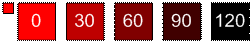

# SHADE Function

Ändert die Farbe, indem ihre Leuchtkraft um den im  _int-Parameter_ angegebenen Wert (positiv oder negativ) verringert wird. 
  
## Syntax

SHADE(** *color* **, ** *int* ** ) 
  
### Parameter

|**Name**|**Erforderlich/Optional**|**Datentyp**|**Beschreibung**|
|:-----|:-----|:-----|:-----|
| _color_   |Erforderlich    |**Numeric**   |Der Farbindex von Microsoft Visio oder der RGB-Wert der Farbe.    |
| _int_   |Erforderlich    |**Integer**   |Der Wert, um den die Leuchtdichte der Farbe verringert werden soll. Kann positiv oder negativ sein.    |
   
### Rückgabewert

 **RGB**
  
## Hinweise

Die unteren und oberen Grenzwerte der Leuchtdichte liegen jeweils bei 0 und 240. Es gibt keine Beschränkung für die Größe der ganzen Zahl, die Sie für den  _int-Parameter_ übergeben können, aber die Leuchtkraft überschreitet diese Grenzwerte nie. 
  

  

