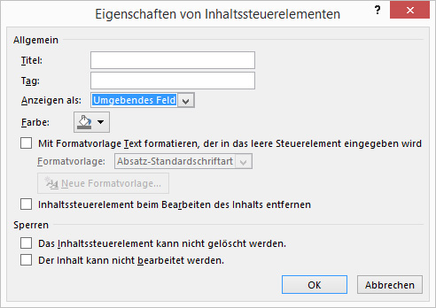
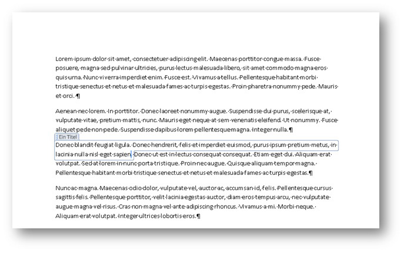
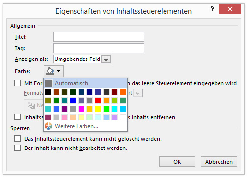
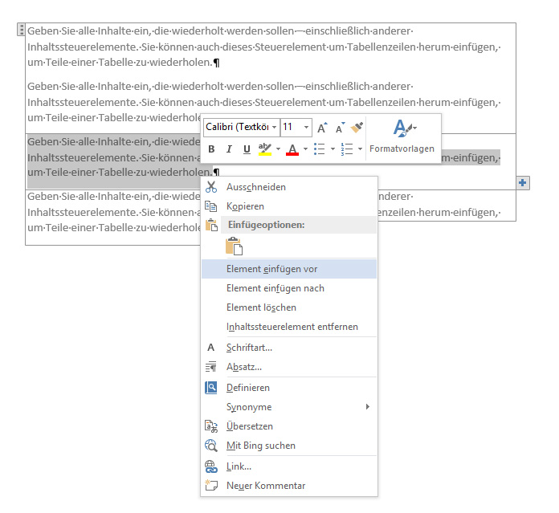
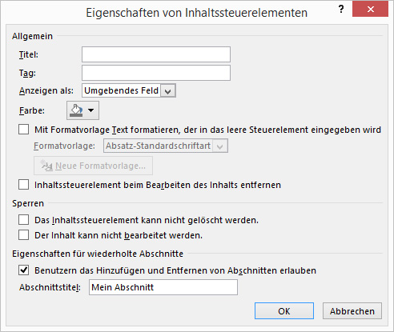
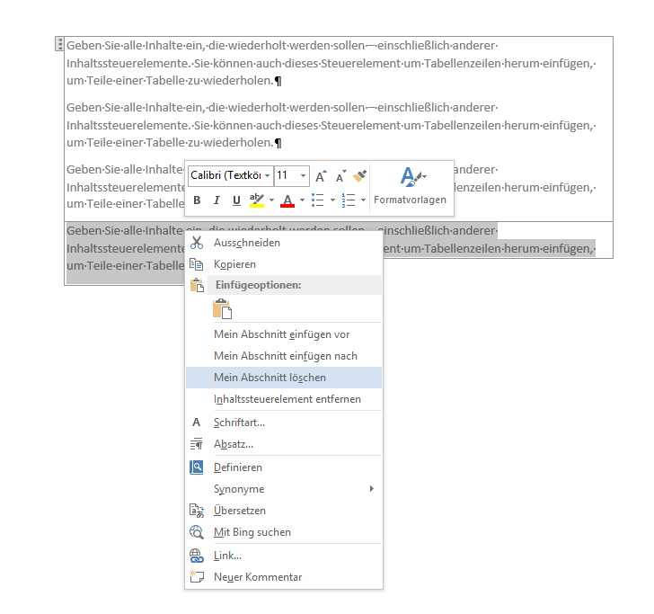
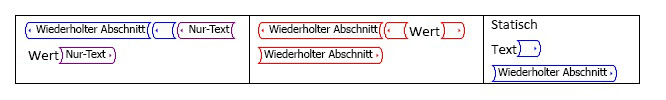
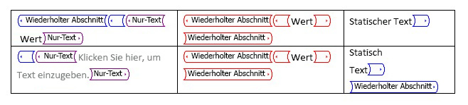

# <a name="content-controls-in-word"></a><span data-ttu-id="d3f6f-104">Inhaltssteuerelemente in Word</span><span class="sxs-lookup"><span data-stu-id="d3f6f-104">Content controls in Word</span></span>

<span data-ttu-id="d3f6f-105">Erfahren Sie, wie Microsoft Word 2013-Inhaltssteuerelemente eine größere Palette von strukturierten Dokumentszenarien ermöglichen.</span><span class="sxs-lookup"><span data-stu-id="d3f6f-105">Learn how wd15long content controls enable a larger range of structured document scenarios.</span></span>

<span data-ttu-id="d3f6f-106">Dieses Thema enthält Informationen zu Änderungen an Inhaltssteuerelementen in Microsoft Word 2013 und zu den Dokumentszenarien, die durch diese Änderungen ermöglicht werden.</span><span class="sxs-lookup"><span data-stu-id="d3f6f-106">This topic provides information about changes to content controls in wd15long and the document scenarios that those changes enable.</span></span>
  
### <a name="structured-documents"></a><span data-ttu-id="d3f6f-107">Strukturierte Dokumente</span><span class="sxs-lookup"><span data-stu-id="d3f6f-107">Structured documents</span></span>
<span data-ttu-id="d3f6f-108"><a name="WordCC_StructuredDocs"> </a></span><span class="sxs-lookup"><span data-stu-id="d3f6f-108"></span></span>

<span data-ttu-id="d3f6f-109">Strukturierte Dokumente sind Dokumente, die steuern, an welchen Stellen welche Art von Inhalten in einem Dokument angezeigt und ob Inhalte bearbeitet werden können.</span><span class="sxs-lookup"><span data-stu-id="d3f6f-109">Structured documents are documents that control where content can appear on a document, what kind of content can appear in the document, and whether that content can be edited.</span></span>
  
<span data-ttu-id="d3f6f-110">Im Folgenden finden Sie einige typische Szenarien für strukturierte Inhalte in Microsoft Word:</span><span class="sxs-lookup"><span data-stu-id="d3f6f-110">Here are some common scenarios for structured content in wordnv1:</span></span>
  
- <span data-ttu-id="d3f6f-111">Eine Anwaltskanzlei muss Dokumente erstellen, die juristische Fachsprache enthalten, die nicht vom Benutzer geändert werden sollte.</span><span class="sxs-lookup"><span data-stu-id="d3f6f-111">A legal firm needs to create documents that contain legal language that should not be changed by the user.</span></span>
    
- <span data-ttu-id="d3f6f-112">Ein Unternehmen muss ein Deckblatt für ein Angebot erstellen, in dem nur der Titel, der Autor und das Datum vom Benutzer eingegeben werden.</span><span class="sxs-lookup"><span data-stu-id="d3f6f-112">A business needs to create a proposal cover page where only the title, author, and date are entered by the user.</span></span>
    
- <span data-ttu-id="d3f6f-113">Ein Unternehmen muss Rechnungen erstellen, in denen die Kundendaten in vordefinierten Bereichen der Rechnung enthalten sind.</span><span class="sxs-lookup"><span data-stu-id="d3f6f-113">A business needs to create invoices where the customer data is included in the invoice at predefined regions.</span></span>
    
### <a name="using-content-controls-to-structure-a-document"></a><span data-ttu-id="d3f6f-114">Verwenden von Inhaltssteuerelementen zum Strukturieren eines Dokuments</span><span class="sxs-lookup"><span data-stu-id="d3f6f-114">Using content controls to structure a document</span></span>
<span data-ttu-id="d3f6f-115"><a name="WordCC_StructuredDocs"> </a></span><span class="sxs-lookup"><span data-stu-id="d3f6f-115"></span></span>

<span data-ttu-id="d3f6f-116">Inhaltssteuerelemente sind Microsoft Word-Einheiten, die als Container für bestimmte Inhalte in einem Dokument dienen.</span><span class="sxs-lookup"><span data-stu-id="d3f6f-116">Content controls are Microsoft Word entities that act as containers for specific content in a document.</span></span> <span data-ttu-id="d3f6f-117">Einzelne Inhaltssteuerelemente können Inhalte wie Datumsangaben, Listen oder Absätze mit formatiertem Text enthalten.</span><span class="sxs-lookup"><span data-stu-id="d3f6f-117">Individual content controls can contain content such as dates, lists, or paragraphs of formatted text.</span></span> <span data-ttu-id="d3f6f-118">Inhaltssteuerelemente helfen Ihnen, umfassende strukturierte Inhaltsblöcke zu erstellen und sind für die Verwendung in Vorlagen vorgesehen, die fest umrissene Blöcke in Ihre Dokumente einfügen und so strukturierte Dokumente erstellen.</span><span class="sxs-lookup"><span data-stu-id="d3f6f-118">Content controls are wordnv1 entities that act as containers for specific content in a document. Individual content controls can contain content such as dates, lists, or paragraphs of formatted text. Content controls help you to create rich, structured blocks of content and are designed for use in templates that insert well-defined blocks into your documents, creating structured documents.</span></span>
  
<span data-ttu-id="d3f6f-119">Inhaltssteuerelemente sind ideal für das Erstellen strukturierter Dokumente geeignet, da sie Sie dabei unterstützen, die Position von Inhalten festzulegen, die Art von Inhalten anzugeben (z. B. ein Datum, ein Bild oder Text), die Bearbeitung einzuschränken oder zu ermöglichen und Inhalten eine semantische Bedeutung hinzuzufügen.</span><span class="sxs-lookup"><span data-stu-id="d3f6f-119">Content controls are ideal for creating structured documents because content controls help you fix the position of content, specify the kind of content (for example, a date, a picture, or text), restrict or enable editing, and add semantic meaning to content.</span></span>
  
### <a name="content-controls-in-word-2010"></a><span data-ttu-id="d3f6f-120">Inhaltssteuerelemente in Word 2010</span><span class="sxs-lookup"><span data-stu-id="d3f6f-120">Content controls in Word</span></span>
<span data-ttu-id="d3f6f-121"><a name="WordCC_StructuredDocs"> </a></span><span class="sxs-lookup"><span data-stu-id="d3f6f-121"></span></span>

<span data-ttu-id="d3f6f-122">Die folgenden Inhaltssteuerelemente stehen in Word 2010 zur Verfügung:</span><span class="sxs-lookup"><span data-stu-id="d3f6f-122">The following content controls are available in wd14short:</span></span>
  
- <span data-ttu-id="d3f6f-123">Rich-Text</span><span class="sxs-lookup"><span data-stu-id="d3f6f-123">Rich Text</span></span>
    
- <span data-ttu-id="d3f6f-124">Nur-Text</span><span class="sxs-lookup"><span data-stu-id="d3f6f-124">Plain Text</span></span>
    
- <span data-ttu-id="d3f6f-125">Bild</span><span class="sxs-lookup"><span data-stu-id="d3f6f-125">Picture</span></span>
    
- <span data-ttu-id="d3f6f-126">Bausteinkatalog</span><span class="sxs-lookup"><span data-stu-id="d3f6f-126">Building Block Gallery</span></span>
    
- <span data-ttu-id="d3f6f-127">Kombinationsfeld</span><span class="sxs-lookup"><span data-stu-id="d3f6f-127">Combo Box</span></span>
    
- <span data-ttu-id="d3f6f-128">Dropdownliste</span><span class="sxs-lookup"><span data-stu-id="d3f6f-128">Drop-Down List</span></span>
    
- <span data-ttu-id="d3f6f-129">Datum</span><span class="sxs-lookup"><span data-stu-id="d3f6f-129">Date</span></span>
    
- <span data-ttu-id="d3f6f-130">Kontrollkästchen</span><span class="sxs-lookup"><span data-stu-id="d3f6f-130">Checkbox</span></span>
    
- <span data-ttu-id="d3f6f-131">Gruppe</span><span class="sxs-lookup"><span data-stu-id="d3f6f-131">Group</span></span>
    
<span data-ttu-id="d3f6f-132">Word 2010-Inhaltssteuerelemente ermöglichen verschiedene potenzielle strukturierte Dokumentlösungen, aber mit den Inhaltssteuerelementen in Word 2013 ist eine breitere Palette an Szenarien möglich.</span><span class="sxs-lookup"><span data-stu-id="d3f6f-132">wd14short content controls enable various potential structured document solutions, but in wd15short content controls enable a greater range of scenarios.</span></span>
  
## <a name="content-control-improvements-in-word-2013"></a><span data-ttu-id="d3f6f-133">Verbesserungen bei den Inhaltssteuerelementen in Word 2013</span><span class="sxs-lookup"><span data-stu-id="d3f6f-133">Content control improvements in Word 2013</span></span>
<span data-ttu-id="d3f6f-134"><a name="WordCC_WhatsNew"> </a></span><span class="sxs-lookup"><span data-stu-id="d3f6f-134"></span></span>

<span data-ttu-id="d3f6f-135">In Word 2013 werden drei wesentliche Verbesserungen für Inhaltssteuerelemente bereitgestellt: verbesserte Visualisierung, Unterstützung für die XML-Zuordnung für Rich-Text-Inhaltssteuerelemente und ein neues Inhaltssteuerelement für wiederholte Inhalte.</span><span class="sxs-lookup"><span data-stu-id="d3f6f-135">In wd15short, content controls provide three key improvements: improved visualization, support for XML Mapping for Rich Text content controls, and a new content control for repeating content.</span></span>
  
### <a name="improved-visualization"></a><span data-ttu-id="d3f6f-136">Verbesserte Visualisierung</span><span class="sxs-lookup"><span data-stu-id="d3f6f-136">Improved visualization</span></span>

<span data-ttu-id="d3f6f-137">In Word 2013 kann ein einzelnes Inhaltssteuerelement in einem von drei möglichen Zuständen angezeigt werden:</span><span class="sxs-lookup"><span data-stu-id="d3f6f-137">wd15short allows an individual content control to appear in one of three possible states:</span></span>
  
- <span data-ttu-id="d3f6f-138">Umgebendes Feld</span><span class="sxs-lookup"><span data-stu-id="d3f6f-138">Bounding box</span></span>
    
- <span data-ttu-id="d3f6f-139">Start/Ende-Tags</span><span class="sxs-lookup"><span data-stu-id="d3f6f-139">Start/End tags</span></span>
    
- <span data-ttu-id="d3f6f-140">Keine</span><span class="sxs-lookup"><span data-stu-id="d3f6f-140">None</span></span>
    
> [!NOTE]
> <span data-ttu-id="d3f6f-141">Wenn nicht anders angegeben, gilt für die Darstellung der Visualisierung von Inhaltssteuerelementen in diesem Abschnitt, dass das Dokument nicht im **Entwurfsmodus** angezeigt wird. Sie legen den Anzeigemodus für ein Inhaltssteuerelement über das Dropdownlisten-Steuerelement **Anzeigen als** im Dialogfeld **Eigenschaften von Inhaltssteuerelementen** fest.</span><span class="sxs-lookup"><span data-stu-id="d3f6f-141">If not stated otherwise, this section discusses the visualization of content controls when the document is not viewed in **Design Mode**.You set the display mode for a content control by using the **Show as** drop-down list control in the **Content Control Properties** dialog box.</span></span> 
  
<span data-ttu-id="d3f6f-142">**Abbildung 1: Das Dialogfeld "Eigenschaften von Inhaltssteuerelementen"**</span><span class="sxs-lookup"><span data-stu-id="d3f6f-142">**Figure 1. Content Control Properties dialog box**</span></span>

<span data-ttu-id="d3f6f-143"></span><span class="sxs-lookup"><span data-stu-id="d3f6f-143"></span></span>
  
<span data-ttu-id="d3f6f-144">Sie können den Anzeigemodus für ein Inhaltssteuerelement auch über das Word 2013-Objektmodell festlegen (das später unter [Neue Word 2013-Inhaltssteuerungs-Objektmodellelemente](#WordCC_NewOM) erläutert wird).</span><span class="sxs-lookup"><span data-stu-id="d3f6f-144">You can also set the display mode for a content control by using the wd15short object model (discussed later in New Word 2013 content control object model members).</span></span>
  
### <a name="bounding-box"></a><span data-ttu-id="d3f6f-145">Umgebendes Feld</span><span class="sxs-lookup"><span data-stu-id="d3f6f-145">Bounding box</span></span>
<span data-ttu-id="d3f6f-146"><a name="WordCC_DefaultRendering"> </a></span><span class="sxs-lookup"><span data-stu-id="d3f6f-146"></span></span>

<span data-ttu-id="d3f6f-147">Die Standardwiedergabe für Inhaltssteuerelemente in Word 2013 besteht darin, das Aussehen von Inhaltssteuerelementen wie in Word 2007 und Word 2010 beizubehalten, das heißt, sie als umgebendes Feld anzuzeigen.</span><span class="sxs-lookup"><span data-stu-id="d3f6f-147">The default rendering for content controls in wd15short is to preserve the look of content controls as they appear in Word 2007 and wd14short; that is, as a bounding box. When a content control is set to show as Bounding Box, the display changes depending upon the following user interaction:</span></span> <span data-ttu-id="d3f6f-148">Wenn die Anzeige des Inhaltssteuerelements als **Umgebenden Feld** festgelegt ist, ändert sich die Anzeige je nach folgender Benutzerinteraktion:</span><span class="sxs-lookup"><span data-stu-id="d3f6f-148">When a content control is set to show as **Bounding Box**, the display changes depending upon the following user interaction:</span></span>
  
- <span data-ttu-id="d3f6f-149">Wenn das Inhaltssteuerelement nicht im Fokus steht, findet keine Visualisierung statt.</span><span class="sxs-lookup"><span data-stu-id="d3f6f-149">When the content control does not have the focus, no visualization occurs</span></span>
    
- <span data-ttu-id="d3f6f-150">Wenn Sie den Mauszeiger über das Inhaltssteuerelement bewegen, wird es als schattiertes Rechteck angezeigt.</span><span class="sxs-lookup"><span data-stu-id="d3f6f-150">On mouse-over, the content control appears as a shaded rectangle</span></span>
    
<span data-ttu-id="d3f6f-151">**Abbildung 2: Inhaltssteuerelement, wenn der Mauszeiger darüber bewegt wird**</span><span class="sxs-lookup"><span data-stu-id="d3f6f-151">**Figure 2. Content control on mouse-over**</span></span>

<span data-ttu-id="d3f6f-152"></span><span class="sxs-lookup"><span data-stu-id="d3f6f-152"></span></span>
  
- <span data-ttu-id="d3f6f-153">Wenn das Inhaltssteuerelement im Fokus steht (wenn der Benutzer das Inhaltssteuerelement auswählt), wird das Steuerelement als „umgebendes Feld“ angezeigt (mit einer Linie um den Inhalt und angezeigtem Titel, wenn ein Titel festgelegt wurde).</span><span class="sxs-lookup"><span data-stu-id="d3f6f-153">When the content control has the focus (when the user chooses the content control), the control appears as a "bounding box" (with a line around the content and the title showing, if a title has been set)</span></span>
    
<span data-ttu-id="d3f6f-154">**Abbildung 3: Inhaltssteuerelement mit Fokus**</span><span class="sxs-lookup"><span data-stu-id="d3f6f-154">**Figure 3. Content control with focus**</span></span>

<span data-ttu-id="d3f6f-155"></span><span class="sxs-lookup"><span data-stu-id="d3f6f-155"></span></span>
  
### <a name="startend-tags"></a><span data-ttu-id="d3f6f-156">Start/Ende-Tags</span><span class="sxs-lookup"><span data-stu-id="d3f6f-156">Start/End tags</span></span>
<span data-ttu-id="d3f6f-157"><a name="WordCC_StartEndTags"> </a></span><span class="sxs-lookup"><span data-stu-id="d3f6f-157"></span></span>

<span data-ttu-id="d3f6f-158">Wenn die Anzeige des Inhaltssteuerelements als **Start/Ende-Tag** festgelegt ist, werden die Tags unabhängig von der Benutzerinteraktion angezeigt, und der Titel wird nicht angezeigt. Wenn Sie den Mauszeiger darüber bewegen, werden jedoch Schaltflächen, z. B. die Schaltfläche **Dropdownliste** angezeigt.</span><span class="sxs-lookup"><span data-stu-id="d3f6f-158">When the content control is set to show as **Start/End tag**, the tags are displayed regardless of user interaction, and the title never appears; but buttons, such as the **Drop-Down List** button, appear on mouse over.</span></span> 
  
<span data-ttu-id="d3f6f-159">**Abbildung 4: Anzeige von Inhaltssteuerelementen als Start/Ende-Tags**</span><span class="sxs-lookup"><span data-stu-id="d3f6f-159">**Figure 4. Content control set to show as start/end tags**</span></span>

<span data-ttu-id="d3f6f-160"></span><span class="sxs-lookup"><span data-stu-id="d3f6f-160"></span></span>
  
### <a name="none"></a><span data-ttu-id="d3f6f-161">Keine</span><span class="sxs-lookup"><span data-stu-id="d3f6f-161">None</span></span>
<span data-ttu-id="d3f6f-162"><a name="WordCC_Invisible"> </a></span><span class="sxs-lookup"><span data-stu-id="d3f6f-162"></span></span>

<span data-ttu-id="d3f6f-163">Wenn die Anzeige des Inhaltssteuerelements auf **Keine** festgelegt ist, wird das Inhaltssteuerelement nicht angezeigt.</span><span class="sxs-lookup"><span data-stu-id="d3f6f-163">When the content control is set to show as **None**, the content control is not displayed.</span></span>
  
### <a name="content-control-colorization"></a><span data-ttu-id="d3f6f-164">Farbgebung für Inhaltssteuerelemente</span><span class="sxs-lookup"><span data-stu-id="d3f6f-164">Content control colorization</span></span>
<span data-ttu-id="d3f6f-165"><a name="WordCC_CCColorization"> </a></span><span class="sxs-lookup"><span data-stu-id="d3f6f-165"></span></span>

<span data-ttu-id="d3f6f-166">Word 2013 ermöglicht nicht nur eine andere Art der Darstellung für ein Inhaltssteuerelement, sondern hilft Ihnen auch, die Farbe für ein individuelles Inhaltssteuerelement festzulegen.</span><span class="sxs-lookup"><span data-stu-id="d3f6f-166">In addition to enabling a different kind of display for a content control, wd15short also helps you to set the color for an individual content control. You set the color of a content control by using the Color button in the Content Control Properties dialog box.</span></span> <span data-ttu-id="d3f6f-167">Sie legen die Farbe eines Inhaltssteuerelements mithilfe der Schaltfläche **Farbe** im Dialogfeld **Eigenschaften von Inhaltssteuerelementen** fest.</span><span class="sxs-lookup"><span data-stu-id="d3f6f-167">In addition to enabling a different kind of display for a content control, wd15short also helps you to set the color for an individual content control. You set the color of a content control by using the **Color** button in the **Content Control Properties** dialog box.</span></span> 
  
<span data-ttu-id="d3f6f-168">Sie können die Farbe für ein Inhaltssteuerelement auch über das Word 2013-Objektmodell festlegen (das später unter [Neue Word 2013-Inhaltssteuerungs-Objektmodellelemente](#WordCC_NewOM) erläutert wird).</span><span class="sxs-lookup"><span data-stu-id="d3f6f-168">You can also set the color of a content control by using the wd15short object model (discussed later in New Word 2013 content control object model members).</span></span>
  
<span data-ttu-id="d3f6f-169">**Abbildung 5: Das Dialogfeld "Eigenschaften von Inhaltssteuerelementen"**</span><span class="sxs-lookup"><span data-stu-id="d3f6f-169">**Figure 5. Content Control Properties dialog box**</span></span>

<span data-ttu-id="d3f6f-170"></span><span class="sxs-lookup"><span data-stu-id="d3f6f-170"></span></span>
  
### <a name="support-for-xml-mapping-for-rich-text-content-controls"></a><span data-ttu-id="d3f6f-171">Unterstützung für die XML-Zuordnung für Rich-Text-Inhaltssteuerelemente</span><span class="sxs-lookup"><span data-stu-id="d3f6f-171">Support for XML mapping for rich text content controls</span></span>
<span data-ttu-id="d3f6f-172"><a name="WordCC_XMLMapping"> </a></span><span class="sxs-lookup"><span data-stu-id="d3f6f-172"></span></span>

<span data-ttu-id="d3f6f-173">Word 2013 unterstützt Sie dabei, den Inhalt von Rich-Text-Inhaltssteuerelementen und Dokumentbaustein-Inhaltssteuerelementen dem XML-Datenspeicher zuzuordnen.</span><span class="sxs-lookup"><span data-stu-id="d3f6f-173">Word 2013 helps you to map the content of rich text content controls and document building block content controls to the XML data store.</span></span> <span data-ttu-id="d3f6f-174">Dafür legen Sie die *XML-Zuordnung* für das Inhaltssteuerelement fest.</span><span class="sxs-lookup"><span data-stu-id="d3f6f-174">To do this, you set the  *XML mapping*  for the content control.</span></span> <span data-ttu-id="d3f6f-175">Sie können diese Eigenschaft durch Verwenden der vorhandenen **XMLMapping.SetMapping**-Methode im Objektmodell festlegen.</span><span class="sxs-lookup"><span data-stu-id="d3f6f-175">You can set this property by using the existing **XMLMapping.SetMapping** method in the object model.</span></span> <span data-ttu-id="d3f6f-176">In der benutzerdefinierten XML-Komponente wird der benutzerdefinierte XML-Code als flaches Open XML-Markup gespeichert, das in eine Zeichenfolge konvertiert wird (mithilfe der Standard-XML-Codierung), damit es als Textknoten in der benutzerdefinierten XML-Komponente gespeichert werden kann.</span><span class="sxs-lookup"><span data-stu-id="d3f6f-176">Within the custom XML part, the custom XML is stored as flat Open XML markup converted into a string (by using standard XML encoding), so that it can be stored as a text node in the custom XML part.</span></span> <span data-ttu-id="d3f6f-177">Die Zuordnung unterliegt jedoch weiterhin der Einschränkung, dass die Zuordnung nur zu Blattknoten und Attributen erfolgreich durchgeführt werden kann.</span><span class="sxs-lookup"><span data-stu-id="d3f6f-177">However, the mapping continues to have the limitation that it can only successfully map to leaf nodes or attributes.</span></span> 
  
> [!NOTE]
> <span data-ttu-id="d3f6f-p105">Rich-Text-Inhaltssteuerelemente können keine anderen Rich-Text-Inhaltssteuerelemente enthalten. Wenn eins in einem anderen vorhanden ist (z. B. aufgrund von Dateiformatänderungen, Kopieren und Einfügen usw.), wird das Steuerelement getrennt, bis es nicht mehr in einem zugeordneten Rich-Text-Steuerelement enthalten ist.</span><span class="sxs-lookup"><span data-stu-id="d3f6f-p105">Rich text content controls cannot contain other rich text content controls. If one exists inside of another (for example, because of file format manipulation, copy and paste, and so on), it is unlinked until it is no longer contained inside a mapped rich text control.</span></span> 
  
<span data-ttu-id="d3f6f-180">Weitere Informationen zum Einrichten der XML-Zuordnung finden Sie im Abschnitt  [Neue Word 2013-Inhaltssteuerelement-Objektmodellelemente](#WordCC_NewOM) weiter unten in diesem Thema.</span><span class="sxs-lookup"><span data-stu-id="d3f6f-180">For more information about how to set up XML mapping, see the section [New Word 2013 content control object model members](#WordCC_NewOM) later in this topic.</span></span> 
  
### <a name="supporting-repeating-content"></a><span data-ttu-id="d3f6f-181">Unterstützung für wiederholte Inhalte</span><span class="sxs-lookup"><span data-stu-id="d3f6f-181">Supporting repeating content</span></span>
<span data-ttu-id="d3f6f-182"><a name="WordCC_SupportingRepeating"> </a></span><span class="sxs-lookup"><span data-stu-id="d3f6f-182"></span></span>

<span data-ttu-id="d3f6f-183">Zusätzlich zu den Verbesserungen bei der Visualisierung und der Unterstützung für die XML-Zuordnung zu Rich-Text-Inhaltssteuerelementen bietet Word 2013 auch ein neues Inhaltssteuerelement, mit dem Sie Inhalte wiederholen können.</span><span class="sxs-lookup"><span data-stu-id="d3f6f-183">In addition to visualization enhancements and support for XML mapping to rich text content controls, wd15short also adds a new content control that enables you to repeat content. The repeating section content control repeats the content contained within it, including other content controls.</span></span> <span data-ttu-id="d3f6f-184">Das Steuerelement für wiederkehrende Abschnittsinhalte wiederholt den darin enthaltenen Inhalt, einschließlich anderer Inhaltssteuerelemente.</span><span class="sxs-lookup"><span data-stu-id="d3f6f-184">The repeating section content control repeats the content contained within it, including other content controls.</span></span>
  
<span data-ttu-id="d3f6f-p107">Sie fügen das Steuerelement für wiederkehrende Abschnittsinhalte um ganze Absätze oder Tabellenzeilen ein. Nachdem das Steuerelement einen Abschnitt umgibt, können Sie Kopien des Abschnitts über oder unter dem enthaltenen Abschnitt einfügen.</span><span class="sxs-lookup"><span data-stu-id="d3f6f-p107">You insert the repeating section content control around entire paragraphs or table rows. Once the control surrounds a section, you can insert copies of the section above or below the contained section.</span></span>
  
<span data-ttu-id="d3f6f-187">**Abbildung 6: Kontextmenü des Steuerelements für wiederkehrende Abschnittsinhalte**</span><span class="sxs-lookup"><span data-stu-id="d3f6f-187">**Figure 6. Repeating section content control context menu**</span></span>

<span data-ttu-id="d3f6f-188"></span><span class="sxs-lookup"><span data-stu-id="d3f6f-188"></span></span>
  
<span data-ttu-id="d3f6f-189">Sie können den eingefügten Abschnitt wiederholen, indem Sie entweder das Steuerelement am Ende des Inhaltssteuerelements verwenden (angezeigt als Schaltfläche mit einem Pluszeichen ()) oder indem Sie einen Befehl im Kontextmenü auswählen, wie in Abbildung 6 gezeigt.</span><span class="sxs-lookup"><span data-stu-id="d3f6f-189">You can repeat the inserted section by using either the control on the end of the content control (displayed as a button with a plus sign (  )) or by choosing a command on the context menu, as shown in Figure 6. The repeated content becomes a separate section of the control that you can assign a title by using the Content Control Properties dialog box.</span></span> <span data-ttu-id="d3f6f-190">Der wiederkehrende Inhalt wird zu einem separaten Abschnitt des Steuerelements, dem Sie über das Dialogfeld **Eigenschaften von Inhaltssteuerelementen** einen Titel zuweisen können.</span><span class="sxs-lookup"><span data-stu-id="d3f6f-190">The repeated content becomes a separate section of the control that you can assign a title by using the **Content Control Properties** dialog box.</span></span> 
  
<span data-ttu-id="d3f6f-191">**Abbildung 7: Zuweisen eines Abschnittstitels im Dialogfeld "Eigenschaften von Inhaltssteuerelementen"**</span><span class="sxs-lookup"><span data-stu-id="d3f6f-191">**Figure 7. Assign a section title in the Content Control Properties dialog box**</span></span>

<span data-ttu-id="d3f6f-192"></span><span class="sxs-lookup"><span data-stu-id="d3f6f-192"></span></span>
  
<span data-ttu-id="d3f6f-193">Nachdem Sie dem Abschnitt einen Titel gegeben haben, können Benutzer den Abschnitt nach Namen hinzufügen oder löschen, wenn Sie die Option **Benutzern das Hinzufügen und Entfernen von Abschnitten erlauben** im Dialogfeld **Eigenschaften von Inhaltssteuerelementen** auswählen.</span><span class="sxs-lookup"><span data-stu-id="d3f6f-193">Once you have given the section a title, if you select **Allow users to add and remove sections** in the **Content Control Properties** dialog box, users can add or delete the section by name.</span></span> 
  
<span data-ttu-id="d3f6f-194">**Abbildung 8: Verwenden des Kontextmenüs des Steuerelements für wiederkehrende Abschnittsinhalte zum Löschen eines Abschnitts**</span><span class="sxs-lookup"><span data-stu-id="d3f6f-194">**Figure 8. Use the repeating section content control context menu to delete a section**</span></span>

<span data-ttu-id="d3f6f-195"></span><span class="sxs-lookup"><span data-stu-id="d3f6f-195"></span></span>
  
<span data-ttu-id="d3f6f-p109">Wenn ein wiederkehrender Abschnitt andere Inhaltssteuerelemente umgibt, werden die eingeschlossenen Inhaltssteuerelemente in jedem neuen Element wiederholt. Allerdings werden bei solchen Inhaltssteuerelementen die Inhalte auf Platzhaltertext zurückgesetzt. Es gibt zwei Ausnahmen, bei denen untergeordnete Steuerelementinhalte beibehalten werden:</span><span class="sxs-lookup"><span data-stu-id="d3f6f-p109">When a repeating section content control surrounds other content controls, the enclosed content controls are repeated in each new item; but any such content controls have their contents reset to placeholder text. There are two exceptions where child control contents are preserved:</span></span> 
  
- <span data-ttu-id="d3f6f-198">Wenn ein untergeordnetes Steuerelement ein Steuerelement für wiederkehrende Abschnitte ist.</span><span class="sxs-lookup"><span data-stu-id="d3f6f-198">When a child control is a repeating section control.</span></span>
    
- <span data-ttu-id="d3f6f-199">Wenn ein untergeordnetes Steuerelement per XML einem Knoten außerhalb des Steuerelements für wiederkehrende Abschnittsinhalte zugeordnet ist.</span><span class="sxs-lookup"><span data-stu-id="d3f6f-199">When a child control is XML-mapped to a node outside the repeating section content control.</span></span>
    
<span data-ttu-id="d3f6f-200">**Abbildung 9: Steuerelement für wiederkehrende Abschnittsinhalte mit untergeordneten Steuerelementen vor Wiederholung**</span><span class="sxs-lookup"><span data-stu-id="d3f6f-200">**Figure 9. Repeating section content control containing child controls before repeat**</span></span>

<span data-ttu-id="d3f6f-201"></span><span class="sxs-lookup"><span data-stu-id="d3f6f-201"></span></span>
  
<span data-ttu-id="d3f6f-202">**Abbildung 10: Steuerelement für wiederkehrende Abschnittsinhalte mit untergeordneten Steuerelementen nach Wiederholung**</span><span class="sxs-lookup"><span data-stu-id="d3f6f-202">**Figure 10. Repeating section content control containing child controls after repeat**</span></span>

<span data-ttu-id="d3f6f-203"></span><span class="sxs-lookup"><span data-stu-id="d3f6f-203"></span></span>
  
### <a name="repeating-section-content-controls-around-xml-mapped-controls"></a><span data-ttu-id="d3f6f-204">Steuerelemente für wiederkehrende Abschnittsinhalte rund um per XML zugeordnete Steuerelemente</span><span class="sxs-lookup"><span data-stu-id="d3f6f-204">Repeating section content controls around XML-mapped controls</span></span>
<span data-ttu-id="d3f6f-205"><a name="WordCC_RepeatingSectionCCs"> </a></span><span class="sxs-lookup"><span data-stu-id="d3f6f-205"></span></span>

<span data-ttu-id="d3f6f-206">XML-Zuordnungen, die in einem wiederholten Abschnitt enthalten sind, werden von Word 2013 wie folgt zugeordnet.</span><span class="sxs-lookup"><span data-stu-id="d3f6f-206">For XML mappings that are contained in a repeating section, wd15short maps them as follows.</span></span>
  
<span data-ttu-id="d3f6f-207">Wenn sich die Zuordnung nicht mit einem Element in dem Knoten überschneidet, der als Teil seiner übergeordneten Kette festgelegt ist, ist die Bindung eine "absolute Bindung" und zeigt denselben Inhalt in allen wiederholten Abschnittsinhalten an.</span><span class="sxs-lookup"><span data-stu-id="d3f6f-207">If the mapping does not intersect with an item in the node set as part of its parent chain, the binding is an “absolute binding” and shows the same content in all repeating section items.</span></span>
  
<span data-ttu-id="d3f6f-208">Wenn sich die Zuordnung mit einem Element in dem Knoten überschneidet, der als Teil seiner übergeordneten Kette festgelegt ist, ist die Bindung eine "relative Bindung" und wird wie folgt erneut zugeordnet:</span><span class="sxs-lookup"><span data-stu-id="d3f6f-208">If the mapping does intersect with an item in the node set as part of its parent chain, the binding is a “relative binding”, and is remapped as follows:</span></span>
  
- <span data-ttu-id="d3f6f-209">Die absolute Bindung für den Knoten wird bestimmt (dabei werden alle Abfrageausdrücke vereinfacht) – dies sollte bei der anfänglichen Zuordnung stattfinden.</span><span class="sxs-lookup"><span data-stu-id="d3f6f-209">The absolute binding for the node is determined (flattening out any query expressions)─this should happen on initial mapping</span></span>
    
- <span data-ttu-id="d3f6f-210">Die Achse der Bindung, die sich mit dem festgelegten Knoten überschneidet, wird entfernt.</span><span class="sxs-lookup"><span data-stu-id="d3f6f-210">The axis of the binding that intersects with the node set is removed</span></span>
    
- <span data-ttu-id="d3f6f-211">Der restliche Teil des XPath-Ausdrucks wird relativ zum XPath des wiederholten Abschnittsinhaltselements ausgewertet.</span><span class="sxs-lookup"><span data-stu-id="d3f6f-211">The remainder of the XPath is evaluated relative to the XPath of the repeating section content item</span></span>
    
<span data-ttu-id="d3f6f-212">Beispielsweise könnten die folgenden Zuordnungen auftreten:</span><span class="sxs-lookup"><span data-stu-id="d3f6f-212">For example, the following mappings might occur:</span></span>
  
- <span data-ttu-id="d3f6f-213">Der wiederholte Abschnitt wird \root\next\path zugeordnet.</span><span class="sxs-lookup"><span data-stu-id="d3f6f-213">The repeating section is mapped to \root\next\path</span></span>
    
- <span data-ttu-id="d3f6f-214">Das Steuerelement im Beispielelement wird \root\next\path[2]\baz zugeordnet.</span><span class="sxs-lookup"><span data-stu-id="d3f6f-214">The control in the sample item is mapped to \root\next\path[2]\baz</span></span>
    
- <span data-ttu-id="d3f6f-215">Word ordnet \root\next\path[2] einem Element im Knotensatz zu.</span><span class="sxs-lookup"><span data-stu-id="d3f6f-215">Word matches \root\next\path[2] to an item in the node set</span></span>
    
<span data-ttu-id="d3f6f-216">Die Bindung wird daher als .\baz ausgewertet, wobei die Basis der Knoten des wiederholten Inhaltselements ist.</span><span class="sxs-lookup"><span data-stu-id="d3f6f-216">The binding is therefore evaluated as .\baz, where the base is the node of the repeating content item.</span></span>
  
<span data-ttu-id="d3f6f-217">Die folgenden Vorschläge für das Arbeiten mit Steuerelementen für wiederkehrende Inhalte können dazu beitragen, Datenverluste und Frustration zu vermeiden.</span><span class="sxs-lookup"><span data-stu-id="d3f6f-217">The following suggestions for working with repeating content controls can help you prevent data loss and avoid frustration.</span></span>
  
### <a name="working-with-repeating-section-content-controls-that-are-mapped-to-xml-data"></a><span data-ttu-id="d3f6f-218">Arbeiten mit Steuerelementen für wiederkehrende Abschnittsinhalte, die XML-Daten zugeordnet sind</span><span class="sxs-lookup"><span data-stu-id="d3f6f-218">Working with repeating section content controls that are mapped to XML data</span></span>
<span data-ttu-id="d3f6f-219"><a name="WordCC_RepeatingSectionCCs"> </a></span><span class="sxs-lookup"><span data-stu-id="d3f6f-219"></span></span>

<span data-ttu-id="d3f6f-220">Wenn Sie ein Steuerelement für wiederkehrende Abschnittsinhalte einfügen, das XML-Daten zugeordnet ist, erstellt Word jedes Mal, wenn der Benutzer das Dokument neu öffnet, die wiederholten Abschnittselemente basierend auf den Informationen im Datenspeicher neu.</span><span class="sxs-lookup"><span data-stu-id="d3f6f-220">If you insert a repeating section content control that is mapped to XML data, every time your user reopens the document, Word recreates the repeating section items, based on the information in the data store. Even if you save the document, any changes that the user makes in the repeating section items in the document that aren’t also mapped into the data store are lost.</span></span> <span data-ttu-id="d3f6f-221">Selbst wenn Sie das Dokument speichern, gehen alle Änderungen, die der Benutzer in den wiederholten Abschnittselementen im Dokument vornimmt, die nicht auch im Datenspeicher zugeordnet sind, verloren.</span><span class="sxs-lookup"><span data-stu-id="d3f6f-221">If you insert a repeating section content control that is mapped to XML data, every time your user reopens the document, Word recreates the repeating section items, based on the information in the data store. Even if you save the document, any changes that the user makes in the repeating section items in the document that aren’t also mapped into the data store are lost.</span></span>
  
<span data-ttu-id="d3f6f-222">Um dies zu verhindern, sollten Sie das Steuerelement für wiederkehrende Abschnittsinhalte sperren und für den Benutzer nur das Bearbeiten in nicht gesperrten untergeordneten Inhaltssteuerelementen erlauben, die ebenfalls dem XML-Code zugeordnet sind.</span><span class="sxs-lookup"><span data-stu-id="d3f6f-222">To help prevent this from happening, lock the repeating section content control and allow the user to edit only in unlocked child content controls that are mapped to the XML as well.</span></span>
  
### <a name="binding-a-repeating-section-content-control-to-a-table"></a><span data-ttu-id="d3f6f-223">Binden eines Steuerelements für wiederkehrende Abschnittsinhalte zu einer Tabelle</span><span class="sxs-lookup"><span data-stu-id="d3f6f-223">Binding a repeating section content control to a table</span></span>
<span data-ttu-id="d3f6f-224"><a name="WordCC_RepeatingSectionCCs"> </a></span><span class="sxs-lookup"><span data-stu-id="d3f6f-224"></span></span>

<span data-ttu-id="d3f6f-225">Wenn Sie ein Steuerelement für wiederkehrende Abschnittsinhalte zu einer Tabelle binden möchten, fügen Sie die Tabelle und *dann* das Steuerelement für wiederkehrende Abschnittsinhalte ein, nicht umgekehrt.</span><span class="sxs-lookup"><span data-stu-id="d3f6f-225">If you want to bind a repeating section content control to a table, insert the table and *then* the insert repeating section content control, and not the other way around. (Otherwise, you won’t be able to select only the table).</span></span> <span data-ttu-id="d3f6f-226">(Andernfalls können Sie nicht nur die Tabelle auswählen).</span><span class="sxs-lookup"><span data-stu-id="d3f6f-226">(Otherwise, you won't be able to select only the table).</span></span> 
  
### <a name="nesting-repeating-section-content-controls-within-a-table"></a><span data-ttu-id="d3f6f-227">Schachtelung von Steuerelementen für wiederkehrende Abschnittsinhalte innerhalb einer Tabelle</span><span class="sxs-lookup"><span data-stu-id="d3f6f-227">Nesting repeating section content controls within a table</span></span>
<span data-ttu-id="d3f6f-228"><a name="WordCC_RepeatingSectionCCs"> </a></span><span class="sxs-lookup"><span data-stu-id="d3f6f-228"></span></span>

<span data-ttu-id="d3f6f-229">Das Schachteln von Steuerelementen für wiederkehrende Abschnittsinhalte innerhalb einer Tabelle (wenn sich beispielsweise das Ende des übergeordneten und des untergeordneten Steuerelements für wiederkehrende Abschnittsinhalte in derselben Zelle befindet) bewirkt, dass der äußere wiederholte Abschnitt gelöscht wird, wenn dem inneren Abschnitt ein Element hinzugefügt oder ein Element daraus entfernt wird.</span><span class="sxs-lookup"><span data-stu-id="d3f6f-229">Nesting repeating section content controls tightly within a table (for example, when the end of the parent and child repeating section content control is in the same cell) causes the outer repeating section to be deleted when the inner section has an item added or removed.</span></span>
  
<span data-ttu-id="d3f6f-p112">Sie können dies verhindern, indem Sie eine Absatzmarkierung zwischen dem Ende eines Steuerelements für wiederkehrende Abschnittsinhalte und dem nächsten hinzufügen. Zum Ausblenden der Absatzmarkierung deaktivieren Sie auf der Registerkarte **Start** des Menübands die Option **Ein-/Ausblenden**.</span><span class="sxs-lookup"><span data-stu-id="d3f6f-p112">You can prevent this from happening by adding a paragraph marker between the end of one repeating section content control and the next. To hide the paragraph marker, deselect the **Show/Hide** option on the **Home** tab of the ribbon.</span></span> 
  
### <a name="open-xml-file-format-schema-additions"></a><span data-ttu-id="d3f6f-232">Erweiterungen für das Open XML-Dateiformatschema</span><span class="sxs-lookup"><span data-stu-id="d3f6f-232">Open XML File Format schema additions</span></span>
<span data-ttu-id="d3f6f-233"><a name="WordCC"> </a></span><span class="sxs-lookup"><span data-stu-id="d3f6f-233"></span></span>

<span data-ttu-id="d3f6f-234">Die folgenden Elemente wurden zum Open XML-WordprocessingML-Dateiformatschema hinzugefügt.</span><span class="sxs-lookup"><span data-stu-id="d3f6f-234">The following elements were added to the WordprocessingML Open XML File Format schema.</span></span>
  
<span data-ttu-id="d3f6f-235">**Tabelle 1: Neue Elemente im Open XML-WordprocessingML-Dateiformatschema für Inhaltssteuerelemente**</span><span class="sxs-lookup"><span data-stu-id="d3f6f-235">**Table 1. New elements in the WordprocessingML Open XML File Format schema for content controls**</span></span>

|<span data-ttu-id="d3f6f-236">**Element**</span><span class="sxs-lookup"><span data-stu-id="d3f6f-236">**Element**</span></span>|<span data-ttu-id="d3f6f-237">**Beschreibung**</span><span class="sxs-lookup"><span data-stu-id="d3f6f-237">**Description**</span></span>|
|:-----|:-----|
|<span data-ttu-id="d3f6f-238">\<w:appearance\></span><span class="sxs-lookup"><span data-stu-id="d3f6f-238"><w:appearance></span></span>  <br/> |<span data-ttu-id="d3f6f-239">\<w:appearance\> ist ein untergeordnetes Element von \<w:sdtPr\>.</span><span class="sxs-lookup"><span data-stu-id="d3f6f-239"><w:appearance> is a child element of <w:sdtPr>.</span></span>  <br/> <span data-ttu-id="d3f6f-240">Die folgenden Werte sind für das val-Attribut gültig:</span><span class="sxs-lookup"><span data-stu-id="d3f6f-240">The following values are valid for the val attribute:</span></span>  <br/> <span data-ttu-id="d3f6f-241">\<w:appearance val= boundingBox</span><span class="sxs-lookup"><span data-stu-id="d3f6f-241">\<w:appearance val= boundingBox</span></span>|<span data-ttu-id="d3f6f-242">tags</span><span class="sxs-lookup"><span data-stu-id="d3f6f-242">tags</span></span>|<span data-ttu-id="d3f6f-243">hidden.</span><span class="sxs-lookup"><span data-stu-id="d3f6f-243">hidden</span></span>  <br/> <span data-ttu-id="d3f6f-244">Der Standardwert ist boundingBox.</span><span class="sxs-lookup"><span data-stu-id="d3f6f-244">The default value is boundingBox.</span></span>  <br/> |
|<span data-ttu-id="d3f6f-245">\<w:color\></span><span class="sxs-lookup"><span data-stu-id="d3f6f-245"><w:color></span></span>  <br/> |<span data-ttu-id="d3f6f-246">\<w:color\> ist ein untergeordnetes Element von \<w:sdtPr\>.</span><span class="sxs-lookup"><span data-stu-id="d3f6f-246"><w:color> is a child element of <w:sdtPr>.</span></span>  <br/> <span data-ttu-id="d3f6f-p113">Das Inhaltsmodell stimmt mit dem vorhandenen komplexen CT_Color-Typ überein. Der Standardwert ist die in Word 2010 verwendete Farbe.</span><span class="sxs-lookup"><span data-stu-id="d3f6f-p113">The content model matches the existing CT_Color complex type. The default value is the color used in Word 2010.</span></span>  <br/> |
   
## <a name="new-word-2013-content-control-object-model-members"></a><span data-ttu-id="d3f6f-249">Neue Word 2013-Inhaltssteuerungs-Objektmodellelemente</span><span class="sxs-lookup"><span data-stu-id="d3f6f-249">New wd15short content control object model members</span></span>
<span data-ttu-id="d3f6f-250"><a name="WordCC_NewOM"> </a></span><span class="sxs-lookup"><span data-stu-id="d3f6f-250"></span></span>

<span data-ttu-id="d3f6f-251">Mit den neuen Verbesserungen und Ergänzungen zu Inhaltssteuerelementen in Word 2013 wurde das Objektmodell für Word aktualisiert, um die programmgesteuerte Manipulation der neuen Funktionen zu ermöglichen.</span><span class="sxs-lookup"><span data-stu-id="d3f6f-251">With the new enhancements and additions to content controls in wd15short, the object model for Word has been updated to allow for programmatic manipulation of the new feature set. In addition, changes have also been made to the underlying Open XML File Format for word processing documents.</span></span> <span data-ttu-id="d3f6f-252">Darüber hinaus wurde auch das zugrunde liegende Open XML-Dateiformat für Textverarbeitungsdokumente geändert.</span><span class="sxs-lookup"><span data-stu-id="d3f6f-252">In addition, changes have also been made to the underlying Open XML File Format for word processing documents.</span></span>
  
<span data-ttu-id="d3f6f-253">In den folgenden Abschnitten finden Sie weitere Informationen zu den speziellen Objektmodelländerungen im Zusammenhang mit der jeweiligen Inhaltssteuerelementverbesserung.</span><span class="sxs-lookup"><span data-stu-id="d3f6f-253">The following sections provide more information about the specific object model changes related to each content control enhancement.</span></span>
  
### <a name="visualization-enhancements"></a><span data-ttu-id="d3f6f-254">Verbesserungen der Visualisierung</span><span class="sxs-lookup"><span data-stu-id="d3f6f-254">Visualization enhancements</span></span>
<span data-ttu-id="d3f6f-255"><a name="WordCC_VisEnhancements"> </a></span><span class="sxs-lookup"><span data-stu-id="d3f6f-255"></span></span>

<span data-ttu-id="d3f6f-256">Word 2013 beinhaltet mehrere Objektmodellergänzungen für die Verbesserung der Visualisierung von Inhaltssteuerelementen.</span><span class="sxs-lookup"><span data-stu-id="d3f6f-256">Several object model additions are included in Word 2013 for content control visualization enhancements.</span></span> <span data-ttu-id="d3f6f-257">In der folgenden Tabelle sind neue Elemente des **ContentControl**-Objekts für die Visualisierung aufgeführt.</span><span class="sxs-lookup"><span data-stu-id="d3f6f-257">Several object model additions are included in wd15short for content control visualization enhancements. The following table list new members of the **ContentControl** object for visualization.</span></span> 
  
<span data-ttu-id="d3f6f-258">**Tabelle 2: Neue ContentControl-Objektelemente**</span><span class="sxs-lookup"><span data-stu-id="d3f6f-258">**Table 2. New ContentControl object members**</span></span>

|<span data-ttu-id="d3f6f-259">**Element**</span><span class="sxs-lookup"><span data-stu-id="d3f6f-259">**Member**</span></span>|<span data-ttu-id="d3f6f-260">**Beschreibung**</span><span class="sxs-lookup"><span data-stu-id="d3f6f-260">**Description**</span></span>|
|:-----|:-----|
|<span data-ttu-id="d3f6f-261">.</span><span class="sxs-lookup"><span data-stu-id="d3f6f-261"></span></span> <span data-ttu-id="d3f6f-262">.**Appearance** als **WdContentControlAppearance**</span><span class="sxs-lookup"><span data-stu-id="d3f6f-262">.**Appearance** as **WdContentControlAppearance**</span></span> <br/> |<span data-ttu-id="d3f6f-263">Ruft die Visualisierung des Inhaltssteuerelements ab oder legt sie fest.</span><span class="sxs-lookup"><span data-stu-id="d3f6f-263">Gets or sets the visualization of the content control.</span></span>  <br/> |
|<span data-ttu-id="d3f6f-264">.</span><span class="sxs-lookup"><span data-stu-id="d3f6f-264"></span></span> <span data-ttu-id="d3f6f-265">**Color** als **WdColor**</span><span class="sxs-lookup"><span data-stu-id="d3f6f-265">.**Color** as **WdColor**</span></span> <br/> |<span data-ttu-id="d3f6f-266">Ruft die Farbe des Inhaltssteuerelements ab oder legt sie fest.</span><span class="sxs-lookup"><span data-stu-id="d3f6f-266">Gets or sets the color of the content control.</span></span>  <br/> |
   
<span data-ttu-id="d3f6f-267">In der folgenden Tabelle sind Konstanten in der neuen **WdContentControlAppearance**-Enumeration aufgeführt.</span><span class="sxs-lookup"><span data-stu-id="d3f6f-267">The following table lists constants in the new **WdContentControlAppearance** enumeration.</span></span> 
  
<span data-ttu-id="d3f6f-268">**Tabelle 3: Neue WdContentControlAppearance-Enumerationskonstanten**</span><span class="sxs-lookup"><span data-stu-id="d3f6f-268">**Table 3. New WdContentControlAppearance enumeration constants**</span></span>

|<span data-ttu-id="d3f6f-269">**Konstante**</span><span class="sxs-lookup"><span data-stu-id="d3f6f-269">**Constant**</span></span>|<span data-ttu-id="d3f6f-270">**Beschreibung**</span><span class="sxs-lookup"><span data-stu-id="d3f6f-270">**Description**</span></span>|
|:-----|:-----|
|<span data-ttu-id="d3f6f-271">**wdContentControlBoundingBox**</span><span class="sxs-lookup"><span data-stu-id="d3f6f-271">**wdContentControlBoundingBox**</span></span> <br/> |<span data-ttu-id="d3f6f-272">Stellt ein Inhaltssteuerelement dar, das als schattiertes Rechteck/umgebendes Feld angezeigt wird (mit optionalem Titel).</span><span class="sxs-lookup"><span data-stu-id="d3f6f-272">Represents a content control shown as a shaded rectangle/bounding box (with optional title).</span></span>  <br/> |
|<span data-ttu-id="d3f6f-273">**wdContentControlTags**</span><span class="sxs-lookup"><span data-stu-id="d3f6f-273">**wdContentControlTags**</span></span> <br/> |<span data-ttu-id="d3f6f-274">Stellt ein Inhaltssteuerelement dar, das als Start/Ende-Markierung angezeigt wird.</span><span class="sxs-lookup"><span data-stu-id="d3f6f-274">Represents a content control shown as start/end markers.</span></span>  <br/> |
|<span data-ttu-id="d3f6f-275">**wdContentControlHidden**</span><span class="sxs-lookup"><span data-stu-id="d3f6f-275">**wdContentControlHidden**</span></span> <br/> |<span data-ttu-id="d3f6f-276">Stellt ein Inhaltssteuerelement dar, das nicht angezeigt wird.</span><span class="sxs-lookup"><span data-stu-id="d3f6f-276">Represents a content control that is not shown.</span></span>  <br/> |
   
### <a name="code-sample"></a><span data-ttu-id="d3f6f-277">Codebeispiel</span><span class="sxs-lookup"><span data-stu-id="d3f6f-277">Code sample</span></span>
<span data-ttu-id="d3f6f-278"><a name="WordCC_VisEnhancements"> </a></span><span class="sxs-lookup"><span data-stu-id="d3f6f-278"></span></span>

<span data-ttu-id="d3f6f-279">Das folgende Codebeispiel zeigt, wie Rich-Text-Inhaltssteuerelemente erstellt werden und die Visualisierung programmgesteuert festgelegt wird.</span><span class="sxs-lookup"><span data-stu-id="d3f6f-279">The following code sample shows how to create rich text content controls and set visualization programmatically.</span></span>
  
```vb
Sub testVisualization()
   Dim objcc As ContentControl
   Dim objRange As Range
   
   ' Get the first paragraph as a range object.
   Set objRange = ActiveDocument.Paragraphs(1).Range
   ' Create a rich text content control around the first paragraph.
   Set objcc = ActiveDocument.ContentControls.Add(wdContentControlRichText, objRange)
   objcc.Title = "Default Bounding Box"
   ' Set visualization to the default.
   objcc.Appearance = wdContentControlBoundingBox
   
   ' Create a new paragraph.
   objRange.InsertParagraphAfter
   Set objRange = ActiveDocument.Paragraphs(2).Range
   ' Create a rich text content control around the second paragraph.
   Set objcc = ActiveDocument.ContentControls.Add(wdContentControlRichText, objRange)
   objcc.Title = "Non Bounding"
   ' Set visualization to invisible.
   objcc.Appearance = wdContentControlHidden
   
   ' Create a new paragraph.
   objRange.InsertParagraphAfter
   Set objRange = ActiveDocument.Paragraphs(3).Range
   ' Create a rich text content control around the third paragraph.
   Set objcc = ActiveDocument.ContentControls.Add(wdContentControlRichText, objRange)
   objcc.Title = "Tags Only with Pink color"
   ' Set visualization to Start/End tags with pink color.
   objcc.Appearance = wdContentControlTags
   objcc.Color = wdColorPink
End Sub
```

### <a name="xml-mapping"></a><span data-ttu-id="d3f6f-280">XML-Zuordnung</span><span class="sxs-lookup"><span data-stu-id="d3f6f-280">XML mapping</span></span>
<span data-ttu-id="d3f6f-281"><a name="WordCC_XMLMappingOM"> </a></span><span class="sxs-lookup"><span data-stu-id="d3f6f-281"></span></span>

<span data-ttu-id="d3f6f-282">Es wurden keine Ergänzungen am Word 2013-Objektmodell vorgenommen, um die Rich-Text-Zuordnung zu XML-Knoten im Dokumentdatenspeicher aufzunehmen.</span><span class="sxs-lookup"><span data-stu-id="d3f6f-282">No additions were made to the Word 2013 object model to accommodate rich text mapping to XML nodes in the document data store.</span></span> <span data-ttu-id="d3f6f-283">Verwenden Sie stattdessen das vorhandene Objektmodell, um ein Rich-Text-Inhaltssteuerelement einem XML-Knoten im Dokumentdatenspeicher zuzuordnen.</span><span class="sxs-lookup"><span data-stu-id="d3f6f-283">Instead, use the existing object model to map a rich text content control to an XML node in the document data store.</span></span> <span data-ttu-id="d3f6f-284">Zudem wurden keine Änderungen an dem zugrunde liegenden WordprocessingML-Schema des Open XML-Dateiformats als Teil der neu eingefügten Unterstützung für Rich-Text-Inhaltssteuerelemente speziell für die XML-Zuordnung vorgenommen.</span><span class="sxs-lookup"><span data-stu-id="d3f6f-284">Additionally, no changes were made to the underlying Open XML File Format WordprocessingML schema as part of the newly included rich text content control support specifically for XML mapping.</span></span>
  
#### <a name="code-sample"></a><span data-ttu-id="d3f6f-285">Codebeispiel</span><span class="sxs-lookup"><span data-stu-id="d3f6f-285">Code sample</span></span>

<span data-ttu-id="d3f6f-286">Das folgende Codebeispiel zeigt, wie ein Rich-Text-Inhaltssteuerelement programmgesteuert einem XML-Knoten zugeordnet wird.</span><span class="sxs-lookup"><span data-stu-id="d3f6f-286">The following code sample shows how to map a rich text content control to an XML node programmatically.</span></span>
  
```vb
Sub testRichBinding()
   Dim objRange As Range
   Dim objcc As ContentControl
   Dim objCustomPart As CustomXMLPart
   Dim blnMap As Boolean
   
   ' Add a custom XML part to the data store.
   Set objCustomPart = ActiveDocument.CustomXMLParts.Add
   ' Load XML fragment into the custom XML part.
   objCustomPart.LoadXML ("<x>Rich Text Databinding</x>")
   ' Get the first paragraph as a range object.
   Set objRange = ActiveDocument.Paragraphs(1).Range
   ' Create a rich text content control around the first paragraph.
   Set objcc = ActiveDocument.ContentControls.Add(wdContentControlRichText, objRange)
   ' Bind the XML node to the rich text content control.
   blnMap = objcc.XMLMapping.SetMapping("/x")
   ' Return whether mapping worked.
   MsgBox objcc.XMLMapping.IsMapped
End Sub
```

### <a name="repeating-section-content-controls-represented-in-the-object-model"></a><span data-ttu-id="d3f6f-287">Im Objektmodell dargestellte Steuerelemente für wiederkehrende Abschnittsinhalte</span><span class="sxs-lookup"><span data-stu-id="d3f6f-287">Repeating section content controls represented in the object model</span></span>
<span data-ttu-id="d3f6f-288"><a name="WordCC_RepeatingSection"> </a></span><span class="sxs-lookup"><span data-stu-id="d3f6f-288"></span></span>

<span data-ttu-id="d3f6f-p119">Das Steuerelement für wiederkehrende Abschnittsinhalte steht im Objektmodell zur Verfügung, indem Sie die folgenden Ergänzungen für das **ContentControl**-Objekt und die neuen **RepeatingSectionItem**- und **RepeatingSectionItemColl**-Objekte verwenden. In Tabelle 4 sind die wichtigsten neuen Elemente des **ContentControl**-Objekts für Steuerelemete für wiederkehrende Abschnittsinhalte aufgeführt.</span><span class="sxs-lookup"><span data-stu-id="d3f6f-p119">The repeating section content control is available in the object model by using the following additions to the **ContentControl** object and the new **RepeatingSectionItem** and **RepeatingSectionItemColl** objects. Table 4 lists the most important new members of the **ContentControl** object for repeating section content controls.</span></span> 
  
<span data-ttu-id="d3f6f-291">**Tabelle 4: ContentControl-Objektelemente**</span><span class="sxs-lookup"><span data-stu-id="d3f6f-291">**Table 4. ContentControl object members**</span></span>

|<span data-ttu-id="d3f6f-292">**Element**</span><span class="sxs-lookup"><span data-stu-id="d3f6f-292">**Member**</span></span>|<span data-ttu-id="d3f6f-293">**Beschreibung**</span><span class="sxs-lookup"><span data-stu-id="d3f6f-293">**Description**</span></span>|
|:-----|:-----|
|<span data-ttu-id="d3f6f-294">**AllowInsertDeleteSection** als **Boolean**</span><span class="sxs-lookup"><span data-stu-id="d3f6f-294">**AllowInsertDeleteSection** as **Boolean**</span></span> <br/> |<span data-ttu-id="d3f6f-295">Ruft ab oder legt fest, ob Benutzer Abschnitte mithilfe der Benutzeroberfläche zum Inhaltssteuerelement hinzufügen oder daraus entfernen können.</span><span class="sxs-lookup"><span data-stu-id="d3f6f-295">Gets or sets whether users can add or remove sections from the content control by using the UI.</span></span> <span data-ttu-id="d3f6f-296">Wenn diese Eigenschaft für ein Steuerelement aufgerufen wird, das nicht dem Abschnittsinhaltstyp entspricht, schlägt der Aufruf mit der folgenden Fehlermeldung fehl: "Diese Eigenschaft kann nur mit Inhaltssteuerelementen für wiederholte Abschnitte verwendet werden."</span><span class="sxs-lookup"><span data-stu-id="d3f6f-296">Gets or sets whether users can add or remove sections from the content control by using the UI. If this property is called for a content control that is not of type repeating section, the call fails with the following error message: “This property can only be used with repeating section content controls.”</span></span>  <br/> |
|<span data-ttu-id="d3f6f-297">**RepeatingSectionItemTitle** als **String**</span><span class="sxs-lookup"><span data-stu-id="d3f6f-297">**RepeatingSectionItemTitle** as **String**</span></span> <br/> |<span data-ttu-id="d3f6f-298">Ermöglicht das Abrufen oder Festlegen des Namens von wiederholten Abschnittselementen, der im Kontextmenü verwendet wird.</span><span class="sxs-lookup"><span data-stu-id="d3f6f-298">Gets or sets the name of repeating section items used in the context menu.</span></span> <span data-ttu-id="d3f6f-299">Wenn diese Eigenschaft für ein Steuerelement aufgerufen wird, das nicht dem Abschnittsinhaltstyp entspricht, schlägt der Aufruf mit der folgenden Fehlermeldung fehl: "Diese Eigenschaft kann nur mit Inhaltssteuerelementen für wiederholte Abschnitte verwendet werden."</span><span class="sxs-lookup"><span data-stu-id="d3f6f-299">Gets or sets the name of repeating section items used in the context menu. If this property is called for a content control that is not of type repeating section, the call fails with: “This property can only be used with repeating section content controls.”</span></span>  <br/> |
|<span data-ttu-id="d3f6f-300">**InsertRepeatingSectionItemBefore** als **ContentControl**</span><span class="sxs-lookup"><span data-stu-id="d3f6f-300">**InsertRepeatingSectionItemBefore** as **ContentControl**</span></span> <br/> |<span data-ttu-id="d3f6f-301">Fügt ein wiederholtes Abschnittselement vor dem aktuellen Element hinzu und gibt das neue wiederholte Abschnittselement zurück.</span><span class="sxs-lookup"><span data-stu-id="d3f6f-301">Adds a repeating section item before the specified item and returns the new item.</span></span> <span data-ttu-id="d3f6f-302">Wenn diese Methode für ein Steuerelement aufgerufen wird, das nicht dem Typ wiederholtes Abschnittselement entspricht, schlägt der Aufruf mit der folgenden Fehlermeldung fehl: "Diese Eigenschaft kann nur mit Inhaltssteuerelementen für wiederholte Abschnittselement verwendet werden."</span><span class="sxs-lookup"><span data-stu-id="d3f6f-302">Adds a repeating section item after the current item and returns the new repeating section item. If this method is called for a content control that is not of type repeating section item, the call fails with: “This property can only be used with repeating section item content controls.”</span></span>  <br/> |
|<span data-ttu-id="d3f6f-303">**InsertRepeatingSectionItemAfter** als **ContentControl**</span><span class="sxs-lookup"><span data-stu-id="d3f6f-303">**InsertRepeatingSectionItemAfter** as **ContentControl**</span></span> <br/> |<span data-ttu-id="d3f6f-304">Fügt ein wiederholtes Abschnittselement nach dem aktuellen Element hinzu und gibt das neue wiederholte Abschnittselement zurück.</span><span class="sxs-lookup"><span data-stu-id="d3f6f-304">Adds a repeating section item after the specified item and returns the new item.</span></span> <span data-ttu-id="d3f6f-305">Wenn diese Methode für ein Steuerelement aufgerufen wird, das nicht dem Typ wiederholtes Abschnittselement entspricht, schlägt der Aufruf mit der folgenden Fehlermeldung fehl: "Diese Eigenschaft kann nur mit Inhaltssteuerelementen für wiederholte Abschnittselement verwendet werden."</span><span class="sxs-lookup"><span data-stu-id="d3f6f-305">Adds a repeating section item after the current item and returns the new repeating section item. If this method is called for a content control that is not of type repeating section item, the call fails with: “This property can only be used with repeating section item content controls.”</span></span>  <br/> |
   
<span data-ttu-id="d3f6f-306">In Tabelle 5 sind die wichtigsten Elemente des **RepeatingSectionItem**-Objekts aufgeführt.</span><span class="sxs-lookup"><span data-stu-id="d3f6f-306">Table 5 lists the most important members of the **RepeatingSectionItem** object.</span></span> 
  
<span data-ttu-id="d3f6f-307">**Tabelle 5: RepeatingSectionItem-Objektelemente**</span><span class="sxs-lookup"><span data-stu-id="d3f6f-307">**Table 5. RepeatingSectionItem object members**</span></span>

|<span data-ttu-id="d3f6f-308">**Element**</span><span class="sxs-lookup"><span data-stu-id="d3f6f-308">**Member**</span></span>|<span data-ttu-id="d3f6f-309">**Beschreibung**</span><span class="sxs-lookup"><span data-stu-id="d3f6f-309">**Description**</span></span>|
|:-----|:-----|
|<span data-ttu-id="d3f6f-310">**Range** als **Range**</span><span class="sxs-lookup"><span data-stu-id="d3f6f-310">**Range** as **Range**</span></span> <br/> |<span data-ttu-id="d3f6f-311">Gibt den Bereich des angegebenen wiederholten Abschnittselements ohne Start- und Ende-Tags zurück.</span><span class="sxs-lookup"><span data-stu-id="d3f6f-311">Returns the range of the specified repeating section item, excluding the start   and end tags.</span></span>  <br/> |
|<span data-ttu-id="d3f6f-312">**Delete**</span><span class="sxs-lookup"><span data-stu-id="d3f6f-312">**Delete**</span></span> <br/> |<span data-ttu-id="d3f6f-313">Löscht das angegebene wiederholte Abschnittselement.</span><span class="sxs-lookup"><span data-stu-id="d3f6f-313">Deletes the specified repeating section item.</span></span>  <br/> |
|<span data-ttu-id="d3f6f-314">**InsertItemAfter** als **RepeatingSectionItem**</span><span class="sxs-lookup"><span data-stu-id="d3f6f-314">**InsertItemAfter** as **RepeatingSectionItem**</span></span> <br/> |<span data-ttu-id="d3f6f-315">Fügt ein wiederholtes Abschnittselement nach dem angegebenen Element hinzu und gibt das neue Element zurück.</span><span class="sxs-lookup"><span data-stu-id="d3f6f-315">Adds a repeating section item after the specified item and returns the new item.</span></span>  <br/> |
|<span data-ttu-id="d3f6f-316">**InsertItemBefore** als **RepeatingSectionItem**</span><span class="sxs-lookup"><span data-stu-id="d3f6f-316">**InsertItemBefore** as **RepeatingSectionItem**</span></span> <br/> |<span data-ttu-id="d3f6f-317">Fügt ein wiederholtes Abschnittselement vor dem angegebenen Element hinzu und gibt das neue Element zurück.</span><span class="sxs-lookup"><span data-stu-id="d3f6f-317">Adds a repeating section item before the specified item and returns the new item.</span></span>  <br/> |
   
<span data-ttu-id="d3f6f-318">In Tabelle 6 sind die wichtigsten Elemente des **RepeatingSectionItemColl**-Objekts aufgeführt.</span><span class="sxs-lookup"><span data-stu-id="d3f6f-318">Table 6 lists the most important members of the **RepeatingSectionItemColl** object.</span></span> 
  
<span data-ttu-id="d3f6f-319">**Tabelle 6: RepeatingSectionItemColl-Objektelemente**</span><span class="sxs-lookup"><span data-stu-id="d3f6f-319">**Table 6. RepeatingSectionItemColl object members**</span></span>

|<span data-ttu-id="d3f6f-320">**Element**</span><span class="sxs-lookup"><span data-stu-id="d3f6f-320">**Member**</span></span>|<span data-ttu-id="d3f6f-321">**Beschreibung**</span><span class="sxs-lookup"><span data-stu-id="d3f6f-321">**Description**</span></span>|
|:-----|:-----|
|<span data-ttu-id="d3f6f-322">**Item** als **RepeatingSectionItem**</span><span class="sxs-lookup"><span data-stu-id="d3f6f-322">**Item** as **RepeatingSectionItem**</span></span> <br/> |<span data-ttu-id="d3f6f-323">Gibt ein einzelnes wiederholtes Abschnittselement zurück.</span><span class="sxs-lookup"><span data-stu-id="d3f6f-323">Returns an individual repeating section item.</span></span>  <br/> |
   
<span data-ttu-id="d3f6f-324">In Tabelle 7 ist das neue Element der **WdContentControlType**-Enumeration für Steuerelemente für wiederkehrende Abschnittsinhalte gezeigt.</span><span class="sxs-lookup"><span data-stu-id="d3f6f-324">Table 7 shows the new member of the **WdContentControlType** enumeration for repeating section content controls.</span></span> 
  
<span data-ttu-id="d3f6f-325">**Tabelle 7: WdContentControlType-Enumerationsergänzung**</span><span class="sxs-lookup"><span data-stu-id="d3f6f-325">**Table 7. WdContentControlType enumeration addition**</span></span>

|<span data-ttu-id="d3f6f-326">**Konstante**</span><span class="sxs-lookup"><span data-stu-id="d3f6f-326">**Constant**</span></span>|<span data-ttu-id="d3f6f-327">**Beschreibung**</span><span class="sxs-lookup"><span data-stu-id="d3f6f-327">**Description**</span></span>|
|:-----|:-----|
|<span data-ttu-id="d3f6f-328">**wdContentControlRepeatingSection**</span><span class="sxs-lookup"><span data-stu-id="d3f6f-328">**wdContentControlRepeatingSection**</span></span> <br/> |<span data-ttu-id="d3f6f-329">Stellt ein Inhaltssteuerelement dar, das ein einzelnes Element in einem wiederholten Abschnitt enthält.</span><span class="sxs-lookup"><span data-stu-id="d3f6f-329">Represents a content control that contains a single item in a repeating section.</span></span>  <br/> |
   
### <a name="code-sample"></a><span data-ttu-id="d3f6f-330">Codebeispiel</span><span class="sxs-lookup"><span data-stu-id="d3f6f-330">Code sample</span></span>
<span data-ttu-id="d3f6f-331"><a name="WordCC_RepeatingSection"> </a></span><span class="sxs-lookup"><span data-stu-id="d3f6f-331"></span></span>

<span data-ttu-id="d3f6f-332">Das folgende Codebeispiel zeigt, wie Steuerelemente für wiederkehrende Abschnittsinhalte programmgesteuert verwendet werden.</span><span class="sxs-lookup"><span data-stu-id="d3f6f-332">The following code sample shows how to use repeating section content controls programmatically.</span></span>
  
```vb
Sub testRepeatingSectionControl()
   Dim objRange As Range
   Dim objTable As Table
   Dim objCustomPart As CustomXMLPart
   Dim objCC As ContentControl
   Dim objCustomNode As CustomXMLNode
   
   Set objCustomPart = ActiveDocument.CustomXMLParts.Add
   objCustomPart.LoadXML ("<books>" & _
       "<book><title>Everyday Italian</title>" & _
       "<author>Giada De Laurentiis</author></book>" & _
       "<book><title>Harry Potter</title>" & _
       "<author>J K. Rowling</author></book>" & _
       "<book><title>Learning XML</title>" & _
       "<author>Erik T. Ray</author></book></books>")
   
   Set objRange = ActiveDocument.Paragraphs(1).Range
   Set objTable = ActiveDocument.Tables.Add(objRange, 2, 2)
   With objTable.Borders
       .InsideLineStyle = wdLineStyleSingle
       .OutsideLineStyle = wdLineStyleDouble
   End With
   Set objRange = objTable.Cell(1, 1).Range
   Set objCustomNode = objCustomPart.SelectSingleNode("/books[1]/book[1]/title[1]")
   Set objCC = ActiveDocument.ContentControls.Add(wdContentControlText, objRange)
   objCC.XMLMapping.SetMappingByNode objCustomNode
   Set objRange = objTable.Cell(1, 2).Range
   Set objCustomNode = objCustomPart.SelectSingleNode("/books[1]/book[1]/author[1]")
   Set objCC = ActiveDocument.ContentControls.Add(wdContentControlText, objRange)
   objCC.XMLMapping.SetMappingByNode objCustomNode
   Set objRange = objTable.Rows(1).Range
   Set objCC = ActiveDocument.ContentControls.Add(wdContentControlRepeatingSection, objRange)
   objCC.XMLMapping.SetMapping ("/books[1]/book")
End Sub
```

### <a name="open-xml-file-format-changes-for-repeating-section-content-controls"></a><span data-ttu-id="d3f6f-333">Open XML-Dateiformatänderungen für Steuerelemente für wiederkehrende Abschnittsinhalte</span><span class="sxs-lookup"><span data-stu-id="d3f6f-333">Open XML File Format changes for repeating section content controls</span></span>
<span data-ttu-id="d3f6f-334"><a name="WordCC_RepeatingSection"> </a></span><span class="sxs-lookup"><span data-stu-id="d3f6f-334"></span></span>

<span data-ttu-id="d3f6f-335">Die Dateiformatdarstellung eines Steuerelements für wiederkehrende Abschnittsinhalte verwendet in der Regel dieselben Elementnamen, Werte usw. wie das vorhandene XML-Markup. Allerdings ist das \<sdt\>-Element, das den äußeren wiederholten Abschnittscontainer darstellt, im Word 2013-Namespace vorhanden, um die Kompatibilität mit früheren Versionen von Word sicherzustellen.</span><span class="sxs-lookup"><span data-stu-id="d3f6f-335">The file format representation of a repeating section content control generally uses the same element names, values, and so on as the existing XML markup; however, the <sdt> element representing the outer repeating section container exists in the wd15short namespace, to ensure compatibility with earlier versions of Word.</span></span>
  
<span data-ttu-id="d3f6f-p124">Die einzelnen wiederholten Elemente im Steuerelement für wiederkehrende Abschnittsinhalte (die jedes einzelnes Element umgeben) werden über die vorhandene WordprocessingML-Darstellung als Rich-Text-Inhaltssteuerelemente gespeichert. In Tabelle 8 sind die neuen Elemente im WordprocessingML-Schema für Steuerelemente für wiederkehrende Abschnittsinhalte aufgeführt.</span><span class="sxs-lookup"><span data-stu-id="d3f6f-p124">The individual repeating items within the repeating section content control (that surround each individual item) are saved as rich text content controls using the existing WordprocessingML representation. Table 8 lists new elements in the WordprocessingML schema for repeating section content controls.</span></span>
  
<span data-ttu-id="d3f6f-338">**Tabelle 8: Neue Elemente im WordprocessingML-Schema für Steuerelemente für wiederkehrende Abschnittsinhalte**</span><span class="sxs-lookup"><span data-stu-id="d3f6f-338">**Table 8. New elements in the WordprocessingML schema for repeating section content controls**</span></span>

|<span data-ttu-id="d3f6f-339">**Element**</span><span class="sxs-lookup"><span data-stu-id="d3f6f-339">**Element**</span></span>|<span data-ttu-id="d3f6f-340">**Beschreibung**</span><span class="sxs-lookup"><span data-stu-id="d3f6f-340">**Description**</span></span>|
|:-----|:-----|
|<span data-ttu-id="d3f6f-341">\<w15:repeatingSection\></span><span class="sxs-lookup"><span data-stu-id="d3f6f-341"><w15:repeatingSection></span></span>  <br/> |<span data-ttu-id="d3f6f-p125">Gibt ein Steuerelement für wiederkehrende Abschnittsinhalte an. Dieses Element schließt sich mit allen anderen Steuerelementtypen gegenseitig aus und verfügt nicht über untergeordnete Elemente oder Attribute.</span><span class="sxs-lookup"><span data-stu-id="d3f6f-p125">Specifies a repeating section content control. This element is mutually exclusive with all other control types and has no child elements or attributes.</span></span>  <br/> |
|<span data-ttu-id="d3f6f-344">\<w15:repeatingSectionItem\></span><span class="sxs-lookup"><span data-stu-id="d3f6f-344"><w15:repeatingSectionItem></span></span>  <br/> |<span data-ttu-id="d3f6f-p126">Gibt ein Steuerelement für wiederkehrende Abschnittsinhaltselemente an. Dieses Element schließt sich mit allen anderen Steuerelementtypen gegenseitig aus und verfügt nicht über untergeordnete Elemente oder Attribute.</span><span class="sxs-lookup"><span data-stu-id="d3f6f-p126">Specifies a repeating section item content control. This element is mutually exclusive with all other control types, and has no child elements or attributes.</span></span>  <br/> |
|<span data-ttu-id="d3f6f-347">\<w15:doNotAllowInsertDeleteSection\></span><span class="sxs-lookup"><span data-stu-id="d3f6f-347"><w15:doNotAllowInsertDeleteSection></span></span>  <br/> |<span data-ttu-id="d3f6f-348">Gibt an, dass der Benutzer keine Abschnitte mithilfe der Benutzeroberfläche in Word 2013 hinzufügen oder löschen kann.</span><span class="sxs-lookup"><span data-stu-id="d3f6f-348">Specifies that the user cannot add or delete sections by using the user interface in wd15short.</span></span>  <br/> |
|<span data-ttu-id="d3f6f-349">\<w15:sectionTitle\></span><span class="sxs-lookup"><span data-stu-id="d3f6f-349"><w15:sectionTitle></span></span>  <br/> |<span data-ttu-id="d3f6f-350">Gibt den Namen von wiederholten Abschnittselementen an (und wird im Kontextmenü verwendet, wenn das Steuerelement ausgewählt wird).</span><span class="sxs-lookup"><span data-stu-id="d3f6f-350">Specifies the name of repeating section items (and is used in the context menu when the control is chosen).</span></span>  <br/> |
   

  

