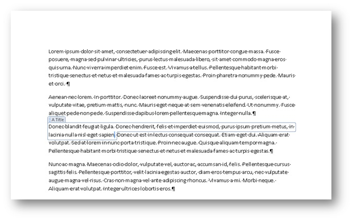
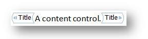
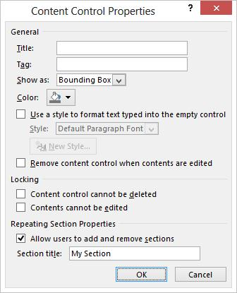
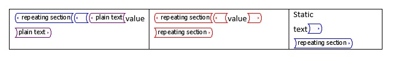
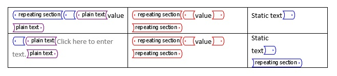

# <a name="content-controls-in-word"></a>Inhaltssteuerelemente in Word

Erfahren Sie, wie Microsoft Word 2013-Inhaltssteuerelemente eine größere Palette von strukturierten Dokumentszenarien ermöglichen.

Dieses Thema enthält Informationen zu Änderungen an Inhaltssteuerelementen in Microsoft Word 2013 und zu den Dokumentszenarien, die durch diese Änderungen ermöglicht werden.
  
### <a name="structured-documents"></a>Strukturierte Dokumente
<a name="WordCC_StructuredDocs"> </a>

Strukturierte Dokumente sind Dokumente, die steuern, an welchen Stellen welche Art von Inhalten in einem Dokument angezeigt und ob Inhalte bearbeitet werden können.
  
Im Folgenden finden Sie einige typische Szenarien für strukturierte Inhalte in Microsoft Word:
  
- Eine Anwaltskanzlei muss Dokumente erstellen, die juristische Fachsprache enthalten, die nicht vom Benutzer geändert werden sollte.
    
- Ein Unternehmen muss ein Deckblatt für ein Angebot erstellen, in dem nur der Titel, der Autor und das Datum vom Benutzer eingegeben werden.
    
- Ein Unternehmen muss Rechnungen erstellen, in denen die Kundendaten in vordefinierten Bereichen der Rechnung enthalten sind.
    
### <a name="using-content-controls-to-structure-a-document"></a>Verwenden von Inhaltssteuerelementen zum Strukturieren eines Dokuments
<a name="WordCC_StructuredDocs"> </a>

Inhaltssteuerelemente sind Microsoft Word-Einheiten, die als Container für bestimmte Inhalte in einem Dokument dienen. Einzelne Inhaltssteuerelemente können Inhalte wie Datumsangaben, Listen oder Absätze mit formatiertem Text enthalten. Inhaltssteuerelemente helfen Ihnen, umfassende strukturierte Inhaltsblöcke zu erstellen und sind für die Verwendung in Vorlagen vorgesehen, die fest umrissene Blöcke in Ihre Dokumente einfügen und so strukturierte Dokumente erstellen.
  
Inhaltssteuerelemente sind ideal für das Erstellen strukturierter Dokumente geeignet, da sie Sie dabei unterstützen, die Position von Inhalten festzulegen, die Art von Inhalten anzugeben (z. B. ein Datum, ein Bild oder Text), die Bearbeitung einzuschränken oder zu ermöglichen und Inhalten eine semantische Bedeutung hinzuzufügen.
  
### <a name="content-controls-in-word-2010"></a>Inhaltssteuerelemente in Word 2010
<a name="WordCC_StructuredDocs"> </a>

Die folgenden Inhaltssteuerelemente stehen in Word 2010 zur Verfügung:
  
- Rich-Text
    
- Nur-Text
    
- Bild
    
- Bausteinkatalog
    
- Kombinationsfeld
    
- Dropdownliste
    
- Datum
    
- Kontrollkästchen
    
- Gruppe
    
Word 2010-Inhaltssteuerelemente ermöglichen verschiedene potenzielle strukturierte Dokumentlösungen, aber mit den Inhaltssteuerelementen in Word 2013 ist eine breitere Palette an Szenarien möglich.
  
## <a name="content-control-improvements-in-word-2013"></a>Verbesserungen bei den Inhaltssteuerelementen in Word 2013
<a name="WordCC_WhatsNew"> </a>

In Word 2013 werden drei wesentliche Verbesserungen für Inhaltssteuerelemente bereitgestellt: verbesserte Visualisierung, Unterstützung für die XML-Zuordnung für Rich-Text-Inhaltssteuerelemente und ein neues Inhaltssteuerelement für wiederholte Inhalte.
  
### <a name="improved-visualization"></a>Verbesserte Visualisierung

In Word 2013 kann ein einzelnes Inhaltssteuerelement in einem von drei möglichen Zuständen angezeigt werden:
  
- Umgebendes Feld
    
- Start/Ende-Tags
    
- Keine
    
> [!NOTE]
> Wenn nicht anders angegeben, gilt für die Darstellung der Visualisierung von Inhaltssteuerelementen in diesem Abschnitt, dass das Dokument nicht im **Entwurfsmodus** angezeigt wird. Sie legen den Anzeigemodus für ein Inhaltssteuerelement über das Dropdownlisten-Steuerelement **Anzeigen als** im Dialogfeld **Eigenschaften von Inhaltssteuerelementen** fest. 
  
**Abbildung 1: Das Dialogfeld "Eigenschaften von Inhaltssteuerelementen"**


  
Sie können den Anzeigemodus für ein Inhaltssteuerelement auch über das Word 2013-Objektmodell festlegen (das später unter [Neue Word 2013-Inhaltssteuerungs-Objektmodellelemente](#WordCC_NewOM) erläutert wird).
  
### <a name="bounding-box"></a>Umgebendes Feld
<a name="WordCC_DefaultRendering"> </a>

Die Standardwiedergabe für Inhaltssteuerelemente in Word 2013 besteht darin, das Aussehen von Inhaltssteuerelementen wie in Word 2007 und Word 2010 beizubehalten, das heißt, sie als umgebendes Feld anzuzeigen. Wenn die Anzeige des Inhaltssteuerelements als **Umgebenden Feld** festgelegt ist, ändert sich die Anzeige je nach folgender Benutzerinteraktion:
  
- Wenn das Inhaltssteuerelement nicht im Fokus steht, findet keine Visualisierung statt.
    
- Wenn Sie den Mauszeiger über das Inhaltssteuerelement bewegen, wird es als schattiertes Rechteck angezeigt.
    
**Abbildung 2: Inhaltssteuerelement, wenn der Mauszeiger darüber bewegt wird**


  
- Wenn das Inhaltssteuerelement im Fokus steht (wenn der Benutzer das Inhaltssteuerelement auswählt), wird das Steuerelement als „umgebendes Feld“ angezeigt (mit einer Linie um den Inhalt und angezeigtem Titel, wenn ein Titel festgelegt wurde).
    
**Abbildung 3: Inhaltssteuerelement mit Fokus**


  
### <a name="startend-tags"></a>Start/Ende-Tags
<a name="WordCC_StartEndTags"> </a>

Wenn die Anzeige des Inhaltssteuerelements als **Start/Ende-Tag** festgelegt ist, werden die Tags unabhängig von der Benutzerinteraktion angezeigt, und der Titel wird nicht angezeigt. Wenn Sie den Mauszeiger darüber bewegen, werden jedoch Schaltflächen, z. B. die Schaltfläche **Dropdownliste** angezeigt. 
  
**Abbildung 4: Anzeige von Inhaltssteuerelementen als Start/Ende-Tags**


  
### <a name="none"></a>Keine
<a name="WordCC_Invisible"> </a>

Wenn die Anzeige des Inhaltssteuerelements auf **Keine** festgelegt ist, wird das Inhaltssteuerelement nicht angezeigt.
  
### <a name="content-control-colorization"></a>Farbgebung für Inhaltssteuerelemente
<a name="WordCC_CCColorization"> </a>

Word 2013 ermöglicht nicht nur eine andere Art der Darstellung für ein Inhaltssteuerelement, sondern hilft Ihnen auch, die Farbe für ein individuelles Inhaltssteuerelement festzulegen. Sie legen die Farbe eines Inhaltssteuerelements mithilfe der Schaltfläche **Farbe** im Dialogfeld **Eigenschaften von Inhaltssteuerelementen** fest. 
  
Sie können die Farbe für ein Inhaltssteuerelement auch über das Word 2013-Objektmodell festlegen (das später unter [Neue Word 2013-Inhaltssteuerungs-Objektmodellelemente](#WordCC_NewOM) erläutert wird).
  
**Abbildung 5: Das Dialogfeld "Eigenschaften von Inhaltssteuerelementen"**


  
### <a name="support-for-xml-mapping-for-rich-text-content-controls"></a>Unterstützung für die XML-Zuordnung für Rich-Text-Inhaltssteuerelemente
<a name="WordCC_XMLMapping"> </a>

Word 2013 unterstützt Sie dabei, den Inhalt von Rich-Text-Inhaltssteuerelementen und Dokumentbaustein-Inhaltssteuerelementen dem XML-Datenspeicher zuzuordnen. Dafür legen Sie die *XML-Zuordnung* für das Inhaltssteuerelement fest. Sie können diese Eigenschaft durch Verwenden der vorhandenen **XMLMapping.SetMapping**-Methode im Objektmodell festlegen. In der benutzerdefinierten XML-Komponente wird der benutzerdefinierte XML-Code als flaches Open XML-Markup gespeichert, das in eine Zeichenfolge konvertiert wird (mithilfe der Standard-XML-Codierung), damit es als Textknoten in der benutzerdefinierten XML-Komponente gespeichert werden kann. Die Zuordnung unterliegt jedoch weiterhin der Einschränkung, dass die Zuordnung nur zu Blattknoten und Attributen erfolgreich durchgeführt werden kann. 
  
> [!NOTE]
> Rich-Text-Inhaltssteuerelemente können keine anderen Rich-Text-Inhaltssteuerelemente enthalten. Wenn eins in einem anderen vorhanden ist (z. B. aufgrund von Dateiformatänderungen, Kopieren und Einfügen usw.), wird das Steuerelement getrennt, bis es nicht mehr in einem zugeordneten Rich-Text-Steuerelement enthalten ist. 
  
Weitere Informationen zum Einrichten der XML-Zuordnung finden Sie im Abschnitt  [Neue Word 2013-Inhaltssteuerelement-Objektmodellelemente](#WordCC_NewOM) weiter unten in diesem Thema. 
  
### <a name="supporting-repeating-content"></a>Unterstützung für wiederholte Inhalte
<a name="WordCC_SupportingRepeating"> </a>

Zusätzlich zu den Verbesserungen bei der Visualisierung und der Unterstützung für die XML-Zuordnung zu Rich-Text-Inhaltssteuerelementen bietet Word 2013 auch ein neues Inhaltssteuerelement, mit dem Sie Inhalte wiederholen können. Das Steuerelement für wiederkehrende Abschnittsinhalte wiederholt den darin enthaltenen Inhalt, einschließlich anderer Inhaltssteuerelemente.
  
Sie fügen das Steuerelement für wiederkehrende Abschnittsinhalte um ganze Absätze oder Tabellenzeilen ein. Nachdem das Steuerelement einen Abschnitt umgibt, können Sie Kopien des Abschnitts über oder unter dem enthaltenen Abschnitt einfügen.
  
**Abbildung 6: Kontextmenü des Steuerelements für wiederkehrende Abschnittsinhalte**


  
Sie können den eingefügten Abschnitt wiederholen, indem Sie entweder das Steuerelement am Ende des Inhaltssteuerelements verwenden (angezeigt als Schaltfläche mit einem Pluszeichen ()) oder indem Sie einen Befehl im Kontextmenü auswählen, wie in Abbildung 6 gezeigt. Der wiederkehrende Inhalt wird zu einem separaten Abschnitt des Steuerelements, dem Sie über das Dialogfeld **Eigenschaften von Inhaltssteuerelementen** einen Titel zuweisen können. 
  
**Abbildung 7: Zuweisen eines Abschnittstitels im Dialogfeld "Eigenschaften von Inhaltssteuerelementen"**


  
Nachdem Sie dem Abschnitt einen Titel gegeben haben, können Benutzer den Abschnitt nach Namen hinzufügen oder löschen, wenn Sie die Option **Benutzern das Hinzufügen und Entfernen von Abschnitten erlauben** im Dialogfeld **Eigenschaften von Inhaltssteuerelementen** auswählen. 
  
**Abbildung 8: Verwenden des Kontextmenüs des Steuerelements für wiederkehrende Abschnittsinhalte zum Löschen eines Abschnitts**


  
Wenn ein wiederkehrender Abschnitt andere Inhaltssteuerelemente umgibt, werden die eingeschlossenen Inhaltssteuerelemente in jedem neuen Element wiederholt. Allerdings werden bei solchen Inhaltssteuerelementen die Inhalte auf Platzhaltertext zurückgesetzt. Es gibt zwei Ausnahmen, bei denen untergeordnete Steuerelementinhalte beibehalten werden: 
  
- Wenn ein untergeordnetes Steuerelement ein Steuerelement für wiederkehrende Abschnitte ist.
    
- Wenn ein untergeordnetes Steuerelement per XML einem Knoten außerhalb des Steuerelements für wiederkehrende Abschnittsinhalte zugeordnet ist.
    
**Abbildung 9: Steuerelement für wiederkehrende Abschnittsinhalte mit untergeordneten Steuerelementen vor Wiederholung**


  
**Abbildung 10: Steuerelement für wiederkehrende Abschnittsinhalte mit untergeordneten Steuerelementen nach Wiederholung**


  
### <a name="repeating-section-content-controls-around-xml-mapped-controls"></a>Steuerelemente für wiederkehrende Abschnittsinhalte rund um per XML zugeordnete Steuerelemente
<a name="WordCC_RepeatingSectionCCs"> </a>

XML-Zuordnungen, die in einem wiederholten Abschnitt enthalten sind, werden von Word 2013 wie folgt zugeordnet.
  
Wenn sich die Zuordnung nicht mit einem Element in dem Knoten überschneidet, der als Teil seiner übergeordneten Kette festgelegt ist, ist die Bindung eine "absolute Bindung" und zeigt denselben Inhalt in allen wiederholten Abschnittsinhalten an.
  
Wenn sich die Zuordnung mit einem Element in dem Knoten überschneidet, der als Teil seiner übergeordneten Kette festgelegt ist, ist die Bindung eine "relative Bindung" und wird wie folgt erneut zugeordnet:
  
- Die absolute Bindung für den Knoten wird bestimmt (dabei werden alle Abfrageausdrücke vereinfacht) – dies sollte bei der anfänglichen Zuordnung stattfinden.
    
- Die Achse der Bindung, die sich mit dem festgelegten Knoten überschneidet, wird entfernt.
    
- Der restliche Teil des XPath-Ausdrucks wird relativ zum XPath des wiederholten Abschnittsinhaltselements ausgewertet.
    
Beispielsweise könnten die folgenden Zuordnungen auftreten:
  
- Der wiederholte Abschnitt wird \root\next\path zugeordnet.
    
- Das Steuerelement im Beispielelement wird \root\next\path[2]\baz zugeordnet.
    
- Word ordnet \root\next\path[2] einem Element im Knotensatz zu.
    
Die Bindung wird daher als .\baz ausgewertet, wobei die Basis der Knoten des wiederholten Inhaltselements ist.
  
Die folgenden Vorschläge für das Arbeiten mit Steuerelementen für wiederkehrende Inhalte können dazu beitragen, Datenverluste und Frustration zu vermeiden.
  
### <a name="working-with-repeating-section-content-controls-that-are-mapped-to-xml-data"></a>Arbeiten mit Steuerelementen für wiederkehrende Abschnittsinhalte, die XML-Daten zugeordnet sind
<a name="WordCC_RepeatingSectionCCs"> </a>

Wenn Sie ein Steuerelement für wiederkehrende Abschnittsinhalte einfügen, das XML-Daten zugeordnet ist, erstellt Word jedes Mal, wenn der Benutzer das Dokument neu öffnet, die wiederholten Abschnittselemente basierend auf den Informationen im Datenspeicher neu. Selbst wenn Sie das Dokument speichern, gehen alle Änderungen, die der Benutzer in den wiederholten Abschnittselementen im Dokument vornimmt, die nicht auch im Datenspeicher zugeordnet sind, verloren.
  
Um dies zu verhindern, sollten Sie das Steuerelement für wiederkehrende Abschnittsinhalte sperren und für den Benutzer nur das Bearbeiten in nicht gesperrten untergeordneten Inhaltssteuerelementen erlauben, die ebenfalls dem XML-Code zugeordnet sind.
  
### <a name="binding-a-repeating-section-content-control-to-a-table"></a>Binden eines Steuerelements für wiederkehrende Abschnittsinhalte zu einer Tabelle
<a name="WordCC_RepeatingSectionCCs"> </a>

Wenn Sie ein Steuerelement für wiederkehrende Abschnittsinhalte zu einer Tabelle binden möchten, fügen Sie die Tabelle und *dann* das Steuerelement für wiederkehrende Abschnittsinhalte ein, nicht umgekehrt. (Andernfalls können Sie nicht nur die Tabelle auswählen). 
  
### <a name="nesting-repeating-section-content-controls-within-a-table"></a>Schachtelung von Steuerelementen für wiederkehrende Abschnittsinhalte innerhalb einer Tabelle
<a name="WordCC_RepeatingSectionCCs"> </a>

Das Schachteln von Steuerelementen für wiederkehrende Abschnittsinhalte innerhalb einer Tabelle (wenn sich beispielsweise das Ende des übergeordneten und des untergeordneten Steuerelements für wiederkehrende Abschnittsinhalte in derselben Zelle befindet) bewirkt, dass der äußere wiederholte Abschnitt gelöscht wird, wenn dem inneren Abschnitt ein Element hinzugefügt oder ein Element daraus entfernt wird.
  
Sie können dies verhindern, indem Sie eine Absatzmarkierung zwischen dem Ende eines Steuerelements für wiederkehrende Abschnittsinhalte und dem nächsten hinzufügen. Zum Ausblenden der Absatzmarkierung deaktivieren Sie auf der Registerkarte **Start** des Menübands die Option **Ein-/Ausblenden**. 
  
### <a name="open-xml-file-format-schema-additions"></a>Erweiterungen für das Open XML-Dateiformatschema
<a name="WordCC"> </a>

Die folgenden Elemente wurden zum Open XML-WordprocessingML-Dateiformatschema hinzugefügt.
  
**Tabelle 1: Neue Elemente im Open XML-WordprocessingML-Dateiformatschema für Inhaltssteuerelemente**

|**Element**|**Beschreibung**|
|:-----|:-----|
|\<w:appearance\>  <br/> |\<w:appearance\> ist ein untergeordnetes Element von \<w:sdtPr\>.  <br/> Die folgenden Werte sind für das val-Attribut gültig:  <br/> \<w:appearance val= boundingBox|tags|hidden.  <br/> Der Standardwert ist boundingBox.  <br/> |
|\<w:color\>  <br/> |\<w:color\> ist ein untergeordnetes Element von \<w:sdtPr\>.  <br/> Das Inhaltsmodell stimmt mit dem vorhandenen komplexen CT_Color-Typ überein. Der Standardwert ist die in Word 2010 verwendete Farbe.  <br/> |
   
## <a name="new-word-2013-content-control-object-model-members"></a>Neue Word 2013-Inhaltssteuerungs-Objektmodellelemente
<a name="WordCC_NewOM"> </a>

Mit den neuen Verbesserungen und Ergänzungen zu Inhaltssteuerelementen in Word 2013 wurde das Objektmodell für Word aktualisiert, um die programmgesteuerte Manipulation der neuen Funktionen zu ermöglichen. Darüber hinaus wurde auch das zugrunde liegende Open XML-Dateiformat für Textverarbeitungsdokumente geändert.
  
In den folgenden Abschnitten finden Sie weitere Informationen zu den speziellen Objektmodelländerungen im Zusammenhang mit der jeweiligen Inhaltssteuerelementverbesserung.
  
### <a name="visualization-enhancements"></a>Verbesserungen der Visualisierung
<a name="WordCC_VisEnhancements"> </a>

Word 2013 beinhaltet mehrere Objektmodellergänzungen für die Verbesserung der Visualisierung von Inhaltssteuerelementen. In der folgenden Tabelle sind neue Elemente des **ContentControl**-Objekts für die Visualisierung aufgeführt. 
  
**Tabelle 2: Neue ContentControl-Objektelemente**

|**Element**|**Beschreibung**|
|:-----|:-----|
|. .**Appearance** als **WdContentControlAppearance** <br/> |Ruft die Visualisierung des Inhaltssteuerelements ab oder legt sie fest.  <br/> |
|. **Color** als **WdColor** <br/> |Ruft die Farbe des Inhaltssteuerelements ab oder legt sie fest.  <br/> |
   
In der folgenden Tabelle sind Konstanten in der neuen **WdContentControlAppearance**-Enumeration aufgeführt. 
  
**Tabelle 3: Neue WdContentControlAppearance-Enumerationskonstanten**

|**Konstante**|**Beschreibung**|
|:-----|:-----|
|**wdContentControlBoundingBox** <br/> |Stellt ein Inhaltssteuerelement dar, das als schattiertes Rechteck/umgebendes Feld angezeigt wird (mit optionalem Titel).  <br/> |
|**wdContentControlTags** <br/> |Stellt ein Inhaltssteuerelement dar, das als Start/Ende-Markierung angezeigt wird.  <br/> |
|**wdContentControlHidden** <br/> |Stellt ein Inhaltssteuerelement dar, das nicht angezeigt wird.  <br/> |
   
### <a name="code-sample"></a>Codebeispiel
<a name="WordCC_VisEnhancements"> </a>

Das folgende Codebeispiel zeigt, wie Rich-Text-Inhaltssteuerelemente erstellt werden und die Visualisierung programmgesteuert festgelegt wird.
  
```vb
Sub testVisualization()
   Dim objcc As ContentControl
   Dim objRange As Range
   
   ' Get the first paragraph as a range object.
   Set objRange = ActiveDocument.Paragraphs(1).Range
   ' Create a rich text content control around the first paragraph.
   Set objcc = ActiveDocument.ContentControls.Add(wdContentControlRichText, objRange)
   objcc.Title = "Default Bounding Box"
   ' Set visualization to the default.
   objcc.Appearance = wdContentControlBoundingBox
   
   ' Create a new paragraph.
   objRange.InsertParagraphAfter
   Set objRange = ActiveDocument.Paragraphs(2).Range
   ' Create a rich text content control around the second paragraph.
   Set objcc = ActiveDocument.ContentControls.Add(wdContentControlRichText, objRange)
   objcc.Title = "Non Bounding"
   ' Set visualization to invisible.
   objcc.Appearance = wdContentControlHidden
   
   ' Create a new paragraph.
   objRange.InsertParagraphAfter
   Set objRange = ActiveDocument.Paragraphs(3).Range
   ' Create a rich text content control around the third paragraph.
   Set objcc = ActiveDocument.ContentControls.Add(wdContentControlRichText, objRange)
   objcc.Title = "Tags Only with Pink color"
   ' Set visualization to Start/End tags with pink color.
   objcc.Appearance = wdContentControlTags
   objcc.Color = wdColorPink
End Sub
```

### <a name="xml-mapping"></a>XML-Zuordnung
<a name="WordCC_XMLMappingOM"> </a>

Es wurden keine Ergänzungen am Word 2013-Objektmodell vorgenommen, um die Rich-Text-Zuordnung zu XML-Knoten im Dokumentdatenspeicher aufzunehmen. Verwenden Sie stattdessen das vorhandene Objektmodell, um ein Rich-Text-Inhaltssteuerelement einem XML-Knoten im Dokumentdatenspeicher zuzuordnen. Zudem wurden keine Änderungen an dem zugrunde liegenden WordprocessingML-Schema des Open XML-Dateiformats als Teil der neu eingefügten Unterstützung für Rich-Text-Inhaltssteuerelemente speziell für die XML-Zuordnung vorgenommen.
  
#### <a name="code-sample"></a>Codebeispiel

Das folgende Codebeispiel zeigt, wie ein Rich-Text-Inhaltssteuerelement programmgesteuert einem XML-Knoten zugeordnet wird.
  
```vb
Sub testRichBinding()
   Dim objRange As Range
   Dim objcc As ContentControl
   Dim objCustomPart As CustomXMLPart
   Dim blnMap As Boolean
   
   ' Add a custom XML part to the data store.
   Set objCustomPart = ActiveDocument.CustomXMLParts.Add
   ' Load XML fragment into the custom XML part.
   objCustomPart.LoadXML ("<x>Rich Text Databinding</x>")
   ' Get the first paragraph as a range object.
   Set objRange = ActiveDocument.Paragraphs(1).Range
   ' Create a rich text content control around the first paragraph.
   Set objcc = ActiveDocument.ContentControls.Add(wdContentControlRichText, objRange)
   ' Bind the XML node to the rich text content control.
   blnMap = objcc.XMLMapping.SetMapping("/x")
   ' Return whether mapping worked.
   MsgBox objcc.XMLMapping.IsMapped
End Sub
```

### <a name="repeating-section-content-controls-represented-in-the-object-model"></a>Im Objektmodell dargestellte Steuerelemente für wiederkehrende Abschnittsinhalte
<a name="WordCC_RepeatingSection"> </a>

Das Steuerelement für wiederkehrende Abschnittsinhalte steht im Objektmodell zur Verfügung, indem Sie die folgenden Ergänzungen für das **ContentControl**-Objekt und die neuen **RepeatingSectionItem**- und **RepeatingSectionItemColl**-Objekte verwenden. In Tabelle 4 sind die wichtigsten neuen Elemente des **ContentControl**-Objekts für Steuerelemete für wiederkehrende Abschnittsinhalte aufgeführt. 
  
**Tabelle 4: ContentControl-Objektelemente**

|**Element**|**Beschreibung**|
|:-----|:-----|
|**AllowInsertDeleteSection** als **Boolean** <br/> |Ruft ab oder legt fest, ob Benutzer Abschnitte mithilfe der Benutzeroberfläche zum Inhaltssteuerelement hinzufügen oder daraus entfernen können. Wenn diese Eigenschaft für ein Steuerelement aufgerufen wird, das nicht dem Abschnittsinhaltstyp entspricht, schlägt der Aufruf mit der folgenden Fehlermeldung fehl: "Diese Eigenschaft kann nur mit Inhaltssteuerelementen für wiederholte Abschnitte verwendet werden."  <br/> |
|**RepeatingSectionItemTitle** als **String** <br/> |Ermöglicht das Abrufen oder Festlegen des Namens von wiederholten Abschnittselementen, der im Kontextmenü verwendet wird. Wenn diese Eigenschaft für ein Steuerelement aufgerufen wird, das nicht dem Abschnittsinhaltstyp entspricht, schlägt der Aufruf mit der folgenden Fehlermeldung fehl: "Diese Eigenschaft kann nur mit Inhaltssteuerelementen für wiederholte Abschnitte verwendet werden."  <br/> |
|**InsertRepeatingSectionItemBefore** als **ContentControl** <br/> |Fügt ein wiederholtes Abschnittselement vor dem aktuellen Element hinzu und gibt das neue wiederholte Abschnittselement zurück. Wenn diese Methode für ein Steuerelement aufgerufen wird, das nicht dem Typ wiederholtes Abschnittselement entspricht, schlägt der Aufruf mit der folgenden Fehlermeldung fehl: "Diese Eigenschaft kann nur mit Inhaltssteuerelementen für wiederholte Abschnittselement verwendet werden."  <br/> |
|**InsertRepeatingSectionItemAfter** als **ContentControl** <br/> |Fügt ein wiederholtes Abschnittselement nach dem aktuellen Element hinzu und gibt das neue wiederholte Abschnittselement zurück. Wenn diese Methode für ein Steuerelement aufgerufen wird, das nicht dem Typ wiederholtes Abschnittselement entspricht, schlägt der Aufruf mit der folgenden Fehlermeldung fehl: "Diese Eigenschaft kann nur mit Inhaltssteuerelementen für wiederholte Abschnittselement verwendet werden."  <br/> |
   
In Tabelle 5 sind die wichtigsten Elemente des **RepeatingSectionItem**-Objekts aufgeführt. 
  
**Tabelle 5: RepeatingSectionItem-Objektelemente**

|**Element**|**Beschreibung**|
|:-----|:-----|
|**Range** als **Range** <br/> |Gibt den Bereich des angegebenen wiederholten Abschnittselements ohne Start- und Ende-Tags zurück.  <br/> |
|**Delete** <br/> |Löscht das angegebene wiederholte Abschnittselement.  <br/> |
|**InsertItemAfter** als **RepeatingSectionItem** <br/> |Fügt ein wiederholtes Abschnittselement nach dem angegebenen Element hinzu und gibt das neue Element zurück.  <br/> |
|**InsertItemBefore** als **RepeatingSectionItem** <br/> |Fügt ein wiederholtes Abschnittselement vor dem angegebenen Element hinzu und gibt das neue Element zurück.  <br/> |
   
In Tabelle 6 sind die wichtigsten Elemente des **RepeatingSectionItemColl**-Objekts aufgeführt. 
  
**Tabelle 6: RepeatingSectionItemColl-Objektelemente**

|**Element**|**Beschreibung**|
|:-----|:-----|
|**Item** als **RepeatingSectionItem** <br/> |Gibt ein einzelnes wiederholtes Abschnittselement zurück.  <br/> |
   
In Tabelle 7 ist das neue Element der **WdContentControlType**-Enumeration für Steuerelemente für wiederkehrende Abschnittsinhalte gezeigt. 
  
**Tabelle 7: WdContentControlType-Enumerationsergänzung**

|**Konstante**|**Beschreibung**|
|:-----|:-----|
|**wdContentControlRepeatingSection** <br/> |Stellt ein Inhaltssteuerelement dar, das ein einzelnes Element in einem wiederholten Abschnitt enthält.  <br/> |
   
### <a name="code-sample"></a>Codebeispiel
<a name="WordCC_RepeatingSection"> </a>

Das folgende Codebeispiel zeigt, wie Steuerelemente für wiederkehrende Abschnittsinhalte programmgesteuert verwendet werden.
  
```vb
Sub testRepeatingSectionControl()
   Dim objRange As Range
   Dim objTable As Table
   Dim objCustomPart As CustomXMLPart
   Dim objCC As ContentControl
   Dim objCustomNode As CustomXMLNode
   
   Set objCustomPart = ActiveDocument.CustomXMLParts.Add
   objCustomPart.LoadXML ("<books>" & _
       "<book><title>Everyday Italian</title>" & _
       "<author>Giada De Laurentiis</author></book>" & _
       "<book><title>Harry Potter</title>" & _
       "<author>J K. Rowling</author></book>" & _
       "<book><title>Learning XML</title>" & _
       "<author>Erik T. Ray</author></book></books>")
   
   Set objRange = ActiveDocument.Paragraphs(1).Range
   Set objTable = ActiveDocument.Tables.Add(objRange, 2, 2)
   With objTable.Borders
       .InsideLineStyle = wdLineStyleSingle
       .OutsideLineStyle = wdLineStyleDouble
   End With
   Set objRange = objTable.Cell(1, 1).Range
   Set objCustomNode = objCustomPart.SelectSingleNode("/books[1]/book[1]/title[1]")
   Set objCC = ActiveDocument.ContentControls.Add(wdContentControlText, objRange)
   objCC.XMLMapping.SetMappingByNode objCustomNode
   Set objRange = objTable.Cell(1, 2).Range
   Set objCustomNode = objCustomPart.SelectSingleNode("/books[1]/book[1]/author[1]")
   Set objCC = ActiveDocument.ContentControls.Add(wdContentControlText, objRange)
   objCC.XMLMapping.SetMappingByNode objCustomNode
   Set objRange = objTable.Rows(1).Range
   Set objCC = ActiveDocument.ContentControls.Add(wdContentControlRepeatingSection, objRange)
   objCC.XMLMapping.SetMapping ("/books[1]/book")
End Sub
```

### <a name="open-xml-file-format-changes-for-repeating-section-content-controls"></a>Open XML-Dateiformatänderungen für Steuerelemente für wiederkehrende Abschnittsinhalte
<a name="WordCC_RepeatingSection"> </a>

Die Dateiformatdarstellung eines Steuerelements für wiederkehrende Abschnittsinhalte verwendet in der Regel dieselben Elementnamen, Werte usw. wie das vorhandene XML-Markup. Allerdings ist das \<sdt\>-Element, das den äußeren wiederholten Abschnittscontainer darstellt, im Word 2013-Namespace vorhanden, um die Kompatibilität mit früheren Versionen von Word sicherzustellen.
  
Die einzelnen wiederholten Elemente im Steuerelement für wiederkehrende Abschnittsinhalte (die jedes einzelnes Element umgeben) werden über die vorhandene WordprocessingML-Darstellung als Rich-Text-Inhaltssteuerelemente gespeichert. In Tabelle 8 sind die neuen Elemente im WordprocessingML-Schema für Steuerelemente für wiederkehrende Abschnittsinhalte aufgeführt.
  
**Tabelle 8: Neue Elemente im WordprocessingML-Schema für Steuerelemente für wiederkehrende Abschnittsinhalte**

|**Element**|**Beschreibung**|
|:-----|:-----|
|\<w15:repeatingSection\>  <br/> |Gibt ein Steuerelement für wiederkehrende Abschnittsinhalte an. Dieses Element schließt sich mit allen anderen Steuerelementtypen gegenseitig aus und verfügt nicht über untergeordnete Elemente oder Attribute.  <br/> |
|\<w15:repeatingSectionItem\>  <br/> |Gibt ein Steuerelement für wiederkehrende Abschnittsinhaltselemente an. Dieses Element schließt sich mit allen anderen Steuerelementtypen gegenseitig aus und verfügt nicht über untergeordnete Elemente oder Attribute.  <br/> |
|\<w15:doNotAllowInsertDeleteSection\>  <br/> |Gibt an, dass der Benutzer keine Abschnitte mithilfe der Benutzeroberfläche in Word 2013 hinzufügen oder löschen kann.  <br/> |
|\<w15:sectionTitle\>  <br/> |Gibt den Namen von wiederholten Abschnittselementen an (und wird im Kontextmenü verwendet, wenn das Steuerelement ausgewählt wird).  <br/> |
   

  

